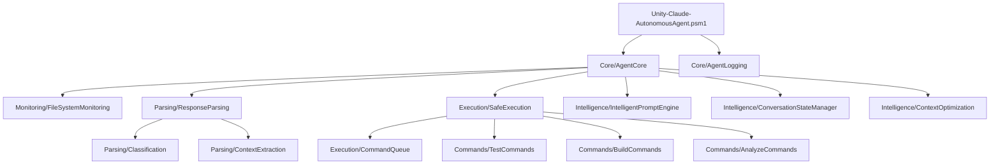

# Unity-Claude-AutonomousAgent Module Refactoring Plan
*Date: 2025-08-18*
*Current Size: 2250+ lines*
*Goal: Split into maintainable, focused sub-modules*

## Current Module Structure Analysis

The Unity-Claude-AutonomousAgent.psm1 has grown to over 2250 lines and contains:
- Day 1: FileSystemWatcher and response monitoring
- Day 2: Response parsing and classification
- Day 3: Safe command execution framework
- Day 4-6: Unity command implementations (TEST, BUILD, ANALYZE)
- Day 7: Integration components
- Day 8: Intelligent prompt generation (separate module)
- Day 9: Conversation state management (separate module)
- Day 10: Context optimization (separate module)

## Proposed Module Structure

```
Unity-Claude-AutonomousAgent\
├── Unity-Claude-AutonomousAgent.psd1  # Main manifest
├── Unity-Claude-AutonomousAgent.psm1  # Main loader (slim)
├── Core\
│   ├── AgentCore.psm1              # Core configuration and state (~200 lines)
│   ├── AgentLogging.psm1           # Logging functions (~150 lines)
│   └── AgentUtilities.psm1         # Common utilities (~200 lines)
├── Monitoring\
│   ├── FileSystemMonitoring.psm1   # FileSystemWatcher (~300 lines)
│   └── ResponseMonitoring.psm1     # Claude response detection (~250 lines)
├── Parsing\
│   ├── ResponseParsing.psm1        # Parse Claude responses (~400 lines)
│   ├── Classification.psm1         # Response classification (~300 lines)
│   └── ContextExtraction.psm1      # Extract conversation context (~250 lines)
├── Execution\
│   ├── SafeExecution.psm1          # Constrained runspace (~350 lines)
│   ├── CommandQueue.psm1           # Command queue management (~200 lines)
│   └── CommandValidation.psm1      # Parameter validation (~250 lines)
├── Commands\
│   ├── TestCommands.psm1           # Unity TEST automation (~300 lines)
│   ├── BuildCommands.psm1          # Unity BUILD automation (~300 lines)
│   └── AnalyzeCommands.psm1        # Unity ANALYZE automation (~300 lines)
├── Intelligence\
│   ├── IntelligentPromptEngine.psm1     # Already separate (1400+ lines)
│   ├── ConversationStateManager.psm1    # Already separate (600+ lines)
│   └── ContextOptimization.psm1         # Already separate (650+ lines)
└── Integration\
    ├── ClaudeIntegration.psm1      # Claude CLI/API integration (~250 lines)
    └── UnityIntegration.psm1       # Unity-specific helpers (~200 lines)
```

## Benefits of Refactoring

1. **Maintainability**: Each module focuses on a single responsibility
2. **Testability**: Easier to test individual components
3. **Reusability**: Modules can be used independently
4. **Performance**: Only load needed modules
5. **Collaboration**: Multiple developers can work on different modules
6. **Documentation**: Easier to document focused modules

## Implementation Strategy

### Phase 1: Create Module Structure
1. Create directory structure
2. Create individual .psm1 files
3. Move functions to appropriate modules
4. Update internal references

### Phase 2: Update Loading Mechanism
1. Modify main Unity-Claude-AutonomousAgent.psm1 to load sub-modules
2. Update module manifest with nested modules
3. Ensure proper export of functions

### Phase 3: Test and Validate
1. Verify all functions are accessible
2. Run existing test suites
3. Check performance impact
4. Update documentation

## Module Dependencies



## Example: Refactored Main Module

```powershell
# Unity-Claude-AutonomousAgent.psm1 (Refactored - ~100 lines)
# Main loader module that imports all sub-modules

# Module version
$script:ModuleVersion = "2.0.0"

# Import sub-modules
$subModules = @(
    "Core\AgentCore.psm1",
    "Core\AgentLogging.psm1",
    "Core\AgentUtilities.psm1",
    "Monitoring\FileSystemMonitoring.psm1",
    "Monitoring\ResponseMonitoring.psm1",
    "Parsing\ResponseParsing.psm1",
    "Parsing\Classification.psm1",
    "Parsing\ContextExtraction.psm1",
    "Execution\SafeExecution.psm1",
    "Execution\CommandQueue.psm1",
    "Execution\CommandValidation.psm1",
    "Commands\TestCommands.psm1",
    "Commands\BuildCommands.psm1",
    "Commands\AnalyzeCommands.psm1",
    "Intelligence\IntelligentPromptEngine.psm1",
    "Intelligence\ConversationStateManager.psm1",
    "Intelligence\ContextOptimization.psm1",
    "Integration\ClaudeIntegration.psm1",
    "Integration\UnityIntegration.psm1"
)

foreach ($module in $subModules) {
    $modulePath = Join-Path $PSScriptRoot $module
    if (Test-Path $modulePath) {
        . $modulePath
    } else {
        Write-Warning "Sub-module not found: $module"
    }
}

# Module initialization
Initialize-AgentCore
Write-AgentLog "Unity-Claude-AutonomousAgent v$script:ModuleVersion loaded" -Level "INFO"
```

## Migration Checklist

- [ ] Create directory structure
- [ ] Split AgentCore functions
- [ ] Split Logging functions
- [ ] Split Monitoring functions
- [ ] Split Parsing functions
- [ ] Split Execution functions
- [ ] Split Command functions
- [ ] Update main loader module
- [ ] Update module manifest
- [ ] Test all functions
- [ ] Update documentation
- [ ] Run integration tests

## Risk Mitigation

1. **Backward Compatibility**: Keep function names and signatures unchanged
2. **Testing**: Run comprehensive tests after each module split
3. **Rollback Plan**: Keep original module as backup
4. **Gradual Migration**: Split one category at a time
5. **Documentation**: Update all references in docs

## Expected Outcome

- Individual modules under 400 lines each (except Intelligence modules)
- Clear separation of concerns
- Improved maintainability score
- Faster load times for selective imports
- Easier debugging and testing