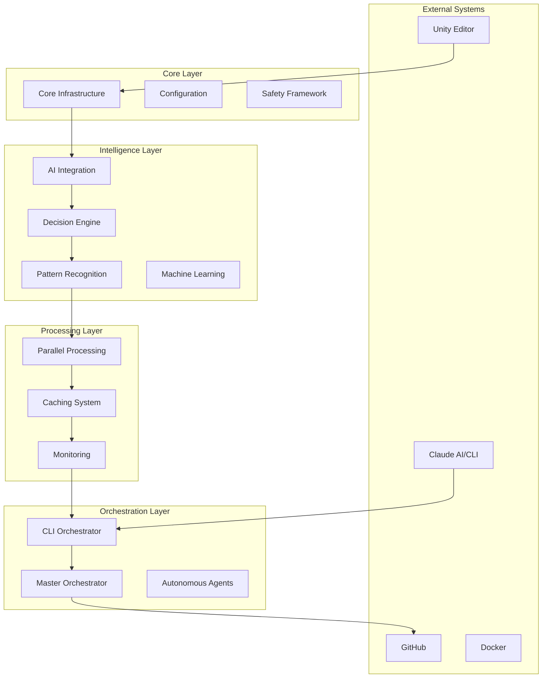

# Unity-Claude Automation System - Hybrid Semantic Documentation

**Generated:** 2025-08-31 01:24:07  
**Total Modules:** 377  
**AI-Enhanced Modules:** 10  
**Pattern-Based Modules:** 377  
**Total Functions:** 3951

## 📑 Table of Contents

1. [System Overview](#-system-overview)
2. [Architecture](#-architecture)
3. [Module Categories](#-module-categories)
4. [Critical Modules (AI-Enhanced)](#-critical-modules-ai-enhanced)
5. [Standard Modules](#-standard-modules)
6. [Module Network](#-module-network)

---

## 🎯 System Overview

The Unity-Claude Automation System is a sophisticated PowerShell-based framework that bridges Unity game development with Claude AI capabilities. This hybrid documentation combines AI-powered analysis for critical components with efficient pattern-based documentation for standard modules.

### Documentation Approach

- **🤖 AI-Enhanced**: Critical infrastructure and complex modules analyzed by view-documentation.htm
- **📋 Pattern-Based**: Standard modules documented using intelligent pattern matching
- **🔗 Relationship Mapping**: Automatic dependency and interaction analysis

## 🏗️ Architecture

The system implements a microservices-inspired architecture with these layers:

## 📦 Module Categories

### ⚡ Performance & Processing (1 AI-enhanced)

**Modules:** 27 | **Functions:** 425

- [**ContextOptimization**](#contextoptimization) - [**CPG-ThreadSafeOperations**](#cpg-threadsafeoperations) - [**LLM-ResponseCache**](#llm-responsecache) - [**ParallelizationCore**](#parallelizationcore) - [**ParallelMonitoring**](#parallelmonitoring) - [**ParallelProcessorCore**](#parallelprocessorcore) 🤖 - [**Performance-Cache**](#performance-cache) - [**Performance-IncrementalUpdates**](#performance-incrementalupdates) - [**PerformanceAnalysis**](#performanceanalysis) - [**PerformanceMonitoring**](#performancemonitoring) - [**PerformanceOptimization**](#performanceoptimization) - [**PerformanceOptimizer**](#performanceoptimizer) - [**Unity-Claude-Cache**](#unity-claude-cache) - [**Unity-Claude-Cache-Fixed**](#unity-claude-cache-fixed) - [**Unity-Claude-Cache-Original**](#unity-claude-cache-original) - [**Unity-Claude-ClaudeParallelization**](#unity-claude-claudeparallelization) - [**Unity-Claude-ParallelProcessing**](#unity-claude-parallelprocessing) - [**Unity-Claude-ParallelProcessor**](#unity-claude-parallelprocessor) - [**Unity-Claude-ParallelProcessor-Original**](#unity-claude-parallelprocessor-original) - [**Unity-Claude-ParallelProcessor-Refactored**](#unity-claude-parallelprocessor-refactored) - [**Unity-Claude-PerformanceOptimizer**](#unity-claude-performanceoptimizer) - [**Unity-Claude-PerformanceOptimizer-Original**](#unity-claude-performanceoptimizer-original) - [**Unity-Claude-PerformanceOptimizer-Refactored**](#unity-claude-performanceoptimizer-refactored) - [**Unity-Claude-UnityParallelization**](#unity-claude-unityparallelization) - [**Unity-Claude-UnityParallelization-Original**](#unity-claude-unityparallelization-original) - [**Unity-Claude-UnityParallelization-Refactored**](#unity-claude-unityparallelization-refactored) - [**UnityPerformanceAnalysis**](#unityperformanceanalysis) 
### 🎮 Unity Integration (1 AI-enhanced)

**Modules:** 168 | **Functions:** 2094

- [**CompilationIntegration**](#compilationintegration) - [**Unity-Claude-AgentIntegration**](#unity-claude-agentintegration) - [**Unity-Claude-AIAlertClassifier**](#unity-claude-aialertclassifier) - [**Unity-Claude-AlertAnalytics**](#unity-claude-alertanalytics) - [**Unity-Claude-AlertFeedbackCollector**](#unity-claude-alertfeedbackcollector) - [**Unity-Claude-AlertMLOptimizer**](#unity-claude-alertmloptimizer) - [**Unity-Claude-AlertQualityReporting**](#unity-claude-alertqualityreporting) - [**Unity-Claude-APIDocumentation**](#unity-claude-apidocumentation) - [**Unity-Claude-AST-Enhanced**](#unity-claude-ast-enhanced) - [**Unity-Claude-AutoGen**](#unity-claude-autogen) - [**Unity-Claude-AutoGenMonitoring**](#unity-claude-autogenmonitoring) - [**Unity-Claude-AutonomousAgent-Refactored**](#unity-claude-autonomousagent-refactored) - [**Unity-Claude-AutonomousDocumentationEngine**](#unity-claude-autonomousdocumentationengine) - [**Unity-Claude-AutonomousStateTracker**](#unity-claude-autonomousstatetracker) - [**Unity-Claude-AutonomousStateTracker-Enhanced**](#unity-claude-autonomousstatetracker-enhanced) - [**Unity-Claude-AutonomousStateTracker-Enhanced-Refactored**](#unity-claude-autonomousstatetracker-enhanced-refactored) - [**Unity-Claude-Cache**](#unity-claude-cache) - [**Unity-Claude-Cache-Fixed**](#unity-claude-cache-fixed) - [**Unity-Claude-Cache-Original**](#unity-claude-cache-original) - [**Unity-Claude-ChangeIntelligence**](#unity-claude-changeintelligence) - [**Unity-Claude-ClaudeParallelization**](#unity-claude-claudeparallelization) - [**Unity-Claude-CLIOrchestrator**](#unity-claude-cliorchestrator) - [**Unity-Claude-CLIOrchestrator-Fixed-Simple**](#unity-claude-cliorchestrator-fixed-simple) - [**Unity-Claude-CLIOrchestrator-FullFeatured**](#unity-claude-cliorchestrator-fullfeatured) - [**Unity-Claude-CLIOrchestrator-Original**](#unity-claude-cliorchestrator-original) - [**Unity-Claude-CLIOrchestrator-Original-Backup**](#unity-claude-cliorchestrator-original-backup) - [**Unity-Claude-CLIOrchestrator-Refactored**](#unity-claude-cliorchestrator-refactored) - [**Unity-Claude-CLIOrchestrator-Refactored-Fixed**](#unity-claude-cliorchestrator-refactored-fixed) - [**Unity-Claude-CLISubmission**](#unity-claude-clisubmission) - [**Unity-Claude-CLISubmission-Enhanced**](#unity-claude-clisubmission-enhanced) - [**Unity-Claude-CodeQL**](#unity-claude-codeql) - [**Unity-Claude-ConcurrentCollections**](#unity-claude-concurrentcollections) - [**Unity-Claude-ConcurrentProcessor**](#unity-claude-concurrentprocessor) - [**Unity-Claude-Core**](#unity-claude-core) 🤖 - [**Unity-Claude-CPG**](#unity-claude-cpg) - [**Unity-Claude-CPG-ASTConverter**](#unity-claude-cpg-astconverter) - [**Unity-Claude-CPG-Original**](#unity-claude-cpg-original) - [**Unity-Claude-CPG-Refactored**](#unity-claude-cpg-refactored) - [**Unity-Claude-CrossLanguage**](#unity-claude-crosslanguage) - [**Unity-Claude-DecisionEngine**](#unity-claude-decisionengine) - [**Unity-Claude-DecisionEngine-Bayesian**](#unity-claude-decisionengine-bayesian) - [**Unity-Claude-DecisionEngine-Original**](#unity-claude-decisionengine-original) - [**Unity-Claude-DecisionEngine-Refactored**](#unity-claude-decisionengine-refactored) - [**Unity-Claude-DocumentationAnalytics**](#unity-claude-documentationanalytics) - [**Unity-Claude-DocumentationAutomation**](#unity-claude-documentationautomation) - [**Unity-Claude-DocumentationAutomation-Original**](#unity-claude-documentationautomation-original) - [**Unity-Claude-DocumentationAutomation-Refactored**](#unity-claude-documentationautomation-refactored) - [**Unity-Claude-DocumentationCrossReference**](#unity-claude-documentationcrossreference) - [**Unity-Claude-DocumentationDrift**](#unity-claude-documentationdrift) - [**Unity-Claude-DocumentationDrift-Refactored**](#unity-claude-documentationdrift-refactored) - [**Unity-Claude-DocumentationPipeline**](#unity-claude-documentationpipeline) - [**Unity-Claude-DocumentationQualityAssessment**](#unity-claude-documentationqualityassessment) - [**Unity-Claude-DocumentationQualityAssessment_Original_20250830_193150**](#unity-claude-documentationqualityassessment-original-20250830-193150) - [**Unity-Claude-DocumentationQualityOrchestrator**](#unity-claude-documentationqualityorchestrator) - [**Unity-Claude-DocumentationSuggestions**](#unity-claude-documentationsuggestions) - [**Unity-Claude-DocumentationVersioning**](#unity-claude-documentationversioning) - [**Unity-Claude-EmailNotifications**](#unity-claude-emailnotifications) - [**Unity-Claude-EmailNotifications-SystemNetMail**](#unity-claude-emailnotifications-systemnetmail) - [**Unity-Claude-ErrorHandling**](#unity-claude-errorhandling) - [**Unity-Claude-Errors**](#unity-claude-errors) - [**Unity-Claude-EventLog**](#unity-claude-eventlog) - [**Unity-Claude-FileMonitor**](#unity-claude-filemonitor) - [**Unity-Claude-FileMonitor-Fixed**](#unity-claude-filemonitor-fixed) - [**Unity-Claude-FixEngine**](#unity-claude-fixengine) - [**Unity-Claude-GitHub**](#unity-claude-github) - [**Unity-Claude-GovernanceIntegration**](#unity-claude-governanceintegration) - [**Unity-Claude-HITL**](#unity-claude-hitl) - [**Unity-Claude-HITL-Original**](#unity-claude-hitl-original) - [**Unity-Claude-HITL-Refactored**](#unity-claude-hitl-refactored) - [**Unity-Claude-IncrementalProcessor**](#unity-claude-incrementalprocessor) - [**Unity-Claude-IncrementalProcessor-Fixed**](#unity-claude-incrementalprocessor-fixed) - [**Unity-Claude-IntegratedWorkflow**](#unity-claude-integratedworkflow) - [**Unity-Claude-IntegratedWorkflow-Original**](#unity-claude-integratedworkflow-original) - [**Unity-Claude-IntegratedWorkflow-Refactored**](#unity-claude-integratedworkflow-refactored) - [**Unity-Claude-IntegrationEngine**](#unity-claude-integrationengine) - [**Unity-Claude-IntelligentAlerting**](#unity-claude-intelligentalerting) - [**Unity-Claude-IntelligentDocumentationTriggers**](#unity-claude-intelligentdocumentationtriggers) - [**Unity-Claude-IPC**](#unity-claude-ipc) - [**Unity-Claude-IPC-Bidirectional**](#unity-claude-ipc-bidirectional) - [**Unity-Claude-IPC-Bidirectional-Fixed**](#unity-claude-ipc-bidirectional-fixed) - [**Unity-Claude-LangGraphBridge**](#unity-claude-langgraphbridge) - [**Unity-Claude-Learning**](#unity-claude-learning) - [**Unity-Claude-Learning-Analytics**](#unity-claude-learning-analytics) - [**Unity-Claude-Learning-Original**](#unity-claude-learning-original) - [**Unity-Claude-Learning-Refactored**](#unity-claude-learning-refactored) - [**Unity-Claude-Learning-Simple**](#unity-claude-learning-simple) - [**Unity-Claude-LLM**](#unity-claude-llm) - [**Unity-Claude-MachineLearning**](#unity-claude-machinelearning) - [**Unity-Claude-MasterOrchestrator**](#unity-claude-masterorchestrator) - [**Unity-Claude-MasterOrchestrator-Original**](#unity-claude-masterorchestrator-original) - [**Unity-Claude-MasterOrchestrator-Refactored**](#unity-claude-masterorchestrator-refactored) - [**Unity-Claude-MemoryAnalysis**](#unity-claude-memoryanalysis) - [**Unity-Claude-MessageQueue**](#unity-claude-messagequeue) - [**Unity-Claude-Monitoring**](#unity-claude-monitoring) - [**Unity-Claude-MultiStepOrchestrator**](#unity-claude-multisteporchestrator) - [**Unity-Claude-NotificationConfiguration**](#unity-claude-notificationconfiguration) - [**Unity-Claude-NotificationContentEngine**](#unity-claude-notificationcontentengine) - [**Unity-Claude-NotificationIntegration**](#unity-claude-notificationintegration) - [**Unity-Claude-NotificationIntegration-Modular**](#unity-claude-notificationintegration-modular) - [**Unity-Claude-NotificationPreferences**](#unity-claude-notificationpreferences) - [**Unity-Claude-ObsolescenceDetection**](#unity-claude-obsolescencedetection) - [**Unity-Claude-ObsolescenceDetection-Refactored**](#unity-claude-obsolescencedetection-refactored) - [**Unity-Claude-Ollama**](#unity-claude-ollama) - [**Unity-Claude-Ollama-Enhanced**](#unity-claude-ollama-enhanced) - [**Unity-Claude-Ollama-Optimized**](#unity-claude-ollama-optimized) - [**Unity-Claude-Ollama-Optimized-Fixed**](#unity-claude-ollama-optimized-fixed) - [**Unity-Claude-ParallelProcessing**](#unity-claude-parallelprocessing) - [**Unity-Claude-ParallelProcessor**](#unity-claude-parallelprocessor) - [**Unity-Claude-ParallelProcessor-Original**](#unity-claude-parallelprocessor-original) - [**Unity-Claude-ParallelProcessor-Refactored**](#unity-claude-parallelprocessor-refactored) - [**Unity-Claude-PerformanceOptimizer**](#unity-claude-performanceoptimizer) - [**Unity-Claude-PerformanceOptimizer-Original**](#unity-claude-performanceoptimizer-original) - [**Unity-Claude-PerformanceOptimizer-Refactored**](#unity-claude-performanceoptimizer-refactored) - [**Unity-Claude-PredictiveAnalysis**](#unity-claude-predictiveanalysis) - [**Unity-Claude-PredictiveAnalysis-Original**](#unity-claude-predictiveanalysis-original) - [**Unity-Claude-PredictiveAnalysis-Refactored**](#unity-claude-predictiveanalysis-refactored) - [**Unity-Claude-ProactiveMaintenanceEngine**](#unity-claude-proactivemaintenanceengine) - [**Unity-Claude-RealTimeAnalysis**](#unity-claude-realtimeanalysis) - [**Unity-Claude-RealTimeMonitoring**](#unity-claude-realtimemonitoring) - [**Unity-Claude-RealTimeOptimizer**](#unity-claude-realtimeoptimizer) - [**Unity-Claude-RecompileSignaling**](#unity-claude-recompilesignaling) - [**Unity-Claude-ReliabilityManager**](#unity-claude-reliabilitymanager) - [**Unity-Claude-ReliableMonitoring**](#unity-claude-reliablemonitoring) - [**Unity-Claude-RepoAnalyst**](#unity-claude-repoanalyst) - [**Unity-Claude-ResourceOptimizer**](#unity-claude-resourceoptimizer) - [**Unity-Claude-ResponseMonitor**](#unity-claude-responsemonitor) - [**Unity-Claude-ResponseMonitoring**](#unity-claude-responsemonitoring) - [**Unity-Claude-RunspaceManagement**](#unity-claude-runspacemanagement) - [**Unity-Claude-RunspaceManagement-Original**](#unity-claude-runspacemanagement-original) - [**Unity-Claude-RunspaceManagement-Refactored**](#unity-claude-runspacemanagement-refactored) - [**Unity-Claude-Safety**](#unity-claude-safety) - [**Unity-Claude-ScalabilityEnhancements**](#unity-claude-scalabilityenhancements) - [**Unity-Claude-ScalabilityEnhancements-Original**](#unity-claude-scalabilityenhancements-original) - [**Unity-Claude-ScalabilityEnhancements-Refactored**](#unity-claude-scalabilityenhancements-refactored) - [**Unity-Claude-ScalabilityOptimizer**](#unity-claude-scalabilityoptimizer) - [**Unity-Claude-SemanticAnalysis**](#unity-claude-semanticanalysis) - [**Unity-Claude-SemanticAnalysis-Architecture**](#unity-claude-semanticanalysis-architecture) - [**Unity-Claude-SemanticAnalysis-Business**](#unity-claude-semanticanalysis-business) - [**Unity-Claude-SemanticAnalysis-Helpers**](#unity-claude-semanticanalysis-helpers) - [**Unity-Claude-SemanticAnalysis-Metrics**](#unity-claude-semanticanalysis-metrics) - [**Unity-Claude-SemanticAnalysis-New**](#unity-claude-semanticanalysis-new) - [**Unity-Claude-SemanticAnalysis-Old**](#unity-claude-semanticanalysis-old) - [**Unity-Claude-SemanticAnalysis-Patterns**](#unity-claude-semanticanalysis-patterns) - [**Unity-Claude-SemanticAnalysis-Purpose**](#unity-claude-semanticanalysis-purpose) - [**Unity-Claude-SemanticAnalysis-Quality**](#unity-claude-semanticanalysis-quality) - [**Unity-Claude-SessionManager**](#unity-claude-sessionmanager) - [**Unity-Claude-SlackIntegration**](#unity-claude-slackintegration) - [**Unity-Claude-SystemCoordinator**](#unity-claude-systemcoordinator) - [**Unity-Claude-SystemStatus**](#unity-claude-systemstatus) - [**Unity-Claude-TeamsIntegration**](#unity-claude-teamsintegration) - [**Unity-Claude-TreeSitter**](#unity-claude-treesitter) - [**Unity-Claude-TriggerConditions**](#unity-claude-triggerconditions) - [**Unity-Claude-TriggerIntegration**](#unity-claude-triggerintegration) - [**Unity-Claude-TriggerManager**](#unity-claude-triggermanager) - [**Unity-Claude-UnityParallelization**](#unity-claude-unityparallelization) - [**Unity-Claude-UnityParallelization-Original**](#unity-claude-unityparallelization-original) - [**Unity-Claude-UnityParallelization-Refactored**](#unity-claude-unityparallelization-refactored) - [**Unity-Claude-WebhookNotifications**](#unity-claude-webhooknotifications) - [**Unity-Claude-WindowDetection**](#unity-claude-windowdetection) - [**Unity-Claude-WindowDetection-Enhanced**](#unity-claude-windowdetection-enhanced) - [**Unity-TestAutomation**](#unity-testautomation) - [**UnityBuildOperations**](#unitybuildoperations) - [**UnityCommands**](#unitycommands) - [**UnityIntegration**](#unityintegration) - [**UnityLogAnalysis**](#unityloganalysis) - [**UnityPerformanceAnalysis**](#unityperformanceanalysis) - [**UnityProjectOperations**](#unityprojectoperations) - [**UnityReportingOperations**](#unityreportingoperations) 
### 🎯 Orchestration & Control (2 AI-enhanced)

**Modules:** 34 | **Functions:** 244

- [**AgentCore**](#agentcore) 🤖 - [**AgentLogging**](#agentlogging) - [**AutomationEngine**](#automationengine) - [**CLIAutomation**](#cliautomation) - [**OrchestrationCore**](#orchestrationcore) - [**OrchestrationManager**](#orchestrationmanager) - [**OrchestrationManager-Refactored**](#orchestrationmanager-refactored) - [**OrchestratorCore**](#orchestratorcore) - [**OrchestratorManagement**](#orchestratormanagement) - [**Unity-Claude-AgentIntegration**](#unity-claude-agentintegration) - [**Unity-Claude-AutonomousAgent-Refactored**](#unity-claude-autonomousagent-refactored) - [**Unity-Claude-CLIOrchestrator**](#unity-claude-cliorchestrator) - [**Unity-Claude-CLIOrchestrator-Fixed-Simple**](#unity-claude-cliorchestrator-fixed-simple) - [**Unity-Claude-CLIOrchestrator-FullFeatured**](#unity-claude-cliorchestrator-fullfeatured) - [**Unity-Claude-CLIOrchestrator-Original**](#unity-claude-cliorchestrator-original) - [**Unity-Claude-CLIOrchestrator-Original-Backup**](#unity-claude-cliorchestrator-original-backup) - [**Unity-Claude-CLIOrchestrator-Refactored**](#unity-claude-cliorchestrator-refactored) - [**Unity-Claude-CLIOrchestrator-Refactored-Fixed**](#unity-claude-cliorchestrator-refactored-fixed) - [**Unity-Claude-DocumentationAutomation**](#unity-claude-documentationautomation) - [**Unity-Claude-DocumentationAutomation-Original**](#unity-claude-documentationautomation-original) - [**Unity-Claude-DocumentationAutomation-Refactored**](#unity-claude-documentationautomation-refactored) - [**Unity-Claude-DocumentationQualityOrchestrator**](#unity-claude-documentationqualityorchestrator) - [**Unity-Claude-IntegratedWorkflow**](#unity-claude-integratedworkflow) - [**Unity-Claude-IntegratedWorkflow-Original**](#unity-claude-integratedworkflow-original) - [**Unity-Claude-IntegratedWorkflow-Refactored**](#unity-claude-integratedworkflow-refactored) - [**Unity-Claude-MasterOrchestrator**](#unity-claude-masterorchestrator) - [**Unity-Claude-MasterOrchestrator-Original**](#unity-claude-masterorchestrator-original) - [**Unity-Claude-MasterOrchestrator-Refactored**](#unity-claude-masterorchestrator-refactored) - [**Unity-Claude-MultiStepOrchestrator**](#unity-claude-multisteporchestrator) - [**Unity-TestAutomation**](#unity-testautomation) - [**WorkflowCore**](#workflowcore) 🤖 - [**WorkflowIntegration**](#workflowintegration) - [**WorkflowMonitoring**](#workflowmonitoring) - [**WorkflowOrchestration**](#workfloworchestration) 
### 🏗️ Core Infrastructure (10 AI-enhanced)

**Modules:** 32 | **Functions:** 154

- [**AgentCore**](#agentcore) 🤖 - [**BayesianConfiguration**](#bayesianconfiguration) - [**Configuration**](#configuration) - [**ConfigurationLogging**](#configurationlogging) - [**ConfigurationManagement**](#configurationmanagement) - [**ConversationCore**](#conversationcore) 🤖 - [**Core**](#core) 🤖 - [**CoreUtilities**](#coreutilities) 🤖 - [**DatabaseManagement**](#databasemanagement) - [**DecisionEngineCore**](#decisionenginecore) - [**HITLCore**](#hitlcore) - [**LearningCore**](#learningcore) 🤖 - [**NotificationCore**](#notificationcore) - [**OptimizerConfiguration**](#optimizerconfiguration) - [**OrchestrationCore**](#orchestrationcore) - [**OrchestratorCore**](#orchestratorcore) - [**ParallelizationCore**](#parallelizationcore) - [**ParallelProcessorCore**](#parallelprocessorcore) 🤖 - [**PredictiveCore**](#predictivecore) 🤖 - [**ProjectConfiguration**](#projectconfiguration) - [**PromptConfiguration**](#promptconfiguration) - [**ResponseAnalysisEngine-Core**](#responseanalysisengine-core) - [**ResponseAnalysisEngine-Core-Fixed**](#responseanalysisengine-core-fixed) 🤖 - [**RuleBasedDecisionTrees**](#rulebaseddecisiontrees) - [**RunspaceCore**](#runspacecore) - [**SafeCommandCore**](#safecommandcore) - [**SessionStateConfiguration**](#sessionstateconfiguration) - [**StateConfiguration**](#stateconfiguration) - [**StateMachineCore**](#statemachinecore) - [**Unity-Claude-Core**](#unity-claude-core) 🤖 - [**Unity-Claude-NotificationConfiguration**](#unity-claude-notificationconfiguration) - [**WorkflowCore**](#workflowcore) 🤖 
### 📊 Monitoring & Analytics

**Modules:** 38 | **Functions:** 447

- [**CodeComplexityMetrics**](#codecomplexitymetrics) - [**FileSystemMonitoring**](#filesystemmonitoring) - [**HealthMonitoring**](#healthmonitoring) - [**IntegratedNotifications**](#integratednotifications) - [**MetricsAndHealthCheck**](#metricsandhealthcheck) - [**MetricsCollection**](#metricscollection) - [**MonitoringLoop**](#monitoringloop) - [**NotificationCore**](#notificationcore) - [**NotificationSystem**](#notificationsystem) - [**ParallelMonitoring**](#parallelmonitoring) - [**PerformanceMonitoring**](#performancemonitoring) - [**ResponseMonitoring**](#responsemonitoring) - [**SemanticAnalysis-Metrics**](#semanticanalysis-metrics) - [**Unity-Claude-AIAlertClassifier**](#unity-claude-aialertclassifier) - [**Unity-Claude-AlertAnalytics**](#unity-claude-alertanalytics) - [**Unity-Claude-AlertFeedbackCollector**](#unity-claude-alertfeedbackcollector) - [**Unity-Claude-AlertMLOptimizer**](#unity-claude-alertmloptimizer) - [**Unity-Claude-AlertQualityReporting**](#unity-claude-alertqualityreporting) - [**Unity-Claude-AutoGenMonitoring**](#unity-claude-autogenmonitoring) - [**Unity-Claude-EmailNotifications**](#unity-claude-emailnotifications) - [**Unity-Claude-EmailNotifications-SystemNetMail**](#unity-claude-emailnotifications-systemnetmail) - [**Unity-Claude-FileMonitor**](#unity-claude-filemonitor) - [**Unity-Claude-FileMonitor-Fixed**](#unity-claude-filemonitor-fixed) - [**Unity-Claude-IntelligentAlerting**](#unity-claude-intelligentalerting) - [**Unity-Claude-Monitoring**](#unity-claude-monitoring) - [**Unity-Claude-NotificationConfiguration**](#unity-claude-notificationconfiguration) - [**Unity-Claude-NotificationContentEngine**](#unity-claude-notificationcontentengine) - [**Unity-Claude-NotificationIntegration**](#unity-claude-notificationintegration) - [**Unity-Claude-NotificationIntegration-Modular**](#unity-claude-notificationintegration-modular) - [**Unity-Claude-NotificationPreferences**](#unity-claude-notificationpreferences) - [**Unity-Claude-RealTimeMonitoring**](#unity-claude-realtimemonitoring) - [**Unity-Claude-ReliableMonitoring**](#unity-claude-reliablemonitoring) - [**Unity-Claude-ResponseMonitor**](#unity-claude-responsemonitor) - [**Unity-Claude-ResponseMonitoring**](#unity-claude-responsemonitoring) - [**Unity-Claude-SemanticAnalysis-Metrics**](#unity-claude-semanticanalysis-metrics) - [**Unity-Claude-SystemStatus**](#unity-claude-systemstatus) - [**Unity-Claude-WebhookNotifications**](#unity-claude-webhooknotifications) - [**WorkflowMonitoring**](#workflowmonitoring) 
### 📚 Documentation System

**Modules:** 35 | **Functions:** 410

- [**AnalyticsReporting**](#analyticsreporting) - [**DocumentationAccuracy**](#documentationaccuracy) - [**DocumentationComparison**](#documentationcomparison) - [**ReportingExport**](#reportingexport) - [**SemanticAnalysis-Metrics**](#semanticanalysis-metrics) - [**SemanticAnalysis-PatternDetector**](#semanticanalysis-patterndetector) - [**SemanticAnalysis-PatternDetector-PS51Compatible**](#semanticanalysis-patterndetector-ps51compatible) - [**Unity-Claude-AlertQualityReporting**](#unity-claude-alertqualityreporting) - [**Unity-Claude-APIDocumentation**](#unity-claude-apidocumentation) - [**Unity-Claude-AutonomousDocumentationEngine**](#unity-claude-autonomousdocumentationengine) - [**Unity-Claude-DocumentationAnalytics**](#unity-claude-documentationanalytics) - [**Unity-Claude-DocumentationAutomation**](#unity-claude-documentationautomation) - [**Unity-Claude-DocumentationAutomation-Original**](#unity-claude-documentationautomation-original) - [**Unity-Claude-DocumentationAutomation-Refactored**](#unity-claude-documentationautomation-refactored) - [**Unity-Claude-DocumentationCrossReference**](#unity-claude-documentationcrossreference) - [**Unity-Claude-DocumentationDrift**](#unity-claude-documentationdrift) - [**Unity-Claude-DocumentationDrift-Refactored**](#unity-claude-documentationdrift-refactored) - [**Unity-Claude-DocumentationPipeline**](#unity-claude-documentationpipeline) - [**Unity-Claude-DocumentationQualityAssessment**](#unity-claude-documentationqualityassessment) - [**Unity-Claude-DocumentationQualityAssessment_Original_20250830_193150**](#unity-claude-documentationqualityassessment-original-20250830-193150) - [**Unity-Claude-DocumentationQualityOrchestrator**](#unity-claude-documentationqualityorchestrator) - [**Unity-Claude-DocumentationSuggestions**](#unity-claude-documentationsuggestions) - [**Unity-Claude-DocumentationVersioning**](#unity-claude-documentationversioning) - [**Unity-Claude-IntelligentDocumentationTriggers**](#unity-claude-intelligentdocumentationtriggers) - [**Unity-Claude-SemanticAnalysis**](#unity-claude-semanticanalysis) - [**Unity-Claude-SemanticAnalysis-Architecture**](#unity-claude-semanticanalysis-architecture) - [**Unity-Claude-SemanticAnalysis-Business**](#unity-claude-semanticanalysis-business) - [**Unity-Claude-SemanticAnalysis-Helpers**](#unity-claude-semanticanalysis-helpers) - [**Unity-Claude-SemanticAnalysis-Metrics**](#unity-claude-semanticanalysis-metrics) - [**Unity-Claude-SemanticAnalysis-New**](#unity-claude-semanticanalysis-new) - [**Unity-Claude-SemanticAnalysis-Old**](#unity-claude-semanticanalysis-old) - [**Unity-Claude-SemanticAnalysis-Patterns**](#unity-claude-semanticanalysis-patterns) - [**Unity-Claude-SemanticAnalysis-Purpose**](#unity-claude-semanticanalysis-purpose) - [**Unity-Claude-SemanticAnalysis-Quality**](#unity-claude-semanticanalysis-quality) - [**UnityReportingOperations**](#unityreportingoperations) 
### 🔒 Safety & Validation

**Modules:** 9 | **Functions:** 46

- [**ApprovalRequests**](#approvalrequests) - [**HITLCore**](#hitlcore) - [**SafetyValidationFramework**](#safetyvalidationframework) - [**SecurityTokens**](#securitytokens) - [**Unity-Claude-HITL**](#unity-claude-hitl) - [**Unity-Claude-HITL-Original**](#unity-claude-hitl-original) - [**Unity-Claude-HITL-Refactored**](#unity-claude-hitl-refactored) - [**Unity-Claude-Safety**](#unity-claude-safety) - [**ValidationEngine**](#validationengine) 
### 🔧 Integration & Tools

**Modules:** 22 | **Functions:** 172

- [**BackupIntegration**](#backupintegration) - [**ClaudeIntegration**](#claudeintegration) - [**CompilationIntegration**](#compilationintegration) - [**DecisionEngineIntegration**](#decisionengineintegration) - [**EnhancedPatternIntegration**](#enhancedpatternintegration) - [**GitHubPRManager**](#githubprmanager) - [**IntegrationManagement**](#integrationmanagement) - [**ModuleIntegration**](#moduleintegration) - [**SystemIntegration**](#systemintegration) - [**Unity-Claude-AgentIntegration**](#unity-claude-agentintegration) - [**Unity-Claude-EmailNotifications**](#unity-claude-emailnotifications) - [**Unity-Claude-EmailNotifications-SystemNetMail**](#unity-claude-emailnotifications-systemnetmail) - [**Unity-Claude-GitHub**](#unity-claude-github) - [**Unity-Claude-GovernanceIntegration**](#unity-claude-governanceintegration) - [**Unity-Claude-IntegrationEngine**](#unity-claude-integrationengine) - [**Unity-Claude-NotificationIntegration**](#unity-claude-notificationintegration) - [**Unity-Claude-NotificationIntegration-Modular**](#unity-claude-notificationintegration-modular) - [**Unity-Claude-SlackIntegration**](#unity-claude-slackintegration) - [**Unity-Claude-TeamsIntegration**](#unity-claude-teamsintegration) - [**Unity-Claude-TriggerIntegration**](#unity-claude-triggerintegration) - [**UnityIntegration**](#unityintegration) - [**WorkflowIntegration**](#workflowintegration) 
### 🤖 AI & Intelligence (2 AI-enhanced)

**Modules:** 190 | **Functions:** 2303

- [**AIAssessment**](#aiassessment) - [**BayesianConfidenceEngine**](#bayesianconfidenceengine) - [**BayesianConfiguration**](#bayesianconfiguration) - [**BayesianInference**](#bayesianinference) - [**ClaudeIntegration**](#claudeintegration) - [**DecisionEngine**](#decisionengine) - [**DecisionEngine-Bayesian**](#decisionengine-bayesian) - [**DecisionEngine-Bayesian-Refactored**](#decisionengine-bayesian-refactored) - [**DecisionEngine-Refactored**](#decisionengine-refactored) - [**DecisionEngineCore**](#decisionenginecore) - [**DecisionEngineIntegration**](#decisionengineintegration) - [**DecisionExecution**](#decisionexecution) - [**DecisionExecution-Fixed**](#decisionexecution-fixed) - [**DecisionMaking**](#decisionmaking) - [**DecisionMaking-Fixed**](#decisionmaking-fixed) - [**EnhancedPatternIntegration**](#enhancedpatternintegration) - [**FailureMode**](#failuremode) - [**LearningAdaptation**](#learningadaptation) - [**LearningCore**](#learningcore) 🤖 - [**MaintenancePrediction**](#maintenanceprediction) - [**PatternAnalysis**](#patternanalysis) - [**PatternRecognition**](#patternrecognition) - [**PatternRecognitionEngine**](#patternrecognitionengine) - [**PatternRecognitionEngine-Fixed**](#patternrecognitionengine-fixed) - [**PatternRecognitionEngine-New**](#patternrecognitionengine-new) - [**PatternRecognitionEngine-Original**](#patternrecognitionengine-original) - [**Predictive-Maintenance**](#predictive-maintenance) - [**RecommendationPatternEngine**](#recommendationpatternengine) - [**RuleBasedDecisionTrees**](#rulebaseddecisiontrees) - [**SemanticAnalysis-PatternDetector**](#semanticanalysis-patterndetector) - [**SemanticAnalysis-PatternDetector-PS51Compatible**](#semanticanalysis-patterndetector-ps51compatible) - [**Unity-Claude-AgentIntegration**](#unity-claude-agentintegration) - [**Unity-Claude-AIAlertClassifier**](#unity-claude-aialertclassifier) - [**Unity-Claude-AlertAnalytics**](#unity-claude-alertanalytics) - [**Unity-Claude-AlertFeedbackCollector**](#unity-claude-alertfeedbackcollector) - [**Unity-Claude-AlertMLOptimizer**](#unity-claude-alertmloptimizer) - [**Unity-Claude-AlertQualityReporting**](#unity-claude-alertqualityreporting) - [**Unity-Claude-APIDocumentation**](#unity-claude-apidocumentation) - [**Unity-Claude-AST-Enhanced**](#unity-claude-ast-enhanced) - [**Unity-Claude-AutoGen**](#unity-claude-autogen) - [**Unity-Claude-AutoGenMonitoring**](#unity-claude-autogenmonitoring) - [**Unity-Claude-AutonomousAgent-Refactored**](#unity-claude-autonomousagent-refactored) - [**Unity-Claude-AutonomousDocumentationEngine**](#unity-claude-autonomousdocumentationengine) - [**Unity-Claude-AutonomousStateTracker**](#unity-claude-autonomousstatetracker) - [**Unity-Claude-AutonomousStateTracker-Enhanced**](#unity-claude-autonomousstatetracker-enhanced) - [**Unity-Claude-AutonomousStateTracker-Enhanced-Refactored**](#unity-claude-autonomousstatetracker-enhanced-refactored) - [**Unity-Claude-Cache**](#unity-claude-cache) - [**Unity-Claude-Cache-Fixed**](#unity-claude-cache-fixed) - [**Unity-Claude-Cache-Original**](#unity-claude-cache-original) - [**Unity-Claude-ChangeIntelligence**](#unity-claude-changeintelligence) - [**Unity-Claude-ClaudeParallelization**](#unity-claude-claudeparallelization) - [**Unity-Claude-CLIOrchestrator**](#unity-claude-cliorchestrator) - [**Unity-Claude-CLIOrchestrator-Fixed-Simple**](#unity-claude-cliorchestrator-fixed-simple) - [**Unity-Claude-CLIOrchestrator-FullFeatured**](#unity-claude-cliorchestrator-fullfeatured) - [**Unity-Claude-CLIOrchestrator-Original**](#unity-claude-cliorchestrator-original) - [**Unity-Claude-CLIOrchestrator-Original-Backup**](#unity-claude-cliorchestrator-original-backup) - [**Unity-Claude-CLIOrchestrator-Refactored**](#unity-claude-cliorchestrator-refactored) - [**Unity-Claude-CLIOrchestrator-Refactored-Fixed**](#unity-claude-cliorchestrator-refactored-fixed) - [**Unity-Claude-CLISubmission**](#unity-claude-clisubmission) - [**Unity-Claude-CLISubmission-Enhanced**](#unity-claude-clisubmission-enhanced) - [**Unity-Claude-CodeQL**](#unity-claude-codeql) - [**Unity-Claude-ConcurrentCollections**](#unity-claude-concurrentcollections) - [**Unity-Claude-ConcurrentProcessor**](#unity-claude-concurrentprocessor) - [**Unity-Claude-Core**](#unity-claude-core) 🤖 - [**Unity-Claude-CPG**](#unity-claude-cpg) - [**Unity-Claude-CPG-ASTConverter**](#unity-claude-cpg-astconverter) - [**Unity-Claude-CPG-Original**](#unity-claude-cpg-original) - [**Unity-Claude-CPG-Refactored**](#unity-claude-cpg-refactored) - [**Unity-Claude-CrossLanguage**](#unity-claude-crosslanguage) - [**Unity-Claude-DecisionEngine**](#unity-claude-decisionengine) - [**Unity-Claude-DecisionEngine-Bayesian**](#unity-claude-decisionengine-bayesian) - [**Unity-Claude-DecisionEngine-Original**](#unity-claude-decisionengine-original) - [**Unity-Claude-DecisionEngine-Refactored**](#unity-claude-decisionengine-refactored) - [**Unity-Claude-DocumentationAnalytics**](#unity-claude-documentationanalytics) - [**Unity-Claude-DocumentationAutomation**](#unity-claude-documentationautomation) - [**Unity-Claude-DocumentationAutomation-Original**](#unity-claude-documentationautomation-original) - [**Unity-Claude-DocumentationAutomation-Refactored**](#unity-claude-documentationautomation-refactored) - [**Unity-Claude-DocumentationCrossReference**](#unity-claude-documentationcrossreference) - [**Unity-Claude-DocumentationDrift**](#unity-claude-documentationdrift) - [**Unity-Claude-DocumentationDrift-Refactored**](#unity-claude-documentationdrift-refactored) - [**Unity-Claude-DocumentationPipeline**](#unity-claude-documentationpipeline) - [**Unity-Claude-DocumentationQualityAssessment**](#unity-claude-documentationqualityassessment) - [**Unity-Claude-DocumentationQualityAssessment_Original_20250830_193150**](#unity-claude-documentationqualityassessment-original-20250830-193150) - [**Unity-Claude-DocumentationQualityOrchestrator**](#unity-claude-documentationqualityorchestrator) - [**Unity-Claude-DocumentationSuggestions**](#unity-claude-documentationsuggestions) - [**Unity-Claude-DocumentationVersioning**](#unity-claude-documentationversioning) - [**Unity-Claude-EmailNotifications**](#unity-claude-emailnotifications) - [**Unity-Claude-EmailNotifications-SystemNetMail**](#unity-claude-emailnotifications-systemnetmail) - [**Unity-Claude-ErrorHandling**](#unity-claude-errorhandling) - [**Unity-Claude-Errors**](#unity-claude-errors) - [**Unity-Claude-EventLog**](#unity-claude-eventlog) - [**Unity-Claude-FileMonitor**](#unity-claude-filemonitor) - [**Unity-Claude-FileMonitor-Fixed**](#unity-claude-filemonitor-fixed) - [**Unity-Claude-FixEngine**](#unity-claude-fixengine) - [**Unity-Claude-GitHub**](#unity-claude-github) - [**Unity-Claude-GovernanceIntegration**](#unity-claude-governanceintegration) - [**Unity-Claude-HITL**](#unity-claude-hitl) - [**Unity-Claude-HITL-Original**](#unity-claude-hitl-original) - [**Unity-Claude-HITL-Refactored**](#unity-claude-hitl-refactored) - [**Unity-Claude-IncrementalProcessor**](#unity-claude-incrementalprocessor) - [**Unity-Claude-IncrementalProcessor-Fixed**](#unity-claude-incrementalprocessor-fixed) - [**Unity-Claude-IntegratedWorkflow**](#unity-claude-integratedworkflow) - [**Unity-Claude-IntegratedWorkflow-Original**](#unity-claude-integratedworkflow-original) - [**Unity-Claude-IntegratedWorkflow-Refactored**](#unity-claude-integratedworkflow-refactored) - [**Unity-Claude-IntegrationEngine**](#unity-claude-integrationengine) - [**Unity-Claude-IntelligentAlerting**](#unity-claude-intelligentalerting) - [**Unity-Claude-IntelligentDocumentationTriggers**](#unity-claude-intelligentdocumentationtriggers) - [**Unity-Claude-IPC**](#unity-claude-ipc) - [**Unity-Claude-IPC-Bidirectional**](#unity-claude-ipc-bidirectional) - [**Unity-Claude-IPC-Bidirectional-Fixed**](#unity-claude-ipc-bidirectional-fixed) - [**Unity-Claude-LangGraphBridge**](#unity-claude-langgraphbridge) - [**Unity-Claude-Learning**](#unity-claude-learning) - [**Unity-Claude-Learning-Analytics**](#unity-claude-learning-analytics) - [**Unity-Claude-Learning-Original**](#unity-claude-learning-original) - [**Unity-Claude-Learning-Refactored**](#unity-claude-learning-refactored) - [**Unity-Claude-Learning-Simple**](#unity-claude-learning-simple) - [**Unity-Claude-LLM**](#unity-claude-llm) - [**Unity-Claude-MachineLearning**](#unity-claude-machinelearning) - [**Unity-Claude-MasterOrchestrator**](#unity-claude-masterorchestrator) - [**Unity-Claude-MasterOrchestrator-Original**](#unity-claude-masterorchestrator-original) - [**Unity-Claude-MasterOrchestrator-Refactored**](#unity-claude-masterorchestrator-refactored) - [**Unity-Claude-MemoryAnalysis**](#unity-claude-memoryanalysis) - [**Unity-Claude-MessageQueue**](#unity-claude-messagequeue) - [**Unity-Claude-Monitoring**](#unity-claude-monitoring) - [**Unity-Claude-MultiStepOrchestrator**](#unity-claude-multisteporchestrator) - [**Unity-Claude-NotificationConfiguration**](#unity-claude-notificationconfiguration) - [**Unity-Claude-NotificationContentEngine**](#unity-claude-notificationcontentengine) - [**Unity-Claude-NotificationIntegration**](#unity-claude-notificationintegration) - [**Unity-Claude-NotificationIntegration-Modular**](#unity-claude-notificationintegration-modular) - [**Unity-Claude-NotificationPreferences**](#unity-claude-notificationpreferences) - [**Unity-Claude-ObsolescenceDetection**](#unity-claude-obsolescencedetection) - [**Unity-Claude-ObsolescenceDetection-Refactored**](#unity-claude-obsolescencedetection-refactored) - [**Unity-Claude-Ollama**](#unity-claude-ollama) - [**Unity-Claude-Ollama-Enhanced**](#unity-claude-ollama-enhanced) - [**Unity-Claude-Ollama-Optimized**](#unity-claude-ollama-optimized) - [**Unity-Claude-Ollama-Optimized-Fixed**](#unity-claude-ollama-optimized-fixed) - [**Unity-Claude-ParallelProcessing**](#unity-claude-parallelprocessing) - [**Unity-Claude-ParallelProcessor**](#unity-claude-parallelprocessor) - [**Unity-Claude-ParallelProcessor-Original**](#unity-claude-parallelprocessor-original) - [**Unity-Claude-ParallelProcessor-Refactored**](#unity-claude-parallelprocessor-refactored) - [**Unity-Claude-PerformanceOptimizer**](#unity-claude-performanceoptimizer) - [**Unity-Claude-PerformanceOptimizer-Original**](#unity-claude-performanceoptimizer-original) - [**Unity-Claude-PerformanceOptimizer-Refactored**](#unity-claude-performanceoptimizer-refactored) - [**Unity-Claude-PredictiveAnalysis**](#unity-claude-predictiveanalysis) - [**Unity-Claude-PredictiveAnalysis-Original**](#unity-claude-predictiveanalysis-original) - [**Unity-Claude-PredictiveAnalysis-Refactored**](#unity-claude-predictiveanalysis-refactored) - [**Unity-Claude-ProactiveMaintenanceEngine**](#unity-claude-proactivemaintenanceengine) - [**Unity-Claude-RealTimeAnalysis**](#unity-claude-realtimeanalysis) - [**Unity-Claude-RealTimeMonitoring**](#unity-claude-realtimemonitoring) - [**Unity-Claude-RealTimeOptimizer**](#unity-claude-realtimeoptimizer) - [**Unity-Claude-RecompileSignaling**](#unity-claude-recompilesignaling) - [**Unity-Claude-ReliabilityManager**](#unity-claude-reliabilitymanager) - [**Unity-Claude-ReliableMonitoring**](#unity-claude-reliablemonitoring) - [**Unity-Claude-RepoAnalyst**](#unity-claude-repoanalyst) - [**Unity-Claude-ResourceOptimizer**](#unity-claude-resourceoptimizer) - [**Unity-Claude-ResponseMonitor**](#unity-claude-responsemonitor) - [**Unity-Claude-ResponseMonitoring**](#unity-claude-responsemonitoring) - [**Unity-Claude-RunspaceManagement**](#unity-claude-runspacemanagement) - [**Unity-Claude-RunspaceManagement-Original**](#unity-claude-runspacemanagement-original) - [**Unity-Claude-RunspaceManagement-Refactored**](#unity-claude-runspacemanagement-refactored) - [**Unity-Claude-Safety**](#unity-claude-safety) - [**Unity-Claude-ScalabilityEnhancements**](#unity-claude-scalabilityenhancements) - [**Unity-Claude-ScalabilityEnhancements-Original**](#unity-claude-scalabilityenhancements-original) - [**Unity-Claude-ScalabilityEnhancements-Refactored**](#unity-claude-scalabilityenhancements-refactored) - [**Unity-Claude-ScalabilityOptimizer**](#unity-claude-scalabilityoptimizer) - [**Unity-Claude-SemanticAnalysis**](#unity-claude-semanticanalysis) - [**Unity-Claude-SemanticAnalysis-Architecture**](#unity-claude-semanticanalysis-architecture) - [**Unity-Claude-SemanticAnalysis-Business**](#unity-claude-semanticanalysis-business) - [**Unity-Claude-SemanticAnalysis-Helpers**](#unity-claude-semanticanalysis-helpers) - [**Unity-Claude-SemanticAnalysis-Metrics**](#unity-claude-semanticanalysis-metrics) - [**Unity-Claude-SemanticAnalysis-New**](#unity-claude-semanticanalysis-new) - [**Unity-Claude-SemanticAnalysis-Old**](#unity-claude-semanticanalysis-old) - [**Unity-Claude-SemanticAnalysis-Patterns**](#unity-claude-semanticanalysis-patterns) - [**Unity-Claude-SemanticAnalysis-Purpose**](#unity-claude-semanticanalysis-purpose) - [**Unity-Claude-SemanticAnalysis-Quality**](#unity-claude-semanticanalysis-quality) - [**Unity-Claude-SessionManager**](#unity-claude-sessionmanager) - [**Unity-Claude-SlackIntegration**](#unity-claude-slackintegration) - [**Unity-Claude-SystemCoordinator**](#unity-claude-systemcoordinator) - [**Unity-Claude-SystemStatus**](#unity-claude-systemstatus) - [**Unity-Claude-TeamsIntegration**](#unity-claude-teamsintegration) - [**Unity-Claude-TreeSitter**](#unity-claude-treesitter) - [**Unity-Claude-TriggerConditions**](#unity-claude-triggerconditions) - [**Unity-Claude-TriggerIntegration**](#unity-claude-triggerintegration) - [**Unity-Claude-TriggerManager**](#unity-claude-triggermanager) - [**Unity-Claude-UnityParallelization**](#unity-claude-unityparallelization) - [**Unity-Claude-UnityParallelization-Original**](#unity-claude-unityparallelization-original) - [**Unity-Claude-UnityParallelization-Refactored**](#unity-claude-unityparallelization-refactored) - [**Unity-Claude-WebhookNotifications**](#unity-claude-webhooknotifications) - [**Unity-Claude-WindowDetection**](#unity-claude-windowdetection) - [**Unity-Claude-WindowDetection-Enhanced**](#unity-claude-windowdetection-enhanced)

---

## 🤖 Critical Modules (AI-Enhanced)

These modules received detailed AI analysis due to their critical importance:

### AgentCore

[⬆ Back to Contents](#-table-of-contents)

pulling manifest Γáï pulling manifest ΓáÖ pulling manifest 
Error: pull model manifest: file does not exist

**Module Details:**
- **Path:** `Modules\Unity-Claude-AutonomousAgent\Core\AgentCore.psm1`
- **Size:** 9.11 KB
- **Functions:** 6
- **Last Modified:** 2025-08-20 17:25
- **Analysis:** AI-Enhanced 🤖

**Key Functions:**
- `Initialize-AgentCore` (Lines 65-92) - `Get-AgentConfig` (Lines 94-115) - `Set-AgentConfig` (Lines 117-143) - `Get-AgentState` (Lines 145-166) - `Set-AgentState` (Lines 168-194) - `Reset-AgentState` (Lines 196-251)

**Dependencies:**
- [`Unity-Claude-ParallelProcessor-Original`](#unity-claude-parallelprocessor-original) - [`Unity-Claude-Cache-Original`](#unity-claude-cache-original) - [`StateMachineCore`](#statemachinecore) - [`Unity-Claude-Cache-Fixed`](#unity-claude-cache-fixed) - [`Performance-Cache`](#performance-cache) - [`ModuleFunctions`](#modulefunctions) - [`Unity-Claude-Cache`](#unity-claude-cache)

--- 
### ConversationCore

[⬆ Back to Contents](#-table-of-contents)

pulling manifest Γáï pulling manifest 
Error: pull model manifest: file does not exist

**Module Details:**
- **Path:** `Modules\Unity-Claude-AutonomousAgent\Core\ConversationCore.psm1`
- **Size:** 4.18 KB
- **Functions:** 3
- **Last Modified:** 2025-08-26 11:46
- **Analysis:** AI-Enhanced 🤖

**Key Functions:**
- `Write-StateLog` (Lines 26-51)

**Dependencies:**
- [`Unity-Claude-Cache-Original`](#unity-claude-cache-original) - [`ConversationStateManager`](#conversationstatemanager) - [`Unity-Claude-Cache-Fixed`](#unity-claude-cache-fixed) - [`Performance-Cache`](#performance-cache) - [`Unity-Claude-Cache`](#unity-claude-cache)

--- 
### Core

[⬆ Back to Contents](#-table-of-contents)

pulling manifest Γáï pulling manifest 
Error: pull model manifest: file does not exist

**Module Details:**
- **Path:** `Modules\Unity-Claude-CLIOrchestrator\Core\Core.psm1`
- **Size:** 5.28 KB
- **Functions:** 0
- **Last Modified:** 2025-08-25 02:21
- **Analysis:** AI-Enhanced 🤖

**Dependencies:**
- [`Unity-Claude-ErrorHandling`](#unity-claude-errorhandling) - [`Unity-Claude-AutonomousStateTracker`](#unity-claude-autonomousstatetracker) - [`CircuitBreaker`](#circuitbreaker) - [`PatternRecognitionEngine`](#patternrecognitionengine) - [`ResponseAnalysisEngine-Core`](#responseanalysisengine-core) - [`Unity-Claude-Cache-Original`](#unity-claude-cache-original) - [`FallbackStrategies`](#fallbackstrategies) - [`ActionExecutionEngine`](#actionexecutionengine) - [`JsonProcessing`](#jsonprocessing) - [`ResponseClassificationEngine`](#responseclassificationengine) - [`RuleBasedDecisionTrees`](#rulebaseddecisiontrees) - [`PatternRecognitionEngine-Original`](#patternrecognitionengine-original) - [`EntityContextEngine`](#entitycontextengine) - [`SafetyValidationFramework`](#safetyvalidationframework) - [`ErrorHandling`](#errorhandling) - [`ResponseAnalysisEngine-Core-Fixed`](#responseanalysisengine-core-fixed) - [`Unity-Claude-Cache-Fixed`](#unity-claude-cache-fixed) - [`RecommendationPatternEngine`](#recommendationpatternengine) - [`ResponseAnalysisEngine-Broken`](#responseanalysisengine-broken) - [`PatternRecognitionEngine-New`](#patternrecognitionengine-new) - [`PatternRecognitionEngine-Fixed`](#patternrecognitionengine-fixed) - [`Performance-Cache`](#performance-cache) - [`PriorityActionQueue`](#priorityactionqueue) - [`DecisionEngine`](#decisionengine) - [`BayesianConfidenceEngine`](#bayesianconfidenceengine) - [`Unity-Claude-Cache`](#unity-claude-cache) - [`Unity-Claude-CLIOrchestrator-Fixed-Simple`](#unity-claude-cliorchestrator-fixed-simple)

--- 
### CoreUtilities

[⬆ Back to Contents](#-table-of-contents)

pulling manifest Γáï pulling manifest 
Error: pull model manifest: file does not exist

**Module Details:**
- **Path:** `Modules\Unity-Claude-AutonomousStateTracker-Enhanced\Core\CoreUtilities.psm1`
- **Size:** 13.24 KB
- **Functions:** 6
- **Last Modified:** 2025-08-26 11:46
- **Analysis:** AI-Enhanced 🤖

**Key Functions:**
- `ConvertTo-HashTable` (Lines 8-65) - `Get-SafeDateTime` (Lines 67-107) - `Get-UptimeMinutes` (Lines 109-148) - `Write-EnhancedStateLog` (Lines 150-215) - `Get-SystemPerformanceMetrics` (Lines 217-294) - `Test-SystemHealthThresholds` (Lines 296-326)

**Dependencies:**
- [`Unity-Claude-GitHub`](#unity-claude-github) - [`Unity-Claude-Cache-Original`](#unity-claude-cache-original) - [`StateConfiguration`](#stateconfiguration) - [`Unity-Claude-Cache-Fixed`](#unity-claude-cache-fixed) - [`Performance-Cache`](#performance-cache) - [`Unity-Claude-Cache`](#unity-claude-cache)

--- 
### LearningCore

[⬆ Back to Contents](#-table-of-contents)

pulling manifest Γáï pulling manifest 
Error: pull model manifest: file does not exist

**Module Details:**
- **Path:** `Modules\Unity-Claude-Learning\Core\LearningCore.psm1`
- **Size:** 8.16 KB
- **Functions:** 9
- **Last Modified:** 2025-08-26 11:46
- **Analysis:** AI-Enhanced 🤖

**Key Functions:**
- `Write-LearningLog` (Lines 26-43) - `Get-LearningConfig` (Lines 46-58) - `Set-LearningConfig` (Lines 61-103) - `Get-PatternCache` (Lines 106-115) - `Update-PatternCache` (Lines 118-126) - `Clear-PatternCache` (Lines 129-139) - `Get-SuccessMetrics` (Lines 142-151) - `Update-SuccessMetrics` (Lines 154-163) - `Measure-ExecutionTime` (Lines 166-205)

**Dependencies:**
- [`Unity-Claude-PerformanceOptimizer-Original`](#unity-claude-performanceoptimizer-original) - [`Unity-Claude-ParallelProcessor-Original`](#unity-claude-parallelprocessor-original) - [`Unity-Claude-Cache-Original`](#unity-claude-cache-original) - [`Unity-Claude-IncrementalProcessor`](#unity-claude-incrementalprocessor) - [`Unity-Claude-PerformanceOptimizer-Refactored`](#unity-claude-performanceoptimizer-refactored) - [`Unity-Claude-IncrementalProcessor-Fixed`](#unity-claude-incrementalprocessor-fixed) - [`Unity-Claude-Learning-Simple`](#unity-claude-learning-simple) - [`Unity-Claude-Cache-Fixed`](#unity-claude-cache-fixed) - [`Unity-Claude-Learning-Original`](#unity-claude-learning-original) - [`BatchProcessingEngine`](#batchprocessingengine) - [`Performance-Cache`](#performance-cache) - [`SuccessTracking`](#successtracking) - [`Unity-Claude-Cache`](#unity-claude-cache)

--- 
### ParallelProcessorCore

[⬆ Back to Contents](#-table-of-contents)

pulling manifest Γáï pulling manifest 
Error: pull model manifest: file does not exist

**Module Details:**
- **Path:** `Modules\Unity-Claude-ParallelProcessor\Core\ParallelProcessorCore.psm1`
- **Size:** 10.13 KB
- **Functions:** 11
- **Last Modified:** 2025-08-26 11:46
- **Analysis:** AI-Enhanced 🤖

**Key Functions:**
- `Write-ParallelProcessorLog` (Lines 36-71) - `Set-ParallelProcessorDebugMode` (Lines 73-82) - `Get-OptimalThreadCount` (Lines 88-118) - `New-ProcessorId` (Lines 120-127) - `Register-ParallelProcessor` (Lines 129-144) - `Unregister-ParallelProcessor` (Lines 146-158) - `Test-ScriptBlockSafety` (Lines 164-190) - `Test-ParameterValidity` (Lines 192-208) - `Get-ParallelProcessorConfiguration` (Lines 214-219) - `Set-ParallelProcessorConfiguration` (Lines 221-261)
- *...and 1 more functions*

**Dependencies:**
- [`CPG-DataStructures`](#cpg-datastructures) - [`CrossLanguage-DependencyMaps`](#crosslanguage-dependencymaps) - [`Unity-Claude-PerformanceOptimizer-Original`](#unity-claude-performanceoptimizer-original) - [`Unity-Claude-ParallelProcessor-Original`](#unity-claude-parallelprocessor-original) - [`Unity-Claude-Cache-Original`](#unity-claude-cache-original) - [`Unity-Claude-IncrementalProcessor`](#unity-claude-incrementalprocessor) - [`Unity-Claude-PerformanceOptimizer-Refactored`](#unity-claude-performanceoptimizer-refactored) - [`Unity-Claude-IncrementalProcessor-Fixed`](#unity-claude-incrementalprocessor-fixed) - [`CPG-Unified`](#cpg-unified) - [`Unity-Claude-Cache-Fixed`](#unity-claude-cache-fixed) - [`BatchProcessingEngine`](#batchprocessingengine) - [`Performance-Cache`](#performance-cache) - [`OptimizerConfiguration`](#optimizerconfiguration) - [`Unity-Claude-CPG-Original`](#unity-claude-cpg-original) - [`ModuleFunctions`](#modulefunctions) - [`Unity-Claude-Cache`](#unity-claude-cache)

--- 
### PredictiveCore

[⬆ Back to Contents](#-table-of-contents)

pulling manifest Γáï pulling manifest 
Error: pull model manifest: file does not exist

**Module Details:**
- **Path:** `Modules\Unity-Claude-PredictiveAnalysis\Core\PredictiveCore.psm1`
- **Size:** 9.52 KB
- **Functions:** 7
- **Last Modified:** 2025-08-26 11:46
- **Analysis:** AI-Enhanced 🤖

**Key Functions:**
- `Initialize-PredictiveCache` (Lines 14-84) - `Get-PredictiveConfig` (Lines 86-99) - `Set-PredictiveConfig` (Lines 101-140) - `Get-CacheItem` (Lines 142-170) - `Set-CacheItem` (Lines 172-209) - `Clear-PredictiveCache` (Lines 211-227) - `New-CacheManager` (Lines 229-275)

**Dependencies:**
- [`Unity-Claude-PerformanceOptimizer-Original`](#unity-claude-performanceoptimizer-original) - [`Unity-Claude-ParallelProcessor-Original`](#unity-claude-parallelprocessor-original) - [`Unity-Claude-Cache-Original`](#unity-claude-cache-original) - [`Unity-Claude-IncrementalProcessor`](#unity-claude-incrementalprocessor) - [`Unity-Claude-PerformanceOptimizer-Refactored`](#unity-claude-performanceoptimizer-refactored) - [`Unity-Claude-IncrementalProcessor-Fixed`](#unity-claude-incrementalprocessor-fixed) - [`Unity-Claude-PredictiveAnalysis-Original`](#unity-claude-predictiveanalysis-original) - [`Unity-Claude-Cache-Fixed`](#unity-claude-cache-fixed) - [`BatchProcessingEngine`](#batchprocessingengine) - [`Performance-Cache`](#performance-cache) - [`ModuleFunctions`](#modulefunctions) - [`Unity-Claude-Cache`](#unity-claude-cache)

--- 
### ResponseAnalysisEngine-Core-Fixed

[⬆ Back to Contents](#-table-of-contents)

pulling manifest Γáï pulling manifest 
Error: pull model manifest: file does not exist

**Module Details:**
- **Path:** `Modules\Unity-Claude-CLIOrchestrator\Core\Components\ResponseAnalysisEngine-Core-Fixed.psm1`
- **Size:** 13.52 KB
- **Functions:** 4
- **Last Modified:** 2025-08-27 16:57
- **Analysis:** AI-Enhanced 🤖

**Key Functions:**
- `Analyze-ResponseSentiment` (Lines 59-130) - `Extract-ResponseEntities` (Lines 136-190) - `Get-ResponseContext` (Lines 196-277) - `Invoke-EnhancedResponseAnalysis` (Lines 283-410)

**Dependencies:**
- [`Unity-Claude-ErrorHandling`](#unity-claude-errorhandling) - [`Unity-Claude-AutonomousStateTracker`](#unity-claude-autonomousstatetracker) - [`CircuitBreaker`](#circuitbreaker) - [`Unity-Claude-PerformanceOptimizer-Original`](#unity-claude-performanceoptimizer-original) - [`Unity-Claude-ParallelProcessor-Original`](#unity-claude-parallelprocessor-original) - [`ResponseAnalysisEngine-Core`](#responseanalysisengine-core) - [`Unity-Claude-Cache-Original`](#unity-claude-cache-original) - [`Unity-Claude-IncrementalProcessor`](#unity-claude-incrementalprocessor) - [`JsonProcessing`](#jsonprocessing) - [`AnalysisLogging`](#analysislogging) - [`Unity-Claude-PerformanceOptimizer-Refactored`](#unity-claude-performanceoptimizer-refactored) - [`Unity-Claude-IncrementalProcessor-Fixed`](#unity-claude-incrementalprocessor-fixed) - [`RunspacePoolManager`](#runspacepoolmanager) - [`ErrorHandling`](#errorhandling) - [`Unity-Claude-Cache-Fixed`](#unity-claude-cache-fixed) - [`ResponseAnalysisEngine-Broken`](#responseanalysisengine-broken) - [`BatchProcessingEngine`](#batchprocessingengine) - [`Performance-Cache`](#performance-cache) - [`ModuleFunctions`](#modulefunctions) - [`Unity-Claude-Cache`](#unity-claude-cache) - [`Unity-Claude-CLIOrchestrator-Fixed-Simple`](#unity-claude-cliorchestrator-fixed-simple)

--- 
### Unity-Claude-Core

[⬆ Back to Contents](#-table-of-contents)

pulling manifest Γáï pulling manifest 
Error: pull model manifest: file does not exist

**Module Details:**
- **Path:** `Modules\Unity-Claude-Core\Unity-Claude-Core.psm1`
- **Size:** 17.57 KB
- **Functions:** 9
- **Last Modified:** 2025-08-20 17:25
- **Analysis:** AI-Enhanced 🤖

**Key Functions:**
- `Initialize-AutomationContext` (Lines 11-44) - `Write-Log` (Lines 50-81) - `Get-FileTailAsString` (Lines 87-116) - `Test-UnityCompilation` (Lines 122-178) - `Export-UnityConsole` (Lines 180-278) - `Install-AutoRecompileScript` (Lines 280-371) - `Test-EditorSuccess` (Lines 373-415) - `Start-UnityAutomation` (Lines 421-491) - `Get-CurrentPromptType` (Lines 493-507)

**Dependencies:**
- [`CPG-DataStructures`](#cpg-datastructures) - [`CrossLanguage-DependencyMaps`](#crosslanguage-dependencymaps) - [`Unity-Claude-PerformanceOptimizer-Original`](#unity-claude-performanceoptimizer-original) - [`Unity-Claude-ParallelProcessor-Original`](#unity-claude-parallelprocessor-original) - [`Unity-Claude-Cache-Original`](#unity-claude-cache-original) - [`Unity-Claude-IncrementalProcessor`](#unity-claude-incrementalprocessor) - [`Unity-Claude-FixEngine`](#unity-claude-fixengine) - [`Unity-Claude-IPC-Bidirectional`](#unity-claude-ipc-bidirectional) - [`Unity-Claude-PerformanceOptimizer-Refactored`](#unity-claude-performanceoptimizer-refactored) - [`Unity-Claude-IncrementalProcessor-Fixed`](#unity-claude-incrementalprocessor-fixed) - [`CPG-Unified`](#cpg-unified) - [`Unity-Claude-IPC-Bidirectional-Fixed`](#unity-claude-ipc-bidirectional-fixed) - [`Unity-Claude-Cache-Fixed`](#unity-claude-cache-fixed) - [`BatchProcessingEngine`](#batchprocessingengine) - [`Performance-Cache`](#performance-cache) - [`Unity-Claude-CPG-Original`](#unity-claude-cpg-original) - [`ModuleFunctions`](#modulefunctions) - [`Unity-Claude-Cache`](#unity-claude-cache)

--- 
### WorkflowCore

[⬆ Back to Contents](#-table-of-contents)

pulling manifest Γáï pulling manifest 
Error: pull model manifest: file does not exist

**Module Details:**
- **Path:** `Modules\Unity-Claude-IntegratedWorkflow\Core\WorkflowCore.psm1`
- **Size:** 4.3 KB
- **Functions:** 3
- **Last Modified:** 2025-08-26 11:46
- **Analysis:** AI-Enhanced 🤖

**Key Functions:**
- `Write-FallbackLog` (Lines 17-36) - `Write-IntegratedWorkflowLog` (Lines 39-52) - `Get-IntegratedWorkflowState` (Lines 55-57)

**Dependencies:**
- [`Unity-Claude-PerformanceOptimizer-Original`](#unity-claude-performanceoptimizer-original) - [`Unity-Claude-ParallelProcessor-Original`](#unity-claude-parallelprocessor-original) - [`ParallelizationCore`](#parallelizationcore) - [`Unity-Claude-Cache-Original`](#unity-claude-cache-original) - [`Unity-Claude-UnityParallelization-Original`](#unity-claude-unityparallelization-original) - [`Unity-Claude-IncrementalProcessor`](#unity-claude-incrementalprocessor) - [`Unity-Claude-ClaudeParallelization`](#unity-claude-claudeparallelization) - [`Unity-Claude-RunspaceManagement-Original`](#unity-claude-runspacemanagement-original) - [`Unity-Claude-PerformanceOptimizer-Refactored`](#unity-claude-performanceoptimizer-refactored) - [`Unity-Claude-IncrementalProcessor-Fixed`](#unity-claude-incrementalprocessor-fixed) - [`Unity-Claude-IntegratedWorkflow-Original`](#unity-claude-integratedworkflow-original) - [`Unity-Claude-Cache-Fixed`](#unity-claude-cache-fixed) - [`BatchProcessingEngine`](#batchprocessingengine) - [`Performance-Cache`](#performance-cache) - [`RunspaceCore`](#runspacecore) - [`Unity-Claude-Cache`](#unity-claude-cache)

---

## 📋 Standard Modules

These modules use pattern-based documentation for efficiency:

### ActionExecutionEngine

[⬆ Back to Contents](#-table-of-contents)

Specialized module providing targeted functionality for the Unity-Claude automation system. Integrates with the broader architecture to deliver specific capabilities.

**Key Capabilities:** specialized operations, validation and testing, resource creation

**Module Statistics:**
- Functions: 11
- Lines of Code: 673
- Exported Members: 2

**Module Details:**
- **Path:** `Modules\Unity-Claude-CLIOrchestrator\Core\ActionExecutionEngine.psm1`
- **Size:** 23.53 KB
- **Functions:** 11
- **Last Modified:** 2025-08-25 13:45

**Dependencies:** CPG-DataStructures, CrossLanguage-DependencyMaps, Unity-Claude-PerformanceOptimizer-Original, Unity-Claude-ParallelProcessor-Original, SafeCommandExecution-Original, Unity-Claude-Cache-Original, Unity-Claude-IncrementalProcessor, Unity-Claude-PerformanceOptimizer-Refactored, Unity-Claude-IncrementalProcessor-Fixed, CPG-Unified, RunspacePoolManager, SafeExecution, SafetyValidationFramework, RunspaceManagement, Unity-Claude-Cache-Fixed, StatisticsTracker, JobScheduler, BatchProcessingEngine, Performance-Cache, DecisionEngine, Unity-Claude-CPG-Original, ModuleFunctions, Unity-Claude-Cache

--- 
### AgentLogging

[⬆ Back to Contents](#-table-of-contents)

Specialized module providing targeted functionality for the Unity-Claude automation system. Integrates with the broader architecture to deliver specific capabilities.

**Key Capabilities:** specialized operations, system initialization, action execution, cleanup operations, data retrieval

**Module Statistics:**
- Functions: 8
- Lines of Code: 399
- Exported Members: 1

**Module Details:**
- **Path:** `Modules\Unity-Claude-AutonomousAgent\Core\AgentLogging.psm1`
- **Size:** 13.12 KB
- **Functions:** 7
- **Last Modified:** 2025-08-26 11:46

**Dependencies:** CPG-DataStructures, CrossLanguage-DependencyMaps, Unity-Claude-PerformanceOptimizer-Original, Unity-Claude-ParallelProcessor-Original, Unity-Claude-Cache-Original, Unity-Claude-IncrementalProcessor, Unity-Claude-PerformanceOptimizer-Refactored, Unity-Claude-IncrementalProcessor-Fixed, CPG-Unified, Unity-Claude-ParallelProcessing, Unity-Claude-Cache-Fixed, Unity-Claude-ResourceOptimizer, BatchProcessingEngine, Performance-Cache, Unity-Claude-CPG-Original, ModuleFunctions, Unity-Claude-Cache

--- 
### AIAssessment

[⬆ Back to Contents](#-table-of-contents)

Specialized module providing targeted functionality for the Unity-Claude automation system. Integrates with the broader architecture to deliver specific capabilities.

**Key Capabilities:** specialized operations, system initialization

**Module Statistics:**
- Functions: 2
- Lines of Code: 34
- Exported Members: 1

**Module Details:**
- **Path:** `Modules\Unity-Claude-DocumentationQualityAssessment\Components\AIAssessment.psm1`
- **Size:** 0.87 KB
- **Functions:** 2
- **Last Modified:** 2025-08-30 19:31

**Dependencies:** Unity-Claude-ParallelProcessor-Original, Unity-Claude-Cache-Original, Unity-Claude-Cache-Fixed, ModuleFunctions, Unity-Claude-Cache

--- 
### AnalysisLogging

[⬆ Back to Contents](#-table-of-contents)

Specialized module providing targeted functionality for the Unity-Claude automation system. Integrates with the broader architecture to deliver specific capabilities.

**Key Capabilities:** specialized operations, configuration management, data retrieval, validation and testing

**Module Statistics:**
- Functions: 4
- Lines of Code: 169
- Exported Members: 1

**Module Details:**
- **Path:** `Modules\Unity-Claude-CLIOrchestrator\Core\Components\AnalysisLogging.psm1`
- **Size:** 5.72 KB
- **Functions:** 4
- **Last Modified:** 2025-08-26 11:46

**Dependencies:** CircuitBreaker, Unity-Claude-Cache-Original, JsonProcessing, Unity-Claude-Cache-Fixed, ResponseAnalysisEngine-Broken, Performance-Cache, Unity-Claude-Cache

--- 
### AnalyticsReporting

[⬆ Back to Contents](#-table-of-contents)

Specialized module providing targeted functionality for the Unity-Claude automation system. Integrates with the broader architecture to deliver specific capabilities.

**Key Capabilities:** data retrieval, specialized operations

**Module Statistics:**
- Functions: 9
- Lines of Code: 716
- Exported Members: 1

**Module Details:**
- **Path:** `Modules\Unity-Claude-PredictiveAnalysis\Core\AnalyticsReporting.psm1`
- **Size:** 24.71 KB
- **Functions:** 9
- **Last Modified:** 2025-08-26 11:46

**Dependencies:** CPG-QueryOperations, CPG-DataStructures, CrossLanguage-DependencyMaps, RefactoringDetection, Unity-Claude-ParallelProcessor-Original, Unity-Claude-Cache-Original, ContentAnalysis, Unity-Claude-PredictiveAnalysis-Original, CPG-Unified, TrendAnalysis, ImprovementRoadmaps, MetricsCollection, PredictiveCore, Unity-Claude-Cache-Fixed, Performance-Cache, Unity-Claude-CPG-Original, ModuleFunctions, Unity-Claude-Cache

--- 
### ApprovalRequests

[⬆ Back to Contents](#-table-of-contents)

Specialized module providing targeted functionality for the Unity-Claude automation system. Integrates with the broader architecture to deliver specific capabilities.

**Key Capabilities:** resource creation, data retrieval, configuration management, specialized operations

**Module Statistics:**
- Functions: 5
- Lines of Code: 313
- Exported Members: 1

**Module Details:**
- **Path:** `Modules\Unity-Claude-HITL\Core\ApprovalRequests.psm1`
- **Size:** 10.46 KB
- **Functions:** 5
- **Last Modified:** 2025-08-26 11:46

**Dependencies:** CPG-DataStructures, CrossLanguage-DependencyMaps, Unity-Claude-Cache-Original, CommandExecutionEngine, CPG-Unified, Unity-Claude-HITL-Original, Unity-Claude-Cache-Fixed, SecurityTokens, Performance-Cache, Unity-Claude-CPG-Original, Unity-Claude-Cache

--- 
### ASTAnalysis

[⬆ Back to Contents](#-table-of-contents)

Specialized module providing targeted functionality for the Unity-Claude automation system. Integrates with the broader architecture to deliver specific capabilities.

**Key Capabilities:** data retrieval, specialized operations

**Module Statistics:**
- Functions: 5
- Lines of Code: 313
- Exported Members: 1

**Module Details:**
- **Path:** `Modules\Unity-Claude-Learning\Core\ASTAnalysis.psm1`
- **Size:** 10.33 KB
- **Functions:** 4
- **Last Modified:** 2025-08-26 11:46

**Dependencies:** SelfPatching, ProductionRunspacePool, CPG-DataStructures, CrossLanguage-DependencyMaps, Unity-Claude-PerformanceOptimizer-Original, Performance-IncrementalUpdates, Unity-Claude-ParallelProcessor-Original, Unity-Claude-Cache-Original, Unity-Claude-IncrementalProcessor, RunspacePoolManagement, VariableSharing, Unity-Claude-RunspaceManagement-Original, Unity-Claude-PerformanceOptimizer-Refactored, Unity-Claude-IncrementalProcessor-Fixed, CPG-Unified, Unity-Claude-Learning-Simple, MetricsCollection, Unity-Claude-Cache-Fixed, ModuleVariablePreloading, ThrottlingResourceControl, Unity-Claude-Learning-Original, BatchProcessingEngine, Performance-Cache, RunspaceCore, Unity-Claude-CPG-Original, SessionStateConfiguration, SuccessTracking, Unity-Claude-Cache

--- 
### AutoGenerationTriggers

[⬆ Back to Contents](#-table-of-contents)

Specialized module providing targeted functionality for the Unity-Claude automation system. Integrates with the broader architecture to deliver specific capabilities.

**Key Capabilities:** system initialization, process initiation, process termination, specialized operations

**Module Statistics:**
- Functions: 11
- Lines of Code: 772
- Exported Members: 1

**Module Details:**
- **Path:** `Modules\Unity-Claude-Enhanced-DocumentationGenerators\Core\AutoGenerationTriggers.psm1`
- **Size:** 25.08 KB
- **Functions:** 11
- **Last Modified:** 2025-08-28 17:06

**Dependencies:** Unity-Claude-PerformanceOptimizer-Original, Unity-Claude-ParallelProcessor-Original, Unity-Claude-Cache-Original, Unity-Claude-IncrementalProcessor, Unity-Claude-PerformanceOptimizer-Refactored, Unity-Claude-IncrementalProcessor-Fixed, Unity-Claude-LLM, RunspacePoolManager, Unity-Claude-ReliableMonitoring, Unity-Claude-Cache-Fixed, StatisticsTracker, JobScheduler, BatchProcessingEngine, Templates-PerLanguage, Performance-Cache, ModuleFunctions, Unity-Claude-Cache

--- 
### AutomationEngine

[⬆ Back to Contents](#-table-of-contents)

Specialized module providing targeted functionality for the Unity-Claude automation system. Integrates with the broader architecture to deliver specific capabilities.

**Key Capabilities:** process initiation, process termination, validation and testing, data retrieval

**Module Statistics:**
- Functions: 4
- Lines of Code: 308
- Exported Members: 1

**Module Details:**
- **Path:** `Modules\Unity-Claude-DocumentationAutomation\Core\AutomationEngine.psm1`
- **Size:** 10.97 KB
- **Functions:** 4
- **Last Modified:** 2025-08-26 11:46

**Dependencies:** Unity-Claude-PerformanceOptimizer-Original, Unity-Claude-ParallelProcessor-Original, Unity-Claude-Cache-Original, Unity-Claude-IncrementalProcessor, Unity-Claude-TriggerManager, Unity-Claude-PerformanceOptimizer-Refactored, Unity-Claude-IncrementalProcessor-Fixed, Unity-Claude-DocumentationAutomation-Original, TriggerSystem, Unity-Claude-Cache-Fixed, BatchProcessingEngine, Performance-Cache, ModuleFunctions, Unity-Claude-Cache

--- 
### AutonomousFeedbackLoop

[⬆ Back to Contents](#-table-of-contents)

Autonomous operation module enabling self-directed task execution. Implements goal-seeking behavior, state management, and recovery mechanisms.

**Key Capabilities:** process initiation, process termination, data retrieval, validation and testing, specialized operations

**Module Statistics:**
- Functions: 5
- Lines of Code: 333
- Exported Members: 1

**Module Details:**
- **Path:** `Modules\Unity-Claude-MasterOrchestrator\Core\AutonomousFeedbackLoop.psm1`
- **Size:** 12.19 KB
- **Functions:** 5
- **Last Modified:** 2025-08-26 11:46

**Dependencies:** Unity-Claude-PerformanceOptimizer-Original, Unity-Claude-ParallelProcessor-Original, Unity-Claude-Cache-Original, Unity-Claude-IncrementalProcessor, Unity-Claude-CLISubmission, OrchestratorCore, Unity-Claude-PerformanceOptimizer-Refactored, Unity-Claude-IncrementalProcessor-Fixed, EventProcessing, Unity-Claude-MasterOrchestrator-Original, ModuleIntegration, Unity-Claude-Cache-Fixed, BatchProcessingEngine, Performance-Cache, ModuleFunctions, Unity-Claude-Cache, Unity-Claude-IntegrationEngine

--- 
### AutonomousOperations

[⬆ Back to Contents](#-table-of-contents)

Autonomous operation module enabling self-directed task execution. Implements goal-seeking behavior, state management, and recovery mechanisms.

**Key Capabilities:** resource creation, data retrieval, specialized operations, action execution

**Module Statistics:**
- Functions: 4
- Lines of Code: 794
- Exported Members: 1

**Module Details:**
- **Path:** `Modules\Unity-Claude-CLIOrchestrator\Core\AutonomousOperations.psm1`
- **Size:** 34.64 KB
- **Functions:** 4
- **Last Modified:** 2025-08-27 14:32

**Dependencies:** Unity-Claude-PerformanceOptimizer-Original, Unity-Claude-ParallelProcessor-Original, Unity-Claude-Cache-Original, Unity-Claude-IncrementalProcessor, Unity-Claude-CLISubmission, Unity-Claude-PerformanceOptimizer-Refactored, Unity-Claude-IncrementalProcessor-Fixed, Unity-Claude-CLIOrchestrator-Original, Unity-Claude-Cache-Fixed, ResponseAnalysisEngine-Broken, BatchProcessingEngine, Performance-Cache, PromptSubmissionEngine, Unity-Claude-Cache, Unity-Claude-CLIOrchestrator-Fixed-Simple

--- 
### BackgroundJobQueue

[⬆ Back to Contents](#-table-of-contents)

Specialized module providing targeted functionality for the Unity-Claude automation system. Integrates with the broader architecture to deliver specific capabilities.

**Key Capabilities:** resource creation, specialized operations, process initiation, process termination, data retrieval

**Module Statistics:**
- Functions: 8
- Lines of Code: 377
- Classes: 1
- Exported Members: 1

**Module Details:**
- **Path:** `Modules\Unity-Claude-ScalabilityEnhancements\Core\BackgroundJobQueue.psm1`
- **Size:** 11.85 KB
- **Functions:** 15
- **Last Modified:** 2025-08-26 11:46

**Dependencies:** CPG-DataStructures, CrossLanguage-DependencyMaps, Unity-Claude-PerformanceOptimizer-Original, Unity-Claude-ParallelProcessor-Original, Unity-Claude-Cache-Original, Unity-Claude-IncrementalProcessor, CommandExecutionEngine, Unity-Claude-IPC-Bidirectional, Unity-Claude-PerformanceOptimizer-Refactored, Unity-Claude-IncrementalProcessor-Fixed, CPG-Unified, ProgressTracker, Unity-Claude-IPC-Bidirectional-Fixed, QueueManagement, Unity-Claude-ScalabilityEnhancements-Original, Unity-Claude-Cache-Fixed, BatchProcessingEngine, Performance-Cache, Unity-Claude-CPG-Original, Unity-Claude-Cache

--- 
### BackupIntegration

[⬆ Back to Contents](#-table-of-contents)

Specialized module providing targeted functionality for the Unity-Claude automation system. Integrates with the broader architecture to deliver specific capabilities.

**Key Capabilities:** resource creation, specialized operations, data retrieval, validation and testing

**Module Statistics:**
- Functions: 8
- Lines of Code: 881
- Exported Members: 1

**Module Details:**
- **Path:** `Modules\Unity-Claude-DocumentationAutomation\Core\BackupIntegration.psm1`
- **Size:** 30.36 KB
- **Functions:** 8
- **Last Modified:** 2025-08-26 11:46

**Dependencies:** GitHubPRManager, CPG-DataStructures, CrossLanguage-DependencyMaps, Unity-Claude-Cache-Original, CPG-Unified, Unity-Claude-DocumentationAutomation-Original, RunspacePoolManager, AutomationEngine, TriggerSystem, TemplateSystem, Unity-Claude-DocumentationDrift, Unity-Claude-Cache-Fixed, Performance-Cache, Unity-Claude-CPG-Original, Unity-Claude-Cache

--- 
### BatchProcessingEngine

[⬆ Back to Contents](#-table-of-contents)

Specialized module providing targeted functionality for the Unity-Claude automation system. Integrates with the broader architecture to deliver specific capabilities.

**Key Capabilities:** resource creation, process initiation

**Module Statistics:**
- Functions: 2
- Lines of Code: 499
- Classes: 1
- Exported Members: 1

**Module Details:**
- **Path:** `Modules\Unity-Claude-ParallelProcessor\Core\BatchProcessingEngine.psm1`
- **Size:** 22.88 KB
- **Functions:** 13
- **Last Modified:** 2025-08-26 11:46

**Dependencies:** Unity-Claude-PerformanceOptimizer-Original, Performance-IncrementalUpdates, Unity-Claude-ParallelProcessor-Original, Unity-Claude-Cache-Original, Unity-Claude-IncrementalProcessor, Unity-Claude-PerformanceOptimizer-Refactored, Unity-Claude-IncrementalProcessor-Fixed, RunspacePoolManager, Unity-Claude-Cache-Fixed, ParallelProcessorCore, StatisticsTracker, JobScheduler, Performance-Cache, OptimizerConfiguration, Unity-Claude-CPG-Original, ModuleFunctions, Unity-Claude-Cache

--- 
### BayesianConfidenceEngine

[⬆ Back to Contents](#-table-of-contents)

Bayesian inference engine for probabilistic reasoning and confidence scoring. Updates beliefs based on evidence and provides uncertainty quantification.

**Key Capabilities:** specialized operations, data retrieval

**Module Statistics:**
- Functions: 15
- Lines of Code: 738
- Exported Members: 1

**Module Details:**
- **Path:** `Modules\Unity-Claude-CLIOrchestrator\Core\BayesianConfidenceEngine.psm1`
- **Size:** 24.86 KB
- **Functions:** 15
- **Last Modified:** 2025-08-26 11:46

**Dependencies:** Unity-Claude-PerformanceOptimizer-Original, Unity-Claude-ParallelProcessor-Original, Unity-Claude-Cache-Original, Unity-Claude-IncrementalProcessor, Unity-Claude-PerformanceOptimizer-Refactored, Unity-Claude-IncrementalProcessor-Fixed, PatternRecognitionEngine-Original, Unity-Claude-Cache-Fixed, BatchProcessingEngine, Performance-Cache, ModuleFunctions, Unity-Claude-Cache

--- 
### BayesianConfiguration

[⬆ Back to Contents](#-table-of-contents)

Bayesian inference engine for probabilistic reasoning and confidence scoring. Updates beliefs based on evidence and provides uncertainty quantification.

**Module Statistics:**
- Functions: 0
- Lines of Code: 92
- Exported Members: 1

**Module Details:**
- **Path:** `Modules\Unity-Claude-CLIOrchestrator\Core\DecisionEngine-Bayesian\BayesianConfiguration.psm1`
- **Size:** 4.21 KB
- **Functions:** 0
- **Last Modified:** 2025-08-26 11:46

--- 
### BayesianInference

[⬆ Back to Contents](#-table-of-contents)

Bayesian inference engine for probabilistic reasoning and confidence scoring. Updates beliefs based on evidence and provides uncertainty quantification.

**Key Capabilities:** action execution, data retrieval, specialized operations

**Module Statistics:**
- Functions: 6
- Lines of Code: 307
- Exported Members: 1

**Module Details:**
- **Path:** `Modules\Unity-Claude-CLIOrchestrator\Core\DecisionEngine-Bayesian\BayesianInference.psm1`
- **Size:** 11.82 KB
- **Functions:** 6
- **Last Modified:** 2025-08-26 11:46

**Dependencies:** Unity-Claude-PerformanceOptimizer-Original, Unity-Claude-ParallelProcessor-Original, Unity-Claude-Cache-Original, Unity-Claude-IncrementalProcessor, ResponseAnalysisEngine, Unity-Claude-PerformanceOptimizer-Refactored, Unity-Claude-IncrementalProcessor-Fixed, DecisionEngine-Bayesian, ConfidenceBands, ConfigurationLogging, ResponseAnalysisEngine-Enhanced, Unity-Claude-Cache-Fixed, ResponseAnalysisEngine-Broken, BatchProcessingEngine, Performance-Cache, DecisionEngine, Unity-Claude-Cache

--- 
### CircuitBreaker

[⬆ Back to Contents](#-table-of-contents)

Specialized module providing targeted functionality for the Unity-Claude automation system. Integrates with the broader architecture to deliver specific capabilities.

**Key Capabilities:** specialized operations, validation and testing, data retrieval

**Module Statistics:**
- Functions: 8
- Lines of Code: 316
- Exported Members: 1

**Module Details:**
- **Path:** `Modules\Unity-Claude-CLIOrchestrator\Core\Components\CircuitBreaker.psm1`
- **Size:** 11.48 KB
- **Functions:** 8
- **Last Modified:** 2025-08-26 11:46

**Dependencies:** Unity-Claude-ErrorHandling, Unity-Claude-AutonomousStateTracker, Unity-Claude-Cache-Original, JsonProcessing, AnalysisLogging, RunspacePoolManager, ErrorHandling, Unity-Claude-Cache-Fixed, ResponseAnalysisEngine-Broken, Performance-Cache, Unity-Claude-MessageQueue, Unity-Claude-Cache

--- 
### Classification

[⬆ Back to Contents](#-table-of-contents)

Specialized module providing targeted functionality for the Unity-Claude automation system. Integrates with the broader architecture to deliver specific capabilities.

**Key Capabilities:** action execution, validation and testing, data retrieval

**Module Statistics:**
- Functions: 8
- Lines of Code: 760
- Exported Members: 1

**Module Details:**
- **Path:** `Modules\Unity-Claude-AutonomousAgent\Parsing\Classification.psm1`
- **Size:** 28.04 KB
- **Functions:** 8
- **Last Modified:** 2025-08-20 17:25

**Dependencies:** Unity-Claude-PerformanceOptimizer-Original, Unity-Claude-ParallelProcessor-Original, Unity-Claude-Cache-Original, Unity-Claude-IncrementalProcessor, AgentLogging, Unity-Claude-PerformanceOptimizer-Refactored, Unity-Claude-IncrementalProcessor-Fixed, Unity-Claude-ParallelProcessing, Unity-Claude-Cache-Fixed, BatchProcessingEngine, Performance-Cache, Unity-Claude-Cache

--- 
### ClaudeIntegration

[⬆ Back to Contents](#-table-of-contents)

Specialized module providing targeted functionality for the Unity-Claude automation system. Integrates with the broader architecture to deliver specific capabilities.

**Key Capabilities:** request processing, resource creation, data retrieval

**Module Statistics:**
- Functions: 6
- Lines of Code: 322
- Exported Members: 1

**Module Details:**
- **Path:** `Modules\Unity-Claude-AutonomousAgent\Integration\ClaudeIntegration.psm1`
- **Size:** 12.77 KB
- **Functions:** 4
- **Last Modified:** 2025-08-20 17:25

**Dependencies:** Unity-Claude-Cache-Original, Unity-Claude-CLISubmission, AgentLogging, Unity-Claude-ParallelProcessing, Unity-Claude-CLISubmission-Enhanced, Unity-Claude-Cache-Fixed, Performance-Cache, ResponseMonitoring, Unity-Claude-Cache

--- 
### CLIAutomation

[⬆ Back to Contents](#-table-of-contents)

Specialized module providing targeted functionality for the Unity-Claude automation system. Integrates with the broader architecture to deliver specific capabilities.

**Key Capabilities:** specialized operations, validation and testing, data retrieval, configuration management

**Module Statistics:**
- Functions: 15
- Lines of Code: 839
- Classes: 1
- Exported Members: 1

**Module Details:**
- **Path:** `Modules\Execution\CLIAutomation.psm1`
- **Size:** 27.25 KB
- **Functions:** 15
- **Last Modified:** 2025-08-20 17:25

**Dependencies:** CPG-DataStructures, CrossLanguage-DependencyMaps, Unity-Claude-PerformanceOptimizer-Original, Unity-Claude-ParallelProcessor-Original, Unity-Claude-Cache-Original, Unity-Claude-IncrementalProcessor, Unity-Claude-PerformanceOptimizer-Refactored, Unity-Claude-IncrementalProcessor-Fixed, CPG-Unified, Unity-Claude-Cache-Fixed, BatchProcessingEngine, Performance-Cache, Unity-Claude-CPG-Original, ModuleFunctions, Unity-Claude-Cache

--- 
### CodeComplexityMetrics

[⬆ Back to Contents](#-table-of-contents)

Specialized module providing targeted functionality for the Unity-Claude automation system. Integrates with the broader architecture to deliver specific capabilities.

**Key Capabilities:** data retrieval

**Module Statistics:**
- Functions: 12
- Lines of Code: 556
- Classes: 1
- Exported Members: 1

**Module Details:**
- **Path:** `Modules\Unity-Claude-CPG\Core\CodeComplexityMetrics.psm1`
- **Size:** 19.43 KB
- **Functions:** 11
- **Last Modified:** 2025-08-26 11:46

**Dependencies:** Unity-Claude-AST-Enhanced, Unity-Claude-Cache-Original, Unity-Claude-Cache-Fixed, Performance-Cache, Unity-Claude-Cache

--- 
### CodeRedundancyDetection

[⬆ Back to Contents](#-table-of-contents)

Specialized module providing targeted functionality for the Unity-Claude automation system. Integrates with the broader architecture to deliver specific capabilities.

**Key Capabilities:** validation and testing, specialized operations, data retrieval

**Module Statistics:**
- Functions: 11
- Lines of Code: 498
- Exported Members: 1

**Module Details:**
- **Path:** `Modules\Unity-Claude-CPG\Core\CodeRedundancyDetection.psm1`
- **Size:** 17.61 KB
- **Functions:** 8
- **Last Modified:** 2025-08-26 11:46

**Dependencies:** StringSimilarity, CrossLanguage-DependencyMaps, Unity-Claude-Cache-Original, PatternAnalysis, DecisionEngine-Bayesian, Unity-Claude-Learning-Simple, EntityContextEngine, Unity-Claude-Cache-Fixed, Unity-Claude-Learning-Original, Performance-Cache, CrossLanguage-GraphMerger, Unity-Claude-Cache

--- 
### CodeSmellPrediction

[⬆ Back to Contents](#-table-of-contents)

Specialized module providing targeted functionality for the Unity-Claude automation system. Integrates with the broader architecture to deliver specific capabilities.

**Key Capabilities:** specialized operations

**Module Statistics:**
- Functions: 6
- Lines of Code: 541
- Classes: 2
- Exported Members: 1

**Module Details:**
- **Path:** `Modules\Unity-Claude-PredictiveAnalysis\Core\CodeSmellPrediction.psm1`
- **Size:** 21.09 KB
- **Functions:** 6
- **Last Modified:** 2025-08-26 11:46

**Dependencies:** CPG-QueryOperations, CPG-DataStructures, RefactoringDetection, Unity-Claude-PerformanceOptimizer-Original, Unity-Claude-ParallelProcessor-Original, Unity-Claude-Cache-Original, Unity-Claude-IncrementalProcessor, Unity-Claude-PerformanceOptimizer-Refactored, Unity-Claude-IncrementalProcessor-Fixed, Unity-Claude-PredictiveAnalysis-Original, CPG-Unified, PredictiveCore, Unity-Claude-Cache-Fixed, BatchProcessingEngine, Performance-Cache, Unity-Claude-CPG-Original, Unity-Claude-Cache

--- 
### CommandExecution

[⬆ Back to Contents](#-table-of-contents)

Specialized module providing targeted functionality for the Unity-Claude automation system. Integrates with the broader architecture to deliver specific capabilities.

**Key Capabilities:** action execution, validation and testing, data retrieval

**Module Statistics:**
- Functions: 3
- Lines of Code: 266
- Exported Members: 1

**Module Details:**
- **Path:** `Modules\SafeCommandExecution\Core\CommandExecution.psm1`
- **Size:** 8.78 KB
- **Functions:** 3
- **Last Modified:** 2025-08-26 11:46

**Dependencies:** SafeCommandCore, CPG-DataStructures, CrossLanguage-DependencyMaps, Unity-Claude-PerformanceOptimizer-Original, Unity-Claude-ParallelProcessor-Original, UnityCommands, SafeCommandExecution-Original, CommandTypeHandlers, Unity-Claude-Cache-Original, Unity-Claude-IncrementalProcessor, Unity-Claude-PerformanceOptimizer-Refactored, Unity-Claude-IncrementalProcessor-Fixed, CPG-Unified, SafeExecution, ValidationEngine, Unity-Claude-Cache-Fixed, BatchProcessingEngine, Performance-Cache, Unity-Claude-CPG-Original, Unity-Claude-Cache

--- 
### CommandExecutionEngine

[⬆ Back to Contents](#-table-of-contents)

Specialized module providing targeted functionality for the Unity-Claude automation system. Integrates with the broader architecture to deliver specific capabilities.

**Key Capabilities:** specialized operations, data retrieval, process initiation

**Module Statistics:**
- Functions: 13
- Lines of Code: 894
- Exported Members: 1

**Module Details:**
- **Path:** `Modules\Unity-Claude-AutonomousAgent\Execution\CommandExecutionEngine.psm1`
- **Size:** 31.54 KB
- **Functions:** 13
- **Last Modified:** 2025-08-20 17:25

**Dependencies:** ApprovalRequests, CPG-DataStructures, CrossLanguage-DependencyMaps, Unity-Claude-PerformanceOptimizer-Original, Unity-Claude-ParallelProcessor-Original, SafeCommandExecution-Original, Unity-Claude-Cache-Original, Unity-Claude-IncrementalProcessor, ActionExecutionEngine, AgentLogging, Unity-Claude-IPC-Bidirectional, Unity-Claude-PerformanceOptimizer-Refactored, Unity-Claude-IncrementalProcessor-Fixed, CPG-Unified, RunspacePoolManager, Unity-Claude-ParallelProcessing, SafeExecution, Unity-Claude-IPC-Bidirectional-Fixed, ErrorHandling, Unity-Claude-HITL-Original, QueueManagement, Unity-Claude-ScalabilityEnhancements-Original, RunspaceManagement, ValidationEngine, Unity-Claude-Cache-Fixed, BackgroundJobQueue, StatisticsTracker, JobScheduler, BatchProcessingEngine, Performance-Cache, Unity-Claude-CPG-Original, ModuleFunctions, Unity-Claude-Cache

--- 
### CommandTypeHandlers

[⬆ Back to Contents](#-table-of-contents)

Specialized module providing targeted functionality for the Unity-Claude automation system. Integrates with the broader architecture to deliver specific capabilities.

**Key Capabilities:** action execution

**Module Statistics:**
- Functions: 5
- Lines of Code: 445
- Exported Members: 1

**Module Details:**
- **Path:** `Modules\SafeCommandExecution\Core\CommandTypeHandlers.psm1`
- **Size:** 15.11 KB
- **Functions:** 5
- **Last Modified:** 2025-08-26 11:46

**Dependencies:** SafeCommandCore, CPG-DataStructures, CrossLanguage-DependencyMaps, Unity-Claude-PerformanceOptimizer-Original, Unity-Claude-ParallelProcessor-Original, UnityCommands, SafeCommandExecution-Original, Unity-Claude-Cache-Original, Unity-Claude-IncrementalProcessor, ActionExecutionEngine, UnityBuildOperations, UnityPerformanceAnalysis, Unity-Claude-PerformanceOptimizer-Refactored, Unity-Claude-IncrementalProcessor-Fixed, CPG-Unified, UnityLogAnalysis, RunspacePoolManager, SafeExecution, RunspaceManagement, ValidationEngine, Unity-Claude-Cache-Fixed, UnityProjectOperations, StatisticsTracker, JobScheduler, BatchProcessingEngine, Performance-Cache, Unity-Claude-CPG-Original, UnityReportingOperations, ModuleFunctions, Unity-Claude-Cache

--- 
### CompilationIntegration

[⬆ Back to Contents](#-table-of-contents)

Specialized module providing targeted functionality for the Unity-Claude automation system. Integrates with the broader architecture to deliver specific capabilities.

**Key Capabilities:** process initiation, specialized operations, validation and testing

**Module Statistics:**
- Functions: 3
- Lines of Code: 300
- Exported Members: 1

**Module Details:**
- **Path:** `Modules\Unity-Claude-UnityParallelization\Core\CompilationIntegration.psm1`
- **Size:** 11.59 KB
- **Functions:** 3
- **Last Modified:** 2025-08-26 11:46

**Dependencies:** ProductionRunspacePool, Unity-Claude-PerformanceOptimizer-Original, Unity-Claude-ParallelProcessor-Original, SafeCommandExecution-Original, ParallelizationCore, Unity-Claude-Cache-Original, Unity-Claude-UnityParallelization-Original, Unity-Claude-IncrementalProcessor, Unity-Claude-RunspaceManagement-Original, Unity-Claude-PerformanceOptimizer-Refactored, Unity-Claude-IncrementalProcessor-Fixed, ProjectConfiguration, Unity-Claude-Cache-Fixed, UnityProjectOperations, BatchProcessingEngine, Performance-Cache, Unity-Claude-Cache

--- 
### ConfidenceBands

[⬆ Back to Contents](#-table-of-contents)

Specialized module providing targeted functionality for the Unity-Claude automation system. Integrates with the broader architecture to deliver specific capabilities.

**Key Capabilities:** data retrieval, specialized operations

**Module Statistics:**
- Functions: 2
- Lines of Code: 127
- Exported Members: 1

**Module Details:**
- **Path:** `Modules\Unity-Claude-CLIOrchestrator\Core\DecisionEngine-Bayesian\ConfidenceBands.psm1`
- **Size:** 4.83 KB
- **Functions:** 2
- **Last Modified:** 2025-08-26 11:46

**Dependencies:** Unity-Claude-Cache-Original, ResponseAnalysisEngine, DecisionEngine-Bayesian, ConfigurationLogging, ResponseAnalysisEngine-Enhanced, Unity-Claude-Cache-Fixed, ResponseAnalysisEngine-Broken, Performance-Cache, DecisionEngine, Unity-Claude-Cache

--- 
### Configuration

[⬆ Back to Contents](#-table-of-contents)

Specialized module providing targeted functionality for the Unity-Claude automation system. Integrates with the broader architecture to deliver specific capabilities.

**Key Capabilities:** system initialization, data retrieval, configuration management, specialized operations

**Module Statistics:**
- Functions: 5
- Lines of Code: 330
- Exported Members: 1

**Module Details:**
- **Path:** `Modules\Unity-Claude-DocumentationDrift\Core\Configuration.psm1`
- **Size:** 12.68 KB
- **Functions:** 5
- **Last Modified:** 2025-08-26 11:46

**Dependencies:** Unity-Claude-ParallelProcessor-Original, Unity-Claude-Cache-Original, Unity-Claude-DocumentationDrift, Unity-Claude-Cache-Fixed, Performance-Cache, ModuleFunctions, Unity-Claude-Cache

--- 
### ConfigurationLogging

[⬆ Back to Contents](#-table-of-contents)

Specialized module providing targeted functionality for the Unity-Claude automation system. Integrates with the broader architecture to deliver specific capabilities.

**Key Capabilities:** data retrieval, configuration management, specialized operations

**Module Statistics:**
- Functions: 4
- Lines of Code: 179
- Exported Members: 1

**Module Details:**
- **Path:** `Modules\Unity-Claude-CLIOrchestrator\Core\DecisionEngine\ConfigurationLogging.psm1`
- **Size:** 6.06 KB
- **Functions:** 3
- **Last Modified:** 2025-08-26 11:46

**Dependencies:** Unity-Claude-Cache-Original, Unity-Claude-Cache-Fixed, Performance-Cache, DecisionEngine, Unity-Claude-Cache

--- 
### ConfigurationManagement

[⬆ Back to Contents](#-table-of-contents)

Specialized module providing targeted functionality for the Unity-Claude automation system. Integrates with the broader architecture to deliver specific capabilities.

**Key Capabilities:** resource creation, specialized operations, validation and testing, data retrieval

**Module Statistics:**
- Functions: 6
- Lines of Code: 318
- Exported Members: 1

**Module Details:**
- **Path:** `Modules\Unity-Claude-NotificationIntegration\Configuration\ConfigurationManagement.psm1`
- **Size:** 10.9 KB
- **Functions:** 6
- **Last Modified:** 2025-08-21 17:45

**Dependencies:** Unity-Claude-Cache-Original, Unity-Claude-Cache-Fixed, Unity-Claude-NotificationIntegration-Modular, Performance-Cache, Unity-Claude-Cache

--- 
### ContentAnalysis

[⬆ Back to Contents](#-table-of-contents)

Specialized module providing targeted functionality for the Unity-Claude automation system. Integrates with the broader architecture to deliver specific capabilities.

**Key Capabilities:** specialized operations

**Module Statistics:**
- Functions: 8
- Lines of Code: 111
- Exported Members: 1

**Module Details:**
- **Path:** `Modules\Unity-Claude-DocumentationQualityAssessment\Components\ContentAnalysis.psm1`
- **Size:** 4.1 KB
- **Functions:** 8
- **Last Modified:** 2025-08-30 19:31

**Dependencies:** Unity-Claude-Cache-Original, Unity-Claude-PredictiveAnalysis-Original, AnalyticsReporting, Unity-Claude-Cache-Fixed, Performance-Cache, Unity-Claude-Cache

--- 
### ContextExtraction

[⬆ Back to Contents](#-table-of-contents)

Specialized module providing targeted functionality for the Unity-Claude automation system. Integrates with the broader architecture to deliver specific capabilities.

**Key Capabilities:** action execution, data retrieval, resource creation

**Module Statistics:**
- Functions: 6
- Lines of Code: 707
- Exported Members: 1

**Module Details:**
- **Path:** `Modules\Unity-Claude-AutonomousAgent\Parsing\ContextExtraction.psm1`
- **Size:** 25.92 KB
- **Functions:** 6
- **Last Modified:** 2025-08-20 17:25

**Dependencies:** Unity-Claude-PerformanceOptimizer-Original, Unity-Claude-ParallelProcessor-Original, Unity-Claude-Cache-Original, Unity-Claude-IncrementalProcessor, ContextOptimization, AgentLogging, Unity-Claude-PerformanceOptimizer-Refactored, Unity-Claude-IncrementalProcessor-Fixed, Unity-Claude-ParallelProcessing, Unity-Claude-Cache-Fixed, BatchProcessingEngine, Performance-Cache, Unity-Claude-Cache

--- 
### ContextManagement

[⬆ Back to Contents](#-table-of-contents)

Specialized module providing targeted functionality for the Unity-Claude automation system. Integrates with the broader architecture to deliver specific capabilities.

**Key Capabilities:** resource creation, specialized operations, data retrieval

**Module Statistics:**
- Functions: 5
- Lines of Code: 204
- Exported Members: 1

**Module Details:**
- **Path:** `Modules\Unity-Claude-NotificationIntegration\Integration\ContextManagement.psm1`
- **Size:** 7 KB
- **Functions:** 5
- **Last Modified:** 2025-08-21 17:45

**Dependencies:** CPG-DataStructures, CrossLanguage-DependencyMaps, Unity-Claude-Cache-Original, CPG-Unified, Unity-Claude-Cache-Fixed, Performance-Cache, Unity-Claude-CPG-Original, Unity-Claude-Cache

--- 
### ContextOptimization

[⬆ Back to Contents](#-table-of-contents)

Specialized module providing targeted functionality for the Unity-Claude automation system. Integrates with the broader architecture to deliver specific capabilities.

**Key Capabilities:** specialized operations, system initialization, data retrieval

**Module Statistics:**
- Functions: 22
- Lines of Code: 1447
- Exported Members: 1

**Module Details:**
- **Path:** `Modules\Unity-Claude-AutonomousAgent\ContextOptimization.psm1`
- **Size:** 49.16 KB
- **Functions:** 22
- **Last Modified:** 2025-08-20 17:25

**Dependencies:** CPG-DataStructures, CrossLanguage-DependencyMaps, Unity-Claude-PerformanceOptimizer-Original, Unity-Claude-ParallelProcessor-Original, Unity-Claude-Cache-Original, Unity-Claude-IncrementalProcessor, ResponseAnalysisEngine, Unity-Claude-PerformanceOptimizer-Refactored, PatternAnalysis, Unity-Claude-IncrementalProcessor-Fixed, CPG-Unified, DecisionEngine-Bayesian, ResponseAnalysisEngine-Enhanced, Unity-Claude-Cache-Fixed, ResponseAnalysisEngine-Broken, BatchProcessingEngine, Performance-Cache, Unity-Claude-CPG-Original, ModuleFunctions, Unity-Claude-Cache

--- 
### ConversationStateManager

[⬆ Back to Contents](#-table-of-contents)

Specialized module providing targeted functionality for the Unity-Claude automation system. Integrates with the broader architecture to deliver specific capabilities.

**Key Capabilities:** specialized operations, system initialization, configuration management, data retrieval

**Module Statistics:**
- Functions: 22
- Lines of Code: 1410
- Exported Members: 1

**Module Details:**
- **Path:** `Modules\Unity-Claude-AutonomousAgent\ConversationStateManager.psm1`
- **Size:** 46.97 KB
- **Functions:** 22
- **Last Modified:** 2025-08-26 11:46

**Dependencies:** CPG-DataStructures, CrossLanguage-DependencyMaps, Unity-Claude-ParallelProcessor-Original, Unity-Claude-Cache-Original, RoleAwareManagement, ConversationCore, CPG-Unified, PersistenceManagement, StateManagement, HistoryManagement, Unity-Claude-Cache-Fixed, Performance-Cache, Unity-Claude-CPG-Original, GoalManagement, ModuleFunctions, Unity-Claude-Cache

--- 
### ConversationStateManager-Refactored

[⬆ Back to Contents](#-table-of-contents)

Specialized module providing targeted functionality for the Unity-Claude automation system. Integrates with the broader architecture to deliver specific capabilities.

**Key Capabilities:** data retrieval, validation and testing, action execution, system initialization

**Module Statistics:**
- Functions: 5
- Lines of Code: 329
- Exported Members: 1

**Module Details:**
- **Path:** `Modules\Unity-Claude-AutonomousAgent\ConversationStateManager-Refactored.psm1`
- **Size:** 12.5 KB
- **Functions:** 5
- **Last Modified:** 2025-08-26 11:46

**Dependencies:** Unity-Claude-ParallelProcessor-Original, Unity-Claude-Cache-Original, RoleAwareManagement, ConversationCore, PersistenceManagement, StateManagement, HistoryManagement, ConversationStateManager, Unity-Claude-Cache-Fixed, Performance-Cache, GoalManagement, ModuleFunctions, Unity-Claude-Cache

--- 
### CPG-AdvancedEdges

[⬆ Back to Contents](#-table-of-contents)

Specialized module providing targeted functionality for the Unity-Claude automation system. Integrates with the broader architecture to deliver specific capabilities.

**Key Capabilities:** resource creation

**Module Statistics:**
- Functions: 15
- Lines of Code: 824
- Classes: 6
- Exported Members: 1

**Module Details:**
- **Path:** `Modules\Unity-Claude-CPG\Core\CPG-AdvancedEdges.psm1`
- **Size:** 25.39 KB
- **Functions:** 30
- **Last Modified:** 2025-08-28 01:39

**Dependencies:** CPG-DataStructures, CrossLanguage-DependencyMaps, Unity-Claude-Cache-Original, CPG-Unified, Unity-Claude-Cache-Fixed, Performance-Cache, Unity-Claude-CPG-Original, Unity-Claude-Cache

--- 
### CPG-AnalysisOperations

[⬆ Back to Contents](#-table-of-contents)

Specialized module providing targeted functionality for the Unity-Claude automation system. Integrates with the broader architecture to deliver specific capabilities.

**Key Capabilities:** data retrieval, validation and testing, specialized operations

**Module Statistics:**
- Functions: 5
- Lines of Code: 284
- Exported Members: 1

**Module Details:**
- **Path:** `Modules\Unity-Claude-CPG\Core\CPG-AnalysisOperations.psm1`
- **Size:** 9.03 KB
- **Functions:** 5
- **Last Modified:** 2025-08-26 11:46

**Dependencies:** CPG-DataStructures, CrossLanguage-DependencyMaps, Unity-Claude-Cache-Original, CPG-Unified, Unity-Claude-Cache-Fixed, Performance-Cache, Unity-Claude-CPG-Original, Unity-Claude-Cache

--- 
### CPG-BasicOperations

[⬆ Back to Contents](#-table-of-contents)

Specialized module providing targeted functionality for the Unity-Claude automation system. Integrates with the broader architecture to deliver specific capabilities.

**Key Capabilities:** resource creation, specialized operations

**Module Statistics:**
- Functions: 5
- Lines of Code: 220
- Exported Members: 1

**Module Details:**
- **Path:** `Modules\Unity-Claude-CPG\Core\CPG-BasicOperations.psm1`
- **Size:** 6.78 KB
- **Functions:** 5
- **Last Modified:** 2025-08-26 11:46

**Dependencies:** CPG-DataStructures, CrossLanguage-DependencyMaps, Unity-Claude-Cache-Original, CPG-Unified, Unity-Claude-Cache-Fixed, Performance-Cache, Unity-Claude-CPG-Original, Unity-Claude-Cache

--- 
### CPG-CallGraphBuilder

[⬆ Back to Contents](#-table-of-contents)

Specialized module providing targeted functionality for the Unity-Claude automation system. Integrates with the broader architecture to deliver specific capabilities.

**Key Capabilities:** specialized operations, validation and testing, data retrieval

**Module Statistics:**
- Functions: 11
- Lines of Code: 670
- Classes: 5
- Exported Members: 1

**Module Details:**
- **Path:** `Modules\Unity-Claude-CPG\Core\CPG-CallGraphBuilder.psm1`
- **Size:** 24.92 KB
- **Functions:** 16
- **Last Modified:** 2025-08-28 02:52

**Dependencies:** CPG-DataStructures, CrossLanguage-DependencyMaps, Unity-Claude-Cache-Original, TreeSitter-CSTConverter, CPG-DataFlowTracker, CPG-Unified, Unity-Claude-Cache-Fixed, Performance-Cache, Unity-Claude-CPG-Original, CrossLanguage-GraphMerger, Unity-Claude-Cache

--- 
### CPG-DataFlowTracker

[⬆ Back to Contents](#-table-of-contents)

Specialized module providing targeted functionality for the Unity-Claude automation system. Integrates with the broader architecture to deliver specific capabilities.

**Key Capabilities:** specialized operations, data retrieval

**Module Statistics:**
- Functions: 6
- Lines of Code: 847
- Classes: 6
- Exported Members: 1

**Module Details:**
- **Path:** `Modules\Unity-Claude-CPG\Core\CPG-DataFlowTracker.psm1`
- **Size:** 31.56 KB
- **Functions:** 22
- **Last Modified:** 2025-08-28 03:02

**Dependencies:** CPG-DataStructures, CrossLanguage-DependencyMaps, Unity-Claude-PerformanceOptimizer-Original, Performance-IncrementalUpdates, Unity-Claude-ParallelProcessor-Original, Unity-Claude-Cache-Original, TreeSitter-CSTConverter, Unity-Claude-IncrementalProcessor, Unity-Claude-PerformanceOptimizer-Refactored, Unity-Claude-IncrementalProcessor-Fixed, CPG-Unified, CPG-CallGraphBuilder, Unity-Claude-Cache-Fixed, BatchProcessingEngine, Performance-Cache, Unity-Claude-CPG-Original, CrossLanguage-GraphMerger, ModuleFunctions, Unity-Claude-Cache

--- 
### CPG-DataStructures

[⬆ Back to Contents](#-table-of-contents)

Specialized module providing targeted functionality for the Unity-Claude automation system. Integrates with the broader architecture to deliver specific capabilities.

**Module Statistics:**
- Functions: 0
- Lines of Code: 279
- Classes: 4
- Exported Members: 1

**Module Details:**
- **Path:** `Modules\Unity-Claude-CPG\Core\CPG-DataStructures.psm1`
- **Size:** 8.78 KB
- **Functions:** 13
- **Last Modified:** 2025-08-26 11:46

**Dependencies:** CrossLanguage-DependencyMaps, Unity-Claude-Cache-Original, CPG-Unified, Unity-Claude-Cache-Fixed, Performance-Cache, Unity-Claude-CPG-Original, Unity-Claude-Cache

--- 
### CPG-QueryOperations

[⬆ Back to Contents](#-table-of-contents)

Specialized module providing targeted functionality for the Unity-Claude automation system. Integrates with the broader architecture to deliver specific capabilities.

**Key Capabilities:** data retrieval, specialized operations

**Module Statistics:**
- Functions: 4
- Lines of Code: 374
- Exported Members: 1

**Module Details:**
- **Path:** `Modules\Unity-Claude-CPG\Core\CPG-QueryOperations.psm1`
- **Size:** 11.65 KB
- **Functions:** 4
- **Last Modified:** 2025-08-26 11:46

**Dependencies:** CPG-DataStructures, Unity-Claude-PerformanceOptimizer-Original, Unity-Claude-ParallelProcessor-Original, Unity-Claude-Cache-Original, Unity-Claude-IncrementalProcessor, Unity-Claude-PerformanceOptimizer-Refactored, Unity-Claude-IncrementalProcessor-Fixed, CPG-Unified, Unity-Claude-Cache-Fixed, BatchProcessingEngine, Performance-Cache, Unity-Claude-CPG-Original, Unity-Claude-Cache

--- 
### CPG-SerializationOperations

[⬆ Back to Contents](#-table-of-contents)

Specialized module providing targeted functionality for the Unity-Claude automation system. Integrates with the broader architecture to deliver specific capabilities.

**Key Capabilities:** specialized operations

**Module Statistics:**
- Functions: 6
- Lines of Code: 318
- Exported Members: 1

**Module Details:**
- **Path:** `Modules\Unity-Claude-CPG\Core\CPG-SerializationOperations.psm1`
- **Size:** 10.24 KB
- **Functions:** 4
- **Last Modified:** 2025-08-26 11:46

**Dependencies:** CPG-DataStructures, Unity-Claude-Cache-Original, ReportingExport, CPG-Unified, Unity-Claude-Cache-Fixed, Performance-Cache, Unity-Claude-CPG-Original, Unity-Claude-Cache

--- 
### CPG-ThreadSafeOperations

[⬆ Back to Contents](#-table-of-contents)

Specialized module providing targeted functionality for the Unity-Claude automation system. Integrates with the broader architecture to deliver specific capabilities.

**Key Capabilities:** specialized operations, resource creation, data retrieval

**Module Statistics:**
- Functions: 12
- Lines of Code: 832
- Exported Members: 1

**Module Details:**
- **Path:** `Modules\Unity-Claude-CPG\Core\CPG-ThreadSafeOperations.psm1`
- **Size:** 25.68 KB
- **Functions:** 12
- **Last Modified:** 2025-08-28 01:31

**Dependencies:** CPG-DataStructures, CrossLanguage-DependencyMaps, Unity-Claude-ParallelProcessor-Original, Unity-Claude-Cache-Original, Unity-Claude-IncrementalProcessor, Unity-Claude-IncrementalProcessor-Fixed, CPG-Unified, RunspacePoolManager, Unity-Claude-Cache-Fixed, StatisticsTracker, JobScheduler, BatchProcessingEngine, Performance-Cache, Unity-Claude-CPG-Original, CrossLanguage-GraphMerger, ModuleFunctions, Unity-Claude-Cache

--- 
### CPG-Unified

[⬆ Back to Contents](#-table-of-contents)

Specialized module providing targeted functionality for the Unity-Claude automation system. Integrates with the broader architecture to deliver specific capabilities.

**Key Capabilities:** specialized operations, resource creation

**Module Statistics:**
- Functions: 14
- Lines of Code: 818
- Classes: 12
- Exported Members: 1

**Module Details:**
- **Path:** `Modules\Unity-Claude-CPG\Core\CPG-Unified.psm1`
- **Size:** 26.53 KB
- **Functions:** 41
- **Last Modified:** 2025-08-28 01:46

**Dependencies:** CPG-DataStructures, CrossLanguage-DependencyMaps, Unity-Claude-ParallelProcessor-Original, Unity-Claude-Cache-Original, CPG-DataFlowTracker, CPG-BasicOperations, CPG-AdvancedEdges, CPG-CallGraphBuilder, Unity-Claude-Cache-Fixed, Performance-Cache, Unity-Claude-CPG-Original, CrossLanguage-GraphMerger, ModuleFunctions, Unity-Claude-Cache

--- 
### CrossLanguage-DependencyMaps

[⬆ Back to Contents](#-table-of-contents)

Specialized module providing targeted functionality for the Unity-Claude automation system. Integrates with the broader architecture to deliver specific capabilities.

**Key Capabilities:** specialized operations

**Module Statistics:**
- Functions: 11
- Lines of Code: 1344
- Classes: 9
- Exported Members: 1

**Module Details:**
- **Path:** `Modules\Unity-Claude-CPG\Core\CrossLanguage-DependencyMaps.psm1`
- **Size:** 46.43 KB
- **Functions:** 58
- **Last Modified:** 2025-08-28 11:34

**Dependencies:** CPG-DataStructures, Unity-Claude-ParallelProcessor-Original, Unity-Claude-Cache-Original, CPG-DataFlowTracker, CrossLanguage-UnifiedModel, CPG-Unified, CPG-CallGraphBuilder, Unity-Claude-Cache-Fixed, Performance-Cache, Unity-Claude-CPG-Original, CrossLanguage-GraphMerger, ModuleFunctions, Unity-Claude-Cache

--- 
### CrossLanguage-GraphMerger

[⬆ Back to Contents](#-table-of-contents)

Specialized module providing targeted functionality for the Unity-Claude automation system. Integrates with the broader architecture to deliver specific capabilities.

**Key Capabilities:** specialized operations

**Module Statistics:**
- Functions: 8
- Lines of Code: 1184
- Classes: 12
- Exported Members: 1

**Module Details:**
- **Path:** `Modules\Unity-Claude-CPG\Core\CrossLanguage-GraphMerger.psm1`
- **Size:** 39.26 KB
- **Functions:** 56
- **Last Modified:** 2025-08-28 12:05

**Dependencies:** CPG-DataStructures, CrossLanguage-DependencyMaps, Unity-Claude-CrossLanguage, Unity-Claude-ParallelProcessor-Original, Unity-Claude-Cache-Original, CPG-DataFlowTracker, CrossLanguage-UnifiedModel, CPG-Unified, CPG-CallGraphBuilder, Unity-Claude-Cache-Fixed, Performance-Cache, Unity-Claude-CPG-Original, ModuleFunctions, Unity-Claude-Cache

--- 
### CrossLanguage-UnifiedModel

[⬆ Back to Contents](#-table-of-contents)

Specialized module providing targeted functionality for the Unity-Claude automation system. Integrates with the broader architecture to deliver specific capabilities.

**Key Capabilities:** resource creation, data retrieval

**Module Statistics:**
- Functions: 5
- Lines of Code: 871
- Classes: 6
- Exported Members: 1

**Module Details:**
- **Path:** `Modules\Unity-Claude-CPG\Core\CrossLanguage-UnifiedModel.psm1`
- **Size:** 28.62 KB
- **Functions:** 31
- **Last Modified:** 2025-08-28 12:07

**Dependencies:** CPG-DataStructures, CrossLanguage-DependencyMaps, Unity-Claude-ParallelProcessor-Original, Unity-Claude-Cache-Original, CPG-Unified, Unity-Claude-Cache-Fixed, Performance-Cache, Unity-Claude-CPG-Original, CrossLanguage-GraphMerger, ModuleFunctions, Unity-Claude-Cache

--- 
### DatabaseManagement

[⬆ Back to Contents](#-table-of-contents)

Specialized module providing targeted functionality for the Unity-Claude automation system. Integrates with the broader architecture to deliver specific capabilities.

**Key Capabilities:** system initialization, validation and testing

**Module Statistics:**
- Functions: 2
- Lines of Code: 215
- Exported Members: 1

**Module Details:**
- **Path:** `Modules\Unity-Claude-HITL\Core\DatabaseManagement.psm1`
- **Size:** 8.13 KB
- **Functions:** 2
- **Last Modified:** 2025-08-26 11:46

**Dependencies:** Unity-Claude-ParallelProcessor-Original, Unity-Claude-Cache-Original, Unity-Claude-HITL-Original, Unity-Claude-Cache-Fixed, Performance-Cache, ModuleFunctions, Unity-Claude-Cache

--- 
### DecisionEngine

[⬆ Back to Contents](#-table-of-contents)

Decision engine module implementing rule-based and ML-enhanced decision trees. Analyzes inputs, evaluates constraints, and determines appropriate actions based on configurable policies.

**Key Capabilities:** specialized operations, action execution, validation and testing

**Module Statistics:**
- Functions: 12
- Lines of Code: 936
- Exported Members: 1

**Module Details:**
- **Path:** `Modules\Unity-Claude-CLIOrchestrator\Core\DecisionEngine.psm1`
- **Size:** 33.98 KB
- **Functions:** 11
- **Last Modified:** 2025-08-26 22:10

**Dependencies:** CPG-DataStructures, CrossLanguage-DependencyMaps, Unity-Claude-PerformanceOptimizer-Original, Unity-Claude-ParallelProcessor-Original, Unity-Claude-Cache-Original, FallbackStrategies, Unity-Claude-IncrementalProcessor, ActionExecutionEngine, Unity-Claude-PerformanceOptimizer-Refactored, Unity-Claude-IncrementalProcessor-Fixed, RuleBasedDecisionTrees, CPG-Unified, ConfigurationLogging, SafetyValidationFramework, Unity-Claude-Cache-Fixed, BatchProcessingEngine, Performance-Cache, PriorityActionQueue, Unity-Claude-CPG-Original, Unity-Claude-Cache, Unity-Claude-CLIOrchestrator-Fixed-Simple

--- 
### DecisionEngine-Bayesian

[⬆ Back to Contents](#-table-of-contents)

Decision engine module implementing rule-based and ML-enhanced decision trees. Analyzes inputs, evaluates constraints, and determines appropriate actions based on configurable policies. Bayesian inference engine for probabilistic reasoning and confidence scoring. Updates beliefs based on evidence and provides uncertainty quantification. 

**Key Capabilities:** action execution, data retrieval, specialized operations 

**Module Statistics:**
 - Functions: 20
 - Lines of Code: 1319
 - Exported Members: 1

**Module Details:**
- **Path:** `Modules\Unity-Claude-CLIOrchestrator\Core\DecisionEngine-Bayesian.psm1`
- **Size:** 45.26 KB
- **Functions:** 20
- **Last Modified:** 2025-08-26 11:46

**Dependencies:** StringSimilarity, CrossLanguage-DependencyMaps, Unity-Claude-PerformanceOptimizer-Original, Unity-Claude-ParallelProcessor-Original, Unity-Claude-Cache-Original, Unity-Claude-IncrementalProcessor, ResponseAnalysisEngine, ContextOptimization, BayesianInference, Unity-Claude-PerformanceOptimizer-Refactored, PatternAnalysis, Unity-Claude-IncrementalProcessor-Fixed, PatternRecognitionEngine-Original, ConfidenceBands, ConfigurationLogging, Unity-Claude-Learning-Simple, EntityContextEngine, LearningAdaptation, CodeRedundancyDetection, ResponseAnalysisEngine-Enhanced, EnhancedPatternIntegration, EntityRelationshipManagement, Unity-Claude-Cache-Fixed, ResponseAnalysisEngine-Broken, Unity-Claude-Learning-Original, BatchProcessingEngine, Performance-Cache, DecisionEngine, CrossLanguage-GraphMerger, ModuleFunctions, TemporalContextTracking, Unity-Claude-Cache

--- 
### DecisionEngine-Bayesian-Refactored

[⬆ Back to Contents](#-table-of-contents)

Decision engine module implementing rule-based and ML-enhanced decision trees. Analyzes inputs, evaluates constraints, and determines appropriate actions based on configurable policies. Bayesian inference engine for probabilistic reasoning and confidence scoring. Updates beliefs based on evidence and provides uncertainty quantification. 

**Module Statistics:**
 - Functions: 0
 - Lines of Code: 115
 - Exported Members: 2

**Module Details:**
- **Path:** `Modules\Unity-Claude-CLIOrchestrator\Core\DecisionEngine-Bayesian-Refactored.psm1`
- **Size:** 4.65 KB
- **Functions:** 0
- **Last Modified:** 2025-08-26 11:46

**Dependencies:** StringSimilarity, CrossLanguage-DependencyMaps, Unity-Claude-ParallelProcessor-Original, Unity-Claude-Cache-Original, ResponseAnalysisEngine, ContextOptimization, BayesianInference, PatternAnalysis, PatternRecognitionEngine-Original, DecisionEngine-Bayesian, ConfidenceBands, ConfigurationLogging, Unity-Claude-Learning-Simple, EntityContextEngine, LearningAdaptation, CodeRedundancyDetection, ResponseAnalysisEngine-Enhanced, EnhancedPatternIntegration, EntityRelationshipManagement, Unity-Claude-Cache-Fixed, ResponseAnalysisEngine-Broken, Unity-Claude-Learning-Original, Performance-Cache, DecisionEngine, CrossLanguage-GraphMerger, ModuleFunctions, TemporalContextTracking, Unity-Claude-Cache

--- 
### DecisionEngine-Refactored

[⬆ Back to Contents](#-table-of-contents)

Decision engine module implementing rule-based and ML-enhanced decision trees. Analyzes inputs, evaluates constraints, and determines appropriate actions based on configurable policies.

**Key Capabilities:** system initialization, validation and testing, data retrieval, action execution

**Module Statistics:**
- Functions: 5
- Lines of Code: 362
- Exported Members: 1

**Module Details:**
- **Path:** `Modules\Unity-Claude-CLIOrchestrator\Core\DecisionEngine-Refactored.psm1`
- **Size:** 13.89 KB
- **Functions:** 4
- **Last Modified:** 2025-08-26 11:46

**Dependencies:** Unity-Claude-ParallelProcessor-Original, Unity-Claude-Cache-Original, IntegrationManagement, FallbackStrategies, ActionExecutionEngine, RuleBasedDecisionTrees, ConfigurationLogging, SafetyValidationFramework, Unity-Claude-Cache-Fixed, Performance-Cache, PriorityActionQueue, DecisionEngine, ModuleFunctions, Unity-Claude-Cache, Unity-Claude-CLIOrchestrator-Fixed-Simple

--- 
### DecisionEngineCore

[⬆ Back to Contents](#-table-of-contents)

Core infrastructure module providing fundamental functionality for the Unity-Claude system. This module serves as the foundation for other components, offering essential utilities, configuration management, and base services. Decision engine module implementing rule-based and ML-enhanced decision trees. Analyzes inputs, evaluates constraints, and determines appropriate actions based on configurable policies. 

**Key Capabilities:** specialized operations, validation and testing, data retrieval, configuration management 

**Module Statistics:**
 - Functions: 7
 - Lines of Code: 213
 - Exported Members: 1

**Module Details:**
- **Path:** `Modules\Unity-Claude-DecisionEngine\Core\DecisionEngineCore.psm1`
- **Size:** 6.91 KB
- **Functions:** 7
- **Last Modified:** 2025-08-26 11:46

**Dependencies:** Unity-Claude-Cache-Original, Unity-Claude-FixEngine, Unity-Claude-ResponseMonitor, Unity-Claude-Cache-Fixed, Unity-Claude-DecisionEngine-Original, Performance-Cache, Unity-Claude-Cache

--- 
### DecisionEngineIntegration

[⬆ Back to Contents](#-table-of-contents)

Decision engine module implementing rule-based and ML-enhanced decision trees. Analyzes inputs, evaluates constraints, and determines appropriate actions based on configurable policies.

**Key Capabilities:** specialized operations, action execution, data retrieval

**Module Statistics:**
- Functions: 12
- Lines of Code: 620
- Exported Members: 1

**Module Details:**
- **Path:** `Modules\Unity-Claude-CLIOrchestrator\Core\DecisionEngineIntegration.psm1`
- **Size:** 23.33 KB
- **Functions:** 12
- **Last Modified:** 2025-08-25 13:45

**Dependencies:** Unity-Claude-ErrorHandling, Unity-Claude-AutonomousStateTracker, CircuitBreaker, CPG-DataStructures, CrossLanguage-DependencyMaps, Unity-Claude-ParallelProcessor-Original, Unity-Claude-Cache-Original, ResponseAnalysisEngine, EscalationProtocol, BayesianInference, RuleBasedDecisionTrees, CPG-Unified, DecisionEngine-Bayesian, RunspacePoolManager, LearningAdaptation, ResponseAnalysisEngine-Enhanced, FailureMode, ErrorHandling, EnhancedPatternIntegration, Unity-Claude-Cache-Fixed, ResponseAnalysisEngine-Broken, Performance-Cache, DecisionEngine, Unity-Claude-Safety, Unity-Claude-CPG-Original, ModuleFunctions, Unity-Claude-Cache, Unity-Claude-CLIOrchestrator-Fixed-Simple, Unity-Claude-IntegrationEngine

--- 
### DecisionExecution

[⬆ Back to Contents](#-table-of-contents)

Decision engine module implementing rule-based and ML-enhanced decision trees. Analyzes inputs, evaluates constraints, and determines appropriate actions based on configurable policies.

**Key Capabilities:** action execution, specialized operations, request processing

**Module Statistics:**
- Functions: 6
- Lines of Code: 369
- Exported Members: 1

**Module Details:**
- **Path:** `Modules\Unity-Claude-CLIOrchestrator\Core\OrchestrationComponents\DecisionExecution.psm1`
- **Size:** 10.67 KB
- **Functions:** 6
- **Last Modified:** 2025-08-27 15:21

**Dependencies:** CPG-DataStructures, CrossLanguage-DependencyMaps, Unity-Claude-PerformanceOptimizer-Original, Unity-Claude-ParallelProcessor-Original, Unity-Claude-Cache-Original, Unity-Claude-IncrementalProcessor, WindowManager-Original, ClaudeIntegration, Unity-Claude-PerformanceOptimizer-Refactored, Unity-Claude-IncrementalProcessor-Fixed, CPG-Unified, Unity-Claude-MasterOrchestrator-Original, Unity-Claude-CLIOrchestrator-FullFeatured, Unity-Claude-CLIOrchestrator-Original, Unity-Claude-CLISubmission-Enhanced, DecisionExecution-Fixed, Unity-Claude-Cache-Fixed, BatchProcessingEngine, Performance-Cache, WindowManager-Enhanced, Unity-Claude-CPG-Original, Unity-Claude-Cache, Unity-Claude-CLIOrchestrator-Fixed-Simple

--- 
### DecisionExecution-Fixed

[⬆ Back to Contents](#-table-of-contents)

Decision engine module implementing rule-based and ML-enhanced decision trees. Analyzes inputs, evaluates constraints, and determines appropriate actions based on configurable policies.

**Key Capabilities:** action execution, specialized operations

**Module Statistics:**
- Functions: 2
- Lines of Code: 147

**Module Details:**
- **Path:** `Modules\Unity-Claude-CLIOrchestrator\Core\OrchestrationComponents\DecisionExecution-Fixed.psm1`
- **Size:** 4.86 KB
- **Functions:** 2
- **Last Modified:** 2025-08-27 17:21

**Dependencies:** CPG-DataStructures, CrossLanguage-DependencyMaps, Unity-Claude-Cache-Original, CPG-Unified, Unity-Claude-MasterOrchestrator-Original, Unity-Claude-CLIOrchestrator-Original, DecisionExecution, Unity-Claude-Cache-Fixed, Performance-Cache, Unity-Claude-CPG-Original, Unity-Claude-Cache, Unity-Claude-CLIOrchestrator-Fixed-Simple

--- 
### DecisionMaking

[⬆ Back to Contents](#-table-of-contents)

Decision engine module implementing rule-based and ML-enhanced decision trees. Analyzes inputs, evaluates constraints, and determines appropriate actions based on configurable policies.

**Key Capabilities:** action execution, validation and testing

**Module Statistics:**
- Functions: 3
- Lines of Code: 262
- Exported Members: 1

**Module Details:**
- **Path:** `Modules\Unity-Claude-CLIOrchestrator\Core\OrchestrationComponents\DecisionMaking.psm1`
- **Size:** 9.43 KB
- **Functions:** 3
- **Last Modified:** 2025-08-27 15:21

**Dependencies:** Unity-Claude-Cache-Original, Unity-Claude-CLIOrchestrator-Original, Unity-Claude-Cache-Fixed, DecisionMaking-Fixed, Performance-Cache, Unity-Claude-Cache, Unity-Claude-CLIOrchestrator-Fixed-Simple

--- 
### DecisionMaking-Fixed

[⬆ Back to Contents](#-table-of-contents)

Decision engine module implementing rule-based and ML-enhanced decision trees. Analyzes inputs, evaluates constraints, and determines appropriate actions based on configurable policies.

**Key Capabilities:** action execution, validation and testing

**Module Statistics:**
- Functions: 3
- Lines of Code: 218

**Module Details:**
- **Path:** `Modules\Unity-Claude-CLIOrchestrator\Core\OrchestrationComponents\DecisionMaking-Fixed.psm1`
- **Size:** 7.61 KB
- **Functions:** 3
- **Last Modified:** 2025-08-27 17:21

**Dependencies:** Unity-Claude-Cache-Original, Unity-Claude-CLIOrchestrator-Original, DecisionMaking, Unity-Claude-Cache-Fixed, Performance-Cache, Unity-Claude-Cache, Unity-Claude-CLIOrchestrator-Fixed-Simple

--- 
### DepaAlgorithm

[⬆ Back to Contents](#-table-of-contents)

Specialized module providing targeted functionality for the Unity-Claude automation system. Integrates with the broader architecture to deliver specific capabilities.

**Key Capabilities:** data retrieval, validation and testing

**Module Statistics:**
- Functions: 4
- Lines of Code: 353
- Exported Members: 1

**Module Details:**
- **Path:** `Modules\Unity-Claude-CPG\Core\DepaAlgorithm.psm1`
- **Size:** 13.6 KB
- **Functions:** 3
- **Last Modified:** 2025-08-26 11:46

**Dependencies:** Unity-Claude-ParallelProcessor-Original, Unity-Claude-Cache-Original, Unity-Claude-Cache-Fixed, Performance-Cache, ModuleFunctions, Unity-Claude-Cache

--- 
### DependencyManagement

[⬆ Back to Contents](#-table-of-contents)

Specialized module providing targeted functionality for the Unity-Claude automation system. Integrates with the broader architecture to deliver specific capabilities.

**Key Capabilities:** validation and testing, system initialization, specialized operations, data retrieval

**Module Statistics:**
- Functions: 5
- Lines of Code: 174
- Exported Members: 1

**Module Details:**
- **Path:** `Modules\Unity-Claude-IntegratedWorkflow\Core\DependencyManagement.psm1`
- **Size:** 7.8 KB
- **Functions:** 5
- **Last Modified:** 2025-08-26 11:46

**Dependencies:** Unity-Claude-PerformanceOptimizer-Original, Unity-Claude-ParallelProcessor-Original, ParallelizationCore, Unity-Claude-Cache-Original, Unity-Claude-UnityParallelization-Original, Unity-Claude-IncrementalProcessor, Unity-Claude-ClaudeParallelization, Unity-Claude-RunspaceManagement-Original, Unity-Claude-PerformanceOptimizer-Refactored, Unity-Claude-IncrementalProcessor-Fixed, Unity-Claude-IntegratedWorkflow-Original, Unity-Claude-Cache-Fixed, WorkflowCore, BatchProcessingEngine, Performance-Cache, RunspaceCore, ModuleFunctions, Unity-Claude-Cache

--- 
### DocumentationAccuracy

[⬆ Back to Contents](#-table-of-contents)

Documentation automation module providing real-time documentation updates. Generates API docs, maintains cross-references, and ensures documentation accuracy.

**Key Capabilities:** validation and testing, specialized operations

**Module Statistics:**
- Functions: 12
- Lines of Code: 685
- Exported Members: 1

**Module Details:**
- **Path:** `Modules\Unity-Claude-CPG\Core\DocumentationAccuracy.psm1`
- **Size:** 25.41 KB
- **Functions:** 10
- **Last Modified:** 2025-08-26 11:46

**Dependencies:** CPG-DataStructures, CrossLanguage-DependencyMaps, Unity-Claude-Cache-Original, CPG-Unified, Unity-Claude-Cache-Fixed, Performance-Cache, Unity-Claude-CPG-Original, DocumentationComparison, Unity-Claude-Cache

--- 
### DocumentationComparison

[⬆ Back to Contents](#-table-of-contents)

Documentation automation module providing real-time documentation updates. Generates API docs, maintains cross-references, and ensures documentation accuracy.

**Key Capabilities:** specialized operations, data retrieval

**Module Statistics:**
- Functions: 7
- Lines of Code: 596
- Exported Members: 1

**Module Details:**
- **Path:** `Modules\Unity-Claude-CPG\Core\DocumentationComparison.psm1`
- **Size:** 22.14 KB
- **Functions:** 6
- **Last Modified:** 2025-08-26 11:46

**Dependencies:** Unity-Claude-Cache-Original, DocumentationAccuracy, Unity-Claude-Cache-Fixed, Performance-Cache, Unity-Claude-Cache

--- 
### EnhancedPatternIntegration

[⬆ Back to Contents](#-table-of-contents)

Specialized module providing targeted functionality for the Unity-Claude automation system. Integrates with the broader architecture to deliver specific capabilities.

**Key Capabilities:** action execution, specialized operations

**Module Statistics:**
- Functions: 3
- Lines of Code: 160
- Exported Members: 1

**Module Details:**
- **Path:** `Modules\Unity-Claude-CLIOrchestrator\Core\DecisionEngine-Bayesian\EnhancedPatternIntegration.psm1`
- **Size:** 7.34 KB
- **Functions:** 3
- **Last Modified:** 2025-08-26 11:46

**Dependencies:** Unity-Claude-Cache-Original, ResponseAnalysisEngine, BayesianInference, PatternAnalysis, PatternRecognitionEngine-Original, DecisionEngine-Bayesian, ConfigurationLogging, EntityContextEngine, ResponseAnalysisEngine-Enhanced, EntityRelationshipManagement, Unity-Claude-Cache-Fixed, ResponseAnalysisEngine-Broken, Performance-Cache, DecisionEngine, TemporalContextTracking, Unity-Claude-Cache

--- 
### EntityContextEngine

[⬆ Back to Contents](#-table-of-contents)

Specialized module providing targeted functionality for the Unity-Claude automation system. Integrates with the broader architecture to deliver specific capabilities.

**Key Capabilities:** specialized operations, data retrieval, action execution

**Module Statistics:**
- Functions: 14
- Lines of Code: 704
- Exported Members: 1

**Module Details:**
- **Path:** `Modules\Unity-Claude-CLIOrchestrator\Core\EntityContextEngine.psm1`
- **Size:** 24.74 KB
- **Functions:** 14
- **Last Modified:** 2025-08-26 11:46

**Dependencies:** StringSimilarity, CrossLanguage-DependencyMaps, Unity-Claude-PerformanceOptimizer-Original, Unity-Claude-CrossLanguage, Unity-Claude-ParallelProcessor-Original, Unity-Claude-Cache-Original, UnityIntegration, Unity-Claude-IncrementalProcessor, ResponseAnalysisEngine, ErrorDetection, Unity-Claude-PerformanceOptimizer-Refactored, PatternAnalysis, Unity-Claude-IncrementalProcessor-Fixed, PatternRecognitionEngine-Original, DecisionEngine-Bayesian, Unity-Claude-Learning-Simple, CodeRedundancyDetection, ResponseAnalysisEngine-Enhanced, EntityRelationshipManagement, ResponseAnalysis, Unity-Claude-AIAlertClassifier, Unity-Claude-Cache-Fixed, Unity-Claude-DecisionEngine-Original, ResponseAnalysisEngine-Broken, Unity-Claude-Learning-Original, BatchProcessingEngine, Performance-Cache, CrossLanguage-GraphMerger, Unity-Claude-Cache

--- 
### EntityRelationshipManagement

[⬆ Back to Contents](#-table-of-contents)

Specialized module providing targeted functionality for the Unity-Claude automation system. Integrates with the broader architecture to deliver specific capabilities.

**Key Capabilities:** specialized operations

**Module Statistics:**
- Functions: 3
- Lines of Code: 266
- Exported Members: 1

**Module Details:**
- **Path:** `Modules\Unity-Claude-CLIOrchestrator\Core\DecisionEngine-Bayesian\EntityRelationshipManagement.psm1`
- **Size:** 9.27 KB
- **Functions:** 3
- **Last Modified:** 2025-08-26 11:46

**Dependencies:** Unity-Claude-Cache-Original, ResponseAnalysisEngine, PatternRecognitionEngine-Original, DecisionEngine-Bayesian, ConfigurationLogging, EntityContextEngine, ResponseAnalysisEngine-Enhanced, Unity-Claude-Cache-Fixed, ResponseAnalysisEngine-Broken, Performance-Cache, DecisionEngine, Unity-Claude-Cache

--- 
### ErrorDetection

[⬆ Back to Contents](#-table-of-contents)

Specialized module providing targeted functionality for the Unity-Claude automation system. Integrates with the broader architecture to deliver specific capabilities.

**Key Capabilities:** process initiation, specialized operations, data retrieval

**Module Statistics:**
- Functions: 7
- Lines of Code: 676
- Exported Members: 1

**Module Details:**
- **Path:** `Modules\Unity-Claude-UnityParallelization\Core\ErrorDetection.psm1`
- **Size:** 28.25 KB
- **Functions:** 6
- **Last Modified:** 2025-08-26 11:46

**Dependencies:** StringSimilarity, CPG-DataStructures, CrossLanguage-DependencyMaps, Unity-Claude-PerformanceOptimizer-Original, Unity-Claude-CrossLanguage, Unity-Claude-ParallelProcessor-Original, ParallelizationCore, Unity-Claude-Cache-Original, UnityIntegration, Unity-Claude-UnityParallelization-Original, Unity-Claude-IncrementalProcessor, Unity-Claude-PerformanceOptimizer-Refactored, Unity-Claude-IncrementalProcessor-Fixed, CPG-Unified, ProjectConfiguration, RunspacePoolManager, Unity-Claude-Learning-Simple, EntityContextEngine, Unity-Claude-AIAlertClassifier, Unity-Claude-Cache-Fixed, Unity-Claude-Learning-Original, StatisticsTracker, JobScheduler, BatchProcessingEngine, Performance-Cache, Unity-Claude-CPG-Original, ModuleFunctions, Unity-Claude-Cache

--- 
### ErrorExport

[⬆ Back to Contents](#-table-of-contents)

Specialized module providing targeted functionality for the Unity-Claude automation system. Integrates with the broader architecture to deliver specific capabilities.

**Key Capabilities:** specialized operations, validation and testing

**Module Statistics:**
- Functions: 3
- Lines of Code: 406
- Exported Members: 1

**Module Details:**
- **Path:** `Modules\Unity-Claude-UnityParallelization\Core\ErrorExport.psm1`
- **Size:** 16.9 KB
- **Functions:** 3
- **Last Modified:** 2025-08-26 11:46

**Dependencies:** ProductionRunspacePool, CPG-DataStructures, CrossLanguage-DependencyMaps, Unity-Claude-PerformanceOptimizer-Original, Unity-Claude-ParallelProcessor-Original, ParallelizationCore, Unity-Claude-Cache-Original, Unity-Claude-UnityParallelization-Original, Unity-Claude-IncrementalProcessor, ErrorDetection, Unity-Claude-RunspaceManagement-Original, Unity-Claude-PerformanceOptimizer-Refactored, Unity-Claude-IncrementalProcessor-Fixed, CPG-Unified, Unity-Claude-Cache-Fixed, BatchProcessingEngine, Performance-Cache, Unity-Claude-CPG-Original, Unity-Claude-Cache

--- 
### ErrorHandling

[⬆ Back to Contents](#-table-of-contents)

Specialized module providing targeted functionality for the Unity-Claude automation system. Integrates with the broader architecture to deliver specific capabilities.

**Key Capabilities:** action execution, data retrieval, validation and testing, configuration management

**Module Statistics:**
- Functions: 11
- Lines of Code: 687
- Exported Members: 1

**Module Details:**
- **Path:** `Modules\Unity-Claude-AutonomousAgent\Execution\ErrorHandling.psm1`
- **Size:** 22.55 KB
- **Functions:** 11
- **Last Modified:** 2025-08-20 17:25

**Dependencies:** Unity-Claude-ErrorHandling, Unity-Claude-AutonomousStateTracker, CircuitBreaker, CPG-DataStructures, CrossLanguage-DependencyMaps, Unity-Claude-PerformanceOptimizer-Original, Unity-Claude-ParallelProcessor-Original, Unity-Claude-Cache-Original, Unity-Claude-IncrementalProcessor, AgentLogging, Unity-Claude-PerformanceOptimizer-Refactored, Unity-Claude-IncrementalProcessor-Fixed, CPG-Unified, RunspacePoolManager, Unity-Claude-ParallelProcessing, ProgressTracker, Unity-Claude-ScalabilityEnhancements-Original, Unity-Claude-Cache-Fixed, ResponseAnalysisEngine-Broken, BatchProcessingEngine, Performance-Cache, Unity-Claude-CPG-Original, ModuleFunctions, Unity-Claude-Cache

--- 
### EscalationProtocol

[⬆ Back to Contents](#-table-of-contents)

Specialized module providing targeted functionality for the Unity-Claude automation system. Integrates with the broader architecture to deliver specific capabilities.

**Key Capabilities:** specialized operations, resource creation, action execution

**Module Statistics:**
- Functions: 16
- Lines of Code: 1146
- Exported Members: 1

**Module Details:**
- **Path:** `Modules\Unity-Claude-CLIOrchestrator\Core\EscalationProtocol.psm1`
- **Size:** 37.63 KB
- **Functions:** 16
- **Last Modified:** 2025-08-25 13:45

**Dependencies:** CPG-DataStructures, CrossLanguage-DependencyMaps, Unity-Claude-PerformanceOptimizer-Original, Performance-IncrementalUpdates, Unity-Claude-ParallelProcessor-Original, Unity-Claude-Cache-Original, Unity-Claude-IncrementalProcessor, Unity-Claude-PerformanceOptimizer-Refactored, Unity-Claude-EmailNotifications-SystemNetMail, Unity-Claude-IncrementalProcessor-Fixed, CPG-Unified, FailureMode, MetricsAndHealthCheck, Unity-Claude-Cache-Fixed, BatchProcessingEngine, Performance-Cache, Unity-Claude-CPG-Original, Unity-Claude-Cache

--- 
### EventProcessing

[⬆ Back to Contents](#-table-of-contents)

Specialized module providing targeted functionality for the Unity-Claude automation system. Integrates with the broader architecture to deliver specific capabilities.

**Key Capabilities:** process initiation, specialized operations

**Module Statistics:**
- Functions: 11
- Lines of Code: 491
- Exported Members: 1

**Module Details:**
- **Path:** `Modules\Unity-Claude-MasterOrchestrator\Core\EventProcessing.psm1`
- **Size:** 15.59 KB
- **Functions:** 11
- **Last Modified:** 2025-08-26 11:46

**Dependencies:** CPG-DataStructures, CrossLanguage-DependencyMaps, Unity-Claude-PerformanceOptimizer-Original, Unity-Claude-ParallelProcessor-Original, Unity-Claude-Cache-Original, Unity-Claude-IncrementalProcessor, OrchestratorCore, Unity-Claude-PerformanceOptimizer-Refactored, Unity-Claude-IncrementalProcessor-Fixed, CPG-Unified, Unity-Claude-MasterOrchestrator-Original, Unity-Claude-Cache-Fixed, Unity-Claude-RealTimeMonitoring, BatchProcessingEngine, Performance-Cache, Unity-Claude-CPG-Original, ModuleFunctions, Unity-Claude-Cache

--- 
### FailureMode

[⬆ Back to Contents](#-table-of-contents)

Specialized module providing targeted functionality for the Unity-Claude automation system. Integrates with the broader architecture to deliver specific capabilities.

**Key Capabilities:** validation and testing, action execution, specialized operations

**Module Statistics:**
- Functions: 12
- Lines of Code: 653
- Exported Members: 1

**Module Details:**
- **Path:** `Modules\Unity-Claude-AutonomousAgent\Execution\FailureMode.psm1`
- **Size:** 20.87 KB
- **Functions:** 12
- **Last Modified:** 2025-08-20 17:25

**Dependencies:** Unity-Claude-AutonomousStateTracker, Unity-Claude-Cache-Original, EscalationProtocol, AgentLogging, Unity-Claude-ParallelProcessing, Unity-Claude-Cache-Fixed, Performance-Cache, Unity-Claude-Cache

--- 
### FallbackMechanisms

[⬆ Back to Contents](#-table-of-contents)

Specialized module providing targeted functionality for the Unity-Claude automation system. Integrates with the broader architecture to deliver specific capabilities.

**Key Capabilities:** resource creation, action execution, validation and testing, data retrieval, specialized operations

**Module Statistics:**
- Functions: 7
- Lines of Code: 253
- Exported Members: 1

**Module Details:**
- **Path:** `Modules\Unity-Claude-NotificationIntegration\Reliability\FallbackMechanisms.psm1`
- **Size:** 8.83 KB
- **Functions:** 7
- **Last Modified:** 2025-08-21 17:45

**Dependencies:** IntegratedNotifications, CPG-DataStructures, CrossLanguage-DependencyMaps, Unity-Claude-Cache-Original, CPG-Unified, RunspacePoolManager, Unity-Claude-Cache-Fixed, Performance-Cache, Unity-Claude-NotificationIntegration, Unity-Claude-CPG-Original, Unity-Claude-Cache, NotificationCore

--- 
### FallbackStrategies

[⬆ Back to Contents](#-table-of-contents)

Specialized module providing targeted functionality for the Unity-Claude automation system. Integrates with the broader architecture to deliver specific capabilities.

**Key Capabilities:** specialized operations, action execution, data retrieval

**Module Statistics:**
- Functions: 4
- Lines of Code: 236
- Exported Members: 1

**Module Details:**
- **Path:** `Modules\Unity-Claude-CLIOrchestrator\Core\DecisionEngine\FallbackStrategies.psm1`
- **Size:** 9.11 KB
- **Functions:** 4
- **Last Modified:** 2025-08-26 11:46

**Dependencies:** Unity-Claude-PerformanceOptimizer-Original, Unity-Claude-ParallelProcessor-Original, Unity-Claude-Cache-Original, Unity-Claude-IncrementalProcessor, Unity-Claude-PerformanceOptimizer-Refactored, Unity-Claude-IncrementalProcessor-Fixed, ConfigurationLogging, Unity-Claude-Cache-Fixed, BatchProcessingEngine, Performance-Cache, DecisionEngine, Unity-Claude-Cache

--- 
### FileProcessing

[⬆ Back to Contents](#-table-of-contents)

Specialized module providing targeted functionality for the Unity-Claude automation system. Integrates with the broader architecture to deliver specific capabilities.

**Key Capabilities:** action execution

**Module Statistics:**
- Functions: 9
- Lines of Code: 307
- Exported Members: 1

**Module Details:**
- **Path:** `Modules\Unity-Claude-PerformanceOptimizer\Core\FileProcessing.psm1`
- **Size:** 9.6 KB
- **Functions:** 9
- **Last Modified:** 2025-08-26 11:46

**Dependencies:** Unity-Claude-Cache-Original, Unity-Claude-CPG-ASTConverter, Unity-Claude-Cache-Fixed, Performance-Cache, OptimizerConfiguration, Unity-Claude-Cache

--- 
### FileSystemMonitoring

[⬆ Back to Contents](#-table-of-contents)

Real-time monitoring module tracking system health and performance metrics. Provides event-driven notifications and automated issue response.

**Key Capabilities:** process initiation, process termination, data retrieval, validation and testing

**Module Statistics:**
- Functions: 4
- Lines of Code: 442
- Exported Members: 1

**Module Details:**
- **Path:** `Modules\Unity-Claude-AutonomousAgent\Monitoring\FileSystemMonitoring.psm1`
- **Size:** 20.74 KB
- **Functions:** 4
- **Last Modified:** 2025-08-20 17:25

**Dependencies:** Unity-Claude-PerformanceOptimizer-Original, Unity-Claude-ParallelProcessor-Original, Unity-Claude-Cache-Original, Unity-Claude-IncrementalProcessor, AgentLogging, Unity-Claude-PerformanceOptimizer-Refactored, Unity-Claude-IncrementalProcessor-Fixed, AgentCore, StateMachineCore, RunspacePoolManager, Unity-Claude-ParallelProcessing, Unity-Claude-ResponseMonitor, Unity-Claude-Cache-Fixed, StatisticsTracker, JobScheduler, BatchProcessingEngine, Performance-Cache, ModuleFunctions, Unity-Claude-Cache, Unity-Claude-ResponseMonitoring

--- 
### GitHubPRManager

[⬆ Back to Contents](#-table-of-contents)

GitHub integration module for version control operations. Handles commits, pull requests, issue management, and repository automation.

**Key Capabilities:** resource creation, specialized operations, data retrieval, validation and testing

**Module Statistics:**
- Functions: 5
- Lines of Code: 456
- Exported Members: 1

**Module Details:**
- **Path:** `Modules\Unity-Claude-DocumentationAutomation\Core\GitHubPRManager.psm1`
- **Size:** 14.91 KB
- **Functions:** 5
- **Last Modified:** 2025-08-26 11:46

**Dependencies:** Unity-Claude-Cache-Original, Unity-Claude-DocumentationAutomation-Original, RunspacePoolManager, Unity-Claude-DocumentationDrift, Unity-Claude-Cache-Fixed, Performance-Cache, Unity-Claude-Cache

--- 
### GoalManagement

[⬆ Back to Contents](#-table-of-contents)

Specialized module providing targeted functionality for the Unity-Claude automation system. Integrates with the broader architecture to deliver specific capabilities.

**Key Capabilities:** specialized operations, data retrieval

**Module Statistics:**
- Functions: 8
- Lines of Code: 463
- Exported Members: 1

**Module Details:**
- **Path:** `Modules\Unity-Claude-AutonomousAgent\Core\GoalManagement.psm1`
- **Size:** 15.85 KB
- **Functions:** 8
- **Last Modified:** 2025-08-26 11:46

**Dependencies:** CPG-DataStructures, CrossLanguage-DependencyMaps, Unity-Claude-Cache-Original, RoleAwareManagement, ConversationCore, CPG-Unified, PersistenceManagement, ConversationStateManager, Unity-Claude-Cache-Fixed, Performance-Cache, Unity-Claude-CPG-Original, Unity-Claude-Cache

--- 
### GraphOptimizer

[⬆ Back to Contents](#-table-of-contents)

Specialized module providing targeted functionality for the Unity-Claude automation system. Integrates with the broader architecture to deliver specific capabilities.

**Key Capabilities:** process initiation, cleanup operations, specialized operations, data retrieval

**Module Statistics:**
- Functions: 5
- Lines of Code: 358
- Classes: 1
- Exported Members: 1

**Module Details:**
- **Path:** `Modules\Unity-Claude-ScalabilityEnhancements\Core\GraphOptimizer.psm1`
- **Size:** 12.18 KB
- **Functions:** 12
- **Last Modified:** 2025-08-26 11:46

**Dependencies:** Unity-Claude-PerformanceOptimizer-Original, Unity-Claude-ParallelProcessor-Original, Unity-Claude-Cache-Original, Unity-Claude-IncrementalProcessor, Unity-Claude-PerformanceOptimizer-Refactored, Unity-Claude-IncrementalProcessor-Fixed, Unity-Claude-ScalabilityEnhancements-Original, Unity-Claude-Cache-Fixed, BatchProcessingEngine, Performance-Cache, Unity-Claude-Cache

--- 
### GraphTraversal

[⬆ Back to Contents](#-table-of-contents)

Specialized module providing targeted functionality for the Unity-Claude automation system. Integrates with the broader architecture to deliver specific capabilities.

**Key Capabilities:** specialized operations

**Module Statistics:**
- Functions: 1
- Lines of Code: 255
- Classes: 2
- Exported Members: 1

**Module Details:**
- **Path:** `Modules\Unity-Claude-CPG\Core\GraphTraversal.psm1`
- **Size:** 10.32 KB
- **Functions:** 3
- **Last Modified:** 2025-08-26 11:46

**Dependencies:** Unity-Claude-PerformanceOptimizer-Original, Unity-Claude-ParallelProcessor-Original, Unity-Claude-Cache-Original, Unity-Claude-IncrementalProcessor, Unity-Claude-PerformanceOptimizer-Refactored, Unity-Claude-IncrementalProcessor-Fixed, Unity-Claude-Cache-Fixed, BatchProcessingEngine, Performance-Cache, ModuleFunctions, Unity-Claude-Cache

--- 
### HealthMonitoring

[⬆ Back to Contents](#-table-of-contents)

Real-time monitoring module tracking system health and performance metrics. Provides event-driven notifications and automated issue response.

**Key Capabilities:** process initiation, process termination, data retrieval, validation and testing

**Module Statistics:**
- Functions: 4
- Lines of Code: 257
- Exported Members: 1

**Module Details:**
- **Path:** `Modules\Unity-Claude-AutonomousStateTracker-Enhanced\Core\HealthMonitoring.psm1`
- **Size:** 10.12 KB
- **Functions:** 4
- **Last Modified:** 2025-08-26 11:46

**Dependencies:** Unity-Claude-PerformanceOptimizer-Original, Unity-Claude-ParallelProcessor-Original, Unity-Claude-Cache-Original, Unity-Claude-IncrementalProcessor, HumanIntervention, Unity-Claude-PerformanceOptimizer-Refactored, Unity-Claude-IncrementalProcessor-Fixed, AgentCore, CoreUtilities, StateMachineCore, StateConfiguration, Unity-Claude-Cache-Fixed, BatchProcessingEngine, Performance-Cache, Unity-Claude-Cache

--- 
### HistoryManagement

[⬆ Back to Contents](#-table-of-contents)

Specialized module providing targeted functionality for the Unity-Claude automation system. Integrates with the broader architecture to deliver specific capabilities.

**Key Capabilities:** specialized operations, data retrieval

**Module Statistics:**
- Functions: 7
- Lines of Code: 390
- Exported Members: 1

**Module Details:**
- **Path:** `Modules\Unity-Claude-AutonomousAgent\Core\HistoryManagement.psm1`
- **Size:** 14.05 KB
- **Functions:** 6
- **Last Modified:** 2025-08-26 11:46

**Dependencies:** Unity-Claude-Cache-Original, ConversationCore, PersistenceManagement, ConversationStateManager, Unity-Claude-Cache-Fixed, Performance-Cache, Unity-Claude-Cache

--- 
### HITLCore

[⬆ Back to Contents](#-table-of-contents)

Core infrastructure module providing fundamental functionality for the Unity-Claude system. This module serves as the foundation for other components, offering essential utilities, configuration management, and base services.

**Key Capabilities:** configuration management, data retrieval

**Module Statistics:**
- Functions: 2
- Lines of Code: 145
- Exported Members: 1

**Module Details:**
- **Path:** `Modules\Unity-Claude-HITL\Core\HITLCore.psm1`
- **Size:** 5.03 KB
- **Functions:** 2
- **Last Modified:** 2025-08-26 11:46

**Dependencies:** Unity-Claude-Cache-Original, Unity-Claude-HITL-Original, Unity-Claude-Cache-Fixed, Performance-Cache, Unity-Claude-Cache

--- 
### HorizontalScaling

[⬆ Back to Contents](#-table-of-contents)

Specialized module providing targeted functionality for the Unity-Claude automation system. Integrates with the broader architecture to deliver specific capabilities.

**Key Capabilities:** resource creation, validation and testing, specialized operations

**Module Statistics:**
- Functions: 4
- Lines of Code: 303
- Classes: 1
- Exported Members: 1

**Module Details:**
- **Path:** `Modules\Unity-Claude-ScalabilityEnhancements\Core\HorizontalScaling.psm1`
- **Size:** 10.83 KB
- **Functions:** 7
- **Last Modified:** 2025-08-26 11:46

**Dependencies:** Unity-Claude-ScalabilityEnhancements-Original

--- 
### HumanIntervention

[⬆ Back to Contents](#-table-of-contents)

Specialized module providing targeted functionality for the Unity-Claude automation system. Integrates with the broader architecture to deliver specific capabilities.

**Key Capabilities:** specialized operations, data retrieval

**Module Statistics:**
- Functions: 6
- Lines of Code: 371
- Exported Members: 1

**Module Details:**
- **Path:** `Modules\Unity-Claude-AutonomousStateTracker-Enhanced\Core\HumanIntervention.psm1`
- **Size:** 13.89 KB
- **Functions:** 6
- **Last Modified:** 2025-08-26 11:46

**Dependencies:** Unity-Claude-GitHub, Unity-Claude-PerformanceOptimizer-Original, Unity-Claude-ParallelProcessor-Original, Unity-Claude-Cache-Original, Unity-Claude-IncrementalProcessor, Unity-Claude-PerformanceOptimizer-Refactored, Unity-Claude-IncrementalProcessor-Fixed, AgentCore, CoreUtilities, StateMachineCore, StateConfiguration, Unity-Claude-Cache-Fixed, BatchProcessingEngine, Performance-Cache, Unity-Claude-Cache

--- 
### ImpactAnalysis

[⬆ Back to Contents](#-table-of-contents)

Specialized module providing targeted functionality for the Unity-Claude automation system. Integrates with the broader architecture to deliver specific capabilities.

**Key Capabilities:** specialized operations

**Module Statistics:**
- Functions: 7
- Lines of Code: 432
- Exported Members: 1

**Module Details:**
- **Path:** `Modules\Unity-Claude-DocumentationDrift\Analysis\ImpactAnalysis.psm1`
- **Size:** 14.86 KB
- **Functions:** 7
- **Last Modified:** 2025-08-26 11:46

**Dependencies:** Unity-Claude-ParallelProcessor-Original, Unity-Claude-Cache-Original, Unity-Claude-IntelligentDocumentationTriggers, Unity-Claude-DocumentationDrift, Unity-Claude-Cache-Fixed, Performance-Cache, ModuleFunctions, Unity-Claude-Cache

--- 
### ImprovementRoadmaps

[⬆ Back to Contents](#-table-of-contents)

Specialized module providing targeted functionality for the Unity-Claude automation system. Integrates with the broader architecture to deliver specific capabilities.

**Key Capabilities:** resource creation, specialized operations

**Module Statistics:**
- Functions: 12
- Lines of Code: 1024
- Exported Members: 1

**Module Details:**
- **Path:** `Modules\Unity-Claude-PredictiveAnalysis\Core\ImprovementRoadmaps.psm1`
- **Size:** 36.86 KB
- **Functions:** 12
- **Last Modified:** 2025-08-26 11:46

**Dependencies:** RefactoringDetection, Unity-Claude-PerformanceOptimizer-Original, Unity-Claude-ParallelProcessor-Original, Unity-Claude-MachineLearning, Unity-Claude-Cache-Original, Unity-Claude-IncrementalProcessor, Unity-Claude-PerformanceOptimizer-Refactored, Unity-Claude-IncrementalProcessor-Fixed, Unity-Claude-PredictiveAnalysis-Original, TrendAnalysis, Unity-Claude-LLM, Predictive-Maintenance, PredictiveCore, Unity-Claude-Cache-Fixed, BatchProcessingEngine, Performance-Cache, CodeSmellPrediction, ModuleFunctions, Unity-Claude-Cache, MaintenancePrediction

--- 
### IntegratedNotifications

[⬆ Back to Contents](#-table-of-contents)

Specialized module providing targeted functionality for the Unity-Claude automation system. Integrates with the broader architecture to deliver specific capabilities.

**Key Capabilities:** specialized operations, validation and testing

**Module Statistics:**
- Functions: 3
- Lines of Code: 323
- Exported Members: 1

**Module Details:**
- **Path:** `Modules\Unity-Claude-NotificationIntegration\Integration\IntegratedNotifications.psm1`
- **Size:** 11.62 KB
- **Functions:** 3
- **Last Modified:** 2025-08-21 17:45

**Dependencies:** CPG-DataStructures, CrossLanguage-DependencyMaps, Unity-Claude-Cache-Original, Unity-Claude-WebhookNotifications, Unity-Claude-EmailNotifications-SystemNetMail, CPG-Unified, Unity-Claude-Cache-Fixed, Performance-Cache, Unity-Claude-NotificationIntegration, Unity-Claude-EmailNotifications, Unity-Claude-CPG-Original, Unity-Claude-Cache, NotificationCore

--- 
### IntegrationManagement

[⬆ Back to Contents](#-table-of-contents)

Specialized module providing targeted functionality for the Unity-Claude automation system. Integrates with the broader architecture to deliver specific capabilities.

**Key Capabilities:** specialized operations, data retrieval, validation and testing

**Module Statistics:**
- Functions: 6
- Lines of Code: 360
- Exported Members: 1

**Module Details:**
- **Path:** `Modules\Unity-Claude-DecisionEngine\Core\IntegrationManagement.psm1`
- **Size:** 13.75 KB
- **Functions:** 6
- **Last Modified:** 2025-08-26 11:46

**Dependencies:** Unity-Claude-Cache-Original, Unity-Claude-FixEngine, DecisionEngine-Refactored, StateManagement, Unity-Claude-ResponseMonitor, ResponseAnalysis, DecisionEngineCore, ConversationStateManager, Unity-Claude-Cache-Fixed, Unity-Claude-DecisionEngine-Original, Performance-Cache, Unity-Claude-Cache

--- 
### IntelligentPromptEngine

[⬆ Back to Contents](#-table-of-contents)

Specialized module providing targeted functionality for the Unity-Claude automation system. Integrates with the broader architecture to deliver specific capabilities.

**Key Capabilities:** action execution, resource creation, data retrieval, validation and testing, system initialization

**Module Statistics:**
- Functions: 5
- Lines of Code: 426
- Exported Members: 2

**Module Details:**
- **Path:** `Modules\Unity-Claude-AutonomousAgent\IntelligentPromptEngine.psm1`
- **Size:** 17.39 KB
- **Functions:** 5
- **Last Modified:** 2025-08-26 11:46

**Dependencies:** CPG-DataStructures, CrossLanguage-DependencyMaps, PromptTypeSelection, Unity-Claude-PerformanceOptimizer-Original, Unity-Claude-ParallelProcessor-Original, Unity-Claude-Cache-Original, ResultAnalysisEngine, Unity-Claude-IncrementalProcessor, AgentLogging, Unity-Claude-PerformanceOptimizer-Refactored, Unity-Claude-IncrementalProcessor-Fixed, PromptTemplateSystem, CPG-Unified, Unity-Claude-ParallelProcessing, TemplateSystem, Unity-Claude-Cache-Fixed, IntelligentPromptEngine-Refactored, BatchProcessingEngine, Performance-Cache, Unity-Claude-CPG-Original, ModuleFunctions, Unity-Claude-Cache, PromptConfiguration

--- 
### IntelligentPromptEngine-Refactored

[⬆ Back to Contents](#-table-of-contents)

Specialized module providing targeted functionality for the Unity-Claude automation system. Integrates with the broader architecture to deliver specific capabilities.

**Key Capabilities:** action execution, resource creation, data retrieval, validation and testing, system initialization

**Module Statistics:**
- Functions: 5
- Lines of Code: 426
- Exported Members: 2

**Module Details:**
- **Path:** `Modules\Unity-Claude-AutonomousAgent\IntelligentPromptEngine-Refactored.psm1`
- **Size:** 17.39 KB
- **Functions:** 5
- **Last Modified:** 2025-08-26 11:46

**Dependencies:** CPG-DataStructures, CrossLanguage-DependencyMaps, PromptTypeSelection, Unity-Claude-PerformanceOptimizer-Original, Unity-Claude-ParallelProcessor-Original, Unity-Claude-Cache-Original, ResultAnalysisEngine, Unity-Claude-IncrementalProcessor, AgentLogging, Unity-Claude-PerformanceOptimizer-Refactored, Unity-Claude-IncrementalProcessor-Fixed, PromptTemplateSystem, CPG-Unified, Unity-Claude-ParallelProcessing, TemplateSystem, Unity-Claude-Cache-Fixed, BatchProcessingEngine, Performance-Cache, Unity-Claude-CPG-Original, ModuleFunctions, Unity-Claude-Cache, PromptConfiguration, IntelligentPromptEngine

--- 
### JobScheduler

[⬆ Back to Contents](#-table-of-contents)

Specialized module providing targeted functionality for the Unity-Claude automation system. Integrates with the broader architecture to deliver specific capabilities.

**Key Capabilities:** resource creation

**Module Statistics:**
- Functions: 1
- Lines of Code: 486
- Classes: 2
- Exported Members: 1

**Module Details:**
- **Path:** `Modules\Unity-Claude-ParallelProcessor\Core\JobScheduler.psm1`
- **Size:** 19.46 KB
- **Functions:** 17
- **Last Modified:** 2025-08-26 11:46

**Dependencies:** CPG-DataStructures, CrossLanguage-DependencyMaps, Unity-Claude-PerformanceOptimizer-Original, Unity-Claude-ParallelProcessor-Original, Unity-Claude-Cache-Original, Unity-Claude-IncrementalProcessor, Unity-Claude-PerformanceOptimizer-Refactored, Unity-Claude-IncrementalProcessor-Fixed, CPG-Unified, RunspacePoolManager, ProgressTracker, Unity-Claude-ScalabilityEnhancements-Original, Unity-Claude-Cache-Fixed, ParallelProcessorCore, StatisticsTracker, BatchProcessingEngine, Performance-Cache, Unity-Claude-CPG-Original, ModuleFunctions, Unity-Claude-Cache

--- 
### JsonProcessing

[⬆ Back to Contents](#-table-of-contents)

Specialized module providing targeted functionality for the Unity-Claude automation system. Integrates with the broader architecture to deliver specific capabilities.

**Key Capabilities:** specialized operations, validation and testing, action execution

**Module Statistics:**
- Functions: 10
- Lines of Code: 523
- Exported Members: 1

**Module Details:**
- **Path:** `Modules\Unity-Claude-CLIOrchestrator\Core\Components\JsonProcessing.psm1`
- **Size:** 19.5 KB
- **Functions:** 10
- **Last Modified:** 2025-08-26 11:46

**Dependencies:** CircuitBreaker, Unity-Claude-PerformanceOptimizer-Original, Unity-Claude-ParallelProcessor-Original, Unity-Claude-Cache-Original, Unity-Claude-IncrementalProcessor, AnalysisLogging, Unity-Claude-PerformanceOptimizer-Refactored, Unity-Claude-IncrementalProcessor-Fixed, RunspacePoolManager, Unity-Claude-Cache-Fixed, ResponseAnalysisEngine-Broken, BatchProcessingEngine, Performance-Cache, Unity-Claude-Cache

--- 
### LearningAdaptation

[⬆ Back to Contents](#-table-of-contents)

Machine learning module that adapts system behavior based on historical data. Implements online learning, model updates, and performance optimization.

**Key Capabilities:** specialized operations, system initialization

**Module Statistics:**
- Functions: 3
- Lines of Code: 184
- Exported Members: 1

**Module Details:**
- **Path:** `Modules\Unity-Claude-CLIOrchestrator\Core\DecisionEngine-Bayesian\LearningAdaptation.psm1`
- **Size:** 7.47 KB
- **Functions:** 3
- **Last Modified:** 2025-08-26 11:46

**Dependencies:** Unity-Claude-ParallelProcessor-Original, Unity-Claude-Cache-Original, DecisionEngine-Bayesian, ConfigurationLogging, Unity-Claude-Cache-Fixed, Performance-Cache, DecisionEngine, ModuleFunctions, Unity-Claude-Cache

--- 
### LLM-PromptTemplates

[⬆ Back to Contents](#-table-of-contents)

Specialized module providing targeted functionality for the Unity-Claude automation system. Integrates with the broader architecture to deliver specific capabilities.

**Key Capabilities:** data retrieval

**Module Statistics:**
- Functions: 17
- Lines of Code: 495
- Classes: 3
- Exported Members: 1

**Module Details:**
- **Path:** `Modules\Unity-Claude-LLM\Core\LLM-PromptTemplates.psm1`
- **Size:** 13.57 KB
- **Functions:** 15
- **Last Modified:** 2025-08-28 13:58

**Dependencies:** CPG-DataStructures, CrossLanguage-DependencyMaps, Unity-Claude-Cache-Original, CPG-Unified, Unity-Claude-Cache-Fixed, Performance-Cache, Unity-Claude-CPG-Original, Unity-Claude-Cache

--- 
### LLM-ResponseCache

[⬆ Back to Contents](#-table-of-contents)

Intelligent caching system optimizing performance through strategic data persistence. Implements LRU policies, dependency tracking, and automatic invalidation.

**Key Capabilities:** data retrieval, configuration management, cleanup operations, specialized operations

**Module Statistics:**
- Functions: 14
- Lines of Code: 458
- Exported Members: 1

**Module Details:**
- **Path:** `Modules\Unity-Claude-LLM\Core\LLM-ResponseCache.psm1`
- **Size:** 13.88 KB
- **Functions:** 14
- **Last Modified:** 2025-08-30 19:47

**Dependencies:** PerformanceOptimizer, CPG-DataStructures, CrossLanguage-DependencyMaps, Unity-Claude-PerformanceOptimizer-Original, Performance-IncrementalUpdates, Unity-Claude-ParallelProcessor-Original, Unity-Claude-Cache-Original, Unity-Claude-IncrementalProcessor, Unity-Claude-PerformanceOptimizer-Refactored, Unity-Claude-IncrementalProcessor-Fixed, CPG-Unified, Unity-Claude-Cache-Fixed, BatchProcessingEngine, Performance-Cache, Unity-Claude-SemanticAnalysis-Helpers, Unity-Claude-CPG-Original, Unity-Claude-Cache

--- 
### MaintenancePrediction

[⬆ Back to Contents](#-table-of-contents)

Specialized module providing targeted functionality for the Unity-Claude automation system. Integrates with the broader architecture to deliver specific capabilities.

**Key Capabilities:** data retrieval, specialized operations

**Module Statistics:**
- Functions: 3
- Lines of Code: 362
- Exported Members: 1

**Module Details:**
- **Path:** `Modules\Unity-Claude-PredictiveAnalysis\Core\MaintenancePrediction.psm1`
- **Size:** 13.96 KB
- **Functions:** 2
- **Last Modified:** 2025-08-26 11:46

**Dependencies:** Unity-Claude-PerformanceOptimizer-Original, Unity-Claude-ParallelProcessor-Original, Unity-Claude-MachineLearning, Unity-Claude-Cache-Original, Unity-Claude-IncrementalProcessor, Unity-Claude-PerformanceOptimizer-Refactored, Unity-Claude-IncrementalProcessor-Fixed, Unity-Claude-PredictiveAnalysis-Original, TrendAnalysis, GraphTraversal, Unity-Claude-LLM, CodeRedundancyDetection, Predictive-Maintenance, PredictiveCore, Unity-Claude-Cache-Fixed, CodeComplexityMetrics, BatchProcessingEngine, Performance-Cache, ModuleFunctions, Unity-Claude-Cache

--- 
### MemoryManager

[⬆ Back to Contents](#-table-of-contents)

Specialized module providing targeted functionality for the Unity-Claude automation system. Integrates with the broader architecture to deliver specific capabilities.

**Key Capabilities:** process initiation, data retrieval, specialized operations

**Module Statistics:**
- Functions: 5
- Lines of Code: 274
- Classes: 1
- Exported Members: 1

**Module Details:**
- **Path:** `Modules\Unity-Claude-ScalabilityEnhancements\Core\MemoryManager.psm1`
- **Size:** 9 KB
- **Functions:** 13
- **Last Modified:** 2025-08-26 11:46

**Dependencies:** Unity-Claude-PerformanceOptimizer-Original, Unity-Claude-ParallelProcessor-Original, Unity-Claude-Cache-Original, Unity-Claude-IncrementalProcessor, Unity-Claude-PerformanceOptimizer-Refactored, Unity-Claude-IncrementalProcessor-Fixed, RunspacePoolManager, Unity-Claude-ScalabilityEnhancements-Original, Unity-Claude-Cache-Fixed, StatisticsTracker, JobScheduler, BatchProcessingEngine, Performance-Cache, ModuleFunctions, Unity-Claude-Cache

--- 
### MetricsAndHealthCheck

[⬆ Back to Contents](#-table-of-contents)

Specialized module providing targeted functionality for the Unity-Claude automation system. Integrates with the broader architecture to deliver specific capabilities.

**Key Capabilities:** data retrieval, resource creation, specialized operations

**Module Statistics:**
- Functions: 13
- Lines of Code: 569
- Exported Members: 1

**Module Details:**
- **Path:** `Modules\Unity-Claude-NotificationIntegration\Monitoring\MetricsAndHealthCheck.psm1`
- **Size:** 20.09 KB
- **Functions:** 13
- **Last Modified:** 2025-08-21 17:45

**Dependencies:** Unity-Claude-PerformanceOptimizer-Original, Unity-Claude-Cache-Original, FallbackMechanisms, CommandExecutionEngine, ConfigurationManagement, Unity-Claude-IPC-Bidirectional, Unity-Claude-PerformanceOptimizer-Refactored, RunspacePoolManager, MetricsCollection, Unity-Claude-IPC-Bidirectional-Fixed, QueueManagement, Unity-Claude-ScalabilityEnhancements-Original, Unity-Claude-DocumentationDrift, Unity-Claude-Cache-Fixed, BackgroundJobQueue, Unity-Claude-NotificationIntegration-Modular, Performance-Cache, Unity-Claude-Cache, NotificationCore

--- 
### MetricsCollection

[⬆ Back to Contents](#-table-of-contents)

Specialized module providing targeted functionality for the Unity-Claude automation system. Integrates with the broader architecture to deliver specific capabilities.

**Key Capabilities:** specialized operations, process initiation, process termination, data retrieval

**Module Statistics:**
- Functions: 11
- Lines of Code: 497
- Exported Members: 1

**Module Details:**
- **Path:** `Modules\Unity-Claude-Learning\Core\MetricsCollection.psm1`
- **Size:** 15.74 KB
- **Functions:** 11
- **Last Modified:** 2025-08-26 11:46

**Dependencies:** SelfPatching, ProductionRunspacePool, Unity-Claude-PerformanceOptimizer-Original, Unity-Claude-ParallelProcessor-Original, Unity-Claude-Cache-Original, Unity-Claude-IncrementalProcessor, RunspacePoolManagement, VariableSharing, LearningCore, Unity-Claude-RunspaceManagement-Original, Unity-Claude-PerformanceOptimizer-Refactored, Unity-Claude-IncrementalProcessor-Fixed, Unity-Claude-PredictiveAnalysis-Original, AnalyticsReporting, RunspacePoolManager, Unity-Claude-Learning-Simple, MetricsAndHealthCheck, Unity-Claude-DocumentationDrift, Unity-Claude-Cache-Fixed, ModuleVariablePreloading, ThrottlingResourceControl, Unity-Claude-Learning-Original, StatisticsTracker, JobScheduler, BatchProcessingEngine, Performance-Cache, RunspaceCore, ModuleFunctions, SessionStateConfiguration, SuccessTracking, Unity-Claude-Cache

--- 
### ModuleFunctions

[⬆ Back to Contents](#-table-of-contents)

Specialized module providing targeted functionality for the Unity-Claude automation system. Integrates with the broader architecture to deliver specific capabilities.

**Key Capabilities:** resource creation, action execution, process initiation, data retrieval

**Module Statistics:**
- Functions: 7
- Lines of Code: 563
- Classes: 1
- Exported Members: 3

**Module Details:**
- **Path:** `Modules\Unity-Claude-ParallelProcessor\Core\ModuleFunctions.psm1`
- **Size:** 19.46 KB
- **Functions:** 24
- **Last Modified:** 2025-08-26 11:46

**Dependencies:** Unity-Claude-PerformanceOptimizer-Original, Performance-IncrementalUpdates, Unity-Claude-ParallelProcessor-Original, Unity-Claude-Cache-Original, Unity-Claude-IncrementalProcessor, RunspacePoolManagement, Unity-Claude-RunspaceManagement-Original, Unity-Claude-PerformanceOptimizer-Refactored, Unity-Claude-IncrementalProcessor-Fixed, RunspacePoolManager, ProgressTracker, Unity-Claude-ScalabilityEnhancements-Original, Unity-Claude-Cache-Fixed, ParallelProcessorCore, StatisticsTracker, JobScheduler, BatchProcessingEngine, Performance-Cache, OptimizerConfiguration, Unity-Claude-CPG-Original, Unity-Claude-Cache

--- 
### ModuleIntegration

[⬆ Back to Contents](#-table-of-contents)

Specialized module providing targeted functionality for the Unity-Claude automation system. Integrates with the broader architecture to deliver specific capabilities.

**Key Capabilities:** validation and testing, system initialization, data retrieval

**Module Statistics:**
- Functions: 8
- Lines of Code: 342
- Exported Members: 1

**Module Details:**
- **Path:** `Modules\Unity-Claude-MasterOrchestrator\Core\ModuleIntegration.psm1`
- **Size:** 13.68 KB
- **Functions:** 4
- **Last Modified:** 2025-08-26 11:46

**Dependencies:** CPG-DataStructures, CrossLanguage-DependencyMaps, Unity-Claude-PerformanceOptimizer-Original, Unity-Claude-ParallelProcessor-Original, Unity-Claude-Cache-Original, Unity-Claude-IncrementalProcessor, OrchestratorCore, Unity-Claude-PerformanceOptimizer-Refactored, Unity-Claude-IncrementalProcessor-Fixed, CPG-Unified, Unity-Claude-MasterOrchestrator-Original, Unity-Claude-Cache-Fixed, BatchProcessingEngine, Performance-Cache, Unity-Claude-CPG-Original, ModuleFunctions, Unity-Claude-Cache

--- 
### ModuleVariablePreloading

[⬆ Back to Contents](#-table-of-contents)

Specialized module providing targeted functionality for the Unity-Claude automation system. Integrates with the broader architecture to deliver specific capabilities.

**Key Capabilities:** specialized operations, system initialization

**Module Statistics:**
- Functions: 7
- Lines of Code: 297
- Exported Members: 1

**Module Details:**
- **Path:** `Modules\Unity-Claude-RunspaceManagement\Core\ModuleVariablePreloading.psm1`
- **Size:** 11.65 KB
- **Functions:** 7
- **Last Modified:** 2025-08-26 11:46

**Dependencies:** SelfPatching, ProductionRunspacePool, Unity-Claude-PerformanceOptimizer-Original, Unity-Claude-ParallelProcessor-Original, Unity-Claude-Cache-Original, Unity-Claude-IncrementalProcessor, RunspacePoolManagement, VariableSharing, Unity-Claude-RunspaceManagement-Original, Unity-Claude-PerformanceOptimizer-Refactored, Unity-Claude-IncrementalProcessor-Fixed, MetricsCollection, Unity-Claude-Cache-Fixed, ThrottlingResourceControl, BatchProcessingEngine, Performance-Cache, RunspaceCore, ModuleFunctions, SessionStateConfiguration, SuccessTracking, Unity-Claude-Cache

--- 
### MonitoringLoop

[⬆ Back to Contents](#-table-of-contents)

Real-time monitoring module tracking system health and performance metrics. Provides event-driven notifications and automated issue response.

**Key Capabilities:** process initiation, action execution, specialized operations

**Module Statistics:**
- Functions: 3
- Lines of Code: 344
- Exported Members: 1

**Module Details:**
- **Path:** `Modules\Unity-Claude-CLIOrchestrator\Core\OrchestrationComponents\MonitoringLoop.psm1`
- **Size:** 15.08 KB
- **Functions:** 3
- **Last Modified:** 2025-08-27 19:19

**Dependencies:** CPG-DataStructures, CrossLanguage-DependencyMaps, Unity-Claude-PerformanceOptimizer-Original, Unity-Claude-ParallelProcessor-Original, Unity-Claude-Cache-Original, Unity-Claude-IncrementalProcessor, Unity-Claude-PerformanceOptimizer-Refactored, Unity-Claude-IncrementalProcessor-Fixed, CPG-Unified, Unity-Claude-MasterOrchestrator-Original, Unity-Claude-CLIOrchestrator-Original, DecisionMaking, DecisionExecution-Fixed, DecisionExecution, Unity-Claude-Cache-Fixed, ResponseAnalysisEngine-Broken, BatchProcessingEngine, AutonomousOperations, DecisionMaking-Fixed, Performance-Cache, Unity-Claude-CPG-Original, PromptSubmissionEngine, Unity-Claude-Cache, Unity-Claude-CLIOrchestrator-Fixed-Simple

--- 
### NotificationCore

[⬆ Back to Contents](#-table-of-contents)

Core infrastructure module providing fundamental functionality for the Unity-Claude system. This module serves as the foundation for other components, offering essential utilities, configuration management, and base services.

**Key Capabilities:** system initialization, specialized operations, data retrieval

**Module Statistics:**
- Functions: 6
- Lines of Code: 418
- Exported Members: 1

**Module Details:**
- **Path:** `Modules\Unity-Claude-NotificationIntegration\Core\NotificationCore.psm1`
- **Size:** 16.34 KB
- **Functions:** 6
- **Last Modified:** 2025-08-21 17:45

**Dependencies:** IntegratedNotifications, Unity-Claude-ParallelProcessor-Original, Unity-Claude-Cache-Original, Unity-Claude-Cache-Fixed, Unity-Claude-NotificationContentEngine, Unity-Claude-NotificationIntegration-Modular, Performance-Cache, Unity-Claude-NotificationIntegration, ModuleFunctions, Unity-Claude-Cache

--- 
### NotificationSystem

[⬆ Back to Contents](#-table-of-contents)

Specialized module providing targeted functionality for the Unity-Claude automation system. Integrates with the broader architecture to deliver specific capabilities.

**Key Capabilities:** specialized operations

**Module Statistics:**
- Functions: 4
- Lines of Code: 322
- Exported Members: 1

**Module Details:**
- **Path:** `Modules\Unity-Claude-HITL\Core\NotificationSystem.psm1`
- **Size:** 12.66 KB
- **Functions:** 4
- **Last Modified:** 2025-08-26 11:46

**Dependencies:** CPG-DataStructures, CrossLanguage-DependencyMaps, Unity-Claude-Cache-Original, Unity-Claude-EmailNotifications-SystemNetMail, CPG-Unified, Unity-Claude-HITL-Original, Unity-Claude-Cache-Fixed, Performance-Cache, Unity-Claude-CPG-Original, HITLCore, Unity-Claude-Cache

--- 
### OptimizerConfiguration

[⬆ Back to Contents](#-table-of-contents)

Specialized module providing targeted functionality for the Unity-Claude automation system. Integrates with the broader architecture to deliver specific capabilities.

**Key Capabilities:** system initialization, data retrieval

**Module Statistics:**
- Functions: 6
- Lines of Code: 203
- Exported Members: 1

**Module Details:**
- **Path:** `Modules\Unity-Claude-PerformanceOptimizer\Core\OptimizerConfiguration.psm1`
- **Size:** 7.06 KB
- **Functions:** 6
- **Last Modified:** 2025-08-26 11:46

**Dependencies:** Unity-Claude-ParallelProcessor-Original, Unity-Claude-Cache-Original, Unity-Claude-IncrementalProcessor, Unity-Claude-IncrementalProcessor-Fixed, PredictiveCore, Unity-Claude-Cache-Fixed, ParallelProcessorCore, Performance-Cache, ModuleFunctions, Unity-Claude-Cache

--- 
### OrchestrationCore

[⬆ Back to Contents](#-table-of-contents)

Core infrastructure module providing fundamental functionality for the Unity-Claude system. This module serves as the foundation for other components, offering essential utilities, configuration management, and base services. Master orchestration module coordinating complex multi-step workflows. Manages module interactions, handles state transitions, and ensures proper sequencing of automated operations. 

**Key Capabilities:** process initiation, data retrieval, system initialization 

**Module Statistics:**
 - Functions: 3
 - Lines of Code: 226
 - Exported Members: 1

**Module Details:**
- **Path:** `Modules\Unity-Claude-CLIOrchestrator\Core\OrchestrationComponents\OrchestrationCore.psm1`
- **Size:** 9.09 KB
- **Functions:** 3
- **Last Modified:** 2025-08-27 15:25

**Dependencies:** Unity-Claude-PerformanceOptimizer-Original, Unity-Claude-ParallelProcessor-Original, Unity-Claude-Cache-Original, Unity-Claude-IncrementalProcessor, WindowManager-Original, OrchestrationManager, Unity-Claude-PerformanceOptimizer-Refactored, Unity-Claude-IncrementalProcessor-Fixed, Unity-Claude-CLIOrchestrator-FullFeatured, RunspacePoolManager, Unity-Claude-CLIOrchestrator-Original, Unity-Claude-Cache-Fixed, BatchProcessingEngine, Performance-Cache, MonitoringLoop, WindowManager-Enhanced, ModuleFunctions, Unity-Claude-Cache, Unity-Claude-CLIOrchestrator-Fixed-Simple

--- 
### OrchestrationManager

[⬆ Back to Contents](#-table-of-contents)

Master orchestration module coordinating complex multi-step workflows. Manages module interactions, handles state transitions, and ensures proper sequencing of automated operations.

**Key Capabilities:** process initiation, data retrieval, action execution

**Module Statistics:**
- Functions: 5
- Lines of Code: 988
- Exported Members: 1

**Module Details:**
- **Path:** `Modules\Unity-Claude-CLIOrchestrator\Core\OrchestrationManager.psm1`
- **Size:** 52.72 KB
- **Functions:** 3
- **Last Modified:** 2025-08-27 19:57

**Dependencies:** CPG-DataStructures, CrossLanguage-DependencyMaps, Unity-Claude-PerformanceOptimizer-Original, Unity-Claude-ParallelProcessor-Original, Unity-Claude-Cache-Original, Unity-Claude-IncrementalProcessor, WindowManager-Original, Unity-Claude-PerformanceOptimizer-Refactored, Unity-Claude-IncrementalProcessor-Fixed, CPG-Unified, Unity-Claude-MasterOrchestrator-Original, Unity-Claude-CLIOrchestrator-FullFeatured, RunspacePoolManager, Unity-Claude-CLIOrchestrator-Original, DecisionMaking, OrchestrationCore, DecisionExecution-Fixed, DecisionExecution, Unity-Claude-Cache-Fixed, BatchProcessingEngine, DecisionMaking-Fixed, Performance-Cache, WindowManager-Enhanced, Unity-Claude-CPG-Original, PromptSubmissionEngine, ModuleFunctions, Unity-Claude-Cache, Unity-Claude-CLIOrchestrator-Fixed-Simple

--- 
### OrchestrationManager-Refactored

[⬆ Back to Contents](#-table-of-contents)

Master orchestration module coordinating complex multi-step workflows. Manages module interactions, handles state transitions, and ensures proper sequencing of automated operations.

**Module Statistics:**
- Functions: 0
- Lines of Code: 105
- Exported Members: 1

**Module Details:**
- **Path:** `Modules\Unity-Claude-CLIOrchestrator\Core\OrchestrationManager-Refactored.psm1`
- **Size:** 3.27 KB
- **Functions:** 0
- **Last Modified:** 2025-08-27 15:15

**Dependencies:** Unity-Claude-PerformanceOptimizer-Original, Unity-Claude-ParallelProcessor-Original, Unity-Claude-Cache-Original, Unity-Claude-IncrementalProcessor, WindowManager-Original, OrchestrationManager, Unity-Claude-PerformanceOptimizer-Refactored, Unity-Claude-IncrementalProcessor-Fixed, Unity-Claude-MasterOrchestrator-Original, Unity-Claude-CLIOrchestrator-FullFeatured, Unity-Claude-CLIOrchestrator-Original, DecisionMaking, OrchestrationCore, DecisionExecution-Fixed, DecisionExecution, Unity-Claude-Cache-Fixed, BatchProcessingEngine, DecisionMaking-Fixed, Performance-Cache, MonitoringLoop, WindowManager-Enhanced, ModuleFunctions, Unity-Claude-Cache, Unity-Claude-CLIOrchestrator-Fixed-Simple

--- 
### OrchestratorCore

[⬆ Back to Contents](#-table-of-contents)

Core infrastructure module providing fundamental functionality for the Unity-Claude system. This module serves as the foundation for other components, offering essential utilities, configuration management, and base services. Master orchestration module coordinating complex multi-step workflows. Manages module interactions, handles state transitions, and ensures proper sequencing of automated operations. 

**Key Capabilities:** specialized operations, data retrieval, configuration management 

**Module Statistics:**
 - Functions: 5
 - Lines of Code: 233
 - Exported Members: 1

**Module Details:**
- **Path:** `Modules\Unity-Claude-MasterOrchestrator\Core\OrchestratorCore.psm1`
- **Size:** 7.61 KB
- **Functions:** 5
- **Last Modified:** 2025-08-26 11:46

**Dependencies:** Unity-Claude-Cache-Original, Unity-Claude-MasterOrchestrator-Original, Unity-Claude-Cache-Fixed, Performance-Cache, Unity-Claude-Cache

--- 
### OrchestratorManagement

[⬆ Back to Contents](#-table-of-contents)

Master orchestration module coordinating complex multi-step workflows. Manages module interactions, handles state transitions, and ensures proper sequencing of automated operations.

**Key Capabilities:** data retrieval, validation and testing, specialized operations

**Module Statistics:**
- Functions: 7
- Lines of Code: 439
- Exported Members: 1

**Module Details:**
- **Path:** `Modules\Unity-Claude-MasterOrchestrator\Core\OrchestratorManagement.psm1`
- **Size:** 16.16 KB
- **Functions:** 6
- **Last Modified:** 2025-08-26 11:46

**Dependencies:** CPG-DataStructures, CrossLanguage-DependencyMaps, Unity-Claude-PerformanceOptimizer-Original, Unity-Claude-ParallelProcessor-Original, Unity-Claude-Cache-Original, Unity-Claude-IncrementalProcessor, Unity-Claude-CLISubmission, AutonomousFeedbackLoop, OrchestratorCore, Unity-Claude-PerformanceOptimizer-Refactored, Unity-Claude-IncrementalProcessor-Fixed, CPG-Unified, Unity-Claude-MasterOrchestrator-Original, Unity-Claude-CLIOrchestrator-Original, DecisionExecution-Fixed, ModuleIntegration, DecisionExecution, Unity-Claude-Cache-Fixed, BatchProcessingEngine, Performance-Cache, Unity-Claude-CPG-Original, ModuleFunctions, Unity-Claude-Cache, Unity-Claude-CLIOrchestrator-Fixed-Simple, Unity-Claude-IntegrationEngine

--- 
### PaginationProvider

[⬆ Back to Contents](#-table-of-contents)

Specialized module providing targeted functionality for the Unity-Claude automation system. Integrates with the broader architecture to deliver specific capabilities.

**Key Capabilities:** resource creation, data retrieval, configuration management, specialized operations

**Module Statistics:**
- Functions: 5
- Lines of Code: 252
- Classes: 1
- Exported Members: 1

**Module Details:**
- **Path:** `Modules\Unity-Claude-ScalabilityEnhancements\Core\PaginationProvider.psm1`
- **Size:** 8.05 KB
- **Functions:** 10
- **Last Modified:** 2025-08-26 11:46

**Dependencies:** Unity-Claude-Cache-Original, Unity-Claude-ScalabilityEnhancements-Original, Unity-Claude-Cache-Fixed, Performance-Cache, Unity-Claude-Cache

--- 
### ParallelizationCore

[⬆ Back to Contents](#-table-of-contents)

Core infrastructure module providing fundamental functionality for the Unity-Claude system. This module serves as the foundation for other components, offering essential utilities, configuration management, and base services. High-performance parallel processing module for concurrent operations. Manages thread pools, runspace allocation, and synchronization primitives. 

**Key Capabilities:** validation and testing, system initialization, specialized operations, data retrieval 

**Module Statistics:**
 - Functions: 8
 - Lines of Code: 274
 - Exported Members: 1

**Module Details:**
- **Path:** `Modules\Unity-Claude-UnityParallelization\Core\ParallelizationCore.psm1`
- **Size:** 9.75 KB
- **Functions:** 6
- **Last Modified:** 2025-08-26 11:46

**Dependencies:** SelfPatching, ProductionRunspacePool, Unity-Claude-PerformanceOptimizer-Original, Unity-Claude-ParallelProcessor-Original, Unity-Claude-Cache-Original, Unity-Claude-UnityParallelization-Original, Unity-Claude-IncrementalProcessor, RunspacePoolManagement, VariableSharing, Unity-Claude-ClaudeParallelization, Unity-Claude-RunspaceManagement-Original, Unity-Claude-PerformanceOptimizer-Refactored, Unity-Claude-IncrementalProcessor-Fixed, Unity-Claude-IntegratedWorkflow-Original, MetricsCollection, Unity-Claude-Cache-Fixed, ModuleVariablePreloading, ThrottlingResourceControl, WorkflowCore, BatchProcessingEngine, Performance-Cache, DependencyManagement, RunspaceCore, ModuleFunctions, SessionStateConfiguration, SuccessTracking, Unity-Claude-Cache

--- 
### ParallelMonitoring

[⬆ Back to Contents](#-table-of-contents)

High-performance parallel processing module for concurrent operations. Manages thread pools, runspace allocation, and synchronization primitives. Real-time monitoring module tracking system health and performance metrics. Provides event-driven notifications and automated issue response. 

**Key Capabilities:** resource creation, process initiation, process termination, data retrieval 

**Module Statistics:**
 - Functions: 4
 - Lines of Code: 592
 - Exported Members: 1

**Module Details:**
- **Path:** `Modules\Unity-Claude-UnityParallelization\Core\ParallelMonitoring.psm1`
- **Size:** 26.79 KB
- **Functions:** 4
- **Last Modified:** 2025-08-26 11:46

**Dependencies:** ProductionRunspacePool, Unity-Claude-PerformanceOptimizer-Original, Unity-Claude-ParallelProcessor-Original, ParallelizationCore, Unity-Claude-Cache-Original, Unity-Claude-UnityParallelization-Original, Unity-Claude-IncrementalProcessor, RunspacePoolManagement, VariableSharing, Unity-Claude-RunspaceManagement-Original, Unity-Claude-PerformanceOptimizer-Refactored, Unity-Claude-IncrementalProcessor-Fixed, ProjectConfiguration, RunspacePoolManager, Unity-Claude-Cache-Fixed, ModuleVariablePreloading, StatisticsTracker, JobScheduler, BatchProcessingEngine, Performance-Cache, ModuleFunctions, SessionStateConfiguration, Unity-Claude-Cache

--- 
### PatternAnalysis

[⬆ Back to Contents](#-table-of-contents)

Specialized module providing targeted functionality for the Unity-Claude automation system. Integrates with the broader architecture to deliver specific capabilities.

**Key Capabilities:** specialized operations, data retrieval

**Module Statistics:**
- Functions: 3
- Lines of Code: 239
- Exported Members: 1

**Module Details:**
- **Path:** `Modules\Unity-Claude-CLIOrchestrator\Core\DecisionEngine-Bayesian\PatternAnalysis.psm1`
- **Size:** 8.57 KB
- **Functions:** 3
- **Last Modified:** 2025-08-26 11:46

**Dependencies:** StringSimilarity, CrossLanguage-DependencyMaps, Unity-Claude-ParallelProcessor-Original, Unity-Claude-Cache-Original, ResponseAnalysisEngine, ContextOptimization, DecisionEngine-Bayesian, ConfigurationLogging, Unity-Claude-Learning-Simple, EntityContextEngine, CodeRedundancyDetection, ResponseAnalysisEngine-Enhanced, Unity-Claude-Cache-Fixed, ResponseAnalysisEngine-Broken, Unity-Claude-Learning-Original, Performance-Cache, DecisionEngine, CrossLanguage-GraphMerger, ModuleFunctions, Unity-Claude-Cache

--- 
### PatternRecognition

[⬆ Back to Contents](#-table-of-contents)

Pattern recognition engine that identifies recurring patterns, anomalies, and trends. Uses statistical analysis and machine learning to improve system behavior over time.

**Key Capabilities:** specialized operations

**Module Statistics:**
- Functions: 5
- Lines of Code: 398
- Exported Members: 1

**Module Details:**
- **Path:** `Modules\Unity-Claude-Learning\Core\PatternRecognition.psm1`
- **Size:** 15.02 KB
- **Functions:** 5
- **Last Modified:** 2025-08-26 11:46

**Dependencies:** SelfPatching, ProductionRunspacePool, StringSimilarity, CPG-DataStructures, CrossLanguage-DependencyMaps, Unity-Claude-PerformanceOptimizer-Original, Performance-IncrementalUpdates, Unity-Claude-CrossLanguage, Unity-Claude-ParallelProcessor-Original, Unity-Claude-Cache-Original, UnityIntegration, Unity-Claude-IncrementalProcessor, RunspacePoolManagement, VariableSharing, ErrorDetection, Unity-Claude-RunspaceManagement-Original, Unity-Claude-PerformanceOptimizer-Refactored, Unity-Claude-IncrementalProcessor-Fixed, CPG-Unified, Unity-Claude-Errors, RunspacePoolManager, Unity-Claude-Learning-Simple, EntityContextEngine, MetricsCollection, ASTAnalysis, Unity-Claude-AIAlertClassifier, Unity-Claude-Cache-Fixed, ModuleVariablePreloading, ThrottlingResourceControl, Unity-Claude-Learning-Original, StatisticsTracker, JobScheduler, BatchProcessingEngine, Performance-Cache, RunspaceCore, Unity-Claude-CPG-Original, ModuleFunctions, SessionStateConfiguration, SuccessTracking, Unity-Claude-Cache

--- 
### PatternRecognitionEngine

[⬆ Back to Contents](#-table-of-contents)

Pattern recognition engine that identifies recurring patterns, anomalies, and trends. Uses statistical analysis and machine learning to improve system behavior over time.

**Key Capabilities:** specialized operations, action execution, validation and testing, data retrieval

**Module Statistics:**
- Functions: 4
- Lines of Code: 283
- Exported Members: 1

**Module Details:**
- **Path:** `Modules\Unity-Claude-CLIOrchestrator\Core\PatternRecognitionEngine.psm1`
- **Size:** 11.03 KB
- **Functions:** 4
- **Last Modified:** 2025-08-26 22:06

**Dependencies:** CPG-DataStructures, CrossLanguage-DependencyMaps, Unity-Claude-PerformanceOptimizer-Original, Unity-Claude-ParallelProcessor-Original, Unity-Claude-Cache-Original, Unity-Claude-IncrementalProcessor, Unity-Claude-PerformanceOptimizer-Refactored, ResponseClassificationEngine, Unity-Claude-IncrementalProcessor-Fixed, PatternRecognitionEngine-Original, CPG-Unified, EntityContextEngine, Unity-Claude-Cache-Fixed, RecommendationPatternEngine, PatternRecognitionEngine-New, BatchProcessingEngine, PatternRecognitionEngine-Fixed, Performance-Cache, Unity-Claude-CPG-Original, BayesianConfidenceEngine, Unity-Claude-Cache, Unity-Claude-CLIOrchestrator-Fixed-Simple

--- 
### PatternRecognitionEngine-Fixed

[⬆ Back to Contents](#-table-of-contents)

Pattern recognition engine that identifies recurring patterns, anomalies, and trends. Uses statistical analysis and machine learning to improve system behavior over time.

**Key Capabilities:** specialized operations, action execution, data retrieval, configuration management

**Module Statistics:**
- Functions: 5
- Lines of Code: 273
- Exported Members: 1

**Module Details:**
- **Path:** `Modules\Unity-Claude-CLIOrchestrator\Core\PatternRecognitionEngine-Fixed.psm1`
- **Size:** 8.86 KB
- **Functions:** 4
- **Last Modified:** 2025-08-27 16:51

**Dependencies:** PatternRecognitionEngine, Unity-Claude-PerformanceOptimizer-Original, Unity-Claude-ParallelProcessor-Original, Unity-Claude-Cache-Original, Unity-Claude-IncrementalProcessor, Unity-Claude-PerformanceOptimizer-Refactored, ResponseClassificationEngine, Unity-Claude-IncrementalProcessor-Fixed, PatternRecognitionEngine-Original, EntityContextEngine, Unity-Claude-Cache-Fixed, RecommendationPatternEngine, PatternRecognitionEngine-New, BatchProcessingEngine, Performance-Cache, ModuleFunctions, BayesianConfidenceEngine, Unity-Claude-Cache, Unity-Claude-CLIOrchestrator-Fixed-Simple

--- 
### PatternRecognitionEngine-New

[⬆ Back to Contents](#-table-of-contents)

Pattern recognition engine that identifies recurring patterns, anomalies, and trends. Uses statistical analysis and machine learning to improve system behavior over time.

**Key Capabilities:** specialized operations, action execution, validation and testing, data retrieval

**Module Statistics:**
- Functions: 4
- Lines of Code: 283
- Exported Members: 1

**Module Details:**
- **Path:** `Modules\Unity-Claude-CLIOrchestrator\Core\PatternRecognitionEngine-New.psm1`
- **Size:** 11.06 KB
- **Functions:** 4
- **Last Modified:** 2025-08-25 14:20

**Dependencies:** PatternRecognitionEngine, CPG-DataStructures, CrossLanguage-DependencyMaps, Unity-Claude-PerformanceOptimizer-Original, Unity-Claude-ParallelProcessor-Original, Unity-Claude-Cache-Original, Unity-Claude-IncrementalProcessor, Unity-Claude-PerformanceOptimizer-Refactored, ResponseClassificationEngine, Unity-Claude-IncrementalProcessor-Fixed, PatternRecognitionEngine-Original, CPG-Unified, EntityContextEngine, Unity-Claude-Cache-Fixed, RecommendationPatternEngine, BatchProcessingEngine, PatternRecognitionEngine-Fixed, Performance-Cache, Unity-Claude-CPG-Original, BayesianConfidenceEngine, Unity-Claude-Cache, Unity-Claude-CLIOrchestrator-Fixed-Simple

--- 
### PatternRecognitionEngine-Original

[⬆ Back to Contents](#-table-of-contents)

Pattern recognition engine that identifies recurring patterns, anomalies, and trends. Uses statistical analysis and machine learning to improve system behavior over time.

**Key Capabilities:** system initialization, validation and testing, data retrieval, specialized operations

**Module Statistics:**
- Functions: 34
- Lines of Code: 2444
- Exported Members: 1

**Module Details:**
- **Path:** `Modules\Unity-Claude-CLIOrchestrator\Core\PatternRecognitionEngine-Original.psm1`
- **Size:** 89.32 KB
- **Functions:** 33
- **Last Modified:** 2025-08-25 14:20

**Dependencies:** PatternRecognitionEngine, CPG-DataStructures, CrossLanguage-DependencyMaps, Unity-Claude-PerformanceOptimizer-Original, Unity-Claude-ParallelProcessor-Original, Unity-Claude-Cache-Original, Unity-Claude-IncrementalProcessor, ResponseAnalysisEngine, Unity-Claude-PerformanceOptimizer-Refactored, ResponseClassificationEngine, Unity-Claude-IncrementalProcessor-Fixed, CPG-Unified, DecisionEngine-Bayesian, RunspacePoolManager, EntityContextEngine, ResponseAnalysisEngine-Enhanced, EntityRelationshipManagement, Unity-Claude-Cache-Fixed, RecommendationPatternEngine, ResponseAnalysisEngine-Broken, PatternRecognitionEngine-New, BatchProcessingEngine, PatternRecognitionEngine-Fixed, Performance-Cache, Unity-Claude-CPG-Original, ModuleFunctions, BayesianConfidenceEngine, Unity-Claude-Cache, Unity-Claude-CLIOrchestrator-Fixed-Simple

--- 
### Performance-Cache

[⬆ Back to Contents](#-table-of-contents)

Intelligent caching system optimizing performance through strategic data persistence. Implements LRU policies, dependency tracking, and automatic invalidation.

**Key Capabilities:** resource creation, configuration management, data retrieval, cleanup operations, specialized operations

**Module Statistics:**
- Functions: 9
- Lines of Code: 679
- Classes: 4
- Exported Members: 2

**Module Details:**
- **Path:** `Modules\Unity-Claude-CPG\Core\Performance-Cache.psm1`
- **Size:** 20.32 KB
- **Functions:** 32
- **Last Modified:** 2025-08-28 16:26

**Dependencies:** Unity-Claude-PerformanceOptimizer-Original, Performance-IncrementalUpdates, Unity-Claude-ParallelProcessor-Original, Unity-Claude-Cache-Original, Unity-Claude-IncrementalProcessor, Unity-Claude-PerformanceOptimizer-Refactored, Unity-Claude-IncrementalProcessor-Fixed, RunspacePoolManager, LLM-ResponseCache, PredictiveCore, Unity-Claude-Cache-Fixed, StatisticsTracker, JobScheduler, BatchProcessingEngine, Unity-Claude-CPG-Original, ModuleFunctions, Unity-Claude-Cache

--- 
### Performance-IncrementalUpdates

[⬆ Back to Contents](#-table-of-contents)

Specialized module providing targeted functionality for the Unity-Claude automation system. Integrates with the broader architecture to deliver specific capabilities.

**Key Capabilities:** resource creation, process initiation, data retrieval, specialized operations

**Module Statistics:**
- Functions: 9
- Lines of Code: 752
- Classes: 4
- Exported Members: 2

**Module Details:**
- **Path:** `Modules\Unity-Claude-CPG\Core\Performance-IncrementalUpdates.psm1`
- **Size:** 27.26 KB
- **Functions:** 23
- **Last Modified:** 2025-08-28 16:49

**Dependencies:** CrossLanguage-DependencyMaps, Unity-Claude-PerformanceOptimizer-Original, Unity-Claude-ParallelProcessor-Original, Unity-Claude-Cache-Original, Unity-Claude-IncrementalProcessor, Unity-Claude-PerformanceOptimizer-Refactored, Unity-Claude-IncrementalProcessor-Fixed, Unity-Claude-Cache-Fixed, StatisticsTracker, BatchProcessingEngine, Performance-Cache, Unity-Claude-CPG-Original, CrossLanguage-GraphMerger, ModuleFunctions, Unity-Claude-Cache

--- 
### PerformanceAnalysis

[⬆ Back to Contents](#-table-of-contents)

Specialized module providing targeted functionality for the Unity-Claude automation system. Integrates with the broader architecture to deliver specific capabilities.

**Key Capabilities:** data retrieval

**Module Statistics:**
- Functions: 3
- Lines of Code: 298
- Exported Members: 1

**Module Details:**
- **Path:** `Modules\Unity-Claude-IntegratedWorkflow\Core\PerformanceAnalysis.psm1`
- **Size:** 15.12 KB
- **Functions:** 2
- **Last Modified:** 2025-08-26 11:46

**Dependencies:** Unity-Claude-PerformanceOptimizer-Original, Unity-Claude-ParallelProcessor-Original, Unity-Claude-Cache-Original, Unity-Claude-IncrementalProcessor, Unity-Claude-PerformanceOptimizer-Refactored, Unity-Claude-IncrementalProcessor-Fixed, Unity-Claude-IntegratedWorkflow-Original, Unity-Claude-Cache-Fixed, WorkflowCore, BatchProcessingEngine, Performance-Cache, Unity-Claude-Cache

--- 
### PerformanceMonitoring

[⬆ Back to Contents](#-table-of-contents)

Real-time monitoring module tracking system health and performance metrics. Provides event-driven notifications and automated issue response.

**Key Capabilities:** specialized operations, data retrieval, resource creation, validation and testing

**Module Statistics:**
- Functions: 6
- Lines of Code: 274
- Exported Members: 1

**Module Details:**
- **Path:** `Modules\Unity-Claude-PerformanceOptimizer\Core\PerformanceMonitoring.psm1`
- **Size:** 9.89 KB
- **Functions:** 6
- **Last Modified:** 2025-08-26 11:46

**Dependencies:** PerformanceOptimizer, Unity-Claude-AutonomousStateTracker, Unity-Claude-PerformanceOptimizer, Performance-IncrementalUpdates, Unity-Claude-ParallelProcessor-Original, Unity-Claude-Cache-Original, Unity-Claude-ScalabilityOptimizer, Unity-Claude-IncrementalProcessor, Unity-Claude-IncrementalProcessor-Fixed, Unity-Claude-Cache-Fixed, Unity-Claude-DocumentationQualityOrchestrator, StatisticsTracker, BatchProcessingEngine, Performance-Cache, Unity-Claude-CPG-Original, ModuleFunctions, Unity-Claude-Cache

--- 
### PerformanceOptimization

[⬆ Back to Contents](#-table-of-contents)

Specialized module providing targeted functionality for the Unity-Claude automation system. Integrates with the broader architecture to deliver specific capabilities.

**Key Capabilities:** specialized operations

**Module Statistics:**
- Functions: 8
- Lines of Code: 296
- Exported Members: 1

**Module Details:**
- **Path:** `Modules\Unity-Claude-PerformanceOptimizer\Core\PerformanceOptimization.psm1`
- **Size:** 9.84 KB
- **Functions:** 8
- **Last Modified:** 2025-08-26 11:46

**Dependencies:** Unity-Claude-PerformanceOptimizer, Unity-Claude-Cache-Original, Unity-Claude-Cache-Fixed, Performance-Cache, Unity-Claude-Cache

--- 
### PerformanceOptimizer

[⬆ Back to Contents](#-table-of-contents)

Specialized module providing targeted functionality for the Unity-Claude automation system. Integrates with the broader architecture to deliver specific capabilities.

**Key Capabilities:** data retrieval, configuration management

**Module Statistics:**
- Functions: 14
- Lines of Code: 784
- Exported Members: 1

**Module Details:**
- **Path:** `Modules\Unity-Claude-CLIOrchestrator\Core\PerformanceOptimizer.psm1`
- **Size:** 26.96 KB
- **Functions:** 14
- **Last Modified:** 2025-08-29 20:46

**Dependencies:** CPG-DataStructures, CrossLanguage-DependencyMaps, Unity-Claude-PerformanceOptimizer, Unity-Claude-PerformanceOptimizer-Original, Performance-IncrementalUpdates, Unity-Claude-ParallelProcessor-Original, Unity-Claude-Cache-Original, Unity-Claude-ScalabilityOptimizer, Unity-Claude-IncrementalProcessor, Unity-Claude-MultiStepOrchestrator, Unity-Claude-PerformanceOptimizer-Refactored, Unity-Claude-IncrementalProcessor-Fixed, CPG-Unified, RunspacePoolManager, LLM-ResponseCache, Unity-Claude-Cache-Fixed, PerformanceMonitoring, StatisticsTracker, JobScheduler, BatchProcessingEngine, Performance-Cache, Unity-Claude-SemanticAnalysis-Helpers, Unity-Claude-CPG-Original, ModuleFunctions, Unity-Claude-Cache

--- 
### PermissionHandler

[⬆ Back to Contents](#-table-of-contents)

Specialized module providing targeted functionality for the Unity-Claude automation system. Integrates with the broader architecture to deliver specific capabilities.

**Key Capabilities:** system initialization, validation and testing, data retrieval, request processing, specialized operations

**Module Statistics:**
- Functions: 8
- Lines of Code: 622
- Classes: 1
- Exported Members: 1

**Module Details:**
- **Path:** `Modules\Unity-Claude-CLIOrchestrator\Core\PermissionHandler.psm1`
- **Size:** 18.75 KB
- **Functions:** 8
- **Last Modified:** 2025-08-31 00:19

**Dependencies:** CPG-DataStructures, CrossLanguage-DependencyMaps, Unity-Claude-PerformanceOptimizer-Original, Unity-Claude-ParallelProcessor-Original, Unity-Claude-Cache-Original, Unity-Claude-IncrementalProcessor, Unity-Claude-PerformanceOptimizer-Refactored, Unity-Claude-IncrementalProcessor-Fixed, CPG-Unified, Unity-Claude-Cache-Fixed, BatchProcessingEngine, Performance-Cache, Unity-Claude-CPG-Original, ModuleFunctions, Unity-Claude-Cache

--- 
### PersistenceManagement

[⬆ Back to Contents](#-table-of-contents)

Specialized module providing targeted functionality for the Unity-Claude automation system. Integrates with the broader architecture to deliver specific capabilities.

**Key Capabilities:** specialized operations

**Module Statistics:**
- Functions: 8
- Lines of Code: 533
- Exported Members: 1

**Module Details:**
- **Path:** `Modules\Unity-Claude-AutonomousAgent\Core\PersistenceManagement.psm1`
- **Size:** 19.12 KB
- **Functions:** 8
- **Last Modified:** 2025-08-26 11:46

**Dependencies:** Unity-Claude-Cache-Original, ConversationCore, RunspacePoolManager, StateManagement, HistoryManagement, ConversationStateManager, Unity-Claude-Cache-Fixed, Performance-Cache, GoalManagement, Unity-Claude-Cache

--- 
### Predictive-Evolution

[⬆ Back to Contents](#-table-of-contents)

Specialized module providing targeted functionality for the Unity-Claude automation system. Integrates with the broader architecture to deliver specific capabilities.

**Key Capabilities:** data retrieval

**Module Statistics:**
- Functions: 18
- Lines of Code: 1377
- Classes: 2
- Exported Members: 2

**Module Details:**
- **Path:** `Modules\Unity-Claude-CPG\Core\Predictive-Evolution.psm1`
- **Size:** 48.78 KB
- **Functions:** 19
- **Last Modified:** 2025-08-29 14:50

**Dependencies:** CPG-DataStructures, CrossLanguage-DependencyMaps, Unity-Claude-PerformanceOptimizer-Original, Unity-Claude-LangGraphBridge, Unity-Claude-ParallelProcessor-Original, Unity-Claude-MachineLearning, Unity-Claude-Cache-Original, Unity-Claude-IncrementalProcessor, Unity-Claude-PerformanceOptimizer-Refactored, Unity-Claude-IncrementalProcessor-Fixed, Unity-Claude-PredictiveAnalysis-Original, CPG-Unified, Predictive-Maintenance, Unity-Claude-Cache-Fixed, BatchProcessingEngine, Performance-Cache, Unity-Claude-CPG-Original, Unity-Claude-Cache, MaintenancePrediction

--- 
### Predictive-Maintenance

[⬆ Back to Contents](#-table-of-contents)

Specialized module providing targeted functionality for the Unity-Claude automation system. Integrates with the broader architecture to deliver specific capabilities.

**Key Capabilities:** data retrieval

**Module Statistics:**
- Functions: 42
- Lines of Code: 2298
- Classes: 3
- Exported Members: 1

**Module Details:**
- **Path:** `Modules\Unity-Claude-CPG\Core\Predictive-Maintenance.psm1`
- **Size:** 86.99 KB
- **Functions:** 43
- **Last Modified:** 2025-08-30 22:37

**Dependencies:** CPG-DataStructures, CrossLanguage-DependencyMaps, Unity-Claude-PerformanceOptimizer-Original, Unity-Claude-LangGraphBridge, Unity-Claude-ParallelProcessor-Original, Unity-Claude-MachineLearning, Unity-Claude-Cache-Original, Unity-Claude-IncrementalProcessor, Unity-Claude-PerformanceOptimizer-Refactored, Unity-Claude-IncrementalProcessor-Fixed, Unity-Claude-PredictiveAnalysis-Original, CPG-Unified, Unity-Claude-SemanticAnalysis-Quality, Predictive-Evolution, Unity-Claude-Cache-Fixed, BatchProcessingEngine, Performance-Cache, Unity-Claude-CPG-Original, ModuleFunctions, Unity-Claude-Cache, MaintenancePrediction

--- 
### PriorityActionQueue

[⬆ Back to Contents](#-table-of-contents)

Specialized module providing targeted functionality for the Unity-Claude automation system. Integrates with the broader architecture to deliver specific capabilities.

**Key Capabilities:** validation and testing, resource creation, data retrieval, specialized operations

**Module Statistics:**
- Functions: 5
- Lines of Code: 280
- Exported Members: 1

**Module Details:**
- **Path:** `Modules\Unity-Claude-CLIOrchestrator\Core\DecisionEngine\PriorityActionQueue.psm1`
- **Size:** 9.74 KB
- **Functions:** 5
- **Last Modified:** 2025-08-26 11:46

**Dependencies:** Unity-Claude-Cache-Original, ConfigurationLogging, Unity-Claude-Cache-Fixed, Performance-Cache, DecisionEngine, Unity-Claude-Cache

--- 
### ProductionRunspacePool

[⬆ Back to Contents](#-table-of-contents)

Specialized module providing targeted functionality for the Unity-Claude automation system. Integrates with the broader architecture to deliver specific capabilities.

**Key Capabilities:** specialized operations, validation and testing, resource creation, request processing

**Module Statistics:**
- Functions: 8
- Lines of Code: 582
- Exported Members: 1

**Module Details:**
- **Path:** `Modules\Unity-Claude-RunspaceManagement\Core\ProductionRunspacePool.psm1`
- **Size:** 24.32 KB
- **Functions:** 8
- **Last Modified:** 2025-08-26 11:46

**Dependencies:** SelfPatching, CPG-DataStructures, CrossLanguage-DependencyMaps, Unity-Claude-PerformanceOptimizer-Original, Unity-Claude-ParallelProcessor-Original, Unity-Claude-Cache-Original, Unity-Claude-IncrementalProcessor, RunspacePoolManagement, VariableSharing, Unity-Claude-RunspaceManagement-Original, Unity-Claude-PerformanceOptimizer-Refactored, Unity-Claude-IncrementalProcessor-Fixed, CPG-Unified, RunspacePoolManager, MetricsCollection, ProgressTracker, Unity-Claude-ScalabilityEnhancements-Original, Unity-Claude-Cache-Fixed, ModuleVariablePreloading, ThrottlingResourceControl, StatisticsTracker, JobScheduler, BatchProcessingEngine, Performance-Cache, RunspaceCore, Unity-Claude-CPG-Original, ModuleFunctions, SessionStateConfiguration, SuccessTracking, Unity-Claude-Cache

--- 
### ProgressTracker

[⬆ Back to Contents](#-table-of-contents)

Specialized module providing targeted functionality for the Unity-Claude automation system. Integrates with the broader architecture to deliver specific capabilities.

**Key Capabilities:** resource creation, specialized operations, data retrieval, validation and testing

**Module Statistics:**
- Functions: 7
- Lines of Code: 261
- Classes: 1
- Exported Members: 1

**Module Details:**
- **Path:** `Modules\Unity-Claude-ScalabilityEnhancements\Core\ProgressTracker.psm1`
- **Size:** 8.87 KB
- **Functions:** 13
- **Last Modified:** 2025-08-26 11:46

**Dependencies:** Unity-Claude-Cache-Original, Unity-Claude-ScalabilityEnhancements-Original, Unity-Claude-Cache-Fixed, Performance-Cache, Unity-Claude-Cache

--- 
### ProjectConfiguration

[⬆ Back to Contents](#-table-of-contents)

Specialized module providing targeted functionality for the Unity-Claude automation system. Integrates with the broader architecture to deliver specific capabilities.

**Key Capabilities:** specialized operations, data retrieval, configuration management

**Module Statistics:**
- Functions: 6
- Lines of Code: 412
- Exported Members: 1

**Module Details:**
- **Path:** `Modules\Unity-Claude-UnityParallelization\Core\ProjectConfiguration.psm1`
- **Size:** 15.66 KB
- **Functions:** 6
- **Last Modified:** 2025-08-26 11:46

**Dependencies:** ParallelizationCore, Unity-Claude-Cache-Original, Unity-Claude-UnityParallelization-Original, Unity-Claude-Cache-Fixed, Performance-Cache, Unity-Claude-Cache

--- 
### PromptConfiguration

[⬆ Back to Contents](#-table-of-contents)

Specialized module providing targeted functionality for the Unity-Claude automation system. Integrates with the broader architecture to deliver specific capabilities.

**Key Capabilities:** data retrieval

**Module Statistics:**
- Functions: 1
- Lines of Code: 96
- Exported Members: 1

**Module Details:**
- **Path:** `Modules\Unity-Claude-AutonomousAgent\Core\PromptConfiguration.psm1`
- **Size:** 4.4 KB
- **Functions:** 3
- **Last Modified:** 2025-08-26 11:46

**Dependencies:** Unity-Claude-Cache-Original, Unity-Claude-Cache-Fixed, Performance-Cache, Unity-Claude-Cache

--- 
### PromptSubmissionEngine

[⬆ Back to Contents](#-table-of-contents)

Specialized module providing targeted functionality for the Unity-Claude automation system. Integrates with the broader architecture to deliver specific capabilities.

**Key Capabilities:** request processing, specialized operations

**Module Statistics:**
- Functions: 3
- Lines of Code: 366
- Exported Members: 1

**Module Details:**
- **Path:** `Modules\Unity-Claude-CLIOrchestrator\Core\PromptSubmissionEngine.psm1`
- **Size:** 14.55 KB
- **Functions:** 2
- **Last Modified:** 2025-08-26 11:46

**Dependencies:** Unity-Claude-PerformanceOptimizer-Original, Unity-Claude-ParallelProcessor-Original, Unity-Claude-Cache-Original, Unity-Claude-IncrementalProcessor, WindowManager-Original, Unity-Claude-PerformanceOptimizer-Refactored, Unity-Claude-IncrementalProcessor-Fixed, Unity-Claude-CLIOrchestrator-FullFeatured, Unity-Claude-CLIOrchestrator-Original, ProgressTracker, Unity-Claude-ScalabilityEnhancements-Original, Unity-Claude-Cache-Fixed, BatchProcessingEngine, Performance-Cache, WindowManager-Enhanced, Unity-Claude-Cache, Unity-Claude-CLIOrchestrator-Fixed-Simple

--- 
### PromptTemplateSystem

[⬆ Back to Contents](#-table-of-contents)

Specialized module providing targeted functionality for the Unity-Claude automation system. Integrates with the broader architecture to deliver specific capabilities.

**Key Capabilities:** resource creation

**Module Statistics:**
- Functions: 7
- Lines of Code: 473
- Exported Members: 1

**Module Details:**
- **Path:** `Modules\Unity-Claude-AutonomousAgent\Core\PromptTemplateSystem.psm1`
- **Size:** 18.22 KB
- **Functions:** 7
- **Last Modified:** 2025-08-26 11:46

**Dependencies:** CPG-DataStructures, CrossLanguage-DependencyMaps, Unity-Claude-Cache-Original, AgentLogging, CPG-Unified, Unity-Claude-ParallelProcessing, TemplateSystem, Unity-Claude-Cache-Fixed, Performance-Cache, Unity-Claude-CPG-Original, Unity-Claude-Cache, PromptConfiguration

--- 
### PromptTypeSelection

[⬆ Back to Contents](#-table-of-contents)

Specialized module providing targeted functionality for the Unity-Claude automation system. Integrates with the broader architecture to deliver specific capabilities.

**Key Capabilities:** action execution, resource creation

**Module Statistics:**
- Functions: 4
- Lines of Code: 499
- Exported Members: 1

**Module Details:**
- **Path:** `Modules\Unity-Claude-AutonomousAgent\Core\PromptTypeSelection.psm1`
- **Size:** 19.73 KB
- **Functions:** 4
- **Last Modified:** 2025-08-26 11:46

**Dependencies:** CPG-DataStructures, CrossLanguage-DependencyMaps, Unity-Claude-PerformanceOptimizer-Original, Unity-Claude-ParallelProcessor-Original, Unity-Claude-Cache-Original, Unity-Claude-IncrementalProcessor, AgentLogging, Unity-Claude-PerformanceOptimizer-Refactored, Unity-Claude-IncrementalProcessor-Fixed, CPG-Unified, Unity-Claude-ParallelProcessing, Unity-Claude-Cache-Fixed, BatchProcessingEngine, Performance-Cache, Unity-Claude-CPG-Original, Unity-Claude-Cache, PromptConfiguration

--- 
### QueueManagement

[⬆ Back to Contents](#-table-of-contents)

Specialized module providing targeted functionality for the Unity-Claude automation system. Integrates with the broader architecture to deliver specific capabilities.

**Key Capabilities:** system initialization, specialized operations, data retrieval

**Module Statistics:**
- Functions: 6
- Lines of Code: 339
- Exported Members: 1

**Module Details:**
- **Path:** `Modules\Unity-Claude-NotificationIntegration\Queue\QueueManagement.psm1`
- **Size:** 11.95 KB
- **Functions:** 6
- **Last Modified:** 2025-08-21 17:45

**Dependencies:** Unity-Claude-ParallelProcessor-Original, Unity-Claude-Cache-Original, CommandExecutionEngine, Unity-Claude-IPC-Bidirectional, Unity-Claude-IPC-Bidirectional-Fixed, Unity-Claude-ScalabilityEnhancements-Original, Unity-Claude-Cache-Fixed, BackgroundJobQueue, Unity-Claude-NotificationIntegration-Modular, Performance-Cache, ModuleFunctions, Unity-Claude-Cache

--- 
### ReadabilityAlgorithms

[⬆ Back to Contents](#-table-of-contents)

Specialized module providing targeted functionality for the Unity-Claude automation system. Integrates with the broader architecture to deliver specific capabilities.

**Key Capabilities:** specialized operations, data retrieval

**Module Statistics:**
- Functions: 8
- Lines of Code: 402
- Exported Members: 1

**Module Details:**
- **Path:** `Modules\Unity-Claude-DocumentationQualityAssessment\Components\ReadabilityAlgorithms.psm1`
- **Size:** 14.1 KB
- **Functions:** 8
- **Last Modified:** 2025-08-30 19:48

**Dependencies:** CPG-DataStructures, CrossLanguage-DependencyMaps, Unity-Claude-Cache-Original, CPG-Unified, Unity-Claude-Cache-Fixed, Performance-Cache, Unity-Claude-CPG-Original, Unity-Claude-Cache

--- 
### RecommendationPatternEngine

[⬆ Back to Contents](#-table-of-contents)

Specialized module providing targeted functionality for the Unity-Claude automation system. Integrates with the broader architecture to deliver specific capabilities.

**Key Capabilities:** system initialization, specialized operations

**Module Statistics:**
- Functions: 2
- Lines of Code: 307
- Exported Members: 1

**Module Details:**
- **Path:** `Modules\Unity-Claude-CLIOrchestrator\Core\RecommendationPatternEngine.psm1`
- **Size:** 11.93 KB
- **Functions:** 2
- **Last Modified:** 2025-08-25 14:20

**Dependencies:** Unity-Claude-PerformanceOptimizer-Original, Unity-Claude-ParallelProcessor-Original, Unity-Claude-Cache-Original, Unity-Claude-IncrementalProcessor, Unity-Claude-PerformanceOptimizer-Refactored, Unity-Claude-IncrementalProcessor-Fixed, PatternRecognitionEngine-Original, Unity-Claude-Cache-Fixed, BatchProcessingEngine, Performance-Cache, ModuleFunctions, Unity-Claude-Cache, Unity-Claude-CLIOrchestrator-Fixed-Simple

--- 
### RefactoringDetection

[⬆ Back to Contents](#-table-of-contents)

Specialized module providing targeted functionality for the Unity-Claude automation system. Integrates with the broader architecture to deliver specific capabilities.

**Key Capabilities:** specialized operations, data retrieval

**Module Statistics:**
- Functions: 12
- Lines of Code: 602
- Classes: 1
- Exported Members: 1

**Module Details:**
- **Path:** `Modules\Unity-Claude-PredictiveAnalysis\Core\RefactoringDetection.psm1`
- **Size:** 23.67 KB
- **Functions:** 6
- **Last Modified:** 2025-08-26 11:46

**Dependencies:** CPG-QueryOperations, CPG-DataStructures, Unity-Claude-PerformanceOptimizer-Original, Unity-Claude-ParallelProcessor-Original, Unity-Claude-Cache-Original, Unity-Claude-IncrementalProcessor, Unity-Claude-PerformanceOptimizer-Refactored, Unity-Claude-IncrementalProcessor-Fixed, Unity-Claude-PredictiveAnalysis-Original, CPG-Unified, AnalyticsReporting, PredictiveCore, Unity-Claude-Cache-Fixed, BatchProcessingEngine, Performance-Cache, Unity-Claude-CPG-Original, Unity-Claude-Cache

--- 
### ReportingExport

[⬆ Back to Contents](#-table-of-contents)

Specialized module providing targeted functionality for the Unity-Claude automation system. Integrates with the broader architecture to deliver specific capabilities.

**Key Capabilities:** specialized operations

**Module Statistics:**
- Functions: 6
- Lines of Code: 352
- Exported Members: 1

**Module Details:**
- **Path:** `Modules\Unity-Claude-PerformanceOptimizer\Core\ReportingExport.psm1`
- **Size:** 12.62 KB
- **Functions:** 6
- **Last Modified:** 2025-08-26 11:46

**Dependencies:** CPG-DataStructures, CrossLanguage-DependencyMaps, Unity-Claude-PerformanceOptimizer-Original, Unity-Claude-Cache-Original, Unity-Claude-PerformanceOptimizer-Refactored, CPG-Unified, Unity-Claude-Cache-Fixed, Performance-Cache, Unity-Claude-CPG-Original, Unity-Claude-Cache

--- 
### ResponseAnalysis

[⬆ Back to Contents](#-table-of-contents)

Response analysis module that processes and interprets Claude AI responses. Extracts actionable information, validates safety constraints, and prepares execution plans.

**Key Capabilities:** action execution, data retrieval

**Module Statistics:**
- Functions: 12
- Lines of Code: 541
- Exported Members: 1

**Module Details:**
- **Path:** `Modules\Unity-Claude-DecisionEngine\Core\ResponseAnalysis.psm1`
- **Size:** 17.63 KB
- **Functions:** 12
- **Last Modified:** 2025-08-26 11:46

**Dependencies:** Unity-Claude-PerformanceOptimizer-Original, Unity-Claude-ParallelProcessor-Original, Unity-Claude-Cache-Original, Unity-Claude-IncrementalProcessor, Unity-Claude-FixEngine, Unity-Claude-PerformanceOptimizer-Refactored, Unity-Claude-IncrementalProcessor-Fixed, RunspacePoolManager, Unity-Claude-ResponseMonitor, DecisionEngineCore, Unity-Claude-Cache-Fixed, Unity-Claude-DecisionEngine-Original, BatchProcessingEngine, Performance-Cache, Unity-Claude-Cache

--- 
### ResponseAnalysisEngine

[⬆ Back to Contents](#-table-of-contents)

Response analysis module that processes and interprets Claude AI responses. Extracts actionable information, validates safety constraints, and prepares execution plans.

**Key Capabilities:** specialized operations, data retrieval, action execution

**Module Statistics:**
- Functions: 12
- Lines of Code: 829
- Exported Members: 1

**Module Details:**
- **Path:** `Modules\Unity-Claude-CLIOrchestrator\Core\ResponseAnalysisEngine.psm1`
- **Size:** 28.2 KB
- **Functions:** 12
- **Last Modified:** 2025-08-25 13:45

**Dependencies:** CircuitBreaker, Unity-Claude-PerformanceOptimizer-Original, Unity-Claude-ParallelProcessor-Original, ResponseAnalysisEngine-Core, Unity-Claude-Cache-Original, Unity-Claude-IncrementalProcessor, ContextOptimization, JsonProcessing, BayesianInference, AnalysisLogging, Unity-Claude-PerformanceOptimizer-Refactored, PatternAnalysis, Unity-Claude-IncrementalProcessor-Fixed, PatternRecognitionEngine-Original, DecisionEngine-Bayesian, RunspacePoolManager, ConfidenceBands, EntityContextEngine, ResponseAnalysisEngine-Enhanced, EnhancedPatternIntegration, EntityRelationshipManagement, ResponseAnalysisEngine-Core-Fixed, Unity-Claude-Cache-Fixed, ResponseAnalysisEngine-Broken, BatchProcessingEngine, Performance-Cache, TemporalContextTracking, Unity-Claude-Cache, Unity-Claude-CLIOrchestrator-Fixed-Simple

--- 
### ResponseAnalysisEngine-Broken

[⬆ Back to Contents](#-table-of-contents)

Response analysis module that processes and interprets Claude AI responses. Extracts actionable information, validates safety constraints, and prepares execution plans.

**Key Capabilities:** specialized operations, validation and testing

**Module Statistics:**
- Functions: 40
- Lines of Code: 2613
- Exported Members: 1

**Module Details:**
- **Path:** `Modules\Unity-Claude-CLIOrchestrator\Core\ResponseAnalysisEngine-Broken.psm1`
- **Size:** 92.6 KB
- **Functions:** 39
- **Last Modified:** 2025-08-26 22:17

**Dependencies:** Unity-Claude-ErrorHandling, Unity-Claude-AutonomousStateTracker, CircuitBreaker, Unity-Claude-PerformanceOptimizer-Original, Unity-Claude-ParallelProcessor-Original, ResponseAnalysisEngine-Core, Unity-Claude-Cache-Original, Unity-Claude-IncrementalProcessor, ResponseAnalysisEngine, ContextOptimization, JsonProcessing, Unity-Claude-FileMonitor, BayesianInference, AnalysisLogging, Unity-Claude-PerformanceOptimizer-Refactored, PatternAnalysis, Unity-Claude-IncrementalProcessor-Fixed, PatternRecognitionEngine-Original, DecisionEngine-Bayesian, RunspacePoolManager, ConfidenceBands, Unity-Claude-CLIOrchestrator-Original, EntityContextEngine, ResponseAnalysisEngine-Enhanced, ErrorHandling, EnhancedPatternIntegration, EntityRelationshipManagement, ResponseAnalysisEngine-Core-Fixed, Unity-Claude-FileMonitor-Fixed, Unity-Claude-Cache-Fixed, BatchProcessingEngine, AutonomousOperations, Performance-Cache, ModuleFunctions, TemporalContextTracking, Unity-Claude-Cache, Unity-Claude-CLIOrchestrator-Fixed-Simple, Unity-Claude-ResponseMonitoring

--- 
### ResponseAnalysisEngine-Core

[⬆ Back to Contents](#-table-of-contents)

Core infrastructure module providing fundamental functionality for the Unity-Claude system. This module serves as the foundation for other components, offering essential utilities, configuration management, and base services. Response analysis module that processes and interprets Claude AI responses. Extracts actionable information, validates safety constraints, and prepares execution plans. 

**Key Capabilities:** specialized operations, action execution, system initialization, data retrieval, validation and testing 

**Module Statistics:**
 - Functions: 6
 - Lines of Code: 594
 - Exported Members: 1

**Module Details:**
- **Path:** `Modules\Unity-Claude-CLIOrchestrator\Core\Components\ResponseAnalysisEngine-Core.psm1`
- **Size:** 22.47 KB
- **Functions:** 6
- **Last Modified:** 2025-08-27 15:39

**Dependencies:** Unity-Claude-ErrorHandling, Unity-Claude-AutonomousStateTracker, CircuitBreaker, Unity-Claude-PerformanceOptimizer-Original, Unity-Claude-ParallelProcessor-Original, Unity-Claude-Cache-Original, Unity-Claude-IncrementalProcessor, JsonProcessing, AnalysisLogging, Unity-Claude-PerformanceOptimizer-Refactored, Unity-Claude-IncrementalProcessor-Fixed, RunspacePoolManager, ErrorHandling, ResponseAnalysisEngine-Core-Fixed, Unity-Claude-Cache-Fixed, ResponseAnalysisEngine-Broken, BatchProcessingEngine, Performance-Cache, ModuleFunctions, Unity-Claude-Cache, Unity-Claude-CLIOrchestrator-Fixed-Simple

--- 
### ResponseAnalysisEngine-Enhanced

[⬆ Back to Contents](#-table-of-contents)

Response analysis module that processes and interprets Claude AI responses. Extracts actionable information, validates safety constraints, and prepares execution plans.

**Key Capabilities:** specialized operations, data retrieval, action execution

**Module Statistics:**
- Functions: 12
- Lines of Code: 829
- Exported Members: 1

**Module Details:**
- **Path:** `Modules\Unity-Claude-CLIOrchestrator\Core\ResponseAnalysisEngine-Enhanced.psm1`
- **Size:** 28.2 KB
- **Functions:** 12
- **Last Modified:** 2025-08-25 13:45

**Dependencies:** CircuitBreaker, Unity-Claude-PerformanceOptimizer-Original, Unity-Claude-ParallelProcessor-Original, ResponseAnalysisEngine-Core, Unity-Claude-Cache-Original, Unity-Claude-IncrementalProcessor, ResponseAnalysisEngine, ContextOptimization, JsonProcessing, BayesianInference, AnalysisLogging, Unity-Claude-PerformanceOptimizer-Refactored, PatternAnalysis, Unity-Claude-IncrementalProcessor-Fixed, PatternRecognitionEngine-Original, DecisionEngine-Bayesian, RunspacePoolManager, ConfidenceBands, EntityContextEngine, EnhancedPatternIntegration, EntityRelationshipManagement, ResponseAnalysisEngine-Core-Fixed, Unity-Claude-Cache-Fixed, ResponseAnalysisEngine-Broken, BatchProcessingEngine, Performance-Cache, TemporalContextTracking, Unity-Claude-Cache, Unity-Claude-CLIOrchestrator-Fixed-Simple

--- 
### ResponseClassificationEngine

[⬆ Back to Contents](#-table-of-contents)

Specialized module providing targeted functionality for the Unity-Claude automation system. Integrates with the broader architecture to deliver specific capabilities.

**Key Capabilities:** data retrieval, validation and testing, specialized operations, action execution

**Module Statistics:**
- Functions: 12
- Lines of Code: 636
- Exported Members: 1

**Module Details:**
- **Path:** `Modules\Unity-Claude-CLIOrchestrator\Core\ResponseClassificationEngine.psm1`
- **Size:** 25.17 KB
- **Functions:** 12
- **Last Modified:** 2025-08-25 14:20

**Dependencies:** CPG-DataStructures, CrossLanguage-DependencyMaps, Unity-Claude-PerformanceOptimizer-Original, Unity-Claude-ParallelProcessor-Original, Unity-Claude-Cache-Original, Unity-Claude-IncrementalProcessor, Unity-Claude-PerformanceOptimizer-Refactored, Unity-Claude-IncrementalProcessor-Fixed, PatternRecognitionEngine-Original, CPG-Unified, Unity-Claude-Cache-Fixed, BatchProcessingEngine, Performance-Cache, Unity-Claude-CPG-Original, Unity-Claude-Cache

--- 
### ResponseMonitoring

[⬆ Back to Contents](#-table-of-contents)

Real-time monitoring module tracking system health and performance metrics. Provides event-driven notifications and automated issue response.

**Key Capabilities:** action execution, specialized operations, request processing

**Module Statistics:**
- Functions: 5
- Lines of Code: 368
- Exported Members: 1

**Module Details:**
- **Path:** `Modules\Unity-Claude-AutonomousAgent\Monitoring\ResponseMonitoring.psm1`
- **Size:** 15.06 KB
- **Functions:** 5
- **Last Modified:** 2025-08-20 17:25

**Dependencies:** Unity-Claude-PerformanceOptimizer-Original, Unity-Claude-ParallelProcessor-Original, Unity-Claude-Cache-Original, Unity-Claude-IncrementalProcessor, ClaudeIntegration, AgentLogging, Unity-Claude-PerformanceOptimizer-Refactored, Unity-Claude-IncrementalProcessor-Fixed, AgentCore, StateMachineCore, RunspacePoolManager, Unity-Claude-ParallelProcessing, Unity-Claude-Cache-Fixed, StatisticsTracker, JobScheduler, BatchProcessingEngine, Performance-Cache, ModuleFunctions, Unity-Claude-Cache

--- 
### ResponseParsing

[⬆ Back to Contents](#-table-of-contents)

Specialized module providing targeted functionality for the Unity-Claude automation system. Integrates with the broader architecture to deliver specific capabilities.

**Key Capabilities:** action execution, data retrieval, specialized operations

**Module Statistics:**
- Functions: 6
- Lines of Code: 691
- Exported Members: 1

**Module Details:**
- **Path:** `Modules\Unity-Claude-AutonomousAgent\Parsing\ResponseParsing.psm1`
- **Size:** 26.9 KB
- **Functions:** 6
- **Last Modified:** 2025-08-20 17:25

**Dependencies:** Unity-Claude-Cache-Original, AgentLogging, Unity-Claude-ParallelProcessing, Unity-Claude-Cache-Fixed, Performance-Cache, Unity-Claude-Cache

--- 
### ResultAnalysisEngine

[⬆ Back to Contents](#-table-of-contents)

Specialized module providing targeted functionality for the Unity-Claude automation system. Integrates with the broader architecture to deliver specific capabilities.

**Key Capabilities:** action execution, data retrieval, specialized operations

**Module Statistics:**
- Functions: 6
- Lines of Code: 650
- Exported Members: 1

**Module Details:**
- **Path:** `Modules\Unity-Claude-AutonomousAgent\Core\ResultAnalysisEngine.psm1`
- **Size:** 26.47 KB
- **Functions:** 6
- **Last Modified:** 2025-08-26 11:46

**Dependencies:** CPG-DataStructures, CrossLanguage-DependencyMaps, Unity-Claude-ParallelProcessor-Original, Unity-Claude-Cache-Original, AgentLogging, CPG-Unified, Unity-Claude-ParallelProcessing, Unity-Claude-Cache-Fixed, Performance-Cache, Unity-Claude-CPG-Original, ModuleFunctions, Unity-Claude-Cache, PromptConfiguration

--- 
### RetryLogic

[⬆ Back to Contents](#-table-of-contents)

Specialized module providing targeted functionality for the Unity-Claude automation system. Integrates with the broader architecture to deliver specific capabilities.

**Key Capabilities:** resource creation, action execution, validation and testing, data retrieval, specialized operations

**Module Statistics:**
- Functions: 6
- Lines of Code: 261
- Exported Members: 1

**Module Details:**
- **Path:** `Modules\Unity-Claude-NotificationIntegration\Reliability\RetryLogic.psm1`
- **Size:** 8.88 KB
- **Functions:** 6
- **Last Modified:** 2025-08-21 17:45

**Dependencies:** IntegratedNotifications, Unity-Claude-PerformanceOptimizer-Original, Unity-Claude-ParallelProcessor-Original, Unity-Claude-Cache-Original, Unity-Claude-IncrementalProcessor, Unity-Claude-PerformanceOptimizer-Refactored, Unity-Claude-IncrementalProcessor-Fixed, Unity-Claude-Cache-Fixed, BatchProcessingEngine, Performance-Cache, Unity-Claude-NotificationIntegration, Unity-Claude-Cache, NotificationCore

--- 
### RiskAssessment

[⬆ Back to Contents](#-table-of-contents)

Specialized module providing targeted functionality for the Unity-Claude automation system. Integrates with the broader architecture to deliver specific capabilities.

**Key Capabilities:** specialized operations, data retrieval

**Module Statistics:**
- Functions: 20
- Lines of Code: 1115
- Classes: 3
- Exported Members: 1

**Module Details:**
- **Path:** `Modules\Unity-Claude-PredictiveAnalysis\Core\RiskAssessment.psm1`
- **Size:** 41.07 KB
- **Functions:** 18
- **Last Modified:** 2025-08-26 11:46

**Dependencies:** CPG-QueryOperations, CPG-DataStructures, RefactoringDetection, Unity-Claude-PerformanceOptimizer-Original, Unity-Claude-ParallelProcessor-Original, Unity-Claude-MachineLearning, Unity-Claude-Cache-Original, Unity-Claude-IncrementalProcessor, Unity-Claude-PerformanceOptimizer-Refactored, Unity-Claude-IncrementalProcessor-Fixed, Unity-Claude-PredictiveAnalysis-Original, CPG-Unified, TrendAnalysis, AnalyticsReporting, Predictive-Maintenance, PredictiveCore, Unity-Claude-Cache-Fixed, BatchProcessingEngine, Performance-Cache, Unity-Claude-CPG-Original, ModuleFunctions, Unity-Claude-Cache, MaintenancePrediction

--- 
### RoleAwareManagement

[⬆ Back to Contents](#-table-of-contents)

Specialized module providing targeted functionality for the Unity-Claude automation system. Integrates with the broader architecture to deliver specific capabilities.

**Key Capabilities:** specialized operations, data retrieval

**Module Statistics:**
- Functions: 9
- Lines of Code: 478
- Exported Members: 1

**Module Details:**
- **Path:** `Modules\Unity-Claude-AutonomousAgent\Core\RoleAwareManagement.psm1`
- **Size:** 18.58 KB
- **Functions:** 9
- **Last Modified:** 2025-08-26 11:46

**Dependencies:** CPG-DataStructures, CrossLanguage-DependencyMaps, Unity-Claude-ParallelProcessor-Original, Unity-Claude-Cache-Original, ConversationCore, CPG-Unified, ConversationStateManager, Unity-Claude-Cache-Fixed, Performance-Cache, Unity-Claude-CPG-Original, GoalManagement, ModuleFunctions, Unity-Claude-Cache

--- 
### RuleBasedDecisionTrees

[⬆ Back to Contents](#-table-of-contents)

Decision engine module implementing rule-based and ML-enhanced decision trees. Analyzes inputs, evaluates constraints, and determines appropriate actions based on configurable policies.

**Key Capabilities:** action execution, specialized operations

**Module Statistics:**
- Functions: 2
- Lines of Code: 267
- Exported Members: 1

**Module Details:**
- **Path:** `Modules\Unity-Claude-CLIOrchestrator\Core\DecisionEngine\RuleBasedDecisionTrees.psm1`
- **Size:** 11.64 KB
- **Functions:** 2
- **Last Modified:** 2025-08-26 11:46

**Dependencies:** CPG-DataStructures, CrossLanguage-DependencyMaps, Unity-Claude-Cache-Original, CPG-Unified, ConfigurationLogging, SafetyValidationFramework, Unity-Claude-Cache-Fixed, Performance-Cache, PriorityActionQueue, DecisionEngine, Unity-Claude-CPG-Original, Unity-Claude-Cache, Unity-Claude-CLIOrchestrator-Fixed-Simple

--- 
### RunspaceCore

[⬆ Back to Contents](#-table-of-contents)

Core infrastructure module providing fundamental functionality for the Unity-Claude system. This module serves as the foundation for other components, offering essential utilities, configuration management, and base services.

**Key Capabilities:** validation and testing, specialized operations, data retrieval

**Module Statistics:**
- Functions: 10
- Lines of Code: 202
- Exported Members: 1

**Module Details:**
- **Path:** `Modules\Unity-Claude-RunspaceManagement\Core\RunspaceCore.psm1`
- **Size:** 6.92 KB
- **Functions:** 8
- **Last Modified:** 2025-08-26 11:46

**Dependencies:** SelfPatching, ProductionRunspacePool, Unity-Claude-PerformanceOptimizer-Original, Unity-Claude-ParallelProcessor-Original, ParallelizationCore, Unity-Claude-Cache-Original, Unity-Claude-UnityParallelization-Original, Unity-Claude-IncrementalProcessor, RunspacePoolManagement, VariableSharing, Unity-Claude-ClaudeParallelization, AgentLogging, Unity-Claude-RunspaceManagement-Original, Unity-Claude-PerformanceOptimizer-Refactored, Unity-Claude-IncrementalProcessor-Fixed, Unity-Claude-ParallelProcessing, Unity-Claude-IntegratedWorkflow-Original, MetricsCollection, Unity-Claude-Cache-Fixed, ModuleVariablePreloading, ThrottlingResourceControl, WorkflowCore, BatchProcessingEngine, Performance-Cache, DependencyManagement, ModuleFunctions, SessionStateConfiguration, SuccessTracking, Unity-Claude-Cache

--- 
### RunspaceManagement

[⬆ Back to Contents](#-table-of-contents)

Specialized module providing targeted functionality for the Unity-Claude automation system. Integrates with the broader architecture to deliver specific capabilities.

**Key Capabilities:** resource creation, cleanup operations, validation and testing

**Module Statistics:**
- Functions: 3
- Lines of Code: 195
- Exported Members: 1

**Module Details:**
- **Path:** `Modules\SafeCommandExecution\Core\RunspaceManagement.psm1`
- **Size:** 7.01 KB
- **Functions:** 3
- **Last Modified:** 2025-08-26 11:46

**Dependencies:** SafeCommandCore, Unity-Claude-ParallelProcessor-Original, SafeCommandExecution-Original, Unity-Claude-Cache-Original, Unity-Claude-IncrementalProcessor, ActionExecutionEngine, Unity-Claude-IncrementalProcessor-Fixed, RunspacePoolManager, SafeExecution, Unity-Claude-Cache-Fixed, StatisticsTracker, JobScheduler, BatchProcessingEngine, Performance-Cache, ModuleFunctions, Unity-Claude-Cache

--- 
### RunspacePoolManagement

[⬆ Back to Contents](#-table-of-contents)

Specialized module providing targeted functionality for the Unity-Claude automation system. Integrates with the broader architecture to deliver specific capabilities.

**Key Capabilities:** specialized operations, data retrieval, resource creation

**Module Statistics:**
- Functions: 9
- Lines of Code: 408
- Exported Members: 1

**Module Details:**
- **Path:** `Modules\Unity-Claude-RunspaceManagement\Core\RunspacePoolManagement.psm1`
- **Size:** 14.72 KB
- **Functions:** 9
- **Last Modified:** 2025-08-26 11:46

**Dependencies:** SelfPatching, ProductionRunspacePool, Unity-Claude-PerformanceOptimizer-Original, Unity-Claude-ParallelProcessor-Original, Unity-Claude-Cache-Original, Unity-Claude-IncrementalProcessor, VariableSharing, Unity-Claude-RunspaceManagement-Original, Unity-Claude-PerformanceOptimizer-Refactored, Unity-Claude-IncrementalProcessor-Fixed, RunspacePoolManager, MetricsCollection, Unity-Claude-Cache-Fixed, ModuleVariablePreloading, ThrottlingResourceControl, BatchProcessingEngine, Performance-Cache, RunspaceCore, SessionStateConfiguration, SuccessTracking, Unity-Claude-Cache

--- 
### RunspacePoolManager

[⬆ Back to Contents](#-table-of-contents)

Specialized module providing targeted functionality for the Unity-Claude automation system. Integrates with the broader architecture to deliver specific capabilities.

**Key Capabilities:** resource creation, validation and testing

**Module Statistics:**
- Functions: 2
- Lines of Code: 341
- Classes: 1
- Exported Members: 3

**Module Details:**
- **Path:** `Modules\Unity-Claude-ParallelProcessor\Core\RunspacePoolManager.psm1`
- **Size:** 15.02 KB
- **Functions:** 11
- **Last Modified:** 2025-08-26 11:46

**Dependencies:** CPG-DataStructures, CrossLanguage-DependencyMaps, Unity-Claude-ParallelProcessor-Original, Unity-Claude-Cache-Original, Unity-Claude-IncrementalProcessor, RunspacePoolManagement, Unity-Claude-RunspaceManagement-Original, Unity-Claude-IncrementalProcessor-Fixed, CPG-Unified, Unity-Claude-Cache-Fixed, ParallelProcessorCore, StatisticsTracker, JobScheduler, BatchProcessingEngine, Performance-Cache, OptimizerConfiguration, Unity-Claude-CPG-Original, ModuleFunctions, Unity-Claude-Cache

--- 
### SafeCommandCore

[⬆ Back to Contents](#-table-of-contents)

Core infrastructure module providing fundamental functionality for the Unity-Claude system. This module serves as the foundation for other components, offering essential utilities, configuration management, and base services.

**Key Capabilities:** specialized operations, data retrieval, configuration management, validation and testing

**Module Statistics:**
- Functions: 5
- Lines of Code: 223
- Exported Members: 1

**Module Details:**
- **Path:** `Modules\SafeCommandExecution\Core\SafeCommandCore.psm1`
- **Size:** 7.33 KB
- **Functions:** 4
- **Last Modified:** 2025-08-26 11:46

**Dependencies:** Unity-Claude-PerformanceOptimizer-Original, Unity-Claude-ParallelProcessor-Original, SafeCommandExecution-Original, Unity-Claude-Cache-Original, Unity-Claude-IncrementalProcessor, Unity-Claude-PerformanceOptimizer-Refactored, Unity-Claude-IncrementalProcessor-Fixed, Unity-Claude-Cache-Fixed, BatchProcessingEngine, Performance-Cache, Unity-Claude-Cache

--- 
### SafeCommandExecution

[⬆ Back to Contents](#-table-of-contents)

Specialized module providing targeted functionality for the Unity-Claude automation system. Integrates with the broader architecture to deliver specific capabilities.

**Key Capabilities:** system initialization, data retrieval, validation and testing

**Module Statistics:**
- Functions: 3
- Lines of Code: 353
- Exported Members: 1

**Module Details:**
- **Path:** `Modules\SafeCommandExecution\SafeCommandExecution.psm1`
- **Size:** 12.93 KB
- **Functions:** 3
- **Last Modified:** 2025-08-26 11:46

**Dependencies:** SafeCommandCore, Unity-Claude-ParallelProcessor-Original, UnityCommands, SafeCommandExecution-Original, CommandTypeHandlers, Unity-Claude-Cache-Original, ActionExecutionEngine, SafeCommandExecution-Refactored, UnityBuildOperations, UnityPerformanceAnalysis, UnityLogAnalysis, SafeExecution, CompilationIntegration, CommandExecution, RunspaceManagement, ValidationEngine, Unity-Claude-Cache-Fixed, UnityProjectOperations, Performance-Cache, UnityReportingOperations, ModuleFunctions, Unity-Claude-Cache

--- 
### SafeCommandExecution-Original

[⬆ Back to Contents](#-table-of-contents)

Specialized module providing targeted functionality for the Unity-Claude automation system. Integrates with the broader architecture to deliver specific capabilities.

**Key Capabilities:** specialized operations, resource creation, validation and testing, cleanup operations

**Module Statistics:**
- Functions: 30
- Lines of Code: 2872
- Classes: 2
- Exported Members: 1

**Module Details:**
- **Path:** `Modules\SafeCommandExecution\SafeCommandExecution-Original.psm1`
- **Size:** 99.06 KB
- **Functions:** 30
- **Last Modified:** 2025-08-26 11:46

**Dependencies:** SafeCommandCore, CPG-DataStructures, CrossLanguage-DependencyMaps, Unity-Claude-PerformanceOptimizer-Original, Unity-Claude-ParallelProcessor-Original, UnityCommands, CommandTypeHandlers, Unity-Claude-Cache-Original, Unity-Claude-IncrementalProcessor, ActionExecutionEngine, UnityBuildOperations, UnityPerformanceAnalysis, Unity-Claude-PerformanceOptimizer-Refactored, Unity-Claude-IncrementalProcessor-Fixed, CPG-Unified, UnityLogAnalysis, RunspacePoolManager, SafeExecution, CompilationIntegration, CommandExecution, RunspaceManagement, ValidationEngine, Unity-Claude-Cache-Fixed, UnityProjectOperations, StatisticsTracker, JobScheduler, BatchProcessingEngine, Performance-Cache, Unity-Claude-CPG-Original, UnityReportingOperations, ModuleFunctions, Unity-Claude-Cache

--- 
### SafeCommandExecution-Refactored

[⬆ Back to Contents](#-table-of-contents)

Specialized module providing targeted functionality for the Unity-Claude automation system. Integrates with the broader architecture to deliver specific capabilities.

**Key Capabilities:** system initialization, data retrieval, validation and testing

**Module Statistics:**
- Functions: 3
- Lines of Code: 353
- Exported Members: 1

**Module Details:**
- **Path:** `Modules\SafeCommandExecution\SafeCommandExecution-Refactored.psm1`
- **Size:** 12.93 KB
- **Functions:** 3
- **Last Modified:** 2025-08-26 11:46

**Dependencies:** SafeCommandCore, Unity-Claude-ParallelProcessor-Original, UnityCommands, SafeCommandExecution-Original, CommandTypeHandlers, Unity-Claude-Cache-Original, ActionExecutionEngine, UnityBuildOperations, SafeCommandExecution, UnityPerformanceAnalysis, UnityLogAnalysis, SafeExecution, CompilationIntegration, CommandExecution, RunspaceManagement, ValidationEngine, Unity-Claude-Cache-Fixed, UnityProjectOperations, Performance-Cache, UnityReportingOperations, ModuleFunctions, Unity-Claude-Cache

--- 
### SafeExecution

[⬆ Back to Contents](#-table-of-contents)

Specialized module providing targeted functionality for the Unity-Claude automation system. Integrates with the broader architecture to deliver specific capabilities.

**Key Capabilities:** resource creation, validation and testing, action execution

**Module Statistics:**
- Functions: 7
- Lines of Code: 593
- Exported Members: 1

**Module Details:**
- **Path:** `Modules\Unity-Claude-AutonomousAgent\Execution\SafeExecution.psm1`
- **Size:** 22.26 KB
- **Functions:** 7
- **Last Modified:** 2025-08-20 17:25

**Dependencies:** Unity-Claude-PerformanceOptimizer-Original, Unity-Claude-ParallelProcessor-Original, SafeCommandExecution-Original, Unity-Claude-Cache-Original, Unity-Claude-IncrementalProcessor, ActionExecutionEngine, AgentLogging, Unity-Claude-PerformanceOptimizer-Refactored, Unity-Claude-IncrementalProcessor-Fixed, RunspacePoolManager, Unity-Claude-ParallelProcessing, RunspaceManagement, ValidationEngine, Unity-Claude-Cache-Fixed, StatisticsTracker, JobScheduler, BatchProcessingEngine, Performance-Cache, ModuleFunctions, Unity-Claude-Cache

--- 
### SafeOperationsHandler

[⬆ Back to Contents](#-table-of-contents)

Specialized module providing targeted functionality for the Unity-Claude automation system. Integrates with the broader architecture to deliver specific capabilities.

**Key Capabilities:** system initialization, specialized operations

**Module Statistics:**
- Functions: 15
- Lines of Code: 729
- Exported Members: 1

**Module Details:**
- **Path:** `Modules\Unity-Claude-CLIOrchestrator\Core\SafeOperationsHandler.psm1`
- **Size:** 22.65 KB
- **Functions:** 15
- **Last Modified:** 2025-08-31 00:55

**Dependencies:** CPG-DataStructures, CrossLanguage-DependencyMaps, Unity-Claude-PerformanceOptimizer-Original, Unity-Claude-ParallelProcessor-Original, Unity-Claude-Cache-Original, Unity-Claude-IncrementalProcessor, Unity-Claude-PerformanceOptimizer-Refactored, Unity-Claude-IncrementalProcessor-Fixed, CPG-Unified, Unity-Claude-Cache-Fixed, BatchProcessingEngine, Performance-Cache, Unity-Claude-CPG-Original, ModuleFunctions, Unity-Claude-Cache

--- 
### SafetyValidationFramework

[⬆ Back to Contents](#-table-of-contents)

Safety and validation framework ensuring all automated operations meet security requirements. Implements sandboxing, command validation, and rollback mechanisms. Validation framework ensuring data integrity and operation safety. Implements schema validation, constraint checking, and error prevention. 

**Key Capabilities:** validation and testing 

**Module Statistics:**
 - Functions: 3
 - Lines of Code: 332
 - Exported Members: 1

**Module Details:**
- **Path:** `Modules\Unity-Claude-CLIOrchestrator\Core\DecisionEngine\SafetyValidationFramework.psm1`
- **Size:** 12.53 KB
- **Functions:** 3
- **Last Modified:** 2025-08-26 11:46

**Dependencies:** CPG-DataStructures, CrossLanguage-DependencyMaps, Unity-Claude-PerformanceOptimizer-Original, Unity-Claude-ParallelProcessor-Original, Unity-Claude-Cache-Original, Unity-Claude-IncrementalProcessor, ActionExecutionEngine, Unity-Claude-PerformanceOptimizer-Refactored, Unity-Claude-IncrementalProcessor-Fixed, CPG-Unified, ConfigurationLogging, Unity-Claude-Cache-Fixed, BatchProcessingEngine, Performance-Cache, PriorityActionQueue, DecisionEngine, Unity-Claude-CPG-Original, Unity-Claude-Cache, Unity-Claude-CLIOrchestrator-Fixed-Simple

--- 
### SecurityTokens

[⬆ Back to Contents](#-table-of-contents)

Specialized module providing targeted functionality for the Unity-Claude automation system. Integrates with the broader architecture to deliver specific capabilities.

**Key Capabilities:** resource creation, validation and testing, data retrieval, specialized operations

**Module Statistics:**
- Functions: 4
- Lines of Code: 226
- Exported Members: 1

**Module Details:**
- **Path:** `Modules\Unity-Claude-HITL\Core\SecurityTokens.psm1`
- **Size:** 7.49 KB
- **Functions:** 4
- **Last Modified:** 2025-08-26 11:46

**Dependencies:** CPG-DataStructures, CrossLanguage-DependencyMaps, Unity-Claude-ParallelProcessor-Original, Unity-Claude-Cache-Original, Unity-Claude-IncrementalProcessor, Unity-Claude-IncrementalProcessor-Fixed, CPG-Unified, RunspacePoolManager, Unity-Claude-HITL-Original, Unity-Claude-Cache-Fixed, StatisticsTracker, JobScheduler, BatchProcessingEngine, Performance-Cache, Unity-Claude-CPG-Original, ModuleFunctions, Unity-Claude-Cache

--- 
### SelfPatching

[⬆ Back to Contents](#-table-of-contents)

Specialized module providing targeted functionality for the Unity-Claude automation system. Integrates with the broader architecture to deliver specific capabilities.

**Key Capabilities:** specialized operations, data retrieval

**Module Statistics:**
- Functions: 8
- Lines of Code: 458
- Exported Members: 1

**Module Details:**
- **Path:** `Modules\Unity-Claude-Learning\Core\SelfPatching.psm1`
- **Size:** 14.37 KB
- **Functions:** 8
- **Last Modified:** 2025-08-26 11:46

**Dependencies:** ProductionRunspacePool, Unity-Claude-PerformanceOptimizer-Original, Unity-Claude-ParallelProcessor-Original, Unity-Claude-Cache-Original, Unity-Claude-IncrementalProcessor, RunspacePoolManagement, VariableSharing, LearningCore, Unity-Claude-RunspaceManagement-Original, Unity-Claude-PerformanceOptimizer-Refactored, Unity-Claude-IncrementalProcessor-Fixed, RunspacePoolManager, Unity-Claude-Learning-Simple, MetricsCollection, Unity-Claude-Cache-Fixed, ModuleVariablePreloading, ThrottlingResourceControl, Unity-Claude-Learning-Original, StatisticsTracker, JobScheduler, BatchProcessingEngine, Performance-Cache, RunspaceCore, PatternRecognition, ModuleFunctions, SessionStateConfiguration, SuccessTracking, Unity-Claude-Cache

--- 
### SemanticAnalysis-Metrics

[⬆ Back to Contents](#-table-of-contents)

Specialized module providing targeted functionality for the Unity-Claude automation system. Integrates with the broader architecture to deliver specific capabilities.

**Key Capabilities:** data retrieval

**Module Statistics:**
- Functions: 14
- Lines of Code: 796
- Classes: 9
- Exported Members: 1

**Module Details:**
- **Path:** `Modules\Unity-Claude-CPG\Core\SemanticAnalysis-Metrics.psm1`
- **Size:** 30.17 KB
- **Functions:** 9
- **Last Modified:** 2025-08-28 15:45

**Dependencies:** CPG-DataStructures, CrossLanguage-DependencyMaps, Unity-Claude-ParallelProcessor-Original, Unity-Claude-Cache-Original, Unity-Claude-RepoAnalyst, CPG-Unified, Unity-Claude-Cache-Fixed, Performance-Cache, SemanticAnalysis-PatternDetector, Unity-Claude-CPG-Original, ModuleFunctions, Unity-Claude-DocumentationCrossReference, Unity-Claude-Cache

--- 
### SemanticAnalysis-PatternDetector

[⬆ Back to Contents](#-table-of-contents)

Specialized module providing targeted functionality for the Unity-Claude automation system. Integrates with the broader architecture to deliver specific capabilities.

**Key Capabilities:** data retrieval

**Module Statistics:**
- Functions: 20
- Lines of Code: 754
- Classes: 13
- Exported Members: 1

**Module Details:**
- **Path:** `Modules\Unity-Claude-CPG\Core\SemanticAnalysis-PatternDetector.psm1`
- **Size:** 24.85 KB
- **Functions:** 17
- **Last Modified:** 2025-08-28 15:01

**Dependencies:** Unity-Claude-Cache-Original, Unity-Claude-RepoAnalyst, Unity-Claude-Cache-Fixed, Performance-Cache, Unity-Claude-DocumentationCrossReference, Unity-Claude-Cache

--- 
### SemanticAnalysis-PatternDetector-PS51Compatible

[⬆ Back to Contents](#-table-of-contents)

Specialized module providing targeted functionality for the Unity-Claude automation system. Integrates with the broader architecture to deliver specific capabilities.

**Key Capabilities:** resource creation, data retrieval

**Module Statistics:**
- Functions: 19
- Lines of Code: 388
- Classes: 1
- Exported Members: 1

**Module Details:**
- **Path:** `Modules\Unity-Claude-CPG\Core\SemanticAnalysis-PatternDetector-PS51Compatible.psm1`
- **Size:** 12.42 KB
- **Functions:** 9
- **Last Modified:** 2025-08-28 15:27

**Dependencies:** Unity-Claude-PerformanceOptimizer-Original, Unity-Claude-ParallelProcessor-Original, Unity-Claude-Cache-Original, Unity-Claude-IncrementalProcessor, Unity-Claude-PerformanceOptimizer-Refactored, Unity-Claude-IncrementalProcessor-Fixed, Unity-Claude-Cache-Fixed, BatchProcessingEngine, Performance-Cache, SemanticAnalysis-PatternDetector, Unity-Claude-Cache

--- 
### SessionStateConfiguration

[⬆ Back to Contents](#-table-of-contents)

Specialized module providing targeted functionality for the Unity-Claude automation system. Integrates with the broader architecture to deliver specific capabilities.

**Key Capabilities:** specialized operations, resource creation, configuration management

**Module Statistics:**
- Functions: 7
- Lines of Code: 378
- Exported Members: 1

**Module Details:**
- **Path:** `Modules\Unity-Claude-RunspaceManagement\Core\SessionStateConfiguration.psm1`
- **Size:** 14.79 KB
- **Functions:** 7
- **Last Modified:** 2025-08-26 11:46

**Dependencies:** SelfPatching, ProductionRunspacePool, Unity-Claude-PerformanceOptimizer-Original, Unity-Claude-ParallelProcessor-Original, Unity-Claude-Cache-Original, Unity-Claude-IncrementalProcessor, RunspacePoolManagement, VariableSharing, Unity-Claude-RunspaceManagement-Original, Unity-Claude-PerformanceOptimizer-Refactored, Unity-Claude-IncrementalProcessor-Fixed, MetricsCollection, Unity-Claude-Cache-Fixed, ModuleVariablePreloading, ThrottlingResourceControl, BatchProcessingEngine, Performance-Cache, RunspaceCore, SuccessTracking, Unity-Claude-Cache

--- 
### StateConfiguration

[⬆ Back to Contents](#-table-of-contents)

Specialized module providing targeted functionality for the Unity-Claude automation system. Integrates with the broader architecture to deliver specific capabilities.

**Key Capabilities:** data retrieval, system initialization

**Module Statistics:**
- Functions: 4
- Lines of Code: 285
- Exported Members: 1

**Module Details:**
- **Path:** `Modules\Unity-Claude-AutonomousStateTracker-Enhanced\Core\StateConfiguration.psm1`
- **Size:** 11.35 KB
- **Functions:** 4
- **Last Modified:** 2025-08-26 11:46

**Dependencies:** Unity-Claude-PerformanceOptimizer-Original, Unity-Claude-ParallelProcessor-Original, Unity-Claude-Cache-Original, Unity-Claude-IncrementalProcessor, Unity-Claude-PerformanceOptimizer-Refactored, Unity-Claude-IncrementalProcessor-Fixed, Unity-Claude-Cache-Fixed, BatchProcessingEngine, Performance-Cache, ModuleFunctions, Unity-Claude-Cache

--- 
### StateMachineCore

[⬆ Back to Contents](#-table-of-contents)

Core infrastructure module providing fundamental functionality for the Unity-Claude system. This module serves as the foundation for other components, offering essential utilities, configuration management, and base services.

**Key Capabilities:** system initialization, configuration management, data retrieval, specialized operations

**Module Statistics:**
- Functions: 5
- Lines of Code: 386
- Exported Members: 1

**Module Details:**
- **Path:** `Modules\Unity-Claude-AutonomousStateTracker-Enhanced\Core\StateMachineCore.psm1`
- **Size:** 14.54 KB
- **Functions:** 5
- **Last Modified:** 2025-08-26 11:46

**Dependencies:** Unity-Claude-GitHub, Unity-Claude-ParallelProcessor-Original, Unity-Claude-Cache-Original, HumanIntervention, StatePersistence, AgentCore, CoreUtilities, RunspacePoolManager, StateConfiguration, Unity-Claude-Cache-Fixed, Performance-Cache, ModuleFunctions, Unity-Claude-Cache

--- 
### StateManagement

[⬆ Back to Contents](#-table-of-contents)

Specialized module providing targeted functionality for the Unity-Claude automation system. Integrates with the broader architecture to deliver specific capabilities.

**Key Capabilities:** system initialization, configuration management, data retrieval, specialized operations

**Module Statistics:**
- Functions: 7
- Lines of Code: 382
- Exported Members: 1

**Module Details:**
- **Path:** `Modules\Unity-Claude-AutonomousAgent\Core\StateManagement.psm1`
- **Size:** 13.66 KB
- **Functions:** 6
- **Last Modified:** 2025-08-26 11:46

**Dependencies:** CPG-DataStructures, CrossLanguage-DependencyMaps, Unity-Claude-ParallelProcessor-Original, Unity-Claude-Cache-Original, ConversationCore, CPG-Unified, PersistenceManagement, ConversationStateManager, Unity-Claude-Cache-Fixed, Performance-Cache, Unity-Claude-CPG-Original, ModuleFunctions, Unity-Claude-Cache

--- 
### StatePersistence

[⬆ Back to Contents](#-table-of-contents)

Specialized module providing targeted functionality for the Unity-Claude automation system. Integrates with the broader architecture to deliver specific capabilities.

**Key Capabilities:** resource creation, specialized operations, data retrieval, cleanup operations, validation and testing

**Module Statistics:**
- Functions: 5
- Lines of Code: 323
- Exported Members: 1

**Module Details:**
- **Path:** `Modules\Unity-Claude-AutonomousStateTracker-Enhanced\Core\StatePersistence.psm1`
- **Size:** 11.54 KB
- **Functions:** 5
- **Last Modified:** 2025-08-26 11:46

**Dependencies:** Unity-Claude-GitHub, Unity-Claude-Cache-Original, CoreUtilities, StateConfiguration, Unity-Claude-Cache-Fixed, Performance-Cache, Unity-Claude-Cache

--- 
### StatisticsTracker

[⬆ Back to Contents](#-table-of-contents)

Specialized module providing targeted functionality for the Unity-Claude automation system. Integrates with the broader architecture to deliver specific capabilities.

**Key Capabilities:** resource creation, specialized operations

**Module Statistics:**
- Functions: 2
- Lines of Code: 441
- Classes: 1
- Exported Members: 3

**Module Details:**
- **Path:** `Modules\Unity-Claude-ParallelProcessor\Core\StatisticsTracker.psm1`
- **Size:** 17.12 KB
- **Functions:** 17
- **Last Modified:** 2025-08-26 11:46

**Dependencies:** Performance-IncrementalUpdates, Unity-Claude-ParallelProcessor-Original, Unity-Claude-Cache-Original, Unity-Claude-IncrementalProcessor, Unity-Claude-IncrementalProcessor-Fixed, RunspacePoolManager, Unity-Claude-Cache-Fixed, ParallelProcessorCore, JobScheduler, BatchProcessingEngine, Performance-Cache, Unity-Claude-CPG-Original, ModuleFunctions, Unity-Claude-Cache

--- 
### StringSimilarity

[⬆ Back to Contents](#-table-of-contents)

Specialized module providing targeted functionality for the Unity-Claude automation system. Integrates with the broader architecture to deliver specific capabilities.

**Key Capabilities:** data retrieval

**Module Statistics:**
- Functions: 8
- Lines of Code: 436
- Exported Members: 1

**Module Details:**
- **Path:** `Modules\Unity-Claude-Learning\Core\StringSimilarity.psm1`
- **Size:** 12.95 KB
- **Functions:** 8
- **Last Modified:** 2025-08-26 11:46

**Dependencies:** SelfPatching, ProductionRunspacePool, CrossLanguage-DependencyMaps, Unity-Claude-PerformanceOptimizer-Original, Unity-Claude-CrossLanguage, Unity-Claude-ParallelProcessor-Original, Unity-Claude-Cache-Original, UnityIntegration, Unity-Claude-IncrementalProcessor, RunspacePoolManagement, VariableSharing, ErrorDetection, Unity-Claude-RunspaceManagement-Original, Unity-Claude-PerformanceOptimizer-Refactored, PatternAnalysis, Unity-Claude-IncrementalProcessor-Fixed, DecisionEngine-Bayesian, Unity-Claude-Learning-Simple, EntityContextEngine, MetricsCollection, CodeRedundancyDetection, Unity-Claude-AIAlertClassifier, Unity-Claude-Cache-Fixed, ModuleVariablePreloading, ThrottlingResourceControl, Unity-Claude-Learning-Original, BatchProcessingEngine, Performance-Cache, RunspaceCore, CrossLanguage-GraphMerger, ModuleFunctions, SessionStateConfiguration, SuccessTracking, Unity-Claude-Cache

--- 
### SuccessTracking

[⬆ Back to Contents](#-table-of-contents)

Specialized module providing targeted functionality for the Unity-Claude automation system. Integrates with the broader architecture to deliver specific capabilities.

**Key Capabilities:** specialized operations, data retrieval

**Module Statistics:**
- Functions: 9
- Lines of Code: 400
- Exported Members: 1

**Module Details:**
- **Path:** `Modules\Unity-Claude-Learning\Core\SuccessTracking.psm1`
- **Size:** 12.36 KB
- **Functions:** 9
- **Last Modified:** 2025-08-26 11:46

**Dependencies:** SelfPatching, ProductionRunspacePool, Unity-Claude-PerformanceOptimizer-Original, Unity-Claude-ParallelProcessor-Original, Unity-Claude-Cache-Original, Unity-Claude-IncrementalProcessor, RunspacePoolManagement, VariableSharing, LearningCore, Unity-Claude-RunspaceManagement-Original, Unity-Claude-PerformanceOptimizer-Refactored, Unity-Claude-IncrementalProcessor-Fixed, RunspacePoolManager, Unity-Claude-Learning-Simple, MetricsCollection, Unity-Claude-Cache-Fixed, ModuleVariablePreloading, ThrottlingResourceControl, Unity-Claude-Learning-Original, StatisticsTracker, JobScheduler, BatchProcessingEngine, Performance-Cache, RunspaceCore, ModuleFunctions, SessionStateConfiguration, Unity-Claude-Cache

--- 
### SystemIntegration

[⬆ Back to Contents](#-table-of-contents)

Specialized module providing targeted functionality for the Unity-Claude automation system. Integrates with the broader architecture to deliver specific capabilities.

**Key Capabilities:** system initialization, data retrieval, specialized operations

**Module Statistics:**
- Functions: 6
- Lines of Code: 253
- Exported Members: 2

**Module Details:**
- **Path:** `Modules\Unity-Claude-DocumentationQualityAssessment\Components\SystemIntegration.psm1`
- **Size:** 9.2 KB
- **Functions:** 6
- **Last Modified:** 2025-08-30 19:31

**Dependencies:** Unity-Claude-PerformanceOptimizer-Original, Unity-Claude-ParallelProcessor-Original, Unity-Claude-Cache-Original, Unity-Claude-IncrementalProcessor, Unity-Claude-PerformanceOptimizer-Refactored, Unity-Claude-IncrementalProcessor-Fixed, AIAssessment, Unity-Claude-Cache-Fixed, Unity-Claude-DocumentationQualityAssessment_Original_20250830_193150, BatchProcessingEngine, Performance-Cache, ModuleFunctions, Unity-Claude-Cache

--- 
### Templates-PerLanguage

[⬆ Back to Contents](#-table-of-contents)

Specialized module providing targeted functionality for the Unity-Claude automation system. Integrates with the broader architecture to deliver specific capabilities.

**Key Capabilities:** data retrieval

**Module Statistics:**
- Functions: 9
- Lines of Code: 447
- Exported Members: 1

**Module Details:**
- **Path:** `Modules\Unity-Claude-Enhanced-DocumentationGenerators\Core\Templates-PerLanguage.psm1`
- **Size:** 12.74 KB
- **Functions:** 7
- **Last Modified:** 2025-08-28 17:05

**Dependencies:** Unity-Claude-Cache-Original, Unity-Claude-DocumentationDrift, Unity-Claude-Cache-Fixed, Performance-Cache, Unity-Claude-Cache

--- 
### TemplateSystem

[⬆ Back to Contents](#-table-of-contents)

Specialized module providing targeted functionality for the Unity-Claude automation system. Integrates with the broader architecture to deliver specific capabilities.

**Key Capabilities:** resource creation, data retrieval, specialized operations

**Module Statistics:**
- Functions: 6
- Lines of Code: 466
- Exported Members: 1

**Module Details:**
- **Path:** `Modules\Unity-Claude-DocumentationAutomation\Core\TemplateSystem.psm1`
- **Size:** 16.47 KB
- **Functions:** 6
- **Last Modified:** 2025-08-26 11:46

**Dependencies:** Unity-Claude-Cache-Original, PromptTemplateSystem, Unity-Claude-DocumentationAutomation-Original, Unity-Claude-Cache-Fixed, Performance-Cache, Unity-Claude-Cache

--- 
### TemporalContextTracking

[⬆ Back to Contents](#-table-of-contents)

Specialized module providing targeted functionality for the Unity-Claude automation system. Integrates with the broader architecture to deliver specific capabilities.

**Key Capabilities:** specialized operations, data retrieval

**Module Statistics:**
- Functions: 2
- Lines of Code: 187
- Exported Members: 1

**Module Details:**
- **Path:** `Modules\Unity-Claude-CLIOrchestrator\Core\DecisionEngine-Bayesian\TemporalContextTracking.psm1`
- **Size:** 7.29 KB
- **Functions:** 2
- **Last Modified:** 2025-08-26 11:46

**Dependencies:** Unity-Claude-PerformanceOptimizer-Original, Unity-Claude-ParallelProcessor-Original, Unity-Claude-Cache-Original, Unity-Claude-IncrementalProcessor, ResponseAnalysisEngine, Unity-Claude-PerformanceOptimizer-Refactored, Unity-Claude-IncrementalProcessor-Fixed, DecisionEngine-Bayesian, ConfigurationLogging, ResponseAnalysisEngine-Enhanced, Unity-Claude-Cache-Fixed, ResponseAnalysisEngine-Broken, BatchProcessingEngine, Performance-Cache, DecisionEngine, Unity-Claude-Cache

--- 
### ThrottlingResourceControl

[⬆ Back to Contents](#-table-of-contents)

Specialized module providing targeted functionality for the Unity-Claude automation system. Integrates with the broader architecture to deliver specific capabilities.

**Key Capabilities:** specialized operations, validation and testing, configuration management, action execution, data retrieval

**Module Statistics:**
- Functions: 5
- Lines of Code: 378
- Exported Members: 1

**Module Details:**
- **Path:** `Modules\Unity-Claude-RunspaceManagement\Core\ThrottlingResourceControl.psm1`
- **Size:** 16.31 KB
- **Functions:** 5
- **Last Modified:** 2025-08-26 11:46

**Dependencies:** SelfPatching, ProductionRunspacePool, Unity-Claude-PerformanceOptimizer-Original, Unity-Claude-ParallelProcessor-Original, Unity-Claude-Cache-Original, Unity-Claude-IncrementalProcessor, RunspacePoolManagement, VariableSharing, Unity-Claude-RunspaceManagement-Original, Unity-Claude-PerformanceOptimizer-Refactored, Unity-Claude-IncrementalProcessor-Fixed, MetricsCollection, Unity-Claude-Cache-Fixed, ModuleVariablePreloading, BatchProcessingEngine, Performance-Cache, RunspaceCore, SessionStateConfiguration, SuccessTracking, Unity-Claude-Cache

--- 
### TreeSitter-CSTConverter

[⬆ Back to Contents](#-table-of-contents)

Specialized module providing targeted functionality for the Unity-Claude automation system. Integrates with the broader architecture to deliver specific capabilities.

**Key Capabilities:** specialized operations

**Module Statistics:**
- Functions: 3
- Lines of Code: 738
- Classes: 11
- Exported Members: 1

**Module Details:**
- **Path:** `Modules\Unity-Claude-CPG\Core\TreeSitter-CSTConverter.psm1`
- **Size:** 23.98 KB
- **Functions:** 24
- **Last Modified:** 2025-08-28 03:22

**Dependencies:** CPG-DataStructures, CrossLanguage-DependencyMaps, Unity-Claude-Cache-Original, CPG-ThreadSafeOperations, CPG-Unified, CPG-BasicOperations, Unity-Claude-Cache-Fixed, Performance-Cache, Unity-Claude-CPG-Original, Unity-Claude-Cache

--- 
### TrendAnalysis

[⬆ Back to Contents](#-table-of-contents)

Specialized module providing targeted functionality for the Unity-Claude automation system. Integrates with the broader architecture to deliver specific capabilities.

**Key Capabilities:** data retrieval, specialized operations

**Module Statistics:**
- Functions: 3
- Lines of Code: 349
- Exported Members: 1

**Module Details:**
- **Path:** `Modules\Unity-Claude-PredictiveAnalysis\Core\TrendAnalysis.psm1`
- **Size:** 13.62 KB
- **Functions:** 3
- **Last Modified:** 2025-08-26 11:46

**Dependencies:** CPG-DataStructures, CrossLanguage-DependencyMaps, Unity-Claude-PerformanceOptimizer-Original, Unity-Claude-ParallelProcessor-Original, Unity-Claude-Cache-Original, Unity-Claude-IncrementalProcessor, Unity-Claude-PerformanceOptimizer-Refactored, Unity-Claude-IncrementalProcessor-Fixed, Unity-Claude-PredictiveAnalysis-Original, CPG-Unified, PredictiveCore, Unity-Claude-Cache-Fixed, BatchProcessingEngine, Performance-Cache, Unity-Claude-CPG-Original, Unity-Claude-Cache

--- 
### TriggerSystem

[⬆ Back to Contents](#-table-of-contents)

Specialized module providing targeted functionality for the Unity-Claude automation system. Integrates with the broader architecture to deliver specific capabilities.

**Key Capabilities:** specialized operations, data retrieval, validation and testing, action execution

**Module Statistics:**
- Functions: 10
- Lines of Code: 691
- Exported Members: 1

**Module Details:**
- **Path:** `Modules\Unity-Claude-DocumentationAutomation\Core\TriggerSystem.psm1`
- **Size:** 23.28 KB
- **Functions:** 10
- **Last Modified:** 2025-08-26 11:46

**Dependencies:** GitHubPRManager, Unity-Claude-PerformanceOptimizer-Original, BackupIntegration, Unity-Claude-ParallelProcessor-Original, Unity-Claude-Cache-Original, Unity-Claude-IncrementalProcessor, Unity-Claude-TriggerManager, Unity-Claude-PerformanceOptimizer-Refactored, Unity-Claude-IncrementalProcessor-Fixed, Unity-Claude-DocumentationAutomation-Original, Unity-Claude-DocumentationDrift, Unity-Claude-Cache-Fixed, BatchProcessingEngine, Performance-Cache, Unity-Claude-Cache

--- 
### Unity-Claude-AgentIntegration

[⬆ Back to Contents](#-table-of-contents)

Unity Editor integration providing direct communication with Unity processes. Monitors compilation, extracts errors, and manages project operations.

**Key Capabilities:** system initialization, specialized operations

**Module Statistics:**
- Functions: 7
- Lines of Code: 419
- Exported Members: 1

**Module Details:**
- **Path:** `Modules\Unity-Claude-MessageQueue\Unity-Claude-AgentIntegration.psm1`
- **Size:** 16.16 KB
- **Functions:** 7
- **Last Modified:** 2025-08-24 12:06

**Dependencies:** Unity-Claude-ErrorHandling, Unity-Claude-PerformanceOptimizer-Original, Unity-Claude-ParallelProcessor-Original, Unity-Claude-Cache-Original, Unity-Claude-IncrementalProcessor, Unity-Claude-IPC-Bidirectional, Unity-Claude-PerformanceOptimizer-Refactored, Unity-Claude-IncrementalProcessor-Fixed, Unity-Claude-IPC-Bidirectional-Fixed, Unity-Claude-Cache-Fixed, BatchProcessingEngine, Performance-Cache, Unity-Claude-MessageQueue, ModuleFunctions, Unity-Claude-Cache

--- 
### Unity-Claude-AIAlertClassifier

[⬆ Back to Contents](#-table-of-contents)

Unity Editor integration providing direct communication with Unity processes. Monitors compilation, extracts errors, and manages project operations. Alert management system for incident detection and notification. Categorizes alerts, manages thresholds, and coordinates response actions. 

**Key Capabilities:** system initialization, validation and testing 

**Module Statistics:**
 - Functions: 19
 - Lines of Code: 974
 - Exported Members: 1

**Module Details:**
- **Path:** `Modules\Unity-Claude-AIAlertClassifier\Unity-Claude-AIAlertClassifier.psm1`
- **Size:** 32.8 KB
- **Functions:** 19
- **Last Modified:** 2025-08-30 21:58

**Dependencies:** Unity-Claude-ChangeIntelligence, StringSimilarity, CPG-DataStructures, CrossLanguage-DependencyMaps, Unity-Claude-PerformanceOptimizer-Original, Performance-IncrementalUpdates, Unity-Claude-CrossLanguage, Unity-Claude-ParallelProcessor-Original, Unity-Claude-Cache-Original, UnityIntegration, Unity-Claude-IncrementalProcessor, ErrorDetection, Unity-Claude-PerformanceOptimizer-Refactored, Unity-Claude-IncrementalProcessor-Fixed, CPG-Unified, Unity-Claude-LLM, RunspacePoolManager, Unity-Claude-Learning-Simple, EntityContextEngine, Unity-Claude-RealTimeOptimizer, Unity-Claude-Cache-Fixed, Unity-Claude-Learning-Original, StatisticsTracker, JobScheduler, BatchProcessingEngine, Performance-Cache, Unity-Claude-CPG-Original, ModuleFunctions, Unity-Claude-Cache

--- 
### Unity-Claude-AlertAnalytics

[⬆ Back to Contents](#-table-of-contents)

Unity Editor integration providing direct communication with Unity processes. Monitors compilation, extracts errors, and manages project operations. Alert management system for incident detection and notification. Categorizes alerts, manages thresholds, and coordinates response actions. 

**Key Capabilities:** system initialization, data retrieval, specialized operations 

**Module Statistics:**
 - Functions: 22
 - Lines of Code: 935
 - Exported Members: 1

**Module Details:**
- **Path:** `Modules\Unity-Claude-AlertAnalytics\Unity-Claude-AlertAnalytics.psm1`
- **Size:** 33.31 KB
- **Functions:** 22
- **Last Modified:** 2025-08-30 14:58

**Dependencies:** CPG-DataStructures, CrossLanguage-DependencyMaps, Unity-Claude-PerformanceOptimizer-Original, Unity-Claude-ParallelProcessor-Original, Unity-Claude-Cache-Original, Unity-Claude-IncrementalProcessor, Unity-Claude-PerformanceOptimizer-Refactored, Unity-Claude-IncrementalProcessor-Fixed, CPG-Unified, Unity-Claude-Cache-Fixed, BatchProcessingEngine, Performance-Cache, Unity-Claude-CPG-Original, ModuleFunctions, Unity-Claude-Cache

--- 
### Unity-Claude-AlertFeedbackCollector

[⬆ Back to Contents](#-table-of-contents)

Unity Editor integration providing direct communication with Unity processes. Monitors compilation, extracts errors, and manages project operations. Alert management system for incident detection and notification. Categorizes alerts, manages thresholds, and coordinates response actions. 

**Key Capabilities:** system initialization, data retrieval, specialized operations 

**Module Statistics:**
 - Functions: 20
 - Lines of Code: 1028
 - Exported Members: 1

**Module Details:**
- **Path:** `Modules\Unity-Claude-AlertFeedbackCollector\Unity-Claude-AlertFeedbackCollector.psm1`
- **Size:** 36.27 KB
- **Functions:** 17
- **Last Modified:** 2025-08-30 14:54

**Dependencies:** CPG-DataStructures, CrossLanguage-DependencyMaps, Unity-Claude-PerformanceOptimizer-Original, Unity-Claude-ParallelProcessor-Original, Unity-Claude-Cache-Original, Unity-Claude-IncrementalProcessor, Unity-Claude-PerformanceOptimizer-Refactored, Unity-Claude-IncrementalProcessor-Fixed, CPG-Unified, Unity-Claude-Cache-Fixed, BatchProcessingEngine, Performance-Cache, Unity-Claude-CPG-Original, ModuleFunctions, Unity-Claude-Cache

--- 
### Unity-Claude-AlertMLOptimizer

[⬆ Back to Contents](#-table-of-contents)

Unity Editor integration providing direct communication with Unity processes. Monitors compilation, extracts errors, and manages project operations. Alert management system for incident detection and notification. Categorizes alerts, manages thresholds, and coordinates response actions. 

**Key Capabilities:** system initialization, data retrieval, specialized operations 

**Module Statistics:**
 - Functions: 27
 - Lines of Code: 927
 - Exported Members: 1

**Module Details:**
- **Path:** `Modules\Unity-Claude-AlertMLOptimizer\Unity-Claude-AlertMLOptimizer.psm1`
- **Size:** 34.34 KB
- **Functions:** 27
- **Last Modified:** 2025-08-30 14:56

**Dependencies:** CPG-DataStructures, CrossLanguage-DependencyMaps, Unity-Claude-PerformanceOptimizer-Original, Unity-Claude-AlertQualityReporting, Unity-Claude-ParallelProcessor-Original, Unity-Claude-Cache-Original, Unity-Claude-IncrementalProcessor, Unity-Claude-PerformanceOptimizer-Refactored, Unity-Claude-IncrementalProcessor-Fixed, CPG-Unified, Unity-Claude-Cache-Fixed, BatchProcessingEngine, Performance-Cache, Unity-Claude-CPG-Original, ModuleFunctions, Unity-Claude-Cache

--- 
### Unity-Claude-AlertQualityReporting

[⬆ Back to Contents](#-table-of-contents)

Unity Editor integration providing direct communication with Unity processes. Monitors compilation, extracts errors, and manages project operations. Alert management system for incident detection and notification. Categorizes alerts, manages thresholds, and coordinates response actions. 

**Key Capabilities:** system initialization, data retrieval, specialized operations 

**Module Statistics:**
 - Functions: 40
 - Lines of Code: 1034
 - Exported Members: 1

**Module Details:**
- **Path:** `Modules\Unity-Claude-AlertQualityReporting\Unity-Claude-AlertQualityReporting.psm1`
- **Size:** 36.02 KB
- **Functions:** 40
- **Last Modified:** 2025-08-30 15:01

**Dependencies:** CPG-DataStructures, CrossLanguage-DependencyMaps, Unity-Claude-ParallelProcessor-Original, Unity-Claude-Cache-Original, CPG-Unified, Unity-Claude-AlertMLOptimizer, Unity-Claude-Cache-Fixed, Performance-Cache, Unity-Claude-CPG-Original, ModuleFunctions, Unity-Claude-Cache

--- 
### Unity-Claude-APIDocumentation

[⬆ Back to Contents](#-table-of-contents)

Documentation automation module providing real-time documentation updates. Generates API docs, maintains cross-references, and ensures documentation accuracy. Unity Editor integration providing direct communication with Unity processes. Monitors compilation, extracts errors, and manages project operations. 

**Key Capabilities:** specialized operations, system initialization, resource creation 

**Module Statistics:**
 - Functions: 14
 - Lines of Code: 855
 - Exported Members: 1

**Module Details:**
- **Path:** `Modules\Unity-Claude-APIDocumentation\Unity-Claude-APIDocumentation.psm1`
- **Size:** 28.41 KB
- **Functions:** 10
- **Last Modified:** 2025-08-26 11:46

**Dependencies:** Unity-Claude-PerformanceOptimizer-Original, Unity-Claude-ParallelProcessor-Original, Unity-Claude-Cache-Original, Unity-Claude-IncrementalProcessor, Unity-Claude-PerformanceOptimizer-Refactored, Unity-Claude-IncrementalProcessor-Fixed, Unity-Claude-SemanticAnalysis-Quality, Unity-Claude-Cache-Fixed, BatchProcessingEngine, Performance-Cache, Unity-Claude-SemanticAnalysis-Purpose, ModuleFunctions, Unity-Claude-Cache

--- 
### Unity-Claude-AST-Enhanced

[⬆ Back to Contents](#-table-of-contents)

Unity Editor integration providing direct communication with Unity processes. Monitors compilation, extracts errors, and manages project operations.

**Key Capabilities:** data retrieval, specialized operations

**Module Statistics:**
- Functions: 32
- Lines of Code: 695
- Exported Members: 1

**Module Details:**
- **Path:** `Modules\Unity-Claude-AST-Enhanced\Unity-Claude-AST-Enhanced.psm1`
- **Size:** 23.43 KB
- **Functions:** 15
- **Last Modified:** 2025-08-30 02:47

**Dependencies:** Unity-Claude-Cache-Original, CPG-CallGraphBuilder, Unity-Claude-Cache-Fixed, CodeComplexityMetrics, Performance-Cache, Unity-Claude-Cache

--- 
### Unity-Claude-AutoGen

[⬆ Back to Contents](#-table-of-contents)

Unity Editor integration providing direct communication with Unity processes. Monitors compilation, extracts errors, and manages project operations.

**Key Capabilities:** resource creation, data retrieval, action execution, process initiation

**Module Statistics:**
- Functions: 13
- Lines of Code: 1291
- Exported Members: 1

**Module Details:**
- **Path:** `Modules\Unity-Claude-AI-Integration\AutoGen\Unity-Claude-AutoGen.psm1`
- **Size:** 48.23 KB
- **Functions:** 13
- **Last Modified:** 2025-08-29 21:03

**Dependencies:** CPG-DataStructures, CrossLanguage-DependencyMaps, Unity-Claude-PerformanceOptimizer-Original, Unity-Claude-ParallelProcessor-Original, Unity-Claude-Cache-Original, Unity-Claude-IncrementalProcessor, Unity-Claude-PerformanceOptimizer-Refactored, Unity-Claude-IncrementalProcessor-Fixed, CPG-Unified, RunspacePoolManager, Unity-Claude-Cache-Fixed, StatisticsTracker, JobScheduler, BatchProcessingEngine, Performance-Cache, Unity-Claude-CPG-Original, ModuleFunctions, Unity-Claude-Cache

--- 
### Unity-Claude-AutoGenMonitoring

[⬆ Back to Contents](#-table-of-contents)

Unity Editor integration providing direct communication with Unity processes. Monitors compilation, extracts errors, and manages project operations. Real-time monitoring module tracking system health and performance metrics. Provides event-driven notifications and automated issue response. 

**Key Capabilities:** process initiation, data retrieval, action execution, process termination 

**Module Statistics:**
 - Functions: 4
 - Lines of Code: 379
 - Exported Members: 1

**Module Details:**
- **Path:** `Modules\Unity-Claude-AI-Integration\AutoGen\Unity-Claude-AutoGenMonitoring.psm1`
- **Size:** 15.56 KB
- **Functions:** 4
- **Last Modified:** 2025-08-29 18:33

**Dependencies:** CPG-DataStructures, CrossLanguage-DependencyMaps, Unity-Claude-PerformanceOptimizer-Original, Unity-Claude-ParallelProcessor-Original, Unity-Claude-Cache-Original, Unity-Claude-IncrementalProcessor, Unity-Claude-AutoGen, Unity-Claude-PerformanceOptimizer-Refactored, Unity-Claude-IncrementalProcessor-Fixed, CPG-Unified, Unity-Claude-Cache-Fixed, BatchProcessingEngine, Performance-Cache, Unity-Claude-CPG-Original, ModuleFunctions, Unity-Claude-Cache

--- 
### Unity-Claude-AutonomousAgent-Refactored

[⬆ Back to Contents](#-table-of-contents)

Unity Editor integration providing direct communication with Unity processes. Monitors compilation, extracts errors, and manages project operations. Autonomous operation module enabling self-directed task execution. Implements goal-seeking behavior, state management, and recovery mechanisms. 

**Key Capabilities:** data retrieval 

**Module Statistics:**
 - Functions: 2
 - Lines of Code: 220

**Module Details:**
- **Path:** `Modules\Unity-Claude-AutonomousAgent\Unity-Claude-AutonomousAgent-Refactored.psm1`
- **Size:** 8.77 KB
- **Functions:** 3
- **Last Modified:** 2025-08-20 17:25

**Dependencies:** Unity-Claude-PerformanceOptimizer-Original, Unity-Claude-ParallelProcessor-Original, Unity-Claude-Cache-Original, Unity-Claude-IncrementalProcessor, ContextOptimization, AgentLogging, Unity-Claude-PerformanceOptimizer-Refactored, Unity-Claude-IncrementalProcessor-Fixed, AgentCore, Unity-Claude-ParallelProcessing, StateManagement, Unity-Claude-ResponseMonitor, ConversationStateManager, Unity-Claude-Cache-Fixed, BatchProcessingEngine, FileSystemMonitoring, Performance-Cache, ModuleFunctions, Unity-Claude-Cache, Unity-Claude-ResponseMonitoring

--- 
### Unity-Claude-AutonomousDocumentationEngine

[⬆ Back to Contents](#-table-of-contents)

Documentation automation module providing real-time documentation updates. Generates API docs, maintains cross-references, and ensures documentation accuracy. Unity Editor integration providing direct communication with Unity processes. Monitors compilation, extracts errors, and manages project operations. Autonomous operation module enabling self-directed task execution. Implements goal-seeking behavior, state management, and recovery mechanisms. 

**Key Capabilities:** system initialization, data retrieval, specialized operations 

**Module Statistics:**
 - Functions: 32
 - Lines of Code: 1459
 - Exported Members: 1

**Module Details:**
- **Path:** `Modules\Unity-Claude-AutonomousDocumentationEngine\Unity-Claude-AutonomousDocumentationEngine.psm1`
- **Size:** 55.81 KB
- **Functions:** 29
- **Last Modified:** 2025-08-30 19:47

**Dependencies:** Unity-Claude-Ollama, CPG-DataStructures, CrossLanguage-DependencyMaps, Unity-Claude-PerformanceOptimizer-Original, Unity-Claude-ParallelProcessor-Original, Unity-Claude-Cache-Original, TreeSitter-CSTConverter, Unity-Claude-IncrementalProcessor, Unity-Claude-DocumentationQualityAssessment, Unity-Claude-PerformanceOptimizer-Refactored, Unity-Claude-IncrementalProcessor-Fixed, CPG-Unified, Unity-Claude-DocumentationVersioning, Unity-Claude-Cache-Fixed, Unity-Claude-DocumentationQualityAssessment_Original_20250830_193150, BatchProcessingEngine, Performance-Cache, Unity-Claude-CPG-Original, ModuleFunctions, Unity-Claude-Cache

--- 
### Unity-Claude-AutonomousStateTracker

[⬆ Back to Contents](#-table-of-contents)

Unity Editor integration providing direct communication with Unity processes. Monitors compilation, extracts errors, and manages project operations. Autonomous operation module enabling self-directed task execution. Implements goal-seeking behavior, state management, and recovery mechanisms. 

**Key Capabilities:** specialized operations, data retrieval, resource creation, system initialization 

**Module Statistics:**
 - Functions: 18
 - Lines of Code: 888
 - Exported Members: 1

**Module Details:**
- **Path:** `Modules\Unity-Claude-AutonomousStateTracker.psm1`
- **Size:** 30.86 KB
- **Functions:** 18
- **Last Modified:** 2025-08-20 17:25

**Dependencies:** Unity-Claude-ErrorHandling, CircuitBreaker, CPG-DataStructures, CrossLanguage-DependencyMaps, Unity-Claude-PerformanceOptimizer, Unity-Claude-PerformanceOptimizer-Original, Unity-Claude-ParallelProcessor-Original, Unity-Claude-Cache-Original, Unity-Claude-ScalabilityOptimizer, Unity-Claude-IncrementalProcessor, Unity-Claude-PerformanceOptimizer-Refactored, Unity-Claude-IncrementalProcessor-Fixed, CPG-Unified, RunspacePoolManager, FailureMode, ErrorHandling, Unity-Claude-Cache-Fixed, Unity-Claude-DocumentationQualityOrchestrator, ResponseAnalysisEngine-Broken, PerformanceMonitoring, BatchProcessingEngine, Performance-Cache, Unity-Claude-CPG-Original, ModuleFunctions, Unity-Claude-Cache

--- 
### Unity-Claude-AutonomousStateTracker-Enhanced

[⬆ Back to Contents](#-table-of-contents)

Unity Editor integration providing direct communication with Unity processes. Monitors compilation, extracts errors, and manages project operations. Autonomous operation module enabling self-directed task execution. Implements goal-seeking behavior, state management, and recovery mechanisms. 

**Key Capabilities:** data retrieval, validation and testing, action execution 

**Module Statistics:**
 - Functions: 4
 - Lines of Code: 519
 - Exported Members: 1

**Module Details:**
- **Path:** `Modules\Unity-Claude-AutonomousStateTracker-Enhanced\Unity-Claude-AutonomousStateTracker-Enhanced.psm1`
- **Size:** 21.74 KB
- **Functions:** 3
- **Last Modified:** 2025-08-26 11:46

**Dependencies:** Unity-Claude-GitHub, Unity-Claude-PerformanceOptimizer-Original, Unity-Claude-ParallelProcessor-Original, Unity-Claude-Cache-Original, Unity-Claude-IncrementalProcessor, HumanIntervention, Unity-Claude-PerformanceOptimizer-Refactored, Unity-Claude-IncrementalProcessor-Fixed, StatePersistence, AgentCore, CoreUtilities, StateMachineCore, Unity-Claude-AutonomousStateTracker-Enhanced-Refactored, RunspacePoolManager, HealthMonitoring, StateConfiguration, Unity-Claude-Cache-Fixed, BatchProcessingEngine, Performance-Cache, ModuleFunctions, Unity-Claude-Cache

--- 
### Unity-Claude-AutonomousStateTracker-Enhanced-Refactored

[⬆ Back to Contents](#-table-of-contents)

Unity Editor integration providing direct communication with Unity processes. Monitors compilation, extracts errors, and manages project operations. Autonomous operation module enabling self-directed task execution. Implements goal-seeking behavior, state management, and recovery mechanisms. 

**Key Capabilities:** data retrieval, validation and testing, action execution 

**Module Statistics:**
 - Functions: 4
 - Lines of Code: 519
 - Exported Members: 1

**Module Details:**
- **Path:** `Modules\Unity-Claude-AutonomousStateTracker-Enhanced\Unity-Claude-AutonomousStateTracker-Enhanced-Refactored.psm1`
- **Size:** 21.74 KB
- **Functions:** 3
- **Last Modified:** 2025-08-26 11:46

**Dependencies:** Unity-Claude-GitHub, Unity-Claude-PerformanceOptimizer-Original, Unity-Claude-ParallelProcessor-Original, Unity-Claude-Cache-Original, Unity-Claude-IncrementalProcessor, HumanIntervention, Unity-Claude-AutonomousStateTracker-Enhanced, Unity-Claude-PerformanceOptimizer-Refactored, Unity-Claude-IncrementalProcessor-Fixed, StatePersistence, AgentCore, CoreUtilities, StateMachineCore, RunspacePoolManager, HealthMonitoring, StateConfiguration, Unity-Claude-Cache-Fixed, BatchProcessingEngine, Performance-Cache, ModuleFunctions, Unity-Claude-Cache

--- 
### Unity-Claude-Cache

[⬆ Back to Contents](#-table-of-contents)

Unity Editor integration providing direct communication with Unity processes. Monitors compilation, extracts errors, and manages project operations. Intelligent caching system optimizing performance through strategic data persistence. Implements LRU policies, dependency tracking, and automatic invalidation. 

**Key Capabilities:** resource creation, configuration management, data retrieval, cleanup operations, specialized operations 

**Module Statistics:**
 - Functions: 10
 - Lines of Code: 799
 - Classes: 1
 - Exported Members: 1

**Module Details:**
- **Path:** `Modules\Unity-Claude-Cache\Unity-Claude-Cache.psm1`
- **Size:** 25.32 KB
- **Functions:** 32
- **Last Modified:** 2025-08-25 13:45

**Dependencies:** CPG-DataStructures, CrossLanguage-DependencyMaps, Unity-Claude-PerformanceOptimizer-Original, Performance-IncrementalUpdates, Unity-Claude-ParallelProcessor-Original, Unity-Claude-Cache-Original, Unity-Claude-IncrementalProcessor, Unity-Claude-PerformanceOptimizer-Refactored, Unity-Claude-IncrementalProcessor-Fixed, CPG-Unified, RunspacePoolManager, LLM-ResponseCache, PredictiveCore, Unity-Claude-Cache-Fixed, StatisticsTracker, JobScheduler, BatchProcessingEngine, Performance-Cache, Unity-Claude-CPG-Original, ModuleFunctions

--- 
### Unity-Claude-Cache-Fixed

[⬆ Back to Contents](#-table-of-contents)

Unity Editor integration providing direct communication with Unity processes. Monitors compilation, extracts errors, and manages project operations. Intelligent caching system optimizing performance through strategic data persistence. Implements LRU policies, dependency tracking, and automatic invalidation. 

**Key Capabilities:** resource creation, configuration management, data retrieval, cleanup operations, specialized operations 

**Module Statistics:**
 - Functions: 10
 - Lines of Code: 802
 - Classes: 1
 - Exported Members: 1

**Module Details:**
- **Path:** `Modules\Unity-Claude-Cache\Unity-Claude-Cache-Fixed.psm1`
- **Size:** 25.39 KB
- **Functions:** 32
- **Last Modified:** 2025-08-25 13:45

**Dependencies:** CPG-DataStructures, CrossLanguage-DependencyMaps, Unity-Claude-PerformanceOptimizer-Original, Performance-IncrementalUpdates, Unity-Claude-ParallelProcessor-Original, Unity-Claude-Cache-Original, Unity-Claude-IncrementalProcessor, Unity-Claude-PerformanceOptimizer-Refactored, Unity-Claude-IncrementalProcessor-Fixed, CPG-Unified, RunspacePoolManager, LLM-ResponseCache, PredictiveCore, StatisticsTracker, JobScheduler, BatchProcessingEngine, Performance-Cache, Unity-Claude-CPG-Original, ModuleFunctions, Unity-Claude-Cache

--- 
### Unity-Claude-Cache-Original

[⬆ Back to Contents](#-table-of-contents)

Unity Editor integration providing direct communication with Unity processes. Monitors compilation, extracts errors, and manages project operations. Intelligent caching system optimizing performance through strategic data persistence. Implements LRU policies, dependency tracking, and automatic invalidation. 

**Key Capabilities:** resource creation, configuration management, data retrieval, cleanup operations, specialized operations 

**Module Statistics:**
 - Functions: 10
 - Lines of Code: 789
 - Classes: 1
 - Exported Members: 1

**Module Details:**
- **Path:** `Modules\Unity-Claude-Cache\Unity-Claude-Cache-Original.psm1`
- **Size:** 25.15 KB
- **Functions:** 31
- **Last Modified:** 2025-08-25 13:45

**Dependencies:** CPG-DataStructures, CrossLanguage-DependencyMaps, Unity-Claude-PerformanceOptimizer-Original, Performance-IncrementalUpdates, Unity-Claude-ParallelProcessor-Original, Unity-Claude-IncrementalProcessor, Unity-Claude-PerformanceOptimizer-Refactored, Unity-Claude-IncrementalProcessor-Fixed, CPG-Unified, RunspacePoolManager, LLM-ResponseCache, PredictiveCore, Unity-Claude-Cache-Fixed, StatisticsTracker, JobScheduler, BatchProcessingEngine, Performance-Cache, Unity-Claude-CPG-Original, ModuleFunctions, Unity-Claude-Cache

--- 
### Unity-Claude-ChangeIntelligence

[⬆ Back to Contents](#-table-of-contents)

Unity Editor integration providing direct communication with Unity processes. Monitors compilation, extracts errors, and manages project operations.

**Key Capabilities:** system initialization, data retrieval

**Module Statistics:**
- Functions: 15
- Lines of Code: 605
- Exported Members: 3

**Module Details:**
- **Path:** `Modules\Unity-Claude-ChangeIntelligence\Unity-Claude-ChangeIntelligence.psm1`
- **Size:** 20.69 KB
- **Functions:** 13
- **Last Modified:** 2025-08-30 12:45

**Dependencies:** Unity-Claude-PerformanceOptimizer-Original, Unity-Claude-ParallelProcessor-Original, Unity-Claude-Cache-Original, TreeSitter-CSTConverter, Unity-Claude-IncrementalProcessor, Unity-Claude-PerformanceOptimizer-Refactored, Unity-Claude-IncrementalProcessor-Fixed, Unity-Claude-LLM, Unity-Claude-Cache-Fixed, BatchProcessingEngine, Performance-Cache, ModuleFunctions, Unity-Claude-Cache

--- 
### Unity-Claude-ClaudeParallelization

[⬆ Back to Contents](#-table-of-contents)

High-performance parallel processing module for concurrent operations. Manages thread pools, runspace allocation, and synchronization primitives. Unity Editor integration providing direct communication with Unity processes. Monitors compilation, extracts errors, and manages project operations. 

**Key Capabilities:** validation and testing, specialized operations, resource creation, request processing 

**Module Statistics:**
 - Functions: 12
 - Lines of Code: 1282
 - Exported Members: 1

**Module Details:**
- **Path:** `Modules\Unity-Claude-ClaudeParallelization\Unity-Claude-ClaudeParallelization.psm1`
- **Size:** 53.27 KB
- **Functions:** 11
- **Last Modified:** 2025-08-21 17:45

**Dependencies:** SelfPatching, ProductionRunspacePool, Unity-Claude-PerformanceOptimizer-Original, Unity-Claude-ParallelProcessor-Original, ParallelizationCore, Unity-Claude-Cache-Original, Unity-Claude-UnityParallelization-Original, Unity-Claude-IncrementalProcessor, RunspacePoolManagement, VariableSharing, Unity-Claude-RunspaceManagement-Original, Unity-Claude-PerformanceOptimizer-Refactored, Unity-Claude-IncrementalProcessor-Fixed, RunspacePoolManager, Unity-Claude-IntegratedWorkflow-Original, MetricsCollection, Unity-Claude-Cache-Fixed, ModuleVariablePreloading, ThrottlingResourceControl, StatisticsTracker, WorkflowCore, JobScheduler, BatchProcessingEngine, Performance-Cache, DependencyManagement, RunspaceCore, ModuleFunctions, SessionStateConfiguration, SuccessTracking, Unity-Claude-Cache

--- 
### Unity-Claude-CLIOrchestrator

[⬆ Back to Contents](#-table-of-contents)

Master orchestration module coordinating complex multi-step workflows. Manages module interactions, handles state transitions, and ensures proper sequencing of automated operations. Unity Editor integration providing direct communication with Unity processes. Monitors compilation, extracts errors, and manages project operations. 

**Key Capabilities:** system initialization, validation and testing, data retrieval, specialized operations 

**Module Statistics:**
 - Functions: 7
 - Lines of Code: 568
 - Exported Members: 2

**Module Details:**
- **Path:** `Modules\Unity-Claude-CLIOrchestrator\Unity-Claude-CLIOrchestrator.psm1`
- **Size:** 22.86 KB
- **Functions:** 4
- **Last Modified:** 2025-08-26 22:06

**Dependencies:** Unity-Claude-ErrorHandling, Unity-Claude-CLIOrchestrator-Original-Backup, Unity-Claude-AutonomousStateTracker, CircuitBreaker, PatternRecognitionEngine, Unity-Claude-PerformanceOptimizer-Original, Unity-Claude-ParallelProcessor-Original, ResponseAnalysisEngine-Core, Unity-Claude-Cache-Original, WindowManager-NUGGETRON, FallbackStrategies, Unity-Claude-IncrementalProcessor, ActionExecutionEngine, WindowManager-Original, JsonProcessing, Unity-Claude-CLISubmission, OrchestrationManager, Unity-Claude-PerformanceOptimizer-Refactored, WindowManager, ResponseClassificationEngine, Unity-Claude-IncrementalProcessor-Fixed, RuleBasedDecisionTrees, PatternRecognitionEngine-Original, Unity-Claude-MasterOrchestrator-Original, Unity-Claude-CLIOrchestrator-FullFeatured, Unity-Claude-CLIOrchestrator-Original, EntityContextEngine, DecisionMaking, OrchestrationCore, SafetyValidationFramework, Unity-Claude-CLIOrchestrator-Refactored-Fixed, DecisionExecution-Fixed, ErrorHandling, Unity-Claude-CLIOrchestrator-Refactored, DecisionExecution, ResponseAnalysisEngine-Core-Fixed, Unity-Claude-Cache-Fixed, RecommendationPatternEngine, ResponseAnalysisEngine-Broken, PatternRecognitionEngine-New, BatchProcessingEngine, AutonomousOperations, PatternRecognitionEngine-Fixed, DecisionMaking-Fixed, Performance-Cache, PriorityActionQueue, DecisionEngine, WindowManager-Enhanced, PromptSubmissionEngine, ModuleFunctions, BayesianConfidenceEngine, Unity-Claude-Cache, Unity-Claude-CLIOrchestrator-Fixed-Simple

--- 
### Unity-Claude-CLIOrchestrator-Fixed-Simple

[⬆ Back to Contents](#-table-of-contents)

Master orchestration module coordinating complex multi-step workflows. Manages module interactions, handles state transitions, and ensures proper sequencing of automated operations. Unity Editor integration providing direct communication with Unity processes. Monitors compilation, extracts errors, and manages project operations. 

**Key Capabilities:** system initialization, validation and testing, data retrieval, specialized operations 

**Module Statistics:**
 - Functions: 14
 - Lines of Code: 510
 - Exported Members: 1

**Module Details:**
- **Path:** `Modules\Unity-Claude-CLIOrchestrator\Unity-Claude-CLIOrchestrator-Fixed-Simple.psm1`
- **Size:** 14.26 KB
- **Functions:** 14
- **Last Modified:** 2025-08-27 23:42

**Dependencies:** Unity-Claude-CLIOrchestrator-Original-Backup, Unity-Claude-PerformanceOptimizer-Original, Unity-Claude-ParallelProcessor-Original, ResponseAnalysisEngine-Core, Unity-Claude-Cache-Original, Unity-Claude-IncrementalProcessor, WindowManager-Original, Unity-Claude-PerformanceOptimizer-Refactored, Unity-Claude-IncrementalProcessor-Fixed, RuleBasedDecisionTrees, PatternRecognitionEngine-Original, Unity-Claude-MasterOrchestrator-Original, Unity-Claude-CLIOrchestrator-FullFeatured, Unity-Claude-CLIOrchestrator-Original, DecisionMaking, SafetyValidationFramework, Unity-Claude-CLIOrchestrator-Refactored-Fixed, DecisionExecution-Fixed, Unity-Claude-CLIOrchestrator-Refactored, DecisionExecution, ResponseAnalysisEngine-Core-Fixed, Unity-Claude-CLIOrchestrator, Unity-Claude-Cache-Fixed, RecommendationPatternEngine, ResponseAnalysisEngine-Broken, BatchProcessingEngine, AutonomousOperations, DecisionMaking-Fixed, Performance-Cache, DecisionEngine, WindowManager-Enhanced, PromptSubmissionEngine, ModuleFunctions, Unity-Claude-Cache

--- 
### Unity-Claude-CLIOrchestrator-FullFeatured

[⬆ Back to Contents](#-table-of-contents)

Master orchestration module coordinating complex multi-step workflows. Manages module interactions, handles state transitions, and ensures proper sequencing of automated operations. Unity Editor integration providing direct communication with Unity processes. Monitors compilation, extracts errors, and manages project operations. 

**Key Capabilities:** system initialization, specialized operations 

**Module Statistics:**
 - Functions: 2
 - Lines of Code: 296
 - Classes: 1
 - Exported Members: 1

**Module Details:**
- **Path:** `Modules\Unity-Claude-CLIOrchestrator\Unity-Claude-CLIOrchestrator-FullFeatured.psm1`
- **Size:** 10.46 KB
- **Functions:** 2
- **Last Modified:** 2025-08-27 18:03

**Dependencies:** Unity-Claude-ErrorHandling, Unity-Claude-CLIOrchestrator-Original-Backup, Unity-Claude-AutonomousStateTracker, CircuitBreaker, PatternRecognitionEngine, Unity-Claude-PerformanceOptimizer-Original, Unity-Claude-ParallelProcessor-Original, ResponseAnalysisEngine-Core, Unity-Claude-Cache-Original, WindowManager-NUGGETRON, FallbackStrategies, Unity-Claude-IncrementalProcessor, ActionExecutionEngine, WindowManager-Original, JsonProcessing, Unity-Claude-CLISubmission, OrchestrationManager, Unity-Claude-PerformanceOptimizer-Refactored, WindowManager, ResponseClassificationEngine, Unity-Claude-IncrementalProcessor-Fixed, RuleBasedDecisionTrees, PatternRecognitionEngine-Original, Unity-Claude-MasterOrchestrator-Original, Unity-Claude-CLIOrchestrator-Original, EntityContextEngine, DecisionMaking, OrchestrationCore, SafetyValidationFramework, Unity-Claude-CLIOrchestrator-Refactored-Fixed, DecisionExecution-Fixed, ErrorHandling, Unity-Claude-CLIOrchestrator-Refactored, DecisionExecution, ResponseAnalysisEngine-Core-Fixed, Unity-Claude-CLIOrchestrator, Unity-Claude-Cache-Fixed, RecommendationPatternEngine, ResponseAnalysisEngine-Broken, PatternRecognitionEngine-New, BatchProcessingEngine, AutonomousOperations, PatternRecognitionEngine-Fixed, DecisionMaking-Fixed, Performance-Cache, PriorityActionQueue, DecisionEngine, WindowManager-Enhanced, PromptSubmissionEngine, ModuleFunctions, BayesianConfidenceEngine, Unity-Claude-Cache, Unity-Claude-CLIOrchestrator-Fixed-Simple

--- 
### Unity-Claude-CLIOrchestrator-Original

[⬆ Back to Contents](#-table-of-contents)

Master orchestration module coordinating complex multi-step workflows. Manages module interactions, handles state transitions, and ensures proper sequencing of automated operations. Unity Editor integration providing direct communication with Unity processes. Monitors compilation, extracts errors, and manages project operations. 

**Key Capabilities:** specialized operations, request processing 

**Module Statistics:**
 - Functions: 18
 - Lines of Code: 1760
 - Classes: 1
 - Exported Members: 11

**Module Details:**
- **Path:** `Modules\Unity-Claude-CLIOrchestrator\Unity-Claude-CLIOrchestrator-Original.psm1`
- **Size:** 74.96 KB
- **Functions:** 15
- **Last Modified:** 2025-08-28 12:37

**Dependencies:** Unity-Claude-ErrorHandling, Unity-Claude-AutonomousStateTracker, CircuitBreaker, PatternRecognitionEngine, CPG-DataStructures, CrossLanguage-DependencyMaps, Unity-Claude-PerformanceOptimizer-Original, Unity-Claude-ParallelProcessor-Original, ResponseAnalysisEngine-Core, Unity-Claude-Cache-Original, WindowManager-NUGGETRON, FallbackStrategies, Unity-Claude-IncrementalProcessor, ActionExecutionEngine, WindowManager-Original, JsonProcessing, Unity-Claude-CLISubmission, OrchestrationManager, Unity-Claude-PerformanceOptimizer-Refactored, WindowManager, ResponseClassificationEngine, Unity-Claude-IncrementalProcessor-Fixed, RuleBasedDecisionTrees, PatternRecognitionEngine-Original, CPG-Unified, Unity-Claude-MasterOrchestrator-Original, Unity-Claude-CLIOrchestrator-FullFeatured, RunspacePoolManager, EntityContextEngine, ProgressTracker, DecisionMaking, OrchestrationCore, SafetyValidationFramework, DecisionExecution-Fixed, ErrorHandling, Unity-Claude-ScalabilityEnhancements-Original, DecisionExecution, ResponseAnalysisEngine-Core-Fixed, Unity-Claude-Cache-Fixed, RecommendationPatternEngine, ResponseAnalysisEngine-Broken, PatternRecognitionEngine-New, BatchProcessingEngine, AutonomousOperations, PatternRecognitionEngine-Fixed, DecisionMaking-Fixed, Performance-Cache, PriorityActionQueue, DecisionEngine, WindowManager-Enhanced, Unity-Claude-CPG-Original, PromptSubmissionEngine, ModuleFunctions, BayesianConfidenceEngine, Unity-Claude-Cache, Unity-Claude-CLIOrchestrator-Fixed-Simple

--- 
### Unity-Claude-CLIOrchestrator-Original-Backup

[⬆ Back to Contents](#-table-of-contents)

Master orchestration module coordinating complex multi-step workflows. Manages module interactions, handles state transitions, and ensures proper sequencing of automated operations. Unity Editor integration providing direct communication with Unity processes. Monitors compilation, extracts errors, and manages project operations. 

**Key Capabilities:** system initialization, validation and testing, data retrieval, specialized operations 

**Module Statistics:**
 - Functions: 5
 - Lines of Code: 577
 - Exported Members: 11

**Module Details:**
- **Path:** `Modules\Unity-Claude-CLIOrchestrator\Unity-Claude-CLIOrchestrator-Original-Backup.psm1`
- **Size:** 22.7 KB
- **Functions:** 4
- **Last Modified:** 2025-08-26 11:46

**Dependencies:** Unity-Claude-ErrorHandling, Unity-Claude-AutonomousStateTracker, CircuitBreaker, PatternRecognitionEngine, Unity-Claude-PerformanceOptimizer-Original, Unity-Claude-ParallelProcessor-Original, ResponseAnalysisEngine-Core, Unity-Claude-Cache-Original, WindowManager-NUGGETRON, FallbackStrategies, Unity-Claude-IncrementalProcessor, ActionExecutionEngine, WindowManager-Original, JsonProcessing, Unity-Claude-CLISubmission, OrchestrationManager, Unity-Claude-PerformanceOptimizer-Refactored, WindowManager, ResponseClassificationEngine, Unity-Claude-IncrementalProcessor-Fixed, RuleBasedDecisionTrees, PatternRecognitionEngine-Original, Unity-Claude-MasterOrchestrator-Original, Unity-Claude-CLIOrchestrator-FullFeatured, Unity-Claude-CLIOrchestrator-Original, EntityContextEngine, DecisionMaking, OrchestrationCore, SafetyValidationFramework, Unity-Claude-CLIOrchestrator-Refactored-Fixed, DecisionExecution-Fixed, ErrorHandling, Unity-Claude-CLIOrchestrator-Refactored, DecisionExecution, ResponseAnalysisEngine-Core-Fixed, Unity-Claude-CLIOrchestrator, Unity-Claude-Cache-Fixed, RecommendationPatternEngine, ResponseAnalysisEngine-Broken, PatternRecognitionEngine-New, BatchProcessingEngine, AutonomousOperations, PatternRecognitionEngine-Fixed, DecisionMaking-Fixed, Performance-Cache, PriorityActionQueue, DecisionEngine, WindowManager-Enhanced, PromptSubmissionEngine, ModuleFunctions, BayesianConfidenceEngine, Unity-Claude-Cache, Unity-Claude-CLIOrchestrator-Fixed-Simple

--- 
### Unity-Claude-CLIOrchestrator-Refactored

[⬆ Back to Contents](#-table-of-contents)

Master orchestration module coordinating complex multi-step workflows. Manages module interactions, handles state transitions, and ensures proper sequencing of automated operations. Unity Editor integration providing direct communication with Unity processes. Monitors compilation, extracts errors, and manages project operations. 

**Key Capabilities:** system initialization, validation and testing, data retrieval, specialized operations 

**Module Statistics:**
 - Functions: 6
 - Lines of Code: 556
 - Exported Members: 2

**Module Details:**
- **Path:** `Modules\Unity-Claude-CLIOrchestrator\Unity-Claude-CLIOrchestrator-Refactored.psm1`
- **Size:** 22.24 KB
- **Functions:** 4
- **Last Modified:** 2025-08-26 22:32

**Dependencies:** Unity-Claude-ErrorHandling, Unity-Claude-CLIOrchestrator-Original-Backup, Unity-Claude-AutonomousStateTracker, CircuitBreaker, PatternRecognitionEngine, Unity-Claude-PerformanceOptimizer-Original, Unity-Claude-ParallelProcessor-Original, ResponseAnalysisEngine-Core, Unity-Claude-Cache-Original, WindowManager-NUGGETRON, FallbackStrategies, Unity-Claude-IncrementalProcessor, ActionExecutionEngine, WindowManager-Original, JsonProcessing, Unity-Claude-CLISubmission, OrchestrationManager, Unity-Claude-PerformanceOptimizer-Refactored, WindowManager, ResponseClassificationEngine, Unity-Claude-IncrementalProcessor-Fixed, RuleBasedDecisionTrees, PatternRecognitionEngine-Original, Unity-Claude-MasterOrchestrator-Original, Unity-Claude-CLIOrchestrator-FullFeatured, Unity-Claude-CLIOrchestrator-Original, EntityContextEngine, DecisionMaking, OrchestrationCore, SafetyValidationFramework, Unity-Claude-CLIOrchestrator-Refactored-Fixed, DecisionExecution-Fixed, ErrorHandling, DecisionExecution, ResponseAnalysisEngine-Core-Fixed, Unity-Claude-CLIOrchestrator, Unity-Claude-Cache-Fixed, RecommendationPatternEngine, ResponseAnalysisEngine-Broken, PatternRecognitionEngine-New, BatchProcessingEngine, AutonomousOperations, PatternRecognitionEngine-Fixed, DecisionMaking-Fixed, Performance-Cache, PriorityActionQueue, DecisionEngine, WindowManager-Enhanced, PromptSubmissionEngine, ModuleFunctions, BayesianConfidenceEngine, Unity-Claude-Cache, Unity-Claude-CLIOrchestrator-Fixed-Simple

--- 
### Unity-Claude-CLIOrchestrator-Refactored-Fixed

[⬆ Back to Contents](#-table-of-contents)

Master orchestration module coordinating complex multi-step workflows. Manages module interactions, handles state transitions, and ensures proper sequencing of automated operations. Unity Editor integration providing direct communication with Unity processes. Monitors compilation, extracts errors, and manages project operations. 

**Key Capabilities:** system initialization, validation and testing, data retrieval, specialized operations 

**Module Statistics:**
 - Functions: 4
 - Lines of Code: 429
 - Exported Members: 2

**Module Details:**
- **Path:** `Modules\Unity-Claude-CLIOrchestrator\Unity-Claude-CLIOrchestrator-Refactored-Fixed.psm1`
- **Size:** 15.12 KB
- **Functions:** 4
- **Last Modified:** 2025-08-27 17:22

**Dependencies:** Unity-Claude-ErrorHandling, Unity-Claude-CLIOrchestrator-Original-Backup, Unity-Claude-AutonomousStateTracker, CircuitBreaker, PatternRecognitionEngine, Unity-Claude-PerformanceOptimizer-Original, Unity-Claude-ParallelProcessor-Original, ResponseAnalysisEngine-Core, Unity-Claude-Cache-Original, WindowManager-NUGGETRON, FallbackStrategies, Unity-Claude-IncrementalProcessor, ActionExecutionEngine, WindowManager-Original, JsonProcessing, Unity-Claude-CLISubmission, OrchestrationManager, Unity-Claude-PerformanceOptimizer-Refactored, WindowManager, ResponseClassificationEngine, Unity-Claude-IncrementalProcessor-Fixed, RuleBasedDecisionTrees, PatternRecognitionEngine-Original, Unity-Claude-MasterOrchestrator-Original, Unity-Claude-CLIOrchestrator-FullFeatured, Unity-Claude-CLIOrchestrator-Original, EntityContextEngine, DecisionMaking, OrchestrationCore, SafetyValidationFramework, DecisionExecution-Fixed, ErrorHandling, Unity-Claude-CLIOrchestrator-Refactored, DecisionExecution, ResponseAnalysisEngine-Core-Fixed, Unity-Claude-CLIOrchestrator, Unity-Claude-Cache-Fixed, RecommendationPatternEngine, ResponseAnalysisEngine-Broken, PatternRecognitionEngine-New, BatchProcessingEngine, AutonomousOperations, PatternRecognitionEngine-Fixed, DecisionMaking-Fixed, Performance-Cache, PriorityActionQueue, DecisionEngine, WindowManager-Enhanced, PromptSubmissionEngine, ModuleFunctions, BayesianConfidenceEngine, Unity-Claude-Cache, Unity-Claude-CLIOrchestrator-Fixed-Simple

--- 
### Unity-Claude-CLISubmission

[⬆ Back to Contents](#-table-of-contents)

Unity Editor integration providing direct communication with Unity processes. Monitors compilation, extracts errors, and manages project operations.

**Key Capabilities:** process initiation, process termination, resource creation, request processing

**Module Statistics:**
- Functions: 8
- Lines of Code: 975
- Classes: 2
- Exported Members: 1

**Module Details:**
- **Path:** `Modules\Unity-Claude-CLISubmission.psm1`
- **Size:** 45.44 KB
- **Functions:** 7
- **Last Modified:** 2025-08-20 17:25

**Dependencies:** Unity-Claude-PerformanceOptimizer-Original, Unity-Claude-ParallelProcessor-Original, Unity-Claude-Cache-Original, Unity-Claude-IncrementalProcessor, ClaudeIntegration, AutonomousFeedbackLoop, Unity-Claude-WindowDetection, Unity-Claude-PerformanceOptimizer-Refactored, Unity-Claude-IncrementalProcessor-Fixed, Unity-Claude-MasterOrchestrator-Original, Unity-Claude-CLIOrchestrator-Original, Unity-Claude-Cache-Fixed, BatchProcessingEngine, AutonomousOperations, Performance-Cache, ResponseMonitoring, ModuleFunctions, Unity-Claude-Cache, Unity-Claude-IntegrationEngine, Unity-Claude-ResponseMonitoring

--- 
### Unity-Claude-CLISubmission-Enhanced

[⬆ Back to Contents](#-table-of-contents)

Unity Editor integration providing direct communication with Unity processes. Monitors compilation, extracts errors, and manages project operations.

**Key Capabilities:** request processing, process initiation, process termination, specialized operations

**Module Statistics:**
- Functions: 8
- Lines of Code: 475
- Classes: 2
- Exported Members: 1

**Module Details:**
- **Path:** `Modules\Unity-Claude-CLISubmission-Enhanced.psm1`
- **Size:** 16.43 KB
- **Functions:** 6
- **Last Modified:** 2025-08-21 20:16

**Dependencies:** CPG-DataStructures, CrossLanguage-DependencyMaps, Unity-Claude-PerformanceOptimizer-Original, Unity-Claude-ParallelProcessor-Original, Unity-Claude-Cache-Original, Unity-Claude-IncrementalProcessor, ClaudeIntegration, Unity-Claude-PerformanceOptimizer-Refactored, Unity-Claude-IncrementalProcessor-Fixed, CPG-Unified, Unity-Claude-Cache-Fixed, BatchProcessingEngine, Performance-Cache, Unity-Claude-CPG-Original, Unity-Claude-Cache

--- 
### Unity-Claude-CodeQL

[⬆ Back to Contents](#-table-of-contents)

Unity Editor integration providing direct communication with Unity processes. Monitors compilation, extracts errors, and manages project operations.

**Key Capabilities:** specialized operations, validation and testing, resource creation, system initialization

**Module Statistics:**
- Functions: 10
- Lines of Code: 733
- Exported Members: 1

**Module Details:**
- **Path:** `Modules\Unity-Claude-CodeQL\Unity-Claude-CodeQL.psm1`
- **Size:** 24.37 KB
- **Functions:** 10
- **Last Modified:** 2025-08-26 11:46

**Dependencies:** Unity-Claude-ParallelProcessor-Original, Unity-Claude-Cache-Original, Unity-Claude-Cache-Fixed, Performance-Cache, ModuleFunctions, Unity-Claude-Cache

--- 
### Unity-Claude-ConcurrentCollections

[⬆ Back to Contents](#-table-of-contents)

Unity Editor integration providing direct communication with Unity processes. Monitors compilation, extracts errors, and manages project operations.

**Key Capabilities:** resource creation, specialized operations, data retrieval, validation and testing

**Module Statistics:**
- Functions: 15
- Lines of Code: 787
- Exported Members: 1

**Module Details:**
- **Path:** `Modules\Unity-Claude-ParallelProcessing\Unity-Claude-ConcurrentCollections.psm1`
- **Size:** 25.57 KB
- **Functions:** 14
- **Last Modified:** 2025-08-21 17:45

**Dependencies:** Unity-Claude-PerformanceOptimizer-Original, Unity-Claude-ParallelProcessor-Original, Unity-Claude-Cache-Original, Unity-Claude-IncrementalProcessor, Unity-Claude-PerformanceOptimizer-Refactored, Unity-Claude-IncrementalProcessor-Fixed, RunspacePoolManager, ProgressTracker, Unity-Claude-ScalabilityEnhancements-Original, Unity-Claude-Cache-Fixed, StatisticsTracker, JobScheduler, BatchProcessingEngine, Performance-Cache, ModuleFunctions, Unity-Claude-Cache

--- 
### Unity-Claude-ConcurrentProcessor

[⬆ Back to Contents](#-table-of-contents)

Unity Editor integration providing direct communication with Unity processes. Monitors compilation, extracts errors, and manages project operations.

**Key Capabilities:** specialized operations, resource creation, data retrieval, action execution

**Module Statistics:**
- Functions: 17
- Lines of Code: 999
- Exported Members: 1

**Module Details:**
- **Path:** `Modules\Unity-Claude-ConcurrentProcessor.psm1`
- **Size:** 34.36 KB
- **Functions:** 17
- **Last Modified:** 2025-08-20 17:25

**Dependencies:** CPG-DataStructures, CrossLanguage-DependencyMaps, Unity-Claude-PerformanceOptimizer-Original, Unity-Claude-ParallelProcessor-Original, Unity-Claude-Cache-Original, Unity-Claude-IncrementalProcessor, Unity-Claude-SystemCoordinator, Unity-Claude-PerformanceOptimizer-Refactored, Unity-Claude-IncrementalProcessor-Fixed, CPG-Unified, Unity-Claude-ParallelProcessing, Unity-Claude-Cache-Fixed, BatchProcessingEngine, Performance-Cache, Unity-Claude-CPG-Original, ModuleFunctions, Unity-Claude-Cache

--- 
### Unity-Claude-CPG

[⬆ Back to Contents](#-table-of-contents)

Unity Editor integration providing direct communication with Unity processes. Monitors compilation, extracts errors, and manages project operations.

**Key Capabilities:** specialized operations

**Module Statistics:**
- Functions: 3
- Lines of Code: 207
- Exported Members: 1

**Module Details:**
- **Path:** `Modules\Unity-Claude-CPG\Unity-Claude-CPG.psm1`
- **Size:** 8.38 KB
- **Functions:** 3
- **Last Modified:** 2025-08-26 11:46

**Dependencies:** CPG-QueryOperations, CPG-DataStructures, CrossLanguage-DependencyMaps, Unity-Claude-Cache-Original, Unity-Claude-CPG-Refactored, Unity-Claude-CPG-ASTConverter, CPG-Unified, CPG-BasicOperations, Unity-Claude-SemanticAnalysis, Unity-Claude-Cache-Fixed, CPG-AnalysisOperations, Unity-Claude-SemanticAnalysis-Old, Performance-Cache, CPG-SerializationOperations, Unity-Claude-SemanticAnalysis-New, Unity-Claude-CPG-Original, Unity-Claude-Cache

--- 
### Unity-Claude-CPG-ASTConverter

[⬆ Back to Contents](#-table-of-contents)

Unity Editor integration providing direct communication with Unity processes. Monitors compilation, extracts errors, and manages project operations.

**Key Capabilities:** specialized operations

**Module Statistics:**
- Functions: 31
- Lines of Code: 1045
- Classes: 2
- Exported Members: 1

**Module Details:**
- **Path:** `Modules\Unity-Claude-CPG\Unity-Claude-CPG-ASTConverter.psm1`
- **Size:** 37.8 KB
- **Functions:** 20
- **Last Modified:** 2025-08-24 23:42

**Dependencies:** CPG-QueryOperations, CPG-DataStructures, Unity-Claude-CPG, CrossLanguage-DependencyMaps, Unity-Claude-Cache-Original, TreeSitter-CSTConverter, Unity-Claude-CPG-Refactored, CPG-Unified, CPG-BasicOperations, CPG-AdvancedEdges, Unity-Claude-SemanticAnalysis, Unity-Claude-Cache-Fixed, Unity-Claude-SemanticAnalysis-Old, Performance-Cache, Unity-Claude-SemanticAnalysis-New, Unity-Claude-CPG-Original, Unity-Claude-Cache

--- 
### Unity-Claude-CPG-Original

[⬆ Back to Contents](#-table-of-contents)

Unity Editor integration providing direct communication with Unity processes. Monitors compilation, extracts errors, and manages project operations.

**Key Capabilities:** resource creation, specialized operations

**Module Statistics:**
- Functions: 17
- Lines of Code: 1026
- Classes: 3
- Exported Members: 1

**Module Details:**
- **Path:** `Modules\Unity-Claude-CPG\Unity-Claude-CPG-Original.psm1`
- **Size:** 31.05 KB
- **Functions:** 33
- **Last Modified:** 2025-08-26 11:46

**Dependencies:** CPG-QueryOperations, CPG-DataStructures, Unity-Claude-CPG, CrossLanguage-DependencyMaps, Performance-IncrementalUpdates, Unity-Claude-ParallelProcessor-Original, Unity-Claude-Cache-Original, Unity-Claude-IncrementalProcessor, Unity-Claude-CPG-Refactored, Unity-Claude-IncrementalProcessor-Fixed, Unity-Claude-CPG-ASTConverter, CPG-Unified, CPG-BasicOperations, Unity-Claude-SemanticAnalysis, Unity-Claude-Cache-Fixed, CPG-AnalysisOperations, Unity-Claude-SemanticAnalysis-Old, StatisticsTracker, BatchProcessingEngine, Performance-Cache, CPG-SerializationOperations, Unity-Claude-SemanticAnalysis-New, CrossLanguage-GraphMerger, ModuleFunctions, Unity-Claude-Cache

--- 
### Unity-Claude-CPG-Refactored

[⬆ Back to Contents](#-table-of-contents)

Unity Editor integration providing direct communication with Unity processes. Monitors compilation, extracts errors, and manages project operations.

**Key Capabilities:** specialized operations

**Module Statistics:**
- Functions: 3
- Lines of Code: 207
- Exported Members: 1

**Module Details:**
- **Path:** `Modules\Unity-Claude-CPG\Unity-Claude-CPG-Refactored.psm1`
- **Size:** 8.38 KB
- **Functions:** 3
- **Last Modified:** 2025-08-26 11:46

**Dependencies:** CPG-QueryOperations, CPG-DataStructures, Unity-Claude-CPG, CrossLanguage-DependencyMaps, Unity-Claude-Cache-Original, Unity-Claude-CPG-ASTConverter, CPG-Unified, CPG-BasicOperations, Unity-Claude-SemanticAnalysis, Unity-Claude-Cache-Fixed, CPG-AnalysisOperations, Unity-Claude-SemanticAnalysis-Old, Performance-Cache, CPG-SerializationOperations, Unity-Claude-SemanticAnalysis-New, Unity-Claude-CPG-Original, Unity-Claude-Cache

--- 
### Unity-Claude-CrossLanguage

[⬆ Back to Contents](#-table-of-contents)

Unity Editor integration providing direct communication with Unity processes. Monitors compilation, extracts errors, and manages project operations.

**Key Capabilities:** specialized operations, validation and testing

**Module Statistics:**
- Functions: 10
- Lines of Code: 603
- Classes: 2
- Exported Members: 1

**Module Details:**
- **Path:** `Modules\Unity-Claude-CPG\Unity-Claude-CrossLanguage.psm1`
- **Size:** 22.28 KB
- **Functions:** 9
- **Last Modified:** 2025-08-24 23:42

**Dependencies:** StringSimilarity, CPG-DataStructures, CrossLanguage-DependencyMaps, Unity-Claude-Cache-Original, UnityIntegration, ErrorDetection, CPG-Unified, CPG-BasicOperations, Unity-Claude-Learning-Simple, EntityContextEngine, Unity-Claude-AIAlertClassifier, Unity-Claude-Cache-Fixed, Unity-Claude-Learning-Original, Performance-Cache, Unity-Claude-CPG-Original, CrossLanguage-GraphMerger, Unity-Claude-Cache

--- 
### Unity-Claude-DecisionEngine

[⬆ Back to Contents](#-table-of-contents)

Decision engine module implementing rule-based and ML-enhanced decision trees. Analyzes inputs, evaluates constraints, and determines appropriate actions based on configurable policies. Unity Editor integration providing direct communication with Unity processes. Monitors compilation, extracts errors, and manages project operations. 

**Key Capabilities:** specialized operations, data retrieval, action execution, validation and testing 

**Module Statistics:**
 - Functions: 6
 - Lines of Code: 489
 - Exported Members: 1

**Module Details:**
- **Path:** `Modules\Unity-Claude-DecisionEngine\Unity-Claude-DecisionEngine.psm1`
- **Size:** 18.09 KB
- **Functions:** 5
- **Last Modified:** 2025-08-26 11:46

**Dependencies:** Unity-Claude-ParallelProcessor-Original, Unity-Claude-Cache-Original, IntegrationManagement, Unity-Claude-FixEngine, DecisionEngine-Refactored, Unity-Claude-DecisionEngine-Refactored, Unity-Claude-ResponseMonitor, ResponseAnalysis, DecisionEngineCore, Unity-Claude-Cache-Fixed, Unity-Claude-DecisionEngine-Original, Performance-Cache, ModuleFunctions, Unity-Claude-Cache

--- 
### Unity-Claude-DecisionEngine-Bayesian

[⬆ Back to Contents](#-table-of-contents)

Decision engine module implementing rule-based and ML-enhanced decision trees. Analyzes inputs, evaluates constraints, and determines appropriate actions based on configurable policies. Unity Editor integration providing direct communication with Unity processes. Monitors compilation, extracts errors, and manages project operations. Bayesian inference engine for probabilistic reasoning and confidence scoring. Updates beliefs based on evidence and provides uncertainty quantification. 

**Module Statistics:**
 - Functions: 0
 - Lines of Code: 96
 - Exported Members: 1

**Module Details:**
- **Path:** `Modules\Unity-Claude-CLIOrchestrator\Core\DecisionEngine-Bayesian\Unity-Claude-DecisionEngine-Bayesian.psm1`
- **Size:** 4.21 KB
- **Functions:** 0
- **Last Modified:** 2025-08-26 11:46

**Dependencies:** Unity-Claude-Cache-Original, PatternRecognitionEngine-Original, Unity-Claude-Cache-Fixed, Performance-Cache, Unity-Claude-Cache

--- 
### Unity-Claude-DecisionEngine-Original

[⬆ Back to Contents](#-table-of-contents)

Decision engine module implementing rule-based and ML-enhanced decision trees. Analyzes inputs, evaluates constraints, and determines appropriate actions based on configurable policies. Unity Editor integration providing direct communication with Unity processes. Monitors compilation, extracts errors, and manages project operations. 

**Key Capabilities:** specialized operations, validation and testing, data retrieval, configuration management, action execution 

**Module Statistics:**
 - Functions: 27
 - Lines of Code: 1340

**Module Details:**
- **Path:** `Modules\Unity-Claude-DecisionEngine\Unity-Claude-DecisionEngine-Original.psm1`
- **Size:** 46.72 KB
- **Functions:** 27
- **Last Modified:** 2025-08-26 11:46

**Dependencies:** CPG-DataStructures, CrossLanguage-DependencyMaps, Unity-Claude-Cache-Original, IntegrationManagement, Unity-Claude-FixEngine, CPG-Unified, Unity-Claude-ResponseMonitor, ResponseAnalysis, DecisionEngineCore, Unity-Claude-Cache-Fixed, Performance-Cache, Unity-Claude-CPG-Original, Unity-Claude-Cache

--- 
### Unity-Claude-DecisionEngine-Refactored

[⬆ Back to Contents](#-table-of-contents)

Decision engine module implementing rule-based and ML-enhanced decision trees. Analyzes inputs, evaluates constraints, and determines appropriate actions based on configurable policies. Unity Editor integration providing direct communication with Unity processes. Monitors compilation, extracts errors, and manages project operations. 

**Key Capabilities:** specialized operations, data retrieval, action execution, validation and testing 

**Module Statistics:**
 - Functions: 6
 - Lines of Code: 489
 - Exported Members: 1

**Module Details:**
- **Path:** `Modules\Unity-Claude-DecisionEngine\Unity-Claude-DecisionEngine-Refactored.psm1`
- **Size:** 18.09 KB
- **Functions:** 5
- **Last Modified:** 2025-08-26 11:46

**Dependencies:** Unity-Claude-ParallelProcessor-Original, Unity-Claude-Cache-Original, IntegrationManagement, Unity-Claude-FixEngine, DecisionEngine-Refactored, Unity-Claude-DecisionEngine, Unity-Claude-ResponseMonitor, ResponseAnalysis, DecisionEngineCore, Unity-Claude-Cache-Fixed, Unity-Claude-DecisionEngine-Original, Performance-Cache, ModuleFunctions, Unity-Claude-Cache

--- 
### Unity-Claude-DocumentationAnalytics

[⬆ Back to Contents](#-table-of-contents)

Documentation automation module providing real-time documentation updates. Generates API docs, maintains cross-references, and ensures documentation accuracy. Unity Editor integration providing direct communication with Unity processes. Monitors compilation, extracts errors, and manages project operations. 

**Key Capabilities:** system initialization, process initiation, data retrieval, specialized operations 

**Module Statistics:**
 - Functions: 14
 - Lines of Code: 1042
 - Exported Members: 1

**Module Details:**
- **Path:** `Modules\Unity-Claude-DocumentationAnalytics\Unity-Claude-DocumentationAnalytics.psm1`
- **Size:** 44.08 KB
- **Functions:** 14
- **Last Modified:** 2025-08-30 20:15

**Dependencies:** Unity-Claude-PerformanceOptimizer-Original, Unity-Claude-ParallelProcessor-Original, Unity-Claude-Cache-Original, Unity-Claude-IncrementalProcessor, Unity-Claude-PerformanceOptimizer-Refactored, Unity-Claude-IncrementalProcessor-Fixed, Unity-Claude-Cache-Fixed, BatchProcessingEngine, Performance-Cache, ModuleFunctions, Unity-Claude-Cache

--- 
### Unity-Claude-DocumentationAutomation

[⬆ Back to Contents](#-table-of-contents)

Documentation automation module providing real-time documentation updates. Generates API docs, maintains cross-references, and ensures documentation accuracy. Unity Editor integration providing direct communication with Unity processes. Monitors compilation, extracts errors, and manages project operations. 

**Key Capabilities:** system initialization, validation and testing, data retrieval 

**Module Statistics:**
 - Functions: 3
 - Lines of Code: 453
 - Exported Members: 1

**Module Details:**
- **Path:** `Modules\Unity-Claude-DocumentationAutomation\Unity-Claude-DocumentationAutomation.psm1`
- **Size:** 16.62 KB
- **Functions:** 3
- **Last Modified:** 2025-08-26 11:46

**Dependencies:** GitHubPRManager, Unity-Claude-PerformanceOptimizer-Original, BackupIntegration, Unity-Claude-ParallelProcessor-Original, Unity-Claude-Cache-Original, Unity-Claude-IncrementalProcessor, Unity-Claude-TriggerManager, Unity-Claude-PerformanceOptimizer-Refactored, Unity-Claude-IncrementalProcessor-Fixed, PromptTemplateSystem, Unity-Claude-DocumentationAutomation-Refactored, Unity-Claude-DocumentationAutomation-Original, AutomationEngine, TriggerSystem, TemplateSystem, Unity-Claude-DocumentationDrift, Unity-Claude-Cache-Fixed, BatchProcessingEngine, Performance-Cache, ModuleFunctions, Unity-Claude-Cache

--- 
### Unity-Claude-DocumentationAutomation-Original

[⬆ Back to Contents](#-table-of-contents)

Documentation automation module providing real-time documentation updates. Generates API docs, maintains cross-references, and ensures documentation accuracy. Unity Editor integration providing direct communication with Unity processes. Monitors compilation, extracts errors, and manages project operations. 

**Key Capabilities:** process initiation, process termination, validation and testing, data retrieval, resource creation 

**Module Statistics:**
 - Functions: 20
 - Lines of Code: 1634
 - Exported Members: 1

**Module Details:**
- **Path:** `Modules\Unity-Claude-DocumentationAutomation\Unity-Claude-DocumentationAutomation-Original.psm1`
- **Size:** 54.38 KB
- **Functions:** 20
- **Last Modified:** 2025-08-25 13:45

**Dependencies:** GitHubPRManager, CPG-DataStructures, CrossLanguage-DependencyMaps, Unity-Claude-PerformanceOptimizer-Original, BackupIntegration, Unity-Claude-ParallelProcessor-Original, Unity-Claude-Cache-Original, Unity-Claude-IncrementalProcessor, Unity-Claude-TriggerManager, Unity-Claude-PerformanceOptimizer-Refactored, Unity-Claude-IncrementalProcessor-Fixed, CPG-Unified, RunspacePoolManager, AutomationEngine, TriggerSystem, TemplateSystem, Unity-Claude-DocumentationDrift, Unity-Claude-Cache-Fixed, BatchProcessingEngine, Performance-Cache, Unity-Claude-CPG-Original, ModuleFunctions, Unity-Claude-Cache

--- 
### Unity-Claude-DocumentationAutomation-Refactored

[⬆ Back to Contents](#-table-of-contents)

Documentation automation module providing real-time documentation updates. Generates API docs, maintains cross-references, and ensures documentation accuracy. Unity Editor integration providing direct communication with Unity processes. Monitors compilation, extracts errors, and manages project operations. 

**Key Capabilities:** system initialization, validation and testing, data retrieval 

**Module Statistics:**
 - Functions: 3
 - Lines of Code: 453
 - Exported Members: 1

**Module Details:**
- **Path:** `Modules\Unity-Claude-DocumentationAutomation\Unity-Claude-DocumentationAutomation-Refactored.psm1`
- **Size:** 16.62 KB
- **Functions:** 3
- **Last Modified:** 2025-08-26 11:46

**Dependencies:** GitHubPRManager, Unity-Claude-PerformanceOptimizer-Original, BackupIntegration, Unity-Claude-ParallelProcessor-Original, Unity-Claude-Cache-Original, Unity-Claude-IncrementalProcessor, Unity-Claude-TriggerManager, Unity-Claude-PerformanceOptimizer-Refactored, Unity-Claude-IncrementalProcessor-Fixed, PromptTemplateSystem, Unity-Claude-DocumentationAutomation-Original, AutomationEngine, TriggerSystem, TemplateSystem, Unity-Claude-DocumentationAutomation, Unity-Claude-DocumentationDrift, Unity-Claude-Cache-Fixed, BatchProcessingEngine, Performance-Cache, ModuleFunctions, Unity-Claude-Cache

--- 
### Unity-Claude-DocumentationCrossReference

[⬆ Back to Contents](#-table-of-contents)

Documentation automation module providing real-time documentation updates. Generates API docs, maintains cross-references, and ensures documentation accuracy. Unity Editor integration providing direct communication with Unity processes. Monitors compilation, extracts errors, and manages project operations. 

**Key Capabilities:** system initialization, data retrieval, specialized operations 

**Module Statistics:**
 - Functions: 31
 - Lines of Code: 1576
 - Exported Members: 1

**Module Details:**
- **Path:** `Modules\Unity-Claude-DocumentationCrossReference\Unity-Claude-DocumentationCrossReference.psm1`
- **Size:** 64.02 KB
- **Functions:** 12
- **Last Modified:** 2025-08-30 19:08

**Dependencies:** Unity-Claude-Ollama, Unity-Claude-PerformanceOptimizer-Original, Unity-Claude-ParallelProcessor-Original, Unity-Claude-Cache-Original, TreeSitter-CSTConverter, Unity-Claude-IncrementalProcessor, Unity-Claude-DocumentationQualityAssessment, Unity-Claude-TriggerManager, Unity-Claude-PerformanceOptimizer-Refactored, Unity-Claude-IncrementalProcessor-Fixed, Unity-Claude-AutonomousDocumentationEngine, Unity-Claude-Cache-Fixed, Unity-Claude-DocumentationQualityOrchestrator, Unity-Claude-DocumentationQualityAssessment_Original_20250830_193150, BatchProcessingEngine, Performance-Cache, SemanticAnalysis-PatternDetector, ModuleFunctions, Unity-Claude-Cache

--- 
### Unity-Claude-DocumentationDrift

[⬆ Back to Contents](#-table-of-contents)

Documentation automation module providing real-time documentation updates. Generates API docs, maintains cross-references, and ensures documentation accuracy. Unity Editor integration providing direct communication with Unity processes. Monitors compilation, extracts errors, and manages project operations. 

**Key Capabilities:** system initialization, data retrieval, configuration management, specialized operations 

**Module Statistics:**
 - Functions: 65
 - Lines of Code: 3709
 - Classes: 8
 - Exported Members: 1

**Module Details:**
- **Path:** `Modules\Unity-Claude-DocumentationDrift\Unity-Claude-DocumentationDrift.psm1`
- **Size:** 142.95 KB
- **Functions:** 55
- **Last Modified:** 2025-08-24 12:06

**Dependencies:** GitHubPRManager, Unity-Claude-PerformanceOptimizer-Original, Unity-Claude-ParallelProcessor-Original, Unity-Claude-Cache-Original, Unity-Claude-IncrementalProcessor, ImpactAnalysis, Unity-Claude-PerformanceOptimizer-Refactored, Unity-Claude-IncrementalProcessor-Fixed, Unity-Claude-DocumentationAutomation-Original, Unity-Claude-DocumentationDrift-Refactored, MetricsCollection, MetricsAndHealthCheck, Unity-Claude-IntelligentDocumentationTriggers, Unity-Claude-Cache-Fixed, BatchProcessingEngine, Templates-PerLanguage, Configuration, Performance-Cache, ModuleFunctions, Unity-Claude-Cache

--- 
### Unity-Claude-DocumentationDrift-Refactored

[⬆ Back to Contents](#-table-of-contents)

Documentation automation module providing real-time documentation updates. Generates API docs, maintains cross-references, and ensures documentation accuracy. Unity Editor integration providing direct communication with Unity processes. Monitors compilation, extracts errors, and manages project operations. 

**Key Capabilities:** specialized operations, data retrieval, validation and testing 

**Module Statistics:**
 - Functions: 3
 - Lines of Code: 270
 - Exported Members: 1

**Module Details:**
- **Path:** `Modules\Unity-Claude-DocumentationDrift\Unity-Claude-DocumentationDrift-Refactored.psm1`
- **Size:** 9.91 KB
- **Functions:** 3
- **Last Modified:** 2025-08-26 11:46

**Dependencies:** Unity-Claude-PerformanceOptimizer-Original, Unity-Claude-ParallelProcessor-Original, Unity-Claude-Cache-Original, Unity-Claude-IncrementalProcessor, ImpactAnalysis, Unity-Claude-PerformanceOptimizer-Refactored, Unity-Claude-RepoAnalyst, Unity-Claude-IncrementalProcessor-Fixed, Unity-Claude-IntelligentDocumentationTriggers, Unity-Claude-DocumentationDrift, Unity-Claude-Cache-Fixed, BatchProcessingEngine, Configuration, Performance-Cache, ModuleFunctions, Unity-Claude-Cache

--- 
### Unity-Claude-DocumentationPipeline

[⬆ Back to Contents](#-table-of-contents)

Documentation automation module providing real-time documentation updates. Generates API docs, maintains cross-references, and ensures documentation accuracy. Unity Editor integration providing direct communication with Unity processes. Monitors compilation, extracts errors, and manages project operations. 

**Key Capabilities:** resource creation, action execution, specialized operations 

**Module Statistics:**
 - Functions: 6
 - Lines of Code: 363
 - Exported Members: 1

**Module Details:**
- **Path:** `Modules\Unity-Claude-LLM\Unity-Claude-DocumentationPipeline.psm1`
- **Size:** 13.73 KB
- **Functions:** 6
- **Last Modified:** 2025-08-25 03:00

**Dependencies:** CPG-QueryOperations, Unity-Claude-SemanticAnalysis-Business, CPG-DataStructures, Unity-Claude-CPG, CrossLanguage-DependencyMaps, Unity-Claude-Cache-Original, Unity-Claude-CPG-Refactored, Unity-Claude-TriggerManager, Unity-Claude-CPG-ASTConverter, CPG-Unified, Unity-Claude-LLM, Unity-Claude-SemanticAnalysis, AutoGenerationTriggers, Unity-Claude-Cache-Fixed, Unity-Claude-SemanticAnalysis-Old, Performance-Cache, Unity-Claude-SemanticAnalysis-Metrics, Unity-Claude-SemanticAnalysis-Patterns, Unity-Claude-SemanticAnalysis-New, Unity-Claude-SemanticAnalysis-Purpose, Unity-Claude-CPG-Original, Unity-Claude-Cache

--- 
### Unity-Claude-DocumentationQualityAssessment

[⬆ Back to Contents](#-table-of-contents)

Documentation automation module providing real-time documentation updates. Generates API docs, maintains cross-references, and ensures documentation accuracy. Unity Editor integration providing direct communication with Unity processes. Monitors compilation, extracts errors, and manages project operations. 

**Key Capabilities:** specialized operations 

**Module Statistics:**
 - Functions: 2
 - Lines of Code: 133
 - Exported Members: 2

**Module Details:**
- **Path:** `Modules\Unity-Claude-DocumentationQualityAssessment\Unity-Claude-DocumentationQualityAssessment.psm1`
- **Size:** 5.28 KB
- **Functions:** 3
- **Last Modified:** 2025-08-30 19:40

**Dependencies:** Unity-Claude-ParallelProcessor-Original, ReadabilityAlgorithms, Unity-Claude-Cache-Original, ContentAnalysis, Unity-Claude-PredictiveAnalysis-Original, AnalyticsReporting, Unity-Claude-AutonomousDocumentationEngine, SystemIntegration, AIAssessment, Unity-Claude-Cache-Fixed, Unity-Claude-DocumentationQualityAssessment_Original_20250830_193150, Performance-Cache, ModuleFunctions, Unity-Claude-Cache

--- 
### Unity-Claude-DocumentationQualityAssessment_Original_20250830_193150

[⬆ Back to Contents](#-table-of-contents)

Documentation automation module providing real-time documentation updates. Generates API docs, maintains cross-references, and ensures documentation accuracy. Unity Editor integration providing direct communication with Unity processes. Monitors compilation, extracts errors, and manages project operations. 

**Key Capabilities:** system initialization, data retrieval, specialized operations 

**Module Statistics:**
 - Functions: 26
 - Lines of Code: 1024
 - Exported Members: 1

**Module Details:**
- **Path:** `Modules\Unity-Claude-DocumentationQualityAssessment\Unity-Claude-DocumentationQualityAssessment_Original_20250830_193150.psm1`
- **Size:** 38.58 KB
- **Functions:** 3
- **Last Modified:** 2025-08-30 19:27

**Dependencies:** CPG-DataStructures, CrossLanguage-DependencyMaps, Unity-Claude-PerformanceOptimizer-Original, Unity-Claude-ParallelProcessor-Original, ReadabilityAlgorithms, Unity-Claude-Cache-Original, ContentAnalysis, Unity-Claude-IncrementalProcessor, Unity-Claude-DocumentationQualityAssessment, Unity-Claude-PerformanceOptimizer-Refactored, Unity-Claude-IncrementalProcessor-Fixed, Unity-Claude-PredictiveAnalysis-Original, CPG-Unified, AnalyticsReporting, Unity-Claude-AutonomousDocumentationEngine, SystemIntegration, AIAssessment, Unity-Claude-Cache-Fixed, BatchProcessingEngine, Performance-Cache, Unity-Claude-CPG-Original, ModuleFunctions, Unity-Claude-Cache

--- 
### Unity-Claude-DocumentationQualityOrchestrator

[⬆ Back to Contents](#-table-of-contents)

Master orchestration module coordinating complex multi-step workflows. Manages module interactions, handles state transitions, and ensures proper sequencing of automated operations. Documentation automation module providing real-time documentation updates. Generates API docs, maintains cross-references, and ensures documentation accuracy. Unity Editor integration providing direct communication with Unity processes. Monitors compilation, extracts errors, and manages project operations. 

**Key Capabilities:** system initialization, data retrieval, process initiation, specialized operations 

**Module Statistics:**
 - Functions: 24
 - Lines of Code: 988
 - Exported Members: 1

**Module Details:**
- **Path:** `Modules\Unity-Claude-DocumentationQualityOrchestrator\Unity-Claude-DocumentationQualityOrchestrator.psm1`
- **Size:** 37.23 KB
- **Functions:** 24
- **Last Modified:** 2025-08-30 18:38

**Dependencies:** Unity-Claude-AutonomousStateTracker, CPG-DataStructures, CrossLanguage-DependencyMaps, Unity-Claude-PerformanceOptimizer, Unity-Claude-PerformanceOptimizer-Original, Unity-Claude-ParallelProcessor-Original, Unity-Claude-Cache-Original, Unity-Claude-ScalabilityOptimizer, Unity-Claude-IncrementalProcessor, Unity-Claude-DocumentationQualityAssessment, Unity-Claude-PerformanceOptimizer-Refactored, Unity-Claude-IncrementalProcessor-Fixed, CPG-Unified, Unity-Claude-AutonomousDocumentationEngine, Unity-Claude-DocumentationSuggestions, Unity-Claude-Cache-Fixed, Unity-Claude-DocumentationQualityAssessment_Original_20250830_193150, PerformanceMonitoring, BatchProcessingEngine, Performance-Cache, Unity-Claude-CPG-Original, ModuleFunctions, Unity-Claude-DocumentationCrossReference, Unity-Claude-Cache

--- 
### Unity-Claude-DocumentationSuggestions

[⬆ Back to Contents](#-table-of-contents)

Documentation automation module providing real-time documentation updates. Generates API docs, maintains cross-references, and ensures documentation accuracy. Unity Editor integration providing direct communication with Unity processes. Monitors compilation, extracts errors, and manages project operations. 

**Key Capabilities:** system initialization, specialized operations 

**Module Statistics:**
 - Functions: 18
 - Lines of Code: 1171
 - Exported Members: 1

**Module Details:**
- **Path:** `Modules\Unity-Claude-DocumentationSuggestions\Unity-Claude-DocumentationSuggestions.psm1`
- **Size:** 43.47 KB
- **Functions:** 15
- **Last Modified:** 2025-08-30 19:47

**Dependencies:** Unity-Claude-Ollama, Unity-Claude-PerformanceOptimizer-Original, Performance-IncrementalUpdates, Unity-Claude-ParallelProcessor-Original, Unity-Claude-Cache-Original, Unity-Claude-IncrementalProcessor, Unity-Claude-PerformanceOptimizer-Refactored, Unity-Claude-IncrementalProcessor-Fixed, Unity-Claude-Cache-Fixed, BatchProcessingEngine, Performance-Cache, ModuleFunctions, Unity-Claude-DocumentationCrossReference, Unity-Claude-Cache

--- 
### Unity-Claude-DocumentationVersioning

[⬆ Back to Contents](#-table-of-contents)

Documentation automation module providing real-time documentation updates. Generates API docs, maintains cross-references, and ensures documentation accuracy. Unity Editor integration providing direct communication with Unity processes. Monitors compilation, extracts errors, and manages project operations. 

**Key Capabilities:** system initialization, data retrieval, specialized operations 

**Module Statistics:**
 - Functions: 26
 - Lines of Code: 720
 - Exported Members: 1

**Module Details:**
- **Path:** `Modules\Unity-Claude-DocumentationVersioning\Unity-Claude-DocumentationVersioning.psm1`
- **Size:** 25.49 KB
- **Functions:** 25
- **Last Modified:** 2025-08-30 15:41

**Dependencies:** CPG-DataStructures, CrossLanguage-DependencyMaps, Unity-Claude-ParallelProcessor-Original, Unity-Claude-Cache-Original, CPG-Unified, Unity-Claude-AutonomousDocumentationEngine, Unity-Claude-Cache-Fixed, Performance-Cache, Unity-Claude-CPG-Original, ModuleFunctions, Unity-Claude-Cache

--- 
### Unity-Claude-EmailNotifications

[⬆ Back to Contents](#-table-of-contents)

Unity Editor integration providing direct communication with Unity processes. Monitors compilation, extracts errors, and manages project operations. Email notification module for multi-channel alert delivery. Supports SMTP configuration, templated messages, and escalation chains. 

**Key Capabilities:** specialized operations, resource creation, configuration management, validation and testing, data retrieval 

**Module Statistics:**
 - Functions: 7
 - Lines of Code: 679
 - Exported Members: 1

**Module Details:**
- **Path:** `Modules\Unity-Claude-EmailNotifications\Unity-Claude-EmailNotifications.psm1`
- **Size:** 27.9 KB
- **Functions:** 7
- **Last Modified:** 2025-08-21 17:45

**Dependencies:** Unity-Claude-PerformanceOptimizer-Original, Unity-Claude-ParallelProcessor-Original, Unity-Claude-Cache-Original, Unity-Claude-IncrementalProcessor, Unity-Claude-PerformanceOptimizer-Refactored, Unity-Claude-EmailNotifications-SystemNetMail, Unity-Claude-IncrementalProcessor-Fixed, RunspacePoolManager, Unity-Claude-Cache-Fixed, StatisticsTracker, JobScheduler, BatchProcessingEngine, Performance-Cache, ModuleFunctions, Unity-Claude-Cache

--- 
### Unity-Claude-EmailNotifications-SystemNetMail

[⬆ Back to Contents](#-table-of-contents)

Unity Editor integration providing direct communication with Unity processes. Monitors compilation, extracts errors, and manages project operations. Email notification module for multi-channel alert delivery. Supports SMTP configuration, templated messages, and escalation chains. 

**Key Capabilities:** resource creation, configuration management, validation and testing, specialized operations, data retrieval 

**Module Statistics:**
 - Functions: 13
 - Lines of Code: 1170
 - Exported Members: 1

**Module Details:**
- **Path:** `Modules\Unity-Claude-EmailNotifications\Unity-Claude-EmailNotifications-SystemNetMail.psm1`
- **Size:** 45.7 KB
- **Functions:** 13
- **Last Modified:** 2025-08-21 17:45

**Dependencies:** Unity-Claude-PerformanceOptimizer-Original, Unity-Claude-ParallelProcessor-Original, Unity-Claude-Cache-Original, Unity-Claude-IncrementalProcessor, Unity-Claude-PerformanceOptimizer-Refactored, Unity-Claude-IncrementalProcessor-Fixed, RunspacePoolManager, Unity-Claude-Cache-Fixed, StatisticsTracker, JobScheduler, BatchProcessingEngine, Performance-Cache, Unity-Claude-EmailNotifications, ModuleFunctions, Unity-Claude-Cache

--- 
### Unity-Claude-ErrorHandling

[⬆ Back to Contents](#-table-of-contents)

Unity Editor integration providing direct communication with Unity processes. Monitors compilation, extracts errors, and manages project operations.

**Key Capabilities:** action execution, resource creation, data retrieval, system initialization

**Module Statistics:**
- Functions: 9
- Lines of Code: 745
- Exported Members: 1

**Module Details:**
- **Path:** `Modules\Unity-Claude-ParallelProcessing\Unity-Claude-ErrorHandling.psm1`
- **Size:** 28.54 KB
- **Functions:** 9
- **Last Modified:** 2025-08-21 17:45

**Dependencies:** Unity-Claude-AutonomousStateTracker, CircuitBreaker, Unity-Claude-PerformanceOptimizer-Original, Unity-Claude-ParallelProcessor-Original, Unity-Claude-Cache-Original, Unity-Claude-IncrementalProcessor, Unity-Claude-ConcurrentCollections, Unity-Claude-PerformanceOptimizer-Refactored, Unity-Claude-IncrementalProcessor-Fixed, RunspacePoolManager, Unity-Claude-ParallelProcessing, Unity-Claude-ConcurrentProcessor, ErrorHandling, Unity-Claude-Cache-Fixed, ResponseAnalysisEngine-Broken, StatisticsTracker, JobScheduler, BatchProcessingEngine, Performance-Cache, Unity-Claude-MessageQueue, ModuleFunctions, Unity-Claude-Cache

--- 
### Unity-Claude-Errors

[⬆ Back to Contents](#-table-of-contents)

Unity Editor integration providing direct communication with Unity processes. Monitors compilation, extracts errors, and manages project operations.

**Key Capabilities:** system initialization, specialized operations, data retrieval

**Module Statistics:**
- Functions: 9
- Lines of Code: 727
- Exported Members: 1

**Module Details:**
- **Path:** `Modules\Unity-Claude-Errors\Unity-Claude-Errors.psm1`
- **Size:** 23.76 KB
- **Functions:** 9
- **Last Modified:** 2025-08-20 17:25

**Dependencies:** CPG-DataStructures, CrossLanguage-DependencyMaps, Unity-Claude-PerformanceOptimizer-Original, Unity-Claude-ParallelProcessor-Original, Unity-Claude-Cache-Original, Unity-Claude-IncrementalProcessor, Unity-Claude-IPC-Bidirectional, Unity-Claude-PerformanceOptimizer-Refactored, Unity-Claude-IncrementalProcessor-Fixed, CPG-Unified, Unity-Claude-Core, Unity-Claude-Learning-Simple, Unity-Claude-IPC-Bidirectional-Fixed, Unity-Claude-Cache-Fixed, Unity-Claude-Learning-Original, BatchProcessingEngine, Performance-Cache, PatternRecognition, Unity-Claude-CPG-Original, ModuleFunctions, Unity-Claude-Cache

--- 
### Unity-Claude-EventLog

[⬆ Back to Contents](#-table-of-contents)

Unity Editor integration providing direct communication with Unity processes. Monitors compilation, extracts errors, and manages project operations.

**Key Capabilities:** specialized operations

**Module Statistics:**
- Functions: 4
- Lines of Code: 115

**Module Details:**
- **Path:** `Modules\Unity-Claude-EventLog\Unity-Claude-EventLog.psm1`
- **Size:** 4.87 KB
- **Functions:** 3
- **Last Modified:** 2025-08-24 12:06

**Dependencies:** Unity-Claude-Cache-Original, Unity-Claude-Cache-Fixed, Performance-Cache, Unity-Claude-Cache

--- 
### Unity-Claude-FileMonitor

[⬆ Back to Contents](#-table-of-contents)

Unity Editor integration providing direct communication with Unity processes. Monitors compilation, extracts errors, and manages project operations. Real-time monitoring module tracking system health and performance metrics. Provides event-driven notifications and automated issue response. 

**Key Capabilities:** resource creation, process initiation, process termination, specialized operations, data retrieval 

**Module Statistics:**
 - Functions: 15
 - Lines of Code: 650
 - Exported Members: 1

**Module Details:**
- **Path:** `Modules\Unity-Claude-FileMonitor\Unity-Claude-FileMonitor.psm1`
- **Size:** 24.06 KB
- **Functions:** 15
- **Last Modified:** 2025-08-24 12:06

**Dependencies:** CPG-DataStructures, CrossLanguage-DependencyMaps, Unity-Claude-PerformanceOptimizer-Original, Unity-Claude-ParallelProcessor-Original, Unity-Claude-Cache-Original, Unity-Claude-IncrementalProcessor, Unity-Claude-PerformanceOptimizer-Refactored, Unity-Claude-IncrementalProcessor-Fixed, CPG-Unified, RunspacePoolManager, Unity-Claude-FileMonitor-Fixed, Unity-Claude-Cache-Fixed, StatisticsTracker, JobScheduler, BatchProcessingEngine, Performance-Cache, Unity-Claude-CPG-Original, ModuleFunctions, Unity-Claude-Cache

--- 
### Unity-Claude-FileMonitor-Fixed

[⬆ Back to Contents](#-table-of-contents)

Unity Editor integration providing direct communication with Unity processes. Monitors compilation, extracts errors, and manages project operations. Real-time monitoring module tracking system health and performance metrics. Provides event-driven notifications and automated issue response. 

**Key Capabilities:** specialized operations, resource creation, process initiation, data retrieval 

**Module Statistics:**
 - Functions: 17
 - Lines of Code: 735
 - Exported Members: 1

**Module Details:**
- **Path:** `Modules\Unity-Claude-FileMonitor\Unity-Claude-FileMonitor-Fixed.psm1`
- **Size:** 25.9 KB
- **Functions:** 17
- **Last Modified:** 2025-08-24 12:06

**Dependencies:** CPG-DataStructures, CrossLanguage-DependencyMaps, Unity-Claude-PerformanceOptimizer-Original, Unity-Claude-ParallelProcessor-Original, Unity-Claude-Cache-Original, Unity-Claude-IncrementalProcessor, Unity-Claude-FileMonitor, Unity-Claude-PerformanceOptimizer-Refactored, Unity-Claude-IncrementalProcessor-Fixed, CPG-Unified, RunspacePoolManager, Unity-Claude-Cache-Fixed, StatisticsTracker, JobScheduler, BatchProcessingEngine, Performance-Cache, Unity-Claude-CPG-Original, ModuleFunctions, Unity-Claude-Cache

--- 
### Unity-Claude-FixEngine

[⬆ Back to Contents](#-table-of-contents)

Unity Editor integration providing direct communication with Unity processes. Monitors compilation, extracts errors, and manages project operations.

**Key Capabilities:** specialized operations, validation and testing, data retrieval, configuration management, resource creation

**Module Statistics:**
- Functions: 25
- Lines of Code: 1438
- Classes: 1

**Module Details:**
- **Path:** `Modules\Unity-Claude-FixEngine\Unity-Claude-FixEngine.psm1`
- **Size:** 49.76 KB
- **Functions:** 25
- **Last Modified:** 2025-08-20 17:25

**Dependencies:** CPG-DataStructures, CrossLanguage-DependencyMaps, Unity-Claude-PerformanceOptimizer-Original, Unity-Claude-ParallelProcessor-Original, Unity-Claude-Cache-Original, Unity-Claude-IncrementalProcessor, Unity-Claude-PerformanceOptimizer-Refactored, Unity-Claude-IncrementalProcessor-Fixed, CPG-Unified, Unity-Claude-Core, RunspacePoolManager, Unity-Claude-Learning-Simple, Unity-Claude-ResponseMonitor, DecisionEngineCore, Unity-Claude-Cache-Fixed, Unity-Claude-DecisionEngine-Original, Unity-Claude-Learning-Original, BatchProcessingEngine, Performance-Cache, Unity-Claude-Safety, Unity-Claude-CPG-Original, Unity-Claude-Cache

--- 
### Unity-Claude-GitHub

[⬆ Back to Contents](#-table-of-contents)

GitHub integration module for version control operations. Handles commits, pull requests, issue management, and repository automation. Unity Editor integration providing direct communication with Unity processes. Monitors compilation, extracts errors, and manages project operations. 

**Key Capabilities:** specialized operations 

**Module Statistics:**
 - Functions: 2
 - Lines of Code: 176
 - Exported Members: 1

**Module Details:**
- **Path:** `Modules\Unity-Claude-GitHub\Unity-Claude-GitHub.psm1`
- **Size:** 7.07 KB
- **Functions:** 3
- **Last Modified:** 2025-08-30 23:15

**Dependencies:** Unity-Claude-PerformanceOptimizer-Original, Unity-Claude-ParallelProcessor-Original, Unity-Claude-Cache-Original, Unity-Claude-IncrementalProcessor, Unity-Claude-PerformanceOptimizer-Refactored, Unity-Claude-IncrementalProcessor-Fixed, CoreUtilities, Unity-Claude-Cache-Fixed, BatchProcessingEngine, Performance-Cache, Unity-Claude-Cache

--- 
### Unity-Claude-GovernanceIntegration

[⬆ Back to Contents](#-table-of-contents)

Unity Editor integration providing direct communication with Unity processes. Monitors compilation, extracts errors, and manages project operations.

**Key Capabilities:** validation and testing, resource creation, specialized operations, data retrieval

**Module Statistics:**
- Functions: 7
- Lines of Code: 583
- Exported Members: 1

**Module Details:**
- **Path:** `Modules\Unity-Claude-HITL\Unity-Claude-GovernanceIntegration.psm1`
- **Size:** 22.24 KB
- **Functions:** 7
- **Last Modified:** 2025-08-24 12:06

**Dependencies:** ApprovalRequests, Unity-Claude-Cache-Original, Unity-Claude-HITL-Original, Unity-Claude-Cache-Fixed, Performance-Cache, Unity-Claude-Cache

--- 
### Unity-Claude-HITL

[⬆ Back to Contents](#-table-of-contents)

Unity Editor integration providing direct communication with Unity processes. Monitors compilation, extracts errors, and manages project operations.

**Key Capabilities:** data retrieval, validation and testing, action execution

**Module Statistics:**
- Functions: 3
- Lines of Code: 425
- Exported Members: 1

**Module Details:**
- **Path:** `Modules\Unity-Claude-HITL\Unity-Claude-HITL.psm1`
- **Size:** 15.55 KB
- **Functions:** 3
- **Last Modified:** 2025-08-26 11:46

**Dependencies:** Unity-Claude-HITL-Refactored, ApprovalRequests, DatabaseManagement, Unity-Claude-PerformanceOptimizer-Original, Unity-Claude-ParallelProcessor-Original, Unity-Claude-Cache-Original, Unity-Claude-IncrementalProcessor, NotificationSystem, CommandExecutionEngine, Unity-Claude-PerformanceOptimizer-Refactored, Unity-Claude-IncrementalProcessor-Fixed, Unity-Claude-HITL-Original, Unity-Claude-Cache-Fixed, SecurityTokens, BatchProcessingEngine, Performance-Cache, HITLCore, ModuleFunctions, Unity-Claude-Cache

--- 
### Unity-Claude-HITL-Original

[⬆ Back to Contents](#-table-of-contents)

Unity Editor integration providing direct communication with Unity processes. Monitors compilation, extracts errors, and manages project operations.

**Key Capabilities:** system initialization, resource creation, validation and testing, specialized operations

**Module Statistics:**
- Functions: 13
- Lines of Code: 946

**Module Details:**
- **Path:** `Modules\Unity-Claude-HITL\Unity-Claude-HITL-Original.psm1`
- **Size:** 32.77 KB
- **Functions:** 13
- **Last Modified:** 2025-08-26 11:46

**Dependencies:** ApprovalRequests, DatabaseManagement, CPG-DataStructures, CrossLanguage-DependencyMaps, Unity-Claude-PerformanceOptimizer-Original, Unity-Claude-ParallelProcessor-Original, Unity-Claude-Cache-Original, Unity-Claude-IncrementalProcessor, NotificationSystem, CommandExecutionEngine, Unity-Claude-PerformanceOptimizer-Refactored, Unity-Claude-EmailNotifications-SystemNetMail, Unity-Claude-IncrementalProcessor-Fixed, CPG-Unified, RunspacePoolManager, Unity-Claude-Cache-Fixed, SecurityTokens, StatisticsTracker, JobScheduler, BatchProcessingEngine, Performance-Cache, Unity-Claude-CPG-Original, HITLCore, ModuleFunctions, Unity-Claude-Cache

--- 
### Unity-Claude-HITL-Refactored

[⬆ Back to Contents](#-table-of-contents)

Unity Editor integration providing direct communication with Unity processes. Monitors compilation, extracts errors, and manages project operations.

**Key Capabilities:** data retrieval, validation and testing, action execution

**Module Statistics:**
- Functions: 3
- Lines of Code: 425
- Exported Members: 1

**Module Details:**
- **Path:** `Modules\Unity-Claude-HITL\Unity-Claude-HITL-Refactored.psm1`
- **Size:** 15.55 KB
- **Functions:** 3
- **Last Modified:** 2025-08-26 11:46

**Dependencies:** ApprovalRequests, DatabaseManagement, Unity-Claude-PerformanceOptimizer-Original, Unity-Claude-ParallelProcessor-Original, Unity-Claude-Cache-Original, Unity-Claude-IncrementalProcessor, NotificationSystem, Unity-Claude-HITL, CommandExecutionEngine, Unity-Claude-PerformanceOptimizer-Refactored, Unity-Claude-IncrementalProcessor-Fixed, Unity-Claude-HITL-Original, Unity-Claude-Cache-Fixed, SecurityTokens, BatchProcessingEngine, Performance-Cache, HITLCore, ModuleFunctions, Unity-Claude-Cache

--- 
### Unity-Claude-IncrementalProcessor

[⬆ Back to Contents](#-table-of-contents)

Unity Editor integration providing direct communication with Unity processes. Monitors compilation, extracts errors, and manages project operations.

**Key Capabilities:** resource creation, process initiation, process termination, data retrieval

**Module Statistics:**
- Functions: 10
- Lines of Code: 813
- Classes: 1
- Exported Members: 1

**Module Details:**
- **Path:** `Modules\Unity-Claude-IncrementalProcessor\Unity-Claude-IncrementalProcessor.psm1`
- **Size:** 28.41 KB
- **Functions:** 34
- **Last Modified:** 2025-08-25 13:45

**Dependencies:** CPG-DataStructures, CrossLanguage-DependencyMaps, Unity-Claude-PerformanceOptimizer-Original, Performance-IncrementalUpdates, Unity-Claude-ParallelProcessor-Original, Unity-Claude-Cache-Original, Unity-Claude-PerformanceOptimizer-Refactored, Unity-Claude-IncrementalProcessor-Fixed, CPG-Unified, RunspacePoolManager, Unity-Claude-Cache-Fixed, StatisticsTracker, JobScheduler, BatchProcessingEngine, Performance-Cache, Unity-Claude-CPG-Original, ModuleFunctions, Unity-Claude-Cache

--- 
### Unity-Claude-IncrementalProcessor-Fixed

[⬆ Back to Contents](#-table-of-contents)

Unity Editor integration providing direct communication with Unity processes. Monitors compilation, extracts errors, and manages project operations.

**Key Capabilities:** resource creation, process initiation, process termination, data retrieval

**Module Statistics:**
- Functions: 10
- Lines of Code: 813
- Classes: 1
- Exported Members: 1

**Module Details:**
- **Path:** `Modules\Unity-Claude-IncrementalProcessor\Unity-Claude-IncrementalProcessor-Fixed.psm1`
- **Size:** 28.41 KB
- **Functions:** 34
- **Last Modified:** 2025-08-25 13:45

**Dependencies:** CPG-DataStructures, CrossLanguage-DependencyMaps, Unity-Claude-PerformanceOptimizer-Original, Performance-IncrementalUpdates, Unity-Claude-ParallelProcessor-Original, Unity-Claude-Cache-Original, Unity-Claude-IncrementalProcessor, Unity-Claude-PerformanceOptimizer-Refactored, CPG-Unified, RunspacePoolManager, Unity-Claude-Cache-Fixed, StatisticsTracker, JobScheduler, BatchProcessingEngine, Performance-Cache, Unity-Claude-CPG-Original, ModuleFunctions, Unity-Claude-Cache

--- 
### Unity-Claude-IntegratedWorkflow

[⬆ Back to Contents](#-table-of-contents)

Unity Editor integration providing direct communication with Unity processes. Monitors compilation, extracts errors, and manages project operations.

**Module Statistics:**
- Functions: 6
- Lines of Code: 190
- Exported Members: 3

**Module Details:**
- **Path:** `Modules\Unity-Claude-IntegratedWorkflow\Unity-Claude-IntegratedWorkflow.psm1`
- **Size:** 9.29 KB
- **Functions:** 0
- **Last Modified:** 2025-08-26 11:46

**Dependencies:** Unity-Claude-PerformanceOptimizer-Original, Unity-Claude-ParallelProcessor-Original, ParallelizationCore, Unity-Claude-Cache-Original, Unity-Claude-UnityParallelization-Original, Unity-Claude-IncrementalProcessor, WorkflowOrchestration, Unity-Claude-ClaudeParallelization, Unity-Claude-RunspaceManagement-Original, WorkflowMonitoring, Unity-Claude-PerformanceOptimizer-Refactored, Unity-Claude-IncrementalProcessor-Fixed, Unity-Claude-IntegratedWorkflow-Original, Unity-Claude-Cache-Fixed, WorkflowCore, BatchProcessingEngine, Performance-Cache, DependencyManagement, RunspaceCore, PerformanceAnalysis, ModuleFunctions, Unity-Claude-Cache

--- 
### Unity-Claude-IntegratedWorkflow-Original

[⬆ Back to Contents](#-table-of-contents)

Unity Editor integration providing direct communication with Unity processes. Monitors compilation, extracts errors, and manages project operations.

**Key Capabilities:** validation and testing, specialized operations

**Module Statistics:**
- Functions: 16
- Lines of Code: 1723
- Exported Members: 2

**Module Details:**
- **Path:** `Modules\Unity-Claude-IntegratedWorkflow\Unity-Claude-IntegratedWorkflow-Original.psm1`
- **Size:** 82.62 KB
- **Functions:** 13
- **Last Modified:** 2025-08-26 11:46

**Dependencies:** ProductionRunspacePool, CPG-DataStructures, CrossLanguage-DependencyMaps, Unity-Claude-PerformanceOptimizer-Original, Unity-Claude-ParallelProcessor-Original, ParallelizationCore, Unity-Claude-Cache-Original, Unity-Claude-UnityParallelization-Original, Unity-Claude-IncrementalProcessor, RunspacePoolManagement, VariableSharing, WorkflowOrchestration, ParallelMonitoring, Unity-Claude-ClaudeParallelization, Unity-Claude-RunspaceManagement-Original, WorkflowMonitoring, Unity-Claude-PerformanceOptimizer-Refactored, Unity-Claude-IncrementalProcessor-Fixed, CPG-Unified, ProjectConfiguration, RunspacePoolManager, Unity-Claude-Cache-Fixed, ModuleVariablePreloading, StatisticsTracker, WorkflowCore, JobScheduler, BatchProcessingEngine, Performance-Cache, DependencyManagement, RunspaceCore, Unity-Claude-CPG-Original, PerformanceAnalysis, ModuleFunctions, SessionStateConfiguration, Unity-Claude-Cache

--- 
### Unity-Claude-IntegratedWorkflow-Refactored

[⬆ Back to Contents](#-table-of-contents)

Unity Editor integration providing direct communication with Unity processes. Monitors compilation, extracts errors, and manages project operations.

**Module Statistics:**
- Functions: 6
- Lines of Code: 190
- Exported Members: 3

**Module Details:**
- **Path:** `Modules\Unity-Claude-IntegratedWorkflow\Unity-Claude-IntegratedWorkflow-Refactored.psm1`
- **Size:** 9.29 KB
- **Functions:** 0
- **Last Modified:** 2025-08-26 11:46

**Dependencies:** Unity-Claude-PerformanceOptimizer-Original, Unity-Claude-ParallelProcessor-Original, ParallelizationCore, Unity-Claude-Cache-Original, Unity-Claude-UnityParallelization-Original, Unity-Claude-IncrementalProcessor, WorkflowOrchestration, Unity-Claude-ClaudeParallelization, Unity-Claude-RunspaceManagement-Original, WorkflowMonitoring, Unity-Claude-PerformanceOptimizer-Refactored, Unity-Claude-IncrementalProcessor-Fixed, Unity-Claude-IntegratedWorkflow-Original, Unity-Claude-Cache-Fixed, WorkflowCore, BatchProcessingEngine, Performance-Cache, DependencyManagement, RunspaceCore, PerformanceAnalysis, ModuleFunctions, Unity-Claude-Cache

--- 
### Unity-Claude-IntegrationEngine

[⬆ Back to Contents](#-table-of-contents)

Unity Editor integration providing direct communication with Unity processes. Monitors compilation, extracts errors, and manages project operations.

**Key Capabilities:** specialized operations, data retrieval, resource creation, system initialization

**Module Statistics:**
- Functions: 20
- Lines of Code: 807
- Exported Members: 1

**Module Details:**
- **Path:** `Modules\Unity-Claude-IntegrationEngine.psm1`
- **Size:** 29.48 KB
- **Functions:** 20
- **Last Modified:** 2025-08-20 17:25

**Dependencies:** CPG-DataStructures, CrossLanguage-DependencyMaps, PromptTypeSelection, Unity-Claude-PerformanceOptimizer-Original, Unity-Claude-ParallelProcessor-Original, Unity-Claude-Cache-Original, ResultAnalysisEngine, Unity-Claude-IncrementalProcessor, Unity-Claude-CLISubmission, AutonomousFeedbackLoop, Unity-Claude-PerformanceOptimizer-Refactored, Unity-Claude-IncrementalProcessor-Fixed, PromptTemplateSystem, CLIAutomation, CPG-Unified, Unity-Claude-MasterOrchestrator-Original, SafeExecution, Unity-Claude-ResponseMonitor, Unity-Claude-Cache-Fixed, DecisionEngineIntegration, BatchProcessingEngine, FileSystemMonitoring, Performance-Cache, ResponseMonitoring, Unity-Claude-CPG-Original, ModuleFunctions, Unity-Claude-Cache, Unity-Claude-ResponseMonitoring

--- 
### Unity-Claude-IntelligentAlerting

[⬆ Back to Contents](#-table-of-contents)

Unity Editor integration providing direct communication with Unity processes. Monitors compilation, extracts errors, and manages project operations. Alert management system for incident detection and notification. Categorizes alerts, manages thresholds, and coordinates response actions. 

**Key Capabilities:** system initialization, specialized operations, process initiation 

**Module Statistics:**
 - Functions: 15
 - Lines of Code: 648
 - Exported Members: 1

**Module Details:**
- **Path:** `Modules\Unity-Claude-IntelligentAlerting\Unity-Claude-IntelligentAlerting.psm1`
- **Size:** 21.6 KB
- **Functions:** 14
- **Last Modified:** 2025-08-30 13:44

**Dependencies:** CPG-DataStructures, CrossLanguage-DependencyMaps, Unity-Claude-PerformanceOptimizer-Original, Unity-Claude-ParallelProcessor-Original, Unity-Claude-Cache-Original, Unity-Claude-IncrementalProcessor, Unity-Claude-PerformanceOptimizer-Refactored, Unity-Claude-IncrementalProcessor-Fixed, CPG-Unified, RunspacePoolManager, Unity-Claude-AIAlertClassifier, Unity-Claude-Cache-Fixed, BatchProcessingEngine, Performance-Cache, Unity-Claude-CPG-Original, ModuleFunctions, Unity-Claude-Cache

--- 
### Unity-Claude-IntelligentDocumentationTriggers

[⬆ Back to Contents](#-table-of-contents)

Documentation automation module providing real-time documentation updates. Generates API docs, maintains cross-references, and ensures documentation accuracy. Unity Editor integration providing direct communication with Unity processes. Monitors compilation, extracts errors, and manages project operations. 

**Key Capabilities:** system initialization, data retrieval, specialized operations 

**Module Statistics:**
 - Functions: 21
 - Lines of Code: 729
 - Exported Members: 2

**Module Details:**
- **Path:** `Modules\Unity-Claude-IntelligentDocumentationTriggers\Unity-Claude-IntelligentDocumentationTriggers.psm1`
- **Size:** 26.53 KB
- **Functions:** 20
- **Last Modified:** 2025-08-30 15:41

**Dependencies:** Unity-Claude-Ollama, CPG-DataStructures, CrossLanguage-DependencyMaps, Unity-Claude-ParallelProcessor-Original, Unity-Claude-Cache-Original, TreeSitter-CSTConverter, ImpactAnalysis, CPG-Unified, Unity-Claude-DocumentationDrift, Unity-Claude-Cache-Fixed, Performance-Cache, Unity-Claude-CPG-Original, ModuleFunctions, Unity-Claude-Cache

--- 
### Unity-Claude-IPC

[⬆ Back to Contents](#-table-of-contents)

Unity Editor integration providing direct communication with Unity processes. Monitors compilation, extracts errors, and manages project operations.

**Key Capabilities:** validation and testing, action execution, specialized operations, process initiation

**Module Statistics:**
- Functions: 9
- Lines of Code: 475
- Exported Members: 1

**Module Details:**
- **Path:** `Modules\Unity-Claude-IPC\Unity-Claude-IPC.psm1`
- **Size:** 14.76 KB
- **Functions:** 9
- **Last Modified:** 2025-08-20 17:25

**Dependencies:** CPG-DataStructures, CrossLanguage-DependencyMaps, Unity-Claude-PerformanceOptimizer-Original, Unity-Claude-ParallelProcessor-Original, Unity-Claude-Cache-Original, Unity-Claude-IncrementalProcessor, Unity-Claude-IPC-Bidirectional, Unity-Claude-PerformanceOptimizer-Refactored, Unity-Claude-IncrementalProcessor-Fixed, CPG-Unified, Unity-Claude-Core, Unity-Claude-IPC-Bidirectional-Fixed, Unity-Claude-Cache-Fixed, BatchProcessingEngine, Performance-Cache, Unity-Claude-CPG-Original, Unity-Claude-Cache

--- 
### Unity-Claude-IPC-Bidirectional

[⬆ Back to Contents](#-table-of-contents)

Unity Editor integration providing direct communication with Unity processes. Monitors compilation, extracts errors, and manages project operations.

**Key Capabilities:** specialized operations, process initiation

**Module Statistics:**
- Functions: 12
- Lines of Code: 680
- Exported Members: 1

**Module Details:**
- **Path:** `Modules\Unity-Claude-IPC-Bidirectional\Unity-Claude-IPC-Bidirectional.psm1`
- **Size:** 20.33 KB
- **Functions:** 12
- **Last Modified:** 2025-08-20 17:25

**Dependencies:** Unity-Claude-PerformanceOptimizer-Original, Unity-Claude-ParallelProcessor-Original, Unity-Claude-Cache-Original, Unity-Claude-IncrementalProcessor, CommandExecutionEngine, Unity-Claude-PerformanceOptimizer-Refactored, Unity-Claude-IncrementalProcessor-Fixed, Unity-Claude-Core, RunspacePoolManager, Unity-Claude-IPC-Bidirectional-Fixed, QueueManagement, Unity-Claude-ScalabilityEnhancements-Original, Unity-Claude-Cache-Fixed, BackgroundJobQueue, StatisticsTracker, JobScheduler, BatchProcessingEngine, Performance-Cache, Unity-Claude-MessageQueue, ModuleFunctions, Unity-Claude-Cache

--- 
### Unity-Claude-IPC-Bidirectional-Fixed

[⬆ Back to Contents](#-table-of-contents)

Unity Editor integration providing direct communication with Unity processes. Monitors compilation, extracts errors, and manages project operations.

**Key Capabilities:** specialized operations, process initiation

**Module Statistics:**
- Functions: 12
- Lines of Code: 680
- Exported Members: 1

**Module Details:**
- **Path:** `Modules\Unity-Claude-IPC-Bidirectional\Unity-Claude-IPC-Bidirectional-Fixed.psm1`
- **Size:** 20.33 KB
- **Functions:** 12
- **Last Modified:** 2025-08-20 17:25

**Dependencies:** Unity-Claude-PerformanceOptimizer-Original, Unity-Claude-ParallelProcessor-Original, Unity-Claude-Cache-Original, Unity-Claude-IncrementalProcessor, CommandExecutionEngine, Unity-Claude-IPC-Bidirectional, Unity-Claude-PerformanceOptimizer-Refactored, Unity-Claude-IncrementalProcessor-Fixed, Unity-Claude-Core, RunspacePoolManager, QueueManagement, Unity-Claude-ScalabilityEnhancements-Original, Unity-Claude-Cache-Fixed, BackgroundJobQueue, StatisticsTracker, JobScheduler, BatchProcessingEngine, Performance-Cache, Unity-Claude-MessageQueue, ModuleFunctions, Unity-Claude-Cache

--- 
### Unity-Claude-LangGraphBridge

[⬆ Back to Contents](#-table-of-contents)

Unity Editor integration providing direct communication with Unity processes. Monitors compilation, extracts errors, and manages project operations.

**Key Capabilities:** resource creation, request processing, data retrieval, validation and testing

**Module Statistics:**
- Functions: 8
- Lines of Code: 414
- Exported Members: 1

**Module Details:**
- **Path:** `Modules\Unity-Claude-AI-Integration\LangGraph\Unity-Claude-LangGraphBridge.psm1`
- **Size:** 11.73 KB
- **Functions:** 8
- **Last Modified:** 2025-08-29 15:17

**Dependencies:** Unity-Claude-PerformanceOptimizer-Original, Unity-Claude-ParallelProcessor-Original, Unity-Claude-Cache-Original, Unity-Claude-IncrementalProcessor, Unity-Claude-PerformanceOptimizer-Refactored, Unity-Claude-IncrementalProcessor-Fixed, Unity-Claude-Cache-Fixed, BatchProcessingEngine, Performance-Cache, Unity-Claude-Cache

--- 
### Unity-Claude-Learning

[⬆ Back to Contents](#-table-of-contents)

Unity Editor integration providing direct communication with Unity processes. Monitors compilation, extracts errors, and manages project operations. Machine learning module that adapts system behavior based on historical data. Implements online learning, model updates, and performance optimization. 

**Module Statistics:**
 - Functions: 1
 - Lines of Code: 172
 - Exported Members: 1

**Module Details:**
- **Path:** `Modules\Unity-Claude-Learning\Unity-Claude-Learning.psm1`
- **Size:** 7.32 KB
- **Functions:** 0
- **Last Modified:** 2025-08-26 11:46

**Dependencies:** SelfPatching, StringSimilarity, CrossLanguage-DependencyMaps, Unity-Claude-PerformanceOptimizer-Original, Unity-Claude-CrossLanguage, Unity-Claude-ParallelProcessor-Original, Unity-Claude-Cache-Original, UnityIntegration, Unity-Claude-IncrementalProcessor, LearningCore, ErrorDetection, Unity-Claude-PerformanceOptimizer-Refactored, PatternAnalysis, Unity-Claude-IncrementalProcessor-Fixed, DecisionEngine-Bayesian, Unity-Claude-Errors, Unity-Claude-Learning-Simple, EntityContextEngine, CodeRedundancyDetection, ASTAnalysis, Unity-Claude-AIAlertClassifier, Unity-Claude-Cache-Fixed, Unity-Claude-Learning-Original, BatchProcessingEngine, Performance-Cache, PatternRecognition, CrossLanguage-GraphMerger, ModuleFunctions, Unity-Claude-Cache

--- 
### Unity-Claude-Learning-Analytics

[⬆ Back to Contents](#-table-of-contents)

Unity Editor integration providing direct communication with Unity processes. Monitors compilation, extracts errors, and manages project operations. Machine learning module that adapts system behavior based on historical data. Implements online learning, model updates, and performance optimization. 

**Key Capabilities:** data retrieval, specialized operations 

**Module Statistics:**
 - Functions: 8
 - Lines of Code: 688
 - Exported Members: 1

**Module Details:**
- **Path:** `Modules\Unity-Claude-Learning\Unity-Claude-Learning-Analytics.psm1`
- **Size:** 24.52 KB
- **Functions:** 8
- **Last Modified:** 2025-08-20 17:25

**Dependencies:** CPG-DataStructures, CrossLanguage-DependencyMaps, Unity-Claude-Cache-Original, CPG-Unified, Unity-Claude-Learning-Simple, Unity-Claude-Cache-Fixed, Unity-Claude-Learning-Original, Performance-Cache, PatternRecognition, Unity-Claude-CPG-Original, Unity-Claude-Cache

--- 
### Unity-Claude-Learning-Original

[⬆ Back to Contents](#-table-of-contents)

Unity Editor integration providing direct communication with Unity processes. Monitors compilation, extracts errors, and manages project operations. Machine learning module that adapts system behavior based on historical data. Implements online learning, model updates, and performance optimization. 

**Key Capabilities:** system initialization, data retrieval, specialized operations 

**Module Statistics:**
 - Functions: 27
 - Lines of Code: 2294
 - Exported Members: 1

**Module Details:**
- **Path:** `Modules\Unity-Claude-Learning\Unity-Claude-Learning-Original.psm1`
- **Size:** 79.5 KB
- **Functions:** 26
- **Last Modified:** 2025-08-26 11:46

**Dependencies:** SelfPatching, StringSimilarity, CPG-DataStructures, CrossLanguage-DependencyMaps, Unity-Claude-PerformanceOptimizer-Original, Performance-IncrementalUpdates, Unity-Claude-CrossLanguage, Unity-Claude-ParallelProcessor-Original, Unity-Claude-Cache-Original, UnityIntegration, Unity-Claude-IncrementalProcessor, LearningCore, ErrorDetection, Unity-Claude-PerformanceOptimizer-Refactored, PatternAnalysis, Unity-Claude-IncrementalProcessor-Fixed, CPG-Unified, DecisionEngine-Bayesian, Unity-Claude-Errors, RunspacePoolManager, Unity-Claude-Learning-Simple, EntityContextEngine, CodeRedundancyDetection, ASTAnalysis, Unity-Claude-AIAlertClassifier, Unity-Claude-Cache-Fixed, StatisticsTracker, JobScheduler, BatchProcessingEngine, Performance-Cache, PatternRecognition, Unity-Claude-CPG-Original, CrossLanguage-GraphMerger, ModuleFunctions, Unity-Claude-Cache

--- 
### Unity-Claude-Learning-Refactored

[⬆ Back to Contents](#-table-of-contents)

Unity Editor integration providing direct communication with Unity processes. Monitors compilation, extracts errors, and manages project operations. Machine learning module that adapts system behavior based on historical data. Implements online learning, model updates, and performance optimization. 

**Module Statistics:**
 - Functions: 1
 - Lines of Code: 172
 - Exported Members: 1

**Module Details:**
- **Path:** `Modules\Unity-Claude-Learning\Unity-Claude-Learning-Refactored.psm1`
- **Size:** 7.32 KB
- **Functions:** 0
- **Last Modified:** 2025-08-26 11:46

**Dependencies:** SelfPatching, StringSimilarity, CrossLanguage-DependencyMaps, Unity-Claude-PerformanceOptimizer-Original, Unity-Claude-CrossLanguage, Unity-Claude-ParallelProcessor-Original, Unity-Claude-Cache-Original, UnityIntegration, Unity-Claude-IncrementalProcessor, LearningCore, ErrorDetection, Unity-Claude-PerformanceOptimizer-Refactored, PatternAnalysis, Unity-Claude-IncrementalProcessor-Fixed, DecisionEngine-Bayesian, Unity-Claude-Errors, Unity-Claude-Learning-Simple, EntityContextEngine, CodeRedundancyDetection, ASTAnalysis, Unity-Claude-AIAlertClassifier, Unity-Claude-Cache-Fixed, Unity-Claude-Learning-Original, BatchProcessingEngine, Performance-Cache, PatternRecognition, CrossLanguage-GraphMerger, ModuleFunctions, Unity-Claude-Cache

--- 
### Unity-Claude-Learning-Simple

[⬆ Back to Contents](#-table-of-contents)

Unity Editor integration providing direct communication with Unity processes. Monitors compilation, extracts errors, and manages project operations. Machine learning module that adapts system behavior based on historical data. Implements online learning, model updates, and performance optimization. 

**Key Capabilities:** specialized operations, system initialization 

**Module Statistics:**
 - Functions: 29
 - Lines of Code: 1739
 - Exported Members: 1

**Module Details:**
- **Path:** `Modules\Unity-Claude-Learning-Simple\Unity-Claude-Learning-Simple.psm1`
- **Size:** 53.76 KB
- **Functions:** 25
- **Last Modified:** 2025-08-20 17:25

**Dependencies:** SelfPatching, StringSimilarity, CPG-DataStructures, CrossLanguage-DependencyMaps, Unity-Claude-CrossLanguage, Unity-Claude-ParallelProcessor-Original, Unity-Claude-Cache-Original, UnityIntegration, TreeSitter-CSTConverter, LearningCore, ErrorDetection, PatternAnalysis, CPG-Unified, DecisionEngine-Bayesian, Unity-Claude-Errors, EntityContextEngine, CodeRedundancyDetection, ASTAnalysis, Unity-Claude-AIAlertClassifier, Unity-Claude-Cache-Fixed, Unity-Claude-Learning-Original, Performance-Cache, PatternRecognition, Unity-Claude-CPG-Original, CrossLanguage-GraphMerger, ModuleFunctions, Unity-Claude-Cache

--- 
### Unity-Claude-LLM

[⬆ Back to Contents](#-table-of-contents)

Unity Editor integration providing direct communication with Unity processes. Monitors compilation, extracts errors, and manages project operations.

**Key Capabilities:** validation and testing, data retrieval, action execution, resource creation

**Module Statistics:**
- Functions: 10
- Lines of Code: 522
- Exported Members: 1

**Module Details:**
- **Path:** `Modules\Unity-Claude-LLM\Unity-Claude-LLM.psm1`
- **Size:** 16 KB
- **Functions:** 10
- **Last Modified:** 2025-08-30 19:47

**Dependencies:** Unity-Claude-ChangeIntelligence, Unity-Claude-Cache-Original, Unity-Claude-TriggerManager, AutoGenerationTriggers, Unity-Claude-Cache-Fixed, Performance-Cache, Unity-Claude-Cache

--- 
### Unity-Claude-MachineLearning

[⬆ Back to Contents](#-table-of-contents)

Unity Editor integration providing direct communication with Unity processes. Monitors compilation, extracts errors, and manages project operations. Machine learning module that adapts system behavior based on historical data. Implements online learning, model updates, and performance optimization. 

**Key Capabilities:** system initialization, data retrieval, specialized operations 

**Module Statistics:**
 - Functions: 25
 - Lines of Code: 1428
 - Exported Members: 1

**Module Details:**
- **Path:** `Modules\Unity-Claude-MachineLearning\Unity-Claude-MachineLearning.psm1`
- **Size:** 53.6 KB
- **Functions:** 25
- **Last Modified:** 2025-08-30 20:27

**Dependencies:** Unity-Claude-PerformanceOptimizer-Original, Unity-Claude-ParallelProcessor-Original, Unity-Claude-Cache-Original, Unity-Claude-IncrementalProcessor, Unity-Claude-PerformanceOptimizer-Refactored, Unity-Claude-IncrementalProcessor-Fixed, Unity-Claude-PredictiveAnalysis-Original, Predictive-Maintenance, Unity-Claude-Cache-Fixed, BatchProcessingEngine, Performance-Cache, ModuleFunctions, Unity-Claude-Cache, MaintenancePrediction

--- 
### Unity-Claude-MasterOrchestrator

[⬆ Back to Contents](#-table-of-contents)

Master orchestration module coordinating complex multi-step workflows. Manages module interactions, handles state transitions, and ensures proper sequencing of automated operations. Unity Editor integration providing direct communication with Unity processes. Monitors compilation, extracts errors, and manages project operations. 

**Key Capabilities:** system initialization, data retrieval, validation and testing 

**Module Statistics:**
 - Functions: 3
 - Lines of Code: 299
 - Exported Members: 1

**Module Details:**
- **Path:** `Modules\Unity-Claude-MasterOrchestrator\Unity-Claude-MasterOrchestrator.psm1`
- **Size:** 11.45 KB
- **Functions:** 3
- **Last Modified:** 2025-08-26 11:46

**Dependencies:** Unity-Claude-PerformanceOptimizer-Original, Unity-Claude-ParallelProcessor-Original, Unity-Claude-Cache-Original, Unity-Claude-IncrementalProcessor, Unity-Claude-CLISubmission, AutonomousFeedbackLoop, OrchestratorCore, Unity-Claude-PerformanceOptimizer-Refactored, Unity-Claude-IncrementalProcessor-Fixed, EventProcessing, Unity-Claude-MasterOrchestrator-Refactored, Unity-Claude-MasterOrchestrator-Original, Unity-Claude-CLIOrchestrator-Original, Unity-Claude-IntegratedWorkflow-Original, DecisionExecution-Fixed, ModuleIntegration, DecisionExecution, Unity-Claude-Cache-Fixed, BatchProcessingEngine, OrchestratorManagement, Performance-Cache, DependencyManagement, ModuleFunctions, Unity-Claude-Cache, Unity-Claude-CLIOrchestrator-Fixed-Simple, Unity-Claude-IntegrationEngine

--- 
### Unity-Claude-MasterOrchestrator-Original

[⬆ Back to Contents](#-table-of-contents)

Master orchestration module coordinating complex multi-step workflows. Manages module interactions, handles state transitions, and ensures proper sequencing of automated operations. Unity Editor integration providing direct communication with Unity processes. Monitors compilation, extracts errors, and manages project operations. 

**Key Capabilities:** specialized operations, validation and testing, system initialization, data retrieval 

**Module Statistics:**
 - Functions: 38
 - Lines of Code: 1293

**Module Details:**
- **Path:** `Modules\Unity-Claude-MasterOrchestrator\Unity-Claude-MasterOrchestrator-Original.psm1`
- **Size:** 46.06 KB
- **Functions:** 34
- **Last Modified:** 2025-08-26 11:46

**Dependencies:** CPG-DataStructures, CrossLanguage-DependencyMaps, Unity-Claude-PerformanceOptimizer-Original, Unity-Claude-ParallelProcessor-Original, Unity-Claude-Cache-Original, Unity-Claude-IncrementalProcessor, Unity-Claude-FixEngine, Unity-Claude-CLISubmission, AutonomousFeedbackLoop, Unity-Claude-TriggerManager, OrchestratorCore, Unity-Claude-PerformanceOptimizer-Refactored, Unity-Claude-IncrementalProcessor-Fixed, EventProcessing, CPG-Unified, Unity-Claude-CLIOrchestrator-Original, DecisionExecution-Fixed, ModuleIntegration, Unity-Claude-ResponseMonitor, ResponseAnalysis, DecisionExecution, Unity-Claude-Cache-Fixed, Unity-Claude-RealTimeMonitoring, Unity-Claude-DecisionEngine-Original, BatchProcessingEngine, FileSystemMonitoring, OrchestratorManagement, Performance-Cache, Unity-Claude-CPG-Original, ModuleFunctions, Unity-Claude-Cache, Unity-Claude-CLIOrchestrator-Fixed-Simple, Unity-Claude-IntegrationEngine, Unity-Claude-ResponseMonitoring

--- 
### Unity-Claude-MasterOrchestrator-Refactored

[⬆ Back to Contents](#-table-of-contents)

Master orchestration module coordinating complex multi-step workflows. Manages module interactions, handles state transitions, and ensures proper sequencing of automated operations. Unity Editor integration providing direct communication with Unity processes. Monitors compilation, extracts errors, and manages project operations. 

**Key Capabilities:** system initialization, data retrieval, validation and testing 

**Module Statistics:**
 - Functions: 3
 - Lines of Code: 299
 - Exported Members: 1

**Module Details:**
- **Path:** `Modules\Unity-Claude-MasterOrchestrator\Unity-Claude-MasterOrchestrator-Refactored.psm1`
- **Size:** 11.45 KB
- **Functions:** 3
- **Last Modified:** 2025-08-26 11:46

**Dependencies:** Unity-Claude-PerformanceOptimizer-Original, Unity-Claude-ParallelProcessor-Original, Unity-Claude-Cache-Original, Unity-Claude-MasterOrchestrator, Unity-Claude-IncrementalProcessor, Unity-Claude-CLISubmission, AutonomousFeedbackLoop, OrchestratorCore, Unity-Claude-PerformanceOptimizer-Refactored, Unity-Claude-IncrementalProcessor-Fixed, EventProcessing, Unity-Claude-MasterOrchestrator-Original, Unity-Claude-CLIOrchestrator-Original, Unity-Claude-IntegratedWorkflow-Original, DecisionExecution-Fixed, ModuleIntegration, DecisionExecution, Unity-Claude-Cache-Fixed, BatchProcessingEngine, OrchestratorManagement, Performance-Cache, DependencyManagement, ModuleFunctions, Unity-Claude-Cache, Unity-Claude-CLIOrchestrator-Fixed-Simple, Unity-Claude-IntegrationEngine

--- 
### Unity-Claude-MemoryAnalysis

[⬆ Back to Contents](#-table-of-contents)

Unity Editor integration providing direct communication with Unity processes. Monitors compilation, extracts errors, and manages project operations.

**Key Capabilities:** process initiation, specialized operations, data retrieval

**Module Statistics:**
- Functions: 6
- Lines of Code: 368
- Exported Members: 1

**Module Details:**
- **Path:** `Modules\Unity-Claude-MemoryAnalysis.psm1`
- **Size:** 16.55 KB
- **Functions:** 6
- **Last Modified:** 2025-08-20 17:25

**Dependencies:** CPG-DataStructures, CrossLanguage-DependencyMaps, Unity-Claude-PerformanceOptimizer-Original, Unity-Claude-ParallelProcessor-Original, Unity-Claude-Cache-Original, Unity-Claude-IncrementalProcessor, Unity-Claude-PerformanceOptimizer-Refactored, Unity-Claude-IncrementalProcessor-Fixed, CPG-Unified, Unity-Claude-Cache-Fixed, BatchProcessingEngine, Performance-Cache, Unity-Claude-CPG-Original, Unity-Claude-Cache

--- 
### Unity-Claude-MessageQueue

[⬆ Back to Contents](#-table-of-contents)

Unity Editor integration providing direct communication with Unity processes. Monitors compilation, extracts errors, and manages project operations.

**Key Capabilities:** system initialization, specialized operations, data retrieval

**Module Statistics:**
- Functions: 10
- Lines of Code: 524
- Exported Members: 1

**Module Details:**
- **Path:** `Modules\Unity-Claude-MessageQueue\Unity-Claude-MessageQueue.psm1`
- **Size:** 18.19 KB
- **Functions:** 10
- **Last Modified:** 2025-08-24 12:06

**Dependencies:** Unity-Claude-ErrorHandling, CircuitBreaker, CPG-DataStructures, CrossLanguage-DependencyMaps, Unity-Claude-PerformanceOptimizer-Original, Unity-Claude-ParallelProcessor-Original, Unity-Claude-Cache-Original, Unity-Claude-IncrementalProcessor, Unity-Claude-IPC-Bidirectional, Unity-Claude-PerformanceOptimizer-Refactored, Unity-Claude-IncrementalProcessor-Fixed, CPG-Unified, RunspacePoolManager, Unity-Claude-IPC-Bidirectional-Fixed, Unity-Claude-Cache-Fixed, StatisticsTracker, JobScheduler, BatchProcessingEngine, Performance-Cache, Unity-Claude-CPG-Original, ModuleFunctions, Unity-Claude-Cache

--- 
### Unity-Claude-Monitoring

[⬆ Back to Contents](#-table-of-contents)

Unity Editor integration providing direct communication with Unity processes. Monitors compilation, extracts errors, and manages project operations. Real-time monitoring module tracking system health and performance metrics. Provides event-driven notifications and automated issue response. 

**Key Capabilities:** data retrieval, validation and testing 

**Module Statistics:**
 - Functions: 12
 - Lines of Code: 701
 - Exported Members: 1

**Module Details:**
- **Path:** `Modules\Unity-Claude-Monitoring\Unity-Claude-Monitoring.psm1`
- **Size:** 20.05 KB
- **Functions:** 12
- **Last Modified:** 2025-08-24 12:06

**Dependencies:** CPG-DataStructures, CrossLanguage-DependencyMaps, Unity-Claude-PerformanceOptimizer-Original, Unity-Claude-ParallelProcessor-Original, Unity-Claude-Cache-Original, Unity-Claude-IncrementalProcessor, Unity-Claude-PerformanceOptimizer-Refactored, Unity-Claude-IncrementalProcessor-Fixed, CPG-Unified, Unity-Claude-Cache-Fixed, BatchProcessingEngine, Performance-Cache, Unity-Claude-CPG-Original, Unity-Claude-Cache

--- 
### Unity-Claude-MultiStepOrchestrator

[⬆ Back to Contents](#-table-of-contents)

Master orchestration module coordinating complex multi-step workflows. Manages module interactions, handles state transitions, and ensures proper sequencing of automated operations. Unity Editor integration providing direct communication with Unity processes. Monitors compilation, extracts errors, and manages project operations. 

**Key Capabilities:** action execution, system initialization, specialized operations 

**Module Statistics:**
 - Functions: 12
 - Lines of Code: 753
 - Exported Members: 1

**Module Details:**
- **Path:** `Modules\Unity-Claude-AI-Integration\LangGraph\Unity-Claude-MultiStepOrchestrator.psm1`
- **Size:** 30.34 KB
- **Functions:** 12
- **Last Modified:** 2025-08-29 15:48

**Dependencies:** PerformanceOptimizer, CPG-DataStructures, CrossLanguage-DependencyMaps, Unity-Claude-PerformanceOptimizer-Original, Unity-Claude-ParallelProcessor-Original, Unity-Claude-MachineLearning, Unity-Claude-Cache-Original, FallbackStrategies, Unity-Claude-ScalabilityOptimizer, Unity-Claude-IncrementalProcessor, Unity-Claude-PerformanceOptimizer-Refactored, Unity-Claude-IncrementalProcessor-Fixed, Unity-Claude-PredictiveAnalysis-Original, CPG-Unified, Predictive-Evolution, Predictive-Maintenance, Unity-Claude-Cache-Fixed, BatchProcessingEngine, Performance-Cache, DecisionEngine, Unity-Claude-CPG-Original, ModuleFunctions, Unity-Claude-Cache, MaintenancePrediction

--- 
### Unity-Claude-NotificationConfiguration

[⬆ Back to Contents](#-table-of-contents)

Unity Editor integration providing direct communication with Unity processes. Monitors compilation, extracts errors, and manages project operations.

**Module Statistics:**
- Functions: 0
- Lines of Code: 97
- Exported Members: 1

**Module Details:**
- **Path:** `Modules\Unity-Claude-NotificationConfiguration\Unity-Claude-NotificationConfiguration.psm1`
- **Size:** 4.43 KB
- **Functions:** 0
- **Last Modified:** 2025-08-24 12:06

**Dependencies:** Unity-Claude-PerformanceOptimizer-Original, Unity-Claude-ParallelProcessor-Original, Unity-Claude-Cache-Original, Unity-Claude-IncrementalProcessor, Unity-Claude-PerformanceOptimizer-Refactored, Unity-Claude-IncrementalProcessor-Fixed, Unity-Claude-Cache-Fixed, BatchProcessingEngine, Performance-Cache, ModuleFunctions, Unity-Claude-Cache

--- 
### Unity-Claude-NotificationContentEngine

[⬆ Back to Contents](#-table-of-contents)

Unity Editor integration providing direct communication with Unity processes. Monitors compilation, extracts errors, and manages project operations.

**Key Capabilities:** resource creation, configuration management, data retrieval, validation and testing, cleanup operations

**Module Statistics:**
- Functions: 37
- Lines of Code: 1701
- Exported Members: 1

**Module Details:**
- **Path:** `Modules\Unity-Claude-NotificationContentEngine\Unity-Claude-NotificationContentEngine.psm1`
- **Size:** 50.83 KB
- **Functions:** 35
- **Last Modified:** 2025-08-21 17:45

**Dependencies:** CPG-DataStructures, CrossLanguage-DependencyMaps, Unity-Claude-PerformanceOptimizer-Original, Unity-Claude-ParallelProcessor-Original, Unity-Claude-Cache-Original, Unity-Claude-IncrementalProcessor, Unity-Claude-WebhookNotifications, Unity-Claude-PerformanceOptimizer-Refactored, Unity-Claude-EmailNotifications-SystemNetMail, Unity-Claude-IncrementalProcessor-Fixed, CPG-Unified, Unity-Claude-Cache-Fixed, BatchProcessingEngine, Performance-Cache, Unity-Claude-CPG-Original, ModuleFunctions, Unity-Claude-Cache

--- 
### Unity-Claude-NotificationIntegration

[⬆ Back to Contents](#-table-of-contents)

Unity Editor integration providing direct communication with Unity processes. Monitors compilation, extracts errors, and manages project operations.

**Key Capabilities:** specialized operations, data retrieval, resource creation

**Module Statistics:**
- Functions: 22
- Lines of Code: 1374
- Exported Members: 1

**Module Details:**
- **Path:** `Modules\Unity-Claude-NotificationIntegration\Unity-Claude-NotificationIntegration.psm1`
- **Size:** 47.5 KB
- **Functions:** 20
- **Last Modified:** 2025-08-30 14:29

**Dependencies:** Unity-Claude-ErrorHandling, Unity-Claude-AutonomousStateTracker, CircuitBreaker, IntegratedNotifications, CPG-DataStructures, CrossLanguage-DependencyMaps, Unity-Claude-PerformanceOptimizer-Original, Unity-Claude-ParallelProcessor-Original, Unity-Claude-Cache-Original, Unity-Claude-IncrementalProcessor, Unity-Claude-WebhookNotifications, ConfigurationManagement, Unity-Claude-PerformanceOptimizer-Refactored, Unity-Claude-EmailNotifications-SystemNetMail, Unity-Claude-IncrementalProcessor-Fixed, CPG-Unified, ErrorHandling, Unity-Claude-NotificationPreferences, Unity-Claude-Cache-Fixed, ResponseAnalysisEngine-Broken, BatchProcessingEngine, Performance-Cache, Unity-Claude-CPG-Original, ModuleFunctions, Unity-Claude-Cache, NotificationCore

--- 
### Unity-Claude-NotificationIntegration-Modular

[⬆ Back to Contents](#-table-of-contents)

Unity Editor integration providing direct communication with Unity processes. Monitors compilation, extracts errors, and manages project operations.

**Key Capabilities:** data retrieval, configuration management, specialized operations

**Module Statistics:**
- Functions: 3
- Lines of Code: 328
- Exported Members: 1

**Module Details:**
- **Path:** `Modules\Unity-Claude-NotificationIntegration\Unity-Claude-NotificationIntegration-Modular.psm1`
- **Size:** 13.61 KB
- **Functions:** 3
- **Last Modified:** 2025-08-21 17:45

**Dependencies:** IntegratedNotifications, Unity-Claude-ParallelProcessor-Original, Unity-Claude-Cache-Original, FallbackMechanisms, ContextManagement, CommandExecutionEngine, ConfigurationManagement, Unity-Claude-IPC-Bidirectional, RunspacePoolManager, Unity-Claude-IPC-Bidirectional-Fixed, MetricsAndHealthCheck, QueueManagement, Unity-Claude-ScalabilityEnhancements-Original, WorkflowIntegration, RetryLogic, Unity-Claude-Cache-Fixed, BackgroundJobQueue, Performance-Cache, Unity-Claude-NotificationIntegration, ModuleFunctions, Unity-Claude-Cache, NotificationCore

--- 
### Unity-Claude-NotificationPreferences

[⬆ Back to Contents](#-table-of-contents)

Unity Editor integration providing direct communication with Unity processes. Monitors compilation, extracts errors, and manages project operations.

**Key Capabilities:** system initialization, specialized operations, data retrieval

**Module Statistics:**
- Functions: 24
- Lines of Code: 1095
- Exported Members: 1

**Module Details:**
- **Path:** `Modules\Unity-Claude-NotificationPreferences\Unity-Claude-NotificationPreferences.psm1`
- **Size:** 37.57 KB
- **Functions:** 24
- **Last Modified:** 2025-08-30 14:35

**Dependencies:** CPG-DataStructures, CrossLanguage-DependencyMaps, Unity-Claude-PerformanceOptimizer-Original, Unity-Claude-ParallelProcessor-Original, Unity-Claude-Cache-Original, Unity-Claude-IncrementalProcessor, Unity-Claude-PerformanceOptimizer-Refactored, Unity-Claude-IncrementalProcessor-Fixed, CPG-Unified, Unity-Claude-Cache-Fixed, BatchProcessingEngine, Performance-Cache, Unity-Claude-NotificationIntegration, Unity-Claude-CPG-Original, ModuleFunctions, Unity-Claude-Cache

--- 
### Unity-Claude-ObsolescenceDetection

[⬆ Back to Contents](#-table-of-contents)

Unity Editor integration providing direct communication with Unity processes. Monitors compilation, extracts errors, and manages project operations.

**Key Capabilities:** data retrieval, validation and testing, action execution, specialized operations

**Module Statistics:**
- Functions: 6
- Lines of Code: 584
- Exported Members: 1

**Module Details:**
- **Path:** `Modules\Unity-Claude-CPG\Unity-Claude-ObsolescenceDetection.psm1`
- **Size:** 22.22 KB
- **Functions:** 5
- **Last Modified:** 2025-08-26 11:46

**Dependencies:** Unity-Claude-PerformanceOptimizer-Original, Unity-Claude-ParallelProcessor-Original, Unity-Claude-Cache-Original, Unity-Claude-IncrementalProcessor, Unity-Claude-ObsolescenceDetection-Refactored, Unity-Claude-PerformanceOptimizer-Refactored, Unity-Claude-IncrementalProcessor-Fixed, GraphTraversal, CodeRedundancyDetection, DocumentationAccuracy, DepaAlgorithm, Unity-Claude-Cache-Fixed, CodeComplexityMetrics, BatchProcessingEngine, Performance-Cache, DocumentationComparison, Unity-Claude-Cache

--- 
### Unity-Claude-ObsolescenceDetection-Refactored

[⬆ Back to Contents](#-table-of-contents)

Unity Editor integration providing direct communication with Unity processes. Monitors compilation, extracts errors, and manages project operations.

**Key Capabilities:** data retrieval, validation and testing, action execution, specialized operations

**Module Statistics:**
- Functions: 6
- Lines of Code: 584
- Exported Members: 1

**Module Details:**
- **Path:** `Modules\Unity-Claude-CPG\Unity-Claude-ObsolescenceDetection-Refactored.psm1`
- **Size:** 22.22 KB
- **Functions:** 5
- **Last Modified:** 2025-08-26 11:46

**Dependencies:** Unity-Claude-PerformanceOptimizer-Original, Unity-Claude-ParallelProcessor-Original, Unity-Claude-Cache-Original, Unity-Claude-IncrementalProcessor, Unity-Claude-PerformanceOptimizer-Refactored, Unity-Claude-IncrementalProcessor-Fixed, GraphTraversal, CodeRedundancyDetection, DocumentationAccuracy, DepaAlgorithm, Unity-Claude-Cache-Fixed, CodeComplexityMetrics, BatchProcessingEngine, Performance-Cache, Unity-Claude-ObsolescenceDetection, DocumentationComparison, Unity-Claude-Cache

--- 
### Unity-Claude-Ollama

[⬆ Back to Contents](#-table-of-contents)

Unity Editor integration providing direct communication with Unity processes. Monitors compilation, extracts errors, and manages project operations.

**Key Capabilities:** process initiation, process termination, validation and testing, data retrieval, configuration management

**Module Statistics:**
- Functions: 15
- Lines of Code: 970
- Exported Members: 1

**Module Details:**
- **Path:** `Modules\Unity-Claude-AI-Integration\Ollama\Unity-Claude-Ollama.psm1`
- **Size:** 34.17 KB
- **Functions:** 13
- **Last Modified:** 2025-08-30 19:47

**Dependencies:** CPG-DataStructures, CrossLanguage-DependencyMaps, Unity-Claude-PerformanceOptimizer-Original, Unity-Claude-ParallelProcessor-Original, Unity-Claude-Cache-Original, Unity-Claude-IncrementalProcessor, Unity-Claude-PerformanceOptimizer-Refactored, Unity-Claude-IncrementalProcessor-Fixed, CPG-Unified, Unity-Claude-Cache-Fixed, BatchProcessingEngine, Performance-Cache, Unity-Claude-CPG-Original, Unity-Claude-Cache

--- 
### Unity-Claude-Ollama-Enhanced

[⬆ Back to Contents](#-table-of-contents)

Unity Editor integration providing direct communication with Unity processes. Monitors compilation, extracts errors, and manages project operations.

**Key Capabilities:** system initialization, action execution, process initiation, specialized operations, data retrieval

**Module Statistics:**
- Functions: 13
- Lines of Code: 826
- Exported Members: 1

**Module Details:**
- **Path:** `Modules\Unity-Claude-AI-Integration\Ollama\Unity-Claude-Ollama-Enhanced.psm1`
- **Size:** 26.84 KB
- **Functions:** 13
- **Last Modified:** 2025-08-30 19:47

**Dependencies:** Unity-Claude-Ollama, CPG-DataStructures, CrossLanguage-DependencyMaps, Unity-Claude-PerformanceOptimizer-Original, Unity-Claude-ParallelProcessor-Original, Unity-Claude-Cache-Original, Unity-Claude-IncrementalProcessor, Unity-Claude-PerformanceOptimizer-Refactored, Unity-Claude-IncrementalProcessor-Fixed, CPG-Unified, RunspacePoolManager, Unity-Claude-Cache-Fixed, StatisticsTracker, JobScheduler, BatchProcessingEngine, Performance-Cache, Unity-Claude-CPG-Original, ModuleFunctions, Unity-Claude-Cache

--- 
### Unity-Claude-Ollama-Optimized

[⬆ Back to Contents](#-table-of-contents)

Unity Editor integration providing direct communication with Unity processes. Monitors compilation, extracts errors, and manages project operations.

**Key Capabilities:** data retrieval, specialized operations, process initiation, action execution

**Module Statistics:**
- Functions: 8
- Lines of Code: 655
- Exported Members: 1

**Module Details:**
- **Path:** `Modules\Unity-Claude-AI-Integration\Ollama\Unity-Claude-Ollama-Optimized.psm1`
- **Size:** 27.37 KB
- **Functions:** 6
- **Last Modified:** 2025-08-30 19:47

**Dependencies:** Unity-Claude-Ollama, Unity-Claude-PerformanceOptimizer-Original, Unity-Claude-ParallelProcessor-Original, Unity-Claude-Cache-Original, Unity-Claude-IncrementalProcessor, Unity-Claude-Ollama-Optimized-Fixed, Unity-Claude-PerformanceOptimizer-Refactored, Unity-Claude-IncrementalProcessor-Fixed, Unity-Claude-Cache-Fixed, BatchProcessingEngine, Performance-Cache, ModuleFunctions, Unity-Claude-Cache

--- 
### Unity-Claude-Ollama-Optimized-Fixed

[⬆ Back to Contents](#-table-of-contents)

Unity Editor integration providing direct communication with Unity processes. Monitors compilation, extracts errors, and manages project operations.

**Key Capabilities:** data retrieval, specialized operations, process initiation, action execution

**Module Statistics:**
- Functions: 9
- Lines of Code: 800
- Exported Members: 1

**Module Details:**
- **Path:** `Modules\Unity-Claude-AI-Integration\Ollama\Unity-Claude-Ollama-Optimized-Fixed.psm1`
- **Size:** 35.32 KB
- **Functions:** 6
- **Last Modified:** 2025-08-30 19:47

**Dependencies:** Unity-Claude-Ollama, Unity-Claude-PerformanceOptimizer-Original, Unity-Claude-ParallelProcessor-Original, Unity-Claude-Cache-Original, Unity-Claude-IncrementalProcessor, Unity-Claude-Ollama-Optimized, Unity-Claude-PerformanceOptimizer-Refactored, Unity-Claude-IncrementalProcessor-Fixed, Unity-Claude-Cache-Fixed, BatchProcessingEngine, Performance-Cache, ModuleFunctions, Unity-Claude-Cache

--- 
### Unity-Claude-ParallelProcessing

[⬆ Back to Contents](#-table-of-contents)

High-performance parallel processing module for concurrent operations. Manages thread pools, runspace allocation, and synchronization primitives. Unity Editor integration providing direct communication with Unity processes. Monitors compilation, extracts errors, and manages project operations. 

**Key Capabilities:** specialized operations, resource creation, data retrieval, configuration management, cleanup operations 

**Module Statistics:**
 - Functions: 19
 - Lines of Code: 1150
 - Exported Members: 1

**Module Details:**
- **Path:** `Modules\Unity-Claude-ParallelProcessing\Unity-Claude-ParallelProcessing.psm1`
- **Size:** 40.62 KB
- **Functions:** 18
- **Last Modified:** 2025-08-21 17:45

**Dependencies:** CPG-DataStructures, CrossLanguage-DependencyMaps, Unity-Claude-PerformanceOptimizer-Original, Unity-Claude-ParallelProcessor-Original, Unity-Claude-Cache-Original, Unity-Claude-IncrementalProcessor, Unity-Claude-ConcurrentCollections, AgentLogging, Unity-Claude-PerformanceOptimizer-Refactored, Unity-Claude-IncrementalProcessor-Fixed, CPG-Unified, RunspacePoolManager, Unity-Claude-ConcurrentProcessor, Unity-Claude-Cache-Fixed, Unity-Claude-ResourceOptimizer, StatisticsTracker, JobScheduler, BatchProcessingEngine, Performance-Cache, Unity-Claude-CPG-Original, ModuleFunctions, Unity-Claude-Cache

--- 
### Unity-Claude-ParallelProcessor

[⬆ Back to Contents](#-table-of-contents)

High-performance parallel processing module for concurrent operations. Manages thread pools, runspace allocation, and synchronization primitives. Unity Editor integration providing direct communication with Unity processes. Monitors compilation, extracts errors, and manages project operations. 

**Key Capabilities:** data retrieval 

**Module Statistics:**
 - Functions: 1
 - Lines of Code: 251
 - Exported Members: 2

**Module Details:**
- **Path:** `Modules\Unity-Claude-ParallelProcessor\Unity-Claude-ParallelProcessor.psm1`
- **Size:** 10.43 KB
- **Functions:** 3
- **Last Modified:** 2025-08-26 11:46

**Dependencies:** Unity-Claude-ParallelProcessor-Refactored, Unity-Claude-PerformanceOptimizer-Original, Unity-Claude-ParallelProcessor-Original, Unity-Claude-Cache-Original, Unity-Claude-IncrementalProcessor, RunspacePoolManagement, Unity-Claude-RunspaceManagement-Original, Unity-Claude-PerformanceOptimizer-Refactored, Unity-Claude-IncrementalProcessor-Fixed, RunspacePoolManager, Unity-Claude-Cache-Fixed, ParallelProcessorCore, StatisticsTracker, JobScheduler, BatchProcessingEngine, Performance-Cache, OptimizerConfiguration, ModuleFunctions, Unity-Claude-Cache

--- 
### Unity-Claude-ParallelProcessor-Original

[⬆ Back to Contents](#-table-of-contents)

High-performance parallel processing module for concurrent operations. Manages thread pools, runspace allocation, and synchronization primitives. Unity Editor integration providing direct communication with Unity processes. Monitors compilation, extracts errors, and manages project operations. 

**Key Capabilities:** resource creation, action execution, process initiation, data retrieval 

**Module Statistics:**
 - Functions: 5
 - Lines of Code: 923
 - Classes: 2
 - Exported Members: 1

**Module Details:**
- **Path:** `Modules\Unity-Claude-ParallelProcessor\Unity-Claude-ParallelProcessor-Original.psm1`
- **Size:** 32.43 KB
- **Functions:** 35
- **Last Modified:** 2025-08-26 12:30

**Dependencies:** CPG-DataStructures, CrossLanguage-DependencyMaps, Unity-Claude-PerformanceOptimizer-Original, Performance-IncrementalUpdates, Unity-Claude-Cache-Original, Unity-Claude-IncrementalProcessor, Unity-Claude-PerformanceOptimizer-Refactored, Unity-Claude-IncrementalProcessor-Fixed, CPG-Unified, RunspacePoolManager, ProgressTracker, Unity-Claude-ScalabilityEnhancements-Original, Unity-Claude-Cache-Fixed, StatisticsTracker, JobScheduler, BatchProcessingEngine, Performance-Cache, Unity-Claude-CPG-Original, ModuleFunctions, Unity-Claude-Cache

--- 
### Unity-Claude-ParallelProcessor-Refactored

[⬆ Back to Contents](#-table-of-contents)

High-performance parallel processing module for concurrent operations. Manages thread pools, runspace allocation, and synchronization primitives. Unity Editor integration providing direct communication with Unity processes. Monitors compilation, extracts errors, and manages project operations. 

**Key Capabilities:** data retrieval 

**Module Statistics:**
 - Functions: 1
 - Lines of Code: 251
 - Exported Members: 2

**Module Details:**
- **Path:** `Modules\Unity-Claude-ParallelProcessor\Unity-Claude-ParallelProcessor-Refactored.psm1`
- **Size:** 10.43 KB
- **Functions:** 3
- **Last Modified:** 2025-08-26 11:46

**Dependencies:** Unity-Claude-PerformanceOptimizer-Original, Unity-Claude-ParallelProcessor-Original, Unity-Claude-Cache-Original, Unity-Claude-IncrementalProcessor, RunspacePoolManagement, Unity-Claude-RunspaceManagement-Original, Unity-Claude-PerformanceOptimizer-Refactored, Unity-Claude-IncrementalProcessor-Fixed, RunspacePoolManager, Unity-Claude-Cache-Fixed, ParallelProcessorCore, StatisticsTracker, JobScheduler, BatchProcessingEngine, Performance-Cache, OptimizerConfiguration, ModuleFunctions, Unity-Claude-Cache, Unity-Claude-ParallelProcessor

--- 
### Unity-Claude-PerformanceOptimizer

[⬆ Back to Contents](#-table-of-contents)

Unity Editor integration providing direct communication with Unity processes. Monitors compilation, extracts errors, and manages project operations.

**Key Capabilities:** specialized operations, data retrieval, resource creation, process initiation, process termination

**Module Statistics:**
- Functions: 22
- Lines of Code: 856
- Exported Members: 1

**Module Details:**
- **Path:** `Modules\Unity-Claude-PerformanceOptimizer.psm1`
- **Size:** 27.63 KB
- **Functions:** 22
- **Last Modified:** 2025-08-20 17:25

**Dependencies:** PerformanceOptimizer, Unity-Claude-AutonomousStateTracker, CPG-DataStructures, CrossLanguage-DependencyMaps, Unity-Claude-PerformanceOptimizer-Original, Unity-Claude-ParallelProcessor-Original, PerformanceOptimization, Unity-Claude-Cache-Original, Unity-Claude-ScalabilityOptimizer, Unity-Claude-IncrementalProcessor, Unity-Claude-PerformanceOptimizer-Refactored, Unity-Claude-IncrementalProcessor-Fixed, CPG-Unified, Unity-Claude-Cache-Fixed, Unity-Claude-DocumentationQualityOrchestrator, PerformanceMonitoring, BatchProcessingEngine, Performance-Cache, Unity-Claude-CPG-Original, ModuleFunctions, Unity-Claude-Cache

--- 
### Unity-Claude-PerformanceOptimizer-Original

[⬆ Back to Contents](#-table-of-contents)

Unity Editor integration providing direct communication with Unity processes. Monitors compilation, extracts errors, and manages project operations.

**Key Capabilities:** resource creation, process initiation, process termination, data retrieval

**Module Statistics:**
- Functions: 7
- Lines of Code: 922
- Classes: 1
- Exported Members: 1

**Module Details:**
- **Path:** `Modules\Unity-Claude-PerformanceOptimizer\Unity-Claude-PerformanceOptimizer-Original.psm1`
- **Size:** 34.33 KB
- **Functions:** 34
- **Last Modified:** 2025-08-26 11:46

**Dependencies:** Performance-IncrementalUpdates, Unity-Claude-ParallelProcessor-Original, Unity-Claude-Cache-Original, Unity-Claude-IncrementalProcessor, Unity-Claude-PerformanceOptimizer-Refactored, Unity-Claude-IncrementalProcessor-Fixed, Unity-Claude-CPG-ASTConverter, RunspacePoolManager, MetricsCollection, ProgressTracker, MetricsAndHealthCheck, Unity-Claude-ScalabilityEnhancements-Original, PredictiveCore, Unity-Claude-DocumentationDrift, Unity-Claude-Cache-Fixed, StatisticsTracker, JobScheduler, BatchProcessingEngine, Performance-Cache, Unity-Claude-CPG-Original, ModuleFunctions, Unity-Claude-Cache

--- 
### Unity-Claude-PerformanceOptimizer-Refactored

[⬆ Back to Contents](#-table-of-contents)

Unity Editor integration providing direct communication with Unity processes. Monitors compilation, extracts errors, and manages project operations.

**Key Capabilities:** resource creation, process initiation, process termination, data retrieval

**Module Statistics:**
- Functions: 9
- Lines of Code: 527
- Classes: 1
- Exported Members: 1

**Module Details:**
- **Path:** `Modules\Unity-Claude-PerformanceOptimizer\Unity-Claude-PerformanceOptimizer-Refactored.psm1`
- **Size:** 19.43 KB
- **Functions:** 22
- **Last Modified:** 2025-08-26 11:46

**Dependencies:** Unity-Claude-AutonomousStateTracker, Unity-Claude-PerformanceOptimizer, Unity-Claude-PerformanceOptimizer-Original, Performance-IncrementalUpdates, Unity-Claude-ParallelProcessor-Original, PerformanceOptimization, Unity-Claude-Cache-Original, Unity-Claude-ScalabilityOptimizer, Unity-Claude-IncrementalProcessor, ReportingExport, Unity-Claude-FileMonitor, FileProcessing, Unity-Claude-IncrementalProcessor-Fixed, RunspacePoolManager, MetricsCollection, ProgressTracker, MetricsAndHealthCheck, Unity-Claude-ScalabilityEnhancements-Original, Unity-Claude-ResponseMonitor, Unity-Claude-FileMonitor-Fixed, Unity-Claude-DocumentationDrift, Unity-Claude-Cache-Fixed, ParallelProcessorCore, Unity-Claude-RealTimeMonitoring, Unity-Claude-DocumentationQualityOrchestrator, PerformanceMonitoring, StatisticsTracker, JobScheduler, BatchProcessingEngine, Performance-Cache, OptimizerConfiguration, ModuleFunctions, Unity-Claude-Cache

--- 
### Unity-Claude-PredictiveAnalysis

[⬆ Back to Contents](#-table-of-contents)

Unity Editor integration providing direct communication with Unity processes. Monitors compilation, extracts errors, and manages project operations.

**Key Capabilities:** system initialization, data retrieval, specialized operations

**Module Statistics:**
- Functions: 4
- Lines of Code: 494
- Exported Members: 1

**Module Details:**
- **Path:** `Modules\Unity-Claude-PredictiveAnalysis\Unity-Claude-PredictiveAnalysis.psm1`
- **Size:** 18.66 KB
- **Functions:** 4
- **Last Modified:** 2025-08-26 11:46

**Dependencies:** RefactoringDetection, Unity-Claude-ParallelProcessor-Original, Unity-Claude-MachineLearning, Unity-Claude-Cache-Original, ContentAnalysis, Unity-Claude-PredictiveAnalysis-Refactored, Unity-Claude-PredictiveAnalysis-Original, TrendAnalysis, AnalyticsReporting, ImprovementRoadmaps, MetricsCollection, RiskAssessment, Predictive-Maintenance, PredictiveCore, Unity-Claude-Cache-Fixed, Performance-Cache, CodeSmellPrediction, ModuleFunctions, Unity-Claude-Cache, MaintenancePrediction

--- 
### Unity-Claude-PredictiveAnalysis-Original

[⬆ Back to Contents](#-table-of-contents)

Unity Editor integration providing direct communication with Unity processes. Monitors compilation, extracts errors, and manages project operations.

**Key Capabilities:** system initialization, data retrieval, specialized operations

**Module Statistics:**
- Functions: 30
- Lines of Code: 2095
- Classes: 3
- Exported Members: 1

**Module Details:**
- **Path:** `Modules\Unity-Claude-PredictiveAnalysis\Unity-Claude-PredictiveAnalysis-Original.psm1`
- **Size:** 74.37 KB
- **Functions:** 28
- **Last Modified:** 2025-08-25 13:45

**Dependencies:** CPG-QueryOperations, CPG-DataStructures, CrossLanguage-DependencyMaps, RefactoringDetection, Unity-Claude-PerformanceOptimizer-Original, Unity-Claude-ParallelProcessor-Original, Unity-Claude-MachineLearning, Unity-Claude-Cache-Original, ContentAnalysis, Unity-Claude-IncrementalProcessor, Unity-Claude-PerformanceOptimizer-Refactored, Unity-Claude-IncrementalProcessor-Fixed, CPG-Unified, TrendAnalysis, AnalyticsReporting, GraphTraversal, Unity-Claude-LLM, ImprovementRoadmaps, MetricsCollection, CodeRedundancyDetection, RiskAssessment, Predictive-Maintenance, PredictiveCore, Unity-Claude-Cache-Fixed, CodeComplexityMetrics, BatchProcessingEngine, Performance-Cache, CodeSmellPrediction, Unity-Claude-CPG-Original, ModuleFunctions, Unity-Claude-Cache, MaintenancePrediction

--- 
### Unity-Claude-PredictiveAnalysis-Refactored

[⬆ Back to Contents](#-table-of-contents)

Unity Editor integration providing direct communication with Unity processes. Monitors compilation, extracts errors, and manages project operations.

**Key Capabilities:** system initialization, data retrieval, specialized operations

**Module Statistics:**
- Functions: 4
- Lines of Code: 494
- Exported Members: 1

**Module Details:**
- **Path:** `Modules\Unity-Claude-PredictiveAnalysis\Unity-Claude-PredictiveAnalysis-Refactored.psm1`
- **Size:** 18.66 KB
- **Functions:** 4
- **Last Modified:** 2025-08-26 11:46

**Dependencies:** RefactoringDetection, Unity-Claude-ParallelProcessor-Original, Unity-Claude-MachineLearning, Unity-Claude-Cache-Original, ContentAnalysis, Unity-Claude-PredictiveAnalysis-Original, TrendAnalysis, AnalyticsReporting, Unity-Claude-PredictiveAnalysis, ImprovementRoadmaps, MetricsCollection, RiskAssessment, Predictive-Maintenance, PredictiveCore, Unity-Claude-Cache-Fixed, Performance-Cache, CodeSmellPrediction, ModuleFunctions, Unity-Claude-Cache, MaintenancePrediction

--- 
### Unity-Claude-ProactiveMaintenanceEngine

[⬆ Back to Contents](#-table-of-contents)

Unity Editor integration providing direct communication with Unity processes. Monitors compilation, extracts errors, and manages project operations.

**Key Capabilities:** system initialization, specialized operations

**Module Statistics:**
- Functions: 22
- Lines of Code: 964
- Exported Members: 1

**Module Details:**
- **Path:** `Modules\Unity-Claude-ProactiveMaintenanceEngine\Unity-Claude-ProactiveMaintenanceEngine.psm1`
- **Size:** 33.33 KB
- **Functions:** 22
- **Last Modified:** 2025-08-30 14:11

**Dependencies:** CPG-DataStructures, CrossLanguage-DependencyMaps, Unity-Claude-PerformanceOptimizer-Original, Unity-Claude-ParallelProcessor-Original, Unity-Claude-MachineLearning, Unity-Claude-Cache-Original, Unity-Claude-IncrementalProcessor, Unity-Claude-PerformanceOptimizer-Refactored, Unity-Claude-IncrementalProcessor-Fixed, Unity-Claude-PredictiveAnalysis-Original, CPG-Unified, TrendAnalysis, RunspacePoolManager, RiskAssessment, Predictive-Maintenance, Unity-Claude-Cache-Fixed, Unity-Claude-RealTimeMonitoring, Unity-Claude-IntelligentAlerting, BatchProcessingEngine, Performance-Cache, Unity-Claude-CPG-Original, ModuleFunctions, Unity-Claude-Cache, MaintenancePrediction

--- 
### Unity-Claude-RealTimeAnalysis

[⬆ Back to Contents](#-table-of-contents)

Unity Editor integration providing direct communication with Unity processes. Monitors compilation, extracts errors, and manages project operations.

**Key Capabilities:** system initialization, specialized operations, process initiation

**Module Statistics:**
- Functions: 16
- Lines of Code: 658
- Exported Members: 1

**Module Details:**
- **Path:** `Modules\Unity-Claude-RealTimeAnalysis\Unity-Claude-RealTimeAnalysis.psm1`
- **Size:** 22.22 KB
- **Functions:** 15
- **Last Modified:** 2025-08-30 12:38

**Dependencies:** Unity-Claude-ChangeIntelligence, CPG-DataStructures, CrossLanguage-DependencyMaps, Unity-Claude-PerformanceOptimizer-Original, Unity-Claude-ParallelProcessor-Original, Unity-Claude-Cache-Original, Unity-Claude-IncrementalProcessor, Unity-Claude-PerformanceOptimizer-Refactored, Unity-Claude-IncrementalProcessor-Fixed, CPG-Unified, RunspacePoolManager, Unity-Claude-Cache-Fixed, Unity-Claude-RealTimeMonitoring, BatchProcessingEngine, Performance-Cache, Unity-Claude-CPG-Original, ModuleFunctions, Unity-Claude-Cache

--- 
### Unity-Claude-RealTimeMonitoring

[⬆ Back to Contents](#-table-of-contents)

Unity Editor integration providing direct communication with Unity processes. Monitors compilation, extracts errors, and manages project operations. Real-time monitoring module tracking system health and performance metrics. Provides event-driven notifications and automated issue response. 

**Key Capabilities:** system initialization, process initiation, specialized operations 

**Module Statistics:**
 - Functions: 12
 - Lines of Code: 527
 - Exported Members: 1

**Module Details:**
- **Path:** `Modules\Unity-Claude-RealTimeMonitoring\Unity-Claude-RealTimeMonitoring.psm1`
- **Size:** 17.14 KB
- **Functions:** 12
- **Last Modified:** 2025-08-30 12:13

**Dependencies:** Unity-Claude-PerformanceOptimizer-Original, Unity-Claude-ParallelProcessor-Original, Unity-Claude-Cache-Original, Unity-Claude-IncrementalProcessor, Unity-Claude-ReliabilityManager, Unity-Claude-PerformanceOptimizer-Refactored, Unity-Claude-IncrementalProcessor-Fixed, EventProcessing, Unity-Claude-MasterOrchestrator-Original, RunspacePoolManager, Unity-Claude-Cache-Fixed, StatisticsTracker, JobScheduler, BatchProcessingEngine, Performance-Cache, ModuleFunctions, Unity-Claude-Cache

--- 
### Unity-Claude-RealTimeOptimizer

[⬆ Back to Contents](#-table-of-contents)

Unity Editor integration providing direct communication with Unity processes. Monitors compilation, extracts errors, and manages project operations.

**Key Capabilities:** system initialization, configuration management

**Module Statistics:**
- Functions: 22
- Lines of Code: 730
- Exported Members: 1

**Module Details:**
- **Path:** `Modules\Unity-Claude-RealTimeOptimizer\Unity-Claude-RealTimeOptimizer.psm1`
- **Size:** 26.14 KB
- **Functions:** 22
- **Last Modified:** 2025-08-30 13:10

**Dependencies:** Unity-Claude-ChangeIntelligence, Unity-Claude-PerformanceOptimizer-Original, Unity-Claude-ParallelProcessor-Original, Unity-Claude-Cache-Original, Unity-Claude-IncrementalProcessor, Unity-Claude-PerformanceOptimizer-Refactored, Unity-Claude-IncrementalProcessor-Fixed, RunspacePoolManager, Unity-Claude-ScalabilityEnhancements-Original, MemoryManager, Unity-Claude-Cache-Fixed, StatisticsTracker, JobScheduler, BatchProcessingEngine, Performance-Cache, ModuleFunctions, Unity-Claude-Cache

--- 
### Unity-Claude-RecompileSignaling

[⬆ Back to Contents](#-table-of-contents)

Unity Editor integration providing direct communication with Unity processes. Monitors compilation, extracts errors, and manages project operations.

**Key Capabilities:** specialized operations, process initiation, process termination

**Module Statistics:**
- Functions: 4
- Lines of Code: 288
- Exported Members: 1

**Module Details:**
- **Path:** `Modules\Unity-Claude-RecompileSignaling.psm1`
- **Size:** 11.62 KB
- **Functions:** 4
- **Last Modified:** 2025-08-20 17:25

**Dependencies:** Unity-Claude-PerformanceOptimizer-Original, Unity-Claude-ParallelProcessor-Original, Unity-Claude-Cache-Original, Unity-Claude-IncrementalProcessor, Unity-Claude-PerformanceOptimizer-Refactored, Unity-Claude-IncrementalProcessor-Fixed, RunspacePoolManager, Unity-Claude-Cache-Fixed, StatisticsTracker, JobScheduler, BatchProcessingEngine, Performance-Cache, ModuleFunctions, Unity-Claude-Cache

--- 
### Unity-Claude-ReliabilityManager

[⬆ Back to Contents](#-table-of-contents)

Unity Editor integration providing direct communication with Unity processes. Monitors compilation, extracts errors, and manages project operations.

**Key Capabilities:** system initialization

**Module Statistics:**
- Functions: 20
- Lines of Code: 1161
- Exported Members: 1

**Module Details:**
- **Path:** `Modules\Unity-Claude-ReliabilityManager\Unity-Claude-ReliabilityManager.psm1`
- **Size:** 43.51 KB
- **Functions:** 20
- **Last Modified:** 2025-08-30 20:35

**Dependencies:** Unity-Claude-PerformanceOptimizer-Original, Unity-Claude-ParallelProcessor-Original, Unity-Claude-Cache-Original, Unity-Claude-IncrementalProcessor, Unity-Claude-PerformanceOptimizer-Refactored, Unity-Claude-IncrementalProcessor-Fixed, Unity-Claude-ScalabilityEnhancements-Original, Unity-Claude-Cache-Fixed, BackgroundJobQueue, Unity-Claude-RealTimeMonitoring, BatchProcessingEngine, Performance-Cache, ModuleFunctions, Unity-Claude-Cache

--- 
### Unity-Claude-ReliableMonitoring

[⬆ Back to Contents](#-table-of-contents)

Unity Editor integration providing direct communication with Unity processes. Monitors compilation, extracts errors, and manages project operations. Real-time monitoring module tracking system health and performance metrics. Provides event-driven notifications and automated issue response. 

**Key Capabilities:** specialized operations, validation and testing, process initiation, process termination 

**Module Statistics:**
 - Functions: 12
 - Lines of Code: 461
 - Exported Members: 1

**Module Details:**
- **Path:** `Modules\Unity-Claude-ReliableMonitoring.psm1`
- **Size:** 16.66 KB
- **Functions:** 10
- **Last Modified:** 2025-08-20 17:25

**Dependencies:** Unity-Claude-PerformanceOptimizer-Original, Unity-Claude-ParallelProcessor-Original, Unity-Claude-Cache-Original, Unity-Claude-IncrementalProcessor, Unity-Claude-PerformanceOptimizer-Refactored, Unity-Claude-IncrementalProcessor-Fixed, RunspacePoolManager, AutoGenerationTriggers, Unity-Claude-Cache-Fixed, StatisticsTracker, JobScheduler, BatchProcessingEngine, Performance-Cache, ModuleFunctions, Unity-Claude-Cache

--- 
### Unity-Claude-RepoAnalyst

[⬆ Back to Contents](#-table-of-contents)

Unity Editor integration providing direct communication with Unity processes. Monitors compilation, extracts errors, and manages project operations.

**Key Capabilities:** system initialization, specialized operations, action execution, resource creation

**Module Statistics:**
- Functions: 21
- Lines of Code: 453
- Exported Members: 1

**Module Details:**
- **Path:** `Modules\Unity-Claude-RepoAnalyst\Unity-Claude-RepoAnalyst.psm1`
- **Size:** 13.83 KB
- **Functions:** 20
- **Last Modified:** 2025-08-24 12:06

**Dependencies:** Unity-Claude-PerformanceOptimizer-Original, Unity-Claude-ParallelProcessor-Original, Unity-Claude-Cache-Original, Unity-Claude-IncrementalProcessor, Unity-Claude-PerformanceOptimizer-Refactored, Unity-Claude-IncrementalProcessor-Fixed, Unity-Claude-DocumentationDrift-Refactored, Predictive-Maintenance, Unity-Claude-Cache-Fixed, BatchProcessingEngine, Performance-Cache, SemanticAnalysis-PatternDetector, ModuleFunctions, Unity-Claude-Cache

--- 
### Unity-Claude-ResourceOptimizer

[⬆ Back to Contents](#-table-of-contents)

Unity Editor integration providing direct communication with Unity processes. Monitors compilation, extracts errors, and manages project operations.

**Key Capabilities:** specialized operations, data retrieval, action execution

**Module Statistics:**
- Functions: 12
- Lines of Code: 904
- Exported Members: 1

**Module Details:**
- **Path:** `Modules\Unity-Claude-ResourceOptimizer.psm1`
- **Size:** 33.53 KB
- **Functions:** 12
- **Last Modified:** 2025-08-20 17:25

**Dependencies:** CPG-DataStructures, CrossLanguage-DependencyMaps, Unity-Claude-PerformanceOptimizer, Unity-Claude-PerformanceOptimizer-Original, Unity-Claude-ParallelProcessor-Original, Unity-Claude-Cache-Original, Unity-Claude-IncrementalProcessor, AgentLogging, Unity-Claude-PerformanceOptimizer-Refactored, Unity-Claude-IncrementalProcessor-Fixed, CPG-Unified, Unity-Claude-Cache-Fixed, BatchProcessingEngine, Performance-Cache, Unity-Claude-CPG-Original, ModuleFunctions, Unity-Claude-Cache

--- 
### Unity-Claude-ResponseMonitor

[⬆ Back to Contents](#-table-of-contents)

Unity Editor integration providing direct communication with Unity processes. Monitors compilation, extracts errors, and manages project operations. Real-time monitoring module tracking system health and performance metrics. Provides event-driven notifications and automated issue response. 

**Key Capabilities:** specialized operations, validation and testing, data retrieval, configuration management, system initialization 

**Module Statistics:**
 - Functions: 24
 - Lines of Code: 837

**Module Details:**
- **Path:** `Modules\Unity-Claude-ResponseMonitor\Unity-Claude-ResponseMonitor.psm1`
- **Size:** 28.94 KB
- **Functions:** 24
- **Last Modified:** 2025-08-20 17:25

**Dependencies:** Unity-Claude-PerformanceOptimizer-Original, Unity-Claude-ParallelProcessor-Original, Unity-Claude-Cache-Original, Unity-Claude-IncrementalProcessor, Unity-Claude-FixEngine, Unity-Claude-PerformanceOptimizer-Refactored, Unity-Claude-IncrementalProcessor-Fixed, RunspacePoolManager, ProgressTracker, Unity-Claude-ScalabilityEnhancements-Original, DecisionEngineCore, Unity-Claude-Cache-Fixed, Unity-Claude-DecisionEngine-Original, StatisticsTracker, JobScheduler, BatchProcessingEngine, FileSystemMonitoring, Performance-Cache, ModuleFunctions, Unity-Claude-Cache, Unity-Claude-ResponseMonitoring

--- 
### Unity-Claude-ResponseMonitoring

[⬆ Back to Contents](#-table-of-contents)

Unity Editor integration providing direct communication with Unity processes. Monitors compilation, extracts errors, and manages project operations. Real-time monitoring module tracking system health and performance metrics. Provides event-driven notifications and automated issue response. 

**Key Capabilities:** specialized operations, validation and testing, process initiation, process termination 

**Module Statistics:**
 - Functions: 13
 - Lines of Code: 492
 - Exported Members: 1

**Module Details:**
- **Path:** `Modules\Unity-Claude-ResponseMonitoring.psm1`
- **Size:** 18 KB
- **Functions:** 11
- **Last Modified:** 2025-08-20 17:25

**Dependencies:** Unity-Claude-PerformanceOptimizer-Original, Unity-Claude-ParallelProcessor-Original, Unity-Claude-Cache-Original, Unity-Claude-IncrementalProcessor, Unity-Claude-PerformanceOptimizer-Refactored, Unity-Claude-IncrementalProcessor-Fixed, RunspacePoolManager, Unity-Claude-ResponseMonitor, Unity-Claude-Cache-Fixed, ResponseAnalysisEngine-Broken, StatisticsTracker, JobScheduler, BatchProcessingEngine, FileSystemMonitoring, Performance-Cache, ModuleFunctions, Unity-Claude-Cache

--- 
### Unity-Claude-RunspaceManagement

[⬆ Back to Contents](#-table-of-contents)

Unity Editor integration providing direct communication with Unity processes. Monitors compilation, extracts errors, and manages project operations.

**Key Capabilities:** system initialization, data retrieval, process termination

**Module Statistics:**
- Functions: 3
- Lines of Code: 309
- Exported Members: 1

**Module Details:**
- **Path:** `Modules\Unity-Claude-RunspaceManagement\Unity-Claude-RunspaceManagement.psm1`
- **Size:** 10.91 KB
- **Functions:** 3
- **Last Modified:** 2025-08-26 11:46

**Dependencies:** SelfPatching, ProductionRunspacePool, CPG-DataStructures, CrossLanguage-DependencyMaps, Unity-Claude-PerformanceOptimizer-Original, Unity-Claude-ParallelProcessor-Original, Unity-Claude-Cache-Original, Unity-Claude-IncrementalProcessor, RunspacePoolManagement, VariableSharing, Unity-Claude-RunspaceManagement-Original, Unity-Claude-PerformanceOptimizer-Refactored, Unity-Claude-IncrementalProcessor-Fixed, CPG-Unified, RunspacePoolManager, MetricsCollection, Unity-Claude-RunspaceManagement-Refactored, Unity-Claude-Cache-Fixed, ModuleVariablePreloading, ThrottlingResourceControl, BatchProcessingEngine, Performance-Cache, RunspaceCore, Unity-Claude-CPG-Original, ModuleFunctions, SessionStateConfiguration, SuccessTracking, Unity-Claude-Cache

--- 
### Unity-Claude-RunspaceManagement-Original

[⬆ Back to Contents](#-table-of-contents)

Unity Editor integration providing direct communication with Unity processes. Monitors compilation, extracts errors, and manages project operations.

**Key Capabilities:** validation and testing, specialized operations, resource creation, configuration management

**Module Statistics:**
- Functions: 35
- Lines of Code: 1950
- Exported Members: 1

**Module Details:**
- **Path:** `Modules\Unity-Claude-RunspaceManagement\Unity-Claude-RunspaceManagement-Original.psm1`
- **Size:** 75.97 KB
- **Functions:** 30
- **Last Modified:** 2025-08-26 11:46

**Dependencies:** SelfPatching, ProductionRunspacePool, CPG-DataStructures, CrossLanguage-DependencyMaps, Unity-Claude-PerformanceOptimizer-Original, Unity-Claude-ParallelProcessor-Original, ParallelizationCore, Unity-Claude-Cache-Original, Unity-Claude-UnityParallelization-Original, Unity-Claude-IncrementalProcessor, RunspacePoolManagement, VariableSharing, Unity-Claude-ClaudeParallelization, AgentLogging, Unity-Claude-PerformanceOptimizer-Refactored, Unity-Claude-IncrementalProcessor-Fixed, CPG-Unified, RunspacePoolManager, Unity-Claude-ParallelProcessing, Unity-Claude-IntegratedWorkflow-Original, MetricsCollection, ProgressTracker, Unity-Claude-ScalabilityEnhancements-Original, Unity-Claude-Cache-Fixed, ModuleVariablePreloading, ThrottlingResourceControl, StatisticsTracker, WorkflowCore, JobScheduler, BatchProcessingEngine, Performance-Cache, DependencyManagement, RunspaceCore, Unity-Claude-CPG-Original, ModuleFunctions, SessionStateConfiguration, SuccessTracking, Unity-Claude-Cache

--- 
### Unity-Claude-RunspaceManagement-Refactored

[⬆ Back to Contents](#-table-of-contents)

Unity Editor integration providing direct communication with Unity processes. Monitors compilation, extracts errors, and manages project operations.

**Key Capabilities:** system initialization, data retrieval, process termination

**Module Statistics:**
- Functions: 3
- Lines of Code: 309
- Exported Members: 1

**Module Details:**
- **Path:** `Modules\Unity-Claude-RunspaceManagement\Unity-Claude-RunspaceManagement-Refactored.psm1`
- **Size:** 10.91 KB
- **Functions:** 3
- **Last Modified:** 2025-08-26 11:46

**Dependencies:** SelfPatching, ProductionRunspacePool, CPG-DataStructures, CrossLanguage-DependencyMaps, Unity-Claude-PerformanceOptimizer-Original, Unity-Claude-ParallelProcessor-Original, Unity-Claude-Cache-Original, Unity-Claude-IncrementalProcessor, RunspacePoolManagement, VariableSharing, Unity-Claude-RunspaceManagement-Original, Unity-Claude-PerformanceOptimizer-Refactored, Unity-Claude-IncrementalProcessor-Fixed, CPG-Unified, RunspacePoolManager, MetricsCollection, Unity-Claude-RunspaceManagement, Unity-Claude-Cache-Fixed, ModuleVariablePreloading, ThrottlingResourceControl, BatchProcessingEngine, Performance-Cache, RunspaceCore, Unity-Claude-CPG-Original, ModuleFunctions, SessionStateConfiguration, SuccessTracking, Unity-Claude-Cache

--- 
### Unity-Claude-Safety

[⬆ Back to Contents](#-table-of-contents)

Safety and validation framework ensuring all automated operations meet security requirements. Implements sandboxing, command validation, and rollback mechanisms. Unity Editor integration providing direct communication with Unity processes. Monitors compilation, extracts errors, and manages project operations. 

**Key Capabilities:** system initialization, validation and testing, action execution, configuration management 

**Module Statistics:**
 - Functions: 9
 - Lines of Code: 701
 - Exported Members: 1

**Module Details:**
- **Path:** `Modules\Unity-Claude-Safety\Unity-Claude-Safety.psm1`
- **Size:** 23.95 KB
- **Functions:** 9
- **Last Modified:** 2025-08-20 17:25

**Dependencies:** Unity-Claude-ParallelProcessor-Original, Unity-Claude-Cache-Original, Unity-Claude-Cache-Fixed, Performance-Cache, ModuleFunctions, Unity-Claude-Cache

--- 
### Unity-Claude-ScalabilityEnhancements

[⬆ Back to Contents](#-table-of-contents)

Unity Editor integration providing direct communication with Unity processes. Monitors compilation, extracts errors, and manages project operations.

**Key Capabilities:** system initialization, validation and testing, data retrieval, specialized operations

**Module Statistics:**
- Functions: 4
- Lines of Code: 428
- Exported Members: 1

**Module Details:**
- **Path:** `Modules\Unity-Claude-ScalabilityEnhancements\Unity-Claude-ScalabilityEnhancements.psm1`
- **Size:** 16.67 KB
- **Functions:** 4
- **Last Modified:** 2025-08-26 11:46

**Dependencies:** GraphOptimizer, Unity-Claude-PerformanceOptimizer-Original, Unity-Claude-ParallelProcessor-Original, Unity-Claude-Cache-Original, Unity-Claude-IncrementalProcessor, Unity-Claude-ScalabilityEnhancements-Refactored, CommandExecutionEngine, Unity-Claude-IPC-Bidirectional, Unity-Claude-PerformanceOptimizer-Refactored, Unity-Claude-IncrementalProcessor-Fixed, ProgressTracker, Unity-Claude-IPC-Bidirectional-Fixed, QueueManagement, Unity-Claude-ScalabilityEnhancements-Original, MemoryManager, Unity-Claude-Cache-Fixed, BackgroundJobQueue, BatchProcessingEngine, Performance-Cache, HorizontalScaling, ModuleFunctions, Unity-Claude-Cache, PaginationProvider

--- 
### Unity-Claude-ScalabilityEnhancements-Original

[⬆ Back to Contents](#-table-of-contents)

Unity Editor integration providing direct communication with Unity processes. Monitors compilation, extracts errors, and manages project operations.

**Key Capabilities:** process initiation, cleanup operations, specialized operations, data retrieval

**Module Statistics:**
- Functions: 34
- Lines of Code: 1582
- Classes: 6
- Exported Members: 1

**Module Details:**
- **Path:** `Modules\Unity-Claude-ScalabilityEnhancements\Unity-Claude-ScalabilityEnhancements-Original.psm1`
- **Size:** 48.16 KB
- **Functions:** 70
- **Last Modified:** 2025-08-26 11:46

**Dependencies:** GraphOptimizer, CPG-DataStructures, CrossLanguage-DependencyMaps, Unity-Claude-PerformanceOptimizer-Original, Unity-Claude-ParallelProcessor-Original, Unity-Claude-Cache-Original, Unity-Claude-IncrementalProcessor, CommandExecutionEngine, Unity-Claude-IPC-Bidirectional, Unity-Claude-PerformanceOptimizer-Refactored, Unity-Claude-IncrementalProcessor-Fixed, CPG-Unified, RunspacePoolManager, ProgressTracker, Unity-Claude-IPC-Bidirectional-Fixed, QueueManagement, MemoryManager, Unity-Claude-Cache-Fixed, BackgroundJobQueue, StatisticsTracker, JobScheduler, BatchProcessingEngine, Performance-Cache, Unity-Claude-CPG-Original, HorizontalScaling, ModuleFunctions, Unity-Claude-Cache, PaginationProvider

--- 
### Unity-Claude-ScalabilityEnhancements-Refactored

[⬆ Back to Contents](#-table-of-contents)

Unity Editor integration providing direct communication with Unity processes. Monitors compilation, extracts errors, and manages project operations.

**Key Capabilities:** system initialization, validation and testing, data retrieval, specialized operations

**Module Statistics:**
- Functions: 4
- Lines of Code: 428
- Exported Members: 1

**Module Details:**
- **Path:** `Modules\Unity-Claude-ScalabilityEnhancements\Unity-Claude-ScalabilityEnhancements-Refactored.psm1`
- **Size:** 16.67 KB
- **Functions:** 4
- **Last Modified:** 2025-08-26 11:46

**Dependencies:** GraphOptimizer, Unity-Claude-PerformanceOptimizer-Original, Unity-Claude-ParallelProcessor-Original, Unity-Claude-Cache-Original, Unity-Claude-IncrementalProcessor, CommandExecutionEngine, Unity-Claude-IPC-Bidirectional, Unity-Claude-PerformanceOptimizer-Refactored, Unity-Claude-IncrementalProcessor-Fixed, ProgressTracker, Unity-Claude-IPC-Bidirectional-Fixed, Unity-Claude-ScalabilityEnhancements, QueueManagement, Unity-Claude-ScalabilityEnhancements-Original, MemoryManager, Unity-Claude-Cache-Fixed, BackgroundJobQueue, BatchProcessingEngine, Performance-Cache, HorizontalScaling, ModuleFunctions, Unity-Claude-Cache, PaginationProvider

--- 
### Unity-Claude-ScalabilityOptimizer

[⬆ Back to Contents](#-table-of-contents)

Unity Editor integration providing direct communication with Unity processes. Monitors compilation, extracts errors, and manages project operations.

**Key Capabilities:** system initialization, process initiation

**Module Statistics:**
- Functions: 17
- Lines of Code: 1007
- Exported Members: 1

**Module Details:**
- **Path:** `Modules\Unity-Claude-ScalabilityOptimizer\Unity-Claude-ScalabilityOptimizer.psm1`
- **Size:** 37.82 KB
- **Functions:** 17
- **Last Modified:** 2025-08-30 20:31

**Dependencies:** PerformanceOptimizer, Unity-Claude-AutonomousStateTracker, Unity-Claude-PerformanceOptimizer, Unity-Claude-PerformanceOptimizer-Original, Unity-Claude-ParallelProcessor-Original, Unity-Claude-Cache-Original, Unity-Claude-IncrementalProcessor, Unity-Claude-MultiStepOrchestrator, Unity-Claude-PerformanceOptimizer-Refactored, Unity-Claude-IncrementalProcessor-Fixed, Unity-Claude-Cache-Fixed, Unity-Claude-DocumentationQualityOrchestrator, PerformanceMonitoring, BatchProcessingEngine, Performance-Cache, ModuleFunctions, Unity-Claude-Cache

--- 
### Unity-Claude-SemanticAnalysis

[⬆ Back to Contents](#-table-of-contents)

Unity Editor integration providing direct communication with Unity processes. Monitors compilation, extracts errors, and manages project operations.

**Key Capabilities:** specialized operations

**Module Statistics:**
- Functions: 3
- Lines of Code: 234
- Exported Members: 1

**Module Details:**
- **Path:** `Modules\Unity-Claude-CPG\Unity-Claude-SemanticAnalysis.psm1`
- **Size:** 8.38 KB
- **Functions:** 3
- **Last Modified:** 2025-08-25 02:21

**Dependencies:** PerformanceOptimizer, Unity-Claude-SemanticAnalysis-Business, Unity-Claude-SemanticAnalysis-Architecture, CPG-DataStructures, Unity-Claude-CPG, CrossLanguage-DependencyMaps, Unity-Claude-Cache-Original, Unity-Claude-CPG-Refactored, Unity-Claude-CPG-ASTConverter, CPG-Unified, CPG-BasicOperations, LLM-ResponseCache, Unity-Claude-SemanticAnalysis-Quality, Predictive-Maintenance, Unity-Claude-Cache-Fixed, Unity-Claude-SemanticAnalysis-Old, Performance-Cache, Unity-Claude-DocumentationPipeline, Unity-Claude-SemanticAnalysis-Metrics, Unity-Claude-SemanticAnalysis-Patterns, Unity-Claude-SemanticAnalysis-New, Unity-Claude-SemanticAnalysis-Helpers, Unity-Claude-SemanticAnalysis-Purpose, Unity-Claude-CPG-Original, Unity-Claude-Cache

--- 
### Unity-Claude-SemanticAnalysis-Architecture

[⬆ Back to Contents](#-table-of-contents)

Unity Editor integration providing direct communication with Unity processes. Monitors compilation, extracts errors, and manages project operations.

**Key Capabilities:** specialized operations

**Module Statistics:**
- Functions: 5
- Lines of Code: 388
- Classes: 2
- Exported Members: 1

**Module Details:**
- **Path:** `Modules\Unity-Claude-CPG\Unity-Claude-SemanticAnalysis-Architecture.psm1`
- **Size:** 13.45 KB
- **Functions:** 5
- **Last Modified:** 2025-08-25 02:21

**Dependencies:** PerformanceOptimizer, CPG-QueryOperations, CPG-DataStructures, Unity-Claude-ParallelProcessor-Original, Unity-Claude-Cache-Original, CPG-Unified, LLM-ResponseCache, Unity-Claude-Cache-Fixed, Performance-Cache, Unity-Claude-SemanticAnalysis-Helpers, Unity-Claude-CPG-Original, ModuleFunctions, Unity-Claude-Cache

--- 
### Unity-Claude-SemanticAnalysis-Business

[⬆ Back to Contents](#-table-of-contents)

Unity Editor integration providing direct communication with Unity processes. Monitors compilation, extracts errors, and manages project operations.

**Key Capabilities:** specialized operations

**Module Statistics:**
- Functions: 9
- Lines of Code: 455
- Exported Members: 1

**Module Details:**
- **Path:** `Modules\Unity-Claude-CPG\Unity-Claude-SemanticAnalysis-Business.psm1`
- **Size:** 15.91 KB
- **Functions:** 5
- **Last Modified:** 2025-08-25 02:21

**Dependencies:** PerformanceOptimizer, CPG-QueryOperations, CPG-DataStructures, Unity-Claude-PerformanceOptimizer-Original, Unity-Claude-ParallelProcessor-Original, Unity-Claude-Cache-Original, Unity-Claude-IncrementalProcessor, Unity-Claude-PerformanceOptimizer-Refactored, Unity-Claude-IncrementalProcessor-Fixed, CPG-Unified, LLM-ResponseCache, Unity-Claude-Cache-Fixed, BatchProcessingEngine, Performance-Cache, Unity-Claude-SemanticAnalysis-Helpers, Unity-Claude-CPG-Original, ModuleFunctions, Unity-Claude-Cache

--- 
### Unity-Claude-SemanticAnalysis-Helpers

[⬆ Back to Contents](#-table-of-contents)

Unity Editor integration providing direct communication with Unity processes. Monitors compilation, extracts errors, and manages project operations.

**Key Capabilities:** validation and testing, specialized operations, data retrieval

**Module Statistics:**
- Functions: 13
- Lines of Code: 601
- Classes: 1
- Exported Members: 1

**Module Details:**
- **Path:** `Modules\Unity-Claude-CPG\Unity-Claude-SemanticAnalysis-Helpers.psm1`
- **Size:** 20.93 KB
- **Functions:** 13
- **Last Modified:** 2025-08-25 02:21

**Dependencies:** PerformanceOptimizer, CPG-QueryOperations, CPG-DataStructures, CrossLanguage-DependencyMaps, Unity-Claude-Cache-Original, CPG-Unified, LLM-ResponseCache, Unity-Claude-Cache-Fixed, Performance-Cache, Unity-Claude-SemanticAnalysis-Patterns, Unity-Claude-SemanticAnalysis-Purpose, Unity-Claude-CPG-Original, Unity-Claude-Cache

--- 
### Unity-Claude-SemanticAnalysis-Metrics

[⬆ Back to Contents](#-table-of-contents)

Unity Editor integration providing direct communication with Unity processes. Monitors compilation, extracts errors, and manages project operations.

**Key Capabilities:** data retrieval, specialized operations

**Module Statistics:**
- Functions: 5
- Lines of Code: 401
- Exported Members: 1

**Module Details:**
- **Path:** `Modules\Unity-Claude-CPG\Unity-Claude-SemanticAnalysis-Metrics.psm1`
- **Size:** 13.13 KB
- **Functions:** 5
- **Last Modified:** 2025-08-25 02:21

**Dependencies:** PerformanceOptimizer, CPG-QueryOperations, CPG-DataStructures, Unity-Claude-ParallelProcessor-Original, Unity-Claude-Cache-Original, CPG-Unified, LLM-ResponseCache, Unity-Claude-Cache-Fixed, Performance-Cache, Unity-Claude-DocumentationPipeline, Unity-Claude-SemanticAnalysis-Helpers, Unity-Claude-CPG-Original, ModuleFunctions, Unity-Claude-Cache

--- 
### Unity-Claude-SemanticAnalysis-New

[⬆ Back to Contents](#-table-of-contents)

Unity Editor integration providing direct communication with Unity processes. Monitors compilation, extracts errors, and manages project operations.

**Key Capabilities:** specialized operations

**Module Statistics:**
- Functions: 3
- Lines of Code: 234
- Exported Members: 1

**Module Details:**
- **Path:** `Modules\Unity-Claude-CPG\Unity-Claude-SemanticAnalysis-New.psm1`
- **Size:** 8.38 KB
- **Functions:** 3
- **Last Modified:** 2025-08-25 02:21

**Dependencies:** PerformanceOptimizer, Unity-Claude-SemanticAnalysis-Business, Unity-Claude-SemanticAnalysis-Architecture, CPG-DataStructures, Unity-Claude-CPG, CrossLanguage-DependencyMaps, Unity-Claude-Cache-Original, Unity-Claude-CPG-Refactored, Unity-Claude-CPG-ASTConverter, CPG-Unified, CPG-BasicOperations, LLM-ResponseCache, Unity-Claude-SemanticAnalysis-Quality, Unity-Claude-SemanticAnalysis, Predictive-Maintenance, Unity-Claude-Cache-Fixed, Unity-Claude-SemanticAnalysis-Old, Performance-Cache, Unity-Claude-DocumentationPipeline, Unity-Claude-SemanticAnalysis-Metrics, Unity-Claude-SemanticAnalysis-Patterns, Unity-Claude-SemanticAnalysis-Helpers, Unity-Claude-SemanticAnalysis-Purpose, Unity-Claude-CPG-Original, Unity-Claude-Cache

--- 
### Unity-Claude-SemanticAnalysis-Old

[⬆ Back to Contents](#-table-of-contents)

Unity Editor integration providing direct communication with Unity processes. Monitors compilation, extracts errors, and manages project operations.

**Key Capabilities:** specialized operations

**Module Statistics:**
- Functions: 3
- Lines of Code: 234
- Exported Members: 1

**Module Details:**
- **Path:** `Modules\Unity-Claude-CPG\Unity-Claude-SemanticAnalysis-Old.psm1`
- **Size:** 8.38 KB
- **Functions:** 3
- **Last Modified:** 2025-08-25 02:21

**Dependencies:** PerformanceOptimizer, Unity-Claude-SemanticAnalysis-Business, Unity-Claude-SemanticAnalysis-Architecture, CPG-DataStructures, Unity-Claude-CPG, CrossLanguage-DependencyMaps, Unity-Claude-Cache-Original, Unity-Claude-CPG-Refactored, Unity-Claude-CPG-ASTConverter, CPG-Unified, CPG-BasicOperations, LLM-ResponseCache, Unity-Claude-SemanticAnalysis-Quality, Unity-Claude-SemanticAnalysis, Predictive-Maintenance, Unity-Claude-Cache-Fixed, Performance-Cache, Unity-Claude-DocumentationPipeline, Unity-Claude-SemanticAnalysis-Metrics, Unity-Claude-SemanticAnalysis-Patterns, Unity-Claude-SemanticAnalysis-New, Unity-Claude-SemanticAnalysis-Helpers, Unity-Claude-SemanticAnalysis-Purpose, Unity-Claude-CPG-Original, Unity-Claude-Cache

--- 
### Unity-Claude-SemanticAnalysis-Patterns

[⬆ Back to Contents](#-table-of-contents)

Unity Editor integration providing direct communication with Unity processes. Monitors compilation, extracts errors, and manages project operations.

**Key Capabilities:** specialized operations

**Module Statistics:**
- Functions: 8
- Lines of Code: 517
- Classes: 4
- Exported Members: 1

**Module Details:**
- **Path:** `Modules\Unity-Claude-CPG\Unity-Claude-SemanticAnalysis-Patterns.psm1`
- **Size:** 19.41 KB
- **Functions:** 8
- **Last Modified:** 2025-08-25 02:21

**Dependencies:** CPG-QueryOperations, CPG-DataStructures, Unity-Claude-ParallelProcessor-Original, Unity-Claude-Cache-Original, CPG-Unified, Unity-Claude-Cache-Fixed, Performance-Cache, Unity-Claude-SemanticAnalysis-Helpers, Unity-Claude-CPG-Original, ModuleFunctions, Unity-Claude-Cache

--- 
### Unity-Claude-SemanticAnalysis-Purpose

[⬆ Back to Contents](#-table-of-contents)

Unity Editor integration providing direct communication with Unity processes. Monitors compilation, extracts errors, and manages project operations.

**Key Capabilities:** data retrieval, specialized operations

**Module Statistics:**
- Functions: 4
- Lines of Code: 406
- Classes: 3
- Exported Members: 1

**Module Details:**
- **Path:** `Modules\Unity-Claude-CPG\Unity-Claude-SemanticAnalysis-Purpose.psm1`
- **Size:** 14.99 KB
- **Functions:** 3
- **Last Modified:** 2025-08-25 02:21

**Dependencies:** PerformanceOptimizer, CPG-QueryOperations, CPG-DataStructures, Unity-Claude-PerformanceOptimizer-Original, Unity-Claude-ParallelProcessor-Original, Unity-Claude-Cache-Original, Unity-Claude-IncrementalProcessor, Unity-Claude-PerformanceOptimizer-Refactored, Unity-Claude-IncrementalProcessor-Fixed, CPG-Unified, LLM-ResponseCache, Unity-Claude-Cache-Fixed, BatchProcessingEngine, Performance-Cache, Unity-Claude-SemanticAnalysis-Helpers, Unity-Claude-CPG-Original, ModuleFunctions, Unity-Claude-Cache

--- 
### Unity-Claude-SemanticAnalysis-Quality

[⬆ Back to Contents](#-table-of-contents)

Unity Editor integration providing direct communication with Unity processes. Monitors compilation, extracts errors, and manages project operations.

**Key Capabilities:** validation and testing, specialized operations

**Module Statistics:**
- Functions: 13
- Lines of Code: 685
- Classes: 7
- Exported Members: 1

**Module Details:**
- **Path:** `Modules\Unity-Claude-CPG\Unity-Claude-SemanticAnalysis-Quality.psm1`
- **Size:** 21.63 KB
- **Functions:** 8
- **Last Modified:** 2025-08-25 02:21

**Dependencies:** PerformanceOptimizer, CPG-QueryOperations, CPG-DataStructures, Unity-Claude-PerformanceOptimizer-Original, Unity-Claude-ParallelProcessor-Original, Unity-Claude-Cache-Original, Unity-Claude-IncrementalProcessor, Unity-Claude-PerformanceOptimizer-Refactored, Unity-Claude-IncrementalProcessor-Fixed, CPG-Unified, LLM-ResponseCache, Predictive-Maintenance, Unity-Claude-Cache-Fixed, BatchProcessingEngine, Performance-Cache, Unity-Claude-SemanticAnalysis-Helpers, Unity-Claude-CPG-Original, ModuleFunctions, Unity-Claude-Cache

--- 
### Unity-Claude-SessionManager

[⬆ Back to Contents](#-table-of-contents)

Unity Editor integration providing direct communication with Unity processes. Monitors compilation, extracts errors, and manages project operations.

**Key Capabilities:** specialized operations, resource creation, data retrieval

**Module Statistics:**
- Functions: 18
- Lines of Code: 792
- Exported Members: 1

**Module Details:**
- **Path:** `Modules\Unity-Claude-SessionManager.psm1`
- **Size:** 26.48 KB
- **Functions:** 18
- **Last Modified:** 2025-08-20 17:25

**Dependencies:** CPG-DataStructures, CrossLanguage-DependencyMaps, Unity-Claude-PerformanceOptimizer-Original, Unity-Claude-ParallelProcessor-Original, Unity-Claude-Cache-Original, Unity-Claude-IncrementalProcessor, Unity-Claude-PerformanceOptimizer-Refactored, Unity-Claude-IncrementalProcessor-Fixed, CPG-Unified, Unity-Claude-Cache-Fixed, BatchProcessingEngine, Performance-Cache, Unity-Claude-CPG-Original, Unity-Claude-Cache

--- 
### Unity-Claude-SlackIntegration

[⬆ Back to Contents](#-table-of-contents)

Unity Editor integration providing direct communication with Unity processes. Monitors compilation, extracts errors, and manages project operations.

**Key Capabilities:** system initialization, specialized operations

**Module Statistics:**
- Functions: 10
- Lines of Code: 610
- Exported Members: 1

**Module Details:**
- **Path:** `Modules\Unity-Claude-SlackIntegration\Unity-Claude-SlackIntegration.psm1`
- **Size:** 18.86 KB
- **Functions:** 10
- **Last Modified:** 2025-08-30 14:31

**Dependencies:** CPG-DataStructures, CrossLanguage-DependencyMaps, Unity-Claude-PerformanceOptimizer-Original, Unity-Claude-ParallelProcessor-Original, Unity-Claude-Cache-Original, Unity-Claude-IncrementalProcessor, Unity-Claude-PerformanceOptimizer-Refactored, Unity-Claude-IncrementalProcessor-Fixed, CPG-Unified, Unity-Claude-Cache-Fixed, BatchProcessingEngine, Performance-Cache, Unity-Claude-CPG-Original, ModuleFunctions, Unity-Claude-Cache

--- 
### Unity-Claude-SystemCoordinator

[⬆ Back to Contents](#-table-of-contents)

Unity Editor integration providing direct communication with Unity processes. Monitors compilation, extracts errors, and manages project operations.

**Key Capabilities:** system initialization, specialized operations, data retrieval

**Module Statistics:**
- Functions: 24
- Lines of Code: 1103
- Exported Members: 1

**Module Details:**
- **Path:** `Modules\Unity-Claude-SystemCoordinator\Unity-Claude-SystemCoordinator.psm1`
- **Size:** 40.22 KB
- **Functions:** 21
- **Last Modified:** 2025-08-30 20:21

**Dependencies:** Unity-Claude-AutonomousStateTracker, CPG-DataStructures, CrossLanguage-DependencyMaps, Unity-Claude-PerformanceOptimizer, Unity-Claude-PerformanceOptimizer-Original, Unity-Claude-ParallelProcessor-Original, Unity-Claude-Cache-Original, Unity-Claude-ScalabilityOptimizer, Unity-Claude-IncrementalProcessor, Unity-Claude-DocumentationAnalytics, Unity-Claude-PerformanceOptimizer-Refactored, Unity-Claude-IncrementalProcessor-Fixed, CPG-Unified, MetricsCollection, Unity-Claude-ConcurrentProcessor, MetricsAndHealthCheck, Unity-Claude-ResponseMonitor, Unity-Claude-DocumentationDrift, Unity-Claude-Cache-Fixed, Unity-Claude-DocumentationQualityOrchestrator, PerformanceMonitoring, BatchProcessingEngine, FileSystemMonitoring, Performance-Cache, Unity-Claude-CPG-Original, ModuleFunctions, Unity-Claude-Cache

--- 
### Unity-Claude-SystemStatus

[⬆ Back to Contents](#-table-of-contents)

Unity Editor integration providing direct communication with Unity processes. Monitors compilation, extracts errors, and manages project operations.

**Module Statistics:**
- Functions: 0
- Lines of Code: 74
- Exported Members: 1

**Module Details:**
- **Path:** `Modules\Unity-Claude-SystemStatus\Unity-Claude-SystemStatus.psm1`
- **Size:** 5.03 KB
- **Functions:** 0
- **Last Modified:** 2025-08-26 21:41

**Dependencies:** Unity-Claude-GitHub, Unity-Claude-PerformanceOptimizer-Original, Unity-Claude-ParallelProcessor-Original, Unity-Claude-Cache-Original, Unity-Claude-IncrementalProcessor, AgentLogging, Unity-Claude-PerformanceOptimizer-Refactored, Unity-Claude-IncrementalProcessor-Fixed, CoreUtilities, Unity-Claude-Cache-Fixed, Unity-Claude-ResourceOptimizer, BatchProcessingEngine, Performance-Cache, Unity-Claude-MessageQueue, ModuleFunctions, Unity-Claude-Cache

--- 
### Unity-Claude-TeamsIntegration

[⬆ Back to Contents](#-table-of-contents)

Unity Editor integration providing direct communication with Unity processes. Monitors compilation, extracts errors, and manages project operations.

**Key Capabilities:** system initialization, validation and testing, specialized operations

**Module Statistics:**
- Functions: 11
- Lines of Code: 691
- Exported Members: 1

**Module Details:**
- **Path:** `Modules\Unity-Claude-TeamsIntegration\Unity-Claude-TeamsIntegration.psm1`
- **Size:** 22.77 KB
- **Functions:** 11
- **Last Modified:** 2025-08-30 14:32

**Dependencies:** CPG-DataStructures, CrossLanguage-DependencyMaps, Unity-Claude-PerformanceOptimizer-Original, Unity-Claude-ParallelProcessor-Original, Unity-Claude-Cache-Original, Unity-Claude-IncrementalProcessor, Unity-Claude-PerformanceOptimizer-Refactored, Unity-Claude-IncrementalProcessor-Fixed, CPG-Unified, Unity-Claude-Cache-Fixed, BatchProcessingEngine, Performance-Cache, Unity-Claude-CPG-Original, ModuleFunctions, Unity-Claude-Cache

--- 
### Unity-Claude-TreeSitter

[⬆ Back to Contents](#-table-of-contents)

Unity Editor integration providing direct communication with Unity processes. Monitors compilation, extracts errors, and manages project operations.

**Key Capabilities:** system initialization, specialized operations, action execution

**Module Statistics:**
- Functions: 12
- Lines of Code: 633
- Exported Members: 1

**Module Details:**
- **Path:** `Modules\Unity-Claude-CPG\Unity-Claude-TreeSitter.psm1`
- **Size:** 19.96 KB
- **Functions:** 10
- **Last Modified:** 2025-08-24 23:42

**Dependencies:** CPG-DataStructures, CrossLanguage-DependencyMaps, Unity-Claude-PerformanceOptimizer-Original, Unity-Claude-ParallelProcessor-Original, Unity-Claude-Cache-Original, TreeSitter-CSTConverter, Unity-Claude-IncrementalProcessor, Unity-Claude-PerformanceOptimizer-Refactored, Unity-Claude-IncrementalProcessor-Fixed, CPG-Unified, CPG-BasicOperations, Unity-Claude-Cache-Fixed, BatchProcessingEngine, Performance-Cache, Unity-Claude-CPG-Original, ModuleFunctions, Unity-Claude-Cache

--- 
### Unity-Claude-TriggerConditions

[⬆ Back to Contents](#-table-of-contents)

Unity Editor integration providing direct communication with Unity processes. Monitors compilation, extracts errors, and manages project operations.

**Key Capabilities:** system initialization, validation and testing, specialized operations, data retrieval, process initiation

**Module Statistics:**
- Functions: 8
- Lines of Code: 758
- Classes: 1
- Exported Members: 1

**Module Details:**
- **Path:** `Modules\Unity-Claude-DocumentationDrift\Unity-Claude-TriggerConditions.psm1`
- **Size:** 27.5 KB
- **Functions:** 7
- **Last Modified:** 2025-08-24 12:06

**Dependencies:** Unity-Claude-PerformanceOptimizer-Original, Unity-Claude-ParallelProcessor-Original, Unity-Claude-Cache-Original, Unity-Claude-IncrementalProcessor, Unity-Claude-PerformanceOptimizer-Refactored, Unity-Claude-IncrementalProcessor-Fixed, Unity-Claude-DocumentationDrift, Unity-Claude-Cache-Fixed, BatchProcessingEngine, Performance-Cache, ModuleFunctions, Unity-Claude-Cache

--- 
### Unity-Claude-TriggerIntegration

[⬆ Back to Contents](#-table-of-contents)

Unity Editor integration providing direct communication with Unity processes. Monitors compilation, extracts errors, and manages project operations.

**Key Capabilities:** system initialization, specialized operations, process initiation, process termination

**Module Statistics:**
- Functions: 8
- Lines of Code: 622
- Exported Members: 1

**Module Details:**
- **Path:** `Modules\Unity-Claude-DocumentationDrift\Unity-Claude-TriggerIntegration.psm1`
- **Size:** 23.33 KB
- **Functions:** 8
- **Last Modified:** 2025-08-24 12:06

**Dependencies:** CPG-DataStructures, CrossLanguage-DependencyMaps, Unity-Claude-PerformanceOptimizer-Original, Unity-Claude-ParallelProcessor-Original, Unity-Claude-Cache-Original, Unity-Claude-IncrementalProcessor, Unity-Claude-PerformanceOptimizer-Refactored, Unity-Claude-IncrementalProcessor-Fixed, CPG-Unified, RunspacePoolManager, Unity-Claude-DocumentationDrift, Unity-Claude-Cache-Fixed, StatisticsTracker, JobScheduler, BatchProcessingEngine, Configuration, Performance-Cache, Unity-Claude-TriggerConditions, Unity-Claude-CPG-Original, ModuleFunctions, Unity-Claude-Cache

--- 
### Unity-Claude-TriggerManager

[⬆ Back to Contents](#-table-of-contents)

Unity Editor integration providing direct communication with Unity processes. Monitors compilation, extracts errors, and manages project operations.

**Key Capabilities:** system initialization, validation and testing, specialized operations

**Module Statistics:**
- Functions: 25
- Lines of Code: 568
- Exported Members: 1

**Module Details:**
- **Path:** `Modules\Unity-Claude-FileMonitor\Unity-Claude-TriggerManager.psm1`
- **Size:** 19.18 KB
- **Functions:** 25
- **Last Modified:** 2025-08-24 12:06

**Dependencies:** Unity-Claude-PerformanceOptimizer-Original, Unity-Claude-ParallelProcessor-Original, Unity-Claude-Cache-Original, Unity-Claude-IncrementalProcessor, Unity-Claude-PerformanceOptimizer-Refactored, Unity-Claude-IncrementalProcessor-Fixed, Unity-Claude-LLM, Unity-Claude-DocumentationAutomation-Original, Unity-Claude-MasterOrchestrator-Original, TriggerSystem, Unity-Claude-Cache-Fixed, BatchProcessingEngine, Performance-Cache, SemanticAnalysis-PatternDetector, ModuleFunctions, Unity-Claude-DocumentationCrossReference, Unity-Claude-Cache

--- 
### Unity-Claude-UnityParallelization

[⬆ Back to Contents](#-table-of-contents)

High-performance parallel processing module for concurrent operations. Manages thread pools, runspace allocation, and synchronization primitives. Unity Editor integration providing direct communication with Unity processes. Monitors compilation, extracts errors, and manages project operations. 

**Key Capabilities:** data retrieval, specialized operations 

**Module Statistics:**
 - Functions: 2
 - Lines of Code: 263
 - Exported Members: 1

**Module Details:**
- **Path:** `Modules\Unity-Claude-UnityParallelization\Unity-Claude-UnityParallelization.psm1`
- **Size:** 10.72 KB
- **Functions:** 2
- **Last Modified:** 2025-08-26 11:46

**Dependencies:** ProductionRunspacePool, Unity-Claude-PerformanceOptimizer-Original, Unity-Claude-ParallelProcessor-Original, SafeCommandExecution-Original, ParallelizationCore, Unity-Claude-Cache-Original, Unity-Claude-UnityParallelization-Original, Unity-Claude-IncrementalProcessor, ErrorDetection, ParallelMonitoring, Unity-Claude-UnityParallelization-Refactored, Unity-Claude-RunspaceManagement-Original, ErrorExport, Unity-Claude-PerformanceOptimizer-Refactored, Unity-Claude-IncrementalProcessor-Fixed, ProjectConfiguration, CompilationIntegration, Unity-Claude-Cache-Fixed, UnityProjectOperations, BatchProcessingEngine, Performance-Cache, ModuleFunctions, Unity-Claude-Cache

--- 
### Unity-Claude-UnityParallelization-Original

[⬆ Back to Contents](#-table-of-contents)

High-performance parallel processing module for concurrent operations. Manages thread pools, runspace allocation, and synchronization primitives. Unity Editor integration providing direct communication with Unity processes. Monitors compilation, extracts errors, and manages project operations. 

**Key Capabilities:** validation and testing, specialized operations 

**Module Statistics:**
 - Functions: 23
 - Lines of Code: 2095
 - Exported Members: 1

**Module Details:**
- **Path:** `Modules\Unity-Claude-UnityParallelization\Unity-Claude-UnityParallelization-Original.psm1`
- **Size:** 86.33 KB
- **Functions:** 22
- **Last Modified:** 2025-08-26 11:46

**Dependencies:** SelfPatching, ProductionRunspacePool, StringSimilarity, CPG-DataStructures, CrossLanguage-DependencyMaps, Unity-Claude-PerformanceOptimizer-Original, Unity-Claude-CrossLanguage, Unity-Claude-ParallelProcessor-Original, ParallelizationCore, Unity-Claude-Cache-Original, UnityIntegration, Unity-Claude-IncrementalProcessor, RunspacePoolManagement, VariableSharing, ErrorDetection, ParallelMonitoring, Unity-Claude-ClaudeParallelization, Unity-Claude-RunspaceManagement-Original, ErrorExport, Unity-Claude-PerformanceOptimizer-Refactored, Unity-Claude-IncrementalProcessor-Fixed, CPG-Unified, ProjectConfiguration, RunspacePoolManager, Unity-Claude-Learning-Simple, EntityContextEngine, Unity-Claude-IntegratedWorkflow-Original, MetricsCollection, CompilationIntegration, Unity-Claude-AIAlertClassifier, Unity-Claude-Cache-Fixed, ModuleVariablePreloading, ThrottlingResourceControl, Unity-Claude-Learning-Original, StatisticsTracker, WorkflowCore, JobScheduler, BatchProcessingEngine, Performance-Cache, DependencyManagement, RunspaceCore, Unity-Claude-CPG-Original, ModuleFunctions, SessionStateConfiguration, SuccessTracking, Unity-Claude-Cache

--- 
### Unity-Claude-UnityParallelization-Refactored

[⬆ Back to Contents](#-table-of-contents)

High-performance parallel processing module for concurrent operations. Manages thread pools, runspace allocation, and synchronization primitives. Unity Editor integration providing direct communication with Unity processes. Monitors compilation, extracts errors, and manages project operations. 

**Key Capabilities:** data retrieval, specialized operations 

**Module Statistics:**
 - Functions: 2
 - Lines of Code: 263
 - Exported Members: 1

**Module Details:**
- **Path:** `Modules\Unity-Claude-UnityParallelization\Unity-Claude-UnityParallelization-Refactored.psm1`
- **Size:** 10.72 KB
- **Functions:** 2
- **Last Modified:** 2025-08-26 11:46

**Dependencies:** ProductionRunspacePool, Unity-Claude-PerformanceOptimizer-Original, Unity-Claude-ParallelProcessor-Original, SafeCommandExecution-Original, ParallelizationCore, Unity-Claude-Cache-Original, Unity-Claude-UnityParallelization-Original, Unity-Claude-IncrementalProcessor, ErrorDetection, ParallelMonitoring, Unity-Claude-RunspaceManagement-Original, ErrorExport, Unity-Claude-PerformanceOptimizer-Refactored, Unity-Claude-IncrementalProcessor-Fixed, ProjectConfiguration, CompilationIntegration, Unity-Claude-UnityParallelization, Unity-Claude-Cache-Fixed, UnityProjectOperations, BatchProcessingEngine, Performance-Cache, ModuleFunctions, Unity-Claude-Cache

--- 
### Unity-Claude-WebhookNotifications

[⬆ Back to Contents](#-table-of-contents)

Unity Editor integration providing direct communication with Unity processes. Monitors compilation, extracts errors, and manages project operations.

**Key Capabilities:** resource creation, validation and testing, action execution, data retrieval

**Module Statistics:**
- Functions: 11
- Lines of Code: 1002
- Exported Members: 1

**Module Details:**
- **Path:** `Modules\Unity-Claude-WebhookNotifications\Unity-Claude-WebhookNotifications.psm1`
- **Size:** 40.8 KB
- **Functions:** 11
- **Last Modified:** 2025-08-21 17:45

**Dependencies:** CPG-DataStructures, CrossLanguage-DependencyMaps, Unity-Claude-PerformanceOptimizer-Original, Unity-Claude-ParallelProcessor-Original, Unity-Claude-Cache-Original, Unity-Claude-IncrementalProcessor, Unity-Claude-PerformanceOptimizer-Refactored, Unity-Claude-IncrementalProcessor-Fixed, CPG-Unified, Unity-Claude-Cache-Fixed, BatchProcessingEngine, Performance-Cache, Unity-Claude-CPG-Original, ModuleFunctions, Unity-Claude-Cache

--- 
### Unity-Claude-WindowDetection

[⬆ Back to Contents](#-table-of-contents)

Unity Editor integration providing direct communication with Unity processes. Monitors compilation, extracts errors, and manages project operations.

**Key Capabilities:** data retrieval, validation and testing, specialized operations

**Module Statistics:**
- Functions: 5
- Lines of Code: 415
- Classes: 1
- Exported Members: 1

**Module Details:**
- **Path:** `Modules\Unity-Claude-WindowDetection.psm1`
- **Size:** 15.24 KB
- **Functions:** 5
- **Last Modified:** 2025-08-20 17:25

**Dependencies:** CPG-DataStructures, CrossLanguage-DependencyMaps, Unity-Claude-PerformanceOptimizer-Original, Unity-Claude-ParallelProcessor-Original, Unity-Claude-Cache-Original, Unity-Claude-IncrementalProcessor, Unity-Claude-PerformanceOptimizer-Refactored, Unity-Claude-IncrementalProcessor-Fixed, CPG-Unified, Unity-Claude-Cache-Fixed, BatchProcessingEngine, Performance-Cache, Unity-Claude-CPG-Original, Unity-Claude-Cache

--- 
### Unity-Claude-WindowDetection-Enhanced

[⬆ Back to Contents](#-table-of-contents)

Unity Editor integration providing direct communication with Unity processes. Monitors compilation, extracts errors, and manages project operations.

**Key Capabilities:** specialized operations

**Module Statistics:**
- Functions: 2
- Lines of Code: 179
- Exported Members: 1

**Module Details:**
- **Path:** `Modules\Unity-Claude-WindowDetection-Enhanced.psm1`
- **Size:** 9.34 KB
- **Functions:** 3
- **Last Modified:** 2025-08-20 17:25

**Dependencies:** Unity-Claude-Cache-Original, Unity-Claude-WindowDetection, Unity-Claude-Cache-Fixed, Performance-Cache, Unity-Claude-Cache

--- 
### Unity-TestAutomation

[⬆ Back to Contents](#-table-of-contents)

Unity Editor integration providing direct communication with Unity processes. Monitors compilation, extracts errors, and manages project operations.

**Key Capabilities:** action execution, data retrieval, resource creation

**Module Statistics:**
- Functions: 9
- Lines of Code: 1202
- Exported Members: 1

**Module Details:**
- **Path:** `Modules\Unity-TestAutomation\Unity-TestAutomation.psm1`
- **Size:** 41.42 KB
- **Functions:** 9
- **Last Modified:** 2025-08-20 17:25

**Dependencies:** CPG-DataStructures, CrossLanguage-DependencyMaps, Unity-Claude-PerformanceOptimizer-Original, Unity-Claude-ParallelProcessor-Original, UnityCommands, SafeCommandExecution-Original, Unity-Claude-Cache-Original, Unity-Claude-IncrementalProcessor, Unity-Claude-PerformanceOptimizer-Refactored, Unity-Claude-IncrementalProcessor-Fixed, CPG-Unified, CommandExecution, Unity-Claude-Cache-Fixed, BatchProcessingEngine, Performance-Cache, Unity-Claude-CPG-Original, ModuleFunctions, Unity-Claude-Cache

--- 
### UnityBuildOperations

[⬆ Back to Contents](#-table-of-contents)

Unity Editor integration providing direct communication with Unity processes. Monitors compilation, extracts errors, and manages project operations.

**Key Capabilities:** action execution, resource creation, validation and testing

**Module Statistics:**
- Functions: 6
- Lines of Code: 633
- Classes: 2
- Exported Members: 1

**Module Details:**
- **Path:** `Modules\SafeCommandExecution\Core\UnityBuildOperations.psm1`
- **Size:** 22.42 KB
- **Functions:** 6
- **Last Modified:** 2025-08-26 11:46

**Dependencies:** SafeCommandCore, Unity-Claude-PerformanceOptimizer-Original, Unity-Claude-ParallelProcessor-Original, UnityCommands, SafeCommandExecution-Original, Unity-Claude-Cache-Original, Unity-Claude-IncrementalProcessor, Unity-Claude-PerformanceOptimizer-Refactored, Unity-Claude-IncrementalProcessor-Fixed, SafeExecution, ValidationEngine, Unity-Claude-Cache-Fixed, BatchProcessingEngine, Performance-Cache, Unity-Claude-Cache

--- 
### UnityCommands

[⬆ Back to Contents](#-table-of-contents)

Unity Editor integration providing direct communication with Unity processes. Monitors compilation, extracts errors, and manages project operations.

**Key Capabilities:** action execution

**Module Statistics:**
- Functions: 7
- Lines of Code: 446
- Exported Members: 1

**Module Details:**
- **Path:** `Modules\Unity-Claude-AutonomousAgent\Commands\UnityCommands.psm1`
- **Size:** 15.5 KB
- **Functions:** 7
- **Last Modified:** 2025-08-20 17:25

**Dependencies:** SafeCommandExecution-Original, CommandTypeHandlers, AgentLogging, Unity-Claude-ParallelProcessing, Unity-TestAutomation

--- 
### UnityIntegration

[⬆ Back to Contents](#-table-of-contents)

Unity Editor integration providing direct communication with Unity processes. Monitors compilation, extracts errors, and manages project operations.

**Key Capabilities:** data retrieval, specialized operations, cleanup operations

**Module Statistics:**
- Functions: 6
- Lines of Code: 364
- Exported Members: 1

**Module Details:**
- **Path:** `Modules\Unity-Claude-AutonomousAgent\Integration\UnityIntegration.psm1`
- **Size:** 12.64 KB
- **Functions:** 6
- **Last Modified:** 2025-08-20 17:25

**Dependencies:** StringSimilarity, Unity-Claude-CrossLanguage, Unity-Claude-Cache-Original, ClaudeIntegration, ErrorDetection, AgentLogging, Unity-Claude-ParallelProcessing, Unity-Claude-Learning-Simple, EntityContextEngine, Unity-Claude-CLISubmission-Enhanced, Unity-Claude-AIAlertClassifier, Unity-Claude-Cache-Fixed, Unity-Claude-Learning-Original, Performance-Cache, ResponseMonitoring, Unity-Claude-Cache

--- 
### UnityLogAnalysis

[⬆ Back to Contents](#-table-of-contents)

Unity Editor integration providing direct communication with Unity processes. Monitors compilation, extracts errors, and manages project operations.

**Key Capabilities:** action execution

**Module Statistics:**
- Functions: 2
- Lines of Code: 401
- Exported Members: 1

**Module Details:**
- **Path:** `Modules\SafeCommandExecution\Core\UnityLogAnalysis.psm1`
- **Size:** 14.77 KB
- **Functions:** 2
- **Last Modified:** 2025-08-26 11:46

**Dependencies:** SafeCommandCore, CPG-DataStructures, CrossLanguage-DependencyMaps, SafeCommandExecution-Original, Unity-Claude-Cache-Original, CPG-Unified, SafeExecution, ValidationEngine, Unity-Claude-Cache-Fixed, Performance-Cache, Unity-Claude-CPG-Original, Unity-Claude-Cache

--- 
### UnityPerformanceAnalysis

[⬆ Back to Contents](#-table-of-contents)

Unity Editor integration providing direct communication with Unity processes. Monitors compilation, extracts errors, and manages project operations.

**Key Capabilities:** action execution

**Module Statistics:**
- Functions: 2
- Lines of Code: 398
- Exported Members: 1

**Module Details:**
- **Path:** `Modules\SafeCommandExecution\Core\UnityPerformanceAnalysis.psm1`
- **Size:** 15.01 KB
- **Functions:** 2
- **Last Modified:** 2025-08-26 11:46

**Dependencies:** SafeCommandCore, CPG-DataStructures, CrossLanguage-DependencyMaps, Unity-Claude-PerformanceOptimizer-Original, Unity-Claude-ParallelProcessor-Original, SafeCommandExecution-Original, Unity-Claude-Cache-Original, Unity-Claude-IncrementalProcessor, Unity-Claude-PerformanceOptimizer-Refactored, Unity-Claude-IncrementalProcessor-Fixed, CPG-Unified, Unity-Claude-Cache-Fixed, BatchProcessingEngine, Performance-Cache, Unity-Claude-CPG-Original, Unity-Claude-Cache

--- 
### UnityProjectOperations

[⬆ Back to Contents](#-table-of-contents)

Unity Editor integration providing direct communication with Unity processes. Monitors compilation, extracts errors, and manages project operations.

**Key Capabilities:** action execution, validation and testing

**Module Statistics:**
- Functions: 3
- Lines of Code: 378
- Exported Members: 1

**Module Details:**
- **Path:** `Modules\SafeCommandExecution\Core\UnityProjectOperations.psm1`
- **Size:** 14.34 KB
- **Functions:** 3
- **Last Modified:** 2025-08-26 11:46

**Dependencies:** SafeCommandCore, CPG-DataStructures, CrossLanguage-DependencyMaps, Unity-Claude-PerformanceOptimizer-Original, Unity-Claude-ParallelProcessor-Original, UnityCommands, SafeCommandExecution-Original, Unity-Claude-Cache-Original, Unity-Claude-IncrementalProcessor, Unity-Claude-PerformanceOptimizer-Refactored, Unity-Claude-IncrementalProcessor-Fixed, CPG-Unified, SafeExecution, CompilationIntegration, ValidationEngine, Unity-Claude-Cache-Fixed, BatchProcessingEngine, Performance-Cache, Unity-Claude-CPG-Original, Unity-Claude-Cache

--- 
### UnityReportingOperations

[⬆ Back to Contents](#-table-of-contents)

Unity Editor integration providing direct communication with Unity processes. Monitors compilation, extracts errors, and manages project operations.

**Key Capabilities:** action execution, specialized operations, data retrieval

**Module Statistics:**
- Functions: 3
- Lines of Code: 598
- Exported Members: 1

**Module Details:**
- **Path:** `Modules\SafeCommandExecution\Core\UnityReportingOperations.psm1`
- **Size:** 21.96 KB
- **Functions:** 3
- **Last Modified:** 2025-08-26 11:46

**Dependencies:** SafeCommandCore, CPG-DataStructures, CrossLanguage-DependencyMaps, Unity-Claude-ParallelProcessor-Original, SafeCommandExecution-Original, Unity-Claude-Cache-Original, CPG-Unified, Unity-Claude-Cache-Fixed, Performance-Cache, Unity-Claude-CPG-Original, ModuleFunctions, Unity-Claude-Cache

--- 
### ValidationEngine

[⬆ Back to Contents](#-table-of-contents)

Validation framework ensuring data integrity and operation safety. Implements schema validation, constraint checking, and error prevention.

**Key Capabilities:** validation and testing, cleanup operations

**Module Statistics:**
- Functions: 4
- Lines of Code: 335
- Exported Members: 1

**Module Details:**
- **Path:** `Modules\SafeCommandExecution\Core\ValidationEngine.psm1`
- **Size:** 11.32 KB
- **Functions:** 4
- **Last Modified:** 2025-08-26 11:46

**Dependencies:** SafeCommandCore, CPG-DataStructures, CrossLanguage-DependencyMaps, Unity-Claude-PerformanceOptimizer-Original, Unity-Claude-ParallelProcessor-Original, SafeCommandExecution-Original, Unity-Claude-Cache-Original, Unity-Claude-IncrementalProcessor, Unity-Claude-PerformanceOptimizer-Refactored, Unity-Claude-IncrementalProcessor-Fixed, CPG-Unified, SafeExecution, Unity-Claude-Cache-Fixed, BatchProcessingEngine, Performance-Cache, Unity-Claude-CPG-Original, Unity-Claude-Cache

--- 
### VariableSharing

[⬆ Back to Contents](#-table-of-contents)

Specialized module providing targeted functionality for the Unity-Claude automation system. Integrates with the broader architecture to deliver specific capabilities.

**Key Capabilities:** specialized operations, data retrieval, resource creation

**Module Statistics:**
- Functions: 13
- Lines of Code: 347
- Exported Members: 1

**Module Details:**
- **Path:** `Modules\Unity-Claude-RunspaceManagement\Core\VariableSharing.psm1`
- **Size:** 12.9 KB
- **Functions:** 10
- **Last Modified:** 2025-08-26 11:46

**Dependencies:** SelfPatching, ProductionRunspacePool, Unity-Claude-PerformanceOptimizer-Original, Unity-Claude-ParallelProcessor-Original, Unity-Claude-Cache-Original, Unity-Claude-IncrementalProcessor, RunspacePoolManagement, Unity-Claude-RunspaceManagement-Original, Unity-Claude-PerformanceOptimizer-Refactored, Unity-Claude-IncrementalProcessor-Fixed, MetricsCollection, Unity-Claude-Cache-Fixed, ModuleVariablePreloading, ThrottlingResourceControl, BatchProcessingEngine, Performance-Cache, RunspaceCore, SessionStateConfiguration, SuccessTracking, Unity-Claude-Cache

--- 
### WindowManager

[⬆ Back to Contents](#-table-of-contents)

Specialized module providing targeted functionality for the Unity-Claude automation system. Integrates with the broader architecture to deliver specific capabilities.

**Key Capabilities:** data retrieval, specialized operations, request processing

**Module Statistics:**
- Functions: 6
- Lines of Code: 367
- Classes: 3
- Exported Members: 1

**Module Details:**
- **Path:** `Modules\Unity-Claude-CLIOrchestrator\Core\WindowManager.psm1`
- **Size:** 14.5 KB
- **Functions:** 5
- **Last Modified:** 2025-08-27 23:51

**Dependencies:** CPG-DataStructures, CrossLanguage-DependencyMaps, Unity-Claude-PerformanceOptimizer-Original, Unity-Claude-ParallelProcessor-Original, Unity-Claude-Cache-Original, WindowManager-NUGGETRON, Unity-Claude-IncrementalProcessor, WindowManager-Original, Unity-Claude-PerformanceOptimizer-Refactored, Unity-Claude-IncrementalProcessor-Fixed, CPG-Unified, Unity-Claude-CLIOrchestrator-Original, Unity-Claude-Cache-Fixed, BatchProcessingEngine, Performance-Cache, WindowManager-Enhanced, Unity-Claude-CPG-Original, Unity-Claude-Cache

--- 
### WindowManager-Enhanced

[⬆ Back to Contents](#-table-of-contents)

Specialized module providing targeted functionality for the Unity-Claude automation system. Integrates with the broader architecture to deliver specific capabilities.

**Key Capabilities:** specialized operations, data retrieval

**Module Statistics:**
- Functions: 4
- Lines of Code: 342
- Classes: 1
- Exported Members: 1

**Module Details:**
- **Path:** `Modules\Unity-Claude-CLIOrchestrator\Core\WindowManager-Enhanced.psm1`
- **Size:** 16.34 KB
- **Functions:** 4
- **Last Modified:** 2025-08-27 20:42

**Dependencies:** Unity-Claude-PerformanceOptimizer-Original, Unity-Claude-ParallelProcessor-Original, Unity-Claude-Cache-Original, WindowManager-NUGGETRON, Unity-Claude-IncrementalProcessor, WindowManager-Original, Unity-Claude-PerformanceOptimizer-Refactored, WindowManager, Unity-Claude-IncrementalProcessor-Fixed, Unity-Claude-CLIOrchestrator-FullFeatured, Unity-Claude-CLIOrchestrator-Original, Unity-Claude-Cache-Fixed, BatchProcessingEngine, Performance-Cache, Unity-Claude-Cache, Unity-Claude-CLIOrchestrator-Fixed-Simple

--- 
### WindowManager-NUGGETRON

[⬆ Back to Contents](#-table-of-contents)

Specialized module providing targeted functionality for the Unity-Claude automation system. Integrates with the broader architecture to deliver specific capabilities.

**Key Capabilities:** data retrieval, specialized operations, request processing

**Module Statistics:**
- Functions: 4
- Lines of Code: 188
- Classes: 1
- Exported Members: 1

**Module Details:**
- **Path:** `Modules\Unity-Claude-CLIOrchestrator\Core\WindowManager-NUGGETRON.psm1`
- **Size:** 6.27 KB
- **Functions:** 4
- **Last Modified:** 2025-08-27 21:15

**Dependencies:** Unity-Claude-PerformanceOptimizer-Original, Unity-Claude-ParallelProcessor-Original, Unity-Claude-Cache-Original, Unity-Claude-IncrementalProcessor, WindowManager-Original, Unity-Claude-PerformanceOptimizer-Refactored, WindowManager, Unity-Claude-IncrementalProcessor-Fixed, Unity-Claude-CLIOrchestrator-Original, Unity-Claude-Cache-Fixed, BatchProcessingEngine, Performance-Cache, WindowManager-Enhanced, Unity-Claude-Cache

--- 
### WindowManager-Original

[⬆ Back to Contents](#-table-of-contents)

Specialized module providing targeted functionality for the Unity-Claude automation system. Integrates with the broader architecture to deliver specific capabilities.

**Key Capabilities:** specialized operations, data retrieval

**Module Statistics:**
- Functions: 4
- Lines of Code: 342
- Classes: 1
- Exported Members: 1

**Module Details:**
- **Path:** `Modules\Unity-Claude-CLIOrchestrator\Core\WindowManager-Original.psm1`
- **Size:** 16.34 KB
- **Functions:** 4
- **Last Modified:** 2025-08-27 20:42

**Dependencies:** Unity-Claude-PerformanceOptimizer-Original, Unity-Claude-ParallelProcessor-Original, Unity-Claude-Cache-Original, WindowManager-NUGGETRON, Unity-Claude-IncrementalProcessor, Unity-Claude-PerformanceOptimizer-Refactored, WindowManager, Unity-Claude-IncrementalProcessor-Fixed, Unity-Claude-CLIOrchestrator-FullFeatured, Unity-Claude-CLIOrchestrator-Original, Unity-Claude-Cache-Fixed, BatchProcessingEngine, Performance-Cache, WindowManager-Enhanced, Unity-Claude-Cache, Unity-Claude-CLIOrchestrator-Fixed-Simple

--- 
### WorkflowIntegration

[⬆ Back to Contents](#-table-of-contents)

Specialized module providing targeted functionality for the Unity-Claude automation system. Integrates with the broader architecture to deliver specific capabilities.

**Key Capabilities:** action execution, specialized operations, cleanup operations

**Module Statistics:**
- Functions: 6
- Lines of Code: 272
- Exported Members: 1

**Module Details:**
- **Path:** `Modules\Unity-Claude-NotificationIntegration\Integration\WorkflowIntegration.psm1`
- **Size:** 9.09 KB
- **Functions:** 6
- **Last Modified:** 2025-08-21 17:45

**Dependencies:** IntegratedNotifications, Unity-Claude-Cache-Original, Unity-Claude-Cache-Fixed, Performance-Cache, Unity-Claude-NotificationIntegration, Unity-Claude-Cache, NotificationCore

--- 
### WorkflowMonitoring

[⬆ Back to Contents](#-table-of-contents)

Real-time monitoring module tracking system health and performance metrics. Provides event-driven notifications and automated issue response.

**Key Capabilities:** data retrieval, process termination

**Module Statistics:**
- Functions: 2
- Lines of Code: 287
- Exported Members: 1

**Module Details:**
- **Path:** `Modules\Unity-Claude-IntegratedWorkflow\Core\WorkflowMonitoring.psm1`
- **Size:** 13.34 KB
- **Functions:** 2
- **Last Modified:** 2025-08-26 11:46

**Dependencies:** Unity-Claude-PerformanceOptimizer-Original, Unity-Claude-ParallelProcessor-Original, Unity-Claude-Cache-Original, Unity-Claude-UnityParallelization-Original, Unity-Claude-IncrementalProcessor, RunspacePoolManagement, ParallelMonitoring, Unity-Claude-RunspaceManagement-Original, Unity-Claude-PerformanceOptimizer-Refactored, Unity-Claude-IncrementalProcessor-Fixed, RunspacePoolManager, Unity-Claude-IntegratedWorkflow-Original, Unity-Claude-Cache-Fixed, StatisticsTracker, WorkflowCore, JobScheduler, BatchProcessingEngine, Performance-Cache, ModuleFunctions, Unity-Claude-Cache

--- 
### WorkflowOrchestration

[⬆ Back to Contents](#-table-of-contents)

Master orchestration module coordinating complex multi-step workflows. Manages module interactions, handles state transitions, and ensures proper sequencing of automated operations.

**Key Capabilities:** resource creation, process initiation, data retrieval

**Module Statistics:**
- Functions: 4
- Lines of Code: 448
- Exported Members: 1

**Module Details:**
- **Path:** `Modules\Unity-Claude-IntegratedWorkflow\Core\WorkflowOrchestration.psm1`
- **Size:** 21.3 KB
- **Functions:** 3
- **Last Modified:** 2025-08-26 11:46

**Dependencies:** ProductionRunspacePool, CPG-DataStructures, CrossLanguage-DependencyMaps, Unity-Claude-PerformanceOptimizer-Original, Unity-Claude-ParallelProcessor-Original, Unity-Claude-Cache-Original, Unity-Claude-UnityParallelization-Original, Unity-Claude-IncrementalProcessor, RunspacePoolManagement, VariableSharing, ParallelMonitoring, Unity-Claude-ClaudeParallelization, Unity-Claude-RunspaceManagement-Original, Unity-Claude-PerformanceOptimizer-Refactored, Unity-Claude-IncrementalProcessor-Fixed, CPG-Unified, ProjectConfiguration, RunspacePoolManager, Unity-Claude-IntegratedWorkflow-Original, Unity-Claude-Cache-Fixed, ModuleVariablePreloading, WorkflowCore, BatchProcessingEngine, Performance-Cache, DependencyManagement, Unity-Claude-CPG-Original, ModuleFunctions, SessionStateConfiguration, Unity-Claude-Cache

---

## 🕸️ Module Network

### Dependency Statistics

| Metric | Value |
|--------|-------|
| Total Modules | 377 |
| Total Dependencies | 6604 |
| AI-Enhanced Modules | 10 |
| Average Functions per Module | 10.48 |

### Most Connected Modules

| Module | Connections | Type | |--------|-------------|------| | Unity-Claude-CLIOrchestrator-Original | 56 | 📋 Pattern-Based | | Unity-Claude-CLIOrchestrator-Refactored-Fixed | 53 | 📋 Pattern-Based | | Unity-Claude-CLIOrchestrator-Refactored | 53 | 📋 Pattern-Based | | Unity-Claude-CLIOrchestrator-FullFeatured | 53 | 📋 Pattern-Based | | Unity-Claude-CLIOrchestrator | 53 | 📋 Pattern-Based | | Unity-Claude-CLIOrchestrator-Original-Backup | 53 | 📋 Pattern-Based | | Unity-Claude-UnityParallelization-Original | 46 | 📋 Pattern-Based | | PatternRecognition | 40 | 📋 Pattern-Based | | ResponseAnalysisEngine-Broken | 38 | 📋 Pattern-Based | | Unity-Claude-RunspaceManagement-Original | 38 | 📋 Pattern-Based |

---

*Generated by Unity-Claude Hybrid Documentation System*  
*AI Model: view-documentation.htm | Pattern Engine: v2.0*
