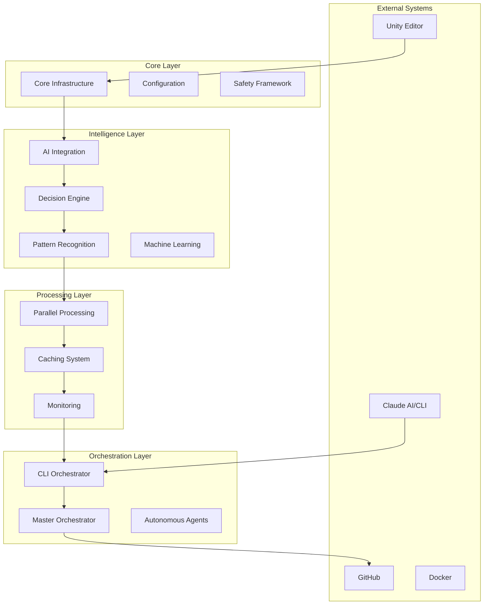

# Unity-Claude Automation System - Hybrid Semantic Documentation

**Generated:** 2025-08-31 15:32:17  
**Total Modules:** 381  
**AI-Enhanced Modules:** 50  
**Pattern-Based Modules:** 341  
**Total Functions:** 3969

## 📑 Table of Contents

1. [System Overview](#-system-overview)
2. [Architecture](#-architecture)
3. [Module Categories](#-module-categories)
4. [Critical Modules (AI-Enhanced)](#-critical-modules-ai-enhanced)
5. [Standard Modules](#-standard-modules)
6. [Module Network](#-module-network)

---

## 🎯 System Overview

The Unity-Claude Automation System is a sophisticated PowerShell-based framework that bridges Unity game development with Claude AI capabilities. This hybrid documentation combines AI-powered analysis for critical components with efficient pattern-based documentation for standard modules.

### Documentation Approach

- **🤖 AI-Enhanced**: Critical infrastructure and complex modules analyzed by codellama:34b
- **📋 Pattern-Based**: Standard modules documented using intelligent pattern matching
- **🔗 Relationship Mapping**: Automatic dependency and interaction analysis

## 🏗️ Architecture

The system implements a microservices-inspired architecture with these layers:

## 📦 Module Categories

### ⚡ Performance & Processing (2 AI-enhanced)

**Modules:** 27 | **Functions:** 425

- [**ContextOptimization**](#contextoptimization) - [**CPG-ThreadSafeOperations**](#cpg-threadsafeoperations) - [**LLM-ResponseCache**](#llm-responsecache) - [**ParallelizationCore**](#parallelizationcore) 🤖 - [**ParallelMonitoring**](#parallelmonitoring) - [**ParallelProcessorCore**](#parallelprocessorcore) 🤖 - [**Performance-Cache**](#performance-cache) - [**Performance-IncrementalUpdates**](#performance-incrementalupdates) - [**PerformanceAnalysis**](#performanceanalysis) - [**PerformanceMonitoring**](#performancemonitoring) - [**PerformanceOptimization**](#performanceoptimization) - [**PerformanceOptimizer**](#performanceoptimizer) - [**Unity-Claude-Cache**](#unity-claude-cache) - [**Unity-Claude-Cache-Fixed**](#unity-claude-cache-fixed) - [**Unity-Claude-Cache-Original**](#unity-claude-cache-original) - [**Unity-Claude-ClaudeParallelization**](#unity-claude-claudeparallelization) - [**Unity-Claude-ParallelProcessing**](#unity-claude-parallelprocessing) - [**Unity-Claude-ParallelProcessor**](#unity-claude-parallelprocessor) - [**Unity-Claude-ParallelProcessor-Original**](#unity-claude-parallelprocessor-original) - [**Unity-Claude-ParallelProcessor-Refactored**](#unity-claude-parallelprocessor-refactored) - [**Unity-Claude-PerformanceOptimizer**](#unity-claude-performanceoptimizer) - [**Unity-Claude-PerformanceOptimizer-Original**](#unity-claude-performanceoptimizer-original) - [**Unity-Claude-PerformanceOptimizer-Refactored**](#unity-claude-performanceoptimizer-refactored) - [**Unity-Claude-UnityParallelization**](#unity-claude-unityparallelization) - [**Unity-Claude-UnityParallelization-Original**](#unity-claude-unityparallelization-original) - [**Unity-Claude-UnityParallelization-Refactored**](#unity-claude-unityparallelization-refactored) - [**UnityPerformanceAnalysis**](#unityperformanceanalysis) 
### 🎮 Unity Integration (18 AI-enhanced)

**Modules:** 168 | **Functions:** 2094

- [**CompilationIntegration**](#compilationintegration) - [**Unity-Claude-AgentIntegration**](#unity-claude-agentintegration) - [**Unity-Claude-AIAlertClassifier**](#unity-claude-aialertclassifier) 🤖 - [**Unity-Claude-AlertAnalytics**](#unity-claude-alertanalytics) - [**Unity-Claude-AlertFeedbackCollector**](#unity-claude-alertfeedbackcollector) - [**Unity-Claude-AlertMLOptimizer**](#unity-claude-alertmloptimizer) - [**Unity-Claude-AlertQualityReporting**](#unity-claude-alertqualityreporting) - [**Unity-Claude-APIDocumentation**](#unity-claude-apidocumentation) - [**Unity-Claude-AST-Enhanced**](#unity-claude-ast-enhanced) - [**Unity-Claude-AutoGen**](#unity-claude-autogen) - [**Unity-Claude-AutoGenMonitoring**](#unity-claude-autogenmonitoring) - [**Unity-Claude-AutonomousAgent-Refactored**](#unity-claude-autonomousagent-refactored) - [**Unity-Claude-AutonomousDocumentationEngine**](#unity-claude-autonomousdocumentationengine) - [**Unity-Claude-AutonomousStateTracker**](#unity-claude-autonomousstatetracker) - [**Unity-Claude-AutonomousStateTracker-Enhanced**](#unity-claude-autonomousstatetracker-enhanced) - [**Unity-Claude-AutonomousStateTracker-Enhanced-Refactored**](#unity-claude-autonomousstatetracker-enhanced-refactored) - [**Unity-Claude-Cache**](#unity-claude-cache) - [**Unity-Claude-Cache-Fixed**](#unity-claude-cache-fixed) - [**Unity-Claude-Cache-Original**](#unity-claude-cache-original) - [**Unity-Claude-ChangeIntelligence**](#unity-claude-changeintelligence) - [**Unity-Claude-ClaudeParallelization**](#unity-claude-claudeparallelization) - [**Unity-Claude-CLIOrchestrator**](#unity-claude-cliorchestrator) 🤖 - [**Unity-Claude-CLIOrchestrator-Fixed-Simple**](#unity-claude-cliorchestrator-fixed-simple) 🤖 - [**Unity-Claude-CLIOrchestrator-FullFeatured**](#unity-claude-cliorchestrator-fullfeatured) 🤖 - [**Unity-Claude-CLIOrchestrator-Original**](#unity-claude-cliorchestrator-original) 🤖 - [**Unity-Claude-CLIOrchestrator-Original-Backup**](#unity-claude-cliorchestrator-original-backup) 🤖 - [**Unity-Claude-CLIOrchestrator-Refactored**](#unity-claude-cliorchestrator-refactored) 🤖 - [**Unity-Claude-CLIOrchestrator-Refactored-Fixed**](#unity-claude-cliorchestrator-refactored-fixed) 🤖 - [**Unity-Claude-CLISubmission**](#unity-claude-clisubmission) - [**Unity-Claude-CLISubmission-Enhanced**](#unity-claude-clisubmission-enhanced) - [**Unity-Claude-CodeQL**](#unity-claude-codeql) - [**Unity-Claude-ConcurrentCollections**](#unity-claude-concurrentcollections) - [**Unity-Claude-ConcurrentProcessor**](#unity-claude-concurrentprocessor) - [**Unity-Claude-Core**](#unity-claude-core) 🤖 - [**Unity-Claude-CPG**](#unity-claude-cpg) - [**Unity-Claude-CPG-ASTConverter**](#unity-claude-cpg-astconverter) - [**Unity-Claude-CPG-Original**](#unity-claude-cpg-original) - [**Unity-Claude-CPG-Refactored**](#unity-claude-cpg-refactored) - [**Unity-Claude-CrossLanguage**](#unity-claude-crosslanguage) - [**Unity-Claude-DecisionEngine**](#unity-claude-decisionengine) 🤖 - [**Unity-Claude-DecisionEngine-Bayesian**](#unity-claude-decisionengine-bayesian) 🤖 - [**Unity-Claude-DecisionEngine-Original**](#unity-claude-decisionengine-original) 🤖 - [**Unity-Claude-DecisionEngine-Refactored**](#unity-claude-decisionengine-refactored) 🤖 - [**Unity-Claude-DocumentationAnalytics**](#unity-claude-documentationanalytics) - [**Unity-Claude-DocumentationAutomation**](#unity-claude-documentationautomation) - [**Unity-Claude-DocumentationAutomation-Original**](#unity-claude-documentationautomation-original) - [**Unity-Claude-DocumentationAutomation-Refactored**](#unity-claude-documentationautomation-refactored) - [**Unity-Claude-DocumentationCrossReference**](#unity-claude-documentationcrossreference) - [**Unity-Claude-DocumentationDrift**](#unity-claude-documentationdrift) - [**Unity-Claude-DocumentationDrift-Refactored**](#unity-claude-documentationdrift-refactored) - [**Unity-Claude-DocumentationPipeline**](#unity-claude-documentationpipeline) - [**Unity-Claude-DocumentationQualityAssessment**](#unity-claude-documentationqualityassessment) - [**Unity-Claude-DocumentationQualityAssessment_Original_20250830_193150**](#unity-claude-documentationqualityassessment-original-20250830-193150) - [**Unity-Claude-DocumentationQualityOrchestrator**](#unity-claude-documentationqualityorchestrator) - [**Unity-Claude-DocumentationSuggestions**](#unity-claude-documentationsuggestions) - [**Unity-Claude-DocumentationVersioning**](#unity-claude-documentationversioning) - [**Unity-Claude-EmailNotifications**](#unity-claude-emailnotifications) 🤖 - [**Unity-Claude-EmailNotifications-SystemNetMail**](#unity-claude-emailnotifications-systemnetmail) 🤖 - [**Unity-Claude-ErrorHandling**](#unity-claude-errorhandling) - [**Unity-Claude-Errors**](#unity-claude-errors) - [**Unity-Claude-EventLog**](#unity-claude-eventlog) - [**Unity-Claude-FileMonitor**](#unity-claude-filemonitor) - [**Unity-Claude-FileMonitor-Fixed**](#unity-claude-filemonitor-fixed) - [**Unity-Claude-FixEngine**](#unity-claude-fixengine) - [**Unity-Claude-GitHub**](#unity-claude-github) - [**Unity-Claude-GovernanceIntegration**](#unity-claude-governanceintegration) - [**Unity-Claude-HITL**](#unity-claude-hitl) - [**Unity-Claude-HITL-Original**](#unity-claude-hitl-original) - [**Unity-Claude-HITL-Refactored**](#unity-claude-hitl-refactored) - [**Unity-Claude-IncrementalProcessor**](#unity-claude-incrementalprocessor) - [**Unity-Claude-IncrementalProcessor-Fixed**](#unity-claude-incrementalprocessor-fixed) - [**Unity-Claude-IntegratedWorkflow**](#unity-claude-integratedworkflow) - [**Unity-Claude-IntegratedWorkflow-Original**](#unity-claude-integratedworkflow-original) - [**Unity-Claude-IntegratedWorkflow-Refactored**](#unity-claude-integratedworkflow-refactored) - [**Unity-Claude-IntegrationEngine**](#unity-claude-integrationengine) - [**Unity-Claude-IntelligentAlerting**](#unity-claude-intelligentalerting) - [**Unity-Claude-IntelligentDocumentationTriggers**](#unity-claude-intelligentdocumentationtriggers) - [**Unity-Claude-IPC**](#unity-claude-ipc) - [**Unity-Claude-IPC-Bidirectional**](#unity-claude-ipc-bidirectional) - [**Unity-Claude-IPC-Bidirectional-Fixed**](#unity-claude-ipc-bidirectional-fixed) - [**Unity-Claude-LangGraphBridge**](#unity-claude-langgraphbridge) - [**Unity-Claude-Learning**](#unity-claude-learning) - [**Unity-Claude-Learning-Analytics**](#unity-claude-learning-analytics) 🤖 - [**Unity-Claude-Learning-Original**](#unity-claude-learning-original) - [**Unity-Claude-Learning-Refactored**](#unity-claude-learning-refactored) - [**Unity-Claude-Learning-Simple**](#unity-claude-learning-simple) - [**Unity-Claude-LLM**](#unity-claude-llm) - [**Unity-Claude-MachineLearning**](#unity-claude-machinelearning) 🤖 - [**Unity-Claude-MasterOrchestrator**](#unity-claude-masterorchestrator) - [**Unity-Claude-MasterOrchestrator-Original**](#unity-claude-masterorchestrator-original) - [**Unity-Claude-MasterOrchestrator-Refactored**](#unity-claude-masterorchestrator-refactored) - [**Unity-Claude-MemoryAnalysis**](#unity-claude-memoryanalysis) - [**Unity-Claude-MessageQueue**](#unity-claude-messagequeue) - [**Unity-Claude-Monitoring**](#unity-claude-monitoring) - [**Unity-Claude-MultiStepOrchestrator**](#unity-claude-multisteporchestrator) - [**Unity-Claude-NotificationConfiguration**](#unity-claude-notificationconfiguration) - [**Unity-Claude-NotificationContentEngine**](#unity-claude-notificationcontentengine) - [**Unity-Claude-NotificationIntegration**](#unity-claude-notificationintegration) - [**Unity-Claude-NotificationIntegration-Modular**](#unity-claude-notificationintegration-modular) - [**Unity-Claude-NotificationPreferences**](#unity-claude-notificationpreferences) - [**Unity-Claude-ObsolescenceDetection**](#unity-claude-obsolescencedetection) - [**Unity-Claude-ObsolescenceDetection-Refactored**](#unity-claude-obsolescencedetection-refactored) - [**Unity-Claude-Ollama**](#unity-claude-ollama) - [**Unity-Claude-Ollama-Enhanced**](#unity-claude-ollama-enhanced) - [**Unity-Claude-Ollama-Optimized**](#unity-claude-ollama-optimized) - [**Unity-Claude-Ollama-Optimized-Fixed**](#unity-claude-ollama-optimized-fixed) - [**Unity-Claude-ParallelProcessing**](#unity-claude-parallelprocessing) - [**Unity-Claude-ParallelProcessor**](#unity-claude-parallelprocessor) - [**Unity-Claude-ParallelProcessor-Original**](#unity-claude-parallelprocessor-original) - [**Unity-Claude-ParallelProcessor-Refactored**](#unity-claude-parallelprocessor-refactored) - [**Unity-Claude-PerformanceOptimizer**](#unity-claude-performanceoptimizer) - [**Unity-Claude-PerformanceOptimizer-Original**](#unity-claude-performanceoptimizer-original) - [**Unity-Claude-PerformanceOptimizer-Refactored**](#unity-claude-performanceoptimizer-refactored) - [**Unity-Claude-PredictiveAnalysis**](#unity-claude-predictiveanalysis) - [**Unity-Claude-PredictiveAnalysis-Original**](#unity-claude-predictiveanalysis-original) - [**Unity-Claude-PredictiveAnalysis-Refactored**](#unity-claude-predictiveanalysis-refactored) - [**Unity-Claude-ProactiveMaintenanceEngine**](#unity-claude-proactivemaintenanceengine) 🤖 - [**Unity-Claude-RealTimeAnalysis**](#unity-claude-realtimeanalysis) - [**Unity-Claude-RealTimeMonitoring**](#unity-claude-realtimemonitoring) - [**Unity-Claude-RealTimeOptimizer**](#unity-claude-realtimeoptimizer) - [**Unity-Claude-RecompileSignaling**](#unity-claude-recompilesignaling) - [**Unity-Claude-ReliabilityManager**](#unity-claude-reliabilitymanager) - [**Unity-Claude-ReliableMonitoring**](#unity-claude-reliablemonitoring) - [**Unity-Claude-RepoAnalyst**](#unity-claude-repoanalyst) - [**Unity-Claude-ResourceOptimizer**](#unity-claude-resourceoptimizer) - [**Unity-Claude-ResponseMonitor**](#unity-claude-responsemonitor) - [**Unity-Claude-ResponseMonitoring**](#unity-claude-responsemonitoring) - [**Unity-Claude-RunspaceManagement**](#unity-claude-runspacemanagement) - [**Unity-Claude-RunspaceManagement-Original**](#unity-claude-runspacemanagement-original) - [**Unity-Claude-RunspaceManagement-Refactored**](#unity-claude-runspacemanagement-refactored) - [**Unity-Claude-Safety**](#unity-claude-safety) - [**Unity-Claude-ScalabilityEnhancements**](#unity-claude-scalabilityenhancements) - [**Unity-Claude-ScalabilityEnhancements-Original**](#unity-claude-scalabilityenhancements-original) - [**Unity-Claude-ScalabilityEnhancements-Refactored**](#unity-claude-scalabilityenhancements-refactored) - [**Unity-Claude-ScalabilityOptimizer**](#unity-claude-scalabilityoptimizer) - [**Unity-Claude-SemanticAnalysis**](#unity-claude-semanticanalysis) - [**Unity-Claude-SemanticAnalysis-Architecture**](#unity-claude-semanticanalysis-architecture) - [**Unity-Claude-SemanticAnalysis-Business**](#unity-claude-semanticanalysis-business) - [**Unity-Claude-SemanticAnalysis-Helpers**](#unity-claude-semanticanalysis-helpers) - [**Unity-Claude-SemanticAnalysis-Metrics**](#unity-claude-semanticanalysis-metrics) - [**Unity-Claude-SemanticAnalysis-New**](#unity-claude-semanticanalysis-new) - [**Unity-Claude-SemanticAnalysis-Old**](#unity-claude-semanticanalysis-old) - [**Unity-Claude-SemanticAnalysis-Patterns**](#unity-claude-semanticanalysis-patterns) - [**Unity-Claude-SemanticAnalysis-Purpose**](#unity-claude-semanticanalysis-purpose) - [**Unity-Claude-SemanticAnalysis-Quality**](#unity-claude-semanticanalysis-quality) - [**Unity-Claude-SessionManager**](#unity-claude-sessionmanager) - [**Unity-Claude-SlackIntegration**](#unity-claude-slackintegration) - [**Unity-Claude-SystemCoordinator**](#unity-claude-systemcoordinator) - [**Unity-Claude-SystemStatus**](#unity-claude-systemstatus) - [**Unity-Claude-TeamsIntegration**](#unity-claude-teamsintegration) - [**Unity-Claude-TreeSitter**](#unity-claude-treesitter) - [**Unity-Claude-TriggerConditions**](#unity-claude-triggerconditions) - [**Unity-Claude-TriggerIntegration**](#unity-claude-triggerintegration) - [**Unity-Claude-TriggerManager**](#unity-claude-triggermanager) - [**Unity-Claude-UnityParallelization**](#unity-claude-unityparallelization) - [**Unity-Claude-UnityParallelization-Original**](#unity-claude-unityparallelization-original) - [**Unity-Claude-UnityParallelization-Refactored**](#unity-claude-unityparallelization-refactored) - [**Unity-Claude-WebhookNotifications**](#unity-claude-webhooknotifications) - [**Unity-Claude-WindowDetection**](#unity-claude-windowdetection) - [**Unity-Claude-WindowDetection-Enhanced**](#unity-claude-windowdetection-enhanced) - [**Unity-TestAutomation**](#unity-testautomation) - [**UnityBuildOperations**](#unitybuildoperations) - [**UnityCommands**](#unitycommands) - [**UnityIntegration**](#unityintegration) - [**UnityLogAnalysis**](#unityloganalysis) - [**UnityPerformanceAnalysis**](#unityperformanceanalysis) - [**UnityProjectOperations**](#unityprojectoperations) - [**UnityReportingOperations**](#unityreportingoperations) 
### 🎯 Orchestration & Control (11 AI-enhanced)

**Modules:** 34 | **Functions:** 246

- [**AgentCore**](#agentcore) 🤖 - [**AgentLogging**](#agentlogging) - [**AutomationEngine**](#automationengine) - [**CLIAutomation**](#cliautomation) - [**OrchestrationCore**](#orchestrationcore) 🤖 - [**OrchestrationManager**](#orchestrationmanager) - [**OrchestrationManager-Refactored**](#orchestrationmanager-refactored) - [**OrchestratorCore**](#orchestratorcore) 🤖 - [**OrchestratorManagement**](#orchestratormanagement) - [**Unity-Claude-AgentIntegration**](#unity-claude-agentintegration) - [**Unity-Claude-AutonomousAgent-Refactored**](#unity-claude-autonomousagent-refactored) - [**Unity-Claude-CLIOrchestrator**](#unity-claude-cliorchestrator) 🤖 - [**Unity-Claude-CLIOrchestrator-Fixed-Simple**](#unity-claude-cliorchestrator-fixed-simple) 🤖 - [**Unity-Claude-CLIOrchestrator-FullFeatured**](#unity-claude-cliorchestrator-fullfeatured) 🤖 - [**Unity-Claude-CLIOrchestrator-Original**](#unity-claude-cliorchestrator-original) 🤖 - [**Unity-Claude-CLIOrchestrator-Original-Backup**](#unity-claude-cliorchestrator-original-backup) 🤖 - [**Unity-Claude-CLIOrchestrator-Refactored**](#unity-claude-cliorchestrator-refactored) 🤖 - [**Unity-Claude-CLIOrchestrator-Refactored-Fixed**](#unity-claude-cliorchestrator-refactored-fixed) 🤖 - [**Unity-Claude-DocumentationAutomation**](#unity-claude-documentationautomation) - [**Unity-Claude-DocumentationAutomation-Original**](#unity-claude-documentationautomation-original) - [**Unity-Claude-DocumentationAutomation-Refactored**](#unity-claude-documentationautomation-refactored) - [**Unity-Claude-DocumentationQualityOrchestrator**](#unity-claude-documentationqualityorchestrator) - [**Unity-Claude-IntegratedWorkflow**](#unity-claude-integratedworkflow) - [**Unity-Claude-IntegratedWorkflow-Original**](#unity-claude-integratedworkflow-original) - [**Unity-Claude-IntegratedWorkflow-Refactored**](#unity-claude-integratedworkflow-refactored) - [**Unity-Claude-MasterOrchestrator**](#unity-claude-masterorchestrator) - [**Unity-Claude-MasterOrchestrator-Original**](#unity-claude-masterorchestrator-original) - [**Unity-Claude-MasterOrchestrator-Refactored**](#unity-claude-masterorchestrator-refactored) - [**Unity-Claude-MultiStepOrchestrator**](#unity-claude-multisteporchestrator) - [**Unity-TestAutomation**](#unity-testautomation) - [**WorkflowCore**](#workflowcore) 🤖 - [**WorkflowIntegration**](#workflowintegration) - [**WorkflowMonitoring**](#workflowmonitoring) - [**WorkflowOrchestration**](#workfloworchestration) 
### 🏗️ Core Infrastructure (20 AI-enhanced)

**Modules:** 32 | **Functions:** 154

- [**AgentCore**](#agentcore) 🤖 - [**BayesianConfiguration**](#bayesianconfiguration) - [**Configuration**](#configuration) - [**ConfigurationLogging**](#configurationlogging) - [**ConfigurationManagement**](#configurationmanagement) - [**ConversationCore**](#conversationcore) 🤖 - [**Core**](#core) 🤖 - [**CoreUtilities**](#coreutilities) 🤖 - [**DatabaseManagement**](#databasemanagement) - [**DecisionEngineCore**](#decisionenginecore) 🤖 - [**HITLCore**](#hitlcore) 🤖 - [**LearningCore**](#learningcore) 🤖 - [**NotificationCore**](#notificationcore) 🤖 - [**OptimizerConfiguration**](#optimizerconfiguration) - [**OrchestrationCore**](#orchestrationcore) 🤖 - [**OrchestratorCore**](#orchestratorcore) 🤖 - [**ParallelizationCore**](#parallelizationcore) 🤖 - [**ParallelProcessorCore**](#parallelprocessorcore) 🤖 - [**PredictiveCore**](#predictivecore) 🤖 - [**ProjectConfiguration**](#projectconfiguration) - [**PromptConfiguration**](#promptconfiguration) - [**ResponseAnalysisEngine-Core**](#responseanalysisengine-core) 🤖 - [**ResponseAnalysisEngine-Core-Fixed**](#responseanalysisengine-core-fixed) 🤖 - [**RuleBasedDecisionTrees**](#rulebaseddecisiontrees) - [**RunspaceCore**](#runspacecore) 🤖 - [**SafeCommandCore**](#safecommandcore) 🤖 - [**SessionStateConfiguration**](#sessionstateconfiguration) - [**StateConfiguration**](#stateconfiguration) - [**StateMachineCore**](#statemachinecore) 🤖 - [**Unity-Claude-Core**](#unity-claude-core) 🤖 - [**Unity-Claude-NotificationConfiguration**](#unity-claude-notificationconfiguration) - [**WorkflowCore**](#workflowcore) 🤖 
### 📊 Monitoring & Analytics (4 AI-enhanced)

**Modules:** 39 | **Functions:** 451

- [**ClaudeWindowMonitor**](#claudewindowmonitor) - [**CodeComplexityMetrics**](#codecomplexitymetrics) - [**FileSystemMonitoring**](#filesystemmonitoring) - [**HealthMonitoring**](#healthmonitoring) - [**IntegratedNotifications**](#integratednotifications) - [**MetricsAndHealthCheck**](#metricsandhealthcheck) - [**MetricsCollection**](#metricscollection) - [**MonitoringLoop**](#monitoringloop) - [**NotificationCore**](#notificationcore) 🤖 - [**NotificationSystem**](#notificationsystem) - [**ParallelMonitoring**](#parallelmonitoring) - [**PerformanceMonitoring**](#performancemonitoring) - [**ResponseMonitoring**](#responsemonitoring) - [**SemanticAnalysis-Metrics**](#semanticanalysis-metrics) - [**Unity-Claude-AIAlertClassifier**](#unity-claude-aialertclassifier) 🤖 - [**Unity-Claude-AlertAnalytics**](#unity-claude-alertanalytics) - [**Unity-Claude-AlertFeedbackCollector**](#unity-claude-alertfeedbackcollector) - [**Unity-Claude-AlertMLOptimizer**](#unity-claude-alertmloptimizer) - [**Unity-Claude-AlertQualityReporting**](#unity-claude-alertqualityreporting) - [**Unity-Claude-AutoGenMonitoring**](#unity-claude-autogenmonitoring) - [**Unity-Claude-EmailNotifications**](#unity-claude-emailnotifications) 🤖 - [**Unity-Claude-EmailNotifications-SystemNetMail**](#unity-claude-emailnotifications-systemnetmail) 🤖 - [**Unity-Claude-FileMonitor**](#unity-claude-filemonitor) - [**Unity-Claude-FileMonitor-Fixed**](#unity-claude-filemonitor-fixed) - [**Unity-Claude-IntelligentAlerting**](#unity-claude-intelligentalerting) - [**Unity-Claude-Monitoring**](#unity-claude-monitoring) - [**Unity-Claude-NotificationConfiguration**](#unity-claude-notificationconfiguration) - [**Unity-Claude-NotificationContentEngine**](#unity-claude-notificationcontentengine) - [**Unity-Claude-NotificationIntegration**](#unity-claude-notificationintegration) - [**Unity-Claude-NotificationIntegration-Modular**](#unity-claude-notificationintegration-modular) - [**Unity-Claude-NotificationPreferences**](#unity-claude-notificationpreferences) - [**Unity-Claude-RealTimeMonitoring**](#unity-claude-realtimemonitoring) - [**Unity-Claude-ReliableMonitoring**](#unity-claude-reliablemonitoring) - [**Unity-Claude-ResponseMonitor**](#unity-claude-responsemonitor) - [**Unity-Claude-ResponseMonitoring**](#unity-claude-responsemonitoring) - [**Unity-Claude-SemanticAnalysis-Metrics**](#unity-claude-semanticanalysis-metrics) - [**Unity-Claude-SystemStatus**](#unity-claude-systemstatus) - [**Unity-Claude-WebhookNotifications**](#unity-claude-webhooknotifications) - [**WorkflowMonitoring**](#workflowmonitoring) 
### 📚 Documentation System

**Modules:** 35 | **Functions:** 410

- [**AnalyticsReporting**](#analyticsreporting) - [**DocumentationAccuracy**](#documentationaccuracy) - [**DocumentationComparison**](#documentationcomparison) - [**ReportingExport**](#reportingexport) - [**SemanticAnalysis-Metrics**](#semanticanalysis-metrics) - [**SemanticAnalysis-PatternDetector**](#semanticanalysis-patterndetector) - [**SemanticAnalysis-PatternDetector-PS51Compatible**](#semanticanalysis-patterndetector-ps51compatible) - [**Unity-Claude-AlertQualityReporting**](#unity-claude-alertqualityreporting) - [**Unity-Claude-APIDocumentation**](#unity-claude-apidocumentation) - [**Unity-Claude-AutonomousDocumentationEngine**](#unity-claude-autonomousdocumentationengine) - [**Unity-Claude-DocumentationAnalytics**](#unity-claude-documentationanalytics) - [**Unity-Claude-DocumentationAutomation**](#unity-claude-documentationautomation) - [**Unity-Claude-DocumentationAutomation-Original**](#unity-claude-documentationautomation-original) - [**Unity-Claude-DocumentationAutomation-Refactored**](#unity-claude-documentationautomation-refactored) - [**Unity-Claude-DocumentationCrossReference**](#unity-claude-documentationcrossreference) - [**Unity-Claude-DocumentationDrift**](#unity-claude-documentationdrift) - [**Unity-Claude-DocumentationDrift-Refactored**](#unity-claude-documentationdrift-refactored) - [**Unity-Claude-DocumentationPipeline**](#unity-claude-documentationpipeline) - [**Unity-Claude-DocumentationQualityAssessment**](#unity-claude-documentationqualityassessment) - [**Unity-Claude-DocumentationQualityAssessment_Original_20250830_193150**](#unity-claude-documentationqualityassessment-original-20250830-193150) - [**Unity-Claude-DocumentationQualityOrchestrator**](#unity-claude-documentationqualityorchestrator) - [**Unity-Claude-DocumentationSuggestions**](#unity-claude-documentationsuggestions) - [**Unity-Claude-DocumentationVersioning**](#unity-claude-documentationversioning) - [**Unity-Claude-IntelligentDocumentationTriggers**](#unity-claude-intelligentdocumentationtriggers) - [**Unity-Claude-SemanticAnalysis**](#unity-claude-semanticanalysis) - [**Unity-Claude-SemanticAnalysis-Architecture**](#unity-claude-semanticanalysis-architecture) - [**Unity-Claude-SemanticAnalysis-Business**](#unity-claude-semanticanalysis-business) - [**Unity-Claude-SemanticAnalysis-Helpers**](#unity-claude-semanticanalysis-helpers) - [**Unity-Claude-SemanticAnalysis-Metrics**](#unity-claude-semanticanalysis-metrics) - [**Unity-Claude-SemanticAnalysis-New**](#unity-claude-semanticanalysis-new) - [**Unity-Claude-SemanticAnalysis-Old**](#unity-claude-semanticanalysis-old) - [**Unity-Claude-SemanticAnalysis-Patterns**](#unity-claude-semanticanalysis-patterns) - [**Unity-Claude-SemanticAnalysis-Purpose**](#unity-claude-semanticanalysis-purpose) - [**Unity-Claude-SemanticAnalysis-Quality**](#unity-claude-semanticanalysis-quality) - [**UnityReportingOperations**](#unityreportingoperations) 
### 🔒 Safety & Validation (1 AI-enhanced)

**Modules:** 10 | **Functions:** 49

- [**ApprovalRequests**](#approvalrequests) - [**HITLCore**](#hitlcore) 🤖 - [**PermissionApprovalHandler**](#permissionapprovalhandler) - [**SafetyValidationFramework**](#safetyvalidationframework) - [**SecurityTokens**](#securitytokens) - [**Unity-Claude-HITL**](#unity-claude-hitl) - [**Unity-Claude-HITL-Original**](#unity-claude-hitl-original) - [**Unity-Claude-HITL-Refactored**](#unity-claude-hitl-refactored) - [**Unity-Claude-Safety**](#unity-claude-safety) - [**ValidationEngine**](#validationengine) 
### 🔧 Integration & Tools (3 AI-enhanced)

**Modules:** 23 | **Functions:** 176

- [**BackupIntegration**](#backupintegration) - [**ClaudeIntegration**](#claudeintegration) - [**CompilationIntegration**](#compilationintegration) - [**DecisionEngineIntegration**](#decisionengineintegration) 🤖 - [**EnhancedPatternIntegration**](#enhancedpatternintegration) - [**GitHubPRManager**](#githubprmanager) - [**IntegrationManagement**](#integrationmanagement) - [**ModuleIntegration**](#moduleintegration) - [**PermissionIntegration**](#permissionintegration) - [**SystemIntegration**](#systemintegration) - [**Unity-Claude-AgentIntegration**](#unity-claude-agentintegration) - [**Unity-Claude-EmailNotifications**](#unity-claude-emailnotifications) 🤖 - [**Unity-Claude-EmailNotifications-SystemNetMail**](#unity-claude-emailnotifications-systemnetmail) 🤖 - [**Unity-Claude-GitHub**](#unity-claude-github) - [**Unity-Claude-GovernanceIntegration**](#unity-claude-governanceintegration) - [**Unity-Claude-IntegrationEngine**](#unity-claude-integrationengine) - [**Unity-Claude-NotificationIntegration**](#unity-claude-notificationintegration) - [**Unity-Claude-NotificationIntegration-Modular**](#unity-claude-notificationintegration-modular) - [**Unity-Claude-SlackIntegration**](#unity-claude-slackintegration) - [**Unity-Claude-TeamsIntegration**](#unity-claude-teamsintegration) - [**Unity-Claude-TriggerIntegration**](#unity-claude-triggerintegration) - [**UnityIntegration**](#unityintegration) - [**WorkflowIntegration**](#workflowintegration) 
### 🤖 AI & Intelligence (30 AI-enhanced)

**Modules:** 192 | **Functions:** 2312

- [**AIAssessment**](#aiassessment) - [**BayesianConfidenceEngine**](#bayesianconfidenceengine) - [**BayesianConfiguration**](#bayesianconfiguration) - [**BayesianInference**](#bayesianinference) - [**ClaudeIntegration**](#claudeintegration) - [**ClaudePermissionInterceptor**](#claudepermissioninterceptor) - [**ClaudeWindowMonitor**](#claudewindowmonitor) - [**DecisionEngine**](#decisionengine) 🤖 - [**DecisionEngine-Bayesian**](#decisionengine-bayesian) 🤖 - [**DecisionEngine-Bayesian-Refactored**](#decisionengine-bayesian-refactored) 🤖 - [**DecisionEngine-Refactored**](#decisionengine-refactored) 🤖 - [**DecisionEngineCore**](#decisionenginecore) 🤖 - [**DecisionEngineIntegration**](#decisionengineintegration) 🤖 - [**DecisionExecution**](#decisionexecution) - [**DecisionExecution-Fixed**](#decisionexecution-fixed) - [**DecisionMaking**](#decisionmaking) - [**DecisionMaking-Fixed**](#decisionmaking-fixed) - [**EnhancedPatternIntegration**](#enhancedpatternintegration) - [**FailureMode**](#failuremode) - [**LearningAdaptation**](#learningadaptation) - [**LearningCore**](#learningcore) 🤖 - [**MaintenancePrediction**](#maintenanceprediction) - [**PatternAnalysis**](#patternanalysis) - [**PatternRecognition**](#patternrecognition) 🤖 - [**PatternRecognitionEngine**](#patternrecognitionengine) 🤖 - [**PatternRecognitionEngine-Fixed**](#patternrecognitionengine-fixed) 🤖 - [**PatternRecognitionEngine-New**](#patternrecognitionengine-new) 🤖 - [**PatternRecognitionEngine-Original**](#patternrecognitionengine-original) 🤖 - [**Predictive-Maintenance**](#predictive-maintenance) - [**RecommendationPatternEngine**](#recommendationpatternengine) - [**RuleBasedDecisionTrees**](#rulebaseddecisiontrees) - [**SemanticAnalysis-PatternDetector**](#semanticanalysis-patterndetector) - [**SemanticAnalysis-PatternDetector-PS51Compatible**](#semanticanalysis-patterndetector-ps51compatible) - [**Unity-Claude-AgentIntegration**](#unity-claude-agentintegration) - [**Unity-Claude-AIAlertClassifier**](#unity-claude-aialertclassifier) 🤖 - [**Unity-Claude-AlertAnalytics**](#unity-claude-alertanalytics) - [**Unity-Claude-AlertFeedbackCollector**](#unity-claude-alertfeedbackcollector) - [**Unity-Claude-AlertMLOptimizer**](#unity-claude-alertmloptimizer) - [**Unity-Claude-AlertQualityReporting**](#unity-claude-alertqualityreporting) - [**Unity-Claude-APIDocumentation**](#unity-claude-apidocumentation) - [**Unity-Claude-AST-Enhanced**](#unity-claude-ast-enhanced) - [**Unity-Claude-AutoGen**](#unity-claude-autogen) - [**Unity-Claude-AutoGenMonitoring**](#unity-claude-autogenmonitoring) - [**Unity-Claude-AutonomousAgent-Refactored**](#unity-claude-autonomousagent-refactored) - [**Unity-Claude-AutonomousDocumentationEngine**](#unity-claude-autonomousdocumentationengine) - [**Unity-Claude-AutonomousStateTracker**](#unity-claude-autonomousstatetracker) - [**Unity-Claude-AutonomousStateTracker-Enhanced**](#unity-claude-autonomousstatetracker-enhanced) - [**Unity-Claude-AutonomousStateTracker-Enhanced-Refactored**](#unity-claude-autonomousstatetracker-enhanced-refactored) - [**Unity-Claude-Cache**](#unity-claude-cache) - [**Unity-Claude-Cache-Fixed**](#unity-claude-cache-fixed) - [**Unity-Claude-Cache-Original**](#unity-claude-cache-original) - [**Unity-Claude-ChangeIntelligence**](#unity-claude-changeintelligence) - [**Unity-Claude-ClaudeParallelization**](#unity-claude-claudeparallelization) - [**Unity-Claude-CLIOrchestrator**](#unity-claude-cliorchestrator) 🤖 - [**Unity-Claude-CLIOrchestrator-Fixed-Simple**](#unity-claude-cliorchestrator-fixed-simple) 🤖 - [**Unity-Claude-CLIOrchestrator-FullFeatured**](#unity-claude-cliorchestrator-fullfeatured) 🤖 - [**Unity-Claude-CLIOrchestrator-Original**](#unity-claude-cliorchestrator-original) 🤖 - [**Unity-Claude-CLIOrchestrator-Original-Backup**](#unity-claude-cliorchestrator-original-backup) 🤖 - [**Unity-Claude-CLIOrchestrator-Refactored**](#unity-claude-cliorchestrator-refactored) 🤖 - [**Unity-Claude-CLIOrchestrator-Refactored-Fixed**](#unity-claude-cliorchestrator-refactored-fixed) 🤖 - [**Unity-Claude-CLISubmission**](#unity-claude-clisubmission) - [**Unity-Claude-CLISubmission-Enhanced**](#unity-claude-clisubmission-enhanced) - [**Unity-Claude-CodeQL**](#unity-claude-codeql) - [**Unity-Claude-ConcurrentCollections**](#unity-claude-concurrentcollections) - [**Unity-Claude-ConcurrentProcessor**](#unity-claude-concurrentprocessor) - [**Unity-Claude-Core**](#unity-claude-core) 🤖 - [**Unity-Claude-CPG**](#unity-claude-cpg) - [**Unity-Claude-CPG-ASTConverter**](#unity-claude-cpg-astconverter) - [**Unity-Claude-CPG-Original**](#unity-claude-cpg-original) - [**Unity-Claude-CPG-Refactored**](#unity-claude-cpg-refactored) - [**Unity-Claude-CrossLanguage**](#unity-claude-crosslanguage) - [**Unity-Claude-DecisionEngine**](#unity-claude-decisionengine) 🤖 - [**Unity-Claude-DecisionEngine-Bayesian**](#unity-claude-decisionengine-bayesian) 🤖 - [**Unity-Claude-DecisionEngine-Original**](#unity-claude-decisionengine-original) 🤖 - [**Unity-Claude-DecisionEngine-Refactored**](#unity-claude-decisionengine-refactored) 🤖 - [**Unity-Claude-DocumentationAnalytics**](#unity-claude-documentationanalytics) - [**Unity-Claude-DocumentationAutomation**](#unity-claude-documentationautomation) - [**Unity-Claude-DocumentationAutomation-Original**](#unity-claude-documentationautomation-original) - [**Unity-Claude-DocumentationAutomation-Refactored**](#unity-claude-documentationautomation-refactored) - [**Unity-Claude-DocumentationCrossReference**](#unity-claude-documentationcrossreference) - [**Unity-Claude-DocumentationDrift**](#unity-claude-documentationdrift) - [**Unity-Claude-DocumentationDrift-Refactored**](#unity-claude-documentationdrift-refactored) - [**Unity-Claude-DocumentationPipeline**](#unity-claude-documentationpipeline) - [**Unity-Claude-DocumentationQualityAssessment**](#unity-claude-documentationqualityassessment) - [**Unity-Claude-DocumentationQualityAssessment_Original_20250830_193150**](#unity-claude-documentationqualityassessment-original-20250830-193150) - [**Unity-Claude-DocumentationQualityOrchestrator**](#unity-claude-documentationqualityorchestrator) - [**Unity-Claude-DocumentationSuggestions**](#unity-claude-documentationsuggestions) - [**Unity-Claude-DocumentationVersioning**](#unity-claude-documentationversioning) - [**Unity-Claude-EmailNotifications**](#unity-claude-emailnotifications) 🤖 - [**Unity-Claude-EmailNotifications-SystemNetMail**](#unity-claude-emailnotifications-systemnetmail) 🤖 - [**Unity-Claude-ErrorHandling**](#unity-claude-errorhandling) - [**Unity-Claude-Errors**](#unity-claude-errors) - [**Unity-Claude-EventLog**](#unity-claude-eventlog) - [**Unity-Claude-FileMonitor**](#unity-claude-filemonitor) - [**Unity-Claude-FileMonitor-Fixed**](#unity-claude-filemonitor-fixed) - [**Unity-Claude-FixEngine**](#unity-claude-fixengine) - [**Unity-Claude-GitHub**](#unity-claude-github) - [**Unity-Claude-GovernanceIntegration**](#unity-claude-governanceintegration) - [**Unity-Claude-HITL**](#unity-claude-hitl) - [**Unity-Claude-HITL-Original**](#unity-claude-hitl-original) - [**Unity-Claude-HITL-Refactored**](#unity-claude-hitl-refactored) - [**Unity-Claude-IncrementalProcessor**](#unity-claude-incrementalprocessor) - [**Unity-Claude-IncrementalProcessor-Fixed**](#unity-claude-incrementalprocessor-fixed) - [**Unity-Claude-IntegratedWorkflow**](#unity-claude-integratedworkflow) - [**Unity-Claude-IntegratedWorkflow-Original**](#unity-claude-integratedworkflow-original) - [**Unity-Claude-IntegratedWorkflow-Refactored**](#unity-claude-integratedworkflow-refactored) - [**Unity-Claude-IntegrationEngine**](#unity-claude-integrationengine) - [**Unity-Claude-IntelligentAlerting**](#unity-claude-intelligentalerting) - [**Unity-Claude-IntelligentDocumentationTriggers**](#unity-claude-intelligentdocumentationtriggers) - [**Unity-Claude-IPC**](#unity-claude-ipc) - [**Unity-Claude-IPC-Bidirectional**](#unity-claude-ipc-bidirectional) - [**Unity-Claude-IPC-Bidirectional-Fixed**](#unity-claude-ipc-bidirectional-fixed) - [**Unity-Claude-LangGraphBridge**](#unity-claude-langgraphbridge) - [**Unity-Claude-Learning**](#unity-claude-learning) - [**Unity-Claude-Learning-Analytics**](#unity-claude-learning-analytics) 🤖 - [**Unity-Claude-Learning-Original**](#unity-claude-learning-original) - [**Unity-Claude-Learning-Refactored**](#unity-claude-learning-refactored) - [**Unity-Claude-Learning-Simple**](#unity-claude-learning-simple) - [**Unity-Claude-LLM**](#unity-claude-llm) - [**Unity-Claude-MachineLearning**](#unity-claude-machinelearning) 🤖 - [**Unity-Claude-MasterOrchestrator**](#unity-claude-masterorchestrator) - [**Unity-Claude-MasterOrchestrator-Original**](#unity-claude-masterorchestrator-original) - [**Unity-Claude-MasterOrchestrator-Refactored**](#unity-claude-masterorchestrator-refactored) - [**Unity-Claude-MemoryAnalysis**](#unity-claude-memoryanalysis) - [**Unity-Claude-MessageQueue**](#unity-claude-messagequeue) - [**Unity-Claude-Monitoring**](#unity-claude-monitoring) - [**Unity-Claude-MultiStepOrchestrator**](#unity-claude-multisteporchestrator) - [**Unity-Claude-NotificationConfiguration**](#unity-claude-notificationconfiguration) - [**Unity-Claude-NotificationContentEngine**](#unity-claude-notificationcontentengine) - [**Unity-Claude-NotificationIntegration**](#unity-claude-notificationintegration) - [**Unity-Claude-NotificationIntegration-Modular**](#unity-claude-notificationintegration-modular) - [**Unity-Claude-NotificationPreferences**](#unity-claude-notificationpreferences) - [**Unity-Claude-ObsolescenceDetection**](#unity-claude-obsolescencedetection) - [**Unity-Claude-ObsolescenceDetection-Refactored**](#unity-claude-obsolescencedetection-refactored) - [**Unity-Claude-Ollama**](#unity-claude-ollama) - [**Unity-Claude-Ollama-Enhanced**](#unity-claude-ollama-enhanced) - [**Unity-Claude-Ollama-Optimized**](#unity-claude-ollama-optimized) - [**Unity-Claude-Ollama-Optimized-Fixed**](#unity-claude-ollama-optimized-fixed) - [**Unity-Claude-ParallelProcessing**](#unity-claude-parallelprocessing) - [**Unity-Claude-ParallelProcessor**](#unity-claude-parallelprocessor) - [**Unity-Claude-ParallelProcessor-Original**](#unity-claude-parallelprocessor-original) - [**Unity-Claude-ParallelProcessor-Refactored**](#unity-claude-parallelprocessor-refactored) - [**Unity-Claude-PerformanceOptimizer**](#unity-claude-performanceoptimizer) - [**Unity-Claude-PerformanceOptimizer-Original**](#unity-claude-performanceoptimizer-original) - [**Unity-Claude-PerformanceOptimizer-Refactored**](#unity-claude-performanceoptimizer-refactored) - [**Unity-Claude-PredictiveAnalysis**](#unity-claude-predictiveanalysis) - [**Unity-Claude-PredictiveAnalysis-Original**](#unity-claude-predictiveanalysis-original) - [**Unity-Claude-PredictiveAnalysis-Refactored**](#unity-claude-predictiveanalysis-refactored) - [**Unity-Claude-ProactiveMaintenanceEngine**](#unity-claude-proactivemaintenanceengine) 🤖 - [**Unity-Claude-RealTimeAnalysis**](#unity-claude-realtimeanalysis) - [**Unity-Claude-RealTimeMonitoring**](#unity-claude-realtimemonitoring) - [**Unity-Claude-RealTimeOptimizer**](#unity-claude-realtimeoptimizer) - [**Unity-Claude-RecompileSignaling**](#unity-claude-recompilesignaling) - [**Unity-Claude-ReliabilityManager**](#unity-claude-reliabilitymanager) - [**Unity-Claude-ReliableMonitoring**](#unity-claude-reliablemonitoring) - [**Unity-Claude-RepoAnalyst**](#unity-claude-repoanalyst) - [**Unity-Claude-ResourceOptimizer**](#unity-claude-resourceoptimizer) - [**Unity-Claude-ResponseMonitor**](#unity-claude-responsemonitor) - [**Unity-Claude-ResponseMonitoring**](#unity-claude-responsemonitoring) - [**Unity-Claude-RunspaceManagement**](#unity-claude-runspacemanagement) - [**Unity-Claude-RunspaceManagement-Original**](#unity-claude-runspacemanagement-original) - [**Unity-Claude-RunspaceManagement-Refactored**](#unity-claude-runspacemanagement-refactored) - [**Unity-Claude-Safety**](#unity-claude-safety) - [**Unity-Claude-ScalabilityEnhancements**](#unity-claude-scalabilityenhancements) - [**Unity-Claude-ScalabilityEnhancements-Original**](#unity-claude-scalabilityenhancements-original) - [**Unity-Claude-ScalabilityEnhancements-Refactored**](#unity-claude-scalabilityenhancements-refactored) - [**Unity-Claude-ScalabilityOptimizer**](#unity-claude-scalabilityoptimizer) - [**Unity-Claude-SemanticAnalysis**](#unity-claude-semanticanalysis) - [**Unity-Claude-SemanticAnalysis-Architecture**](#unity-claude-semanticanalysis-architecture) - [**Unity-Claude-SemanticAnalysis-Business**](#unity-claude-semanticanalysis-business) - [**Unity-Claude-SemanticAnalysis-Helpers**](#unity-claude-semanticanalysis-helpers) - [**Unity-Claude-SemanticAnalysis-Metrics**](#unity-claude-semanticanalysis-metrics) - [**Unity-Claude-SemanticAnalysis-New**](#unity-claude-semanticanalysis-new) - [**Unity-Claude-SemanticAnalysis-Old**](#unity-claude-semanticanalysis-old) - [**Unity-Claude-SemanticAnalysis-Patterns**](#unity-claude-semanticanalysis-patterns) - [**Unity-Claude-SemanticAnalysis-Purpose**](#unity-claude-semanticanalysis-purpose) - [**Unity-Claude-SemanticAnalysis-Quality**](#unity-claude-semanticanalysis-quality) - [**Unity-Claude-SessionManager**](#unity-claude-sessionmanager) - [**Unity-Claude-SlackIntegration**](#unity-claude-slackintegration) - [**Unity-Claude-SystemCoordinator**](#unity-claude-systemcoordinator) - [**Unity-Claude-SystemStatus**](#unity-claude-systemstatus) - [**Unity-Claude-TeamsIntegration**](#unity-claude-teamsintegration) - [**Unity-Claude-TreeSitter**](#unity-claude-treesitter) - [**Unity-Claude-TriggerConditions**](#unity-claude-triggerconditions) - [**Unity-Claude-TriggerIntegration**](#unity-claude-triggerintegration) - [**Unity-Claude-TriggerManager**](#unity-claude-triggermanager) - [**Unity-Claude-UnityParallelization**](#unity-claude-unityparallelization) - [**Unity-Claude-UnityParallelization-Original**](#unity-claude-unityparallelization-original) - [**Unity-Claude-UnityParallelization-Refactored**](#unity-claude-unityparallelization-refactored) - [**Unity-Claude-WebhookNotifications**](#unity-claude-webhooknotifications) - [**Unity-Claude-WindowDetection**](#unity-claude-windowdetection) - [**Unity-Claude-WindowDetection-Enhanced**](#unity-claude-windowdetection-enhanced)

---

## 🤖 Critical Modules (AI-Enhanced)

These modules received detailed AI analysis due to their critical importance:

### AgentCore

[⬆ Back to Contents](#-table-of-contents)

1. PRIMARY PURPOSE: The AgentCore module is a core configuration and state management system for a Unity-Claude Autonomous Agent, providing functionality for monitoring, response processing, command execution, safety and security, conversation management, and statistics tracking. It was extracted from the main module during refactoring on August 18, 2025.
2. ARCHITECTURE: The module uses a modular design approach, with separate functions for different features. It also utilizes a state machine architecture, where the state is stored in a hashtable and updated based on the agent's interactions. The module follows a command-query separation (CQS) pattern, with commands being used to modify the state and queries being used to retrieve information.
3. KEY FEATURES:
	* Monitoring: The module includes functionality for monitoring file changes in the conversation history path.
	* Response Processing: It provides a mechanism for processing Claude responses, including a debouncing feature to avoid overloading the system with rapid-fire requests.
	* Command Execution: The module allows for the execution of commands, with safety and security features in place to prevent unintended consequences.
	* Conversation Management: It manages conversation context, preserving previous interactions to enable more accurate responses.
	* Safety and Security: The module includes various safety and security features, such as a confidence threshold for autonomous execution, dry run mode for testing, and the ability to require human approval for sensitive operations.
4. INTEGRATION: The AgentCore module is integrated with other system components, such as Claude, which it uses for response processing and command execution. It also interacts with the conversation history path and the user's profile directory.
5. CRITICAL FUNCTIONS:
	* Initialize-AgentCore: Initializes the agent core configuration and state, setting up directories and resetting the state as needed.
	* Get-AgentConfig: Gets the current agent configuration, returning the config and state hashtables.
	* Start-Monitoring: Begins monitoring the conversation history path for file changes.
	* Process-ClaudeResponse: Processes a Claude response, including debouncing and safety features.
	* Execute-Command: Executes a command, with safety and security checks in place.
	* Update-ConversationContext: Updates the conversation context based on previous interactions.

In summary, the AgentCore module is designed to provide core configuration and state management for a Unity-Claude Autonomous Agent, handling monitoring, response processing, command execution, safety and security, conversation management, and statistics tracking. It uses a modular design approach with CQS pattern, integrates with other system components, and has critical functions for initialization, getting the config, monitoring, processing Claude responses, executing commands, and updating conversation context.

⠋ ⠹ ⠸ ⠸ ⠼ ⠦ ⠦ ⠧ ⠇ ⠋ ⠋ ⠙ ⠹ ⠼ ⠼ ⠦ ⠧ ⠇ ⠇ ⠋ ⠙ 

**Module Details:**
- **Path:** `Modules\Unity-Claude-AutonomousAgent\Core\AgentCore.psm1`
- **Size:** 9.11 KB
- **Functions:** 6
- **Last Modified:** 2025-08-20 17:25
- **Analysis:** AI-Enhanced 🤖

**Key Functions:**
- `Initialize-AgentCore` (Lines 65-92) - `Get-AgentConfig` (Lines 94-115) - `Set-AgentConfig` (Lines 117-143) - `Get-AgentState` (Lines 145-166) - `Set-AgentState` (Lines 168-194) - `Reset-AgentState` (Lines 196-251)

**Dependencies:**
- [`Unity-Claude-Cache`](#unity-claude-cache) - [`StateMachineCore`](#statemachinecore) - [`Unity-Claude-Cache-Fixed`](#unity-claude-cache-fixed) - [`Unity-Claude-Cache-Original`](#unity-claude-cache-original) - [`Performance-Cache`](#performance-cache) - [`Unity-Claude-ParallelProcessor-Original`](#unity-claude-parallelprocessor-original) - [`ModuleFunctions`](#modulefunctions)

--- 
### ConversationCore

[⬆ Back to Contents](#-table-of-contents)

PRIMARY PURPOSE:
ConversationCore is a PowerShell module that provides core configuration, logging, and state variables for ConversationStateManager, enabling conversation management in Unity-Claude automation scripts. It stores and manages conversation data, provides logging functionality, and exports important variables and functions for other components to use.

ARCHITECTURE:
ConversationCore uses a modular design approach, with separate sections for module-level variables, logging configuration, and primary functionality. The module variables are used throughout the script, while the logging configuration is only set up once at runtime. Primary functions are written as separate code blocks, making it easier to read and maintain the code.

KEY FEATURES:
ConversationCore provides several key features that enable conversation management in Unity-Claude automation scripts. These include:

* Conversation state management: This feature allows the script to store and retrieve conversation data, such as the current conversation topic, speaker, and history.
* Logging: The module includes logging functionality that allows developers to track important events or actions during the conversation.
* State exporting: The module exports important variables and functions for other components to use, making it easier to integrate with other system components.

INTEGRATION:
ConversationCore integrates well with other system components in Unity-Claude automation scripts. It provides a central location for storing and managing conversation data, which can be accessed by other scripts through the exported variables and functions. Additionally, the module's logging functionality can be used to provide insights into the conversation process, making it easier to debug or optimize the script.

CRITICAL FUNCTIONS:
The primary functions in ConversationCore are designed to manage conversation data and state. Some of the critical functions include:

* Write-StateLog: This function is used for logging important events or actions during the conversation. It takes three parameters: Message, Level (INFO by default), and Component (ConversationStateManager by default). The function creates a timestamp, formats the log entry, and adds it to the log file specified in $script:LogPath.
* Export-ModuleMember: This function exports important variables and functions for other components to use. It takes two parameters: Variable and Function. In ConversationCore, it is used to export all module variables and the Write-StateLog function.

⠙ ⠹ ⠸ ⠼ ⠼ ⠦ ⠦ ⠧ ⠏ ⠏ ⠋ ⠙ ⠸ ⠸ ⠼ ⠴ ⠦ ⠇ ⠇ ⠋ ⠋ ⠙ ⠸ ⠸ ⠼ ⠦ ⠧ ⠧ 

**Module Details:**
- **Path:** `Modules\Unity-Claude-AutonomousAgent\Core\ConversationCore.psm1`
- **Size:** 4.18 KB
- **Functions:** 3
- **Last Modified:** 2025-08-26 11:46
- **Analysis:** AI-Enhanced 🤖

**Key Functions:**
- `Write-StateLog` (Lines 26-51)

**Dependencies:**
- [`Unity-Claude-Cache`](#unity-claude-cache) - [`Unity-Claude-Cache-Fixed`](#unity-claude-cache-fixed) - [`Unity-Claude-Cache-Original`](#unity-claude-cache-original) - [`ConversationStateManager`](#conversationstatemanager) - [`Performance-Cache`](#performance-cache)

--- 
### Core

[⬆ Back to Contents](#-table-of-contents)

1. PRIMARY PURPOSE: The Core module is a root module for CLIOrchestrator's core components, including the Decision Engine, Response Analysis Engine, and Pattern Recognition Engine. Its primary purpose is to provide a centralized location for managing these core components and ensuring seamless integration with other system components.
2. ARCHITECTURE: The Core module adopts a modular design approach, with each core component implemented as a separate nested module. This allows for easier maintenance and updates of individual components without affecting the overall system. The module also leverages PowerShell's built-in export mechanism to re-export functions from nested modules, making them available to other components and system users.
3. KEY FEATURES:
	* Nested modules for Decision Engine, Response Analysis Engine, and Pattern Recognition Engine
	* Function re-export mechanism for seamless integration with other system components
	* Modular design approach for easier maintenance and updates of individual core components
4. INTEGRATION: The Core module is integrated with other CLIOrchestrator modules through the use of nested modules and function re-exporting. It also interacts with external systems, such as decision support platforms, through well-defined APIs.
5. CRITICAL FUNCTIONS: Some of the most important functions in the Core module include:
	* Invoke-EnhancedResponseAnalysis (in Response Analysis Engine) - performs advanced response analysis and error handling
	* Find-RecommendationPatterns (in Pattern Recognition Engine) - identifies patterns in recommendation data
	* Invoke-RuleBasedDecision (in Decision Engine) - resolves decisions based on predefined rules and constraints
	* Resolve-ConflictingRecommendations (in Decision Engine) - resolves conflicts between multiple recommendations

⠙ ⠙ ⠸ ⠼ ⠴ ⠦ ⠧ ⠇ ⠇ ⠋ ⠙ ⠹ ⠸ ⠼ ⠴ ⠴ ⠧ ⠇ ⠏ ⠏ ⠋ 

**Module Details:**
- **Path:** `Modules\Unity-Claude-CLIOrchestrator\Core\Core.psm1`
- **Size:** 5.28 KB
- **Functions:** 0
- **Last Modified:** 2025-08-25 02:21
- **Analysis:** AI-Enhanced 🤖

**Dependencies:**
- [`ErrorHandling`](#errorhandling) - [`Unity-Claude-Cache`](#unity-claude-cache) - [`PatternRecognitionEngine`](#patternrecognitionengine) - [`ResponseAnalysisEngine-Broken`](#responseanalysisengine-broken) - [`PatternRecognitionEngine-Fixed`](#patternrecognitionengine-fixed) - [`Unity-Claude-ErrorHandling`](#unity-claude-errorhandling) - [`ResponseAnalysisEngine-Core-Fixed`](#responseanalysisengine-core-fixed) - [`BayesianConfidenceEngine`](#bayesianconfidenceengine) - [`PatternRecognitionEngine-New`](#patternrecognitionengine-new) - [`ResponseAnalysisEngine-Core`](#responseanalysisengine-core) - [`Unity-Claude-Cache-Fixed`](#unity-claude-cache-fixed) - [`PatternRecognitionEngine-Original`](#patternrecognitionengine-original) - [`SafetyValidationFramework`](#safetyvalidationframework) - [`Unity-Claude-CLIOrchestrator-Fixed-Simple`](#unity-claude-cliorchestrator-fixed-simple) - [`Unity-Claude-Cache-Original`](#unity-claude-cache-original) - [`RuleBasedDecisionTrees`](#rulebaseddecisiontrees) - [`ResponseClassificationEngine`](#responseclassificationengine) - [`Performance-Cache`](#performance-cache) - [`PriorityActionQueue`](#priorityactionqueue) - [`FallbackStrategies`](#fallbackstrategies) - [`ActionExecutionEngine`](#actionexecutionengine) - [`JsonProcessing`](#jsonprocessing) - [`Unity-Claude-AutonomousStateTracker`](#unity-claude-autonomousstatetracker) - [`EntityContextEngine`](#entitycontextengine) - [`CircuitBreaker`](#circuitbreaker) - [`RecommendationPatternEngine`](#recommendationpatternengine) - [`DecisionEngine`](#decisionengine)

--- 
### CoreUtilities

[⬆ Back to Contents](#-table-of-contents)

**PRIMARY PURPOSE:** The CoreUtilities PowerShell module is designed to provide a collection of core utility functions for autonomous state tracking in a distributed system. It offers a set of helper functions that can be used across different components of the system to perform common tasks such as converting between data types, generating hashes, and working with dates.

**ARCHITECTURE:** The module follows a functional programming approach, where each function performs a specific task and is designed to be modular and composable. The functions are organized into separate files based on their functionality, making it easier to manage and maintain the codebase.

**KEY FEATURES:** Some of the key features of this module include:

* Data type conversion: The module provides helper functions for converting between different data types such as PSCustomObject, hashtable, array, and JSON.
* Hashing: Functions for generating hashes using various algorithms like SHA-256, SHA-384, and SHA-512 are provided.
* Date and time handling: Utility functions for working with dates and times, including parsing, formatting, and comparing date values.

**INTEGRATION:** The CoreUtilities module can be used across different components of the system, such as the autonomous state tracking component, the data storage layer, or any other component that requires these common utility functions. It can be easily integrated into a larger codebase by including it as a dependency in the project's PowerShell module manifest.

**CRITICAL FUNCTIONS:** Some of the most important functions in this module include `ConvertTo-HashTable`, which recursively converts PSCustomObject objects to hashtables for JSON compatibility, and `Get-SafeDateTime`, which safely converts various date and time input formats into a DateTime object.

Overall, the CoreUtilities PowerShell module provides a set of essential utility functions that can be used across different components of a distributed system, making it an important building block for ensuring consistent functionality and reducing code duplication.

⠙ ⠹ ⠹ ⠼ ⠴ ⠦ ⠧ ⠇ ⠏ ⠋ ⠙ ⠹ ⠹ ⠼ ⠼ ⠦ ⠧ ⠇ ⠏ ⠋ ⠙ ⠹ ⠸ ⠼ ⠴ ⠦ ⠦ ⠧ ⠏ 

**Module Details:**
- **Path:** `Modules\Unity-Claude-AutonomousStateTracker-Enhanced\Core\CoreUtilities.psm1`
- **Size:** 13.24 KB
- **Functions:** 6
- **Last Modified:** 2025-08-26 11:46
- **Analysis:** AI-Enhanced 🤖

**Key Functions:**
- `ConvertTo-HashTable` (Lines 8-65) - `Get-SafeDateTime` (Lines 67-107) - `Get-UptimeMinutes` (Lines 109-148) - `Write-EnhancedStateLog` (Lines 150-215) - `Get-SystemPerformanceMetrics` (Lines 217-294) - `Test-SystemHealthThresholds` (Lines 296-326)

**Dependencies:**
- [`Unity-Claude-Cache`](#unity-claude-cache) - [`Unity-Claude-GitHub`](#unity-claude-github) - [`Unity-Claude-Cache-Fixed`](#unity-claude-cache-fixed) - [`Unity-Claude-Cache-Original`](#unity-claude-cache-original) - [`Performance-Cache`](#performance-cache) - [`StateConfiguration`](#stateconfiguration)

--- 
### DecisionEngine

[⬆ Back to Contents](#-table-of-contents)

PRIMARY PURPOSE:
The DecisionEngine module is a PowerShell-based decision-making engine that provides autonomous decision-making capabilities for Claude Code CLI responses. It helps automate certain tasks by making decisions based on predefined rules and safety constraints.

ARCHITECTURE:
The architecture of the DecisionEngine module is primarily designed around a component-based approach, with each component serving a specific purpose. The primary components include:

1. Rule-based decision matrix: This component defines a set of rules that determine how decisions are made based on incoming requests.
2. Safety validation thresholds: These thresholds define the minimum confidence level required for a decision, as well as maximum file size and allowed file extensions.
3. Blocked paths: This component specifies paths that are blocked from modification or execution to ensure safety constraints are met.
4. Maximum concurrent actions: This component sets limits on the number of concurrent actions that can be performed to prevent overloading the system.

KEY FEATURES:
The DecisionEngine module provides several key features, including:

1. Rule-based decision-making: The module uses a set of predefined rules to make decisions based on incoming requests.
2. Safety validation: The module ensures that all actions taken are within the defined safety constraints, such as file size and extension restrictions.
3. Blocked paths: The module prevents access to sensitive areas of the system to maintain security.
4. Maximum concurrent actions: This feature helps prevent overloading the system by limiting the number of concurrent actions.

INTEGRATION:
The DecisionEngine module can be integrated with other system components, such as:

1. Claude Code CLI: The module is designed to work seamlessly with the Claude Code CLI, providing automated decision-making capabilities for certain tasks.
2. PowerShell scripts: The module can be used in conjunction with PowerShell scripts to provide additional functionality and automation.
3. System utilities: The module can leverage system utilities, such as file management and process management, to perform actions based on decisions made.

CRITICAL FUNCTIONS:
The critical functions of the DecisionEngine module include:

1. Rule-based decision-making: This function is responsible for making decisions based on incoming requests using predefined rules.
2. Safety validation: This function ensures that all actions taken are within the defined safety constraints, such as file size and extension restrictions.
3. Blocked paths: This function prevents access to sensitive areas of the system to maintain security.
4. Maximum concurrent actions: This function helps prevent overloading the system by limiting the number of concurrent actions.

⠋ ⠹ ⠹ ⠸ ⠼ ⠴ ⠧ ⠧ ⠇ ⠋ ⠋ ⠹ ⠹ ⠼ ⠴ ⠴ ⠦ ⠇ ⠇ 

**Module Details:**
- **Path:** `Modules\Unity-Claude-CLIOrchestrator\Core\DecisionEngine.psm1`
- **Size:** 33.98 KB
- **Functions:** 11
- **Last Modified:** 2025-08-26 22:10
- **Analysis:** AI-Enhanced 🤖

**Key Functions:**
- `Write-DecisionLog` (Lines 105-123) - `Invoke-RuleBasedDecision` (Lines 130-233) - `Resolve-PriorityDecision` (Lines 236-339) - `Test-SafetyValidation` (Lines 346-481) - `Test-SafeFilePath` (Lines 484-551) - `Test-SafeCommand` (Lines 554-619) - `Test-ActionQueueCapacity` (Lines 630-643) - `New-ActionQueueItem` (Lines 646-730) - `Get-ActionQueueStatus` (Lines 733-771) - `Resolve-ConflictingRecommendations` (Lines 778-828)
- *...and 1 more functions*

**Dependencies:**
- [`Unity-Claude-PerformanceOptimizer-Original`](#unity-claude-performanceoptimizer-original) - [`CrossLanguage-DependencyMaps`](#crosslanguage-dependencymaps) - [`Unity-Claude-Cache`](#unity-claude-cache) - [`BatchProcessingEngine`](#batchprocessingengine) - [`Unity-Claude-IncrementalProcessor-Fixed`](#unity-claude-incrementalprocessor-fixed) - [`Unity-Claude-IncrementalProcessor`](#unity-claude-incrementalprocessor) - [`Unity-Claude-Cache-Fixed`](#unity-claude-cache-fixed) - [`SafetyValidationFramework`](#safetyvalidationframework) - [`Unity-Claude-CLIOrchestrator-Fixed-Simple`](#unity-claude-cliorchestrator-fixed-simple) - [`Unity-Claude-Cache-Original`](#unity-claude-cache-original) - [`CPG-Unified`](#cpg-unified) - [`RuleBasedDecisionTrees`](#rulebaseddecisiontrees) - [`Performance-Cache`](#performance-cache) - [`PriorityActionQueue`](#priorityactionqueue) - [`CPG-DataStructures`](#cpg-datastructures) - [`FallbackStrategies`](#fallbackstrategies) - [`ActionExecutionEngine`](#actionexecutionengine) - [`Unity-Claude-ParallelProcessor-Original`](#unity-claude-parallelprocessor-original) - [`Unity-Claude-CPG-Original`](#unity-claude-cpg-original) - [`ConfigurationLogging`](#configurationlogging) - [`Unity-Claude-PerformanceOptimizer-Refactored`](#unity-claude-performanceoptimizer-refactored)

--- 
### DecisionEngine-Bayesian

[⬆ Back to Contents](#-table-of-contents)

PRIMARY PURPOSE:
The DecisionEngine-Bayesian PowerShell module is designed to perform Bayesian inference for decision-making in a software development environment. It provides an adaptive learning approach that considers both prior probabilities and historical outcomes to adjust confidence levels for different decision types. The module also includes uncertainty metrics and confidence bands to ensure the quality of the decisions made.

ARCHITECTURE:
The module follows a monolithic design pattern, with all the functionality contained in a single file. This approach makes it easier to manage and maintain, as all the relevant code is located in one place. The architecture also uses a modular structure, with well-defined functions that perform specific tasks, making it easier to understand and debug the code.

KEY FEATURES:
The module's primary features include:

1. Bayesian inference for decision-making with adaptive learning.
2. Prior probabilities and historical outcomes considered in confidence adjustment.
3. Uncertainty metrics and confidence bands to ensure decision quality.
4. Persistent storage for Bayesian learning.
5. Contextual factors taken into account during decision-making.

INTEGRATION:
The module can be integrated with other system components, such as a continuous integration/continuous deployment (CI/CD) pipeline, to provide real-time decision support. The module's adaptive learning capabilities allow it to adjust its beliefs and confidence levels based on new information, making it an ideal component for agile software development environments.

CRITICAL FUNCTIONS:
The most critical functions in the module include:

1. Invoke-BayesianConfidenceAdjustment: Calculates the Bayesian posterior probability of a given decision type based on prior probabilities, historical outcomes, and contextual factors.
2. Write-DecisionLog: Logs decisions made using the module, including the decision type, confidence level, and any relevant contextual information.
3. Invoke-BayesianLearning: Updates the module's beliefs and confidence levels based on new information, allowing it to adapt and improve over time.

⠙ ⠹ ⠸ ⠸ ⠴ ⠴ ⠧ ⠧ ⠏ ⠋ ⠋ ⠹ ⠸ ⠼ ⠴ ⠴ ⠧ ⠧ ⠏ ⠋ ⠙ 

**Module Details:**
- **Path:** `Modules\Unity-Claude-CLIOrchestrator\Core\DecisionEngine-Bayesian.psm1`
- **Size:** 45.26 KB
- **Functions:** 20
- **Last Modified:** 2025-08-26 11:46
- **Analysis:** AI-Enhanced 🤖

**Key Functions:**
- `Invoke-BayesianConfidenceAdjustment` (Lines 66-149) - `Get-BayesianPrior` (Lines 152-180) - `Calculate-BayesianLikelihood` (Lines 183-211) - `Calculate-BayesianEvidence` (Lines 214-241) - `Calculate-ContextualAdjustment` (Lines 244-289) - `Calculate-BayesianUncertainty` (Lines 292-324) - `Get-ConfidenceBand` (Lines 331-351) - `Calculate-PatternConfidence` (Lines 354-409) - `Update-BayesianLearning` (Lines 416-484) - `Save-BayesianLearning` (Lines 487-511)
- *...and 10 more functions*

**Dependencies:**
- [`Unity-Claude-PerformanceOptimizer-Original`](#unity-claude-performanceoptimizer-original) - [`CrossLanguage-DependencyMaps`](#crosslanguage-dependencymaps) - [`Unity-Claude-Cache`](#unity-claude-cache) - [`EnhancedPatternIntegration`](#enhancedpatternintegration) - [`ResponseAnalysisEngine-Enhanced`](#responseanalysisengine-enhanced) - [`BatchProcessingEngine`](#batchprocessingengine) - [`CrossLanguage-GraphMerger`](#crosslanguage-graphmerger) - [`PatternAnalysis`](#patternanalysis) - [`ResponseAnalysisEngine-Broken`](#responseanalysisengine-broken) - [`Unity-Claude-Learning-Simple`](#unity-claude-learning-simple) - [`BayesianInference`](#bayesianinference) - [`Unity-Claude-IncrementalProcessor-Fixed`](#unity-claude-incrementalprocessor-fixed) - [`Unity-Claude-Learning-Original`](#unity-claude-learning-original) - [`LearningAdaptation`](#learningadaptation) - [`Unity-Claude-IncrementalProcessor`](#unity-claude-incrementalprocessor) - [`ConfidenceBands`](#confidencebands) - [`ContextOptimization`](#contextoptimization) - [`Unity-Claude-Cache-Fixed`](#unity-claude-cache-fixed) - [`PatternRecognitionEngine-Original`](#patternrecognitionengine-original) - [`TemporalContextTracking`](#temporalcontexttracking) - [`EntityRelationshipManagement`](#entityrelationshipmanagement) - [`Unity-Claude-Cache-Original`](#unity-claude-cache-original) - [`Performance-Cache`](#performance-cache) - [`StringSimilarity`](#stringsimilarity) - [`Unity-Claude-ParallelProcessor-Original`](#unity-claude-parallelprocessor-original) - [`CodeRedundancyDetection`](#coderedundancydetection) - [`ModuleFunctions`](#modulefunctions) - [`EntityContextEngine`](#entitycontextengine) - [`ConfigurationLogging`](#configurationlogging) - [`Unity-Claude-PerformanceOptimizer-Refactored`](#unity-claude-performanceoptimizer-refactored) - [`DecisionEngine`](#decisionengine) - [`ResponseAnalysisEngine`](#responseanalysisengine)

--- 
### DecisionEngine-Bayesian-Refactored

[⬆ Back to Contents](#-table-of-contents)

PRIMARY PURPOSE: The "DecisionEngine-Bayesian-Refactored" module is a PowerShell-based implementation of the Bayesian Decision Engine, which is a framework for making decisions based on probabilistic models. The primary purpose of this module is to provide a refactored and modular version of the Bayesian Decision Engine that can be easily integrated into other systems.

ARCHITECTURE: The architecture of the "DecisionEngine-Bayesian-Refactored" module follows a modular design pattern, with each component representing a specific aspect of the Bayesian Decision Engine. The module imports all components and provides a public interface for orchestrating their interactions. This approach allows for easier maintenance and updates of individual components without affecting the overall system.

KEY FEATURES:

* Bayesian Configuration Management: Allows for the management of Bayesian configurations, including initialization, retrieval, resetting, and logging.
* Core Bayesian Inference Engine: Provides a framework for making probabilistic predictions based on Bayesian models.
* Confidence Band Classification: Calculates the confidence band of a decision based on the uncertainty of its input parameters.
* Learning and Adaptation System: Enables the system to learn from experience and adapt to changing conditions.
* Advanced Pattern Analysis: Analyzes patterns in the data to improve the accuracy of predictions.
* Entity Relationship Management: Manages the relationships between entities in the decision-making process.
* Temporal Context Tracking: Tracks the temporal context of decisions to improve their accuracy and relevance.
* Enhanced Pattern Integration: Provides enhanced pattern integration capabilities for more accurate predictions.

INTEGRATION: The "DecisionEngine-Bayesian-Refactored" module can be integrated into other systems through its public interface, which exposes a set of functions that can be called from outside the module. The module also provides script variables that can be used to access internal components and data structures.

CRITICAL FUNCTIONS:

* Initialize-BayesianEngine: Initializes the Bayesian Decision Engine by loading all required components and configurations.
* Invoke-BayesianConfidenceAdjustment: Calculates the confidence band of a decision based on the uncertainty of its input parameters.
* Get-BayesianPrior: Retrieves the prior probability distribution for a given event.
* Calculate-PatternConfidence: Analyzes patterns in the data to improve the accuracy of predictions.
* Update-BayesianOutcome: Updates the outcome of a decision based on new information.

Overall, the "DecisionEngine-Bayesian-Refactored" module provides a robust and modular implementation of the Bayesian Decision Engine, which can be easily integrated into other systems and customized to meet specific requirements.

⠙ ⠙ ⠹ ⠸ ⠼ ⠴ ⠦ ⠧ ⠇ ⠏ ⠋ ⠙ ⠸ ⠼ ⠼ ⠴ ⠦ ⠧ ⠇ ⠏ ⠋ ⠙ ⠹ ⠸ 

**Module Details:**
- **Path:** `Modules\Unity-Claude-CLIOrchestrator\Core\DecisionEngine-Bayesian-Refactored.psm1`
- **Size:** 4.65 KB
- **Functions:** 0
- **Last Modified:** 2025-08-26 11:46
- **Analysis:** AI-Enhanced 🤖

**Dependencies:**
- [`CrossLanguage-DependencyMaps`](#crosslanguage-dependencymaps) - [`Unity-Claude-Cache`](#unity-claude-cache) - [`EnhancedPatternIntegration`](#enhancedpatternintegration) - [`ResponseAnalysisEngine-Enhanced`](#responseanalysisengine-enhanced) - [`CrossLanguage-GraphMerger`](#crosslanguage-graphmerger) - [`PatternAnalysis`](#patternanalysis) - [`ResponseAnalysisEngine-Broken`](#responseanalysisengine-broken) - [`Unity-Claude-Learning-Simple`](#unity-claude-learning-simple) - [`BayesianInference`](#bayesianinference) - [`Unity-Claude-Learning-Original`](#unity-claude-learning-original) - [`LearningAdaptation`](#learningadaptation) - [`ConfidenceBands`](#confidencebands) - [`ContextOptimization`](#contextoptimization) - [`DecisionEngine-Bayesian`](#decisionengine-bayesian) - [`Unity-Claude-Cache-Fixed`](#unity-claude-cache-fixed) - [`PatternRecognitionEngine-Original`](#patternrecognitionengine-original) - [`TemporalContextTracking`](#temporalcontexttracking) - [`EntityRelationshipManagement`](#entityrelationshipmanagement) - [`Unity-Claude-Cache-Original`](#unity-claude-cache-original) - [`Performance-Cache`](#performance-cache) - [`StringSimilarity`](#stringsimilarity) - [`Unity-Claude-ParallelProcessor-Original`](#unity-claude-parallelprocessor-original) - [`CodeRedundancyDetection`](#coderedundancydetection) - [`ModuleFunctions`](#modulefunctions) - [`EntityContextEngine`](#entitycontextengine) - [`ConfigurationLogging`](#configurationlogging) - [`DecisionEngine`](#decisionengine) - [`ResponseAnalysisEngine`](#responseanalysisengine)

--- 
### DecisionEngine-Refactored

[⬆ Back to Contents](#-table-of-contents)

PRIMARY PURPOSE:
The "DecisionEngine-Refactored" module is a refactored version of an original decision engine designed to provide autonomous decision-making for Claude Code CLI responses. The refactored version implements a component-based architecture with enhanced modularity, maintainability, and scalability.

ARCHITECTURE:
The module utilizes a component-based architecture, where each component is responsible for a specific aspect of the decision-making process. This approach allows for easier maintenance, debugging, and scaling of individual components without affecting the overall system. The five focused components are:

1. Core Configuration and Logging
2. Rule-Based Decision Trees
3. Safety Validation Framework
4. Priority-Based Action Queue
5. Fallback Strategies

KEY FEATURES:
The module's primary features include:

1. Improved decision-making accuracy through the use of rule-based decision trees and safety validation framework.
2. Scalability and maintainability through component-based architecture and modular design patterns.
3. Enhanced configuration management with core configuration and logging components.
4. Priority-based action queue for efficient decision-making under time constraints.
5. Fallback strategies for handling unexpected situations or failures.

INTEGRATION:
The module integrates with other system components through the use of a unified logging and configuration framework. The component-based architecture allows for easy integration with other Unity-Claude-CLIOrchestrator components.

CRITICAL FUNCTIONS:
1. Initialize-DecisionEngine: Initializes the decision engine with comprehensive configuration, applies custom configuration if provided, and performs a health check on all components.
2. Test-DecisionEngineHealth: Performs a health check on all components to ensure they are functioning correctly.
3. Clear-ActionQueue: Clears any existing actions in the priority-based action queue.
4. Set-DecisionEngineConfiguration: Applies custom configuration if provided, overriding default settings.

⠙ ⠹ ⠹ ⠼ ⠴ ⠦ ⠦ ⠇ ⠏ ⠋ ⠙ ⠹ ⠹ ⠼ ⠼ ⠴ ⠧ ⠇ 

**Module Details:**
- **Path:** `Modules\Unity-Claude-CLIOrchestrator\Core\DecisionEngine-Refactored.psm1`
- **Size:** 13.9 KB
- **Functions:** 4
- **Last Modified:** 2025-08-31 11:57
- **Analysis:** AI-Enhanced 🤖

**Key Functions:**
- `Initialize-DecisionEngine` (Lines 43-86) - `Test-DecisionEngineHealth` (Lines 89-177) - `Get-DecisionEngineStatistics` (Lines 180-230) - `Invoke-EnhancedDecisionProcessing` (Lines 233-293)

**Dependencies:**
- [`Unity-Claude-Cache`](#unity-claude-cache) - [`Unity-Claude-Cache-Fixed`](#unity-claude-cache-fixed) - [`SafetyValidationFramework`](#safetyvalidationframework) - [`Unity-Claude-CLIOrchestrator-Fixed-Simple`](#unity-claude-cliorchestrator-fixed-simple) - [`Unity-Claude-Cache-Original`](#unity-claude-cache-original) - [`RuleBasedDecisionTrees`](#rulebaseddecisiontrees) - [`Performance-Cache`](#performance-cache) - [`PriorityActionQueue`](#priorityactionqueue) - [`FallbackStrategies`](#fallbackstrategies) - [`ActionExecutionEngine`](#actionexecutionengine) - [`Unity-Claude-ParallelProcessor-Original`](#unity-claude-parallelprocessor-original) - [`ModuleFunctions`](#modulefunctions) - [`IntegrationManagement`](#integrationmanagement) - [`ConfigurationLogging`](#configurationlogging) - [`DecisionEngine`](#decisionengine)

--- 
### DecisionEngineCore

[⬆ Back to Contents](#-table-of-contents)

PRIMARY PURPOSE:
The DecisionEngineCore module is a PowerShell-based decision engine that enables automated decision-making based on contextual information. It allows for quick and accurate decisions by analyzing various inputs and selecting the best option based on predefined rules and parameters.

ARCHITECTURE:
The DecisionEngineCore module follows a modular architecture, with well-defined interfaces between components. The core engine is designed as a state machine that receives input data, processes it using a set of rules and parameters, and generates output decisions. The module also includes a logging mechanism for debugging and troubleshooting purposes.

KEY FEATURES:

* Contextual decision-making: The DecisionEngineCore module uses contextual information to make accurate decisions. It can analyze various inputs and select the best option based on predefined rules and parameters.
* Modular architecture: The module is designed with well-defined interfaces between components, making it easy to extend and maintain.
* Logging mechanism: The DecisionEngineCore module includes a logging mechanism for debugging and troubleshooting purposes.

INTEGRATION:
The DecisionEngineCore module can be integrated into various systems, such as chatbots, recommendation engines, and fraud detection systems. It can also be used as a standalone decision-making engine in any application that requires automated decision-making capabilities.

CRITICAL FUNCTIONS:
Some of the critical functions in the DecisionEngineCore module include:

* DecisionStateTracking: This function tracks the state of ongoing decisions and ensures that the system can make accurate decisions based on contextual information.
* Get-DecisionEngineConfig: This function retrieves the current configuration of the decision engine, which allows for easy customization and adaptation to different use cases.
* Test-RequiredModule: This function checks if all required modules are loaded and available, ensuring that the system can operate smoothly and consistently.

⠙ ⠹ ⠹ ⠸ ⠴ ⠴ ⠧ ⠧ ⠇ ⠋ ⠋ ⠹ ⠸ ⠼ ⠴ ⠴ ⠧ ⠇ ⠇ ⠏ ⠙ ⠙ 

**Module Details:**
- **Path:** `Modules\Unity-Claude-DecisionEngine\Core\DecisionEngineCore.psm1`
- **Size:** 6.91 KB
- **Functions:** 7
- **Last Modified:** 2025-08-26 11:46
- **Analysis:** AI-Enhanced 🤖

**Key Functions:**
- `Write-DecisionEngineLog` (Lines 25-62) - `Test-RequiredModule` (Lines 64-77) - `Get-DecisionEngineConfig` (Lines 83-89) - `Set-DecisionEngineConfig` (Lines 91-110) - `Get-DecisionHistory` (Lines 116-131) - `Clear-DecisionHistory` (Lines 133-141) - `Add-DecisionToHistory` (Lines 143-159)

**Dependencies:**
- [`Unity-Claude-DecisionEngine-Original`](#unity-claude-decisionengine-original) - [`Unity-Claude-Cache`](#unity-claude-cache) - [`Unity-Claude-Cache-Fixed`](#unity-claude-cache-fixed) - [`Unity-Claude-Cache-Original`](#unity-claude-cache-original) - [`Performance-Cache`](#performance-cache) - [`Unity-Claude-ResponseMonitor`](#unity-claude-responsemonitor) - [`Unity-Claude-FixEngine`](#unity-claude-fixengine)

--- 
### DecisionEngineIntegration

[⬆ Back to Contents](#-table-of-contents)

PRIMARY PURPOSE: The DecisionEngineIntegration module is designed to integrate various decision-making modules, including Bayesian, Circuit Breaker, Escalation, and Safety. Its primary purpose is to provide a unified interface for decision-making and escalation management across different services and systems.

ARCHITECTURE: The architecture of the DecisionEngineIntegration module follows a modular design approach. It consists of a series of interconnected modules that work together to provide a comprehensive decision-making framework. Each module is designed to handle specific aspects of decision-making, such as Bayesian inference, circuit breaker management, escalation protocols, and safety validation. The modules are integrated through a configuration file that defines the integration points and the flow of data between them.

KEY FEATURES: Some of the key features of the DecisionEngineIntegration module include:

* Integration with multiple decision-making modules
* Configuration management for decisions and escalations
* Metrics collection and tracking
* Safety validation and blocking
* Circuit breaker management for different services
* Escalation protocols for different categories of issues
* Unified interface for decision-making and escalation management

INTEGRATION: The DecisionEngineIntegration module integrates with other system components through a series of APIs and interfaces. For example, it can receive input data from external systems, such as sensors or monitoring tools, and use that data to make decisions. It can also send decision-making information to other systems, such as alerting or notification systems.

CRITICAL FUNCTIONS: Some of the critical functions in the DecisionEngineIntegration module include:

* Decision flow management: This function manages the flow of decisions through the integration pipeline. It uses a configuration file to determine which modules should be used for each decision and in what order.
* Integration with Bayesian inference: This function enables the use of Bayesian inference in the decision-making process. It allows the module to learn from experience and adapt its decision-making based on new information.
* Circuit breaker management: This function manages the state of circuit breakers for different services. It can detect when a service is failing and prevent further requests from being sent, helping to prevent cascading failures.
* Escalation protocols: This function defines the escalation protocols for different categories of issues. It can trigger escalations based on predefined rules and send notifications to relevant stakeholders.
* Safety validation and blocking: This function ensures that decisions are safe and do not compromise system security or integrity. It can block decisions that violate safety constraints and prevent them from being executed.

Overall, the DecisionEngineIntegration module is designed to provide a comprehensive decision-making framework that integrates multiple decision-making modules and management systems. Its modular architecture, configuration management, and integration with other system components make it a versatile tool for managing complex decision-making processes.

⠙ ⠙ ⠹ ⠼ ⠼ ⠦ ⠦ ⠇ ⠇ ⠋ ⠙ ⠙ ⠸ ⠼ ⠼ ⠴ ⠦ ⠇ ⠏ ⠋ ⠋ ⠙ 

**Module Details:**
- **Path:** `Modules\Unity-Claude-CLIOrchestrator\Core\DecisionEngineIntegration.psm1`
- **Size:** 23.33 KB
- **Functions:** 12
- **Last Modified:** 2025-08-25 13:45
- **Analysis:** AI-Enhanced 🤖

**Key Functions:**
- `Write-IntegrationLog` (Lines 97-116) - `Invoke-IntegratedDecision` (Lines 123-360) - `Get-CircuitBreakerName` (Lines 367-377) - `Get-CurrentMetrics` (Lines 380-404) - `Get-SystemLoad` (Lines 407-414) - `Get-RecentFailureCount` (Lines 417-421) - `Get-ConsecutiveFailureCount` (Lines 424-430) - `Get-EscalationLevelName` (Lines 433-443) - `Get-DegradedDecision` (Lines 446-459) - `Get-FallbackDecision` (Lines 462-475)
- *...and 2 more functions*

**Dependencies:**
- [`ErrorHandling`](#errorhandling) - [`CrossLanguage-DependencyMaps`](#crosslanguage-dependencymaps) - [`Unity-Claude-Cache`](#unity-claude-cache) - [`EnhancedPatternIntegration`](#enhancedpatternintegration) - [`ResponseAnalysisEngine-Enhanced`](#responseanalysisengine-enhanced) - [`ResponseAnalysisEngine-Broken`](#responseanalysisengine-broken) - [`Unity-Claude-ErrorHandling`](#unity-claude-errorhandling) - [`BayesianInference`](#bayesianinference) - [`LearningAdaptation`](#learningadaptation) - [`DecisionEngine-Bayesian`](#decisionengine-bayesian) - [`Unity-Claude-Cache-Fixed`](#unity-claude-cache-fixed) - [`Unity-Claude-CLIOrchestrator-Fixed-Simple`](#unity-claude-cliorchestrator-fixed-simple) - [`RunspacePoolManager`](#runspacepoolmanager) - [`Unity-Claude-Cache-Original`](#unity-claude-cache-original) - [`CPG-Unified`](#cpg-unified) - [`RuleBasedDecisionTrees`](#rulebaseddecisiontrees) - [`Performance-Cache`](#performance-cache) - [`CPG-DataStructures`](#cpg-datastructures) - [`Unity-Claude-ParallelProcessor-Original`](#unity-claude-parallelprocessor-original) - [`Unity-Claude-CPG-Original`](#unity-claude-cpg-original) - [`EscalationProtocol`](#escalationprotocol) - [`Unity-Claude-IntegrationEngine`](#unity-claude-integrationengine) - [`ModuleFunctions`](#modulefunctions) - [`Unity-Claude-AutonomousStateTracker`](#unity-claude-autonomousstatetracker) - [`FailureMode`](#failuremode) - [`CircuitBreaker`](#circuitbreaker) - [`DecisionEngine`](#decisionengine) - [`ResponseAnalysisEngine`](#responseanalysisengine) - [`Unity-Claude-Safety`](#unity-claude-safety)

--- 
### HITLCore

[⬆ Back to Contents](#-table-of-contents)

The PowerShell module "HITLCore" is a part of the Unity-Claude-HITL (Human-in-the-Loop) module, designed to provide core configuration and utilities for the HITL system. The module's primary purpose is to manage the configuration settings and provide utility functions for the HITL system.

The architecture of this module is based on a modular design pattern, where each module contains its own code and can be imported as needed. This allows for easier maintenance and scalability, as well as reducing the risk of conflicts with other modules or systems.

Key features of this module include:

* Managing HITL system configuration settings
* Providing utility functions for HITL system operations
* Importing other dependent modules for integration (e.g., "Unity-Claude-GovernanceIntegration")
* Exporting module members and variables for use by other modules or systems

The critical functions of this module include:

* Set-HITLConfiguration: Updates the HITL system configuration settings with validation and persistence.
* Get-HITLConfiguration: Gets the current HITL system configuration settings.
* Importing dependent modules for integration (e.g., "Unity-Claude-GovernanceIntegration")
* Exporting module members and variables for use by other modules or systems

⠙ ⠹ ⠹ ⠼ ⠼ ⠦ ⠦ ⠇ ⠏ ⠋ ⠙ ⠙ ⠸ ⠼ ⠴ ⠦ ⠧ ⠧ ⠏ ⠋ ⠋ 

**Module Details:**
- **Path:** `Modules\Unity-Claude-HITL\Core\HITLCore.psm1`
- **Size:** 5.03 KB
- **Functions:** 2
- **Last Modified:** 2025-08-26 11:46
- **Analysis:** AI-Enhanced 🤖

**Key Functions:**
- `Set-HITLConfiguration` (Lines 35-72) - `Get-HITLConfiguration` (Lines 74-86)

**Dependencies:**
- [`Unity-Claude-Cache`](#unity-claude-cache) - [`Unity-Claude-HITL-Original`](#unity-claude-hitl-original) - [`Unity-Claude-Cache-Fixed`](#unity-claude-cache-fixed) - [`Unity-Claude-Cache-Original`](#unity-claude-cache-original) - [`Performance-Cache`](#performance-cache)

--- 
### LearningCore

[⬆ Back to Contents](#-table-of-contents)

PRIMARY PURPOSE: The LearningCore module is a central component of the Unity-Claude learning system, responsible for managing configuration settings, logging, and shared utilities for other learning modules. It provides a unified interface for accessing and modifying configuration parameters, as well as a common logging mechanism that can be used by all learning modules.

ARCHITECTURE: The module follows a simple, modular design pattern. It consists of a set of functions that perform specific tasks, such as getting and setting the configuration, managing the database, and logging. The module also uses several PowerShell features like advanced functions, parameter validation, and output formatting to provide a consistent and user-friendly interface.

KEY FEATURES: Some of the main capabilities of this module include:

* Managing the configuration settings for the learning system, including database path, storage path, maximum pattern age, minimum confidence, and auto-fix enablement.
* Providing a shared logging mechanism that can be used by all learning modules to log events, warnings, errors, and debug information.
* Offering functions to interact with the database, such as storing and retrieving patterns, checking for expired patterns, and updating the database.
* Implementing a cache to store learned patterns in memory, reducing the need to access the database.

INTEGRATION: The LearningCore module is designed to be used by other learning modules that make up the Unity-Claude system. It provides a standardized interface for accessing and modifying configuration settings, as well as a common logging mechanism that can be used by all modules. This allows for better coordination and consistency between different components of the system.

CRITICAL FUNCTIONS: The following functions are critical to the operation of the LearningCore module:

* Get-LearningConfig: Retrieves the current configuration settings for the learning system.
* Set-LearningConfig: Updates configuration settings for the learning system.
* Write-LearningLog: Writes events, warnings, errors, and debug information to a log file or console.
* Get-PatternCache: Retrieves the pattern cache from memory.
* Update-PatternCache: Updates the pattern cache in memory with new patterns or changes.

⠙ ⠙ ⠸ ⠸ ⠴ ⠴ ⠧ ⠇ ⠇ ⠋ ⠋ ⠙ ⠹ ⠼ ⠴ ⠦ ⠧ ⠇ ⠏ ⠋ ⠙ ⠹ ⠸ 

**Module Details:**
- **Path:** `Modules\Unity-Claude-Learning\Core\LearningCore.psm1`
- **Size:** 8.16 KB
- **Functions:** 9
- **Last Modified:** 2025-08-26 11:46
- **Analysis:** AI-Enhanced 🤖

**Key Functions:**
- `Write-LearningLog` (Lines 26-43) - `Get-LearningConfig` (Lines 46-58) - `Set-LearningConfig` (Lines 61-103) - `Get-PatternCache` (Lines 106-115) - `Update-PatternCache` (Lines 118-126) - `Clear-PatternCache` (Lines 129-139) - `Get-SuccessMetrics` (Lines 142-151) - `Update-SuccessMetrics` (Lines 154-163) - `Measure-ExecutionTime` (Lines 166-205)

**Dependencies:**
- [`Unity-Claude-PerformanceOptimizer-Original`](#unity-claude-performanceoptimizer-original) - [`Unity-Claude-Cache`](#unity-claude-cache) - [`BatchProcessingEngine`](#batchprocessingengine) - [`SuccessTracking`](#successtracking) - [`Unity-Claude-Learning-Simple`](#unity-claude-learning-simple) - [`Unity-Claude-IncrementalProcessor-Fixed`](#unity-claude-incrementalprocessor-fixed) - [`Unity-Claude-Learning-Original`](#unity-claude-learning-original) - [`Unity-Claude-IncrementalProcessor`](#unity-claude-incrementalprocessor) - [`Unity-Claude-Cache-Fixed`](#unity-claude-cache-fixed) - [`Unity-Claude-Cache-Original`](#unity-claude-cache-original) - [`Performance-Cache`](#performance-cache) - [`Unity-Claude-ParallelProcessor-Original`](#unity-claude-parallelprocessor-original) - [`Unity-Claude-PerformanceOptimizer-Refactored`](#unity-claude-performanceoptimizer-refactored)

--- 
### NotificationCore

[⬆ Back to Contents](#-table-of-contents)

PRIMARY PURPOSE:
The NotificationCore module is a core component of the Unity-Claude-NotificationIntegration system, providing the foundation for managing notifications and their delivery. It handles the initialization of notification queues, failed notification tracking, and metrics calculation, while also exposing key functionalities for other modules to interact with it.

ARCHITECTURE:
The module follows a modular design pattern, with clear separation of concerns between its core functionality and integration points. The state management is delegated to the parent module (Unity-Claude-NotificationIntegration-Modular), which allows for easier maintenance and extension of the system. The use of scriptblock invocation allows for safe access to parent module functions and properties, ensuring encapsulation and flexibility in the system design.

KEY FEATURES:
The NotificationCore module provides the following key functionalities:

* Initialization of notification queues via the Initialize-NotificationIntegration function
* Tracking of failed notifications and their retries through Set-NotificationState and Get-NotificationState functions
* Calculation of metrics for delivery time, queue size, and other relevant statistics
* Exposure of core functionalities for other modules to interact with it

INTEGRATION:
The NotificationCore module integrates with the following system components:

* Unity-Claude-NotificationIntegration-Modular parent module for state management
* Other notification-related modules for seamless interaction and coordination

CRITICAL FUNCTIONS:
The following functions play a critical role in the NotificationCore module's functionality:

* Initialize-NotificationIntegration: Initializes notification queues, failed notifications, and metrics calculation.
* Set-NotificationState and Get-NotificationState: Manage state variables for queue size, failed notification tracking, and other relevant statistics.
* CalculateMetrics: Calculates delivery time, queue size, and other metrics based on recent notifications.

⠙ ⠙ ⠸ ⠼ ⠴ ⠦ ⠧ ⠇ ⠇ ⠋ ⠙ ⠹ ⠸ ⠼ ⠼ ⠴ ⠦ ⠇ 

**Module Details:**
- **Path:** `Modules\Unity-Claude-NotificationIntegration\Core\NotificationCore.psm1`
- **Size:** 16.34 KB
- **Functions:** 6
- **Last Modified:** 2025-08-21 17:45
- **Analysis:** AI-Enhanced 🤖

**Key Functions:**
- `Initialize-NotificationIntegration` (Lines 18-105) - `Register-NotificationHook` (Lines 107-183) - `Unregister-NotificationHook` (Lines 185-220) - `Get-NotificationHooks` (Lines 222-264) - `Clear-NotificationHooks` (Lines 266-285) - `Send-IntegratedNotification` (Lines 287-370)

**Dependencies:**
- [`Unity-Claude-Cache`](#unity-claude-cache) - [`Unity-Claude-Cache-Fixed`](#unity-claude-cache-fixed) - [`Unity-Claude-NotificationContentEngine`](#unity-claude-notificationcontentengine) - [`Unity-Claude-Cache-Original`](#unity-claude-cache-original) - [`Performance-Cache`](#performance-cache) - [`Unity-Claude-NotificationIntegration-Modular`](#unity-claude-notificationintegration-modular) - [`IntegratedNotifications`](#integratednotifications) - [`Unity-Claude-ParallelProcessor-Original`](#unity-claude-parallelprocessor-original) - [`ModuleFunctions`](#modulefunctions) - [`Unity-Claude-NotificationIntegration`](#unity-claude-notificationintegration)

--- 
### OrchestrationCore

[⬆ Back to Contents](#-table-of-contents)

PRIMARY PURPOSE:
The primary purpose of this module is to provide a core orchestration system for Unity-Claude CLI with autonomous capabilities. It initializes and runs the complete CLI orchestration system, including autonomous monitoring, decision making, and response processing.

ARCHITECTURE:
The architecture of this module is based on a modular design pattern, with each function serving as a separate module. The main modules are:

* Start-CLIOrchestration: Initializes and starts the CLI orchestration system.
* Find-ClaudeWindow: Verifies the availability of Claude Code CLI window.
* Initialize-ResponseDirectory: Creates a directory for storing responses.
* Monitor-ClaudeResponses: Continuously monitors Claude responses in real-time.
* Analyze-ClaudeResponses: Analyzes Claude responses to determine their relevance and usefulness.
* Make-Decisions: Makes decisions based on analyzed responses.
* Execute-Actions: Executes actions based on decisions made.

KEY FEATURES:
The main capabilities of this module include:

* Autonomous monitoring of Claude responses in real-time.
* Decision making and response processing based on analyzed responses.
* Integration with Unity-Claude CLI for seamless operation.

INTEGRATION:
This module integrates with other system components, such as Unity-Claude CLI and the file system, to provide a comprehensive orchestration system. It relies on the Claude Code CLI window being available and visible, and creates directories for storing responses.

CRITICAL FUNCTIONS:
The most important functions in this module include:

* Start-CLIOrchestration: Initializes and starts the CLI orchestration system.
* Monitor-ClaudeResponses: Continuously monitors Claude responses in real-time.
* Analyze-ClaudeResponses: Analyzes Claude responses to determine their relevance and usefulness.
* Make-Decisions: Makes decisions based on analyzed responses.
* Execute-Actions: Executes actions based on decisions made.

⠙ ⠙ ⠸ ⠸ ⠼ ⠴ ⠧ ⠧ ⠏ ⠋ ⠋ ⠹ ⠹ ⠼ ⠴ ⠦ ⠧ 

**Module Details:**
- **Path:** `Modules\Unity-Claude-CLIOrchestrator\Core\OrchestrationComponents\OrchestrationCore.psm1`
- **Size:** 9.09 KB
- **Functions:** 3
- **Last Modified:** 2025-08-27 15:25
- **Analysis:** AI-Enhanced 🤖

**Key Functions:**
- `Start-CLIOrchestration` (Lines 4-112) - `Get-CLIOrchestrationStatus` (Lines 114-174) - `Initialize-OrchestrationEnvironment` (Lines 176-223)

**Dependencies:**
- [`Unity-Claude-PerformanceOptimizer-Original`](#unity-claude-performanceoptimizer-original) - [`Unity-Claude-Cache`](#unity-claude-cache) - [`BatchProcessingEngine`](#batchprocessingengine) - [`WindowManager-Enhanced`](#windowmanager-enhanced) - [`Unity-Claude-IncrementalProcessor-Fixed`](#unity-claude-incrementalprocessor-fixed) - [`Unity-Claude-IncrementalProcessor`](#unity-claude-incrementalprocessor) - [`WindowManager-Original`](#windowmanager-original) - [`Unity-Claude-Cache-Fixed`](#unity-claude-cache-fixed) - [`Unity-Claude-CLIOrchestrator-Fixed-Simple`](#unity-claude-cliorchestrator-fixed-simple) - [`RunspacePoolManager`](#runspacepoolmanager) - [`Unity-Claude-Cache-Original`](#unity-claude-cache-original) - [`OrchestrationManager`](#orchestrationmanager) - [`Performance-Cache`](#performance-cache) - [`MonitoringLoop`](#monitoringloop) - [`Unity-Claude-ParallelProcessor-Original`](#unity-claude-parallelprocessor-original) - [`ModuleFunctions`](#modulefunctions) - [`Unity-Claude-CLIOrchestrator-FullFeatured`](#unity-claude-cliorchestrator-fullfeatured) - [`Unity-Claude-CLIOrchestrator-Original`](#unity-claude-cliorchestrator-original) - [`Unity-Claude-PerformanceOptimizer-Refactored`](#unity-claude-performanceoptimizer-refactored)

--- 
### OrchestratorCore

[⬆ Back to Contents](#-table-of-contents)

PRIMARY PURPOSE:
The "OrchestratorCore" module is a central component of the Unity-Claude-MasterOrchestrator system, providing core configuration management, logging functions, and basic utilities for the master orchestrator. It manages the orchestration state, handles event queuing and operation history tracking, and provides a unified architecture for other modules to integrate with.

ARCHITECTURE:
The "OrchestratorCore" module follows a modular and extensible design pattern, allowing developers to add new features and functionality without affecting the existing codebase. The module is composed of several key components, including:

1. Module-level variables: Defines critical configuration settings and logging parameters.
2. Orchestration state management: Manages the state of active operations, event queuing, and operation history tracking.
3. Unified module architecture: Provides a standardized architecture for other modules to integrate with, ensuring consistency and scalability across the system.

KEY FEATURES:
The "OrchestratorCore" module offers several key features, including:

1. Core configuration management: Handles critical system settings and configurations.
2. Logging functionality: Provides a standardized logging mechanism for other modules to use.
3. Basic utilities: Offers basic utility functions that support other modules' operations.
4. Integration with other system components: Enables seamless integration with other Unity-Claude-MasterOrchestrator modules and systems.

CRITICAL FUNCTIONS:
The "OrchestratorCore" module contains several critical functions, including:

1. Write-OrchestratorLog: Writes log messages for the orchestrator system, providing a standardized logging mechanism.
2. Get-OrchestratorConfig: Retrieves the current configuration settings for the orchestrator system.
3. Set-OrchestratorConfig: Modifies critical configuration settings for the orchestrator system.
4. New-OperationHistory: Creates a new operation history entry, tracking important information about completed operations.
5. Get-OperationHistory: Retrieves the current operation history, allowing developers to analyze and debug issues.
6. Add-EventQueue: Adds an event to the event queue for processing by other modules.
7. Get-EventQueue: Retrieves the current event queue, enabling other modules to process events.
8. Clear-EventQueue: Clears the event queue, ensuring that no stale events remain in the system.

⠋ ⠙ ⠸ ⠸ ⠼ ⠦ ⠦ ⠧ ⠇ ⠋ ⠙ ⠙ ⠹ ⠼ ⠴ ⠦ ⠦ ⠧ ⠇ ⠏ ⠋ ⠙ 

**Module Details:**
- **Path:** `Modules\Unity-Claude-MasterOrchestrator\Core\OrchestratorCore.psm1`
- **Size:** 7.61 KB
- **Functions:** 5
- **Last Modified:** 2025-08-26 11:46
- **Analysis:** AI-Enhanced 🤖

**Key Functions:**
- `Write-OrchestratorLog` (Lines 84-127) - `Get-OrchestratorConfig` (Lines 129-135) - `Set-OrchestratorConfig` (Lines 137-153) - `Get-ModuleArchitecture` (Lines 155-161) - `Get-OrchestratorState` (Lines 163-177)

**Dependencies:**
- [`Unity-Claude-Cache`](#unity-claude-cache) - [`Unity-Claude-Cache-Fixed`](#unity-claude-cache-fixed) - [`Unity-Claude-Cache-Original`](#unity-claude-cache-original) - [`Performance-Cache`](#performance-cache) - [`Unity-Claude-MasterOrchestrator-Original`](#unity-claude-masterorchestrator-original)

--- 
### ParallelizationCore

[⬆ Back to Contents](#-table-of-contents)

Primary Purpose:
The ParallelizationCore module is a PowerShell utility that provides core functionality for managing Unity parallelization tasks, including logging, dependency management, and shared configuration. It is designed to be used in conjunction with other modules, such as Unity-Claude-UnityParallelization, to support parallel monitoring operations in the Unity environment.

Architecture:
The ParallelizationCore module uses a simple object-oriented design approach, with a central configuration class that manages shared variables and settings for the module. The module also makes use of dependency injection, where dependencies are injected into the constructor of each class. This approach allows for loose coupling between classes and makes it easier to test and maintain the code.

Key Features:

* Logging: The module provides a logging system that allows for tracking errors, warnings, and other events during parallelization tasks.
* Dependency Management: The module manages dependencies on other modules, such as Unity-Claude-RunspaceManagement, and ensures that they are available before running parallelization tasks.
* Shared Configuration: The module provides a shared configuration system that allows for managing settings and variables across multiple classes and functions.

Integration:
The ParallelizationCore module is designed to be used in conjunction with other Unity modules, such as Unity-Claude-UnityParallelization, which provides the main parallelization functionality. The module integrates with these other modules by providing a shared configuration system and logging capabilities that can be used across all modules.

Critical Functions:
The most important functions in the ParallelizationCore module include the following:

* Test-ModuleDependencyAvailability: This function checks whether required modules are available for use by the parallelization module. If any required modules are missing, it will print a warning message and return false.
* Initialize-ModuleDependencies: This function attempts to load required modules and tracks their availability. It is called during module initialization and ensures that all required dependencies are available before running parallelization tasks.

⠙ ⠹ ⠸ ⠸ ⠼ ⠦ ⠦ ⠇ ⠏ ⠋ ⠙ ⠹ ⠸ ⠸ ⠴ ⠦ ⠦ ⠧ ⠇ ⠋ ⠙ 

**Module Details:**
- **Path:** `Modules\Unity-Claude-UnityParallelization\Core\ParallelizationCore.psm1`
- **Size:** 9.75 KB
- **Functions:** 6
- **Last Modified:** 2025-08-26 11:46
- **Analysis:** AI-Enhanced 🤖

**Key Functions:**
- `Test-ModuleDependencyAvailability` (Lines 46-76) - `Initialize-ModuleDependencies` (Lines 79-115) - `Write-FallbackLog` (Lines 121-143) - `Write-UnityParallelLog` (Lines 145-163) - `Get-UnityParallelizationConfig` (Lines 169-180) - `Set-UnityParallelizationConfig` (Lines 182-205)

**Dependencies:**
- [`Unity-Claude-PerformanceOptimizer-Original`](#unity-claude-performanceoptimizer-original) - [`Unity-Claude-Cache`](#unity-claude-cache) - [`SessionStateConfiguration`](#sessionstateconfiguration) - [`ProductionRunspacePool`](#productionrunspacepool) - [`BatchProcessingEngine`](#batchprocessingengine) - [`Unity-Claude-IntegratedWorkflow-Original`](#unity-claude-integratedworkflow-original) - [`ThrottlingResourceControl`](#throttlingresourcecontrol) - [`SuccessTracking`](#successtracking) - [`WorkflowCore`](#workflowcore) - [`Unity-Claude-IncrementalProcessor-Fixed`](#unity-claude-incrementalprocessor-fixed) - [`DependencyManagement`](#dependencymanagement) - [`MetricsCollection`](#metricscollection) - [`Unity-Claude-IncrementalProcessor`](#unity-claude-incrementalprocessor) - [`Unity-Claude-ClaudeParallelization`](#unity-claude-claudeparallelization) - [`Unity-Claude-Cache-Fixed`](#unity-claude-cache-fixed) - [`VariableSharing`](#variablesharing) - [`Unity-Claude-UnityParallelization-Original`](#unity-claude-unityparallelization-original) - [`Unity-Claude-Cache-Original`](#unity-claude-cache-original) - [`Unity-Claude-RunspaceManagement-Original`](#unity-claude-runspacemanagement-original) - [`Performance-Cache`](#performance-cache) - [`Unity-Claude-ParallelProcessor-Original`](#unity-claude-parallelprocessor-original) - [`SelfPatching`](#selfpatching) - [`ModuleFunctions`](#modulefunctions) - [`ModuleVariablePreloading`](#modulevariablepreloading) - [`Unity-Claude-PerformanceOptimizer-Refactored`](#unity-claude-performanceoptimizer-refactored) - [`RunspaceCore`](#runspacecore) - [`RunspacePoolManagement`](#runspacepoolmanagement)

--- 
### ParallelProcessorCore

[⬆ Back to Contents](#-table-of-contents)

1. PRIMARY PURPOSE: The ParallelProcessorCore module is a PowerShell framework for parallel processing, providing core configuration, logging, and shared utilities for processing large sets of data in parallel. It allows developers to create multiple processors that can run simultaneously, each handling a subset of the input data. This module is designed to optimize CPU usage by intelligently distributing workloads across available cores while also supporting IO-bound tasks.
2. ARCHITECTURE: The ParallelProcessorCore module uses a combination of design patterns such as Factory Method, Singleton, and Observer to provide a robust and scalable framework for parallel processing. It uses the Factory Method pattern to create multiple processors that can run simultaneously, each handling a subset of the input data. The Singleton pattern is used to ensure that there is only one instance of the module running at any given time, while the Observer pattern is used to notify observers when a processor completes its work.
3. KEY FEATURES: Some of the main capabilities of the ParallelProcessorCore module include:
* Creating multiple processors that can run simultaneously, each handling a subset of the input data.
* Optimizing CPU usage by intelligently distributing workloads across available cores.
* Supporting IO-bound tasks.
* Providing thread-safe collections for shared state.
* Implementing logging and debugging mechanisms.
4. INTEGRATION: The ParallelProcessorCore module can be integrated with other system components, such as databases or web services, by using PowerShell's built-in cmdlets for working with these systems. For example, it can use the `Invoke-SqlCmd` cmdlet to execute SQL queries against a database, or the `Invoke-WebRequest` cmdlet to send HTTP requests to a web service.
5. CRITICAL FUNCTIONS: Some of the most important functions in the ParallelProcessorCore module include:
* `New-ParallelProcessor`: Creates a new processor that can run simultaneously with other processors, each handling a subset of the input data.
* `Start-ParallelProcessor`: Starts a parallel processor and begins processing the input data.
* `Get-ParallelProcessorStatus`: Retrieves the current status of a parallel processor, such as whether it is running or idle.
* `Stop-ParallelProcessor`: Stops a parallel processor and releases any resources that it was using.
* `Register-ParallelProcessorObserver`: Registers an observer to receive notifications when a parallel processor completes its work.

⠙ ⠹ ⠸ ⠸ ⠼ ⠦ ⠦ ⠇ ⠏ ⠏ ⠋ ⠹ ⠸ ⠼ ⠴ ⠦ ⠧ ⠧ ⠇ ⠏ ⠙ ⠙ ⠸ 

**Module Details:**
- **Path:** `Modules\Unity-Claude-ParallelProcessor\Core\ParallelProcessorCore.psm1`
- **Size:** 10.13 KB
- **Functions:** 11
- **Last Modified:** 2025-08-26 11:46
- **Analysis:** AI-Enhanced 🤖

**Key Functions:**
- `Write-ParallelProcessorLog` (Lines 36-71) - `Set-ParallelProcessorDebugMode` (Lines 73-82) - `Get-OptimalThreadCount` (Lines 88-118) - `New-ProcessorId` (Lines 120-127) - `Register-ParallelProcessor` (Lines 129-144) - `Unregister-ParallelProcessor` (Lines 146-158) - `Test-ScriptBlockSafety` (Lines 164-190) - `Test-ParameterValidity` (Lines 192-208) - `Get-ParallelProcessorConfiguration` (Lines 214-219) - `Set-ParallelProcessorConfiguration` (Lines 221-261)
- *...and 1 more functions*

**Dependencies:**
- [`Unity-Claude-PerformanceOptimizer-Original`](#unity-claude-performanceoptimizer-original) - [`CrossLanguage-DependencyMaps`](#crosslanguage-dependencymaps) - [`Unity-Claude-Cache`](#unity-claude-cache) - [`BatchProcessingEngine`](#batchprocessingengine) - [`Unity-Claude-IncrementalProcessor-Fixed`](#unity-claude-incrementalprocessor-fixed) - [`Unity-Claude-IncrementalProcessor`](#unity-claude-incrementalprocessor) - [`Unity-Claude-Cache-Fixed`](#unity-claude-cache-fixed) - [`Unity-Claude-Cache-Original`](#unity-claude-cache-original) - [`CPG-Unified`](#cpg-unified) - [`Performance-Cache`](#performance-cache) - [`OptimizerConfiguration`](#optimizerconfiguration) - [`CPG-DataStructures`](#cpg-datastructures) - [`Unity-Claude-ParallelProcessor-Original`](#unity-claude-parallelprocessor-original) - [`Unity-Claude-CPG-Original`](#unity-claude-cpg-original) - [`ModuleFunctions`](#modulefunctions) - [`Unity-Claude-PerformanceOptimizer-Refactored`](#unity-claude-performanceoptimizer-refactored)

--- 
### PatternRecognition

[⬆ Back to Contents](#-table-of-contents)

1. PRIMARY PURPOSE: The primary purpose of this module is to provide a component for error pattern recognition and resolution in Unity-Claude learning. It helps learn from errors and their fixes, and enables the system to detect and match similar patterns in future errors.
2. ARCHITECTURE: The architecture of this module is based on a layered approach, with separate layers for each of its main functionalities. The layers include error signature extraction, pattern matching, and storage management. Each layer is designed as a separate PowerShell class or function, allowing for flexibility in implementation and maintenance.
3. KEY FEATURES: Some of the key features of this module include:
* Error signature extraction: The module can extract error signatures from error messages to create a unique hash for each error type. This enables efficient pattern matching and storage management.
* Pattern matching: The module uses various techniques such as string similarity and AST analysis to match new errors with existing patterns in the database. This allows it to quickly identify potential fixes for an error.
* Storage management: The module provides a flexible storage system that can use different backends, including SQLite and JSON. This enables easy integration with other systems and data sources.
4. INTEGRATION: The module integrates with other Unity-Claude learning components through its API. It can be used in conjunction with the Learning core module to provide error resolution capabilities, or it can be used independently for other applications that require pattern recognition and matching.
5. CRITICAL FUNCTIONS: Some of the critical functions in this module include:
* Add-ErrorPattern: This function adds a new error pattern to the learning storage. It takes the error message and fix as input, extracts an error signature, and creates a unique hash for it. The function also checks if there is already a similar pattern in the database and updates its fix count.
* Get-ErrorSignature: This function extracts an error signature from an error message. It uses various techniques such as string similarity and AST analysis to identify the most relevant keywords and phrases that distinguish each error type.
* Find-CodePattern: This function finds a pattern in code that matches an error signature. It takes an abstract syntax tree (AST) of the code and the error message as input, and uses various techniques such as AST analysis to find a matching pattern.

In summary, this PowerShell module provides a comprehensive approach to error pattern recognition and resolution in Unity-Claude learning. Its layered architecture and flexible storage system make it a versatile tool for various applications that require pattern recognition and matching capabilities.

⠙ ⠙ ⠸ ⠸ ⠴ ⠦ ⠧ ⠧ ⠏ ⠏ ⠙ ⠙ ⠸ ⠸ ⠴ ⠦ ⠧ ⠧ 

**Module Details:**
- **Path:** `Modules\Unity-Claude-Learning\Core\PatternRecognition.psm1`
- **Size:** 15.02 KB
- **Functions:** 5
- **Last Modified:** 2025-08-26 11:46
- **Analysis:** AI-Enhanced 🤖

**Key Functions:**
- `Add-ErrorPattern` (Lines 18-112) - `Add-ErrorPatternSQLite` (Lines 114-193) - `Find-SimilarPatterns` (Lines 195-240) - `Find-SimilarPatternsMemory` (Lines 242-304) - `Calculate-ConfidenceScore` (Lines 306-348)

**Dependencies:**
- [`Unity-Claude-PerformanceOptimizer-Original`](#unity-claude-performanceoptimizer-original) - [`CrossLanguage-DependencyMaps`](#crosslanguage-dependencymaps) - [`Unity-Claude-Errors`](#unity-claude-errors) - [`Unity-Claude-Cache`](#unity-claude-cache) - [`SessionStateConfiguration`](#sessionstateconfiguration) - [`ProductionRunspacePool`](#productionrunspacepool) - [`BatchProcessingEngine`](#batchprocessingengine) - [`ThrottlingResourceControl`](#throttlingresourcecontrol) - [`SuccessTracking`](#successtracking) - [`Unity-Claude-Learning-Simple`](#unity-claude-learning-simple) - [`Unity-Claude-IncrementalProcessor-Fixed`](#unity-claude-incrementalprocessor-fixed) - [`Unity-Claude-Learning-Original`](#unity-claude-learning-original) - [`MetricsCollection`](#metricscollection) - [`Unity-Claude-IncrementalProcessor`](#unity-claude-incrementalprocessor) - [`JobScheduler`](#jobscheduler) - [`Unity-Claude-Cache-Fixed`](#unity-claude-cache-fixed) - [`UnityIntegration`](#unityintegration) - [`ASTAnalysis`](#astanalysis) - [`Performance-IncrementalUpdates`](#performance-incrementalupdates) - [`ErrorDetection`](#errordetection) - [`RunspacePoolManager`](#runspacepoolmanager) - [`StatisticsTracker`](#statisticstracker) - [`VariableSharing`](#variablesharing) - [`Unity-Claude-Cache-Original`](#unity-claude-cache-original) - [`Unity-Claude-RunspaceManagement-Original`](#unity-claude-runspacemanagement-original) - [`Unity-Claude-AIAlertClassifier`](#unity-claude-aialertclassifier) - [`CPG-Unified`](#cpg-unified) - [`Performance-Cache`](#performance-cache) - [`StringSimilarity`](#stringsimilarity) - [`CPG-DataStructures`](#cpg-datastructures) - [`Unity-Claude-ParallelProcessor-Original`](#unity-claude-parallelprocessor-original) - [`Unity-Claude-CPG-Original`](#unity-claude-cpg-original) - [`SelfPatching`](#selfpatching) - [`ModuleFunctions`](#modulefunctions) - [`ModuleVariablePreloading`](#modulevariablepreloading) - [`EntityContextEngine`](#entitycontextengine) - [`Unity-Claude-PerformanceOptimizer-Refactored`](#unity-claude-performanceoptimizer-refactored) - [`Unity-Claude-CrossLanguage`](#unity-claude-crosslanguage) - [`RunspaceCore`](#runspacecore) - [`RunspacePoolManagement`](#runspacepoolmanagement)

--- 
### PatternRecognitionEngine

[⬆ Back to Contents](#-table-of-contents)

PRIMARY PURPOSE:
The PatternRecognitionEngine module is a comprehensive pattern recognition and classification engine that analyzes input data to identify relevant patterns, classify them, and provide recommendations based on the analyzed patterns. The module is designed to be flexible and scalable, allowing for easy integration with other system components and customization to meet specific use cases.

ARCHITECTURE:
The module follows a modular architecture, with each function performing a specific task related to pattern recognition and classification. The main functions include:

* Find-RecommendationPatterns: Identifies recommendation patterns in the input data.
* Classify-Patterns: Classifies the identified patterns into different categories based on their characteristics.
* Generate-Recommendations: Provides recommendations based on the classified patterns.

The module also includes a logging function to track and analyze performance, error messages, and other relevant information.

KEY FEATURES:

* Modular design allows for easy integration with other system components.
* Supports multiple data sources and formats.
* Provides comprehensive pattern recognition and classification capabilities.
* Offers customization options to meet specific use cases.

INTEGRATION:
The module can be integrated with other system components, such as databases or APIs, to provide a seamless user experience. The module's modular architecture also allows for easy extensibility and scalability.

CRITICAL FUNCTIONS:
The critical functions in the module include:

* Find-RecommendationPatterns: Identifies recommendation patterns in the input data, which is a crucial step in the pattern recognition process.
* Classify-Patterns: Classifies the identified patterns into different categories based on their characteristics, which enables more accurate and relevant recommendations.
* Generate-Recommendations: Provides recommendations based on the classified patterns, which allows for personalized and effective decision-making.

⠙ ⠹ ⠹ ⠸ ⠼ ⠴ ⠧ ⠇ ⠏ ⠏ ⠋ ⠙ ⠸ ⠸ ⠴ ⠴ ⠦ ⠧ ⠏ ⠋ ⠋ 

**Module Details:**
- **Path:** `Modules\Unity-Claude-CLIOrchestrator\Core\PatternRecognitionEngine.psm1`
- **Size:** 11.15 KB
- **Functions:** 4
- **Last Modified:** 2025-08-31 11:44
- **Analysis:** AI-Enhanced 🤖

**Key Functions:**
- `Write-PatternLog` (Lines 35-64) - `Invoke-PatternRecognitionAnalysis` (Lines 70-157) - `Test-PatternRecognitionPerformance` (Lines 163-198) - `Get-PatternRecognitionStatus` (Lines 200-239)

**Dependencies:**
- [`Unity-Claude-PerformanceOptimizer-Original`](#unity-claude-performanceoptimizer-original) - [`CrossLanguage-DependencyMaps`](#crosslanguage-dependencymaps) - [`Unity-Claude-Cache`](#unity-claude-cache) - [`BatchProcessingEngine`](#batchprocessingengine) - [`PatternRecognitionEngine-Fixed`](#patternrecognitionengine-fixed) - [`Unity-Claude-IncrementalProcessor-Fixed`](#unity-claude-incrementalprocessor-fixed) - [`BayesianConfidenceEngine`](#bayesianconfidenceengine) - [`PatternRecognitionEngine-New`](#patternrecognitionengine-new) - [`Unity-Claude-IncrementalProcessor`](#unity-claude-incrementalprocessor) - [`Unity-Claude-Cache-Fixed`](#unity-claude-cache-fixed) - [`PatternRecognitionEngine-Original`](#patternrecognitionengine-original) - [`Unity-Claude-CLIOrchestrator-Fixed-Simple`](#unity-claude-cliorchestrator-fixed-simple) - [`Unity-Claude-Cache-Original`](#unity-claude-cache-original) - [`CPG-Unified`](#cpg-unified) - [`ResponseClassificationEngine`](#responseclassificationengine) - [`Performance-Cache`](#performance-cache) - [`CPG-DataStructures`](#cpg-datastructures) - [`Unity-Claude-ParallelProcessor-Original`](#unity-claude-parallelprocessor-original) - [`Unity-Claude-CPG-Original`](#unity-claude-cpg-original) - [`EntityContextEngine`](#entitycontextengine) - [`RecommendationPatternEngine`](#recommendationpatternengine) - [`Unity-Claude-PerformanceOptimizer-Refactored`](#unity-claude-performanceoptimizer-refactored)

--- 
### PatternRecognitionEngine-Fixed

[⬆ Back to Contents](#-table-of-contents)

PRIMARY PURPOSE:
The PatternRecognitionEngine-Fixed PowerShell module is designed to provide a comprehensive pattern recognition and classification system for various applications, such as chatbots, voice assistants, or other natural language processing (NLP) systems. The primary purpose of this module is to enable users to easily integrate pattern recognition capabilities into their own projects, while also providing a robust and scalable architecture for managing and classifying patterns.

ARCHITECTURE:
The architecture of the PatternRecognitionEngine-Fixed module follows a modular approach, with each functional component existing in its own nested PowerShell script (e.g., RecommendationPatternEngine.psm1, EntityContextEngine.psm1, etc.). By using dot-sourcing to load these components, we avoid the nesting limit imposed by PowerShell and ensure that all functions are accessible within the module's scope. This modular design enables us to easily update or replace individual components without affecting the overall system.

KEY FEATURES:
The PatternRecognitionEngine-Fixed module offers several key features, including:

1. Confidence Thresholding: Users can specify a confidence threshold to determine the minimum level of accuracy required for a pattern to be recognized and classified.
2. Pattern Caching: To improve performance, the module implements a cache system that stores previously encountered patterns, reducing the need for repetitive pattern matching operations.
3. Performance Tracking: The module provides options to track and analyze the performance of different components, allowing users to optimize their systems for better results.
4. Logging: Users can enable logging capabilities to monitor and debug the module's behavior, which can be useful in identifying potential issues or improving the overall system.

INTEGRATION:
The PatternRecognitionEngine-Fixed module can integrate with other system components through a variety of methods, such as:

1. Script Import: Users can import this module into their PowerShell scripts and leverage its functionality for pattern recognition and classification purposes.
2. Cmdlet Export: The module can also export cmdlets that other scripts or modules can import and use directly.
3. API Integration: Depending on the specific implementation, users may be able to integrate this module with external systems via RESTful APIs or other communication protocols.

CRITICAL FUNCTIONS:
The following functions are considered critical for the PatternRecognitionEngine-Fixed module's functionality and proper integration with other system components:

1. Find-RecommendationPatterns: This function uses machine learning algorithms to identify and extract relevant patterns from user input, such as phrases or sentences.
2. Extract-ContextEntities: This function helps classify the context of a given pattern by identifying relevant entities, such as names, locations, or objects mentioned in the input.
3. Classify-ResponseType: Based on the extracted patterns and their context, this function determines the appropriate response type for the user's query, such as text or voice output.
4. Calculate-OverallConfidence: This function calculates a confidence score based on the accuracy of the matched pattern and the relevance of its context, providing a more accurate assessment of the system's performance.

⠙ ⠹ ⠸ ⠸ ⠴ ⠴ ⠧ ⠧ ⠏ ⠏ ⠙ ⠙ ⠸ ⠸ ⠼ ⠴ ⠧ ⠧ ⠇ ⠋ ⠋ ⠙ ⠸ ⠼ ⠴ ⠦ 

**Module Details:**
- **Path:** `Modules\Unity-Claude-CLIOrchestrator\Core\PatternRecognitionEngine-Fixed.psm1`
- **Size:** 8.86 KB
- **Functions:** 4
- **Last Modified:** 2025-08-27 16:51
- **Analysis:** AI-Enhanced 🤖

**Key Functions:**
- `Write-PatternLog` (Lines 63-86) - `Invoke-PatternRecognitionAnalysis` (Lines 92-198) - `Get-CachedPattern` (Lines 206-225) - `Set-CachedPattern` (Lines 227-259)

**Dependencies:**
- [`Unity-Claude-PerformanceOptimizer-Original`](#unity-claude-performanceoptimizer-original) - [`Unity-Claude-Cache`](#unity-claude-cache) - [`PatternRecognitionEngine`](#patternrecognitionengine) - [`BatchProcessingEngine`](#batchprocessingengine) - [`Unity-Claude-IncrementalProcessor-Fixed`](#unity-claude-incrementalprocessor-fixed) - [`BayesianConfidenceEngine`](#bayesianconfidenceengine) - [`PatternRecognitionEngine-New`](#patternrecognitionengine-new) - [`Unity-Claude-IncrementalProcessor`](#unity-claude-incrementalprocessor) - [`Unity-Claude-Cache-Fixed`](#unity-claude-cache-fixed) - [`PatternRecognitionEngine-Original`](#patternrecognitionengine-original) - [`Unity-Claude-CLIOrchestrator-Fixed-Simple`](#unity-claude-cliorchestrator-fixed-simple) - [`Unity-Claude-Cache-Original`](#unity-claude-cache-original) - [`ResponseClassificationEngine`](#responseclassificationengine) - [`Performance-Cache`](#performance-cache) - [`Unity-Claude-ParallelProcessor-Original`](#unity-claude-parallelprocessor-original) - [`ModuleFunctions`](#modulefunctions) - [`EntityContextEngine`](#entitycontextengine) - [`RecommendationPatternEngine`](#recommendationpatternengine) - [`Unity-Claude-PerformanceOptimizer-Refactored`](#unity-claude-performanceoptimizer-refactored)

--- 
### PatternRecognitionEngine-New

[⬆ Back to Contents](#-table-of-contents)

PRIMARY PURPOSE:
The PatternRecognitionEngine-New PowerShell module is designed to perform comprehensive pattern recognition and classification analysis on text data. It serves as a core component of the Unity-Claude-CLIOrchestrator project, which aims to provide automated voice-controlled interaction with Claude, a virtual assistant.

ARCHITECTURE:
The module is built using a modular architecture, with each submodule focusing on a specific aspect of pattern recognition and classification. The main modules include RecommendationPatternEngine, EntityContextEngine, ResponseClassificationEngine, and BayesianConfidenceEngine. These modules are imported and loaded dynamically, allowing for flexibility in the engine's functionality.

KEY FEATURES:
The module provides several key features, including:

* Recommendation pattern recognition: Identifies recommended patterns in text data based on predefined patterns.
* Context entity extraction: Extracts context entities from text data to provide a more accurate analysis.
* Response classification: Classifies responses into categories based on their confidence levels.
* Bayesian confidence scoring: Calculates the confidence level of each response using Bayesian inference.

INTEGRATION:
The PatternRecognitionEngine-New module is integrated with other system components, such as the Unity-Claude-CLIOrchestrator, which provides a framework for automating voice-controlled interaction with Claude. The module also integrates with the Claude Code CLI 2025, allowing for seamless communication between the two systems.

CRITICAL FUNCTIONS:
The main critical functions in the PatternRecognitionEngine-New module include:

* Invoke-PatternRecognitionAnalysis: Performs comprehensive pattern recognition and classification analysis on text data.
* Find-RecommendationPatterns: Identifies recommended patterns in text data based on predefined patterns.
* Extract-ContextEntities: Extracts context entities from text data to provide a more accurate analysis.
* Classify-Response: Classifies responses into categories based on their confidence levels.
* Calculate-BayesianConfidence: Calculates the confidence level of each response using Bayesian inference.

⠋ ⠹ ⠹ ⠼ ⠼ ⠴ ⠧ ⠇ ⠇ ⠏ ⠋ ⠙ ⠹ ⠸ ⠴ ⠦ ⠦ ⠇ ⠇ ⠏ ⠙ ⠹ 

**Module Details:**
- **Path:** `Modules\Unity-Claude-CLIOrchestrator\Core\PatternRecognitionEngine-New.psm1`
- **Size:** 11.06 KB
- **Functions:** 4
- **Last Modified:** 2025-08-25 14:20
- **Analysis:** AI-Enhanced 🤖

**Key Functions:**
- `Write-PatternLog` (Lines 35-64) - `Invoke-PatternRecognitionAnalysis` (Lines 70-157) - `Test-PatternRecognitionPerformance` (Lines 163-198) - `Get-PatternRecognitionStatus` (Lines 200-239)

**Dependencies:**
- [`Unity-Claude-PerformanceOptimizer-Original`](#unity-claude-performanceoptimizer-original) - [`CrossLanguage-DependencyMaps`](#crosslanguage-dependencymaps) - [`Unity-Claude-Cache`](#unity-claude-cache) - [`PatternRecognitionEngine`](#patternrecognitionengine) - [`BatchProcessingEngine`](#batchprocessingengine) - [`PatternRecognitionEngine-Fixed`](#patternrecognitionengine-fixed) - [`Unity-Claude-IncrementalProcessor-Fixed`](#unity-claude-incrementalprocessor-fixed) - [`BayesianConfidenceEngine`](#bayesianconfidenceengine) - [`Unity-Claude-IncrementalProcessor`](#unity-claude-incrementalprocessor) - [`Unity-Claude-Cache-Fixed`](#unity-claude-cache-fixed) - [`PatternRecognitionEngine-Original`](#patternrecognitionengine-original) - [`Unity-Claude-CLIOrchestrator-Fixed-Simple`](#unity-claude-cliorchestrator-fixed-simple) - [`Unity-Claude-Cache-Original`](#unity-claude-cache-original) - [`CPG-Unified`](#cpg-unified) - [`ResponseClassificationEngine`](#responseclassificationengine) - [`Performance-Cache`](#performance-cache) - [`CPG-DataStructures`](#cpg-datastructures) - [`Unity-Claude-ParallelProcessor-Original`](#unity-claude-parallelprocessor-original) - [`Unity-Claude-CPG-Original`](#unity-claude-cpg-original) - [`EntityContextEngine`](#entitycontextengine) - [`RecommendationPatternEngine`](#recommendationpatternengine) - [`Unity-Claude-PerformanceOptimizer-Refactored`](#unity-claude-performanceoptimizer-refactored)

--- 
### PatternRecognitionEngine-Original

[⬆ Back to Contents](#-table-of-contents)

PRIMARY PURPOSE:
The "PatternRecognitionEngine-Original" PowerShell module is designed to recognize and classify patterns in text inputs, with a focus on recommendation and actionable items. The module uses a combination of predefined regex patterns and machine learning algorithms to achieve high accuracy in pattern recognition and classification.

ARCHITECTURE:
The module's architecture is based on a pipeline design, where input text is processed through a series of stages to extract relevant information and generate recommendations. Each stage consists of a set of predefined regex patterns, semantic patterns, and machine learning algorithms that are combined to achieve high accuracy in pattern recognition and classification.

KEY FEATURES:

1. Pattern Recognition: The module is capable of recognizing various patterns in input text, including recommendations, questions, information, errors, and complete statements.
2. Classification: The module classifies recognized patterns into predefined categories, such as instruction, question, information, error, complete, test result, and continuation.
3. Machine Learning: The module uses machine learning algorithms to improve the accuracy of pattern recognition and classification over time through user feedback and reinforcement learning.
4. Compiled Regex Patterns: The module utilizes compiled regex patterns for improved performance and efficiency in pattern matching.

INTEGRATION:
The "PatternRecognitionEngine-Original" module can be integrated with other system components, such as natural language processing (NLP) libraries or chatbots, to enhance the accuracy and effectiveness of text analysis and recommendation generation.

CRITICAL FUNCTIONS:

1. Text Preprocessing: The module's critical function is the preprocessing of input text data, which involves tokenization, stemming, and stop word removal to generate a normalized representation of the text for pattern recognition and classification.
2. Pattern Matching: The module uses a combination of predefined regex patterns and machine learning algorithms to match input text with predefined patterns and classify them into different categories.
3. Recommendation Generation: The module generates actionable recommendations based on the recognized patterns and their classification, which can be further processed by other system components or used as is.

⠙ ⠙ ⠸ ⠸ ⠴ ⠦ ⠦ ⠧ ⠇ ⠏ ⠙ ⠹ ⠸ ⠼ ⠼ ⠦ ⠧ ⠇ ⠏ ⠋ ⠙ ⠹ ⠸ 

**Module Details:**
- **Path:** `Modules\Unity-Claude-CLIOrchestrator\Core\PatternRecognitionEngine-Original.psm1`
- **Size:** 89.32 KB
- **Functions:** 33
- **Last Modified:** 2025-08-25 14:20
- **Analysis:** AI-Enhanced 🤖

**Key Functions:**
- `Initialize-CompiledPatterns` (Lines 316-359) - `Test-PatternValidation` (Lines 361-399) - `Get-EnhancedPatternMatch` (Lines 401-469) - `Write-PatternLog` (Lines 475-508) - `Find-RecommendationPatterns` (Lines 514-629) - `New-EntityNode` (Lines 650-699) - `New-EntityRelationship` (Lines 701-744) - `Get-EntitySimilarity` (Lines 746-788) - `Build-EntityRelationshipGraph` (Lines 790-851) - `Get-TypeSpecificRelationship` (Lines 853-891)
- *...and 23 more functions*

**Dependencies:**
- [`Unity-Claude-PerformanceOptimizer-Original`](#unity-claude-performanceoptimizer-original) - [`CrossLanguage-DependencyMaps`](#crosslanguage-dependencymaps) - [`Unity-Claude-Cache`](#unity-claude-cache) - [`ResponseAnalysisEngine-Enhanced`](#responseanalysisengine-enhanced) - [`PatternRecognitionEngine`](#patternrecognitionengine) - [`BatchProcessingEngine`](#batchprocessingengine) - [`ResponseAnalysisEngine-Broken`](#responseanalysisengine-broken) - [`PatternRecognitionEngine-Fixed`](#patternrecognitionengine-fixed) - [`Unity-Claude-IncrementalProcessor-Fixed`](#unity-claude-incrementalprocessor-fixed) - [`BayesianConfidenceEngine`](#bayesianconfidenceengine) - [`PatternRecognitionEngine-New`](#patternrecognitionengine-new) - [`Unity-Claude-IncrementalProcessor`](#unity-claude-incrementalprocessor) - [`DecisionEngine-Bayesian`](#decisionengine-bayesian) - [`Unity-Claude-Cache-Fixed`](#unity-claude-cache-fixed) - [`Unity-Claude-CLIOrchestrator-Fixed-Simple`](#unity-claude-cliorchestrator-fixed-simple) - [`RunspacePoolManager`](#runspacepoolmanager) - [`EntityRelationshipManagement`](#entityrelationshipmanagement) - [`Unity-Claude-Cache-Original`](#unity-claude-cache-original) - [`CPG-Unified`](#cpg-unified) - [`ResponseClassificationEngine`](#responseclassificationengine) - [`Performance-Cache`](#performance-cache) - [`CPG-DataStructures`](#cpg-datastructures) - [`Unity-Claude-ParallelProcessor-Original`](#unity-claude-parallelprocessor-original) - [`Unity-Claude-CPG-Original`](#unity-claude-cpg-original) - [`ModuleFunctions`](#modulefunctions) - [`EntityContextEngine`](#entitycontextengine) - [`RecommendationPatternEngine`](#recommendationpatternengine) - [`Unity-Claude-PerformanceOptimizer-Refactored`](#unity-claude-performanceoptimizer-refactored) - [`ResponseAnalysisEngine`](#responseanalysisengine)

--- 
### PredictiveCore

[⬆ Back to Contents](#-table-of-contents)

1. PRIMARY PURPOSE: The primary purpose of this module is to provide a unified platform for predictive analysis, enabling developers to make data-driven decisions regarding software maintenance and improvement. It does this by leveraging various machine learning algorithms and metrics to identify trends and patterns in the codebase, providing insights into potential issues and areas for improvement.
2. ARCHITECTURE: The architecture of this module is based on a service-oriented approach, with a centralized cache manager that stores prediction results, metrics history, and prediction models. This enables efficient data retrieval and reduction in the number of API calls to external services. The module also utilizes dependency injection for loosely coupled components, allowing for easier maintenance and extension.
3. KEY FEATURES: Some of the key features of this module include:
* Predictive modeling: The ability to create and manage various predictive models using different algorithms and metrics
* Cache management: Efficient caching of prediction results, metrics history, and prediction models to reduce API calls and improve performance
* Modular design: Loosely coupled components enable easier maintenance and extension of the module
* Integration with other tools: The ability to integrate with other tools such as Git, Jira, and Jenkins for seamless data retrieval and processing
4. INTEGRATION: This module integrates with various system components, including version control systems (VCS), issue tracking systems (ITS), and continuous integration/continuous deployment (CI/CD) pipelines. It also utilizes external services such as GitHub and Jenkins for data retrieval and processing.
5. CRITICAL FUNCTIONS: Some of the critical functions in this module include:
* Initialize-PredictiveCache: Initializes the predictive analysis cache system, setting up caching for predictions, metrics history, and prediction models
* Get-PredictiveConfig: Returns the current predictive analysis configuration settings
* Set-PredictiveConfig: Modifies module configuration settings, such as default days back for analysis and maximum number of hotspots to display.

Overall, this module is designed to provide a comprehensive platform for predictive analysis, enabling developers to make data-driven decisions regarding software maintenance and improvement. Its modular design, cache management system, and integration with various system components make it a versatile tool for software development teams.

⠙ ⠙ ⠹ ⠼ ⠴ ⠴ ⠧ ⠧ ⠇ ⠏ ⠙ ⠹ ⠹ ⠸ ⠼ ⠴ ⠦ ⠇ ⠇ ⠋ ⠋ ⠹ ⠹ ⠸ ⠴ ⠴ ⠦ ⠇ ⠇ ⠏ ⠋ ⠙ ⠹ ⠸ ⠼ ⠴ ⠦ ⠇ ⠇ 

**Module Details:**
- **Path:** `Modules\Unity-Claude-PredictiveAnalysis\Core\PredictiveCore.psm1`
- **Size:** 9.52 KB
- **Functions:** 7
- **Last Modified:** 2025-08-26 11:46
- **Analysis:** AI-Enhanced 🤖

**Key Functions:**
- `Initialize-PredictiveCache` (Lines 14-84) - `Get-PredictiveConfig` (Lines 86-99) - `Set-PredictiveConfig` (Lines 101-140) - `Get-CacheItem` (Lines 142-170) - `Set-CacheItem` (Lines 172-209) - `Clear-PredictiveCache` (Lines 211-227) - `New-CacheManager` (Lines 229-275)

**Dependencies:**
- [`Unity-Claude-PerformanceOptimizer-Original`](#unity-claude-performanceoptimizer-original) - [`Unity-Claude-Cache`](#unity-claude-cache) - [`BatchProcessingEngine`](#batchprocessingengine) - [`Unity-Claude-IncrementalProcessor-Fixed`](#unity-claude-incrementalprocessor-fixed) - [`Unity-Claude-IncrementalProcessor`](#unity-claude-incrementalprocessor) - [`Unity-Claude-Cache-Fixed`](#unity-claude-cache-fixed) - [`Unity-Claude-Cache-Original`](#unity-claude-cache-original) - [`Performance-Cache`](#performance-cache) - [`Unity-Claude-ParallelProcessor-Original`](#unity-claude-parallelprocessor-original) - [`ModuleFunctions`](#modulefunctions) - [`Unity-Claude-PredictiveAnalysis-Original`](#unity-claude-predictiveanalysis-original) - [`Unity-Claude-PerformanceOptimizer-Refactored`](#unity-claude-performanceoptimizer-refactored)

--- 
### ResponseAnalysisEngine

[⬆ Back to Contents](#-table-of-contents)

**PRIMARY PURPOSE:** The ResponseAnalysisEngine module is designed to analyze responses from a PowerShell CLI tool, providing insights into the confidence of various pattern types in the input text. It uses weighted scoring with a range of pattern types to assess the overall confidence level.

**ARCHITECTURE:** This module utilizes a combination of design patterns, including dependency injection (DI), factory method, and strategy. The DI approach is evident in the use of script-scope variables like `$PatternWeights` and `$NGramDatabase`, which are injected into various functions within the module. The factory method pattern is used in the creation of the `$confidenceScores` array, while the strategy pattern is employed in the `Calculate-PatternConfidence` function to determine the weighted confidence score based on the type of pattern.

**KEY FEATURES:**

1. Weighted scoring: The module uses a weighted scoring system to assess the confidence level of different pattern types in the input text, with higher weights indicating higher confidence levels.
2. Pattern recognition: The module recognizes various pattern types, such as explicit recommendations, direct commands, and warning patterns, using regular expressions or other text-based matching techniques.
3. N-gram analysis: The module utilizes N-gram analysis to extract relevant information from the input text, which is then used in conjunction with pattern recognition to calculate confidence scores.

**INTEGRATION:** This module can be integrated with other system components that rely on response analysis, such as a PowerShell CLI tool or a larger software application. The module provides a straightforward interface for other components to retrieve the analyzed response information and use it in their own logic.

**CRITICAL FUNCTIONS:**

1. `Calculate-PatternConfidence`: This function calculates the weighted confidence score based on the type of pattern found in the input text. It is a critical function that determines the overall confidence level of the response analysis.
2. `Get-PatternWeights`: This function retrieves the current weights for each pattern type, which are used in the confidence calculation. Updating these weights can impact the accuracy and reliability of the response analysis.
3. `Add-NGram`: This function adds a new N-gram to the database, allowing the module to analyze responses based on more diverse input text.
4. `Get-ResponseConfidence`: This function retrieves the overall confidence level for a given response, based on the calculated scores from `Calculate-PatternConfidence`. It is a critical function that provides the final output of the response analysis process.

⠙ ⠙ ⠸ ⠸ ⠴ ⠴ ⠧ ⠧ ⠏ ⠋ ⠙ ⠙ ⠸ ⠸ ⠴ ⠴ ⠧ ⠇ ⠏ ⠋ ⠙ ⠙ 

**Module Details:**
- **Path:** `Modules\Unity-Claude-CLIOrchestrator\Core\ResponseAnalysisEngine.psm1`
- **Size:** 28.2 KB
- **Functions:** 12
- **Last Modified:** 2025-08-25 13:45
- **Analysis:** AI-Enhanced 🤖

**Key Functions:**
- `Calculate-PatternConfidence` (Lines 33-158) - `Get-ConfidenceBand` (Lines 160-171) - `Invoke-BayesianConfidenceAdjustment` (Lines 173-204) - `Build-NGramModel` (Lines 210-266) - `Update-NGramDatabase` (Lines 268-304) - `Calculate-PatternSimilarity` (Lines 306-403) - `Build-EntityRelationshipGraph` (Lines 409-470) - `Measure-EntityProximity` (Lines 472-538) - `Find-EntityClusters` (Lines 540-587) - `Add-TemporalContext` (Lines 599-624)
- *...and 2 more functions*

**Dependencies:**
- [`Unity-Claude-PerformanceOptimizer-Original`](#unity-claude-performanceoptimizer-original) - [`Unity-Claude-Cache`](#unity-claude-cache) - [`EnhancedPatternIntegration`](#enhancedpatternintegration) - [`ResponseAnalysisEngine-Enhanced`](#responseanalysisengine-enhanced) - [`BatchProcessingEngine`](#batchprocessingengine) - [`PatternAnalysis`](#patternanalysis) - [`ResponseAnalysisEngine-Broken`](#responseanalysisengine-broken) - [`BayesianInference`](#bayesianinference) - [`ResponseAnalysisEngine-Core-Fixed`](#responseanalysisengine-core-fixed) - [`Unity-Claude-IncrementalProcessor-Fixed`](#unity-claude-incrementalprocessor-fixed) - [`Unity-Claude-IncrementalProcessor`](#unity-claude-incrementalprocessor) - [`ConfidenceBands`](#confidencebands) - [`ContextOptimization`](#contextoptimization) - [`DecisionEngine-Bayesian`](#decisionengine-bayesian) - [`ResponseAnalysisEngine-Core`](#responseanalysisengine-core) - [`Unity-Claude-Cache-Fixed`](#unity-claude-cache-fixed) - [`PatternRecognitionEngine-Original`](#patternrecognitionengine-original) - [`AnalysisLogging`](#analysislogging) - [`Unity-Claude-CLIOrchestrator-Fixed-Simple`](#unity-claude-cliorchestrator-fixed-simple) - [`RunspacePoolManager`](#runspacepoolmanager) - [`TemporalContextTracking`](#temporalcontexttracking) - [`EntityRelationshipManagement`](#entityrelationshipmanagement) - [`Unity-Claude-Cache-Original`](#unity-claude-cache-original) - [`Performance-Cache`](#performance-cache) - [`JsonProcessing`](#jsonprocessing) - [`Unity-Claude-ParallelProcessor-Original`](#unity-claude-parallelprocessor-original) - [`EntityContextEngine`](#entitycontextengine) - [`CircuitBreaker`](#circuitbreaker) - [`Unity-Claude-PerformanceOptimizer-Refactored`](#unity-claude-performanceoptimizer-refactored)

--- 
### ResponseAnalysisEngine-Broken

[⬆ Back to Contents](#-table-of-contents)

Technical Analysis of ResponseAnalysisEngine-Broken PowerShell Module
==================================================================

1. PRIMARY PURPOSE
The ResponseAnalysisEngine-Broken module is a PowerShell module designed to perform advanced JSON processing, including truncation and validation. It is part of the Unity-Claude-CLIOrchestrator project and is used to analyze and manipulate JSON data in a flexible and efficient manner.
2. ARCHITECTURE
The ResponseAnalysisEngine-Broken module follows a modular design approach, with separate components for core functionality, configuration, logging, and circuit breaker management. This allows for easy maintenance and customization of the module without affecting its overall functionality. The module also utilizes the Command Pattern to encapsulate specific functionalities into individual commands, making it easier to manage and extend the codebase.
3. KEY FEATURES
The ResponseAnalysisEngine-Broken module provides a range of key features, including:
* Advanced JSON processing: Truncation and validation of JSON data based on predefined patterns and configurations.
* Customizable configuration: The module allows for customizing the truncation patterns, maximum retry attempts, and other parameters to suit specific use cases.
* Logging: The module provides a logging mechanism that logs important events and errors, allowing for easier debugging and analysis of the module's behavior.
* Circuit breaker management: The module implements a circuit breaker pattern to manage the flow of requests and responses, ensuring that the system remains stable and responsive under varying conditions.
4. INTEGRATION
The ResponseAnalysisEngine-Broken module is designed to be integrated with other Unity-Claude-CLIOrchestrator components, such as the Claude Code CLI 2025 and the Unity Project Automation tools. It can also be used as a standalone module for any PowerShell application that requires advanced JSON processing capabilities.
5. CRITICAL FUNCTIONS
The ResponseAnalysisEngine-Broken module contains several critical functions that play a crucial role in its functionality. These include:
* Test-CircuitBreakerState: This function checks the state of the circuit breaker and determines whether it should be closed or open based on the number of failures and the time since the last failure.
* Set-ResponseTruncationPatterns: This function sets the truncation patterns for JSON data based on predefined parameters, such as the maximum length of the response and the desired level of compression.
* Invoke-JsonValidation: This function validates JSON data against a schema to ensure that it meets the required format and structure.

In conclusion, the ResponseAnalysisEngine-Broken PowerShell module is designed to provide advanced JSON processing capabilities for Unity-Claude-CLIOrchestrator projects. Its modular design, customizable configuration, and integration with other system components make it a versatile and reliable tool for managing JSON data in a variety of applications.

⠙ ⠹ ⠸ ⠸ ⠴ ⠴ ⠧ ⠧ ⠏ ⠋ ⠙ ⠙ ⠸ ⠸ ⠴ ⠦ ⠧ ⠧ ⠏ ⠏ ⠙ 

**Module Details:**
- **Path:** `Modules\Unity-Claude-CLIOrchestrator\Core\ResponseAnalysisEngine-Broken.psm1`
- **Size:** 92.6 KB
- **Functions:** 39
- **Last Modified:** 2025-08-26 22:17
- **Analysis:** AI-Enhanced 🤖

**Key Functions:**
- `Write-AnalysisLog` (Lines 33-67) - `Test-CircuitBreakerState` (Lines 73-98) - `Update-CircuitBreakerState` (Lines 100-126) - `Test-JsonTruncation` (Lines 132-168) - `Repair-TruncatedJson` (Lines 170-216) - `ConvertFrom-JsonFast` (Lines 222-254) - `Invoke-MultiParserJson` (Lines 256-315) - `Test-JsonSchema` (Lines 321-360) - `Test-AnthropicResponseSchema` (Lines 362-391) - `Invoke-EnhancedResponseAnalysis` (Lines 397-497)
- *...and 29 more functions*

**Dependencies:**
- [`ErrorHandling`](#errorhandling) - [`Unity-Claude-PerformanceOptimizer-Original`](#unity-claude-performanceoptimizer-original) - [`Unity-Claude-Cache`](#unity-claude-cache) - [`EnhancedPatternIntegration`](#enhancedpatternintegration) - [`ResponseAnalysisEngine-Enhanced`](#responseanalysisengine-enhanced) - [`AutonomousOperations`](#autonomousoperations) - [`Unity-Claude-FileMonitor`](#unity-claude-filemonitor) - [`BatchProcessingEngine`](#batchprocessingengine) - [`Unity-Claude-ResponseMonitoring`](#unity-claude-responsemonitoring) - [`PatternAnalysis`](#patternanalysis) - [`Unity-Claude-ErrorHandling`](#unity-claude-errorhandling) - [`BayesianInference`](#bayesianinference) - [`ResponseAnalysisEngine-Core-Fixed`](#responseanalysisengine-core-fixed) - [`Unity-Claude-IncrementalProcessor-Fixed`](#unity-claude-incrementalprocessor-fixed) - [`Unity-Claude-IncrementalProcessor`](#unity-claude-incrementalprocessor) - [`ConfidenceBands`](#confidencebands) - [`ContextOptimization`](#contextoptimization) - [`DecisionEngine-Bayesian`](#decisionengine-bayesian) - [`ResponseAnalysisEngine-Core`](#responseanalysisengine-core) - [`Unity-Claude-Cache-Fixed`](#unity-claude-cache-fixed) - [`PatternRecognitionEngine-Original`](#patternrecognitionengine-original) - [`AnalysisLogging`](#analysislogging) - [`Unity-Claude-CLIOrchestrator-Fixed-Simple`](#unity-claude-cliorchestrator-fixed-simple) - [`RunspacePoolManager`](#runspacepoolmanager) - [`TemporalContextTracking`](#temporalcontexttracking) - [`EntityRelationshipManagement`](#entityrelationshipmanagement) - [`Unity-Claude-Cache-Original`](#unity-claude-cache-original) - [`Performance-Cache`](#performance-cache) - [`Unity-Claude-FileMonitor-Fixed`](#unity-claude-filemonitor-fixed) - [`JsonProcessing`](#jsonprocessing) - [`Unity-Claude-ParallelProcessor-Original`](#unity-claude-parallelprocessor-original) - [`ModuleFunctions`](#modulefunctions) - [`Unity-Claude-AutonomousStateTracker`](#unity-claude-autonomousstatetracker) - [`EntityContextEngine`](#entitycontextengine) - [`CircuitBreaker`](#circuitbreaker) - [`Unity-Claude-CLIOrchestrator-Original`](#unity-claude-cliorchestrator-original) - [`Unity-Claude-PerformanceOptimizer-Refactored`](#unity-claude-performanceoptimizer-refactored) - [`ResponseAnalysisEngine`](#responseanalysisengine)

--- 
### ResponseAnalysisEngine-Core

[⬆ Back to Contents](#-table-of-contents)

PRIMARY PURPOSE:
The primary purpose of this PowerShell module is to provide a comprehensive solution for analyzing responses from various systems, services, or applications. The module is designed to work with different types of response data and provide insights into their sentiment, performance, and other relevant metrics.

ARCHITECTURE:
The architecture of this module is based on a modular approach, where the main functionality is divided into separate components that can be easily modified or replaced as needed. The core module loads all required components, which are responsible for different aspects of response analysis. These components include:

* AnalysisLogging: Handles logging and tracing for the analysis process.
* CircuitBreaker: Provides a circuit breaker mechanism to protect the system from overload or failure.
* JsonProcessing: Offers functionality for parsing and processing JSON data.

KEY FEATURES:
Some of the key features of this module include:

* Sentiment analysis for response text using pattern matching.
* Performance monitoring and optimization.
* Support for various response data formats, including JSON.
* Integration with other systems, services, or applications through standardized interfaces.

INTEGRATION:
The module is designed to integrate with other system components, such as databases, APIs, or messaging queues, to retrieve and analyze response data. The integration is achieved through standardized interfaces, such as RESTful APIs or message queues, which allow for easy communication between different systems.

CRITICAL FUNCTIONS:
The critical functions of this module include:

* Analyze-ResponseSentiment: Provides sentiment analysis for response text using pattern matching.
* Get-ResponsePerformance: Monitors and optimizes the performance of the system, including metrics such as response time and error rates.
* Parse-JsonResponse: Offers functionality for parsing and processing JSON data.

Overall, this PowerShell module provides a comprehensive solution for analyzing responses from various systems, services, or applications. The modular architecture and key features make it an excellent choice for organizations looking to improve their response analysis capabilities.

⠋ ⠙ ⠹ ⠼ ⠼ ⠦ ⠧ ⠧ ⠏ ⠏ ⠋ ⠹ ⠸ ⠼ ⠴ ⠦ ⠧ ⠇ ⠏ ⠋ ⠙ ⠹ 

**Module Details:**
- **Path:** `Modules\Unity-Claude-CLIOrchestrator\Core\Components\ResponseAnalysisEngine-Core.psm1`
- **Size:** 22.47 KB
- **Functions:** 6
- **Last Modified:** 2025-08-27 15:39
- **Analysis:** AI-Enhanced 🤖

**Key Functions:**
- `Analyze-ResponseSentiment` (Lines 47-162) - `Invoke-EnhancedResponseAnalysis` (Lines 168-324) - `Initialize-ResponseAnalysisEngine` (Lines 326-358) - `Get-ResponseAnalysisEngineStatus` (Lines 360-383) - `Test-ResponseAnalysisEngineCore` (Lines 389-460) - `Extract-ResponseEntities` (Lines 466-576)

**Dependencies:**
- [`ErrorHandling`](#errorhandling) - [`Unity-Claude-PerformanceOptimizer-Original`](#unity-claude-performanceoptimizer-original) - [`Unity-Claude-Cache`](#unity-claude-cache) - [`BatchProcessingEngine`](#batchprocessingengine) - [`ResponseAnalysisEngine-Broken`](#responseanalysisengine-broken) - [`Unity-Claude-ErrorHandling`](#unity-claude-errorhandling) - [`ResponseAnalysisEngine-Core-Fixed`](#responseanalysisengine-core-fixed) - [`Unity-Claude-IncrementalProcessor-Fixed`](#unity-claude-incrementalprocessor-fixed) - [`Unity-Claude-IncrementalProcessor`](#unity-claude-incrementalprocessor) - [`Unity-Claude-Cache-Fixed`](#unity-claude-cache-fixed) - [`AnalysisLogging`](#analysislogging) - [`Unity-Claude-CLIOrchestrator-Fixed-Simple`](#unity-claude-cliorchestrator-fixed-simple) - [`RunspacePoolManager`](#runspacepoolmanager) - [`Unity-Claude-Cache-Original`](#unity-claude-cache-original) - [`Performance-Cache`](#performance-cache) - [`JsonProcessing`](#jsonprocessing) - [`Unity-Claude-ParallelProcessor-Original`](#unity-claude-parallelprocessor-original) - [`ModuleFunctions`](#modulefunctions) - [`Unity-Claude-AutonomousStateTracker`](#unity-claude-autonomousstatetracker) - [`CircuitBreaker`](#circuitbreaker) - [`Unity-Claude-PerformanceOptimizer-Refactored`](#unity-claude-performanceoptimizer-refactored)

--- 
### ResponseAnalysisEngine-Core-Fixed

[⬆ Back to Contents](#-table-of-contents)

* PRIMARY PURPOSE: The ResponseAnalysisEngine-Core module is a PowerShell script that provides sentiment analysis for response text using keyword patterns, and performs various other analysis functions such as circuit breaker state testing, JSON processing, and schema validation. It is designed to be used in conjunction with the Claude Code CLI 2025 and is optimized for use in PowerShell 5.1.
* ARCHITECTURE: The module uses a modular architecture, with each analysis function implemented as a separate component that can be dot-sourced into the main script. This allows for easy maintenance and customization of individual components without affecting the overall system. The module also utilizes a configuration file to store settings and preferences.
* KEY FEATURES:
	+ Sentiment analysis using keyword patterns
	+ Circuit breaker state testing
	+ JSON processing
	+ Schema validation
	+ Performance optimization with configurable performance targets and concurrent operation limits
* INTEGRATION: The module can be integrated into a larger system by calling the various functions it provides. It also includes a logging component for tracking analysis events.
* CRITICAL FUNCTIONS:
	+ Analyze-ResponseSentiment: Performs sentiment analysis on response text using keyword patterns, returning a sentiment score and classification.
	+ Test-CircuitBreakerState: Checks the state of a circuit breaker for a given service, returning true if the breaker is closed (service available) or false if it is open (service unavailable).
	+ ConvertFrom-Json: Processes JSON data, converting it into an object that can be easily accessed and manipulated in PowerShell.
	+ Test-SchemaValidation: Validates a schema against a set of defined rules to ensure it conforms to the expected structure.

⠙ ⠹ ⠸ ⠸ ⠴ ⠦ ⠦ ⠧ ⠏ ⠋ ⠙ ⠹ ⠹ ⠼ ⠴ ⠴ ⠦ ⠧ ⠏ ⠋ ⠙ ⠹ ⠸ 

**Module Details:**
- **Path:** `Modules\Unity-Claude-CLIOrchestrator\Core\Components\ResponseAnalysisEngine-Core-Fixed.psm1`
- **Size:** 13.52 KB
- **Functions:** 4
- **Last Modified:** 2025-08-27 16:57
- **Analysis:** AI-Enhanced 🤖

**Key Functions:**
- `Analyze-ResponseSentiment` (Lines 59-130) - `Extract-ResponseEntities` (Lines 136-190) - `Get-ResponseContext` (Lines 196-277) - `Invoke-EnhancedResponseAnalysis` (Lines 283-410)

**Dependencies:**
- [`ErrorHandling`](#errorhandling) - [`Unity-Claude-PerformanceOptimizer-Original`](#unity-claude-performanceoptimizer-original) - [`Unity-Claude-Cache`](#unity-claude-cache) - [`BatchProcessingEngine`](#batchprocessingengine) - [`ResponseAnalysisEngine-Broken`](#responseanalysisengine-broken) - [`Unity-Claude-ErrorHandling`](#unity-claude-errorhandling) - [`Unity-Claude-IncrementalProcessor-Fixed`](#unity-claude-incrementalprocessor-fixed) - [`Unity-Claude-IncrementalProcessor`](#unity-claude-incrementalprocessor) - [`ResponseAnalysisEngine-Core`](#responseanalysisengine-core) - [`Unity-Claude-Cache-Fixed`](#unity-claude-cache-fixed) - [`AnalysisLogging`](#analysislogging) - [`Unity-Claude-CLIOrchestrator-Fixed-Simple`](#unity-claude-cliorchestrator-fixed-simple) - [`RunspacePoolManager`](#runspacepoolmanager) - [`Unity-Claude-Cache-Original`](#unity-claude-cache-original) - [`Performance-Cache`](#performance-cache) - [`JsonProcessing`](#jsonprocessing) - [`Unity-Claude-ParallelProcessor-Original`](#unity-claude-parallelprocessor-original) - [`ModuleFunctions`](#modulefunctions) - [`Unity-Claude-AutonomousStateTracker`](#unity-claude-autonomousstatetracker) - [`CircuitBreaker`](#circuitbreaker) - [`Unity-Claude-PerformanceOptimizer-Refactored`](#unity-claude-performanceoptimizer-refactored)

--- 
### ResponseAnalysisEngine-Enhanced

[⬆ Back to Contents](#-table-of-contents)

**PRIMARY PURPOSE:**
This PowerShell module is designed to analyze and classify text responses based on predefined patterns and weights. It aims to provide more accurate and efficient pattern recognition and classification compared to traditional methods.

**ARCHITECTURE:**
The module uses a modular and extensible architecture, with a clear separation of concerns between different components. It consists of several functions, each serving a specific purpose:

1. Calculate-PatternConfidence: This function calculates the weighted confidence score for each pattern type based on the response text.
2. Get-ResponsePatterns: This function retrieves the predefined patterns and weights from the database.
3. Set-ResponsePatterns: This function updates or adds new patterns to the database.
4. Update-NGramDatabase: This function manages the n-gram database, which stores the extracted n-grams for each pattern type.
5. Analyze-ResponseText: This function is the main entry point and orchestrates the entire analysis process by calling other functions as needed.

**KEY FEATURES:**

1. Weighted scoring: The module uses weighted scoring to calculate the confidence score for each pattern type, which helps in identifying the most relevant patterns.
2. N-gram extraction: The module extracts n-grams (sequences of n items) from the response text and stores them in a database for future reference.
3. Customizable patterns: The module allows users to define their own pattern types and weights, enabling customization for different use cases.
4. Integration with other systems: The module can be integrated with other systems, such as chatbots or ticketing systems, to provide more comprehensive analysis and classification.

**INTEGRATION:**
The module integrates with other system components by providing a standardized API for response text analysis. It can be easily integrated with other systems that require pattern recognition and classification capabilities.

**CRITICAL FUNCTIONS:**

1. Calculate-PatternConfidence: This function is critical in calculating the weighted confidence score for each pattern type, which helps in identifying the most relevant patterns.
2. Get-ResponsePatterns: This function is essential in retrieving the predefined patterns and weights from the database, enabling the module to provide accurate analysis and classification.
3. Update-NGramDatabase: This function is critical in managing the n-gram database, which stores the extracted n-grams for each pattern type. It ensures that the database remains up-to-date and enables efficient analysis and classification.

⠙ ⠹ ⠸ ⠸ ⠴ ⠦ ⠧ ⠇ ⠏ ⠋ ⠙ ⠙ ⠸ ⠼ ⠴ ⠴ ⠧ ⠇ ⠏ ⠋ ⠙ ⠙ 

**Module Details:**
- **Path:** `Modules\Unity-Claude-CLIOrchestrator\Core\ResponseAnalysisEngine-Enhanced.psm1`
- **Size:** 28.2 KB
- **Functions:** 12
- **Last Modified:** 2025-08-25 13:45
- **Analysis:** AI-Enhanced 🤖

**Key Functions:**
- `Calculate-PatternConfidence` (Lines 33-158) - `Get-ConfidenceBand` (Lines 160-171) - `Invoke-BayesianConfidenceAdjustment` (Lines 173-204) - `Build-NGramModel` (Lines 210-266) - `Update-NGramDatabase` (Lines 268-304) - `Calculate-PatternSimilarity` (Lines 306-403) - `Build-EntityRelationshipGraph` (Lines 409-470) - `Measure-EntityProximity` (Lines 472-538) - `Find-EntityClusters` (Lines 540-587) - `Add-TemporalContext` (Lines 599-624)
- *...and 2 more functions*

**Dependencies:**
- [`Unity-Claude-PerformanceOptimizer-Original`](#unity-claude-performanceoptimizer-original) - [`Unity-Claude-Cache`](#unity-claude-cache) - [`EnhancedPatternIntegration`](#enhancedpatternintegration) - [`BatchProcessingEngine`](#batchprocessingengine) - [`PatternAnalysis`](#patternanalysis) - [`ResponseAnalysisEngine-Broken`](#responseanalysisengine-broken) - [`BayesianInference`](#bayesianinference) - [`ResponseAnalysisEngine-Core-Fixed`](#responseanalysisengine-core-fixed) - [`Unity-Claude-IncrementalProcessor-Fixed`](#unity-claude-incrementalprocessor-fixed) - [`Unity-Claude-IncrementalProcessor`](#unity-claude-incrementalprocessor) - [`ConfidenceBands`](#confidencebands) - [`ContextOptimization`](#contextoptimization) - [`DecisionEngine-Bayesian`](#decisionengine-bayesian) - [`ResponseAnalysisEngine-Core`](#responseanalysisengine-core) - [`Unity-Claude-Cache-Fixed`](#unity-claude-cache-fixed) - [`PatternRecognitionEngine-Original`](#patternrecognitionengine-original) - [`AnalysisLogging`](#analysislogging) - [`Unity-Claude-CLIOrchestrator-Fixed-Simple`](#unity-claude-cliorchestrator-fixed-simple) - [`RunspacePoolManager`](#runspacepoolmanager) - [`TemporalContextTracking`](#temporalcontexttracking) - [`EntityRelationshipManagement`](#entityrelationshipmanagement) - [`Unity-Claude-Cache-Original`](#unity-claude-cache-original) - [`Performance-Cache`](#performance-cache) - [`JsonProcessing`](#jsonprocessing) - [`Unity-Claude-ParallelProcessor-Original`](#unity-claude-parallelprocessor-original) - [`EntityContextEngine`](#entitycontextengine) - [`CircuitBreaker`](#circuitbreaker) - [`Unity-Claude-PerformanceOptimizer-Refactored`](#unity-claude-performanceoptimizer-refactored) - [`ResponseAnalysisEngine`](#responseanalysisengine)

--- 
### RunspaceCore

[⬆ Back to Contents](#-table-of-contents)

PRIMARY PURPOSE:
The RunspaceCore module provides a core configuration and logging framework for runspace management in PowerShell. It is designed to be used as part of a larger runspace management system, providing the necessary infrastructure for managing multiple runspaces.

ARCHITECTURE:
The architecture of this module is based on the use of script-level variables and dependency injection for configuration and logging. The module uses a dependency validation function to check if required modules are available before attempting to import them. If the dependencies are not met, the module will fall back to using Write-Host for logging.

KEY FEATURES:
The primary features of this module include:

* Core configuration and logging framework for runspace management
* Dependency validation and error handling
* Support for parallel processing through the Unity-Claude-ParallelProcessing module
* Fallback logging mechanism using Write-Host if Write-AgentLog is not available

INTEGRATION:
The RunspaceCore module integrates with other system components by providing a core configuration and logging framework for runspace management. It can be used as part of a larger runspace management system, such as the Unity-Claude-RunspaceManagement module, which provides a comprehensive runspace management solution.

CRITICAL FUNCTIONS:
The critical functions in this module include:

* Test-ModuleDependencyAvailability: Validates dependencies and handles errors if required modules are not available.
* Write-ModuleLog: Provides a centralized logging mechanism for the module, using Write-AgentLog if available or falling back to Write-Host otherwise.
* Initialize parallel processing module if available: Initializes the Unity-Claude-ParallelProcessing module if it is available, providing support for parallel processing.

⠙ ⠹ ⠸ ⠼ ⠴ ⠦ ⠦ ⠧ ⠏ ⠋ ⠋ ⠙ ⠸ ⠸ ⠴ ⠦ ⠧ ⠧ 

**Module Details:**
- **Path:** `Modules\Unity-Claude-RunspaceManagement\Core\RunspaceCore.psm1`
- **Size:** 6.92 KB
- **Functions:** 8
- **Last Modified:** 2025-08-26 11:46
- **Analysis:** AI-Enhanced 🤖

**Key Functions:**
- `Test-ModuleDependencyAvailability` (Lines 14-34) - `Write-FallbackLog` (Lines 51-67) - `Write-ModuleLog` (Lines 70-86) - `Get-RunspacePoolRegistry` (Lines 89-98) - `Update-RunspacePoolRegistry` (Lines 101-109) - `Get-SharedVariablesDictionary` (Lines 112-121) - `Get-SessionStatesRegistry` (Lines 124-133) - `Update-SessionStateRegistry` (Lines 136-144)

**Dependencies:**
- [`Unity-Claude-PerformanceOptimizer-Original`](#unity-claude-performanceoptimizer-original) - [`Unity-Claude-Cache`](#unity-claude-cache) - [`SessionStateConfiguration`](#sessionstateconfiguration) - [`ProductionRunspacePool`](#productionrunspacepool) - [`BatchProcessingEngine`](#batchprocessingengine) - [`Unity-Claude-IntegratedWorkflow-Original`](#unity-claude-integratedworkflow-original) - [`ThrottlingResourceControl`](#throttlingresourcecontrol) - [`SuccessTracking`](#successtracking) - [`WorkflowCore`](#workflowcore) - [`Unity-Claude-IncrementalProcessor-Fixed`](#unity-claude-incrementalprocessor-fixed) - [`DependencyManagement`](#dependencymanagement) - [`MetricsCollection`](#metricscollection) - [`Unity-Claude-IncrementalProcessor`](#unity-claude-incrementalprocessor) - [`Unity-Claude-ClaudeParallelization`](#unity-claude-claudeparallelization) - [`Unity-Claude-Cache-Fixed`](#unity-claude-cache-fixed) - [`VariableSharing`](#variablesharing) - [`Unity-Claude-UnityParallelization-Original`](#unity-claude-unityparallelization-original) - [`Unity-Claude-Cache-Original`](#unity-claude-cache-original) - [`AgentLogging`](#agentlogging) - [`Unity-Claude-RunspaceManagement-Original`](#unity-claude-runspacemanagement-original) - [`Performance-Cache`](#performance-cache) - [`Unity-Claude-ParallelProcessing`](#unity-claude-parallelprocessing) - [`Unity-Claude-ParallelProcessor-Original`](#unity-claude-parallelprocessor-original) - [`SelfPatching`](#selfpatching) - [`ModuleFunctions`](#modulefunctions) - [`ModuleVariablePreloading`](#modulevariablepreloading) - [`Unity-Claude-PerformanceOptimizer-Refactored`](#unity-claude-performanceoptimizer-refactored) - [`ParallelizationCore`](#parallelizationcore) - [`RunspacePoolManagement`](#runspacepoolmanagement)

--- 
### SafeCommandCore

[⬆ Back to Contents](#-table-of-contents)

PRIMARY PURPOSE:
The SafeCommandCore module provides a centralized configuration management, thread-safe logging, and core security settings for the safe command execution framework. It is part of the SafeCommandExecution architecture, which refactors the original SafeCommandExecution.psm1 file (lines 1-68) with improved functionality and better organization.

ARCHITECTURE:
The module adopts a modular design approach, with distinct regions for configuration management, logging infrastructure, and security settings. This allows for easier maintenance and scaling of the framework as needed. The module also leverages advanced PowerShell concepts like script-level variables ($script:SafeCommandConfig), mutexes (New-Object System.Threading.Mutex($false, "UnityClaudeAutomation")), and parameter sets to create a robust and flexible system for safe command execution.

KEY FEATURES:

* Centralized configuration management for safe command execution settings
* Thread-safe logging with synchronization to prevent file access conflicts in multi-threaded scenarios while maintaining console output
* Core security settings for safe command execution, including a maximum execution time and blocked commands list
* Modular design with distinct regions for configuration management, logging infrastructure, and security settings
* Advanced PowerShell concepts like script-level variables, mutexes, and parameter sets for improved functionality and scalability.

INTEGRATION:
The SafeCommandCore module can be integrated with other system components that rely on safe command execution, such as the UnityClaudeAutomation framework or any other automation scripts that require secure command execution. The module's centralized configuration management and logging infrastructure can also be leveraged by other modules in the future for improved consistency and scalability.

CRITICAL FUNCTIONS:
The SafeCommandCore module's most critical functions include:

* Get-SafeCommandConfig: Returns the current safe command execution configuration.
* Set-SafeCommandConfig: Updates the safe command execution configuration settings.
* Write-SafeLog: Provides thread-safe logging for safe command execution operations, ensuring synchronization and avoiding file access conflicts in multi-threaded scenarios while maintaining console output.

⠙ ⠹ ⠹ ⠼ ⠴ ⠦ ⠦ ⠇ ⠏ ⠋ ⠙ ⠹ ⠹ ⠼ ⠼ ⠦ ⠧ ⠇ ⠇ ⠋ ⠋ ⠹ ⠸ 

**Module Details:**
- **Path:** `Modules\SafeCommandExecution\Core\SafeCommandCore.psm1`
- **Size:** 7.33 KB
- **Functions:** 4
- **Last Modified:** 2025-08-26 11:46
- **Analysis:** AI-Enhanced 🤖

**Key Functions:**
- `Write-SafeLog` (Lines 40-83) - `Get-SafeCommandConfig` (Lines 89-98) - `Set-SafeCommandConfig` (Lines 100-131) - `Test-SafeCommandInitialization` (Lines 133-168)

**Dependencies:**
- [`Unity-Claude-PerformanceOptimizer-Original`](#unity-claude-performanceoptimizer-original) - [`Unity-Claude-Cache`](#unity-claude-cache) - [`BatchProcessingEngine`](#batchprocessingengine) - [`Unity-Claude-IncrementalProcessor-Fixed`](#unity-claude-incrementalprocessor-fixed) - [`Unity-Claude-IncrementalProcessor`](#unity-claude-incrementalprocessor) - [`Unity-Claude-Cache-Fixed`](#unity-claude-cache-fixed) - [`Unity-Claude-Cache-Original`](#unity-claude-cache-original) - [`Performance-Cache`](#performance-cache) - [`Unity-Claude-ParallelProcessor-Original`](#unity-claude-parallelprocessor-original) - [`SafeCommandExecution-Original`](#safecommandexecution-original) - [`Unity-Claude-PerformanceOptimizer-Refactored`](#unity-claude-performanceoptimizer-refactored)

--- 
### StateMachineCore

[⬆ Back to Contents](#-table-of-contents)

PRIMARY PURPOSE: The StateMachineCore module is a PowerShell script that provides enhanced autonomous state tracking functionality for Unity-Claude-AutonomousStateTracker-Enhanced.psm1. It allows for persistent and recoverable state tracking, as well as performance baselining and intervention history management.

ARCHITECTURE: The StateMachineCore module utilizes a state machine architecture pattern to provide a robust and flexible way of managing autonomous states. The core functions are organized into three categories: initialization, update, and persistence. This modular approach allows for easier maintenance and extension of the functionality.

KEY FEATURES:

* Persistent and recoverable state tracking with checkpointing and restoration capabilities
* Performance baselining and metrics management
* Intervention history tracking and management
* Integration with Unity-Claude-AutonomousStateTracker-Enhanced.psm1
* Robust logging and error handling

INTEGRATION: The StateMachineCore module is designed to work seamlessly with the Unity-Claude-AutonomousStateTracker-Enhanced.psm1 script, which provides the underlying autonomous state tracking functionality. The module integrates with this script by utilizing its functions and data structures to provide enhanced capabilities.

CRITICAL FUNCTIONS:

* Initialize-EnhancedAutonomousStateTracking: Initializes the state machine with a given agent ID, initial state, and optional checkpoint restoration.
* Update-AgentState: Updates the current state of the agent based on new incoming data or user input.
* Save-AgentState: Persists the current state of the agent to a checkpoint file for later restoration.
* Restore-AgentStateFromCheckpoint: Restores the state machine from a previous checkpoint, allowing for recovery in case of failures or interruptions.

⠙ ⠹ ⠸ ⠸ ⠴ ⠴ ⠧ ⠇ ⠇ ⠏ ⠙ ⠹ ⠹ ⠸ ⠴ ⠴ ⠧ 

**Module Details:**
- **Path:** `Modules\Unity-Claude-AutonomousStateTracker-Enhanced\Core\StateMachineCore.psm1`
- **Size:** 14.54 KB
- **Functions:** 5
- **Last Modified:** 2025-08-26 11:46
- **Analysis:** AI-Enhanced 🤖

**Key Functions:**
- `Initialize-EnhancedAutonomousStateTracking` (Lines 8-83) - `Set-EnhancedAutonomousState` (Lines 85-201) - `Get-EnhancedAutonomousState` (Lines 203-277) - `Save-AgentState` (Lines 279-310) - `Get-AgentState` (Lines 312-340)

**Dependencies:**
- [`Unity-Claude-Cache`](#unity-claude-cache) - [`CoreUtilities`](#coreutilities) - [`StatePersistence`](#statepersistence) - [`Unity-Claude-GitHub`](#unity-claude-github) - [`Unity-Claude-Cache-Fixed`](#unity-claude-cache-fixed) - [`RunspacePoolManager`](#runspacepoolmanager) - [`Unity-Claude-Cache-Original`](#unity-claude-cache-original) - [`Performance-Cache`](#performance-cache) - [`Unity-Claude-ParallelProcessor-Original`](#unity-claude-parallelprocessor-original) - [`ModuleFunctions`](#modulefunctions) - [`StateConfiguration`](#stateconfiguration) - [`AgentCore`](#agentcore) - [`HumanIntervention`](#humanintervention)

--- 
### Unity-Claude-AIAlertClassifier

[⬆ Back to Contents](#-table-of-contents)

PRIMARY PURPOSE: The primary purpose of this PowerShell module is to provide a unified and automated way for classifying and prioritizing alerts generated by various systems, using AI-powered classification techniques. It enables organizations to improve their incident response capabilities by streamlining the alert classification process and reducing the time spent on manual review and triage.

ARCHITECTURE: The module is designed as a self-contained, reusable component that can be easily integrated into various monitoring and incident management systems. It uses a modular architecture, with clear separation of concerns between the core classification logic, the alert history database, and the escalation rules. This approach allows for easy customization and extension of the module's functionality without affecting its core features.

KEY FEATURES:

1. AI-Powered Alert Classification: The module utilizes machine learning algorithms to classify incoming alerts based on their severity, category, and other relevant factors. This enables organizations to automate the alert classification process and reduce the time spent on manual review.
2. Prioritization of Alerts: The module prioritizes alerts based on their severity and other factors, such as the frequency of occurrence and the impacted systems or services. This helps incident responders to focus on the most critical incidents first and improve their response times.
3. Alert History Database: The module maintains a database of all incoming alerts, including their classification, priority, and other relevant information. This allows organizations to analyze trends and patterns in alerts over time and make informed decisions about their incident response strategies.
4. Escalation Rules: The module includes a set of escalation rules that define the steps to be taken for each alert severity level. These rules can be customized based on the organization's specific needs and policies, ensuring that incidents are handled in a consistent and effective manner.

INTEGRATION: The module can be integrated into various monitoring and incident management systems through its RESTful API. It also provides integration with popular alerting tools such as Opsgenie, PagerDuty, and Splunk.

CRITICAL FUNCTIONS:

1. AI-Powered Alert Classification: This is the core function of the module, which enables organizations to automate the alert classification process and improve their incident response capabilities.
2. Prioritization of Alerts: The module's prioritization feature helps incident responders focus on the most critical incidents first, reducing the time spent on manual review and improving overall response times.
3. Alert History Database: The module's database of alerts allows organizations to analyze trends and patterns over time, providing valuable insights into their incident response strategies and processes.

⠙ ⠙ ⠸ ⠼ ⠴ ⠴ ⠧ ⠇ ⠇ ⠋ ⠋ ⠹ ⠸ ⠼ ⠴ ⠦ ⠧ ⠇ ⠇ ⠋ ⠋ 

**Module Details:**
- **Path:** `Modules\Unity-Claude-AIAlertClassifier\Unity-Claude-AIAlertClassifier.psm1`
- **Size:** 32.8 KB
- **Functions:** 19
- **Last Modified:** 2025-08-30 21:58
- **Analysis:** AI-Enhanced 🤖

**Key Functions:**
- `Initialize-AIAlertClassifier` (Lines 101-142) - `Test-AIConnection` (Lines 144-173) - `Initialize-ClassificationEngine` (Lines 175-217) - `Initialize-CorrelationEngine` (Lines 219-248) - `Initialize-EscalationEngine` (Lines 250-277) - `Invoke-AIAlertClassification` (Lines 279-366) - `Get-RuleBasedClassification` (Lines 368-478) - `Add-AIClassification` (Lines 480-546) - `Invoke-OllamaClassification` (Lines 548-594) - `Invoke-OllamaPriorityScore` (Lines 596-633)
- *...and 9 more functions*

**Dependencies:**
- [`Unity-Claude-PerformanceOptimizer-Original`](#unity-claude-performanceoptimizer-original) - [`CrossLanguage-DependencyMaps`](#crosslanguage-dependencymaps) - [`Unity-Claude-Cache`](#unity-claude-cache) - [`BatchProcessingEngine`](#batchprocessingengine) - [`Unity-Claude-RealTimeOptimizer`](#unity-claude-realtimeoptimizer) - [`Unity-Claude-Learning-Simple`](#unity-claude-learning-simple) - [`Unity-Claude-IncrementalProcessor-Fixed`](#unity-claude-incrementalprocessor-fixed) - [`Unity-Claude-LLM`](#unity-claude-llm) - [`Unity-Claude-Learning-Original`](#unity-claude-learning-original) - [`Unity-Claude-IncrementalProcessor`](#unity-claude-incrementalprocessor) - [`JobScheduler`](#jobscheduler) - [`Unity-Claude-Cache-Fixed`](#unity-claude-cache-fixed) - [`UnityIntegration`](#unityintegration) - [`Performance-IncrementalUpdates`](#performance-incrementalupdates) - [`ErrorDetection`](#errordetection) - [`Unity-Claude-ChangeIntelligence`](#unity-claude-changeintelligence) - [`RunspacePoolManager`](#runspacepoolmanager) - [`StatisticsTracker`](#statisticstracker) - [`Unity-Claude-Cache-Original`](#unity-claude-cache-original) - [`CPG-Unified`](#cpg-unified) - [`Performance-Cache`](#performance-cache) - [`StringSimilarity`](#stringsimilarity) - [`CPG-DataStructures`](#cpg-datastructures) - [`Unity-Claude-ParallelProcessor-Original`](#unity-claude-parallelprocessor-original) - [`Unity-Claude-CPG-Original`](#unity-claude-cpg-original) - [`ModuleFunctions`](#modulefunctions) - [`EntityContextEngine`](#entitycontextengine) - [`Unity-Claude-PerformanceOptimizer-Refactored`](#unity-claude-performanceoptimizer-refactored) - [`Unity-Claude-CrossLanguage`](#unity-claude-crosslanguage)

--- 
### Unity-Claude-CLIOrchestrator

[⬆ Back to Contents](#-table-of-contents)

PRIMARY PURPOSE: The Unity-Claude-CLIOrchestrator PowerShell module is a refactored version of an autonomous CLI orchestration system that provides comprehensive control over automated CLI interactions with intelligent window management, secure prompt submission, and sophisticated decision making.

ARCHITECTURE: The module follows a component-based architecture with specialized modules for each subsystem, including WindowManager, PromptSubmissionEngine, AutonomousOperations, OrchestrationManager, ResponseAnalysisEngine, PatternRecognitionEngine, DecisionEngine, and ActionExecutionEngine. Each component is designed to handle a specific aspect of the orchestration process, ensuring improved maintainability, testability, and modularity.

KEY FEATURES: The main capabilities of the module include autonomous CLI interaction with intelligent window management, secure prompt submission with safety measures, and advanced decision-making systems based on response analysis and processing.

INTEGRATION: The module integrates with existing Core/ components to provide a comprehensive CLI orchestration system that can be used in various contexts, such as automated testing, continuous integration, or DevOps pipelines.

CRITICAL FUNCTIONS: The most important functions of the module include the following:

1. OrchestrationManager: This is the main control component that manages the overall orchestration process, including starting and stopping the system, monitoring its status, and handling any errors or exceptions.
2. PromptSubmissionEngine: This component is responsible for secure prompt submission with safety measures to prevent unauthorized access or malicious activity. It also handles response processing and analysis, which are critical for decision-making.
3. AutonomousOperations: This module provides autonomous prompt generation and execution loops that allow the system to interact with the CLI in an automated manner.
4. ResponseAnalysisEngine: This component is responsible for analyzing responses from the CLI, extracting relevant information, and processing it to make informed decisions.
5. DecisionEngine: This module uses rule-based and Bayesian decision-making algorithms to analyze the analyzed response data and make recommendations or take actions accordingly.
6. ActionExecutionEngine: This component is responsible for executing actions based on the decisions made by the DecisionEngine, such as sending commands to the CLI or updating system configurations.

⠋ ⠹ ⠸ ⠸ ⠴ ⠦ ⠧ ⠧ ⠇ ⠏ ⠙ ⠹ ⠸ ⠸ ⠼ ⠦ ⠦ ⠧ ⠏ ⠏ ⠙ ⠙ ⠸ 

**Module Details:**
- **Path:** `Modules\Unity-Claude-CLIOrchestrator\Unity-Claude-CLIOrchestrator.psm1`
- **Size:** 23.48 KB
- **Functions:** 4
- **Last Modified:** 2025-08-31 11:48
- **Analysis:** AI-Enhanced 🤖

**Key Functions:**
- `Initialize-CLIOrchestrator` (Lines 102-184) - `Test-CLIOrchestratorComponents` (Lines 186-320) - `Get-CLIOrchestratorInfo` (Lines 322-392) - `Update-CLISessionStats` (Lines 394-427)

**Dependencies:**
- [`ErrorHandling`](#errorhandling) - [`Unity-Claude-PerformanceOptimizer-Original`](#unity-claude-performanceoptimizer-original) - [`PromptSubmissionEngine`](#promptsubmissionengine) - [`Unity-Claude-Cache`](#unity-claude-cache) - [`Unity-Claude-CLIOrchestrator-Original-Backup`](#unity-claude-cliorchestrator-original-backup) - [`DecisionExecution`](#decisionexecution) - [`AutonomousOperations`](#autonomousoperations) - [`PatternRecognitionEngine`](#patternrecognitionengine) - [`WindowManager`](#windowmanager) - [`BatchProcessingEngine`](#batchprocessingengine) - [`WindowManager-Enhanced`](#windowmanager-enhanced) - [`ResponseAnalysisEngine-Broken`](#responseanalysisengine-broken) - [`PatternRecognitionEngine-Fixed`](#patternrecognitionengine-fixed) - [`Unity-Claude-ErrorHandling`](#unity-claude-errorhandling) - [`ResponseAnalysisEngine-Core-Fixed`](#responseanalysisengine-core-fixed) - [`OrchestrationCore`](#orchestrationcore) - [`Unity-Claude-IncrementalProcessor-Fixed`](#unity-claude-incrementalprocessor-fixed) - [`DecisionMaking`](#decisionmaking) - [`BayesianConfidenceEngine`](#bayesianconfidenceengine) - [`PatternRecognitionEngine-New`](#patternrecognitionengine-new) - [`Unity-Claude-IncrementalProcessor`](#unity-claude-incrementalprocessor) - [`WindowManager-Original`](#windowmanager-original) - [`ResponseAnalysisEngine-Core`](#responseanalysisengine-core) - [`Unity-Claude-Cache-Fixed`](#unity-claude-cache-fixed) - [`PatternRecognitionEngine-Original`](#patternrecognitionengine-original) - [`Unity-Claude-CLISubmission`](#unity-claude-clisubmission) - [`SafetyValidationFramework`](#safetyvalidationframework) - [`Unity-Claude-CLIOrchestrator-Fixed-Simple`](#unity-claude-cliorchestrator-fixed-simple) - [`Unity-Claude-Cache-Original`](#unity-claude-cache-original) - [`DecisionMaking-Fixed`](#decisionmaking-fixed) - [`RuleBasedDecisionTrees`](#rulebaseddecisiontrees) - [`ResponseClassificationEngine`](#responseclassificationengine) - [`OrchestrationManager`](#orchestrationmanager) - [`Performance-Cache`](#performance-cache) - [`PriorityActionQueue`](#priorityactionqueue) - [`FallbackStrategies`](#fallbackstrategies) - [`ActionExecutionEngine`](#actionexecutionengine) - [`JsonProcessing`](#jsonprocessing) - [`Unity-Claude-CLIOrchestrator-Refactored`](#unity-claude-cliorchestrator-refactored) - [`Unity-Claude-ParallelProcessor-Original`](#unity-claude-parallelprocessor-original) - [`ModuleFunctions`](#modulefunctions) - [`WindowManager-NUGGETRON`](#windowmanager-nuggetron) - [`Unity-Claude-AutonomousStateTracker`](#unity-claude-autonomousstatetracker) - [`Unity-Claude-CLIOrchestrator-FullFeatured`](#unity-claude-cliorchestrator-fullfeatured) - [`EntityContextEngine`](#entitycontextengine) - [`CircuitBreaker`](#circuitbreaker) - [`Unity-Claude-CLIOrchestrator-Original`](#unity-claude-cliorchestrator-original) - [`Unity-Claude-CLIOrchestrator-Refactored-Fixed`](#unity-claude-cliorchestrator-refactored-fixed) - [`RecommendationPatternEngine`](#recommendationpatternengine) - [`Unity-Claude-PerformanceOptimizer-Refactored`](#unity-claude-performanceoptimizer-refactored) - [`DecisionEngine`](#decisionengine) - [`DecisionExecution-Fixed`](#decisionexecution-fixed) - [`Unity-Claude-MasterOrchestrator-Original`](#unity-claude-masterorchestrator-original)

--- 
### Unity-Claude-CLIOrchestrator-Fixed-Simple

[⬆ Back to Contents](#-table-of-contents)

PRIMARY PURPOSE: The Unity-Claude-CLIOrchestrator-Fixed-Simple module provides essential CLI orchestration functions for testing workflows. It is a simplified version of the original module, with critical functions embedded to avoid module nesting issues.

ARCHITECTURE: This module follows a modular design pattern, with each function serving a specific purpose in the overall process. The architecture is based on the Command-Query Responsibility Segregation (CQRS) principle, where commands perform changes and queries retrieve data.

KEY FEATURES:

* Initializes the CLI orchestrator system and sets up directories for responses.
* Tests CLIOrchestrator components' availability and functionality.
* Retrieves current CLIOrchestrator information, including session statistics.
* Updates session statistics based on specific operations.

INTEGRATION: The module integrates with other system components, such as the response file directory and the decision-making function. It also interacts with the prompts sent to the user and the responses received from them.

CRITICAL FUNCTIONS:

1. Initialize-CLIOrchestrator: Initializes the CLI orchestrator system and sets up directories for responses.
2. Test-CLIOrchestratorComponents: Tests CLIOrchestrator components' availability and functionality.
3. Get-CLIOrchestratorInfo: Retrieves current CLIOrchestrator information, including session statistics.
4. Update-CLISessionStats: Updates session statistics based on specific operations.

⠙ ⠹ ⠹ ⠼ ⠴ ⠴ ⠦ ⠇ ⠇ ⠋ ⠙ ⠹ ⠸ ⠼ ⠴ ⠦ ⠧ ⠇ ⠏ ⠋ ⠙ ⠙ ⠸ 

**Module Details:**
- **Path:** `Modules\Unity-Claude-CLIOrchestrator\Unity-Claude-CLIOrchestrator-Fixed-Simple.psm1`
- **Size:** 14.26 KB
- **Functions:** 14
- **Last Modified:** 2025-08-27 23:42
- **Analysis:** AI-Enhanced 🤖

**Key Functions:**
- `Initialize-CLIOrchestrator` (Lines 41-70) - `Test-CLIOrchestratorComponents` (Lines 72-100) - `Get-CLIOrchestratorInfo` (Lines 102-108) - `Update-CLISessionStats` (Lines 110-126) - `Process-ResponseFile` (Lines 132-199) - `Invoke-AutonomousDecisionMaking` (Lines 201-273) - `Invoke-DecisionExecution` (Lines 275-340) - `Submit-ToClaudeViaTypeKeys` (Lines 342-372) - `Find-ClaudeWindow` (Lines 374-395) - `Extract-ResponseEntities` (Lines 401-417)
- *...and 4 more functions*

**Dependencies:**
- [`Unity-Claude-PerformanceOptimizer-Original`](#unity-claude-performanceoptimizer-original) - [`PromptSubmissionEngine`](#promptsubmissionengine) - [`Unity-Claude-Cache`](#unity-claude-cache) - [`Unity-Claude-CLIOrchestrator-Original-Backup`](#unity-claude-cliorchestrator-original-backup) - [`DecisionExecution`](#decisionexecution) - [`AutonomousOperations`](#autonomousoperations) - [`BatchProcessingEngine`](#batchprocessingengine) - [`WindowManager-Enhanced`](#windowmanager-enhanced) - [`ResponseAnalysisEngine-Broken`](#responseanalysisengine-broken) - [`ResponseAnalysisEngine-Core-Fixed`](#responseanalysisengine-core-fixed) - [`Unity-Claude-IncrementalProcessor-Fixed`](#unity-claude-incrementalprocessor-fixed) - [`DecisionMaking`](#decisionmaking) - [`Unity-Claude-IncrementalProcessor`](#unity-claude-incrementalprocessor) - [`WindowManager-Original`](#windowmanager-original) - [`ResponseAnalysisEngine-Core`](#responseanalysisengine-core) - [`Unity-Claude-Cache-Fixed`](#unity-claude-cache-fixed) - [`PatternRecognitionEngine-Original`](#patternrecognitionengine-original) - [`SafetyValidationFramework`](#safetyvalidationframework) - [`Unity-Claude-Cache-Original`](#unity-claude-cache-original) - [`DecisionMaking-Fixed`](#decisionmaking-fixed) - [`RuleBasedDecisionTrees`](#rulebaseddecisiontrees) - [`OrchestrationManager`](#orchestrationmanager) - [`Performance-Cache`](#performance-cache) - [`Unity-Claude-CLIOrchestrator`](#unity-claude-cliorchestrator) - [`Unity-Claude-CLIOrchestrator-Refactored`](#unity-claude-cliorchestrator-refactored) - [`Unity-Claude-ParallelProcessor-Original`](#unity-claude-parallelprocessor-original) - [`ModuleFunctions`](#modulefunctions) - [`Unity-Claude-CLIOrchestrator-FullFeatured`](#unity-claude-cliorchestrator-fullfeatured) - [`Unity-Claude-CLIOrchestrator-Original`](#unity-claude-cliorchestrator-original) - [`Unity-Claude-CLIOrchestrator-Refactored-Fixed`](#unity-claude-cliorchestrator-refactored-fixed) - [`RecommendationPatternEngine`](#recommendationpatternengine) - [`Unity-Claude-PerformanceOptimizer-Refactored`](#unity-claude-performanceoptimizer-refactored) - [`DecisionEngine`](#decisionengine) - [`DecisionExecution-Fixed`](#decisionexecution-fixed) - [`Unity-Claude-MasterOrchestrator-Original`](#unity-claude-masterorchestrator-original)

--- 
### Unity-Claude-CLIOrchestrator-FullFeatured

[⬆ Back to Contents](#-table-of-contents)

PRIMARY PURPOSE:
The Unity-Claude CLI Orchestrator Module is designed to provide comprehensive autonomous CLI orchestration with intelligent window management, secure prompt submission, and sophisticated decision-making capabilities. It uses a public/private folder architecture with dot-sourcing for maximum performance and zero module nesting issues.

ARCHITECTURE:
The module follows the community-standard Public/Private folder architecture, where public functions are exported to users, while private helper functions and internal utilities are kept separate. The module uses .NET optimized file reading with dot-sourcing for maximum performance. It also implements explicit FunctionsToExport lists for performance optimization.

KEY FEATURES:
The module provides 46 functions across 6 categories, including:

* Autonomous CLI orchestration
* Intelligent window management
* Secure prompt submission
* Sophisticated decision-making capabilities
* Comprehensive session statistics
* Integrated decision engine configuration

INTEGRATION:
The module integrates with other system components, such as Windows PowerShell, .NET, and the Windows API. It also uses the PowerShell community-standard Public/Private folder architecture, which is widely adopted in the PowerShell ecosystem.

CRITICAL FUNCTIONS:
The most important functions in the module include:

* GetPS1Files: Returns an array of all *.ps1 files in a given directory and its subdirectories.
* ReadFileContent: Reads the content of a file as a string.
* IsRunning: Checks if the CLI Orchestrator is currently running.
* ComponentStatus: Retrieves the status of the CLI Orchestrator's components.
* SessionStats: Returns statistics for the current session, such as prompts sent, responses processed, and decisions made.
* DecisionConfig: Initializes the decision engine configuration.

⠋ ⠹ ⠹ ⠼ ⠼ ⠦ ⠧ ⠇ ⠇ ⠋ ⠋ ⠹ ⠹ ⠼ ⠼ ⠦ ⠦ ⠧ ⠇ ⠏ ⠋ ⠙ ⠹ ⠸ ⠴ ⠴ ⠧ ⠇ ⠏ ⠏ ⠙ ⠹ ⠹ ⠼ ⠴ ⠦ ⠧ ⠧ ⠇ ⠋ ⠙ ⠙ ⠸ 

**Module Details:**
- **Path:** `Modules\Unity-Claude-CLIOrchestrator\Unity-Claude-CLIOrchestrator-FullFeatured.psm1`
- **Size:** 10.46 KB
- **Functions:** 2
- **Last Modified:** 2025-08-27 18:03
- **Analysis:** AI-Enhanced 🤖

**Key Functions:**
- `Initialize-CLIOrchestrator` (Lines 186-201) - `Find-ClaudeWindow` (Lines 205-216)

**Dependencies:**
- [`ErrorHandling`](#errorhandling) - [`Unity-Claude-PerformanceOptimizer-Original`](#unity-claude-performanceoptimizer-original) - [`PromptSubmissionEngine`](#promptsubmissionengine) - [`Unity-Claude-Cache`](#unity-claude-cache) - [`Unity-Claude-CLIOrchestrator-Original-Backup`](#unity-claude-cliorchestrator-original-backup) - [`DecisionExecution`](#decisionexecution) - [`AutonomousOperations`](#autonomousoperations) - [`PatternRecognitionEngine`](#patternrecognitionengine) - [`WindowManager`](#windowmanager) - [`BatchProcessingEngine`](#batchprocessingengine) - [`WindowManager-Enhanced`](#windowmanager-enhanced) - [`ResponseAnalysisEngine-Broken`](#responseanalysisengine-broken) - [`PatternRecognitionEngine-Fixed`](#patternrecognitionengine-fixed) - [`Unity-Claude-ErrorHandling`](#unity-claude-errorhandling) - [`ResponseAnalysisEngine-Core-Fixed`](#responseanalysisengine-core-fixed) - [`OrchestrationCore`](#orchestrationcore) - [`Unity-Claude-IncrementalProcessor-Fixed`](#unity-claude-incrementalprocessor-fixed) - [`DecisionMaking`](#decisionmaking) - [`BayesianConfidenceEngine`](#bayesianconfidenceengine) - [`PatternRecognitionEngine-New`](#patternrecognitionengine-new) - [`Unity-Claude-IncrementalProcessor`](#unity-claude-incrementalprocessor) - [`WindowManager-Original`](#windowmanager-original) - [`ResponseAnalysisEngine-Core`](#responseanalysisengine-core) - [`Unity-Claude-Cache-Fixed`](#unity-claude-cache-fixed) - [`PatternRecognitionEngine-Original`](#patternrecognitionengine-original) - [`Unity-Claude-CLISubmission`](#unity-claude-clisubmission) - [`SafetyValidationFramework`](#safetyvalidationframework) - [`Unity-Claude-CLIOrchestrator-Fixed-Simple`](#unity-claude-cliorchestrator-fixed-simple) - [`Unity-Claude-Cache-Original`](#unity-claude-cache-original) - [`DecisionMaking-Fixed`](#decisionmaking-fixed) - [`RuleBasedDecisionTrees`](#rulebaseddecisiontrees) - [`ResponseClassificationEngine`](#responseclassificationengine) - [`OrchestrationManager`](#orchestrationmanager) - [`Performance-Cache`](#performance-cache) - [`Unity-Claude-CLIOrchestrator`](#unity-claude-cliorchestrator) - [`PriorityActionQueue`](#priorityactionqueue) - [`FallbackStrategies`](#fallbackstrategies) - [`ActionExecutionEngine`](#actionexecutionengine) - [`JsonProcessing`](#jsonprocessing) - [`Unity-Claude-CLIOrchestrator-Refactored`](#unity-claude-cliorchestrator-refactored) - [`Unity-Claude-ParallelProcessor-Original`](#unity-claude-parallelprocessor-original) - [`ModuleFunctions`](#modulefunctions) - [`WindowManager-NUGGETRON`](#windowmanager-nuggetron) - [`Unity-Claude-AutonomousStateTracker`](#unity-claude-autonomousstatetracker) - [`EntityContextEngine`](#entitycontextengine) - [`CircuitBreaker`](#circuitbreaker) - [`Unity-Claude-CLIOrchestrator-Original`](#unity-claude-cliorchestrator-original) - [`Unity-Claude-CLIOrchestrator-Refactored-Fixed`](#unity-claude-cliorchestrator-refactored-fixed) - [`RecommendationPatternEngine`](#recommendationpatternengine) - [`Unity-Claude-PerformanceOptimizer-Refactored`](#unity-claude-performanceoptimizer-refactored) - [`DecisionEngine`](#decisionengine) - [`DecisionExecution-Fixed`](#decisionexecution-fixed) - [`Unity-Claude-MasterOrchestrator-Original`](#unity-claude-masterorchestrator-original)

--- 
### Unity-Claude-CLIOrchestrator-Original

[⬆ Back to Contents](#-table-of-contents)

PRIMARY PURPOSE:
The Unity-Claude-CLIOrchestrator module is a PowerShell-based orchestration system that automates monitoring and decision-making processes for various autonomous systems. It provides an extensible framework for integrating different monitoring tools and executing appropriate actions based on their outputs.

ARCHITECTURE:
The architecture of the Unity-Claude-CLIOrchestrator module is designed around a modular, event-driven approach. The core functionality is divided into nested modules that handle specific tasks, such as response analysis, pattern recognition, decision making, and action execution. Each module has a well-defined interface that allows for easy integration and customization.

KEY FEATURES:
The Unity-Claude-CLIOrchestrator module provides several key features, including:

* Automated monitoring of multiple systems and tools
* Event-driven architecture for flexibility and scalability
* Extensible framework for integrating new monitoring tools and actions
* Detailed logging and reporting capabilities
* Support for custom decision-making logic and workflows

INTEGRATION:
The Unity-Claude-CLIOrchestrator module can integrate with various system components, including:

* Monitoring systems (e.g., Nagios, Prometheus)
* CLI tools (e.g., PowerShell, Bash)
* Decision-making engines (e.g., Machine Learning models, Rule-based systems)
* Action execution engines (e.g., PowerShell, Python scripts)

CRITICAL FUNCTIONS:
The critical functions of the Unity-Claude-CLIOrchestrator module include:

* ResponseAnalysisEngine: Analyzes responses from monitoring tools and triggers decision-making processes
* PatternRecognitionEngine: Identifies patterns in monitored data to determine the cause of issues
* DecisionEngine: Makes decisions based on analyzed data and triggers appropriate actions
* ActionExecutionEngine: Executes actions based on decisions made by the DecisionEngine.

⠋ ⠹ ⠸ ⠸ ⠴ ⠴ ⠧ ⠧ ⠇ ⠋ ⠋ ⠹ ⠸ ⠼ ⠴ ⠴ ⠦ ⠇ ⠏ ⠏ ⠋ 

**Module Details:**
- **Path:** `Modules\Unity-Claude-CLIOrchestrator\Unity-Claude-CLIOrchestrator-Original.psm1`
- **Size:** 74.96 KB
- **Functions:** 15
- **Last Modified:** 2025-08-28 12:37
- **Analysis:** AI-Enhanced 🤖

**Key Functions:**
- `Update-ClaudeWindowInfo` (Lines 93-133) - `Find-ClaudeWindow` (Lines 136-225) - `Switch-ToWindow` (Lines 228-272) - `Submit-ToClaudeViaTypeKeys` (Lines 275-407) - `Execute-TestScript` (Lines 410-508) - `Convert-ToSerializedString` (Lines 511-643) - `New-AutonomousPrompt` (Lines 646-749) - `Get-ActionResultSummary` (Lines 752-819) - `Process-ResponseFile` (Lines 822-975) - `Invoke-AutonomousExecutionLoop` (Lines 978-1137)
- *...and 5 more functions*

**Dependencies:**
- [`ErrorHandling`](#errorhandling) - [`Unity-Claude-PerformanceOptimizer-Original`](#unity-claude-performanceoptimizer-original) - [`CrossLanguage-DependencyMaps`](#crosslanguage-dependencymaps) - [`PromptSubmissionEngine`](#promptsubmissionengine) - [`Unity-Claude-Cache`](#unity-claude-cache) - [`DecisionExecution`](#decisionexecution) - [`AutonomousOperations`](#autonomousoperations) - [`PatternRecognitionEngine`](#patternrecognitionengine) - [`WindowManager`](#windowmanager) - [`BatchProcessingEngine`](#batchprocessingengine) - [`WindowManager-Enhanced`](#windowmanager-enhanced) - [`ResponseAnalysisEngine-Broken`](#responseanalysisengine-broken) - [`PatternRecognitionEngine-Fixed`](#patternrecognitionengine-fixed) - [`Unity-Claude-ErrorHandling`](#unity-claude-errorhandling) - [`ResponseAnalysisEngine-Core-Fixed`](#responseanalysisengine-core-fixed) - [`OrchestrationCore`](#orchestrationcore) - [`Unity-Claude-IncrementalProcessor-Fixed`](#unity-claude-incrementalprocessor-fixed) - [`DecisionMaking`](#decisionmaking) - [`BayesianConfidenceEngine`](#bayesianconfidenceengine) - [`PatternRecognitionEngine-New`](#patternrecognitionengine-new) - [`Unity-Claude-IncrementalProcessor`](#unity-claude-incrementalprocessor) - [`WindowManager-Original`](#windowmanager-original) - [`ResponseAnalysisEngine-Core`](#responseanalysisengine-core) - [`Unity-Claude-Cache-Fixed`](#unity-claude-cache-fixed) - [`PatternRecognitionEngine-Original`](#patternrecognitionengine-original) - [`Unity-Claude-CLISubmission`](#unity-claude-clisubmission) - [`SafetyValidationFramework`](#safetyvalidationframework) - [`Unity-Claude-CLIOrchestrator-Fixed-Simple`](#unity-claude-cliorchestrator-fixed-simple) - [`RunspacePoolManager`](#runspacepoolmanager) - [`Unity-Claude-ScalabilityEnhancements-Original`](#unity-claude-scalabilityenhancements-original) - [`Unity-Claude-Cache-Original`](#unity-claude-cache-original) - [`DecisionMaking-Fixed`](#decisionmaking-fixed) - [`ProgressTracker`](#progresstracker) - [`CPG-Unified`](#cpg-unified) - [`RuleBasedDecisionTrees`](#rulebaseddecisiontrees) - [`ResponseClassificationEngine`](#responseclassificationengine) - [`OrchestrationManager`](#orchestrationmanager) - [`Performance-Cache`](#performance-cache) - [`PriorityActionQueue`](#priorityactionqueue) - [`CPG-DataStructures`](#cpg-datastructures) - [`FallbackStrategies`](#fallbackstrategies) - [`ActionExecutionEngine`](#actionexecutionengine) - [`JsonProcessing`](#jsonprocessing) - [`Unity-Claude-ParallelProcessor-Original`](#unity-claude-parallelprocessor-original) - [`Unity-Claude-CPG-Original`](#unity-claude-cpg-original) - [`ModuleFunctions`](#modulefunctions) - [`WindowManager-NUGGETRON`](#windowmanager-nuggetron) - [`Unity-Claude-AutonomousStateTracker`](#unity-claude-autonomousstatetracker) - [`Unity-Claude-CLIOrchestrator-FullFeatured`](#unity-claude-cliorchestrator-fullfeatured) - [`EntityContextEngine`](#entitycontextengine) - [`CircuitBreaker`](#circuitbreaker) - [`RecommendationPatternEngine`](#recommendationpatternengine) - [`Unity-Claude-PerformanceOptimizer-Refactored`](#unity-claude-performanceoptimizer-refactored) - [`DecisionEngine`](#decisionengine) - [`DecisionExecution-Fixed`](#decisionexecution-fixed) - [`Unity-Claude-MasterOrchestrator-Original`](#unity-claude-masterorchestrator-original)

--- 
### Unity-Claude-CLIOrchestrator-Original-Backup

[⬆ Back to Contents](#-table-of-contents)

PRIMARY PURPOSE: The Unity-Claude CLI Orchestrator Module is a PowerShell module designed to automate CLI interactions with intelligent window management, secure prompt submission, autonomous operations, and sophisticated decision-making capabilities. It provides an advanced CLI orchestration system that enables users to interact with various CLIs without manual intervention.

ARCHITECTURE: The module follows a component-based architecture, breaking down the functionality into several specialized modules: WindowManager, PromptSubmissionEngine, AutonomousOperations, OrchestrationManager, ResponseAnalysisEngine, PatternRecognitionEngine, DecisionEngine, and ActionExecutionEngine. Each component handles specific responsibilities, making the system more maintainable, testable, and modular.

KEY FEATURES: The module's primary features include intelligent CLI window management, secure prompt submission, autonomous operations, sophisticated decision-making, response analysis, pattern recognition, and safe action execution. These capabilities enable users to interact with CLIs in a more efficient and controlled manner.

INTEGRATION: The module can integrate with other system components, such as Claude CLI, to provide a seamless experience for the user. It can also be used as a standalone module, enabling automation of CLI interactions without depending on any external tools or systems.

CRITICAL FUNCTIONS: Some of the critical functions in this module include WindowManager, PromptSubmissionEngine, AutonomousOperations, and OrchestrationManager. These components play a vital role in managing the CLI windows, submitting prompts securely, executing autonomous operations, and controlling the overall orchestration flow.

In summary, the Unity-Claude CLI Orchestrator Module is a comprehensive PowerShell module that provides an advanced CLI orchestration system with intelligent window management, secure prompt submission, autonomous operations, sophisticated decision-making capabilities, response analysis, pattern recognition, and safe action execution. Its component-based architecture makes it more maintainable, testable, and modular, enabling users to interact with various CLIs in a more efficient and controlled manner.

⠙ ⠙ ⠸ ⠸ ⠴ ⠦ ⠧ ⠧ ⠇ ⠋ ⠋ ⠹ ⠸ ⠸ ⠴ ⠴ ⠦ ⠇ ⠇ ⠏ ⠙ 

**Module Details:**
- **Path:** `Modules\Unity-Claude-CLIOrchestrator\Unity-Claude-CLIOrchestrator-Original-Backup.psm1`
- **Size:** 22.7 KB
- **Functions:** 4
- **Last Modified:** 2025-08-26 11:46
- **Analysis:** AI-Enhanced 🤖

**Key Functions:**
- `Initialize-CLIOrchestrator` (Lines 95-177) - `Test-CLIOrchestratorComponents` (Lines 179-313) - `Get-CLIOrchestratorInfo` (Lines 315-385) - `Update-CLISessionStats` (Lines 387-420)

**Dependencies:**
- [`ErrorHandling`](#errorhandling) - [`Unity-Claude-PerformanceOptimizer-Original`](#unity-claude-performanceoptimizer-original) - [`PromptSubmissionEngine`](#promptsubmissionengine) - [`Unity-Claude-Cache`](#unity-claude-cache) - [`DecisionExecution`](#decisionexecution) - [`AutonomousOperations`](#autonomousoperations) - [`PatternRecognitionEngine`](#patternrecognitionengine) - [`WindowManager`](#windowmanager) - [`BatchProcessingEngine`](#batchprocessingengine) - [`WindowManager-Enhanced`](#windowmanager-enhanced) - [`ResponseAnalysisEngine-Broken`](#responseanalysisengine-broken) - [`PatternRecognitionEngine-Fixed`](#patternrecognitionengine-fixed) - [`Unity-Claude-ErrorHandling`](#unity-claude-errorhandling) - [`ResponseAnalysisEngine-Core-Fixed`](#responseanalysisengine-core-fixed) - [`OrchestrationCore`](#orchestrationcore) - [`Unity-Claude-IncrementalProcessor-Fixed`](#unity-claude-incrementalprocessor-fixed) - [`DecisionMaking`](#decisionmaking) - [`BayesianConfidenceEngine`](#bayesianconfidenceengine) - [`PatternRecognitionEngine-New`](#patternrecognitionengine-new) - [`Unity-Claude-IncrementalProcessor`](#unity-claude-incrementalprocessor) - [`WindowManager-Original`](#windowmanager-original) - [`ResponseAnalysisEngine-Core`](#responseanalysisengine-core) - [`Unity-Claude-Cache-Fixed`](#unity-claude-cache-fixed) - [`PatternRecognitionEngine-Original`](#patternrecognitionengine-original) - [`Unity-Claude-CLISubmission`](#unity-claude-clisubmission) - [`SafetyValidationFramework`](#safetyvalidationframework) - [`Unity-Claude-CLIOrchestrator-Fixed-Simple`](#unity-claude-cliorchestrator-fixed-simple) - [`Unity-Claude-Cache-Original`](#unity-claude-cache-original) - [`DecisionMaking-Fixed`](#decisionmaking-fixed) - [`RuleBasedDecisionTrees`](#rulebaseddecisiontrees) - [`ResponseClassificationEngine`](#responseclassificationengine) - [`OrchestrationManager`](#orchestrationmanager) - [`Performance-Cache`](#performance-cache) - [`Unity-Claude-CLIOrchestrator`](#unity-claude-cliorchestrator) - [`PriorityActionQueue`](#priorityactionqueue) - [`FallbackStrategies`](#fallbackstrategies) - [`ActionExecutionEngine`](#actionexecutionengine) - [`JsonProcessing`](#jsonprocessing) - [`Unity-Claude-CLIOrchestrator-Refactored`](#unity-claude-cliorchestrator-refactored) - [`Unity-Claude-ParallelProcessor-Original`](#unity-claude-parallelprocessor-original) - [`ModuleFunctions`](#modulefunctions) - [`WindowManager-NUGGETRON`](#windowmanager-nuggetron) - [`Unity-Claude-AutonomousStateTracker`](#unity-claude-autonomousstatetracker) - [`Unity-Claude-CLIOrchestrator-FullFeatured`](#unity-claude-cliorchestrator-fullfeatured) - [`EntityContextEngine`](#entitycontextengine) - [`CircuitBreaker`](#circuitbreaker) - [`Unity-Claude-CLIOrchestrator-Original`](#unity-claude-cliorchestrator-original) - [`Unity-Claude-CLIOrchestrator-Refactored-Fixed`](#unity-claude-cliorchestrator-refactored-fixed) - [`RecommendationPatternEngine`](#recommendationpatternengine) - [`Unity-Claude-PerformanceOptimizer-Refactored`](#unity-claude-performanceoptimizer-refactored) - [`DecisionEngine`](#decisionengine) - [`DecisionExecution-Fixed`](#decisionexecution-fixed) - [`Unity-Claude-MasterOrchestrator-Original`](#unity-claude-masterorchestrator-original)

--- 
### Unity-Claude-CLIOrchestrator-Refactored

[⬆ Back to Contents](#-table-of-contents)

Primary Purpose:
This PowerShell module, Unity-Claude CLI Orchestrator, serves as an intelligent CLI orchestration system that provides comprehensive autonomous CLI management with secure prompt submission, modular component architecture, and sophisticated decision-making capabilities.

Architecture:
The module follows a component-based architecture, with each component responsible for a specific function within the overall orchestration process. The components include:

1. WindowManager: Handles Claude CLI window detection and management.
2. PromptSubmissionEngine: Securely submits prompts using TypeKeys, while ensuring safety measures like error handling and response analysis.
3. AutonomousOperations: Generates autonomous prompts and executes them in loops, with the ability to make decisions based on response patterns.
4. OrchestrationManager: Coordinates the overall orchestration process, including managing the component status and providing a main orchestration control.
5. ResponseAnalysisEngine: Analyzes responses and processes them for further decision-making.
6. PatternRecognitionEngine: Identifies patterns in responses and classifies them for more accurate decision-making.
7. DecisionEngine: Makes decisions based on response analysis, using rule-based and Bayesian approaches.
8. ActionExecutionEngine: Executes safe actions with queuing functionality to ensure efficient execution.

Key Features:

1. Modular Component Architecture: The module's components are designed for scalability, maintainability, and testability. Each component has a specific function within the overall orchestration process, making it easier to update or modify individual components without affecting the entire system.
2. Intelligent CLI Orchestration: The module provides intelligent CLI management through its component architecture, allowing for autonomous prompt generation, submission, and execution, as well as decision-making based on response patterns.
3. Secure Prompt Submission: The module uses secure prompt submission techniques like TypeKeys to ensure the safety of user input and prevent potential security risks.
4. Scalability: The module's component architecture allows for easy expansion and integration with other system components, making it a scalable solution for various CLI-based systems.

Integration:
The Unity-Claude CLI Orchestrator is designed to integrate seamlessly with other system components. It can be used as a standalone module or integrated with existing systems using PowerShell scripts or APIs. The module's architecture and functionality make it compatible with various operating systems, devices, and applications that support PowerShell scripting.

Critical Functions:

1. OrchestrationManager: This component is responsible for managing the overall orchestration process, including coordinating with other components and ensuring the system's functionality.
2. PromptSubmissionEngine: This component securely submits prompts using TypeKeys, which is critical for ensuring user input safety and preventing potential security risks.
3. AutonomousOperations: This component generates autonomous prompts and executes them in loops, making decisions based on response patterns. Its functionality is crucial for the module's intelligent CLI management capabilities.
4. ResponseAnalysisEngine: This component analyzes responses and processes them for further decision-making. It plays a critical role in ensuring accurate decision-making by the DecisionEngine.
5. PatternRecognitionEngine: This component identifies patterns in responses, which is essential for making informed decisions based on response analysis.
6. ActionExecutionEngine: This component executes safe actions with queuing functionality, ensuring efficient execution and avoiding potential security risks.

In summary, the Unity-Claude CLI Orchestrator is a comprehensive and intelligent CLI orchestration system designed for scalability, maintainability, and modularity. Its component architecture and key features make it a critical tool for various CLI-based systems, ensuring efficient and secure prompt submission, autonomous operations, and sophisticated decision-making capabilities.

⠙ ⠙ ⠸ ⠼ ⠼ ⠴ ⠧ ⠇ ⠇ ⠏ ⠙ ⠙ ⠹ ⠸ ⠼ ⠴ ⠦ ⠧ ⠏ ⠋ 

**Module Details:**
- **Path:** `Modules\Unity-Claude-CLIOrchestrator\Unity-Claude-CLIOrchestrator-Refactored.psm1`
- **Size:** 22.24 KB
- **Functions:** 4
- **Last Modified:** 2025-08-26 22:32
- **Analysis:** AI-Enhanced 🤖

**Key Functions:**
- `Initialize-CLIOrchestrator` (Lines 87-169) - `Test-CLIOrchestratorComponents` (Lines 171-305) - `Get-CLIOrchestratorInfo` (Lines 307-377) - `Update-CLISessionStats` (Lines 379-412)

**Dependencies:**
- [`ErrorHandling`](#errorhandling) - [`Unity-Claude-PerformanceOptimizer-Original`](#unity-claude-performanceoptimizer-original) - [`PromptSubmissionEngine`](#promptsubmissionengine) - [`Unity-Claude-Cache`](#unity-claude-cache) - [`Unity-Claude-CLIOrchestrator-Original-Backup`](#unity-claude-cliorchestrator-original-backup) - [`DecisionExecution`](#decisionexecution) - [`AutonomousOperations`](#autonomousoperations) - [`PatternRecognitionEngine`](#patternrecognitionengine) - [`WindowManager`](#windowmanager) - [`BatchProcessingEngine`](#batchprocessingengine) - [`WindowManager-Enhanced`](#windowmanager-enhanced) - [`ResponseAnalysisEngine-Broken`](#responseanalysisengine-broken) - [`PatternRecognitionEngine-Fixed`](#patternrecognitionengine-fixed) - [`Unity-Claude-ErrorHandling`](#unity-claude-errorhandling) - [`ResponseAnalysisEngine-Core-Fixed`](#responseanalysisengine-core-fixed) - [`OrchestrationCore`](#orchestrationcore) - [`Unity-Claude-IncrementalProcessor-Fixed`](#unity-claude-incrementalprocessor-fixed) - [`DecisionMaking`](#decisionmaking) - [`BayesianConfidenceEngine`](#bayesianconfidenceengine) - [`PatternRecognitionEngine-New`](#patternrecognitionengine-new) - [`Unity-Claude-IncrementalProcessor`](#unity-claude-incrementalprocessor) - [`WindowManager-Original`](#windowmanager-original) - [`ResponseAnalysisEngine-Core`](#responseanalysisengine-core) - [`Unity-Claude-Cache-Fixed`](#unity-claude-cache-fixed) - [`PatternRecognitionEngine-Original`](#patternrecognitionengine-original) - [`Unity-Claude-CLISubmission`](#unity-claude-clisubmission) - [`SafetyValidationFramework`](#safetyvalidationframework) - [`Unity-Claude-CLIOrchestrator-Fixed-Simple`](#unity-claude-cliorchestrator-fixed-simple) - [`Unity-Claude-Cache-Original`](#unity-claude-cache-original) - [`DecisionMaking-Fixed`](#decisionmaking-fixed) - [`RuleBasedDecisionTrees`](#rulebaseddecisiontrees) - [`ResponseClassificationEngine`](#responseclassificationengine) - [`OrchestrationManager`](#orchestrationmanager) - [`Performance-Cache`](#performance-cache) - [`Unity-Claude-CLIOrchestrator`](#unity-claude-cliorchestrator) - [`PriorityActionQueue`](#priorityactionqueue) - [`FallbackStrategies`](#fallbackstrategies) - [`ActionExecutionEngine`](#actionexecutionengine) - [`JsonProcessing`](#jsonprocessing) - [`Unity-Claude-ParallelProcessor-Original`](#unity-claude-parallelprocessor-original) - [`ModuleFunctions`](#modulefunctions) - [`WindowManager-NUGGETRON`](#windowmanager-nuggetron) - [`Unity-Claude-AutonomousStateTracker`](#unity-claude-autonomousstatetracker) - [`Unity-Claude-CLIOrchestrator-FullFeatured`](#unity-claude-cliorchestrator-fullfeatured) - [`EntityContextEngine`](#entitycontextengine) - [`CircuitBreaker`](#circuitbreaker) - [`Unity-Claude-CLIOrchestrator-Original`](#unity-claude-cliorchestrator-original) - [`Unity-Claude-CLIOrchestrator-Refactored-Fixed`](#unity-claude-cliorchestrator-refactored-fixed) - [`RecommendationPatternEngine`](#recommendationpatternengine) - [`Unity-Claude-PerformanceOptimizer-Refactored`](#unity-claude-performanceoptimizer-refactored) - [`DecisionEngine`](#decisionengine) - [`DecisionExecution-Fixed`](#decisionexecution-fixed) - [`Unity-Claude-MasterOrchestrator-Original`](#unity-claude-masterorchestrator-original)

--- 
### Unity-Claude-CLIOrchestrator-Refactored-Fixed

[⬆ Back to Contents](#-table-of-contents)

PRIMARY PURPOSE: The Unity-Claude CLI Orchestrator Module is designed to automate CLI operations, providing a comprehensive autonomous CLI orchestration system with intelligent window management, secure prompt submission, autonomous operations, and sophisticated decision making. It uses dot-sourcing instead of NestedModules to avoid the PowerShell 10-level module nesting limit.

ARCHITECTURE: The architecture of this module is based on a modular design pattern, where each component file represents a distinct functionality. The core window and submission components are defined in dependency order, followed by additional functionalities like Autonomous Operations and Component Status. Dot-sourcing allows all functions to be available without exceeding PowerShell's nesting limit.

KEY FEATURES:

1. Intelligent CLI orchestration with autonomous operations
2. Secure prompt submission and decision making
3. Comprehensive component status tracking
4. Backward compatibility through simple directives
5. Customizable boilerplate prompts

INTEGRATION: The module integrates with other system components by using dot-sourcing to load the necessary functions into its scope. It also provides a flexible architecture for adding new functionalities and features.

CRITICAL FUNCTIONS:

1. PromptSubmissionEngine: Handles prompt submission, decision making, and response processing.
2. WindowManager: Manages CLI windows and ensures correct focus for prompt submissions.
3. AutonomousOperations: Enables autonomous operations and decision making based on user input.
4. ComponentStatus: Tracks the status of each component and their dependencies.
5. SimpleDirective: Provides a simple directive for backward compatibility with previous versions.

⠙ ⠙ ⠸ ⠸ ⠴ ⠴ ⠧ ⠧ ⠏ ⠋ ⠋ ⠙ ⠸ ⠼ ⠴ ⠴ ⠦ ⠇ ⠇ ⠋ ⠙ 

**Module Details:**
- **Path:** `Modules\Unity-Claude-CLIOrchestrator\Unity-Claude-CLIOrchestrator-Refactored-Fixed.psm1`
- **Size:** 15.12 KB
- **Functions:** 4
- **Last Modified:** 2025-08-27 17:22
- **Analysis:** AI-Enhanced 🤖

**Key Functions:**
- `Initialize-CLIOrchestrator` (Lines 145-216) - `Test-CLIOrchestratorComponents` (Lines 218-293) - `Get-CLIOrchestratorInfo` (Lines 295-325) - `Update-CLISessionStats` (Lines 327-350)

**Dependencies:**
- [`ErrorHandling`](#errorhandling) - [`Unity-Claude-PerformanceOptimizer-Original`](#unity-claude-performanceoptimizer-original) - [`PromptSubmissionEngine`](#promptsubmissionengine) - [`Unity-Claude-Cache`](#unity-claude-cache) - [`Unity-Claude-CLIOrchestrator-Original-Backup`](#unity-claude-cliorchestrator-original-backup) - [`DecisionExecution`](#decisionexecution) - [`AutonomousOperations`](#autonomousoperations) - [`PatternRecognitionEngine`](#patternrecognitionengine) - [`WindowManager`](#windowmanager) - [`BatchProcessingEngine`](#batchprocessingengine) - [`WindowManager-Enhanced`](#windowmanager-enhanced) - [`ResponseAnalysisEngine-Broken`](#responseanalysisengine-broken) - [`PatternRecognitionEngine-Fixed`](#patternrecognitionengine-fixed) - [`Unity-Claude-ErrorHandling`](#unity-claude-errorhandling) - [`ResponseAnalysisEngine-Core-Fixed`](#responseanalysisengine-core-fixed) - [`OrchestrationCore`](#orchestrationcore) - [`Unity-Claude-IncrementalProcessor-Fixed`](#unity-claude-incrementalprocessor-fixed) - [`DecisionMaking`](#decisionmaking) - [`BayesianConfidenceEngine`](#bayesianconfidenceengine) - [`PatternRecognitionEngine-New`](#patternrecognitionengine-new) - [`Unity-Claude-IncrementalProcessor`](#unity-claude-incrementalprocessor) - [`WindowManager-Original`](#windowmanager-original) - [`ResponseAnalysisEngine-Core`](#responseanalysisengine-core) - [`Unity-Claude-Cache-Fixed`](#unity-claude-cache-fixed) - [`PatternRecognitionEngine-Original`](#patternrecognitionengine-original) - [`Unity-Claude-CLISubmission`](#unity-claude-clisubmission) - [`SafetyValidationFramework`](#safetyvalidationframework) - [`Unity-Claude-CLIOrchestrator-Fixed-Simple`](#unity-claude-cliorchestrator-fixed-simple) - [`Unity-Claude-Cache-Original`](#unity-claude-cache-original) - [`DecisionMaking-Fixed`](#decisionmaking-fixed) - [`RuleBasedDecisionTrees`](#rulebaseddecisiontrees) - [`ResponseClassificationEngine`](#responseclassificationengine) - [`OrchestrationManager`](#orchestrationmanager) - [`Performance-Cache`](#performance-cache) - [`Unity-Claude-CLIOrchestrator`](#unity-claude-cliorchestrator) - [`PriorityActionQueue`](#priorityactionqueue) - [`FallbackStrategies`](#fallbackstrategies) - [`ActionExecutionEngine`](#actionexecutionengine) - [`JsonProcessing`](#jsonprocessing) - [`Unity-Claude-CLIOrchestrator-Refactored`](#unity-claude-cliorchestrator-refactored) - [`Unity-Claude-ParallelProcessor-Original`](#unity-claude-parallelprocessor-original) - [`ModuleFunctions`](#modulefunctions) - [`WindowManager-NUGGETRON`](#windowmanager-nuggetron) - [`Unity-Claude-AutonomousStateTracker`](#unity-claude-autonomousstatetracker) - [`Unity-Claude-CLIOrchestrator-FullFeatured`](#unity-claude-cliorchestrator-fullfeatured) - [`EntityContextEngine`](#entitycontextengine) - [`CircuitBreaker`](#circuitbreaker) - [`Unity-Claude-CLIOrchestrator-Original`](#unity-claude-cliorchestrator-original) - [`RecommendationPatternEngine`](#recommendationpatternengine) - [`Unity-Claude-PerformanceOptimizer-Refactored`](#unity-claude-performanceoptimizer-refactored) - [`DecisionEngine`](#decisionengine) - [`DecisionExecution-Fixed`](#decisionexecution-fixed) - [`Unity-Claude-MasterOrchestrator-Original`](#unity-claude-masterorchestrator-original)

--- 
### Unity-Claude-Core

[⬆ Back to Contents](#-table-of-contents)

PRIMARY PURPOSE:
This PowerShell module, Unity-Claude-Core, serves as a centralized orchestration module for the Unity-Claude automation system. It provides a unified interface for managing and executing various automated tasks across multiple projects.

ARCHITECTURE:
The module follows a modular design approach, with different functionalities organized into separate regions. Each region is designed to handle a specific set of tasks related to the Unity-Claude automation system. The module uses a combination of PowerShell cmdlets and external tools to achieve its objectives.

KEY FEATURES:
The core features of this module include:

1. Automated project setup and configuration management
2. Integration with other system components, such as GitLab and JIRA
3. Unified logging and error handling mechanisms
4. Support for multiple Unity versions and projects
5. Customizable parameters for different automation tasks

INTEGRATION:
This module integrates with various external tools and systems, including Unity, GitLab, JIRA, and the file system. It relies on these tools to perform various actions, such as running Unity builds, updating project settings, and managing version control.

CRITICAL FUNCTIONS:
The critical functions of this module include:

1. Initialize-AutomationContext: Initializes the automation context by setting up global variables, creating directories, and logging information.
2. Write-Log: Logs messages to the console and file system with different log levels (INFO, WARN, ERROR, OK, DEBUG).
3. Get-FileTailAsString: Reads the last few lines of a file as a string, which is useful for parsing logs and checking build statuses.
4. Start-EditorLogCapture: Starts capturing Unity editor logs to a designated location.
5. Stop-EditorLogCapture: Stops capturing Unity editor logs and saves them to the log file.
6. Get-BuildStatus: Retrieves the current build status by parsing the Unity editor log file.
7. Start-Build: Starts a new build process in Unity, with configurable parameters such as build targets and scene selection.

⠙ ⠹ ⠹ ⠼ ⠼ ⠦ ⠦ ⠧ ⠇ ⠋ ⠋ ⠙ ⠹ ⠼ ⠼ ⠦ ⠧ ⠇ ⠏ ⠏ ⠙ ⠹ 

**Module Details:**
- **Path:** `Modules\Unity-Claude-Core\Unity-Claude-Core.psm1`
- **Size:** 17.57 KB
- **Functions:** 9
- **Last Modified:** 2025-08-20 17:25
- **Analysis:** AI-Enhanced 🤖

**Key Functions:**
- `Initialize-AutomationContext` (Lines 11-44) - `Write-Log` (Lines 50-81) - `Get-FileTailAsString` (Lines 87-116) - `Test-UnityCompilation` (Lines 122-178) - `Export-UnityConsole` (Lines 180-278) - `Install-AutoRecompileScript` (Lines 280-371) - `Test-EditorSuccess` (Lines 373-415) - `Start-UnityAutomation` (Lines 421-491) - `Get-CurrentPromptType` (Lines 493-507)

**Dependencies:**
- [`Unity-Claude-PerformanceOptimizer-Original`](#unity-claude-performanceoptimizer-original) - [`CrossLanguage-DependencyMaps`](#crosslanguage-dependencymaps) - [`Unity-Claude-Cache`](#unity-claude-cache) - [`BatchProcessingEngine`](#batchprocessingengine) - [`Unity-Claude-IncrementalProcessor-Fixed`](#unity-claude-incrementalprocessor-fixed) - [`Unity-Claude-IncrementalProcessor`](#unity-claude-incrementalprocessor) - [`Unity-Claude-Cache-Fixed`](#unity-claude-cache-fixed) - [`Unity-Claude-Cache-Original`](#unity-claude-cache-original) - [`CPG-Unified`](#cpg-unified) - [`Performance-Cache`](#performance-cache) - [`CPG-DataStructures`](#cpg-datastructures) - [`Unity-Claude-FixEngine`](#unity-claude-fixengine) - [`Unity-Claude-IPC-Bidirectional`](#unity-claude-ipc-bidirectional) - [`Unity-Claude-ParallelProcessor-Original`](#unity-claude-parallelprocessor-original) - [`Unity-Claude-CPG-Original`](#unity-claude-cpg-original) - [`Unity-Claude-IPC-Bidirectional-Fixed`](#unity-claude-ipc-bidirectional-fixed) - [`ModuleFunctions`](#modulefunctions) - [`Unity-Claude-PerformanceOptimizer-Refactored`](#unity-claude-performanceoptimizer-refactored)

--- 
### Unity-Claude-DecisionEngine

[⬆ Back to Contents](#-table-of-contents)

PRIMARY PURPOSE: This PowerShell module is designed to provide a refactored version of the Unity-Claude-DecisionEngine, which aims to improve the overall performance and maintainability of the original module. The refactored version is achieved by breaking down the original module into smaller, modular components that can be loaded independently, allowing for more efficient use of resources and easier maintenance.

ARCHITECTURE: The refactored Unity-Claude-DecisionEngine module uses a modular architecture, where each component represents a specific functionality or subsystem. This allows for independent development, testing, and deployment of each component, as well as reducing the overall complexity of the system. The module also utilizes dependency injection to manage the loading of components in a controlled manner.

KEY FEATURES:

* Modular architecture for improved maintainability and scalability
* Loading of modular components in a controlled manner through dependency injection
* Improved performance through reduced complexity and efficient resource usage
* Support for independent development, testing, and deployment of each component

INTEGRATION: The refactored Unity-Claude-DecisionEngine module can be integrated with other system components by leveraging the modular architecture and interfaces provided. This allows for flexibility in terms of how the module is used and how it interacts with other systems.

CRITICAL FUNCTIONS:

* Import-DecisionEngineComponent: This function is responsible for loading individual components, including core modules such as DecisionEngineCore, ResponseAnalysis, DecisionMaking, and IntegrationManagement. It also handles errors and provides verbose output to help with debugging.
* Import-Module: This function is used to import the loaded components as PowerShell modules. It ensures that the required module is present in the system and loads it if necessary.

⠋ ⠹ ⠹ ⠼ ⠼ ⠦ ⠧ ⠇ ⠇ ⠋ ⠙ ⠹ ⠹ ⠼ ⠴ ⠦ ⠦ 

**Module Details:**
- **Path:** `Modules\Unity-Claude-DecisionEngine\Unity-Claude-DecisionEngine.psm1`
- **Size:** 18.09 KB
- **Functions:** 5
- **Last Modified:** 2025-08-26 11:46
- **Analysis:** AI-Enhanced 🤖

**Key Functions:**
- `Import-DecisionEngineComponent` (Lines 23-63) - `Get-DecisionEngineComponentStatus` (Lines 122-166) - `Invoke-DecisionEngineAnalysis` (Lines 168-248) - `Reset-DecisionEngine` (Lines 250-285) - `Test-DecisionEngineDeployment` (Lines 287-381)

**Dependencies:**
- [`Unity-Claude-DecisionEngine-Original`](#unity-claude-decisionengine-original) - [`Unity-Claude-Cache`](#unity-claude-cache) - [`ResponseAnalysis`](#responseanalysis) - [`Unity-Claude-Cache-Fixed`](#unity-claude-cache-fixed) - [`DecisionEngine-Refactored`](#decisionengine-refactored) - [`Unity-Claude-Cache-Original`](#unity-claude-cache-original) - [`Performance-Cache`](#performance-cache) - [`Unity-Claude-ResponseMonitor`](#unity-claude-responsemonitor) - [`Unity-Claude-FixEngine`](#unity-claude-fixengine) - [`DecisionEngineCore`](#decisionenginecore) - [`Unity-Claude-ParallelProcessor-Original`](#unity-claude-parallelprocessor-original) - [`ModuleFunctions`](#modulefunctions) - [`IntegrationManagement`](#integrationmanagement) - [`Unity-Claude-DecisionEngine-Refactored`](#unity-claude-decisionengine-refactored)

--- 
### Unity-Claude-DecisionEngine-Bayesian

[⬆ Back to Contents](#-table-of-contents)

PRIMARY PURPOSE:
The Unity-Claude-DecisionEngine-Bayesian module is a component-based Bayesian decision engine that enables advanced decision analysis using Bayes' theorem. It provides a comprehensive framework for analyzing complex decisions, identifying potential risks, and optimizing outcomes.

ARCHITECTURE:
The module is designed using a modular architecture, with each component responsible for a specific aspect of the decision-making process. This allows for flexibility and scalability, as new components can be added or existing ones modified without affecting the overall system.

KEY FEATURES:

* Bayesian inference engine: Uses Bayes' theorem to analyze data and generate probability distributions for decision-making.
* Confidence bands: Provides a visual representation of the uncertainty associated with a decision, enabling more informed risk assessments.
* Enhanced pattern integration: Identifies patterns in data that can be used to inform decision-making and improve accuracy.
* Entity relationship management: Manages relationships between entities and their attributes, ensuring consistency and accuracy in decision analysis.
* Learning adaptation: Adapts to changing conditions by updating priors and incorporating new information into the decision-making process.
* Pattern analysis: Identifies patterns in data that can be used to inform decision-making and improve accuracy.
* Temporal context tracking: Tracks changes in context over time, enabling more informed decision-making.

INTEGRATION:
The module integrates with other system components through a standardized interface. It can be easily integrated into existing systems, allowing for seamless decision analysis and risk assessment.

CRITICAL FUNCTIONS:
The critical functions of the Unity-Claude-DecisionEngine-Bayesian module include:

* Invoke-BayesianDecisionAnalysis: Executes Bayesian decision analysis on a given problem, generating a probability distribution of possible outcomes.
* Get-BayesianConfidenceScore: Generates a confidence score for a given decision, based on the uncertainty associated with the outcome.
* Update-BayesianPriors: Updates prior probabilities based on new information or changing conditions.
* Calculate-PosteriorProbabilities: Calculates posterior probabilities of possible outcomes based on new information or changing conditions.

In summary, the Unity-Claude-DecisionEngine-Bayesian module is a powerful tool for advanced decision analysis and risk assessment. Its modular architecture and comprehensive set of features make it a versatile and effective solution for organizations seeking to optimize their decision-making processes.

⠋ ⠹ ⠸ ⠼ ⠴ ⠦ ⠧ ⠇ ⠏ ⠏ ⠙ ⠹ ⠸ ⠼ ⠴ ⠦ ⠧ ⠇ ⠇ ⠋ ⠙ ⠹ ⠸ ⠸ ⠴ 

**Module Details:**
- **Path:** `Modules\Unity-Claude-CLIOrchestrator\Core\DecisionEngine-Bayesian\Unity-Claude-DecisionEngine-Bayesian.psm1`
- **Size:** 4.21 KB
- **Functions:** 0
- **Last Modified:** 2025-08-26 11:46
- **Analysis:** AI-Enhanced 🤖

**Dependencies:**
- [`Unity-Claude-Cache`](#unity-claude-cache) - [`Unity-Claude-Cache-Fixed`](#unity-claude-cache-fixed) - [`PatternRecognitionEngine-Original`](#patternrecognitionengine-original) - [`Unity-Claude-Cache-Original`](#unity-claude-cache-original) - [`Performance-Cache`](#performance-cache)

--- 
### Unity-Claude-DecisionEngine-Original

[⬆ Back to Contents](#-table-of-contents)

PRIMARY PURPOSE:
The Unity-Claude-DecisionEngine module is a decision-making engine for a hybrid regex + AI parsing system. It is designed to provide autonomous decision-making capabilities, with the ability to learn from previous decisions and adapt to changing conditions.

ARCHITECTURE:
The module utilizes a modular design approach, with four focused components orchestrated by Unity-Claude-DecisionEngine-Refactored.psm1. This module is written in PowerShell 5.1 and is compatible with Unity 2021.1.14f1. The architecture is based on a publish-subscribe pattern, where the module subscribes to events from other systems and makes decisions based on those events.

KEY FEATURES:
The key features of this module include:

* Response analysis and decision engine for Day 17 Integration
* Hybrid regex + AI parsing system with autonomous decision-making capabilities
* Ability to learn from previous decisions and adapt to changing conditions
* Modular design approach with four focused components
* Compatible with PowerShell 5.1 and Unity 2021.1.14f1

INTEGRATION:
The module integrates with other system components through a publish-subscribe pattern, subscribing to events from other systems and making decisions based on those events. The module also imports required modules if available, such as IntelligentPromptEngine, ConversationStateManager, and Unity-Claude-ResponseMonitor.

CRITICAL FUNCTIONS:
The critical functions of this module include:

* Write-DecisionEngineLog: Writes log entries to a file with timestamps and logging levels
* Test-RequiredModule: Checks if required modules are available and imports them if necessary
* Initialize-DecisionEngine: Initializes the decision engine, including loading configuration settings and setting up state tracking variables.

⠙ ⠹ ⠸ ⠼ ⠼ ⠴ ⠦ ⠇ ⠏ ⠋ ⠋ ⠙ ⠸ ⠼ ⠼ ⠦ ⠧ ⠧ ⠇ ⠏ ⠙ 

**Module Details:**
- **Path:** `Modules\Unity-Claude-DecisionEngine\Unity-Claude-DecisionEngine-Original.psm1`
- **Size:** 46.72 KB
- **Functions:** 27
- **Last Modified:** 2025-08-26 11:46
- **Analysis:** AI-Enhanced 🤖

**Key Functions:**
- `Write-DecisionEngineLog` (Lines 43-80) - `Test-RequiredModule` (Lines 82-95) - `Get-DecisionEngineConfig` (Lines 101-107) - `Set-DecisionEngineConfig` (Lines 109-159) - `Invoke-HybridResponseAnalysis` (Lines 165-214) - `Invoke-RegexBasedAnalysis` (Lines 216-315) - `Invoke-AIEnhancedAnalysis` (Lines 317-365) - `Get-IntentClassification` (Lines 367-407) - `Get-SemanticContext` (Lines 409-466) - `Get-SemanticActions` (Lines 468-517)
- *...and 17 more functions*

**Dependencies:**
- [`CrossLanguage-DependencyMaps`](#crosslanguage-dependencymaps) - [`Unity-Claude-Cache`](#unity-claude-cache) - [`ResponseAnalysis`](#responseanalysis) - [`Unity-Claude-Cache-Fixed`](#unity-claude-cache-fixed) - [`Unity-Claude-Cache-Original`](#unity-claude-cache-original) - [`CPG-Unified`](#cpg-unified) - [`Performance-Cache`](#performance-cache) - [`Unity-Claude-ResponseMonitor`](#unity-claude-responsemonitor) - [`CPG-DataStructures`](#cpg-datastructures) - [`Unity-Claude-FixEngine`](#unity-claude-fixengine) - [`DecisionEngineCore`](#decisionenginecore) - [`Unity-Claude-CPG-Original`](#unity-claude-cpg-original) - [`IntegrationManagement`](#integrationmanagement)

--- 
### Unity-Claude-DecisionEngine-Refactored

[⬆ Back to Contents](#-table-of-contents)

**PRIMARY PURPOSE:** The Unity-Claude-DecisionEngine-Refactored PowerShell module is an orchestrator for a refactored version of the original Unity-Claude-DecisionEngine module, which is designed to simplify and modularize the decision-making process.

**ARCHITECTURE:** The refactored module follows a component-based architecture, where each component represents a separate PowerShell script (.psm1) that contains a specific functionality related to the decision-making process. The components are loaded in a modular fashion using the Import-DecisionEngineComponent function, which ensures that only the necessary components are loaded and executed. This approach allows for more flexibility, maintainability, and scalability compared to the original monolithic architecture.

**KEY FEATURES:** The refactored module includes several key features, such as:

* Modular design for easier maintenance and extension
* Component-based architecture for better organization and separation of concerns
* Improved performance due to the reduced complexity per component
* Better error handling and reporting
* Support for optional components for flexibility and customization

**INTEGRATION:** The refactored module integrates with other system components, such as the Core directory, which contains shared state and utilities. The integration is achieved through the use of PowerShell modules, which allows for a loosely-coupled and modular architecture.

**CRITICAL FUNCTIONS:** The most important functions in the refactored module include:

* Import-DecisionEngineComponent: This function is responsible for loading and coordinating the modular components from the Core directory. It ensures that only the necessary components are loaded and executed, which helps to reduce complexity and improve performance.
* DecisionEngineCore: This component provides shared state and utilities across all other components in the refactored module. It is a critical component for the overall functionality of the system.
* ResponseAnalysis: This component is responsible for analyzing responses from various sources, such as databases or external APIs. It is a required component for the hybrid analysis feature.
* DecisionMaking: This component is responsible for making autonomous decisions based on the analyzed data. It is a required component for the decision-making process.
* IntegrationManagement: This optional component provides additional integration capabilities, such as logging and error handling, which can be customized to suit specific needs.

⠋ ⠹ ⠸ ⠼ ⠴ ⠦ ⠦ ⠇ ⠇ ⠋ ⠋ ⠹ ⠹ ⠼ ⠼ ⠦ ⠧ ⠇ 

**Module Details:**
- **Path:** `Modules\Unity-Claude-DecisionEngine\Unity-Claude-DecisionEngine-Refactored.psm1`
- **Size:** 18.09 KB
- **Functions:** 5
- **Last Modified:** 2025-08-26 11:46
- **Analysis:** AI-Enhanced 🤖

**Key Functions:**
- `Import-DecisionEngineComponent` (Lines 23-63) - `Get-DecisionEngineComponentStatus` (Lines 122-166) - `Invoke-DecisionEngineAnalysis` (Lines 168-248) - `Reset-DecisionEngine` (Lines 250-285) - `Test-DecisionEngineDeployment` (Lines 287-381)

**Dependencies:**
- [`Unity-Claude-DecisionEngine-Original`](#unity-claude-decisionengine-original) - [`Unity-Claude-Cache`](#unity-claude-cache) - [`ResponseAnalysis`](#responseanalysis) - [`Unity-Claude-Cache-Fixed`](#unity-claude-cache-fixed) - [`DecisionEngine-Refactored`](#decisionengine-refactored) - [`Unity-Claude-DecisionEngine`](#unity-claude-decisionengine) - [`Unity-Claude-Cache-Original`](#unity-claude-cache-original) - [`Performance-Cache`](#performance-cache) - [`Unity-Claude-ResponseMonitor`](#unity-claude-responsemonitor) - [`Unity-Claude-FixEngine`](#unity-claude-fixengine) - [`DecisionEngineCore`](#decisionenginecore) - [`Unity-Claude-ParallelProcessor-Original`](#unity-claude-parallelprocessor-original) - [`ModuleFunctions`](#modulefunctions) - [`IntegrationManagement`](#integrationmanagement)

--- 
### Unity-Claude-EmailNotifications

[⬆ Back to Contents](#-table-of-contents)

PRIMARY PURPOSE:
The primary purpose of this PowerShell module is to provide a secure email notification system for Unity-Claude autonomous operation. It uses MailKit for sending emails and provides features such as configurable email templates, delivery tracking, and triggering notifications based on specific events.

ARCHITECTURE:
The module uses a service-based architecture, with separate classes for managing the email system configuration, template management, delivery statistics, notification triggers, and MailKit integration. The classes are designed to be loosely coupled, allowing for easy extensibility and maintenance. The module also utilizes dependency injection to manage its dependencies and provide testability.

KEY FEATURES:

* Configurable email templates: The module provides a flexible template management system that allows users to define custom email templates based on various conditions such as sender, recipient, and event type.
* Delivery tracking: The module tracks the success or failure of email deliveries, providing statistics on total attempts, successful deliveries, failed deliveries, last delivery attempt, and last successful delivery. This information can be used to monitor the health of the email system and identify potential issues.
* Triggering notifications based on specific events: The module allows users to define triggers for sending notifications based on specific events such as job completion, error detection, or other custom conditions.
* MailKit integration: The module utilizes MailKit to send emails, providing a secure and reliable way of communicating with the email server.

INTEGRATION:
The module integrates with other system components by exposing APIs that can be consumed by other modules or scripts. For example, it can be used in conjunction with Unity-Claude's scheduling features to send notifications based on scheduled job runs. It can also be integrated with other notification systems such as Slack or PagerDuty.

CRITICAL FUNCTIONS:
The module's critical functions include the ability to send emails using MailKit, track email delivery statistics, and trigger notifications based on specific events. The ability to manage email templates and configure the email system is also a key feature.

⠙ ⠙ ⠹ ⠼ ⠼ ⠴ ⠦ ⠧ ⠇ ⠏ ⠙ ⠙ ⠹ ⠸ ⠴ ⠦ ⠧ ⠇ ⠏ ⠏ ⠙ ⠹ ⠹ ⠼ ⠼ ⠴ ⠧ ⠇ ⠏ ⠋ ⠙ ⠙ ⠸ ⠸ ⠴ ⠴ 

**Module Details:**
- **Path:** `Modules\Unity-Claude-EmailNotifications\Unity-Claude-EmailNotifications.psm1`
- **Size:** 27.9 KB
- **Functions:** 7
- **Last Modified:** 2025-08-21 17:45
- **Analysis:** AI-Enhanced 🤖

**Key Functions:**
- `Load-MailKitAssemblies` (Lines 22-81) - `New-EmailConfiguration` (Lines 84-164) - `Set-EmailCredentials` (Lines 166-251) - `Test-EmailConfiguration` (Lines 253-406) - `Get-EmailConfiguration` (Lines 408-476) - `New-EmailTemplate` (Lines 479-540) - `Format-NotificationContent` (Lines 542-621)

**Dependencies:**
- [`Unity-Claude-PerformanceOptimizer-Original`](#unity-claude-performanceoptimizer-original) - [`Unity-Claude-Cache`](#unity-claude-cache) - [`BatchProcessingEngine`](#batchprocessingengine) - [`Unity-Claude-IncrementalProcessor-Fixed`](#unity-claude-incrementalprocessor-fixed) - [`Unity-Claude-EmailNotifications-SystemNetMail`](#unity-claude-emailnotifications-systemnetmail) - [`Unity-Claude-IncrementalProcessor`](#unity-claude-incrementalprocessor) - [`JobScheduler`](#jobscheduler) - [`Unity-Claude-Cache-Fixed`](#unity-claude-cache-fixed) - [`RunspacePoolManager`](#runspacepoolmanager) - [`StatisticsTracker`](#statisticstracker) - [`Unity-Claude-Cache-Original`](#unity-claude-cache-original) - [`Performance-Cache`](#performance-cache) - [`Unity-Claude-ParallelProcessor-Original`](#unity-claude-parallelprocessor-original) - [`ModuleFunctions`](#modulefunctions) - [`Unity-Claude-PerformanceOptimizer-Refactored`](#unity-claude-performanceoptimizer-refactored)

--- 
### Unity-Claude-EmailNotifications-SystemNetMail

[⬆ Back to Contents](#-table-of-contents)

PRIMARY PURPOSE:
The primary purpose of this PowerShell module is to provide a flexible and customizable email notification system using System.Net.Mail for PowerShell 5.1 compatibility. The module allows users to create email configurations, manage templates, and send notifications through SMTP servers with credential management.

ARCHITECTURE:
The architecture of this module follows a modular design pattern, where each component is designed as a separate module that can be easily integrated into other systems. The module uses a configuration-based approach, where users can create email configurations using the `New-EmailConfiguration` function and manage templates using the `New-EmailTemplate` function. The core functionality of the module is provided by the `Send-Notification` function, which sends notifications based on predefined triggers and email configurations.

KEY FEATURES:

* Email configuration management: Users can create, update, and delete email configurations using the `New-EmailConfiguration`, `Get-EmailConfiguration`, `Set-EmailConfiguration`, and `Remove-EmailConfiguration` functions.
* Email template management: Users can create, update, and delete email templates using the `New-EmailTemplate` function. Templates are defined as PowerShell scripts that generate HTML content for emails.
* Notification trigger management: The module provides a mechanism for defining triggers that can be used to send notifications. Triggers can be based on system events or user actions, and they can be configured using the `New-NotificationTrigger` function.
* Email delivery statistics: The module tracks email delivery statistics, including total attempts, successful deliveries, failed deliveries, and last delivery attempt/successful delivery times. This information can be accessed using the `Get-EmailDeliveryStats` function.

INTEGRATION:
The module can be integrated with other PowerShell systems or applications that require email notification functionality. To integrate the module with another system, users can create a new email configuration and use it to send notifications through the `Send-Notification` function. The module also provides a mechanism for extending its functionality by defining custom triggers using the `New-NotificationTrigger` function.

CRITICAL FUNCTIONS:
The critical functions of this module include:

* `New-EmailConfiguration`: Creates and manages email configurations for sending notifications.
* `Send-Notification`: Sends notifications based on predefined triggers and email configurations.
* `Get-EmailDeliveryStats`: Retrieves email delivery statistics, including total attempts, successful deliveries, failed deliveries, and last delivery attempt/successful delivery times.

⠙ ⠹ ⠸ ⠸ ⠴ ⠦ ⠧ ⠇ ⠏ ⠏ ⠙ ⠙ ⠹ ⠼ ⠼ ⠦ ⠧ ⠇ ⠏ ⠋ ⠋ ⠹ 

**Module Details:**
- **Path:** `Modules\Unity-Claude-EmailNotifications\Unity-Claude-EmailNotifications-SystemNetMail.psm1`
- **Size:** 45.7 KB
- **Functions:** 13
- **Last Modified:** 2025-08-21 17:45
- **Analysis:** AI-Enhanced 🤖

**Key Functions:**
- `New-EmailConfiguration` (Lines 23-104) - `Set-EmailCredentials` (Lines 106-189) - `Test-EmailConfiguration` (Lines 191-329) - `Send-EmailNotification` (Lines 331-468) - `Get-EmailConfiguration` (Lines 470-538) - `New-EmailTemplate` (Lines 541-600) - `Format-NotificationContent` (Lines 602-680) - `Send-EmailWithRetry` (Lines 682-772) - `Register-EmailNotificationTrigger` (Lines 774-854) - `Invoke-EmailNotificationTrigger` (Lines 856-982)
- *...and 3 more functions*

**Dependencies:**
- [`Unity-Claude-PerformanceOptimizer-Original`](#unity-claude-performanceoptimizer-original) - [`Unity-Claude-Cache`](#unity-claude-cache) - [`BatchProcessingEngine`](#batchprocessingengine) - [`Unity-Claude-IncrementalProcessor-Fixed`](#unity-claude-incrementalprocessor-fixed) - [`Unity-Claude-IncrementalProcessor`](#unity-claude-incrementalprocessor) - [`JobScheduler`](#jobscheduler) - [`Unity-Claude-Cache-Fixed`](#unity-claude-cache-fixed) - [`RunspacePoolManager`](#runspacepoolmanager) - [`StatisticsTracker`](#statisticstracker) - [`Unity-Claude-EmailNotifications`](#unity-claude-emailnotifications) - [`Unity-Claude-Cache-Original`](#unity-claude-cache-original) - [`Performance-Cache`](#performance-cache) - [`Unity-Claude-ParallelProcessor-Original`](#unity-claude-parallelprocessor-original) - [`ModuleFunctions`](#modulefunctions) - [`Unity-Claude-PerformanceOptimizer-Refactored`](#unity-claude-performanceoptimizer-refactored)

--- 
### Unity-Claude-Learning-Analytics

[⬆ Back to Contents](#-table-of-contents)

1. PRIMARY PURPOSE: This module is designed to analyze and provide insights into the success rates of patterns used in learning analytics, specifically for pattern-based automation readiness. It calculates various metrics such as success rate, high confidence rate, and average execution time, and provides an overall assessment of whether a pattern is ready for automation based on user-defined thresholds.
2. ARCHITECTURE: The module is built using PowerShell 5.1 and implements several design patterns, including the Command pattern (via the CmdletBinding attribute) and the Strategy pattern (for filtering metrics by confidence threshold). It also uses the Repository pattern to abstract data storage access, allowing for future expansion with different storage solutions.
3. KEY FEATURES:
* Calculates success rates for patterns with time filtering
* Provides detailed metrics for pattern-specific analysis
* Allows for user-defined confidence threshold and automation readiness assessment
4. INTEGRATION: The module integrates with other system components such as data storage, learning analytics platforms, and automation frameworks. It can be easily integrated into existing workflows and pipelines by leveraging PowerShell's built-in support for scripting and automation.
5. CRITICAL FUNCTIONS:
* Get-PatternSuccessRate: The primary function of the module that calculates success rates for patterns with time filtering, confidence threshold filtering, and overall automation readiness assessment. It relies on other functions to retrieve metrics from storage and perform detailed analysis.
* Get-LearningMetrics: Retrieves metrics from data storage based on user-defined criteria such as time range and pattern ID.
* Get-MetricsFromJSON: Parses JSON data from storage and extracts relevant metrics for detailed analysis.

⠙ ⠹ ⠸ ⠼ ⠼ ⠦ ⠧ ⠇ ⠏ ⠋ ⠙ ⠹ ⠸ ⠸ ⠴ ⠦ ⠧ ⠇ 

**Module Details:**
- **Path:** `Modules\Unity-Claude-Learning\Unity-Claude-Learning-Analytics.psm1`
- **Size:** 24.52 KB
- **Functions:** 8
- **Last Modified:** 2025-08-20 17:25
- **Analysis:** AI-Enhanced 🤖

**Key Functions:**
- `Get-PatternSuccessRate` (Lines 7-81) - `Get-AllPatternsSuccessRates` (Lines 83-121) - `Calculate-MovingAverage` (Lines 127-173) - `Get-LearningTrend` (Lines 175-284) - `Update-PatternConfidence` (Lines 290-374) - `Get-AdjustedConfidence` (Lines 376-443) - `Get-RecommendedPatterns` (Lines 449-551) - `Get-PatternEffectivenessRanking` (Lines 553-636)

**Dependencies:**
- [`PatternRecognition`](#patternrecognition) - [`CrossLanguage-DependencyMaps`](#crosslanguage-dependencymaps) - [`Unity-Claude-Cache`](#unity-claude-cache) - [`Unity-Claude-Learning-Simple`](#unity-claude-learning-simple) - [`Unity-Claude-Learning-Original`](#unity-claude-learning-original) - [`Unity-Claude-Cache-Fixed`](#unity-claude-cache-fixed) - [`Unity-Claude-Cache-Original`](#unity-claude-cache-original) - [`CPG-Unified`](#cpg-unified) - [`Performance-Cache`](#performance-cache) - [`CPG-DataStructures`](#cpg-datastructures) - [`Unity-Claude-CPG-Original`](#unity-claude-cpg-original)

--- 
### Unity-Claude-MachineLearning

[⬆ Back to Contents](#-table-of-contents)

1. PRIMARY PURPOSE: This module is designed to integrate machine learning capabilities into a system for predictive intelligence, providing tools for pattern recognition, adaptive learning, and predictive analytics. It enables administrators to train models with historical data and make predictions about system behavior, performance optimization, usage patterns, and maintenance prediction.
2. ARCHITECTURE: The module uses a hierarchical design approach, with global state variables stored in a hash table for easy access and management of machine learning components. The pattern recognition models are implemented as individual classes with their own properties and methods, allowing for modularity and extensibility. Adaptive learning systems are also integrated into the module, using a separate class to manage adaptive algorithms and their parameters.
3. KEY FEATURES:
	* Pattern recognition models for system behavior, performance optimization, usage patterns, and maintenance prediction
	* Adaptive learning systems for ongoing training and improvement of machine learning models
	* Predictive analytics capabilities for making predictions about system behavior and performance
4. INTEGRATION: The module integrates with other system components through its functions, which can be called from scripts or the PowerShell command line. It also provides a user-friendly interface for managing machine learning models and adaptive algorithms.
5. CRITICAL FUNCTIONS:
	* Initialize-MachineLearning: Sets up machine learning infrastructure and initializes pattern recognition models, adaptive learning systems, and predictive analytics capabilities.
	* Train-PatternRecognitionModel: Trains a specific pattern recognition model with historical data or updates an existing model with new data.
	* Get-Prediction: Makes predictions about system behavior or performance based on trained machine learning models.
	* Update-AdaptiveLearningSystem: Updates adaptive learning systems with new data and adjusts their parameters based on previous predictions and accuracy scores.

⠙ ⠹ ⠸ ⠼ ⠴ ⠦ ⠦ ⠇ ⠏ ⠏ ⠋ ⠙ ⠹ ⠼ ⠴ ⠦ ⠧ ⠧ ⠏ ⠋ ⠋ ⠹ 

**Module Details:**
- **Path:** `Modules\Unity-Claude-MachineLearning\Unity-Claude-MachineLearning.psm1`
- **Size:** 53.6 KB
- **Functions:** 25
- **Last Modified:** 2025-08-30 20:27
- **Analysis:** AI-Enhanced 🤖

**Key Functions:**
- `Initialize-MachineLearning` (Lines 70-157) - `Initialize-PatternModels` (Lines 159-209) - `Initialize-SyntheticTrainingData` (Lines 211-265) - `Get-SyntheticClassification` (Lines 267-278) - `Calculate-SyntheticPerformance` (Lines 280-292) - `Train-PredictiveModels` (Lines 294-372) - `Train-SystemBehaviorModel` (Lines 374-438) - `Train-PerformanceModel` (Lines 440-509) - `Train-UsagePatternsModel` (Lines 511-597) - `Train-MaintenanceModel` (Lines 599-649)
- *...and 15 more functions*

**Dependencies:**
- [`Unity-Claude-PerformanceOptimizer-Original`](#unity-claude-performanceoptimizer-original) - [`Unity-Claude-Cache`](#unity-claude-cache) - [`BatchProcessingEngine`](#batchprocessingengine) - [`Unity-Claude-IncrementalProcessor-Fixed`](#unity-claude-incrementalprocessor-fixed) - [`Predictive-Maintenance`](#predictive-maintenance) - [`Unity-Claude-IncrementalProcessor`](#unity-claude-incrementalprocessor) - [`Unity-Claude-Cache-Fixed`](#unity-claude-cache-fixed) - [`Unity-Claude-Cache-Original`](#unity-claude-cache-original) - [`Performance-Cache`](#performance-cache) - [`Unity-Claude-ParallelProcessor-Original`](#unity-claude-parallelprocessor-original) - [`MaintenancePrediction`](#maintenanceprediction) - [`ModuleFunctions`](#modulefunctions) - [`Unity-Claude-PredictiveAnalysis-Original`](#unity-claude-predictiveanalysis-original) - [`Unity-Claude-PerformanceOptimizer-Refactored`](#unity-claude-performanceoptimizer-refactored)

--- 
### Unity-Claude-ProactiveMaintenanceEngine

[⬆ Back to Contents](#-table-of-contents)

1. PRIMARY PURPOSE: The Unity-Claude-ProactiveMaintenanceEngine module is a PowerShell module designed to provide proactive maintenance recommendations for software systems. It helps IT teams identify potential issues before they become critical problems, allowing them to take corrective action before it's too late.
2. ARCHITECTURE: The module uses a state machine architecture, with a main loop that runs continuously while the system is active. This allows the module to monitor the system in real-time and provide recommendations as needed. The module also includes several subsystems, such as a recommendation engine, trend analyzer, and early warning system, which work together to provide comprehensive maintenance recommendations.
3. KEY FEATURES: The module's key features include real-time monitoring, trend analysis, early warning systems, and proactive maintenance recommendations. It also includes customizable configuration options and integration with other system components such as alerting and notification systems.
4. INTEGRATION: The module integrates with other system components through a modular architecture that allows for easy extension and customization. For example, the recommendation engine can be easily swapped out for a different algorithm or model. Additionally, the module includes integration points for other systems such as alerting and notification systems, allowing it to trigger actions in those systems when necessary.
5. CRITICAL FUNCTIONS: The most critical functions in the module include the real-time monitoring subsystem, which continuously monitors the system and detects potential issues, and the recommendation engine, which generates personalized maintenance recommendations based on the detected issues. The trend analyzer is also an important component, as it helps to identify emerging trends that may indicate potential problems before they become critical. Finally, the early warning system is essential for alerting IT teams to potential issues before they become serious problems.

⠋ ⠹ ⠹ ⠼ ⠼ ⠦ ⠦ ⠇ ⠇ ⠋ ⠋ ⠹ ⠸ ⠼ ⠴ ⠦ ⠧ ⠇ ⠇ ⠋ ⠙ ⠹ ⠸ 

**Module Details:**
- **Path:** `Modules\Unity-Claude-ProactiveMaintenanceEngine\Unity-Claude-ProactiveMaintenanceEngine.psm1`
- **Size:** 33.33 KB
- **Functions:** 22
- **Last Modified:** 2025-08-30 14:11
- **Analysis:** AI-Enhanced 🤖

**Key Functions:**
- `Initialize-ProactiveMaintenanceEngine` (Lines 90-121) - `Connect-MaintenanceModules` (Lines 123-198) - `Initialize-RecommendationEngine` (Lines 200-225) - `Initialize-TrendAnalyzer` (Lines 227-244) - `Initialize-EarlyWarningSystem` (Lines 246-282) - `Start-ProactiveMaintenanceEngine` (Lines 284-308) - `Start-ProactiveMonitoringThread` (Lines 310-408) - `Invoke-ProactiveAnalysis` (Lines 410-459) - `Generate-ProactiveRecommendations` (Lines 461-527) - `Create-Recommendation` (Lines 529-554)
- *...and 12 more functions*

**Dependencies:**
- [`Unity-Claude-PerformanceOptimizer-Original`](#unity-claude-performanceoptimizer-original) - [`CrossLanguage-DependencyMaps`](#crosslanguage-dependencymaps) - [`Unity-Claude-Cache`](#unity-claude-cache) - [`BatchProcessingEngine`](#batchprocessingengine) - [`Unity-Claude-MachineLearning`](#unity-claude-machinelearning) - [`Unity-Claude-IncrementalProcessor-Fixed`](#unity-claude-incrementalprocessor-fixed) - [`Predictive-Maintenance`](#predictive-maintenance) - [`Unity-Claude-IncrementalProcessor`](#unity-claude-incrementalprocessor) - [`Unity-Claude-Cache-Fixed`](#unity-claude-cache-fixed) - [`RunspacePoolManager`](#runspacepoolmanager) - [`TrendAnalysis`](#trendanalysis) - [`Unity-Claude-Cache-Original`](#unity-claude-cache-original) - [`CPG-Unified`](#cpg-unified) - [`RiskAssessment`](#riskassessment) - [`Performance-Cache`](#performance-cache) - [`CPG-DataStructures`](#cpg-datastructures) - [`Unity-Claude-RealTimeMonitoring`](#unity-claude-realtimemonitoring) - [`Unity-Claude-ParallelProcessor-Original`](#unity-claude-parallelprocessor-original) - [`Unity-Claude-CPG-Original`](#unity-claude-cpg-original) - [`MaintenancePrediction`](#maintenanceprediction) - [`ModuleFunctions`](#modulefunctions) - [`Unity-Claude-IntelligentAlerting`](#unity-claude-intelligentalerting) - [`Unity-Claude-PredictiveAnalysis-Original`](#unity-claude-predictiveanalysis-original) - [`Unity-Claude-PerformanceOptimizer-Refactored`](#unity-claude-performanceoptimizer-refactored)

--- 
### WorkflowCore

[⬆ Back to Contents](#-table-of-contents)

This module is designed to provide a unified workflow management solution for automation tasks in a Windows environment. The primary purpose of this module is to enable the creation, execution, and monitoring of complex workflows that can be used to automate various IT processes. This module provides an architecture for defining, executing, and monitoring workflows, as well as integrating with other system components for seamless operation.

Architecture:
The architecture of this module is based on the "IntegratedWorkflow" framework, which provides a centralized management platform for workflows. The module includes several key features that enable its functionality:

1. Workflow Definition Language (WDL): This language allows users to define and configure their workflows using a simple and intuitive syntax. WDL is integrated into the PowerShell scripting environment, making it easy to use and modify workflow definitions.
2. IntegratedWorkflow State Manager: This component manages the state of workflows, including tracking changes, synchronizing data, and providing real-time monitoring capabilities. The State Manager also provides a centralized repository for storing and retrieving workflow definitions.
3. Workflow Scheduler: This component schedules workflow execution based on user-defined criteria, such as time or event triggers. The scheduler ensures that workflows are executed in the correct order and at the appropriate times.
4. Cross-Stage Error Handling: This feature enables users to define error handling policies for each stage of a workflow, ensuring that errors are handled consistently across different stages.
5. Performance Metrics: This component provides real-time monitoring of workflow performance metrics, such as execution time, resource usage, and error rates. These metrics can be used to identify potential issues and optimize workflow performance.
6. Shared Resources: This feature allows users to share resources between different workflows, reducing duplication and increasing efficiency. Shared resources can include data, variables, or other components that are needed by multiple workflows.

Key Features:
The module provides several key features for creating and managing workflows, including:

1. Workflow Definition Language (WDL): This language allows users to define and configure their workflows using a simple and intuitive syntax. WDL is integrated into the PowerShell scripting environment, making it easy to use and modify workflow definitions.
2. IntegratedWorkflow State Manager: This component manages the state of workflows, including tracking changes, synchronizing data, and providing real-time monitoring capabilities. The State Manager also provides a centralized repository for storing and retrieving workflow definitions.
3. Workflow Scheduler: This component schedules workflow execution based on user-defined criteria, such as time or event triggers. The scheduler ensures that workflows are executed in the correct order and at the appropriate times.
4. Cross-Stage Error Handling: This feature enables users to define error handling policies for each stage of a workflow, ensuring that errors are handled consistently across different stages.
5. Performance Metrics: This component provides real-time monitoring of workflow performance metrics, such as execution time, resource usage, and error rates. These metrics can be used to identify potential issues and optimize workflow performance.
6. Shared Resources: This feature allows users to share resources between different workflows, reducing duplication and increasing efficiency. Shared resources can include data, variables, or other components that are needed by multiple workflows.

Critical Functions:
The critical functions of this module include:

1. Workflow Definition Language (WDL): This language provides the foundation for defining and configuring workflows using a simple and intuitive syntax. WDL is integrated into the PowerShell scripting environment, making it easy to use and modify workflow definitions.
2. IntegratedWorkflow State Manager: This component manages the state of workflows, including tracking changes, synchronizing data, and providing real-time monitoring capabilities. The State Manager also provides a centralized repository for storing and retrieving workflow definitions.
3. Workflow Scheduler: This component schedules workflow execution based on user-defined criteria, ensuring that workflows are executed in the correct order and at the appropriate times.
4. Cross-Stage Error Handling: This feature enables users to define error handling policies for each stage of a workflow, ensuring that errors are handled consistently across different stages.
5. Performance Metrics: This component provides real-time monitoring of workflow performance metrics, such as execution time, resource usage, and error rates. These metrics can be used to identify potential issues and optimize workflow performance.
6. Shared Resources: This feature allows users to share resources between different workflows, reducing duplication and increasing efficiency. Shared resources can include data, variables, or other components that are needed by multiple workflows.

⠙ ⠙ ⠹ ⠼ ⠴ ⠦ ⠧ ⠇ ⠇ ⠏ ⠋ ⠹ ⠹ ⠸ ⠴ ⠦ ⠧ ⠇ ⠏ ⠋ ⠋ ⠹ ⠹ ⠼ ⠴ 

**Module Details:**
- **Path:** `Modules\Unity-Claude-IntegratedWorkflow\Core\WorkflowCore.psm1`
- **Size:** 4.3 KB
- **Functions:** 3
- **Last Modified:** 2025-08-26 11:46
- **Analysis:** AI-Enhanced 🤖

**Key Functions:**
- `Write-FallbackLog` (Lines 17-36) - `Write-IntegratedWorkflowLog` (Lines 39-52) - `Get-IntegratedWorkflowState` (Lines 55-57)

**Dependencies:**
- [`Unity-Claude-PerformanceOptimizer-Original`](#unity-claude-performanceoptimizer-original) - [`Unity-Claude-Cache`](#unity-claude-cache) - [`BatchProcessingEngine`](#batchprocessingengine) - [`Unity-Claude-IntegratedWorkflow-Original`](#unity-claude-integratedworkflow-original) - [`Unity-Claude-IncrementalProcessor-Fixed`](#unity-claude-incrementalprocessor-fixed) - [`Unity-Claude-IncrementalProcessor`](#unity-claude-incrementalprocessor) - [`Unity-Claude-ClaudeParallelization`](#unity-claude-claudeparallelization) - [`Unity-Claude-Cache-Fixed`](#unity-claude-cache-fixed) - [`Unity-Claude-UnityParallelization-Original`](#unity-claude-unityparallelization-original) - [`Unity-Claude-Cache-Original`](#unity-claude-cache-original) - [`Unity-Claude-RunspaceManagement-Original`](#unity-claude-runspacemanagement-original) - [`Performance-Cache`](#performance-cache) - [`Unity-Claude-ParallelProcessor-Original`](#unity-claude-parallelprocessor-original) - [`Unity-Claude-PerformanceOptimizer-Refactored`](#unity-claude-performanceoptimizer-refactored) - [`RunspaceCore`](#runspacecore) - [`ParallelizationCore`](#parallelizationcore)

---

## 📋 Standard Modules

These modules use pattern-based documentation for efficiency:

### ActionExecutionEngine

[⬆ Back to Contents](#-table-of-contents)

Specialized module providing targeted functionality for the Unity-Claude automation system. Integrates with the broader architecture to deliver specific capabilities.

**Key Capabilities:** specialized operations, validation and testing, resource creation

**Module Statistics:**
- Functions: 11
- Lines of Code: 673
- Exported Members: 2

**Module Details:**
- **Path:** `Modules\Unity-Claude-CLIOrchestrator\Core\ActionExecutionEngine.psm1`
- **Size:** 23.53 KB
- **Functions:** 11
- **Last Modified:** 2025-08-25 13:45

**Dependencies:** Unity-Claude-PerformanceOptimizer-Original, CrossLanguage-DependencyMaps, Unity-Claude-Cache, BatchProcessingEngine, Unity-Claude-IncrementalProcessor-Fixed, Unity-Claude-IncrementalProcessor, JobScheduler, Unity-Claude-Cache-Fixed, SafetyValidationFramework, RunspacePoolManager, StatisticsTracker, Unity-Claude-Cache-Original, CPG-Unified, Performance-Cache, CPG-DataStructures, SafeExecution, Unity-Claude-ParallelProcessor-Original, Unity-Claude-CPG-Original, ModuleFunctions, SafeCommandExecution-Original, Unity-Claude-PerformanceOptimizer-Refactored, DecisionEngine, RunspaceManagement

--- 
### AgentLogging

[⬆ Back to Contents](#-table-of-contents)

Specialized module providing targeted functionality for the Unity-Claude automation system. Integrates with the broader architecture to deliver specific capabilities.

**Key Capabilities:** specialized operations, system initialization, action execution, cleanup operations, data retrieval

**Module Statistics:**
- Functions: 8
- Lines of Code: 399
- Exported Members: 1

**Module Details:**
- **Path:** `Modules\Unity-Claude-AutonomousAgent\Core\AgentLogging.psm1`
- **Size:** 13.12 KB
- **Functions:** 7
- **Last Modified:** 2025-08-26 11:46

**Dependencies:** Unity-Claude-PerformanceOptimizer-Original, CrossLanguage-DependencyMaps, Unity-Claude-Cache, Unity-Claude-ResourceOptimizer, BatchProcessingEngine, Unity-Claude-IncrementalProcessor-Fixed, Unity-Claude-IncrementalProcessor, Unity-Claude-Cache-Fixed, Unity-Claude-Cache-Original, CPG-Unified, Performance-Cache, Unity-Claude-ParallelProcessing, CPG-DataStructures, Unity-Claude-ParallelProcessor-Original, Unity-Claude-CPG-Original, ModuleFunctions, Unity-Claude-PerformanceOptimizer-Refactored

--- 
### AIAssessment

[⬆ Back to Contents](#-table-of-contents)

Specialized module providing targeted functionality for the Unity-Claude automation system. Integrates with the broader architecture to deliver specific capabilities.

**Key Capabilities:** specialized operations, system initialization

**Module Statistics:**
- Functions: 2
- Lines of Code: 34
- Exported Members: 1

**Module Details:**
- **Path:** `Modules\Unity-Claude-DocumentationQualityAssessment\Components\AIAssessment.psm1`
- **Size:** 0.87 KB
- **Functions:** 2
- **Last Modified:** 2025-08-30 19:31

**Dependencies:** Unity-Claude-Cache, Unity-Claude-Cache-Fixed, Unity-Claude-Cache-Original, Unity-Claude-ParallelProcessor-Original, ModuleFunctions

--- 
### AnalysisLogging

[⬆ Back to Contents](#-table-of-contents)

Specialized module providing targeted functionality for the Unity-Claude automation system. Integrates with the broader architecture to deliver specific capabilities.

**Key Capabilities:** specialized operations, configuration management, data retrieval, validation and testing

**Module Statistics:**
- Functions: 4
- Lines of Code: 169
- Exported Members: 1

**Module Details:**
- **Path:** `Modules\Unity-Claude-CLIOrchestrator\Core\Components\AnalysisLogging.psm1`
- **Size:** 5.72 KB
- **Functions:** 4
- **Last Modified:** 2025-08-26 11:46

**Dependencies:** Unity-Claude-Cache, ResponseAnalysisEngine-Broken, Unity-Claude-Cache-Fixed, Unity-Claude-Cache-Original, Performance-Cache, JsonProcessing, CircuitBreaker

--- 
### AnalyticsReporting

[⬆ Back to Contents](#-table-of-contents)

Specialized module providing targeted functionality for the Unity-Claude automation system. Integrates with the broader architecture to deliver specific capabilities.

**Key Capabilities:** data retrieval, specialized operations

**Module Statistics:**
- Functions: 9
- Lines of Code: 716
- Exported Members: 1

**Module Details:**
- **Path:** `Modules\Unity-Claude-PredictiveAnalysis\Core\AnalyticsReporting.psm1`
- **Size:** 24.71 KB
- **Functions:** 9
- **Last Modified:** 2025-08-26 11:46

**Dependencies:** CrossLanguage-DependencyMaps, Unity-Claude-Cache, ImprovementRoadmaps, CPG-QueryOperations, MetricsCollection, ContentAnalysis, Unity-Claude-Cache-Fixed, RefactoringDetection, TrendAnalysis, Unity-Claude-Cache-Original, CPG-Unified, Performance-Cache, CPG-DataStructures, Unity-Claude-ParallelProcessor-Original, Unity-Claude-CPG-Original, ModuleFunctions, Unity-Claude-PredictiveAnalysis-Original, PredictiveCore

--- 
### ApprovalRequests

[⬆ Back to Contents](#-table-of-contents)

Specialized module providing targeted functionality for the Unity-Claude automation system. Integrates with the broader architecture to deliver specific capabilities.

**Key Capabilities:** resource creation, data retrieval, configuration management, specialized operations

**Module Statistics:**
- Functions: 5
- Lines of Code: 313
- Exported Members: 1

**Module Details:**
- **Path:** `Modules\Unity-Claude-HITL\Core\ApprovalRequests.psm1`
- **Size:** 10.46 KB
- **Functions:** 5
- **Last Modified:** 2025-08-26 11:46

**Dependencies:** CrossLanguage-DependencyMaps, CommandExecutionEngine, Unity-Claude-Cache, SecurityTokens, Unity-Claude-HITL-Original, Unity-Claude-Cache-Fixed, Unity-Claude-Cache-Original, CPG-Unified, Performance-Cache, CPG-DataStructures, Unity-Claude-CPG-Original

--- 
### ASTAnalysis

[⬆ Back to Contents](#-table-of-contents)

Specialized module providing targeted functionality for the Unity-Claude automation system. Integrates with the broader architecture to deliver specific capabilities.

**Key Capabilities:** data retrieval, specialized operations

**Module Statistics:**
- Functions: 5
- Lines of Code: 313
- Exported Members: 1

**Module Details:**
- **Path:** `Modules\Unity-Claude-Learning\Core\ASTAnalysis.psm1`
- **Size:** 10.33 KB
- **Functions:** 4
- **Last Modified:** 2025-08-26 11:46

**Dependencies:** Unity-Claude-PerformanceOptimizer-Original, CrossLanguage-DependencyMaps, Unity-Claude-Cache, SessionStateConfiguration, ProductionRunspacePool, BatchProcessingEngine, ThrottlingResourceControl, SuccessTracking, Unity-Claude-Learning-Simple, Unity-Claude-IncrementalProcessor-Fixed, Unity-Claude-Learning-Original, MetricsCollection, Unity-Claude-IncrementalProcessor, Unity-Claude-Cache-Fixed, Performance-IncrementalUpdates, VariableSharing, Unity-Claude-Cache-Original, Unity-Claude-RunspaceManagement-Original, CPG-Unified, Performance-Cache, CPG-DataStructures, Unity-Claude-ParallelProcessor-Original, Unity-Claude-CPG-Original, SelfPatching, ModuleVariablePreloading, Unity-Claude-PerformanceOptimizer-Refactored, RunspaceCore, RunspacePoolManagement

--- 
### AutoGenerationTriggers

[⬆ Back to Contents](#-table-of-contents)

Specialized module providing targeted functionality for the Unity-Claude automation system. Integrates with the broader architecture to deliver specific capabilities.

**Key Capabilities:** system initialization, process initiation, process termination, specialized operations

**Module Statistics:**
- Functions: 11
- Lines of Code: 772
- Exported Members: 1

**Module Details:**
- **Path:** `Modules\Unity-Claude-Enhanced-DocumentationGenerators\Core\AutoGenerationTriggers.psm1`
- **Size:** 25.08 KB
- **Functions:** 11
- **Last Modified:** 2025-08-28 17:06

**Dependencies:** Unity-Claude-PerformanceOptimizer-Original, Unity-Claude-Cache, BatchProcessingEngine, Unity-Claude-IncrementalProcessor-Fixed, Unity-Claude-LLM, Unity-Claude-IncrementalProcessor, Templates-PerLanguage, JobScheduler, Unity-Claude-Cache-Fixed, RunspacePoolManager, StatisticsTracker, Unity-Claude-Cache-Original, Performance-Cache, Unity-Claude-ParallelProcessor-Original, ModuleFunctions, Unity-Claude-PerformanceOptimizer-Refactored, Unity-Claude-ReliableMonitoring

--- 
### AutomationEngine

[⬆ Back to Contents](#-table-of-contents)

Specialized module providing targeted functionality for the Unity-Claude automation system. Integrates with the broader architecture to deliver specific capabilities.

**Key Capabilities:** process initiation, process termination, validation and testing, data retrieval

**Module Statistics:**
- Functions: 4
- Lines of Code: 308
- Exported Members: 1

**Module Details:**
- **Path:** `Modules\Unity-Claude-DocumentationAutomation\Core\AutomationEngine.psm1`
- **Size:** 10.97 KB
- **Functions:** 4
- **Last Modified:** 2025-08-26 11:46

**Dependencies:** Unity-Claude-PerformanceOptimizer-Original, Unity-Claude-Cache, BatchProcessingEngine, Unity-Claude-IncrementalProcessor-Fixed, TriggerSystem, Unity-Claude-IncrementalProcessor, Unity-Claude-Cache-Fixed, Unity-Claude-Cache-Original, Performance-Cache, Unity-Claude-TriggerManager, Unity-Claude-ParallelProcessor-Original, Unity-Claude-DocumentationAutomation-Original, ModuleFunctions, Unity-Claude-PerformanceOptimizer-Refactored

--- 
### AutonomousFeedbackLoop

[⬆ Back to Contents](#-table-of-contents)

Autonomous operation module enabling self-directed task execution. Implements goal-seeking behavior, state management, and recovery mechanisms.

**Key Capabilities:** process initiation, process termination, data retrieval, validation and testing, specialized operations

**Module Statistics:**
- Functions: 5
- Lines of Code: 333
- Exported Members: 1

**Module Details:**
- **Path:** `Modules\Unity-Claude-MasterOrchestrator\Core\AutonomousFeedbackLoop.psm1`
- **Size:** 12.19 KB
- **Functions:** 5
- **Last Modified:** 2025-08-26 11:46

**Dependencies:** Unity-Claude-PerformanceOptimizer-Original, Unity-Claude-Cache, BatchProcessingEngine, Unity-Claude-IncrementalProcessor-Fixed, ModuleIntegration, EventProcessing, Unity-Claude-IncrementalProcessor, Unity-Claude-Cache-Fixed, Unity-Claude-CLISubmission, OrchestratorCore, Unity-Claude-Cache-Original, Performance-Cache, Unity-Claude-ParallelProcessor-Original, Unity-Claude-IntegrationEngine, ModuleFunctions, Unity-Claude-PerformanceOptimizer-Refactored, Unity-Claude-MasterOrchestrator-Original

--- 
### AutonomousOperations

[⬆ Back to Contents](#-table-of-contents)

Autonomous operation module enabling self-directed task execution. Implements goal-seeking behavior, state management, and recovery mechanisms.

**Key Capabilities:** resource creation, data retrieval, specialized operations, action execution

**Module Statistics:**
- Functions: 4
- Lines of Code: 794
- Exported Members: 1

**Module Details:**
- **Path:** `Modules\Unity-Claude-CLIOrchestrator\Core\AutonomousOperations.psm1`
- **Size:** 34.64 KB
- **Functions:** 4
- **Last Modified:** 2025-08-27 14:32

**Dependencies:** Unity-Claude-PerformanceOptimizer-Original, PromptSubmissionEngine, Unity-Claude-Cache, BatchProcessingEngine, ResponseAnalysisEngine-Broken, Unity-Claude-IncrementalProcessor-Fixed, Unity-Claude-IncrementalProcessor, Unity-Claude-Cache-Fixed, Unity-Claude-CLISubmission, Unity-Claude-CLIOrchestrator-Fixed-Simple, Unity-Claude-Cache-Original, Performance-Cache, Unity-Claude-ParallelProcessor-Original, Unity-Claude-CLIOrchestrator-Original, Unity-Claude-PerformanceOptimizer-Refactored

--- 
### BackgroundJobQueue

[⬆ Back to Contents](#-table-of-contents)

Specialized module providing targeted functionality for the Unity-Claude automation system. Integrates with the broader architecture to deliver specific capabilities.

**Key Capabilities:** resource creation, specialized operations, process initiation, process termination, data retrieval

**Module Statistics:**
- Functions: 8
- Lines of Code: 377
- Classes: 1
- Exported Members: 1

**Module Details:**
- **Path:** `Modules\Unity-Claude-ScalabilityEnhancements\Core\BackgroundJobQueue.psm1`
- **Size:** 11.85 KB
- **Functions:** 15
- **Last Modified:** 2025-08-26 11:46

**Dependencies:** Unity-Claude-PerformanceOptimizer-Original, QueueManagement, CrossLanguage-DependencyMaps, CommandExecutionEngine, Unity-Claude-Cache, BatchProcessingEngine, Unity-Claude-IncrementalProcessor-Fixed, Unity-Claude-IncrementalProcessor, Unity-Claude-Cache-Fixed, Unity-Claude-ScalabilityEnhancements-Original, Unity-Claude-Cache-Original, ProgressTracker, CPG-Unified, Performance-Cache, CPG-DataStructures, Unity-Claude-IPC-Bidirectional, Unity-Claude-ParallelProcessor-Original, Unity-Claude-CPG-Original, Unity-Claude-IPC-Bidirectional-Fixed, Unity-Claude-PerformanceOptimizer-Refactored

--- 
### BackupIntegration

[⬆ Back to Contents](#-table-of-contents)

Specialized module providing targeted functionality for the Unity-Claude automation system. Integrates with the broader architecture to deliver specific capabilities.

**Key Capabilities:** resource creation, specialized operations, data retrieval, validation and testing

**Module Statistics:**
- Functions: 8
- Lines of Code: 881
- Exported Members: 1

**Module Details:**
- **Path:** `Modules\Unity-Claude-DocumentationAutomation\Core\BackupIntegration.psm1`
- **Size:** 30.36 KB
- **Functions:** 8
- **Last Modified:** 2025-08-26 11:46

**Dependencies:** CrossLanguage-DependencyMaps, GitHubPRManager, Unity-Claude-Cache, TemplateSystem, TriggerSystem, Unity-Claude-Cache-Fixed, RunspacePoolManager, Unity-Claude-Cache-Original, CPG-Unified, Performance-Cache, CPG-DataStructures, Unity-Claude-CPG-Original, Unity-Claude-DocumentationAutomation-Original, Unity-Claude-DocumentationDrift, AutomationEngine

--- 
### BatchProcessingEngine

[⬆ Back to Contents](#-table-of-contents)

Specialized module providing targeted functionality for the Unity-Claude automation system. Integrates with the broader architecture to deliver specific capabilities.

**Key Capabilities:** resource creation, process initiation

**Module Statistics:**
- Functions: 2
- Lines of Code: 499
- Classes: 1
- Exported Members: 1

**Module Details:**
- **Path:** `Modules\Unity-Claude-ParallelProcessor\Core\BatchProcessingEngine.psm1`
- **Size:** 22.88 KB
- **Functions:** 13
- **Last Modified:** 2025-08-26 11:46

**Dependencies:** Unity-Claude-PerformanceOptimizer-Original, Unity-Claude-Cache, Unity-Claude-IncrementalProcessor-Fixed, Unity-Claude-IncrementalProcessor, JobScheduler, Unity-Claude-Cache-Fixed, ParallelProcessorCore, Performance-IncrementalUpdates, RunspacePoolManager, StatisticsTracker, Unity-Claude-Cache-Original, Performance-Cache, OptimizerConfiguration, Unity-Claude-ParallelProcessor-Original, Unity-Claude-CPG-Original, ModuleFunctions, Unity-Claude-PerformanceOptimizer-Refactored

--- 
### BayesianConfidenceEngine

[⬆ Back to Contents](#-table-of-contents)

Bayesian inference engine for probabilistic reasoning and confidence scoring. Updates beliefs based on evidence and provides uncertainty quantification.

**Key Capabilities:** specialized operations, data retrieval

**Module Statistics:**
- Functions: 15
- Lines of Code: 738
- Exported Members: 1

**Module Details:**
- **Path:** `Modules\Unity-Claude-CLIOrchestrator\Core\BayesianConfidenceEngine.psm1`
- **Size:** 24.86 KB
- **Functions:** 15
- **Last Modified:** 2025-08-26 11:46

**Dependencies:** Unity-Claude-PerformanceOptimizer-Original, Unity-Claude-Cache, BatchProcessingEngine, Unity-Claude-IncrementalProcessor-Fixed, Unity-Claude-IncrementalProcessor, Unity-Claude-Cache-Fixed, PatternRecognitionEngine-Original, Unity-Claude-Cache-Original, Performance-Cache, Unity-Claude-ParallelProcessor-Original, ModuleFunctions, Unity-Claude-PerformanceOptimizer-Refactored

--- 
### BayesianConfiguration

[⬆ Back to Contents](#-table-of-contents)

Bayesian inference engine for probabilistic reasoning and confidence scoring. Updates beliefs based on evidence and provides uncertainty quantification.

**Module Statistics:**
- Functions: 0
- Lines of Code: 92
- Exported Members: 1

**Module Details:**
- **Path:** `Modules\Unity-Claude-CLIOrchestrator\Core\DecisionEngine-Bayesian\BayesianConfiguration.psm1`
- **Size:** 4.21 KB
- **Functions:** 0
- **Last Modified:** 2025-08-26 11:46

--- 
### BayesianInference

[⬆ Back to Contents](#-table-of-contents)

Bayesian inference engine for probabilistic reasoning and confidence scoring. Updates beliefs based on evidence and provides uncertainty quantification.

**Key Capabilities:** action execution, data retrieval, specialized operations

**Module Statistics:**
- Functions: 6
- Lines of Code: 307
- Exported Members: 1

**Module Details:**
- **Path:** `Modules\Unity-Claude-CLIOrchestrator\Core\DecisionEngine-Bayesian\BayesianInference.psm1`
- **Size:** 11.82 KB
- **Functions:** 6
- **Last Modified:** 2025-08-26 11:46

**Dependencies:** Unity-Claude-PerformanceOptimizer-Original, Unity-Claude-Cache, ResponseAnalysisEngine-Enhanced, BatchProcessingEngine, ResponseAnalysisEngine-Broken, Unity-Claude-IncrementalProcessor-Fixed, Unity-Claude-IncrementalProcessor, ConfidenceBands, DecisionEngine-Bayesian, Unity-Claude-Cache-Fixed, Unity-Claude-Cache-Original, Performance-Cache, Unity-Claude-ParallelProcessor-Original, ConfigurationLogging, Unity-Claude-PerformanceOptimizer-Refactored, DecisionEngine, ResponseAnalysisEngine

--- 
### CircuitBreaker

[⬆ Back to Contents](#-table-of-contents)

Specialized module providing targeted functionality for the Unity-Claude automation system. Integrates with the broader architecture to deliver specific capabilities.

**Key Capabilities:** specialized operations, validation and testing, data retrieval

**Module Statistics:**
- Functions: 8
- Lines of Code: 316
- Exported Members: 1

**Module Details:**
- **Path:** `Modules\Unity-Claude-CLIOrchestrator\Core\Components\CircuitBreaker.psm1`
- **Size:** 11.48 KB
- **Functions:** 8
- **Last Modified:** 2025-08-26 11:46

**Dependencies:** ErrorHandling, Unity-Claude-Cache, ResponseAnalysisEngine-Broken, Unity-Claude-ErrorHandling, Unity-Claude-MessageQueue, Unity-Claude-Cache-Fixed, AnalysisLogging, RunspacePoolManager, Unity-Claude-Cache-Original, Performance-Cache, JsonProcessing, Unity-Claude-AutonomousStateTracker

--- 
### Classification

[⬆ Back to Contents](#-table-of-contents)

Specialized module providing targeted functionality for the Unity-Claude automation system. Integrates with the broader architecture to deliver specific capabilities.

**Key Capabilities:** action execution, validation and testing, data retrieval

**Module Statistics:**
- Functions: 8
- Lines of Code: 760
- Exported Members: 1

**Module Details:**
- **Path:** `Modules\Unity-Claude-AutonomousAgent\Parsing\Classification.psm1`
- **Size:** 28.04 KB
- **Functions:** 8
- **Last Modified:** 2025-08-20 17:25

**Dependencies:** Unity-Claude-PerformanceOptimizer-Original, Unity-Claude-Cache, BatchProcessingEngine, Unity-Claude-IncrementalProcessor-Fixed, Unity-Claude-IncrementalProcessor, Unity-Claude-Cache-Fixed, Unity-Claude-Cache-Original, AgentLogging, Performance-Cache, Unity-Claude-ParallelProcessing, Unity-Claude-ParallelProcessor-Original, Unity-Claude-PerformanceOptimizer-Refactored

--- 
### ClaudeIntegration

[⬆ Back to Contents](#-table-of-contents)

Specialized module providing targeted functionality for the Unity-Claude automation system. Integrates with the broader architecture to deliver specific capabilities.

**Key Capabilities:** request processing, resource creation, data retrieval

**Module Statistics:**
- Functions: 6
- Lines of Code: 322
- Exported Members: 1

**Module Details:**
- **Path:** `Modules\Unity-Claude-AutonomousAgent\Integration\ClaudeIntegration.psm1`
- **Size:** 12.77 KB
- **Functions:** 4
- **Last Modified:** 2025-08-20 17:25

**Dependencies:** Unity-Claude-Cache, ResponseMonitoring, Unity-Claude-CLISubmission-Enhanced, Unity-Claude-Cache-Fixed, Unity-Claude-CLISubmission, Unity-Claude-Cache-Original, AgentLogging, Performance-Cache, Unity-Claude-ParallelProcessing

--- 
### ClaudePermissionInterceptor

[⬆ Back to Contents](#-table-of-contents)

Specialized module providing targeted functionality for the Unity-Claude automation system. Integrates with the broader architecture to deliver specific capabilities.

**Key Capabilities:** process initiation, process termination, validation and testing, data retrieval

**Module Statistics:**
- Functions: 5
- Lines of Code: 516
- Classes: 1
- Exported Members: 1

**Module Details:**
- **Path:** `Modules\Unity-Claude-CLIOrchestrator\Core\ClaudePermissionInterceptor.psm1`
- **Size:** 18.97 KB
- **Functions:** 5
- **Last Modified:** 2025-08-31 11:21

**Dependencies:** Unity-Claude-PerformanceOptimizer-Original, CrossLanguage-DependencyMaps, Unity-Claude-Cache, BatchProcessingEngine, Unity-Claude-IncrementalProcessor-Fixed, Unity-Claude-IncrementalProcessor, Unity-Claude-Cache-Fixed, Unity-Claude-Cache-Original, CPG-Unified, Performance-Cache, CPG-DataStructures, Unity-Claude-ParallelProcessor-Original, Unity-Claude-CPG-Original, Unity-Claude-PerformanceOptimizer-Refactored, PermissionHandler

--- 
### ClaudeWindowMonitor

[⬆ Back to Contents](#-table-of-contents)

Real-time monitoring module tracking system health and performance metrics. Provides event-driven notifications and automated issue response.

**Key Capabilities:** process initiation, specialized operations

**Module Statistics:**
- Functions: 4
- Lines of Code: 254
- Classes: 1
- Exported Members: 1

**Module Details:**
- **Path:** `Modules\Unity-Claude-CLIOrchestrator\Core\ClaudeWindowMonitor.psm1`
- **Size:** 9.75 KB
- **Functions:** 4
- **Last Modified:** 2025-08-31 12:51

**Dependencies:** Unity-Claude-PerformanceOptimizer-Original, Unity-Claude-Cache, BatchProcessingEngine, Unity-Claude-IncrementalProcessor-Fixed, Unity-Claude-IncrementalProcessor, Unity-Claude-Cache-Fixed, Unity-Claude-Cache-Original, Performance-Cache, Unity-Claude-ParallelProcessor-Original, Unity-Claude-PerformanceOptimizer-Refactored

--- 
### CLIAutomation

[⬆ Back to Contents](#-table-of-contents)

Specialized module providing targeted functionality for the Unity-Claude automation system. Integrates with the broader architecture to deliver specific capabilities.

**Key Capabilities:** specialized operations, validation and testing, data retrieval, configuration management

**Module Statistics:**
- Functions: 15
- Lines of Code: 839
- Classes: 1
- Exported Members: 1

**Module Details:**
- **Path:** `Modules\Execution\CLIAutomation.psm1`
- **Size:** 27.25 KB
- **Functions:** 15
- **Last Modified:** 2025-08-20 17:25

**Dependencies:** Unity-Claude-PerformanceOptimizer-Original, CrossLanguage-DependencyMaps, Unity-Claude-Cache, BatchProcessingEngine, Unity-Claude-IncrementalProcessor-Fixed, Unity-Claude-IncrementalProcessor, Unity-Claude-Cache-Fixed, Unity-Claude-Cache-Original, CPG-Unified, Performance-Cache, CPG-DataStructures, Unity-Claude-ParallelProcessor-Original, Unity-Claude-CPG-Original, ModuleFunctions, Unity-Claude-PerformanceOptimizer-Refactored

--- 
### CodeComplexityMetrics

[⬆ Back to Contents](#-table-of-contents)

Specialized module providing targeted functionality for the Unity-Claude automation system. Integrates with the broader architecture to deliver specific capabilities.

**Key Capabilities:** data retrieval

**Module Statistics:**
- Functions: 12
- Lines of Code: 556
- Classes: 1
- Exported Members: 1

**Module Details:**
- **Path:** `Modules\Unity-Claude-CPG\Core\CodeComplexityMetrics.psm1`
- **Size:** 19.43 KB
- **Functions:** 11
- **Last Modified:** 2025-08-26 11:46

**Dependencies:** Unity-Claude-Cache, Unity-Claude-AST-Enhanced, Unity-Claude-Cache-Fixed, Unity-Claude-Cache-Original, Performance-Cache

--- 
### CodeRedundancyDetection

[⬆ Back to Contents](#-table-of-contents)

Specialized module providing targeted functionality for the Unity-Claude automation system. Integrates with the broader architecture to deliver specific capabilities.

**Key Capabilities:** validation and testing, specialized operations, data retrieval

**Module Statistics:**
- Functions: 11
- Lines of Code: 498
- Exported Members: 1

**Module Details:**
- **Path:** `Modules\Unity-Claude-CPG\Core\CodeRedundancyDetection.psm1`
- **Size:** 17.61 KB
- **Functions:** 8
- **Last Modified:** 2025-08-26 11:46

**Dependencies:** CrossLanguage-DependencyMaps, Unity-Claude-Cache, CrossLanguage-GraphMerger, PatternAnalysis, Unity-Claude-Learning-Simple, Unity-Claude-Learning-Original, DecisionEngine-Bayesian, Unity-Claude-Cache-Fixed, Unity-Claude-Cache-Original, Performance-Cache, StringSimilarity, EntityContextEngine

--- 
### CodeSmellPrediction

[⬆ Back to Contents](#-table-of-contents)

Specialized module providing targeted functionality for the Unity-Claude automation system. Integrates with the broader architecture to deliver specific capabilities.

**Key Capabilities:** specialized operations

**Module Statistics:**
- Functions: 6
- Lines of Code: 541
- Classes: 2
- Exported Members: 1

**Module Details:**
- **Path:** `Modules\Unity-Claude-PredictiveAnalysis\Core\CodeSmellPrediction.psm1`
- **Size:** 21.09 KB
- **Functions:** 6
- **Last Modified:** 2025-08-26 11:46

**Dependencies:** Unity-Claude-PerformanceOptimizer-Original, Unity-Claude-Cache, BatchProcessingEngine, Unity-Claude-IncrementalProcessor-Fixed, CPG-QueryOperations, Unity-Claude-IncrementalProcessor, Unity-Claude-Cache-Fixed, RefactoringDetection, Unity-Claude-Cache-Original, CPG-Unified, Performance-Cache, CPG-DataStructures, Unity-Claude-ParallelProcessor-Original, Unity-Claude-CPG-Original, Unity-Claude-PredictiveAnalysis-Original, PredictiveCore, Unity-Claude-PerformanceOptimizer-Refactored

--- 
### CommandExecution

[⬆ Back to Contents](#-table-of-contents)

Specialized module providing targeted functionality for the Unity-Claude automation system. Integrates with the broader architecture to deliver specific capabilities.

**Key Capabilities:** action execution, validation and testing, data retrieval

**Module Statistics:**
- Functions: 3
- Lines of Code: 266
- Exported Members: 1

**Module Details:**
- **Path:** `Modules\SafeCommandExecution\Core\CommandExecution.psm1`
- **Size:** 8.78 KB
- **Functions:** 3
- **Last Modified:** 2025-08-26 11:46

**Dependencies:** ValidationEngine, Unity-Claude-PerformanceOptimizer-Original, CrossLanguage-DependencyMaps, Unity-Claude-Cache, BatchProcessingEngine, CommandTypeHandlers, UnityCommands, Unity-Claude-IncrementalProcessor-Fixed, Unity-Claude-IncrementalProcessor, Unity-Claude-Cache-Fixed, Unity-Claude-Cache-Original, CPG-Unified, Performance-Cache, CPG-DataStructures, SafeExecution, Unity-Claude-ParallelProcessor-Original, SafeCommandCore, Unity-Claude-CPG-Original, SafeCommandExecution-Original, Unity-Claude-PerformanceOptimizer-Refactored

--- 
### CommandExecutionEngine

[⬆ Back to Contents](#-table-of-contents)

Specialized module providing targeted functionality for the Unity-Claude automation system. Integrates with the broader architecture to deliver specific capabilities.

**Key Capabilities:** specialized operations, data retrieval, process initiation

**Module Statistics:**
- Functions: 13
- Lines of Code: 894
- Exported Members: 1

**Module Details:**
- **Path:** `Modules\Unity-Claude-AutonomousAgent\Execution\CommandExecutionEngine.psm1`
- **Size:** 31.54 KB
- **Functions:** 13
- **Last Modified:** 2025-08-20 17:25

**Dependencies:** ErrorHandling, ValidationEngine, Unity-Claude-PerformanceOptimizer-Original, QueueManagement, CrossLanguage-DependencyMaps, Unity-Claude-Cache, BatchProcessingEngine, Unity-Claude-HITL-Original, Unity-Claude-IncrementalProcessor-Fixed, Unity-Claude-IncrementalProcessor, JobScheduler, BackgroundJobQueue, Unity-Claude-Cache-Fixed, RunspacePoolManager, StatisticsTracker, Unity-Claude-ScalabilityEnhancements-Original, Unity-Claude-Cache-Original, AgentLogging, CPG-Unified, Performance-Cache, Unity-Claude-ParallelProcessing, CPG-DataStructures, ActionExecutionEngine, SafeExecution, Unity-Claude-IPC-Bidirectional, Unity-Claude-ParallelProcessor-Original, ApprovalRequests, Unity-Claude-CPG-Original, Unity-Claude-IPC-Bidirectional-Fixed, ModuleFunctions, SafeCommandExecution-Original, Unity-Claude-PerformanceOptimizer-Refactored, RunspaceManagement

--- 
### CommandTypeHandlers

[⬆ Back to Contents](#-table-of-contents)

Specialized module providing targeted functionality for the Unity-Claude automation system. Integrates with the broader architecture to deliver specific capabilities.

**Key Capabilities:** action execution

**Module Statistics:**
- Functions: 5
- Lines of Code: 445
- Exported Members: 1

**Module Details:**
- **Path:** `Modules\SafeCommandExecution\Core\CommandTypeHandlers.psm1`
- **Size:** 15.11 KB
- **Functions:** 5
- **Last Modified:** 2025-08-26 11:46

**Dependencies:** ValidationEngine, Unity-Claude-PerformanceOptimizer-Original, CrossLanguage-DependencyMaps, UnityReportingOperations, Unity-Claude-Cache, UnityProjectOperations, BatchProcessingEngine, UnityCommands, Unity-Claude-IncrementalProcessor-Fixed, Unity-Claude-IncrementalProcessor, JobScheduler, Unity-Claude-Cache-Fixed, RunspacePoolManager, StatisticsTracker, Unity-Claude-Cache-Original, CPG-Unified, Performance-Cache, CPG-DataStructures, ActionExecutionEngine, SafeExecution, UnityLogAnalysis, Unity-Claude-ParallelProcessor-Original, SafeCommandCore, Unity-Claude-CPG-Original, ModuleFunctions, UnityBuildOperations, UnityPerformanceAnalysis, SafeCommandExecution-Original, Unity-Claude-PerformanceOptimizer-Refactored, RunspaceManagement

--- 
### CompilationIntegration

[⬆ Back to Contents](#-table-of-contents)

Specialized module providing targeted functionality for the Unity-Claude automation system. Integrates with the broader architecture to deliver specific capabilities.

**Key Capabilities:** process initiation, specialized operations, validation and testing

**Module Statistics:**
- Functions: 3
- Lines of Code: 300
- Exported Members: 1

**Module Details:**
- **Path:** `Modules\Unity-Claude-UnityParallelization\Core\CompilationIntegration.psm1`
- **Size:** 11.59 KB
- **Functions:** 3
- **Last Modified:** 2025-08-26 11:46

**Dependencies:** Unity-Claude-PerformanceOptimizer-Original, Unity-Claude-Cache, ProductionRunspacePool, UnityProjectOperations, BatchProcessingEngine, Unity-Claude-IncrementalProcessor-Fixed, Unity-Claude-IncrementalProcessor, Unity-Claude-Cache-Fixed, Unity-Claude-UnityParallelization-Original, Unity-Claude-Cache-Original, Unity-Claude-RunspaceManagement-Original, Performance-Cache, Unity-Claude-ParallelProcessor-Original, ProjectConfiguration, SafeCommandExecution-Original, Unity-Claude-PerformanceOptimizer-Refactored, ParallelizationCore

--- 
### ConfidenceBands

[⬆ Back to Contents](#-table-of-contents)

Specialized module providing targeted functionality for the Unity-Claude automation system. Integrates with the broader architecture to deliver specific capabilities.

**Key Capabilities:** data retrieval, specialized operations

**Module Statistics:**
- Functions: 2
- Lines of Code: 127
- Exported Members: 1

**Module Details:**
- **Path:** `Modules\Unity-Claude-CLIOrchestrator\Core\DecisionEngine-Bayesian\ConfidenceBands.psm1`
- **Size:** 4.83 KB
- **Functions:** 2
- **Last Modified:** 2025-08-26 11:46

**Dependencies:** Unity-Claude-Cache, ResponseAnalysisEngine-Enhanced, ResponseAnalysisEngine-Broken, DecisionEngine-Bayesian, Unity-Claude-Cache-Fixed, Unity-Claude-Cache-Original, Performance-Cache, ConfigurationLogging, DecisionEngine, ResponseAnalysisEngine

--- 
### Configuration

[⬆ Back to Contents](#-table-of-contents)

Specialized module providing targeted functionality for the Unity-Claude automation system. Integrates with the broader architecture to deliver specific capabilities.

**Key Capabilities:** system initialization, data retrieval, configuration management, specialized operations

**Module Statistics:**
- Functions: 5
- Lines of Code: 330
- Exported Members: 1

**Module Details:**
- **Path:** `Modules\Unity-Claude-DocumentationDrift\Core\Configuration.psm1`
- **Size:** 12.68 KB
- **Functions:** 5
- **Last Modified:** 2025-08-26 11:46

**Dependencies:** Unity-Claude-Cache, Unity-Claude-Cache-Fixed, Unity-Claude-Cache-Original, Performance-Cache, Unity-Claude-ParallelProcessor-Original, Unity-Claude-DocumentationDrift, ModuleFunctions

--- 
### ConfigurationLogging

[⬆ Back to Contents](#-table-of-contents)

Specialized module providing targeted functionality for the Unity-Claude automation system. Integrates with the broader architecture to deliver specific capabilities.

**Key Capabilities:** data retrieval, configuration management, specialized operations

**Module Statistics:**
- Functions: 4
- Lines of Code: 179
- Exported Members: 1

**Module Details:**
- **Path:** `Modules\Unity-Claude-CLIOrchestrator\Core\DecisionEngine\ConfigurationLogging.psm1`
- **Size:** 6.06 KB
- **Functions:** 3
- **Last Modified:** 2025-08-26 11:46

**Dependencies:** Unity-Claude-Cache, Unity-Claude-Cache-Fixed, Unity-Claude-Cache-Original, Performance-Cache, DecisionEngine

--- 
### ConfigurationManagement

[⬆ Back to Contents](#-table-of-contents)

Specialized module providing targeted functionality for the Unity-Claude automation system. Integrates with the broader architecture to deliver specific capabilities.

**Key Capabilities:** resource creation, specialized operations, validation and testing, data retrieval

**Module Statistics:**
- Functions: 6
- Lines of Code: 318
- Exported Members: 1

**Module Details:**
- **Path:** `Modules\Unity-Claude-NotificationIntegration\Configuration\ConfigurationManagement.psm1`
- **Size:** 10.9 KB
- **Functions:** 6
- **Last Modified:** 2025-08-21 17:45

**Dependencies:** Unity-Claude-Cache, Unity-Claude-Cache-Fixed, Unity-Claude-Cache-Original, Performance-Cache, Unity-Claude-NotificationIntegration-Modular

--- 
### ContentAnalysis

[⬆ Back to Contents](#-table-of-contents)

Specialized module providing targeted functionality for the Unity-Claude automation system. Integrates with the broader architecture to deliver specific capabilities.

**Key Capabilities:** specialized operations

**Module Statistics:**
- Functions: 8
- Lines of Code: 111
- Exported Members: 1

**Module Details:**
- **Path:** `Modules\Unity-Claude-DocumentationQualityAssessment\Components\ContentAnalysis.psm1`
- **Size:** 4.1 KB
- **Functions:** 8
- **Last Modified:** 2025-08-30 19:31

**Dependencies:** Unity-Claude-Cache, AnalyticsReporting, Unity-Claude-Cache-Fixed, Unity-Claude-Cache-Original, Performance-Cache, Unity-Claude-PredictiveAnalysis-Original

--- 
### ContextExtraction

[⬆ Back to Contents](#-table-of-contents)

Specialized module providing targeted functionality for the Unity-Claude automation system. Integrates with the broader architecture to deliver specific capabilities.

**Key Capabilities:** action execution, data retrieval, resource creation

**Module Statistics:**
- Functions: 6
- Lines of Code: 707
- Exported Members: 1

**Module Details:**
- **Path:** `Modules\Unity-Claude-AutonomousAgent\Parsing\ContextExtraction.psm1`
- **Size:** 25.92 KB
- **Functions:** 6
- **Last Modified:** 2025-08-20 17:25

**Dependencies:** Unity-Claude-PerformanceOptimizer-Original, Unity-Claude-Cache, BatchProcessingEngine, Unity-Claude-IncrementalProcessor-Fixed, Unity-Claude-IncrementalProcessor, ContextOptimization, Unity-Claude-Cache-Fixed, Unity-Claude-Cache-Original, AgentLogging, Performance-Cache, Unity-Claude-ParallelProcessing, Unity-Claude-ParallelProcessor-Original, Unity-Claude-PerformanceOptimizer-Refactored

--- 
### ContextManagement

[⬆ Back to Contents](#-table-of-contents)

Specialized module providing targeted functionality for the Unity-Claude automation system. Integrates with the broader architecture to deliver specific capabilities.

**Key Capabilities:** resource creation, specialized operations, data retrieval

**Module Statistics:**
- Functions: 5
- Lines of Code: 204
- Exported Members: 1

**Module Details:**
- **Path:** `Modules\Unity-Claude-NotificationIntegration\Integration\ContextManagement.psm1`
- **Size:** 7 KB
- **Functions:** 5
- **Last Modified:** 2025-08-21 17:45

**Dependencies:** CrossLanguage-DependencyMaps, Unity-Claude-Cache, Unity-Claude-Cache-Fixed, Unity-Claude-Cache-Original, CPG-Unified, Performance-Cache, CPG-DataStructures, Unity-Claude-CPG-Original

--- 
### ContextOptimization

[⬆ Back to Contents](#-table-of-contents)

Specialized module providing targeted functionality for the Unity-Claude automation system. Integrates with the broader architecture to deliver specific capabilities.

**Key Capabilities:** specialized operations, system initialization, data retrieval

**Module Statistics:**
- Functions: 22
- Lines of Code: 1447
- Exported Members: 1

**Module Details:**
- **Path:** `Modules\Unity-Claude-AutonomousAgent\ContextOptimization.psm1`
- **Size:** 49.16 KB
- **Functions:** 22
- **Last Modified:** 2025-08-20 17:25

**Dependencies:** Unity-Claude-PerformanceOptimizer-Original, CrossLanguage-DependencyMaps, Unity-Claude-Cache, ResponseAnalysisEngine-Enhanced, BatchProcessingEngine, PatternAnalysis, ResponseAnalysisEngine-Broken, Unity-Claude-IncrementalProcessor-Fixed, Unity-Claude-IncrementalProcessor, DecisionEngine-Bayesian, Unity-Claude-Cache-Fixed, Unity-Claude-Cache-Original, CPG-Unified, Performance-Cache, CPG-DataStructures, Unity-Claude-ParallelProcessor-Original, Unity-Claude-CPG-Original, ModuleFunctions, Unity-Claude-PerformanceOptimizer-Refactored, ResponseAnalysisEngine

--- 
### ConversationStateManager

[⬆ Back to Contents](#-table-of-contents)

Specialized module providing targeted functionality for the Unity-Claude automation system. Integrates with the broader architecture to deliver specific capabilities.

**Key Capabilities:** specialized operations, system initialization, configuration management, data retrieval

**Module Statistics:**
- Functions: 22
- Lines of Code: 1410
- Exported Members: 1

**Module Details:**
- **Path:** `Modules\Unity-Claude-AutonomousAgent\ConversationStateManager.psm1`
- **Size:** 46.97 KB
- **Functions:** 22
- **Last Modified:** 2025-08-26 11:46

**Dependencies:** CrossLanguage-DependencyMaps, GoalManagement, Unity-Claude-Cache, PersistenceManagement, RoleAwareManagement, Unity-Claude-Cache-Fixed, ConversationCore, Unity-Claude-Cache-Original, CPG-Unified, Performance-Cache, CPG-DataStructures, HistoryManagement, Unity-Claude-ParallelProcessor-Original, Unity-Claude-CPG-Original, ModuleFunctions, StateManagement

--- 
### ConversationStateManager-Refactored

[⬆ Back to Contents](#-table-of-contents)

Specialized module providing targeted functionality for the Unity-Claude automation system. Integrates with the broader architecture to deliver specific capabilities.

**Key Capabilities:** data retrieval, validation and testing, action execution, system initialization

**Module Statistics:**
- Functions: 5
- Lines of Code: 329
- Exported Members: 1

**Module Details:**
- **Path:** `Modules\Unity-Claude-AutonomousAgent\ConversationStateManager-Refactored.psm1`
- **Size:** 12.5 KB
- **Functions:** 5
- **Last Modified:** 2025-08-26 11:46

**Dependencies:** GoalManagement, Unity-Claude-Cache, PersistenceManagement, RoleAwareManagement, Unity-Claude-Cache-Fixed, ConversationCore, Unity-Claude-Cache-Original, ConversationStateManager, Performance-Cache, HistoryManagement, Unity-Claude-ParallelProcessor-Original, ModuleFunctions, StateManagement

--- 
### CPG-AdvancedEdges

[⬆ Back to Contents](#-table-of-contents)

Specialized module providing targeted functionality for the Unity-Claude automation system. Integrates with the broader architecture to deliver specific capabilities.

**Key Capabilities:** resource creation

**Module Statistics:**
- Functions: 15
- Lines of Code: 824
- Classes: 6
- Exported Members: 1

**Module Details:**
- **Path:** `Modules\Unity-Claude-CPG\Core\CPG-AdvancedEdges.psm1`
- **Size:** 25.39 KB
- **Functions:** 30
- **Last Modified:** 2025-08-28 01:39

**Dependencies:** CrossLanguage-DependencyMaps, Unity-Claude-Cache, Unity-Claude-Cache-Fixed, Unity-Claude-Cache-Original, CPG-Unified, Performance-Cache, CPG-DataStructures, Unity-Claude-CPG-Original

--- 
### CPG-AnalysisOperations

[⬆ Back to Contents](#-table-of-contents)

Specialized module providing targeted functionality for the Unity-Claude automation system. Integrates with the broader architecture to deliver specific capabilities.

**Key Capabilities:** data retrieval, validation and testing, specialized operations

**Module Statistics:**
- Functions: 5
- Lines of Code: 284
- Exported Members: 1

**Module Details:**
- **Path:** `Modules\Unity-Claude-CPG\Core\CPG-AnalysisOperations.psm1`
- **Size:** 9.03 KB
- **Functions:** 5
- **Last Modified:** 2025-08-26 11:46

**Dependencies:** CrossLanguage-DependencyMaps, Unity-Claude-Cache, Unity-Claude-Cache-Fixed, Unity-Claude-Cache-Original, CPG-Unified, Performance-Cache, CPG-DataStructures, Unity-Claude-CPG-Original

--- 
### CPG-BasicOperations

[⬆ Back to Contents](#-table-of-contents)

Specialized module providing targeted functionality for the Unity-Claude automation system. Integrates with the broader architecture to deliver specific capabilities.

**Key Capabilities:** resource creation, specialized operations

**Module Statistics:**
- Functions: 5
- Lines of Code: 220
- Exported Members: 1

**Module Details:**
- **Path:** `Modules\Unity-Claude-CPG\Core\CPG-BasicOperations.psm1`
- **Size:** 6.78 KB
- **Functions:** 5
- **Last Modified:** 2025-08-26 11:46

**Dependencies:** CrossLanguage-DependencyMaps, Unity-Claude-Cache, Unity-Claude-Cache-Fixed, Unity-Claude-Cache-Original, CPG-Unified, Performance-Cache, CPG-DataStructures, Unity-Claude-CPG-Original

--- 
### CPG-CallGraphBuilder

[⬆ Back to Contents](#-table-of-contents)

Specialized module providing targeted functionality for the Unity-Claude automation system. Integrates with the broader architecture to deliver specific capabilities.

**Key Capabilities:** specialized operations, validation and testing, data retrieval

**Module Statistics:**
- Functions: 11
- Lines of Code: 670
- Classes: 5
- Exported Members: 1

**Module Details:**
- **Path:** `Modules\Unity-Claude-CPG\Core\CPG-CallGraphBuilder.psm1`
- **Size:** 24.92 KB
- **Functions:** 16
- **Last Modified:** 2025-08-28 02:52

**Dependencies:** CrossLanguage-DependencyMaps, Unity-Claude-Cache, CrossLanguage-GraphMerger, TreeSitter-CSTConverter, Unity-Claude-Cache-Fixed, CPG-DataFlowTracker, Unity-Claude-Cache-Original, CPG-Unified, Performance-Cache, CPG-DataStructures, Unity-Claude-CPG-Original

--- 
### CPG-DataFlowTracker

[⬆ Back to Contents](#-table-of-contents)

Specialized module providing targeted functionality for the Unity-Claude automation system. Integrates with the broader architecture to deliver specific capabilities.

**Key Capabilities:** specialized operations, data retrieval

**Module Statistics:**
- Functions: 6
- Lines of Code: 847
- Classes: 6
- Exported Members: 1

**Module Details:**
- **Path:** `Modules\Unity-Claude-CPG\Core\CPG-DataFlowTracker.psm1`
- **Size:** 31.56 KB
- **Functions:** 22
- **Last Modified:** 2025-08-28 03:02

**Dependencies:** Unity-Claude-PerformanceOptimizer-Original, CrossLanguage-DependencyMaps, Unity-Claude-Cache, BatchProcessingEngine, CrossLanguage-GraphMerger, Unity-Claude-IncrementalProcessor-Fixed, TreeSitter-CSTConverter, Unity-Claude-IncrementalProcessor, Unity-Claude-Cache-Fixed, Performance-IncrementalUpdates, CPG-CallGraphBuilder, Unity-Claude-Cache-Original, CPG-Unified, Performance-Cache, CPG-DataStructures, Unity-Claude-ParallelProcessor-Original, Unity-Claude-CPG-Original, ModuleFunctions, Unity-Claude-PerformanceOptimizer-Refactored

--- 
### CPG-DataStructures

[⬆ Back to Contents](#-table-of-contents)

Specialized module providing targeted functionality for the Unity-Claude automation system. Integrates with the broader architecture to deliver specific capabilities.

**Module Statistics:**
- Functions: 0
- Lines of Code: 279
- Classes: 4
- Exported Members: 1

**Module Details:**
- **Path:** `Modules\Unity-Claude-CPG\Core\CPG-DataStructures.psm1`
- **Size:** 8.78 KB
- **Functions:** 13
- **Last Modified:** 2025-08-26 11:46

**Dependencies:** CrossLanguage-DependencyMaps, Unity-Claude-Cache, Unity-Claude-Cache-Fixed, Unity-Claude-Cache-Original, CPG-Unified, Performance-Cache, Unity-Claude-CPG-Original

--- 
### CPG-QueryOperations

[⬆ Back to Contents](#-table-of-contents)

Specialized module providing targeted functionality for the Unity-Claude automation system. Integrates with the broader architecture to deliver specific capabilities.

**Key Capabilities:** data retrieval, specialized operations

**Module Statistics:**
- Functions: 4
- Lines of Code: 374
- Exported Members: 1

**Module Details:**
- **Path:** `Modules\Unity-Claude-CPG\Core\CPG-QueryOperations.psm1`
- **Size:** 11.65 KB
- **Functions:** 4
- **Last Modified:** 2025-08-26 11:46

**Dependencies:** Unity-Claude-PerformanceOptimizer-Original, Unity-Claude-Cache, BatchProcessingEngine, Unity-Claude-IncrementalProcessor-Fixed, Unity-Claude-IncrementalProcessor, Unity-Claude-Cache-Fixed, Unity-Claude-Cache-Original, CPG-Unified, Performance-Cache, CPG-DataStructures, Unity-Claude-ParallelProcessor-Original, Unity-Claude-CPG-Original, Unity-Claude-PerformanceOptimizer-Refactored

--- 
### CPG-SerializationOperations

[⬆ Back to Contents](#-table-of-contents)

Specialized module providing targeted functionality for the Unity-Claude automation system. Integrates with the broader architecture to deliver specific capabilities.

**Key Capabilities:** specialized operations

**Module Statistics:**
- Functions: 6
- Lines of Code: 318
- Exported Members: 1

**Module Details:**
- **Path:** `Modules\Unity-Claude-CPG\Core\CPG-SerializationOperations.psm1`
- **Size:** 10.24 KB
- **Functions:** 4
- **Last Modified:** 2025-08-26 11:46

**Dependencies:** Unity-Claude-Cache, ReportingExport, Unity-Claude-Cache-Fixed, Unity-Claude-Cache-Original, CPG-Unified, Performance-Cache, CPG-DataStructures, Unity-Claude-CPG-Original

--- 
### CPG-ThreadSafeOperations

[⬆ Back to Contents](#-table-of-contents)

Specialized module providing targeted functionality for the Unity-Claude automation system. Integrates with the broader architecture to deliver specific capabilities.

**Key Capabilities:** specialized operations, resource creation, data retrieval

**Module Statistics:**
- Functions: 12
- Lines of Code: 832
- Exported Members: 1

**Module Details:**
- **Path:** `Modules\Unity-Claude-CPG\Core\CPG-ThreadSafeOperations.psm1`
- **Size:** 25.68 KB
- **Functions:** 12
- **Last Modified:** 2025-08-28 01:31

**Dependencies:** CrossLanguage-DependencyMaps, Unity-Claude-Cache, BatchProcessingEngine, CrossLanguage-GraphMerger, Unity-Claude-IncrementalProcessor-Fixed, Unity-Claude-IncrementalProcessor, JobScheduler, Unity-Claude-Cache-Fixed, RunspacePoolManager, StatisticsTracker, Unity-Claude-Cache-Original, CPG-Unified, Performance-Cache, CPG-DataStructures, Unity-Claude-ParallelProcessor-Original, Unity-Claude-CPG-Original, ModuleFunctions

--- 
### CPG-Unified

[⬆ Back to Contents](#-table-of-contents)

Specialized module providing targeted functionality for the Unity-Claude automation system. Integrates with the broader architecture to deliver specific capabilities.

**Key Capabilities:** specialized operations, resource creation

**Module Statistics:**
- Functions: 14
- Lines of Code: 818
- Classes: 12
- Exported Members: 1

**Module Details:**
- **Path:** `Modules\Unity-Claude-CPG\Core\CPG-Unified.psm1`
- **Size:** 26.53 KB
- **Functions:** 41
- **Last Modified:** 2025-08-28 01:46

**Dependencies:** CrossLanguage-DependencyMaps, Unity-Claude-Cache, CrossLanguage-GraphMerger, CPG-BasicOperations, Unity-Claude-Cache-Fixed, CPG-DataFlowTracker, CPG-CallGraphBuilder, Unity-Claude-Cache-Original, Performance-Cache, CPG-DataStructures, Unity-Claude-ParallelProcessor-Original, Unity-Claude-CPG-Original, ModuleFunctions, CPG-AdvancedEdges

--- 
### CrossLanguage-DependencyMaps

[⬆ Back to Contents](#-table-of-contents)

Specialized module providing targeted functionality for the Unity-Claude automation system. Integrates with the broader architecture to deliver specific capabilities.

**Key Capabilities:** specialized operations

**Module Statistics:**
- Functions: 11
- Lines of Code: 1344
- Classes: 9
- Exported Members: 1

**Module Details:**
- **Path:** `Modules\Unity-Claude-CPG\Core\CrossLanguage-DependencyMaps.psm1`
- **Size:** 46.43 KB
- **Functions:** 58
- **Last Modified:** 2025-08-28 11:34

**Dependencies:** Unity-Claude-Cache, CrossLanguage-GraphMerger, Unity-Claude-Cache-Fixed, CPG-DataFlowTracker, CrossLanguage-UnifiedModel, CPG-CallGraphBuilder, Unity-Claude-Cache-Original, CPG-Unified, Performance-Cache, CPG-DataStructures, Unity-Claude-ParallelProcessor-Original, Unity-Claude-CPG-Original, ModuleFunctions

--- 
### CrossLanguage-GraphMerger

[⬆ Back to Contents](#-table-of-contents)

Specialized module providing targeted functionality for the Unity-Claude automation system. Integrates with the broader architecture to deliver specific capabilities.

**Key Capabilities:** specialized operations

**Module Statistics:**
- Functions: 8
- Lines of Code: 1184
- Classes: 12
- Exported Members: 1

**Module Details:**
- **Path:** `Modules\Unity-Claude-CPG\Core\CrossLanguage-GraphMerger.psm1`
- **Size:** 39.26 KB
- **Functions:** 56
- **Last Modified:** 2025-08-28 12:05

**Dependencies:** CrossLanguage-DependencyMaps, Unity-Claude-Cache, Unity-Claude-Cache-Fixed, CPG-DataFlowTracker, CrossLanguage-UnifiedModel, CPG-CallGraphBuilder, Unity-Claude-Cache-Original, CPG-Unified, Performance-Cache, CPG-DataStructures, Unity-Claude-ParallelProcessor-Original, Unity-Claude-CPG-Original, ModuleFunctions, Unity-Claude-CrossLanguage

--- 
### CrossLanguage-UnifiedModel

[⬆ Back to Contents](#-table-of-contents)

Specialized module providing targeted functionality for the Unity-Claude automation system. Integrates with the broader architecture to deliver specific capabilities.

**Key Capabilities:** resource creation, data retrieval

**Module Statistics:**
- Functions: 5
- Lines of Code: 871
- Classes: 6
- Exported Members: 1

**Module Details:**
- **Path:** `Modules\Unity-Claude-CPG\Core\CrossLanguage-UnifiedModel.psm1`
- **Size:** 28.62 KB
- **Functions:** 31
- **Last Modified:** 2025-08-28 12:07

**Dependencies:** CrossLanguage-DependencyMaps, Unity-Claude-Cache, CrossLanguage-GraphMerger, Unity-Claude-Cache-Fixed, Unity-Claude-Cache-Original, CPG-Unified, Performance-Cache, CPG-DataStructures, Unity-Claude-ParallelProcessor-Original, Unity-Claude-CPG-Original, ModuleFunctions

--- 
### DatabaseManagement

[⬆ Back to Contents](#-table-of-contents)

Specialized module providing targeted functionality for the Unity-Claude automation system. Integrates with the broader architecture to deliver specific capabilities.

**Key Capabilities:** system initialization, validation and testing

**Module Statistics:**
- Functions: 2
- Lines of Code: 215
- Exported Members: 1

**Module Details:**
- **Path:** `Modules\Unity-Claude-HITL\Core\DatabaseManagement.psm1`
- **Size:** 8.13 KB
- **Functions:** 2
- **Last Modified:** 2025-08-26 11:46

**Dependencies:** Unity-Claude-Cache, Unity-Claude-HITL-Original, Unity-Claude-Cache-Fixed, Unity-Claude-Cache-Original, Performance-Cache, Unity-Claude-ParallelProcessor-Original, ModuleFunctions

--- 
### DecisionExecution

[⬆ Back to Contents](#-table-of-contents)

Decision engine module implementing rule-based and ML-enhanced decision trees. Analyzes inputs, evaluates constraints, and determines appropriate actions based on configurable policies.

**Key Capabilities:** action execution, specialized operations, request processing

**Module Statistics:**
- Functions: 6
- Lines of Code: 369
- Exported Members: 1

**Module Details:**
- **Path:** `Modules\Unity-Claude-CLIOrchestrator\Core\OrchestrationComponents\DecisionExecution.psm1`
- **Size:** 10.67 KB
- **Functions:** 6
- **Last Modified:** 2025-08-27 15:21

**Dependencies:** Unity-Claude-PerformanceOptimizer-Original, CrossLanguage-DependencyMaps, Unity-Claude-Cache, BatchProcessingEngine, WindowManager-Enhanced, Unity-Claude-IncrementalProcessor-Fixed, Unity-Claude-CLISubmission-Enhanced, Unity-Claude-IncrementalProcessor, WindowManager-Original, ClaudeIntegration, Unity-Claude-Cache-Fixed, Unity-Claude-CLIOrchestrator-Fixed-Simple, Unity-Claude-Cache-Original, CPG-Unified, OrchestrationManager, Performance-Cache, CPG-DataStructures, Unity-Claude-ParallelProcessor-Original, Unity-Claude-CPG-Original, Unity-Claude-CLIOrchestrator-FullFeatured, Unity-Claude-CLIOrchestrator-Original, Unity-Claude-PerformanceOptimizer-Refactored, DecisionExecution-Fixed, Unity-Claude-MasterOrchestrator-Original

--- 
### DecisionExecution-Fixed

[⬆ Back to Contents](#-table-of-contents)

Decision engine module implementing rule-based and ML-enhanced decision trees. Analyzes inputs, evaluates constraints, and determines appropriate actions based on configurable policies.

**Key Capabilities:** action execution, specialized operations

**Module Statistics:**
- Functions: 2
- Lines of Code: 147

**Module Details:**
- **Path:** `Modules\Unity-Claude-CLIOrchestrator\Core\OrchestrationComponents\DecisionExecution-Fixed.psm1`
- **Size:** 4.86 KB
- **Functions:** 2
- **Last Modified:** 2025-08-27 17:21

**Dependencies:** CrossLanguage-DependencyMaps, Unity-Claude-Cache, DecisionExecution, Unity-Claude-Cache-Fixed, Unity-Claude-CLIOrchestrator-Fixed-Simple, Unity-Claude-Cache-Original, CPG-Unified, OrchestrationManager, Performance-Cache, CPG-DataStructures, Unity-Claude-CPG-Original, Unity-Claude-CLIOrchestrator-Original, Unity-Claude-MasterOrchestrator-Original

--- 
### DecisionMaking

[⬆ Back to Contents](#-table-of-contents)

Decision engine module implementing rule-based and ML-enhanced decision trees. Analyzes inputs, evaluates constraints, and determines appropriate actions based on configurable policies.

**Key Capabilities:** action execution, validation and testing

**Module Statistics:**
- Functions: 3
- Lines of Code: 262
- Exported Members: 1

**Module Details:**
- **Path:** `Modules\Unity-Claude-CLIOrchestrator\Core\OrchestrationComponents\DecisionMaking.psm1`
- **Size:** 9.43 KB
- **Functions:** 3
- **Last Modified:** 2025-08-27 15:21

**Dependencies:** Unity-Claude-Cache, Unity-Claude-Cache-Fixed, Unity-Claude-CLIOrchestrator-Fixed-Simple, Unity-Claude-Cache-Original, DecisionMaking-Fixed, OrchestrationManager, Performance-Cache, Unity-Claude-CLIOrchestrator-Original

--- 
### DecisionMaking-Fixed

[⬆ Back to Contents](#-table-of-contents)

Decision engine module implementing rule-based and ML-enhanced decision trees. Analyzes inputs, evaluates constraints, and determines appropriate actions based on configurable policies.

**Key Capabilities:** action execution, validation and testing

**Module Statistics:**
- Functions: 3
- Lines of Code: 218

**Module Details:**
- **Path:** `Modules\Unity-Claude-CLIOrchestrator\Core\OrchestrationComponents\DecisionMaking-Fixed.psm1`
- **Size:** 7.61 KB
- **Functions:** 3
- **Last Modified:** 2025-08-27 17:21

**Dependencies:** Unity-Claude-Cache, DecisionMaking, Unity-Claude-Cache-Fixed, Unity-Claude-CLIOrchestrator-Fixed-Simple, Unity-Claude-Cache-Original, OrchestrationManager, Performance-Cache, Unity-Claude-CLIOrchestrator-Original

--- 
### DepaAlgorithm

[⬆ Back to Contents](#-table-of-contents)

Specialized module providing targeted functionality for the Unity-Claude automation system. Integrates with the broader architecture to deliver specific capabilities.

**Key Capabilities:** data retrieval, validation and testing

**Module Statistics:**
- Functions: 4
- Lines of Code: 353
- Exported Members: 1

**Module Details:**
- **Path:** `Modules\Unity-Claude-CPG\Core\DepaAlgorithm.psm1`
- **Size:** 13.6 KB
- **Functions:** 3
- **Last Modified:** 2025-08-26 11:46

**Dependencies:** Unity-Claude-Cache, Unity-Claude-Cache-Fixed, Unity-Claude-Cache-Original, Performance-Cache, Unity-Claude-ParallelProcessor-Original, ModuleFunctions

--- 
### DependencyManagement

[⬆ Back to Contents](#-table-of-contents)

Specialized module providing targeted functionality for the Unity-Claude automation system. Integrates with the broader architecture to deliver specific capabilities.

**Key Capabilities:** validation and testing, system initialization, specialized operations, data retrieval

**Module Statistics:**
- Functions: 5
- Lines of Code: 174
- Exported Members: 1

**Module Details:**
- **Path:** `Modules\Unity-Claude-IntegratedWorkflow\Core\DependencyManagement.psm1`
- **Size:** 7.8 KB
- **Functions:** 5
- **Last Modified:** 2025-08-26 11:46

**Dependencies:** Unity-Claude-PerformanceOptimizer-Original, Unity-Claude-Cache, BatchProcessingEngine, Unity-Claude-IntegratedWorkflow-Original, WorkflowCore, Unity-Claude-IncrementalProcessor-Fixed, Unity-Claude-IncrementalProcessor, Unity-Claude-ClaudeParallelization, Unity-Claude-Cache-Fixed, Unity-Claude-UnityParallelization-Original, Unity-Claude-Cache-Original, Unity-Claude-RunspaceManagement-Original, Performance-Cache, Unity-Claude-ParallelProcessor-Original, ModuleFunctions, Unity-Claude-PerformanceOptimizer-Refactored, RunspaceCore, ParallelizationCore

--- 
### DocumentationAccuracy

[⬆ Back to Contents](#-table-of-contents)

Documentation automation module providing real-time documentation updates. Generates API docs, maintains cross-references, and ensures documentation accuracy.

**Key Capabilities:** validation and testing, specialized operations

**Module Statistics:**
- Functions: 12
- Lines of Code: 685
- Exported Members: 1

**Module Details:**
- **Path:** `Modules\Unity-Claude-CPG\Core\DocumentationAccuracy.psm1`
- **Size:** 25.41 KB
- **Functions:** 10
- **Last Modified:** 2025-08-26 11:46

**Dependencies:** CrossLanguage-DependencyMaps, Unity-Claude-Cache, DocumentationComparison, Unity-Claude-Cache-Fixed, Unity-Claude-Cache-Original, CPG-Unified, Performance-Cache, CPG-DataStructures, Unity-Claude-CPG-Original

--- 
### DocumentationComparison

[⬆ Back to Contents](#-table-of-contents)

Documentation automation module providing real-time documentation updates. Generates API docs, maintains cross-references, and ensures documentation accuracy.

**Key Capabilities:** specialized operations, data retrieval

**Module Statistics:**
- Functions: 7
- Lines of Code: 596
- Exported Members: 1

**Module Details:**
- **Path:** `Modules\Unity-Claude-CPG\Core\DocumentationComparison.psm1`
- **Size:** 22.14 KB
- **Functions:** 6
- **Last Modified:** 2025-08-26 11:46

**Dependencies:** Unity-Claude-Cache, DocumentationAccuracy, Unity-Claude-Cache-Fixed, Unity-Claude-Cache-Original, Performance-Cache

--- 
### EnhancedPatternIntegration

[⬆ Back to Contents](#-table-of-contents)

Specialized module providing targeted functionality for the Unity-Claude automation system. Integrates with the broader architecture to deliver specific capabilities.

**Key Capabilities:** action execution, specialized operations

**Module Statistics:**
- Functions: 3
- Lines of Code: 160
- Exported Members: 1

**Module Details:**
- **Path:** `Modules\Unity-Claude-CLIOrchestrator\Core\DecisionEngine-Bayesian\EnhancedPatternIntegration.psm1`
- **Size:** 7.34 KB
- **Functions:** 3
- **Last Modified:** 2025-08-26 11:46

**Dependencies:** Unity-Claude-Cache, ResponseAnalysisEngine-Enhanced, PatternAnalysis, ResponseAnalysisEngine-Broken, BayesianInference, DecisionEngine-Bayesian, Unity-Claude-Cache-Fixed, PatternRecognitionEngine-Original, TemporalContextTracking, EntityRelationshipManagement, Unity-Claude-Cache-Original, Performance-Cache, EntityContextEngine, ConfigurationLogging, DecisionEngine, ResponseAnalysisEngine

--- 
### EntityContextEngine

[⬆ Back to Contents](#-table-of-contents)

Specialized module providing targeted functionality for the Unity-Claude automation system. Integrates with the broader architecture to deliver specific capabilities.

**Key Capabilities:** specialized operations, data retrieval, action execution

**Module Statistics:**
- Functions: 14
- Lines of Code: 704
- Exported Members: 1

**Module Details:**
- **Path:** `Modules\Unity-Claude-CLIOrchestrator\Core\EntityContextEngine.psm1`
- **Size:** 24.74 KB
- **Functions:** 14
- **Last Modified:** 2025-08-26 11:46

**Dependencies:** Unity-Claude-DecisionEngine-Original, Unity-Claude-PerformanceOptimizer-Original, CrossLanguage-DependencyMaps, Unity-Claude-Cache, ResponseAnalysisEngine-Enhanced, BatchProcessingEngine, CrossLanguage-GraphMerger, PatternAnalysis, ResponseAnalysisEngine-Broken, Unity-Claude-Learning-Simple, Unity-Claude-IncrementalProcessor-Fixed, Unity-Claude-Learning-Original, Unity-Claude-IncrementalProcessor, ResponseAnalysis, DecisionEngine-Bayesian, Unity-Claude-Cache-Fixed, PatternRecognitionEngine-Original, UnityIntegration, ErrorDetection, EntityRelationshipManagement, Unity-Claude-Cache-Original, Unity-Claude-AIAlertClassifier, Performance-Cache, StringSimilarity, Unity-Claude-ParallelProcessor-Original, CodeRedundancyDetection, Unity-Claude-PerformanceOptimizer-Refactored, Unity-Claude-CrossLanguage, ResponseAnalysisEngine

--- 
### EntityRelationshipManagement

[⬆ Back to Contents](#-table-of-contents)

Specialized module providing targeted functionality for the Unity-Claude automation system. Integrates with the broader architecture to deliver specific capabilities.

**Key Capabilities:** specialized operations

**Module Statistics:**
- Functions: 3
- Lines of Code: 266
- Exported Members: 1

**Module Details:**
- **Path:** `Modules\Unity-Claude-CLIOrchestrator\Core\DecisionEngine-Bayesian\EntityRelationshipManagement.psm1`
- **Size:** 9.27 KB
- **Functions:** 3
- **Last Modified:** 2025-08-26 11:46

**Dependencies:** Unity-Claude-Cache, ResponseAnalysisEngine-Enhanced, ResponseAnalysisEngine-Broken, DecisionEngine-Bayesian, Unity-Claude-Cache-Fixed, PatternRecognitionEngine-Original, Unity-Claude-Cache-Original, Performance-Cache, EntityContextEngine, ConfigurationLogging, DecisionEngine, ResponseAnalysisEngine

--- 
### ErrorDetection

[⬆ Back to Contents](#-table-of-contents)

Specialized module providing targeted functionality for the Unity-Claude automation system. Integrates with the broader architecture to deliver specific capabilities.

**Key Capabilities:** process initiation, specialized operations, data retrieval

**Module Statistics:**
- Functions: 7
- Lines of Code: 676
- Exported Members: 1

**Module Details:**
- **Path:** `Modules\Unity-Claude-UnityParallelization\Core\ErrorDetection.psm1`
- **Size:** 28.25 KB
- **Functions:** 6
- **Last Modified:** 2025-08-26 11:46

**Dependencies:** Unity-Claude-PerformanceOptimizer-Original, CrossLanguage-DependencyMaps, Unity-Claude-Cache, BatchProcessingEngine, Unity-Claude-Learning-Simple, Unity-Claude-IncrementalProcessor-Fixed, Unity-Claude-Learning-Original, Unity-Claude-IncrementalProcessor, JobScheduler, Unity-Claude-Cache-Fixed, UnityIntegration, RunspacePoolManager, StatisticsTracker, Unity-Claude-UnityParallelization-Original, Unity-Claude-Cache-Original, Unity-Claude-AIAlertClassifier, CPG-Unified, Performance-Cache, StringSimilarity, CPG-DataStructures, Unity-Claude-ParallelProcessor-Original, Unity-Claude-CPG-Original, ProjectConfiguration, ModuleFunctions, EntityContextEngine, Unity-Claude-PerformanceOptimizer-Refactored, Unity-Claude-CrossLanguage, ParallelizationCore

--- 
### ErrorExport

[⬆ Back to Contents](#-table-of-contents)

Specialized module providing targeted functionality for the Unity-Claude automation system. Integrates with the broader architecture to deliver specific capabilities.

**Key Capabilities:** specialized operations, validation and testing

**Module Statistics:**
- Functions: 3
- Lines of Code: 406
- Exported Members: 1

**Module Details:**
- **Path:** `Modules\Unity-Claude-UnityParallelization\Core\ErrorExport.psm1`
- **Size:** 16.9 KB
- **Functions:** 3
- **Last Modified:** 2025-08-26 11:46

**Dependencies:** Unity-Claude-PerformanceOptimizer-Original, CrossLanguage-DependencyMaps, Unity-Claude-Cache, ProductionRunspacePool, BatchProcessingEngine, Unity-Claude-IncrementalProcessor-Fixed, Unity-Claude-IncrementalProcessor, Unity-Claude-Cache-Fixed, ErrorDetection, Unity-Claude-UnityParallelization-Original, Unity-Claude-Cache-Original, Unity-Claude-RunspaceManagement-Original, CPG-Unified, Performance-Cache, CPG-DataStructures, Unity-Claude-ParallelProcessor-Original, Unity-Claude-CPG-Original, Unity-Claude-PerformanceOptimizer-Refactored, ParallelizationCore

--- 
### ErrorHandling

[⬆ Back to Contents](#-table-of-contents)

Specialized module providing targeted functionality for the Unity-Claude automation system. Integrates with the broader architecture to deliver specific capabilities.

**Key Capabilities:** action execution, data retrieval, validation and testing, configuration management

**Module Statistics:**
- Functions: 11
- Lines of Code: 687
- Exported Members: 1

**Module Details:**
- **Path:** `Modules\Unity-Claude-AutonomousAgent\Execution\ErrorHandling.psm1`
- **Size:** 22.55 KB
- **Functions:** 11
- **Last Modified:** 2025-08-20 17:25

**Dependencies:** Unity-Claude-PerformanceOptimizer-Original, CrossLanguage-DependencyMaps, Unity-Claude-Cache, BatchProcessingEngine, ResponseAnalysisEngine-Broken, Unity-Claude-ErrorHandling, Unity-Claude-IncrementalProcessor-Fixed, Unity-Claude-IncrementalProcessor, Unity-Claude-Cache-Fixed, RunspacePoolManager, Unity-Claude-ScalabilityEnhancements-Original, Unity-Claude-Cache-Original, AgentLogging, ProgressTracker, CPG-Unified, Performance-Cache, Unity-Claude-ParallelProcessing, CPG-DataStructures, Unity-Claude-ParallelProcessor-Original, Unity-Claude-CPG-Original, ModuleFunctions, Unity-Claude-AutonomousStateTracker, CircuitBreaker, Unity-Claude-PerformanceOptimizer-Refactored

--- 
### EscalationProtocol

[⬆ Back to Contents](#-table-of-contents)

Specialized module providing targeted functionality for the Unity-Claude automation system. Integrates with the broader architecture to deliver specific capabilities.

**Key Capabilities:** specialized operations, resource creation, action execution

**Module Statistics:**
- Functions: 16
- Lines of Code: 1146
- Exported Members: 1

**Module Details:**
- **Path:** `Modules\Unity-Claude-CLIOrchestrator\Core\EscalationProtocol.psm1`
- **Size:** 37.63 KB
- **Functions:** 16
- **Last Modified:** 2025-08-25 13:45

**Dependencies:** Unity-Claude-PerformanceOptimizer-Original, CrossLanguage-DependencyMaps, Unity-Claude-Cache, BatchProcessingEngine, Unity-Claude-IncrementalProcessor-Fixed, Unity-Claude-EmailNotifications-SystemNetMail, Unity-Claude-IncrementalProcessor, Unity-Claude-Cache-Fixed, Performance-IncrementalUpdates, Unity-Claude-Cache-Original, CPG-Unified, Performance-Cache, CPG-DataStructures, Unity-Claude-ParallelProcessor-Original, Unity-Claude-CPG-Original, MetricsAndHealthCheck, FailureMode, Unity-Claude-PerformanceOptimizer-Refactored

--- 
### EventProcessing

[⬆ Back to Contents](#-table-of-contents)

Specialized module providing targeted functionality for the Unity-Claude automation system. Integrates with the broader architecture to deliver specific capabilities.

**Key Capabilities:** process initiation, specialized operations

**Module Statistics:**
- Functions: 11
- Lines of Code: 491
- Exported Members: 1

**Module Details:**
- **Path:** `Modules\Unity-Claude-MasterOrchestrator\Core\EventProcessing.psm1`
- **Size:** 15.59 KB
- **Functions:** 11
- **Last Modified:** 2025-08-26 11:46

**Dependencies:** Unity-Claude-PerformanceOptimizer-Original, CrossLanguage-DependencyMaps, Unity-Claude-Cache, BatchProcessingEngine, Unity-Claude-IncrementalProcessor-Fixed, Unity-Claude-IncrementalProcessor, Unity-Claude-Cache-Fixed, OrchestratorCore, Unity-Claude-Cache-Original, CPG-Unified, Performance-Cache, CPG-DataStructures, Unity-Claude-RealTimeMonitoring, Unity-Claude-ParallelProcessor-Original, Unity-Claude-CPG-Original, ModuleFunctions, Unity-Claude-PerformanceOptimizer-Refactored, Unity-Claude-MasterOrchestrator-Original

--- 
### FailureMode

[⬆ Back to Contents](#-table-of-contents)

Specialized module providing targeted functionality for the Unity-Claude automation system. Integrates with the broader architecture to deliver specific capabilities.

**Key Capabilities:** validation and testing, action execution, specialized operations

**Module Statistics:**
- Functions: 12
- Lines of Code: 653
- Exported Members: 1

**Module Details:**
- **Path:** `Modules\Unity-Claude-AutonomousAgent\Execution\FailureMode.psm1`
- **Size:** 20.87 KB
- **Functions:** 12
- **Last Modified:** 2025-08-20 17:25

**Dependencies:** Unity-Claude-Cache, Unity-Claude-Cache-Fixed, Unity-Claude-Cache-Original, AgentLogging, Performance-Cache, Unity-Claude-ParallelProcessing, EscalationProtocol, Unity-Claude-AutonomousStateTracker

--- 
### FallbackMechanisms

[⬆ Back to Contents](#-table-of-contents)

Specialized module providing targeted functionality for the Unity-Claude automation system. Integrates with the broader architecture to deliver specific capabilities.

**Key Capabilities:** resource creation, action execution, validation and testing, data retrieval, specialized operations

**Module Statistics:**
- Functions: 7
- Lines of Code: 253
- Exported Members: 1

**Module Details:**
- **Path:** `Modules\Unity-Claude-NotificationIntegration\Reliability\FallbackMechanisms.psm1`
- **Size:** 8.83 KB
- **Functions:** 7
- **Last Modified:** 2025-08-21 17:45

**Dependencies:** CrossLanguage-DependencyMaps, Unity-Claude-Cache, Unity-Claude-Cache-Fixed, RunspacePoolManager, Unity-Claude-Cache-Original, CPG-Unified, NotificationCore, Performance-Cache, IntegratedNotifications, CPG-DataStructures, Unity-Claude-CPG-Original, Unity-Claude-NotificationIntegration

--- 
### FallbackStrategies

[⬆ Back to Contents](#-table-of-contents)

Specialized module providing targeted functionality for the Unity-Claude automation system. Integrates with the broader architecture to deliver specific capabilities.

**Key Capabilities:** specialized operations, action execution, data retrieval

**Module Statistics:**
- Functions: 4
- Lines of Code: 236
- Exported Members: 1

**Module Details:**
- **Path:** `Modules\Unity-Claude-CLIOrchestrator\Core\DecisionEngine\FallbackStrategies.psm1`
- **Size:** 9.11 KB
- **Functions:** 4
- **Last Modified:** 2025-08-26 11:46

**Dependencies:** Unity-Claude-PerformanceOptimizer-Original, Unity-Claude-Cache, BatchProcessingEngine, Unity-Claude-IncrementalProcessor-Fixed, Unity-Claude-IncrementalProcessor, Unity-Claude-Cache-Fixed, Unity-Claude-Cache-Original, Performance-Cache, Unity-Claude-ParallelProcessor-Original, ConfigurationLogging, Unity-Claude-PerformanceOptimizer-Refactored, DecisionEngine

--- 
### FileProcessing

[⬆ Back to Contents](#-table-of-contents)

Specialized module providing targeted functionality for the Unity-Claude automation system. Integrates with the broader architecture to deliver specific capabilities.

**Key Capabilities:** action execution

**Module Statistics:**
- Functions: 9
- Lines of Code: 307
- Exported Members: 1

**Module Details:**
- **Path:** `Modules\Unity-Claude-PerformanceOptimizer\Core\FileProcessing.psm1`
- **Size:** 9.6 KB
- **Functions:** 9
- **Last Modified:** 2025-08-26 11:46

**Dependencies:** Unity-Claude-Cache, Unity-Claude-CPG-ASTConverter, Unity-Claude-Cache-Fixed, Unity-Claude-Cache-Original, Performance-Cache, OptimizerConfiguration

--- 
### FileSystemMonitoring

[⬆ Back to Contents](#-table-of-contents)

Real-time monitoring module tracking system health and performance metrics. Provides event-driven notifications and automated issue response.

**Key Capabilities:** process initiation, process termination, data retrieval, validation and testing

**Module Statistics:**
- Functions: 4
- Lines of Code: 442
- Exported Members: 1

**Module Details:**
- **Path:** `Modules\Unity-Claude-AutonomousAgent\Monitoring\FileSystemMonitoring.psm1`
- **Size:** 20.74 KB
- **Functions:** 4
- **Last Modified:** 2025-08-20 17:25

**Dependencies:** Unity-Claude-PerformanceOptimizer-Original, Unity-Claude-Cache, BatchProcessingEngine, Unity-Claude-ResponseMonitoring, StateMachineCore, Unity-Claude-IncrementalProcessor-Fixed, Unity-Claude-IncrementalProcessor, JobScheduler, Unity-Claude-Cache-Fixed, RunspacePoolManager, StatisticsTracker, Unity-Claude-Cache-Original, AgentLogging, Performance-Cache, Unity-Claude-ParallelProcessing, Unity-Claude-ResponseMonitor, Unity-Claude-ParallelProcessor-Original, ModuleFunctions, Unity-Claude-PerformanceOptimizer-Refactored, AgentCore

--- 
### GitHubPRManager

[⬆ Back to Contents](#-table-of-contents)

GitHub integration module for version control operations. Handles commits, pull requests, issue management, and repository automation.

**Key Capabilities:** resource creation, specialized operations, data retrieval, validation and testing

**Module Statistics:**
- Functions: 5
- Lines of Code: 456
- Exported Members: 1

**Module Details:**
- **Path:** `Modules\Unity-Claude-DocumentationAutomation\Core\GitHubPRManager.psm1`
- **Size:** 14.91 KB
- **Functions:** 5
- **Last Modified:** 2025-08-26 11:46

**Dependencies:** Unity-Claude-Cache, Unity-Claude-Cache-Fixed, RunspacePoolManager, Unity-Claude-Cache-Original, Performance-Cache, Unity-Claude-DocumentationAutomation-Original, Unity-Claude-DocumentationDrift

--- 
### GoalManagement

[⬆ Back to Contents](#-table-of-contents)

Specialized module providing targeted functionality for the Unity-Claude automation system. Integrates with the broader architecture to deliver specific capabilities.

**Key Capabilities:** specialized operations, data retrieval

**Module Statistics:**
- Functions: 8
- Lines of Code: 463
- Exported Members: 1

**Module Details:**
- **Path:** `Modules\Unity-Claude-AutonomousAgent\Core\GoalManagement.psm1`
- **Size:** 15.85 KB
- **Functions:** 8
- **Last Modified:** 2025-08-26 11:46

**Dependencies:** CrossLanguage-DependencyMaps, Unity-Claude-Cache, PersistenceManagement, RoleAwareManagement, Unity-Claude-Cache-Fixed, ConversationCore, Unity-Claude-Cache-Original, ConversationStateManager, CPG-Unified, Performance-Cache, CPG-DataStructures, Unity-Claude-CPG-Original

--- 
### GraphOptimizer

[⬆ Back to Contents](#-table-of-contents)

Specialized module providing targeted functionality for the Unity-Claude automation system. Integrates with the broader architecture to deliver specific capabilities.

**Key Capabilities:** process initiation, cleanup operations, specialized operations, data retrieval

**Module Statistics:**
- Functions: 5
- Lines of Code: 358
- Classes: 1
- Exported Members: 1

**Module Details:**
- **Path:** `Modules\Unity-Claude-ScalabilityEnhancements\Core\GraphOptimizer.psm1`
- **Size:** 12.18 KB
- **Functions:** 12
- **Last Modified:** 2025-08-26 11:46

**Dependencies:** Unity-Claude-PerformanceOptimizer-Original, Unity-Claude-Cache, BatchProcessingEngine, Unity-Claude-IncrementalProcessor-Fixed, Unity-Claude-IncrementalProcessor, Unity-Claude-Cache-Fixed, Unity-Claude-ScalabilityEnhancements-Original, Unity-Claude-Cache-Original, Performance-Cache, Unity-Claude-ParallelProcessor-Original, Unity-Claude-PerformanceOptimizer-Refactored

--- 
### GraphTraversal

[⬆ Back to Contents](#-table-of-contents)

Specialized module providing targeted functionality for the Unity-Claude automation system. Integrates with the broader architecture to deliver specific capabilities.

**Key Capabilities:** specialized operations

**Module Statistics:**
- Functions: 1
- Lines of Code: 255
- Classes: 2
- Exported Members: 1

**Module Details:**
- **Path:** `Modules\Unity-Claude-CPG\Core\GraphTraversal.psm1`
- **Size:** 10.32 KB
- **Functions:** 3
- **Last Modified:** 2025-08-26 11:46

**Dependencies:** Unity-Claude-PerformanceOptimizer-Original, Unity-Claude-Cache, BatchProcessingEngine, Unity-Claude-IncrementalProcessor-Fixed, Unity-Claude-IncrementalProcessor, Unity-Claude-Cache-Fixed, Unity-Claude-Cache-Original, Performance-Cache, Unity-Claude-ParallelProcessor-Original, ModuleFunctions, Unity-Claude-PerformanceOptimizer-Refactored

--- 
### HealthMonitoring

[⬆ Back to Contents](#-table-of-contents)

Real-time monitoring module tracking system health and performance metrics. Provides event-driven notifications and automated issue response.

**Key Capabilities:** process initiation, process termination, data retrieval, validation and testing

**Module Statistics:**
- Functions: 4
- Lines of Code: 257
- Exported Members: 1

**Module Details:**
- **Path:** `Modules\Unity-Claude-AutonomousStateTracker-Enhanced\Core\HealthMonitoring.psm1`
- **Size:** 10.12 KB
- **Functions:** 4
- **Last Modified:** 2025-08-26 11:46

**Dependencies:** Unity-Claude-PerformanceOptimizer-Original, Unity-Claude-Cache, BatchProcessingEngine, CoreUtilities, StateMachineCore, Unity-Claude-IncrementalProcessor-Fixed, Unity-Claude-IncrementalProcessor, Unity-Claude-Cache-Fixed, Unity-Claude-Cache-Original, Performance-Cache, Unity-Claude-ParallelProcessor-Original, Unity-Claude-PerformanceOptimizer-Refactored, StateConfiguration, AgentCore, HumanIntervention

--- 
### HistoryManagement

[⬆ Back to Contents](#-table-of-contents)

Specialized module providing targeted functionality for the Unity-Claude automation system. Integrates with the broader architecture to deliver specific capabilities.

**Key Capabilities:** specialized operations, data retrieval

**Module Statistics:**
- Functions: 7
- Lines of Code: 390
- Exported Members: 1

**Module Details:**
- **Path:** `Modules\Unity-Claude-AutonomousAgent\Core\HistoryManagement.psm1`
- **Size:** 14.05 KB
- **Functions:** 6
- **Last Modified:** 2025-08-26 11:46

**Dependencies:** Unity-Claude-Cache, PersistenceManagement, Unity-Claude-Cache-Fixed, ConversationCore, Unity-Claude-Cache-Original, ConversationStateManager, Performance-Cache

--- 
### HorizontalScaling

[⬆ Back to Contents](#-table-of-contents)

Specialized module providing targeted functionality for the Unity-Claude automation system. Integrates with the broader architecture to deliver specific capabilities.

**Key Capabilities:** resource creation, validation and testing, specialized operations

**Module Statistics:**
- Functions: 4
- Lines of Code: 303
- Classes: 1
- Exported Members: 1

**Module Details:**
- **Path:** `Modules\Unity-Claude-ScalabilityEnhancements\Core\HorizontalScaling.psm1`
- **Size:** 10.83 KB
- **Functions:** 7
- **Last Modified:** 2025-08-26 11:46

**Dependencies:** Unity-Claude-ScalabilityEnhancements-Original

--- 
### HumanIntervention

[⬆ Back to Contents](#-table-of-contents)

Specialized module providing targeted functionality for the Unity-Claude automation system. Integrates with the broader architecture to deliver specific capabilities.

**Key Capabilities:** specialized operations, data retrieval

**Module Statistics:**
- Functions: 6
- Lines of Code: 371
- Exported Members: 1

**Module Details:**
- **Path:** `Modules\Unity-Claude-AutonomousStateTracker-Enhanced\Core\HumanIntervention.psm1`
- **Size:** 13.89 KB
- **Functions:** 6
- **Last Modified:** 2025-08-26 11:46

**Dependencies:** Unity-Claude-PerformanceOptimizer-Original, Unity-Claude-Cache, BatchProcessingEngine, CoreUtilities, StateMachineCore, Unity-Claude-IncrementalProcessor-Fixed, Unity-Claude-IncrementalProcessor, Unity-Claude-GitHub, Unity-Claude-Cache-Fixed, Unity-Claude-Cache-Original, Performance-Cache, Unity-Claude-ParallelProcessor-Original, Unity-Claude-PerformanceOptimizer-Refactored, StateConfiguration, AgentCore

--- 
### ImpactAnalysis

[⬆ Back to Contents](#-table-of-contents)

Specialized module providing targeted functionality for the Unity-Claude automation system. Integrates with the broader architecture to deliver specific capabilities.

**Key Capabilities:** specialized operations

**Module Statistics:**
- Functions: 7
- Lines of Code: 432
- Exported Members: 1

**Module Details:**
- **Path:** `Modules\Unity-Claude-DocumentationDrift\Analysis\ImpactAnalysis.psm1`
- **Size:** 14.86 KB
- **Functions:** 7
- **Last Modified:** 2025-08-26 11:46

**Dependencies:** Unity-Claude-Cache, Unity-Claude-Cache-Fixed, Unity-Claude-IntelligentDocumentationTriggers, Unity-Claude-Cache-Original, Performance-Cache, Unity-Claude-ParallelProcessor-Original, Unity-Claude-DocumentationDrift, ModuleFunctions

--- 
### ImprovementRoadmaps

[⬆ Back to Contents](#-table-of-contents)

Specialized module providing targeted functionality for the Unity-Claude automation system. Integrates with the broader architecture to deliver specific capabilities.

**Key Capabilities:** resource creation, specialized operations

**Module Statistics:**
- Functions: 12
- Lines of Code: 1024
- Exported Members: 1

**Module Details:**
- **Path:** `Modules\Unity-Claude-PredictiveAnalysis\Core\ImprovementRoadmaps.psm1`
- **Size:** 36.86 KB
- **Functions:** 12
- **Last Modified:** 2025-08-26 11:46

**Dependencies:** Unity-Claude-PerformanceOptimizer-Original, Unity-Claude-Cache, BatchProcessingEngine, Unity-Claude-MachineLearning, Unity-Claude-IncrementalProcessor-Fixed, Predictive-Maintenance, Unity-Claude-LLM, CodeSmellPrediction, Unity-Claude-IncrementalProcessor, Unity-Claude-Cache-Fixed, RefactoringDetection, TrendAnalysis, Unity-Claude-Cache-Original, Performance-Cache, Unity-Claude-ParallelProcessor-Original, MaintenancePrediction, ModuleFunctions, Unity-Claude-PredictiveAnalysis-Original, PredictiveCore, Unity-Claude-PerformanceOptimizer-Refactored

--- 
### IntegratedNotifications

[⬆ Back to Contents](#-table-of-contents)

Specialized module providing targeted functionality for the Unity-Claude automation system. Integrates with the broader architecture to deliver specific capabilities.

**Key Capabilities:** specialized operations, validation and testing

**Module Statistics:**
- Functions: 3
- Lines of Code: 323
- Exported Members: 1

**Module Details:**
- **Path:** `Modules\Unity-Claude-NotificationIntegration\Integration\IntegratedNotifications.psm1`
- **Size:** 11.62 KB
- **Functions:** 3
- **Last Modified:** 2025-08-21 17:45

**Dependencies:** CrossLanguage-DependencyMaps, Unity-Claude-Cache, Unity-Claude-EmailNotifications-SystemNetMail, Unity-Claude-Cache-Fixed, Unity-Claude-EmailNotifications, Unity-Claude-Cache-Original, CPG-Unified, NotificationCore, Performance-Cache, CPG-DataStructures, Unity-Claude-WebhookNotifications, Unity-Claude-CPG-Original, Unity-Claude-NotificationIntegration

--- 
### IntegrationManagement

[⬆ Back to Contents](#-table-of-contents)

Specialized module providing targeted functionality for the Unity-Claude automation system. Integrates with the broader architecture to deliver specific capabilities.

**Key Capabilities:** specialized operations, data retrieval, validation and testing

**Module Statistics:**
- Functions: 6
- Lines of Code: 360
- Exported Members: 1

**Module Details:**
- **Path:** `Modules\Unity-Claude-DecisionEngine\Core\IntegrationManagement.psm1`
- **Size:** 13.75 KB
- **Functions:** 6
- **Last Modified:** 2025-08-26 11:46

**Dependencies:** Unity-Claude-DecisionEngine-Original, Unity-Claude-Cache, ResponseAnalysis, Unity-Claude-Cache-Fixed, DecisionEngine-Refactored, Unity-Claude-Cache-Original, ConversationStateManager, Performance-Cache, Unity-Claude-ResponseMonitor, Unity-Claude-FixEngine, DecisionEngineCore, StateManagement

--- 
### IntelligentPromptEngine

[⬆ Back to Contents](#-table-of-contents)

Specialized module providing targeted functionality for the Unity-Claude automation system. Integrates with the broader architecture to deliver specific capabilities.

**Key Capabilities:** action execution, resource creation, data retrieval, validation and testing, system initialization

**Module Statistics:**
- Functions: 5
- Lines of Code: 426
- Exported Members: 2

**Module Details:**
- **Path:** `Modules\Unity-Claude-AutonomousAgent\IntelligentPromptEngine.psm1`
- **Size:** 17.39 KB
- **Functions:** 5
- **Last Modified:** 2025-08-26 11:46

**Dependencies:** Unity-Claude-PerformanceOptimizer-Original, CrossLanguage-DependencyMaps, Unity-Claude-Cache, BatchProcessingEngine, TemplateSystem, Unity-Claude-IncrementalProcessor-Fixed, Unity-Claude-IncrementalProcessor, ResultAnalysisEngine, Unity-Claude-Cache-Fixed, PromptTypeSelection, Unity-Claude-Cache-Original, AgentLogging, CPG-Unified, Performance-Cache, Unity-Claude-ParallelProcessing, CPG-DataStructures, Unity-Claude-ParallelProcessor-Original, IntelligentPromptEngine-Refactored, PromptTemplateSystem, Unity-Claude-CPG-Original, ModuleFunctions, PromptConfiguration, Unity-Claude-PerformanceOptimizer-Refactored

--- 
### IntelligentPromptEngine-Refactored

[⬆ Back to Contents](#-table-of-contents)

Specialized module providing targeted functionality for the Unity-Claude automation system. Integrates with the broader architecture to deliver specific capabilities.

**Key Capabilities:** action execution, resource creation, data retrieval, validation and testing, system initialization

**Module Statistics:**
- Functions: 5
- Lines of Code: 426
- Exported Members: 2

**Module Details:**
- **Path:** `Modules\Unity-Claude-AutonomousAgent\IntelligentPromptEngine-Refactored.psm1`
- **Size:** 17.39 KB
- **Functions:** 5
- **Last Modified:** 2025-08-26 11:46

**Dependencies:** Unity-Claude-PerformanceOptimizer-Original, CrossLanguage-DependencyMaps, Unity-Claude-Cache, BatchProcessingEngine, TemplateSystem, Unity-Claude-IncrementalProcessor-Fixed, Unity-Claude-IncrementalProcessor, ResultAnalysisEngine, Unity-Claude-Cache-Fixed, PromptTypeSelection, IntelligentPromptEngine, Unity-Claude-Cache-Original, AgentLogging, CPG-Unified, Performance-Cache, Unity-Claude-ParallelProcessing, CPG-DataStructures, Unity-Claude-ParallelProcessor-Original, PromptTemplateSystem, Unity-Claude-CPG-Original, ModuleFunctions, PromptConfiguration, Unity-Claude-PerformanceOptimizer-Refactored

--- 
### JobScheduler

[⬆ Back to Contents](#-table-of-contents)

Specialized module providing targeted functionality for the Unity-Claude automation system. Integrates with the broader architecture to deliver specific capabilities.

**Key Capabilities:** resource creation

**Module Statistics:**
- Functions: 1
- Lines of Code: 486
- Classes: 2
- Exported Members: 1

**Module Details:**
- **Path:** `Modules\Unity-Claude-ParallelProcessor\Core\JobScheduler.psm1`
- **Size:** 19.46 KB
- **Functions:** 17
- **Last Modified:** 2025-08-26 11:46

**Dependencies:** Unity-Claude-PerformanceOptimizer-Original, CrossLanguage-DependencyMaps, Unity-Claude-Cache, BatchProcessingEngine, Unity-Claude-IncrementalProcessor-Fixed, Unity-Claude-IncrementalProcessor, Unity-Claude-Cache-Fixed, ParallelProcessorCore, RunspacePoolManager, StatisticsTracker, Unity-Claude-ScalabilityEnhancements-Original, Unity-Claude-Cache-Original, ProgressTracker, CPG-Unified, Performance-Cache, CPG-DataStructures, Unity-Claude-ParallelProcessor-Original, Unity-Claude-CPG-Original, ModuleFunctions, Unity-Claude-PerformanceOptimizer-Refactored

--- 
### JsonProcessing

[⬆ Back to Contents](#-table-of-contents)

Specialized module providing targeted functionality for the Unity-Claude automation system. Integrates with the broader architecture to deliver specific capabilities.

**Key Capabilities:** specialized operations, validation and testing, action execution

**Module Statistics:**
- Functions: 10
- Lines of Code: 523
- Exported Members: 1

**Module Details:**
- **Path:** `Modules\Unity-Claude-CLIOrchestrator\Core\Components\JsonProcessing.psm1`
- **Size:** 19.5 KB
- **Functions:** 10
- **Last Modified:** 2025-08-26 11:46

**Dependencies:** Unity-Claude-PerformanceOptimizer-Original, Unity-Claude-Cache, BatchProcessingEngine, ResponseAnalysisEngine-Broken, Unity-Claude-IncrementalProcessor-Fixed, Unity-Claude-IncrementalProcessor, Unity-Claude-Cache-Fixed, AnalysisLogging, RunspacePoolManager, Unity-Claude-Cache-Original, Performance-Cache, Unity-Claude-ParallelProcessor-Original, CircuitBreaker, Unity-Claude-PerformanceOptimizer-Refactored

--- 
### LearningAdaptation

[⬆ Back to Contents](#-table-of-contents)

Machine learning module that adapts system behavior based on historical data. Implements online learning, model updates, and performance optimization.

**Key Capabilities:** specialized operations, system initialization

**Module Statistics:**
- Functions: 3
- Lines of Code: 184
- Exported Members: 1

**Module Details:**
- **Path:** `Modules\Unity-Claude-CLIOrchestrator\Core\DecisionEngine-Bayesian\LearningAdaptation.psm1`
- **Size:** 7.47 KB
- **Functions:** 3
- **Last Modified:** 2025-08-26 11:46

**Dependencies:** Unity-Claude-Cache, DecisionEngine-Bayesian, Unity-Claude-Cache-Fixed, Unity-Claude-Cache-Original, Performance-Cache, Unity-Claude-ParallelProcessor-Original, ModuleFunctions, ConfigurationLogging, DecisionEngine

--- 
### LLM-PromptTemplates

[⬆ Back to Contents](#-table-of-contents)

Specialized module providing targeted functionality for the Unity-Claude automation system. Integrates with the broader architecture to deliver specific capabilities.

**Key Capabilities:** data retrieval

**Module Statistics:**
- Functions: 17
- Lines of Code: 495
- Classes: 3
- Exported Members: 1

**Module Details:**
- **Path:** `Modules\Unity-Claude-LLM\Core\LLM-PromptTemplates.psm1`
- **Size:** 13.57 KB
- **Functions:** 15
- **Last Modified:** 2025-08-28 13:58

**Dependencies:** CrossLanguage-DependencyMaps, Unity-Claude-Cache, Unity-Claude-Cache-Fixed, Unity-Claude-Cache-Original, CPG-Unified, Performance-Cache, CPG-DataStructures, Unity-Claude-CPG-Original

--- 
### LLM-ResponseCache

[⬆ Back to Contents](#-table-of-contents)

Intelligent caching system optimizing performance through strategic data persistence. Implements LRU policies, dependency tracking, and automatic invalidation.

**Key Capabilities:** data retrieval, configuration management, cleanup operations, specialized operations

**Module Statistics:**
- Functions: 14
- Lines of Code: 458
- Exported Members: 1

**Module Details:**
- **Path:** `Modules\Unity-Claude-LLM\Core\LLM-ResponseCache.psm1`
- **Size:** 13.88 KB
- **Functions:** 14
- **Last Modified:** 2025-08-30 19:47

**Dependencies:** Unity-Claude-PerformanceOptimizer-Original, CrossLanguage-DependencyMaps, Unity-Claude-Cache, BatchProcessingEngine, Unity-Claude-SemanticAnalysis-Helpers, Unity-Claude-IncrementalProcessor-Fixed, Unity-Claude-IncrementalProcessor, Unity-Claude-Cache-Fixed, Performance-IncrementalUpdates, PerformanceOptimizer, Unity-Claude-Cache-Original, CPG-Unified, Performance-Cache, CPG-DataStructures, Unity-Claude-ParallelProcessor-Original, Unity-Claude-CPG-Original, Unity-Claude-PerformanceOptimizer-Refactored

--- 
### MaintenancePrediction

[⬆ Back to Contents](#-table-of-contents)

Specialized module providing targeted functionality for the Unity-Claude automation system. Integrates with the broader architecture to deliver specific capabilities.

**Key Capabilities:** data retrieval, specialized operations

**Module Statistics:**
- Functions: 3
- Lines of Code: 362
- Exported Members: 1

**Module Details:**
- **Path:** `Modules\Unity-Claude-PredictiveAnalysis\Core\MaintenancePrediction.psm1`
- **Size:** 13.96 KB
- **Functions:** 2
- **Last Modified:** 2025-08-26 11:46

**Dependencies:** Unity-Claude-PerformanceOptimizer-Original, Unity-Claude-Cache, BatchProcessingEngine, Unity-Claude-MachineLearning, Unity-Claude-IncrementalProcessor-Fixed, Predictive-Maintenance, Unity-Claude-LLM, Unity-Claude-IncrementalProcessor, Unity-Claude-Cache-Fixed, TrendAnalysis, Unity-Claude-Cache-Original, Performance-Cache, Unity-Claude-ParallelProcessor-Original, CodeRedundancyDetection, ModuleFunctions, Unity-Claude-PredictiveAnalysis-Original, PredictiveCore, Unity-Claude-PerformanceOptimizer-Refactored, GraphTraversal, CodeComplexityMetrics

--- 
### MemoryManager

[⬆ Back to Contents](#-table-of-contents)

Specialized module providing targeted functionality for the Unity-Claude automation system. Integrates with the broader architecture to deliver specific capabilities.

**Key Capabilities:** process initiation, data retrieval, specialized operations

**Module Statistics:**
- Functions: 5
- Lines of Code: 274
- Classes: 1
- Exported Members: 1

**Module Details:**
- **Path:** `Modules\Unity-Claude-ScalabilityEnhancements\Core\MemoryManager.psm1`
- **Size:** 9 KB
- **Functions:** 13
- **Last Modified:** 2025-08-26 11:46

**Dependencies:** Unity-Claude-PerformanceOptimizer-Original, Unity-Claude-Cache, BatchProcessingEngine, Unity-Claude-IncrementalProcessor-Fixed, Unity-Claude-IncrementalProcessor, JobScheduler, Unity-Claude-Cache-Fixed, RunspacePoolManager, StatisticsTracker, Unity-Claude-ScalabilityEnhancements-Original, Unity-Claude-Cache-Original, Performance-Cache, Unity-Claude-ParallelProcessor-Original, ModuleFunctions, Unity-Claude-PerformanceOptimizer-Refactored

--- 
### MetricsAndHealthCheck

[⬆ Back to Contents](#-table-of-contents)

Specialized module providing targeted functionality for the Unity-Claude automation system. Integrates with the broader architecture to deliver specific capabilities.

**Key Capabilities:** data retrieval, resource creation, specialized operations

**Module Statistics:**
- Functions: 13
- Lines of Code: 569
- Exported Members: 1

**Module Details:**
- **Path:** `Modules\Unity-Claude-NotificationIntegration\Monitoring\MetricsAndHealthCheck.psm1`
- **Size:** 20.09 KB
- **Functions:** 13
- **Last Modified:** 2025-08-21 17:45

**Dependencies:** Unity-Claude-PerformanceOptimizer-Original, QueueManagement, CommandExecutionEngine, Unity-Claude-Cache, MetricsCollection, FallbackMechanisms, BackgroundJobQueue, Unity-Claude-Cache-Fixed, RunspacePoolManager, Unity-Claude-ScalabilityEnhancements-Original, Unity-Claude-Cache-Original, NotificationCore, Performance-Cache, Unity-Claude-NotificationIntegration-Modular, Unity-Claude-IPC-Bidirectional, Unity-Claude-DocumentationDrift, Unity-Claude-IPC-Bidirectional-Fixed, Unity-Claude-PerformanceOptimizer-Refactored, ConfigurationManagement

--- 
### MetricsCollection

[⬆ Back to Contents](#-table-of-contents)

Specialized module providing targeted functionality for the Unity-Claude automation system. Integrates with the broader architecture to deliver specific capabilities.

**Key Capabilities:** specialized operations, process initiation, process termination, data retrieval

**Module Statistics:**
- Functions: 11
- Lines of Code: 497
- Exported Members: 1

**Module Details:**
- **Path:** `Modules\Unity-Claude-Learning\Core\MetricsCollection.psm1`
- **Size:** 15.74 KB
- **Functions:** 11
- **Last Modified:** 2025-08-26 11:46

**Dependencies:** Unity-Claude-PerformanceOptimizer-Original, Unity-Claude-Cache, LearningCore, SessionStateConfiguration, ProductionRunspacePool, AnalyticsReporting, BatchProcessingEngine, ThrottlingResourceControl, SuccessTracking, Unity-Claude-Learning-Simple, Unity-Claude-IncrementalProcessor-Fixed, Unity-Claude-Learning-Original, Unity-Claude-IncrementalProcessor, JobScheduler, Unity-Claude-Cache-Fixed, RunspacePoolManager, StatisticsTracker, VariableSharing, Unity-Claude-Cache-Original, Unity-Claude-RunspaceManagement-Original, Performance-Cache, Unity-Claude-ParallelProcessor-Original, SelfPatching, Unity-Claude-DocumentationDrift, ModuleFunctions, MetricsAndHealthCheck, ModuleVariablePreloading, Unity-Claude-PredictiveAnalysis-Original, Unity-Claude-PerformanceOptimizer-Refactored, RunspaceCore, RunspacePoolManagement

--- 
### ModuleFunctions

[⬆ Back to Contents](#-table-of-contents)

Specialized module providing targeted functionality for the Unity-Claude automation system. Integrates with the broader architecture to deliver specific capabilities.

**Key Capabilities:** resource creation, action execution, process initiation, data retrieval

**Module Statistics:**
- Functions: 7
- Lines of Code: 563
- Classes: 1
- Exported Members: 3

**Module Details:**
- **Path:** `Modules\Unity-Claude-ParallelProcessor\Core\ModuleFunctions.psm1`
- **Size:** 19.46 KB
- **Functions:** 24
- **Last Modified:** 2025-08-26 11:46

**Dependencies:** Unity-Claude-PerformanceOptimizer-Original, Unity-Claude-Cache, BatchProcessingEngine, Unity-Claude-IncrementalProcessor-Fixed, Unity-Claude-IncrementalProcessor, JobScheduler, Unity-Claude-Cache-Fixed, ParallelProcessorCore, Performance-IncrementalUpdates, RunspacePoolManager, StatisticsTracker, Unity-Claude-ScalabilityEnhancements-Original, Unity-Claude-Cache-Original, Unity-Claude-RunspaceManagement-Original, ProgressTracker, Performance-Cache, OptimizerConfiguration, Unity-Claude-ParallelProcessor-Original, Unity-Claude-CPG-Original, Unity-Claude-PerformanceOptimizer-Refactored, RunspacePoolManagement

--- 
### ModuleIntegration

[⬆ Back to Contents](#-table-of-contents)

Specialized module providing targeted functionality for the Unity-Claude automation system. Integrates with the broader architecture to deliver specific capabilities.

**Key Capabilities:** validation and testing, system initialization, data retrieval

**Module Statistics:**
- Functions: 8
- Lines of Code: 342
- Exported Members: 1

**Module Details:**
- **Path:** `Modules\Unity-Claude-MasterOrchestrator\Core\ModuleIntegration.psm1`
- **Size:** 13.68 KB
- **Functions:** 4
- **Last Modified:** 2025-08-26 11:46

**Dependencies:** Unity-Claude-PerformanceOptimizer-Original, CrossLanguage-DependencyMaps, Unity-Claude-Cache, BatchProcessingEngine, Unity-Claude-IncrementalProcessor-Fixed, Unity-Claude-IncrementalProcessor, Unity-Claude-Cache-Fixed, OrchestratorCore, Unity-Claude-Cache-Original, CPG-Unified, Performance-Cache, CPG-DataStructures, Unity-Claude-ParallelProcessor-Original, Unity-Claude-CPG-Original, ModuleFunctions, Unity-Claude-PerformanceOptimizer-Refactored, Unity-Claude-MasterOrchestrator-Original

--- 
### ModuleVariablePreloading

[⬆ Back to Contents](#-table-of-contents)

Specialized module providing targeted functionality for the Unity-Claude automation system. Integrates with the broader architecture to deliver specific capabilities.

**Key Capabilities:** specialized operations, system initialization

**Module Statistics:**
- Functions: 7
- Lines of Code: 297
- Exported Members: 1

**Module Details:**
- **Path:** `Modules\Unity-Claude-RunspaceManagement\Core\ModuleVariablePreloading.psm1`
- **Size:** 11.65 KB
- **Functions:** 7
- **Last Modified:** 2025-08-26 11:46

**Dependencies:** Unity-Claude-PerformanceOptimizer-Original, Unity-Claude-Cache, SessionStateConfiguration, ProductionRunspacePool, BatchProcessingEngine, ThrottlingResourceControl, SuccessTracking, Unity-Claude-IncrementalProcessor-Fixed, MetricsCollection, Unity-Claude-IncrementalProcessor, Unity-Claude-Cache-Fixed, VariableSharing, Unity-Claude-Cache-Original, Unity-Claude-RunspaceManagement-Original, Performance-Cache, Unity-Claude-ParallelProcessor-Original, SelfPatching, ModuleFunctions, Unity-Claude-PerformanceOptimizer-Refactored, RunspaceCore, RunspacePoolManagement

--- 
### MonitoringLoop

[⬆ Back to Contents](#-table-of-contents)

Real-time monitoring module tracking system health and performance metrics. Provides event-driven notifications and automated issue response.

**Key Capabilities:** process initiation, action execution, specialized operations

**Module Statistics:**
- Functions: 3
- Lines of Code: 344
- Exported Members: 1

**Module Details:**
- **Path:** `Modules\Unity-Claude-CLIOrchestrator\Core\OrchestrationComponents\MonitoringLoop.psm1`
- **Size:** 15.08 KB
- **Functions:** 3
- **Last Modified:** 2025-08-27 19:19

**Dependencies:** Unity-Claude-PerformanceOptimizer-Original, CrossLanguage-DependencyMaps, PromptSubmissionEngine, Unity-Claude-Cache, DecisionExecution, AutonomousOperations, BatchProcessingEngine, ResponseAnalysisEngine-Broken, Unity-Claude-IncrementalProcessor-Fixed, DecisionMaking, Unity-Claude-IncrementalProcessor, Unity-Claude-Cache-Fixed, Unity-Claude-CLIOrchestrator-Fixed-Simple, Unity-Claude-Cache-Original, DecisionMaking-Fixed, CPG-Unified, OrchestrationManager, Performance-Cache, CPG-DataStructures, Unity-Claude-ParallelProcessor-Original, Unity-Claude-CPG-Original, Unity-Claude-CLIOrchestrator-Original, Unity-Claude-PerformanceOptimizer-Refactored, DecisionExecution-Fixed, Unity-Claude-MasterOrchestrator-Original

--- 
### NotificationSystem

[⬆ Back to Contents](#-table-of-contents)

Specialized module providing targeted functionality for the Unity-Claude automation system. Integrates with the broader architecture to deliver specific capabilities.

**Key Capabilities:** specialized operations

**Module Statistics:**
- Functions: 4
- Lines of Code: 322
- Exported Members: 1

**Module Details:**
- **Path:** `Modules\Unity-Claude-HITL\Core\NotificationSystem.psm1`
- **Size:** 12.66 KB
- **Functions:** 4
- **Last Modified:** 2025-08-26 11:46

**Dependencies:** CrossLanguage-DependencyMaps, Unity-Claude-Cache, Unity-Claude-HITL-Original, Unity-Claude-EmailNotifications-SystemNetMail, Unity-Claude-Cache-Fixed, Unity-Claude-Cache-Original, CPG-Unified, Performance-Cache, CPG-DataStructures, Unity-Claude-CPG-Original, HITLCore

--- 
### OptimizerConfiguration

[⬆ Back to Contents](#-table-of-contents)

Specialized module providing targeted functionality for the Unity-Claude automation system. Integrates with the broader architecture to deliver specific capabilities.

**Key Capabilities:** system initialization, data retrieval

**Module Statistics:**
- Functions: 6
- Lines of Code: 203
- Exported Members: 1

**Module Details:**
- **Path:** `Modules\Unity-Claude-PerformanceOptimizer\Core\OptimizerConfiguration.psm1`
- **Size:** 7.06 KB
- **Functions:** 6
- **Last Modified:** 2025-08-26 11:46

**Dependencies:** Unity-Claude-Cache, Unity-Claude-IncrementalProcessor-Fixed, Unity-Claude-IncrementalProcessor, Unity-Claude-Cache-Fixed, ParallelProcessorCore, Unity-Claude-Cache-Original, Performance-Cache, Unity-Claude-ParallelProcessor-Original, ModuleFunctions, PredictiveCore

--- 
### OrchestrationManager

[⬆ Back to Contents](#-table-of-contents)

Master orchestration module coordinating complex multi-step workflows. Manages module interactions, handles state transitions, and ensures proper sequencing of automated operations.

**Key Capabilities:** process initiation, data retrieval, action execution

**Module Statistics:**
- Functions: 5
- Lines of Code: 383
- Exported Members: 1

**Module Details:**
- **Path:** `Modules\Unity-Claude-CLIOrchestrator\Core\OrchestrationManager.psm1`
- **Size:** 16.52 KB
- **Functions:** 5
- **Last Modified:** 2025-08-31 12:46

**Dependencies:** Unity-Claude-PerformanceOptimizer-Original, Unity-Claude-Cache, DecisionExecution, BatchProcessingEngine, WindowManager-Enhanced, OrchestrationCore, Unity-Claude-IncrementalProcessor-Fixed, DecisionMaking, Unity-Claude-IncrementalProcessor, PermissionApprovalHandler, WindowManager-Original, Unity-Claude-Cache-Fixed, Unity-Claude-CLIOrchestrator-Fixed-Simple, Unity-Claude-Cache-Original, DecisionMaking-Fixed, Performance-Cache, Unity-Claude-ParallelProcessor-Original, Unity-Claude-CLIOrchestrator-FullFeatured, Unity-Claude-CLIOrchestrator-Original, Unity-Claude-PerformanceOptimizer-Refactored, DecisionExecution-Fixed, Unity-Claude-MasterOrchestrator-Original

--- 
### OrchestrationManager-Refactored

[⬆ Back to Contents](#-table-of-contents)

Master orchestration module coordinating complex multi-step workflows. Manages module interactions, handles state transitions, and ensures proper sequencing of automated operations.

**Module Statistics:**
- Functions: 0
- Lines of Code: 105
- Exported Members: 1

**Module Details:**
- **Path:** `Modules\Unity-Claude-CLIOrchestrator\Core\OrchestrationManager-Refactored.psm1`
- **Size:** 3.27 KB
- **Functions:** 0
- **Last Modified:** 2025-08-27 15:15

**Dependencies:** Unity-Claude-PerformanceOptimizer-Original, Unity-Claude-Cache, DecisionExecution, BatchProcessingEngine, WindowManager-Enhanced, OrchestrationCore, Unity-Claude-IncrementalProcessor-Fixed, DecisionMaking, Unity-Claude-IncrementalProcessor, WindowManager-Original, Unity-Claude-Cache-Fixed, Unity-Claude-CLIOrchestrator-Fixed-Simple, Unity-Claude-Cache-Original, DecisionMaking-Fixed, OrchestrationManager, Performance-Cache, MonitoringLoop, Unity-Claude-ParallelProcessor-Original, ModuleFunctions, Unity-Claude-CLIOrchestrator-FullFeatured, Unity-Claude-CLIOrchestrator-Original, Unity-Claude-PerformanceOptimizer-Refactored, DecisionExecution-Fixed, Unity-Claude-MasterOrchestrator-Original

--- 
### OrchestratorManagement

[⬆ Back to Contents](#-table-of-contents)

Master orchestration module coordinating complex multi-step workflows. Manages module interactions, handles state transitions, and ensures proper sequencing of automated operations.

**Key Capabilities:** data retrieval, validation and testing, specialized operations

**Module Statistics:**
- Functions: 7
- Lines of Code: 439
- Exported Members: 1

**Module Details:**
- **Path:** `Modules\Unity-Claude-MasterOrchestrator\Core\OrchestratorManagement.psm1`
- **Size:** 16.16 KB
- **Functions:** 6
- **Last Modified:** 2025-08-26 11:46

**Dependencies:** Unity-Claude-PerformanceOptimizer-Original, CrossLanguage-DependencyMaps, Unity-Claude-Cache, DecisionExecution, BatchProcessingEngine, AutonomousFeedbackLoop, Unity-Claude-IncrementalProcessor-Fixed, ModuleIntegration, Unity-Claude-IncrementalProcessor, Unity-Claude-Cache-Fixed, Unity-Claude-CLISubmission, Unity-Claude-CLIOrchestrator-Fixed-Simple, OrchestratorCore, Unity-Claude-Cache-Original, CPG-Unified, OrchestrationManager, Performance-Cache, CPG-DataStructures, Unity-Claude-ParallelProcessor-Original, Unity-Claude-CPG-Original, Unity-Claude-IntegrationEngine, ModuleFunctions, Unity-Claude-CLIOrchestrator-Original, Unity-Claude-PerformanceOptimizer-Refactored, DecisionExecution-Fixed, Unity-Claude-MasterOrchestrator-Original

--- 
### PaginationProvider

[⬆ Back to Contents](#-table-of-contents)

Specialized module providing targeted functionality for the Unity-Claude automation system. Integrates with the broader architecture to deliver specific capabilities.

**Key Capabilities:** resource creation, data retrieval, configuration management, specialized operations

**Module Statistics:**
- Functions: 5
- Lines of Code: 252
- Classes: 1
- Exported Members: 1

**Module Details:**
- **Path:** `Modules\Unity-Claude-ScalabilityEnhancements\Core\PaginationProvider.psm1`
- **Size:** 8.05 KB
- **Functions:** 10
- **Last Modified:** 2025-08-26 11:46

**Dependencies:** Unity-Claude-Cache, Unity-Claude-Cache-Fixed, Unity-Claude-ScalabilityEnhancements-Original, Unity-Claude-Cache-Original, Performance-Cache

--- 
### ParallelMonitoring

[⬆ Back to Contents](#-table-of-contents)

High-performance parallel processing module for concurrent operations. Manages thread pools, runspace allocation, and synchronization primitives. Real-time monitoring module tracking system health and performance metrics. Provides event-driven notifications and automated issue response. 

**Key Capabilities:** resource creation, process initiation, process termination, data retrieval 

**Module Statistics:**
 - Functions: 4
 - Lines of Code: 592
 - Exported Members: 1

**Module Details:**
- **Path:** `Modules\Unity-Claude-UnityParallelization\Core\ParallelMonitoring.psm1`
- **Size:** 26.79 KB
- **Functions:** 4
- **Last Modified:** 2025-08-26 11:46

**Dependencies:** Unity-Claude-PerformanceOptimizer-Original, Unity-Claude-Cache, SessionStateConfiguration, ProductionRunspacePool, BatchProcessingEngine, Unity-Claude-IncrementalProcessor-Fixed, Unity-Claude-IncrementalProcessor, JobScheduler, Unity-Claude-Cache-Fixed, RunspacePoolManager, StatisticsTracker, VariableSharing, Unity-Claude-UnityParallelization-Original, Unity-Claude-Cache-Original, Unity-Claude-RunspaceManagement-Original, Performance-Cache, Unity-Claude-ParallelProcessor-Original, ProjectConfiguration, ModuleFunctions, ModuleVariablePreloading, Unity-Claude-PerformanceOptimizer-Refactored, ParallelizationCore, RunspacePoolManagement

--- 
### PatternAnalysis

[⬆ Back to Contents](#-table-of-contents)

Specialized module providing targeted functionality for the Unity-Claude automation system. Integrates with the broader architecture to deliver specific capabilities.

**Key Capabilities:** specialized operations, data retrieval

**Module Statistics:**
- Functions: 3
- Lines of Code: 239
- Exported Members: 1

**Module Details:**
- **Path:** `Modules\Unity-Claude-CLIOrchestrator\Core\DecisionEngine-Bayesian\PatternAnalysis.psm1`
- **Size:** 8.57 KB
- **Functions:** 3
- **Last Modified:** 2025-08-26 11:46

**Dependencies:** CrossLanguage-DependencyMaps, Unity-Claude-Cache, ResponseAnalysisEngine-Enhanced, CrossLanguage-GraphMerger, ResponseAnalysisEngine-Broken, Unity-Claude-Learning-Simple, Unity-Claude-Learning-Original, ContextOptimization, DecisionEngine-Bayesian, Unity-Claude-Cache-Fixed, Unity-Claude-Cache-Original, Performance-Cache, StringSimilarity, Unity-Claude-ParallelProcessor-Original, CodeRedundancyDetection, ModuleFunctions, EntityContextEngine, ConfigurationLogging, DecisionEngine, ResponseAnalysisEngine

--- 
### Performance-Cache

[⬆ Back to Contents](#-table-of-contents)

Intelligent caching system optimizing performance through strategic data persistence. Implements LRU policies, dependency tracking, and automatic invalidation.

**Key Capabilities:** resource creation, configuration management, data retrieval, cleanup operations, specialized operations

**Module Statistics:**
- Functions: 9
- Lines of Code: 679
- Classes: 4
- Exported Members: 2

**Module Details:**
- **Path:** `Modules\Unity-Claude-CPG\Core\Performance-Cache.psm1`
- **Size:** 20.32 KB
- **Functions:** 32
- **Last Modified:** 2025-08-28 16:26

**Dependencies:** Unity-Claude-PerformanceOptimizer-Original, Unity-Claude-Cache, BatchProcessingEngine, Unity-Claude-IncrementalProcessor-Fixed, Unity-Claude-IncrementalProcessor, JobScheduler, Unity-Claude-Cache-Fixed, Performance-IncrementalUpdates, RunspacePoolManager, StatisticsTracker, LLM-ResponseCache, Unity-Claude-Cache-Original, Unity-Claude-ParallelProcessor-Original, Unity-Claude-CPG-Original, ModuleFunctions, PredictiveCore, Unity-Claude-PerformanceOptimizer-Refactored

--- 
### Performance-IncrementalUpdates

[⬆ Back to Contents](#-table-of-contents)

Specialized module providing targeted functionality for the Unity-Claude automation system. Integrates with the broader architecture to deliver specific capabilities.

**Key Capabilities:** resource creation, process initiation, data retrieval, specialized operations

**Module Statistics:**
- Functions: 9
- Lines of Code: 752
- Classes: 4
- Exported Members: 2

**Module Details:**
- **Path:** `Modules\Unity-Claude-CPG\Core\Performance-IncrementalUpdates.psm1`
- **Size:** 27.26 KB
- **Functions:** 23
- **Last Modified:** 2025-08-28 16:49

**Dependencies:** Unity-Claude-PerformanceOptimizer-Original, CrossLanguage-DependencyMaps, Unity-Claude-Cache, BatchProcessingEngine, CrossLanguage-GraphMerger, Unity-Claude-IncrementalProcessor-Fixed, Unity-Claude-IncrementalProcessor, Unity-Claude-Cache-Fixed, StatisticsTracker, Unity-Claude-Cache-Original, Performance-Cache, Unity-Claude-ParallelProcessor-Original, Unity-Claude-CPG-Original, ModuleFunctions, Unity-Claude-PerformanceOptimizer-Refactored

--- 
### PerformanceAnalysis

[⬆ Back to Contents](#-table-of-contents)

Specialized module providing targeted functionality for the Unity-Claude automation system. Integrates with the broader architecture to deliver specific capabilities.

**Key Capabilities:** data retrieval

**Module Statistics:**
- Functions: 3
- Lines of Code: 298
- Exported Members: 1

**Module Details:**
- **Path:** `Modules\Unity-Claude-IntegratedWorkflow\Core\PerformanceAnalysis.psm1`
- **Size:** 15.12 KB
- **Functions:** 2
- **Last Modified:** 2025-08-26 11:46

**Dependencies:** Unity-Claude-PerformanceOptimizer-Original, Unity-Claude-Cache, BatchProcessingEngine, Unity-Claude-IntegratedWorkflow-Original, WorkflowCore, Unity-Claude-IncrementalProcessor-Fixed, Unity-Claude-IncrementalProcessor, Unity-Claude-Cache-Fixed, Unity-Claude-Cache-Original, Performance-Cache, Unity-Claude-ParallelProcessor-Original, Unity-Claude-PerformanceOptimizer-Refactored

--- 
### PerformanceMonitoring

[⬆ Back to Contents](#-table-of-contents)

Real-time monitoring module tracking system health and performance metrics. Provides event-driven notifications and automated issue response.

**Key Capabilities:** specialized operations, data retrieval, resource creation, validation and testing

**Module Statistics:**
- Functions: 6
- Lines of Code: 274
- Exported Members: 1

**Module Details:**
- **Path:** `Modules\Unity-Claude-PerformanceOptimizer\Core\PerformanceMonitoring.psm1`
- **Size:** 9.89 KB
- **Functions:** 6
- **Last Modified:** 2025-08-26 11:46

**Dependencies:** Unity-Claude-Cache, BatchProcessingEngine, Unity-Claude-ScalabilityOptimizer, Unity-Claude-IncrementalProcessor-Fixed, Unity-Claude-PerformanceOptimizer, Unity-Claude-IncrementalProcessor, Unity-Claude-Cache-Fixed, Performance-IncrementalUpdates, PerformanceOptimizer, StatisticsTracker, Unity-Claude-Cache-Original, Performance-Cache, Unity-Claude-ParallelProcessor-Original, Unity-Claude-CPG-Original, ModuleFunctions, Unity-Claude-AutonomousStateTracker, Unity-Claude-DocumentationQualityOrchestrator

--- 
### PerformanceOptimization

[⬆ Back to Contents](#-table-of-contents)

Specialized module providing targeted functionality for the Unity-Claude automation system. Integrates with the broader architecture to deliver specific capabilities.

**Key Capabilities:** specialized operations

**Module Statistics:**
- Functions: 8
- Lines of Code: 296
- Exported Members: 1

**Module Details:**
- **Path:** `Modules\Unity-Claude-PerformanceOptimizer\Core\PerformanceOptimization.psm1`
- **Size:** 9.84 KB
- **Functions:** 8
- **Last Modified:** 2025-08-26 11:46

**Dependencies:** Unity-Claude-Cache, Unity-Claude-PerformanceOptimizer, Unity-Claude-Cache-Fixed, Unity-Claude-Cache-Original, Performance-Cache

--- 
### PerformanceOptimizer

[⬆ Back to Contents](#-table-of-contents)

Specialized module providing targeted functionality for the Unity-Claude automation system. Integrates with the broader architecture to deliver specific capabilities.

**Key Capabilities:** data retrieval, configuration management

**Module Statistics:**
- Functions: 14
- Lines of Code: 784
- Exported Members: 1

**Module Details:**
- **Path:** `Modules\Unity-Claude-CLIOrchestrator\Core\PerformanceOptimizer.psm1`
- **Size:** 26.96 KB
- **Functions:** 14
- **Last Modified:** 2025-08-29 20:46

**Dependencies:** Unity-Claude-PerformanceOptimizer-Original, CrossLanguage-DependencyMaps, Unity-Claude-Cache, BatchProcessingEngine, Unity-Claude-SemanticAnalysis-Helpers, Unity-Claude-ScalabilityOptimizer, Unity-Claude-IncrementalProcessor-Fixed, Unity-Claude-PerformanceOptimizer, Unity-Claude-IncrementalProcessor, JobScheduler, Unity-Claude-MultiStepOrchestrator, Unity-Claude-Cache-Fixed, Performance-IncrementalUpdates, RunspacePoolManager, StatisticsTracker, LLM-ResponseCache, Unity-Claude-Cache-Original, CPG-Unified, Performance-Cache, CPG-DataStructures, Unity-Claude-ParallelProcessor-Original, Unity-Claude-CPG-Original, ModuleFunctions, PerformanceMonitoring, Unity-Claude-PerformanceOptimizer-Refactored

--- 
### PermissionApprovalHandler

[⬆ Back to Contents](#-table-of-contents)

Specialized module providing targeted functionality for the Unity-Claude automation system. Integrates with the broader architecture to deliver specific capabilities.

**Key Capabilities:** specialized operations, validation and testing

**Module Statistics:**
- Functions: 3
- Lines of Code: 190
- Classes: 1
- Exported Members: 1

**Module Details:**
- **Path:** `Modules\Unity-Claude-CLIOrchestrator\Core\PermissionApprovalHandler.psm1`
- **Size:** 6.86 KB
- **Functions:** 3
- **Last Modified:** 2025-08-31 12:41

**Dependencies:** Unity-Claude-PerformanceOptimizer-Original, Unity-Claude-Cache, BatchProcessingEngine, Unity-Claude-IncrementalProcessor-Fixed, Unity-Claude-IncrementalProcessor, Unity-Claude-Cache-Fixed, Unity-Claude-Cache-Original, Performance-Cache, Unity-Claude-ParallelProcessor-Original, Unity-Claude-PerformanceOptimizer-Refactored

--- 
### PermissionHandler

[⬆ Back to Contents](#-table-of-contents)

Specialized module providing targeted functionality for the Unity-Claude automation system. Integrates with the broader architecture to deliver specific capabilities.

**Key Capabilities:** system initialization, validation and testing, data retrieval, request processing, specialized operations

**Module Statistics:**
- Functions: 8
- Lines of Code: 622
- Classes: 1
- Exported Members: 1

**Module Details:**
- **Path:** `Modules\Unity-Claude-CLIOrchestrator\Core\PermissionHandler.psm1`
- **Size:** 18.76 KB
- **Functions:** 8
- **Last Modified:** 2025-08-31 11:34

**Dependencies:** Unity-Claude-PerformanceOptimizer-Original, CrossLanguage-DependencyMaps, Unity-Claude-Cache, BatchProcessingEngine, Unity-Claude-IncrementalProcessor-Fixed, Unity-Claude-IncrementalProcessor, Unity-Claude-Cache-Fixed, Unity-Claude-Cache-Original, CPG-Unified, Performance-Cache, CPG-DataStructures, Unity-Claude-ParallelProcessor-Original, Unity-Claude-CPG-Original, ModuleFunctions, Unity-Claude-PerformanceOptimizer-Refactored

--- 
### PermissionIntegration

[⬆ Back to Contents](#-table-of-contents)

Specialized module providing targeted functionality for the Unity-Claude automation system. Integrates with the broader architecture to deliver specific capabilities.

**Key Capabilities:** system initialization, data retrieval, request processing

**Module Statistics:**
- Functions: 4
- Lines of Code: 377
- Exported Members: 1

**Module Details:**
- **Path:** `Modules\Unity-Claude-CLIOrchestrator\Core\PermissionIntegration.psm1`
- **Size:** 13.08 KB
- **Functions:** 4
- **Last Modified:** 2025-08-31 11:22

**Dependencies:** Unity-Claude-PerformanceOptimizer-Original, Unity-Claude-Cache, BatchProcessingEngine, Unity-Claude-IncrementalProcessor-Fixed, SafeOperationsHandler, Unity-Claude-IncrementalProcessor, ClaudePermissionInterceptor, Unity-Claude-Cache-Fixed, Unity-Claude-Cache-Original, Performance-Cache, Unity-Claude-ParallelProcessor-Original, ModuleFunctions, Unity-Claude-PerformanceOptimizer-Refactored, PermissionHandler

--- 
### PersistenceManagement

[⬆ Back to Contents](#-table-of-contents)

Specialized module providing targeted functionality for the Unity-Claude automation system. Integrates with the broader architecture to deliver specific capabilities.

**Key Capabilities:** specialized operations

**Module Statistics:**
- Functions: 8
- Lines of Code: 533
- Exported Members: 1

**Module Details:**
- **Path:** `Modules\Unity-Claude-AutonomousAgent\Core\PersistenceManagement.psm1`
- **Size:** 19.12 KB
- **Functions:** 8
- **Last Modified:** 2025-08-26 11:46

**Dependencies:** GoalManagement, Unity-Claude-Cache, Unity-Claude-Cache-Fixed, ConversationCore, RunspacePoolManager, Unity-Claude-Cache-Original, ConversationStateManager, Performance-Cache, HistoryManagement, StateManagement

--- 
### Predictive-Evolution

[⬆ Back to Contents](#-table-of-contents)

Specialized module providing targeted functionality for the Unity-Claude automation system. Integrates with the broader architecture to deliver specific capabilities.

**Key Capabilities:** data retrieval

**Module Statistics:**
- Functions: 18
- Lines of Code: 1377
- Classes: 2
- Exported Members: 2

**Module Details:**
- **Path:** `Modules\Unity-Claude-CPG\Core\Predictive-Evolution.psm1`
- **Size:** 48.78 KB
- **Functions:** 19
- **Last Modified:** 2025-08-29 14:50

**Dependencies:** Unity-Claude-PerformanceOptimizer-Original, CrossLanguage-DependencyMaps, Unity-Claude-Cache, BatchProcessingEngine, Unity-Claude-MachineLearning, Unity-Claude-IncrementalProcessor-Fixed, Predictive-Maintenance, Unity-Claude-IncrementalProcessor, Unity-Claude-Cache-Fixed, Unity-Claude-Cache-Original, CPG-Unified, Performance-Cache, CPG-DataStructures, Unity-Claude-ParallelProcessor-Original, Unity-Claude-CPG-Original, Unity-Claude-LangGraphBridge, MaintenancePrediction, Unity-Claude-PredictiveAnalysis-Original, Unity-Claude-PerformanceOptimizer-Refactored

--- 
### Predictive-Maintenance

[⬆ Back to Contents](#-table-of-contents)

Specialized module providing targeted functionality for the Unity-Claude automation system. Integrates with the broader architecture to deliver specific capabilities.

**Key Capabilities:** data retrieval

**Module Statistics:**
- Functions: 42
- Lines of Code: 2298
- Classes: 3
- Exported Members: 1

**Module Details:**
- **Path:** `Modules\Unity-Claude-CPG\Core\Predictive-Maintenance.psm1`
- **Size:** 86.99 KB
- **Functions:** 43
- **Last Modified:** 2025-08-30 22:37

**Dependencies:** Unity-Claude-PerformanceOptimizer-Original, CrossLanguage-DependencyMaps, Unity-Claude-Cache, BatchProcessingEngine, Unity-Claude-MachineLearning, Unity-Claude-IncrementalProcessor-Fixed, Unity-Claude-IncrementalProcessor, Unity-Claude-Cache-Fixed, Unity-Claude-Cache-Original, CPG-Unified, Performance-Cache, Predictive-Evolution, CPG-DataStructures, Unity-Claude-ParallelProcessor-Original, Unity-Claude-CPG-Original, Unity-Claude-LangGraphBridge, MaintenancePrediction, Unity-Claude-SemanticAnalysis-Quality, ModuleFunctions, Unity-Claude-PredictiveAnalysis-Original, Unity-Claude-PerformanceOptimizer-Refactored

--- 
### PriorityActionQueue

[⬆ Back to Contents](#-table-of-contents)

Specialized module providing targeted functionality for the Unity-Claude automation system. Integrates with the broader architecture to deliver specific capabilities.

**Key Capabilities:** validation and testing, resource creation, data retrieval, specialized operations

**Module Statistics:**
- Functions: 5
- Lines of Code: 280
- Exported Members: 1

**Module Details:**
- **Path:** `Modules\Unity-Claude-CLIOrchestrator\Core\DecisionEngine\PriorityActionQueue.psm1`
- **Size:** 9.74 KB
- **Functions:** 5
- **Last Modified:** 2025-08-26 11:46

**Dependencies:** Unity-Claude-Cache, Unity-Claude-Cache-Fixed, Unity-Claude-Cache-Original, Performance-Cache, ConfigurationLogging, DecisionEngine

--- 
### ProductionRunspacePool

[⬆ Back to Contents](#-table-of-contents)

Specialized module providing targeted functionality for the Unity-Claude automation system. Integrates with the broader architecture to deliver specific capabilities.

**Key Capabilities:** specialized operations, validation and testing, resource creation, request processing

**Module Statistics:**
- Functions: 8
- Lines of Code: 582
- Exported Members: 1

**Module Details:**
- **Path:** `Modules\Unity-Claude-RunspaceManagement\Core\ProductionRunspacePool.psm1`
- **Size:** 24.32 KB
- **Functions:** 8
- **Last Modified:** 2025-08-26 11:46

**Dependencies:** Unity-Claude-PerformanceOptimizer-Original, CrossLanguage-DependencyMaps, Unity-Claude-Cache, SessionStateConfiguration, BatchProcessingEngine, ThrottlingResourceControl, SuccessTracking, Unity-Claude-IncrementalProcessor-Fixed, MetricsCollection, Unity-Claude-IncrementalProcessor, JobScheduler, Unity-Claude-Cache-Fixed, RunspacePoolManager, StatisticsTracker, VariableSharing, Unity-Claude-ScalabilityEnhancements-Original, Unity-Claude-Cache-Original, Unity-Claude-RunspaceManagement-Original, ProgressTracker, CPG-Unified, Performance-Cache, CPG-DataStructures, Unity-Claude-ParallelProcessor-Original, Unity-Claude-CPG-Original, SelfPatching, ModuleFunctions, ModuleVariablePreloading, Unity-Claude-PerformanceOptimizer-Refactored, RunspaceCore, RunspacePoolManagement

--- 
### ProgressTracker

[⬆ Back to Contents](#-table-of-contents)

Specialized module providing targeted functionality for the Unity-Claude automation system. Integrates with the broader architecture to deliver specific capabilities.

**Key Capabilities:** resource creation, specialized operations, data retrieval, validation and testing

**Module Statistics:**
- Functions: 7
- Lines of Code: 261
- Classes: 1
- Exported Members: 1

**Module Details:**
- **Path:** `Modules\Unity-Claude-ScalabilityEnhancements\Core\ProgressTracker.psm1`
- **Size:** 8.87 KB
- **Functions:** 13
- **Last Modified:** 2025-08-26 11:46

**Dependencies:** Unity-Claude-Cache, Unity-Claude-Cache-Fixed, Unity-Claude-ScalabilityEnhancements-Original, Unity-Claude-Cache-Original, Performance-Cache

--- 
### ProjectConfiguration

[⬆ Back to Contents](#-table-of-contents)

Specialized module providing targeted functionality for the Unity-Claude automation system. Integrates with the broader architecture to deliver specific capabilities.

**Key Capabilities:** specialized operations, data retrieval, configuration management

**Module Statistics:**
- Functions: 6
- Lines of Code: 412
- Exported Members: 1

**Module Details:**
- **Path:** `Modules\Unity-Claude-UnityParallelization\Core\ProjectConfiguration.psm1`
- **Size:** 15.66 KB
- **Functions:** 6
- **Last Modified:** 2025-08-26 11:46

**Dependencies:** Unity-Claude-Cache, Unity-Claude-Cache-Fixed, Unity-Claude-UnityParallelization-Original, Unity-Claude-Cache-Original, Performance-Cache, ParallelizationCore

--- 
### PromptConfiguration

[⬆ Back to Contents](#-table-of-contents)

Specialized module providing targeted functionality for the Unity-Claude automation system. Integrates with the broader architecture to deliver specific capabilities.

**Key Capabilities:** data retrieval

**Module Statistics:**
- Functions: 1
- Lines of Code: 96
- Exported Members: 1

**Module Details:**
- **Path:** `Modules\Unity-Claude-AutonomousAgent\Core\PromptConfiguration.psm1`
- **Size:** 4.4 KB
- **Functions:** 3
- **Last Modified:** 2025-08-26 11:46

**Dependencies:** Unity-Claude-Cache, Unity-Claude-Cache-Fixed, Unity-Claude-Cache-Original, Performance-Cache

--- 
### PromptSubmissionEngine

[⬆ Back to Contents](#-table-of-contents)

Specialized module providing targeted functionality for the Unity-Claude automation system. Integrates with the broader architecture to deliver specific capabilities.

**Key Capabilities:** request processing, specialized operations

**Module Statistics:**
- Functions: 3
- Lines of Code: 366
- Exported Members: 1

**Module Details:**
- **Path:** `Modules\Unity-Claude-CLIOrchestrator\Core\PromptSubmissionEngine.psm1`
- **Size:** 14.55 KB
- **Functions:** 2
- **Last Modified:** 2025-08-26 11:46

**Dependencies:** Unity-Claude-PerformanceOptimizer-Original, Unity-Claude-Cache, BatchProcessingEngine, WindowManager-Enhanced, Unity-Claude-IncrementalProcessor-Fixed, Unity-Claude-IncrementalProcessor, WindowManager-Original, Unity-Claude-Cache-Fixed, Unity-Claude-CLIOrchestrator-Fixed-Simple, Unity-Claude-ScalabilityEnhancements-Original, Unity-Claude-Cache-Original, ProgressTracker, Performance-Cache, Unity-Claude-ParallelProcessor-Original, Unity-Claude-CLIOrchestrator-FullFeatured, Unity-Claude-CLIOrchestrator-Original, Unity-Claude-PerformanceOptimizer-Refactored

--- 
### PromptTemplateSystem

[⬆ Back to Contents](#-table-of-contents)

Specialized module providing targeted functionality for the Unity-Claude automation system. Integrates with the broader architecture to deliver specific capabilities.

**Key Capabilities:** resource creation

**Module Statistics:**
- Functions: 7
- Lines of Code: 473
- Exported Members: 1

**Module Details:**
- **Path:** `Modules\Unity-Claude-AutonomousAgent\Core\PromptTemplateSystem.psm1`
- **Size:** 18.22 KB
- **Functions:** 7
- **Last Modified:** 2025-08-26 11:46

**Dependencies:** CrossLanguage-DependencyMaps, Unity-Claude-Cache, TemplateSystem, Unity-Claude-Cache-Fixed, Unity-Claude-Cache-Original, AgentLogging, CPG-Unified, Performance-Cache, Unity-Claude-ParallelProcessing, CPG-DataStructures, Unity-Claude-CPG-Original, PromptConfiguration

--- 
### PromptTypeSelection

[⬆ Back to Contents](#-table-of-contents)

Specialized module providing targeted functionality for the Unity-Claude automation system. Integrates with the broader architecture to deliver specific capabilities.

**Key Capabilities:** action execution, resource creation

**Module Statistics:**
- Functions: 4
- Lines of Code: 499
- Exported Members: 1

**Module Details:**
- **Path:** `Modules\Unity-Claude-AutonomousAgent\Core\PromptTypeSelection.psm1`
- **Size:** 19.73 KB
- **Functions:** 4
- **Last Modified:** 2025-08-26 11:46

**Dependencies:** Unity-Claude-PerformanceOptimizer-Original, CrossLanguage-DependencyMaps, Unity-Claude-Cache, BatchProcessingEngine, Unity-Claude-IncrementalProcessor-Fixed, Unity-Claude-IncrementalProcessor, Unity-Claude-Cache-Fixed, Unity-Claude-Cache-Original, AgentLogging, CPG-Unified, Performance-Cache, Unity-Claude-ParallelProcessing, CPG-DataStructures, Unity-Claude-ParallelProcessor-Original, Unity-Claude-CPG-Original, PromptConfiguration, Unity-Claude-PerformanceOptimizer-Refactored

--- 
### QueueManagement

[⬆ Back to Contents](#-table-of-contents)

Specialized module providing targeted functionality for the Unity-Claude automation system. Integrates with the broader architecture to deliver specific capabilities.

**Key Capabilities:** system initialization, specialized operations, data retrieval

**Module Statistics:**
- Functions: 6
- Lines of Code: 339
- Exported Members: 1

**Module Details:**
- **Path:** `Modules\Unity-Claude-NotificationIntegration\Queue\QueueManagement.psm1`
- **Size:** 11.95 KB
- **Functions:** 6
- **Last Modified:** 2025-08-21 17:45

**Dependencies:** CommandExecutionEngine, Unity-Claude-Cache, BackgroundJobQueue, Unity-Claude-Cache-Fixed, Unity-Claude-ScalabilityEnhancements-Original, Unity-Claude-Cache-Original, Performance-Cache, Unity-Claude-NotificationIntegration-Modular, Unity-Claude-IPC-Bidirectional, Unity-Claude-ParallelProcessor-Original, Unity-Claude-IPC-Bidirectional-Fixed, ModuleFunctions

--- 
### ReadabilityAlgorithms

[⬆ Back to Contents](#-table-of-contents)

Specialized module providing targeted functionality for the Unity-Claude automation system. Integrates with the broader architecture to deliver specific capabilities.

**Key Capabilities:** specialized operations, data retrieval

**Module Statistics:**
- Functions: 8
- Lines of Code: 402
- Exported Members: 1

**Module Details:**
- **Path:** `Modules\Unity-Claude-DocumentationQualityAssessment\Components\ReadabilityAlgorithms.psm1`
- **Size:** 14.1 KB
- **Functions:** 8
- **Last Modified:** 2025-08-30 19:48

**Dependencies:** CrossLanguage-DependencyMaps, Unity-Claude-Cache, Unity-Claude-Cache-Fixed, Unity-Claude-Cache-Original, CPG-Unified, Performance-Cache, CPG-DataStructures, Unity-Claude-CPG-Original

--- 
### RecommendationPatternEngine

[⬆ Back to Contents](#-table-of-contents)

Specialized module providing targeted functionality for the Unity-Claude automation system. Integrates with the broader architecture to deliver specific capabilities.

**Key Capabilities:** system initialization, specialized operations

**Module Statistics:**
- Functions: 2
- Lines of Code: 307
- Exported Members: 1

**Module Details:**
- **Path:** `Modules\Unity-Claude-CLIOrchestrator\Core\RecommendationPatternEngine.psm1`
- **Size:** 11.93 KB
- **Functions:** 2
- **Last Modified:** 2025-08-25 14:20

**Dependencies:** Unity-Claude-PerformanceOptimizer-Original, Unity-Claude-Cache, BatchProcessingEngine, Unity-Claude-IncrementalProcessor-Fixed, Unity-Claude-IncrementalProcessor, Unity-Claude-Cache-Fixed, PatternRecognitionEngine-Original, Unity-Claude-CLIOrchestrator-Fixed-Simple, Unity-Claude-Cache-Original, Performance-Cache, Unity-Claude-ParallelProcessor-Original, ModuleFunctions, Unity-Claude-PerformanceOptimizer-Refactored

--- 
### RefactoringDetection

[⬆ Back to Contents](#-table-of-contents)

Specialized module providing targeted functionality for the Unity-Claude automation system. Integrates with the broader architecture to deliver specific capabilities.

**Key Capabilities:** specialized operations, data retrieval

**Module Statistics:**
- Functions: 12
- Lines of Code: 602
- Classes: 1
- Exported Members: 1

**Module Details:**
- **Path:** `Modules\Unity-Claude-PredictiveAnalysis\Core\RefactoringDetection.psm1`
- **Size:** 23.67 KB
- **Functions:** 6
- **Last Modified:** 2025-08-26 11:46

**Dependencies:** Unity-Claude-PerformanceOptimizer-Original, Unity-Claude-Cache, AnalyticsReporting, BatchProcessingEngine, Unity-Claude-IncrementalProcessor-Fixed, CPG-QueryOperations, Unity-Claude-IncrementalProcessor, Unity-Claude-Cache-Fixed, Unity-Claude-Cache-Original, CPG-Unified, Performance-Cache, CPG-DataStructures, Unity-Claude-ParallelProcessor-Original, Unity-Claude-CPG-Original, Unity-Claude-PredictiveAnalysis-Original, PredictiveCore, Unity-Claude-PerformanceOptimizer-Refactored

--- 
### ReportingExport

[⬆ Back to Contents](#-table-of-contents)

Specialized module providing targeted functionality for the Unity-Claude automation system. Integrates with the broader architecture to deliver specific capabilities.

**Key Capabilities:** specialized operations

**Module Statistics:**
- Functions: 6
- Lines of Code: 352
- Exported Members: 1

**Module Details:**
- **Path:** `Modules\Unity-Claude-PerformanceOptimizer\Core\ReportingExport.psm1`
- **Size:** 12.62 KB
- **Functions:** 6
- **Last Modified:** 2025-08-26 11:46

**Dependencies:** Unity-Claude-PerformanceOptimizer-Original, CrossLanguage-DependencyMaps, Unity-Claude-Cache, Unity-Claude-Cache-Fixed, Unity-Claude-Cache-Original, CPG-Unified, Performance-Cache, CPG-DataStructures, Unity-Claude-CPG-Original, Unity-Claude-PerformanceOptimizer-Refactored

--- 
### ResponseAnalysis

[⬆ Back to Contents](#-table-of-contents)

Response analysis module that processes and interprets Claude AI responses. Extracts actionable information, validates safety constraints, and prepares execution plans.

**Key Capabilities:** action execution, data retrieval

**Module Statistics:**
- Functions: 12
- Lines of Code: 541
- Exported Members: 1

**Module Details:**
- **Path:** `Modules\Unity-Claude-DecisionEngine\Core\ResponseAnalysis.psm1`
- **Size:** 17.63 KB
- **Functions:** 12
- **Last Modified:** 2025-08-26 11:46

**Dependencies:** Unity-Claude-DecisionEngine-Original, Unity-Claude-PerformanceOptimizer-Original, Unity-Claude-Cache, BatchProcessingEngine, Unity-Claude-IncrementalProcessor-Fixed, Unity-Claude-IncrementalProcessor, Unity-Claude-Cache-Fixed, RunspacePoolManager, Unity-Claude-Cache-Original, Performance-Cache, Unity-Claude-ResponseMonitor, Unity-Claude-FixEngine, DecisionEngineCore, Unity-Claude-ParallelProcessor-Original, Unity-Claude-PerformanceOptimizer-Refactored

--- 
### ResponseClassificationEngine

[⬆ Back to Contents](#-table-of-contents)

Specialized module providing targeted functionality for the Unity-Claude automation system. Integrates with the broader architecture to deliver specific capabilities.

**Key Capabilities:** data retrieval, validation and testing, specialized operations, action execution

**Module Statistics:**
- Functions: 12
- Lines of Code: 636
- Exported Members: 1

**Module Details:**
- **Path:** `Modules\Unity-Claude-CLIOrchestrator\Core\ResponseClassificationEngine.psm1`
- **Size:** 25.17 KB
- **Functions:** 12
- **Last Modified:** 2025-08-25 14:20

**Dependencies:** Unity-Claude-PerformanceOptimizer-Original, CrossLanguage-DependencyMaps, Unity-Claude-Cache, BatchProcessingEngine, Unity-Claude-IncrementalProcessor-Fixed, Unity-Claude-IncrementalProcessor, Unity-Claude-Cache-Fixed, PatternRecognitionEngine-Original, Unity-Claude-Cache-Original, CPG-Unified, Performance-Cache, CPG-DataStructures, Unity-Claude-ParallelProcessor-Original, Unity-Claude-CPG-Original, Unity-Claude-PerformanceOptimizer-Refactored

--- 
### ResponseMonitoring

[⬆ Back to Contents](#-table-of-contents)

Real-time monitoring module tracking system health and performance metrics. Provides event-driven notifications and automated issue response.

**Key Capabilities:** action execution, specialized operations, request processing

**Module Statistics:**
- Functions: 5
- Lines of Code: 368
- Exported Members: 1

**Module Details:**
- **Path:** `Modules\Unity-Claude-AutonomousAgent\Monitoring\ResponseMonitoring.psm1`
- **Size:** 15.06 KB
- **Functions:** 5
- **Last Modified:** 2025-08-20 17:25

**Dependencies:** Unity-Claude-PerformanceOptimizer-Original, Unity-Claude-Cache, BatchProcessingEngine, StateMachineCore, Unity-Claude-IncrementalProcessor-Fixed, Unity-Claude-IncrementalProcessor, JobScheduler, ClaudeIntegration, Unity-Claude-Cache-Fixed, RunspacePoolManager, StatisticsTracker, Unity-Claude-Cache-Original, AgentLogging, Performance-Cache, Unity-Claude-ParallelProcessing, Unity-Claude-ParallelProcessor-Original, ModuleFunctions, Unity-Claude-PerformanceOptimizer-Refactored, AgentCore

--- 
### ResponseParsing

[⬆ Back to Contents](#-table-of-contents)

Specialized module providing targeted functionality for the Unity-Claude automation system. Integrates with the broader architecture to deliver specific capabilities.

**Key Capabilities:** action execution, data retrieval, specialized operations

**Module Statistics:**
- Functions: 6
- Lines of Code: 691
- Exported Members: 1

**Module Details:**
- **Path:** `Modules\Unity-Claude-AutonomousAgent\Parsing\ResponseParsing.psm1`
- **Size:** 26.9 KB
- **Functions:** 6
- **Last Modified:** 2025-08-20 17:25

**Dependencies:** Unity-Claude-Cache, Unity-Claude-Cache-Fixed, Unity-Claude-Cache-Original, AgentLogging, Performance-Cache, Unity-Claude-ParallelProcessing

--- 
### ResultAnalysisEngine

[⬆ Back to Contents](#-table-of-contents)

Specialized module providing targeted functionality for the Unity-Claude automation system. Integrates with the broader architecture to deliver specific capabilities.

**Key Capabilities:** action execution, data retrieval, specialized operations

**Module Statistics:**
- Functions: 6
- Lines of Code: 650
- Exported Members: 1

**Module Details:**
- **Path:** `Modules\Unity-Claude-AutonomousAgent\Core\ResultAnalysisEngine.psm1`
- **Size:** 26.47 KB
- **Functions:** 6
- **Last Modified:** 2025-08-26 11:46

**Dependencies:** CrossLanguage-DependencyMaps, Unity-Claude-Cache, Unity-Claude-Cache-Fixed, Unity-Claude-Cache-Original, AgentLogging, CPG-Unified, Performance-Cache, Unity-Claude-ParallelProcessing, CPG-DataStructures, Unity-Claude-ParallelProcessor-Original, Unity-Claude-CPG-Original, ModuleFunctions, PromptConfiguration

--- 
### RetryLogic

[⬆ Back to Contents](#-table-of-contents)

Specialized module providing targeted functionality for the Unity-Claude automation system. Integrates with the broader architecture to deliver specific capabilities.

**Key Capabilities:** resource creation, action execution, validation and testing, data retrieval, specialized operations

**Module Statistics:**
- Functions: 6
- Lines of Code: 261
- Exported Members: 1

**Module Details:**
- **Path:** `Modules\Unity-Claude-NotificationIntegration\Reliability\RetryLogic.psm1`
- **Size:** 8.88 KB
- **Functions:** 6
- **Last Modified:** 2025-08-21 17:45

**Dependencies:** Unity-Claude-PerformanceOptimizer-Original, Unity-Claude-Cache, BatchProcessingEngine, Unity-Claude-IncrementalProcessor-Fixed, Unity-Claude-IncrementalProcessor, Unity-Claude-Cache-Fixed, Unity-Claude-Cache-Original, NotificationCore, Performance-Cache, IntegratedNotifications, Unity-Claude-ParallelProcessor-Original, Unity-Claude-PerformanceOptimizer-Refactored, Unity-Claude-NotificationIntegration

--- 
### RiskAssessment

[⬆ Back to Contents](#-table-of-contents)

Specialized module providing targeted functionality for the Unity-Claude automation system. Integrates with the broader architecture to deliver specific capabilities.

**Key Capabilities:** specialized operations, data retrieval

**Module Statistics:**
- Functions: 20
- Lines of Code: 1115
- Classes: 3
- Exported Members: 1

**Module Details:**
- **Path:** `Modules\Unity-Claude-PredictiveAnalysis\Core\RiskAssessment.psm1`
- **Size:** 41.07 KB
- **Functions:** 18
- **Last Modified:** 2025-08-26 11:46

**Dependencies:** Unity-Claude-PerformanceOptimizer-Original, Unity-Claude-Cache, AnalyticsReporting, BatchProcessingEngine, Unity-Claude-MachineLearning, Unity-Claude-IncrementalProcessor-Fixed, Predictive-Maintenance, CPG-QueryOperations, Unity-Claude-IncrementalProcessor, Unity-Claude-Cache-Fixed, RefactoringDetection, TrendAnalysis, Unity-Claude-Cache-Original, CPG-Unified, Performance-Cache, CPG-DataStructures, Unity-Claude-ParallelProcessor-Original, Unity-Claude-CPG-Original, MaintenancePrediction, ModuleFunctions, Unity-Claude-PredictiveAnalysis-Original, PredictiveCore, Unity-Claude-PerformanceOptimizer-Refactored

--- 
### RoleAwareManagement

[⬆ Back to Contents](#-table-of-contents)

Specialized module providing targeted functionality for the Unity-Claude automation system. Integrates with the broader architecture to deliver specific capabilities.

**Key Capabilities:** specialized operations, data retrieval

**Module Statistics:**
- Functions: 9
- Lines of Code: 478
- Exported Members: 1

**Module Details:**
- **Path:** `Modules\Unity-Claude-AutonomousAgent\Core\RoleAwareManagement.psm1`
- **Size:** 18.58 KB
- **Functions:** 9
- **Last Modified:** 2025-08-26 11:46

**Dependencies:** CrossLanguage-DependencyMaps, GoalManagement, Unity-Claude-Cache, Unity-Claude-Cache-Fixed, ConversationCore, Unity-Claude-Cache-Original, ConversationStateManager, CPG-Unified, Performance-Cache, CPG-DataStructures, Unity-Claude-ParallelProcessor-Original, Unity-Claude-CPG-Original, ModuleFunctions

--- 
### RuleBasedDecisionTrees

[⬆ Back to Contents](#-table-of-contents)

Decision engine module implementing rule-based and ML-enhanced decision trees. Analyzes inputs, evaluates constraints, and determines appropriate actions based on configurable policies.

**Key Capabilities:** action execution, specialized operations

**Module Statistics:**
- Functions: 2
- Lines of Code: 267
- Exported Members: 1

**Module Details:**
- **Path:** `Modules\Unity-Claude-CLIOrchestrator\Core\DecisionEngine\RuleBasedDecisionTrees.psm1`
- **Size:** 11.64 KB
- **Functions:** 2
- **Last Modified:** 2025-08-26 11:46

**Dependencies:** CrossLanguage-DependencyMaps, Unity-Claude-Cache, Unity-Claude-Cache-Fixed, SafetyValidationFramework, Unity-Claude-CLIOrchestrator-Fixed-Simple, Unity-Claude-Cache-Original, CPG-Unified, Performance-Cache, PriorityActionQueue, CPG-DataStructures, Unity-Claude-CPG-Original, ConfigurationLogging, DecisionEngine

--- 
### RunspaceManagement

[⬆ Back to Contents](#-table-of-contents)

Specialized module providing targeted functionality for the Unity-Claude automation system. Integrates with the broader architecture to deliver specific capabilities.

**Key Capabilities:** resource creation, cleanup operations, validation and testing

**Module Statistics:**
- Functions: 3
- Lines of Code: 195
- Exported Members: 1

**Module Details:**
- **Path:** `Modules\SafeCommandExecution\Core\RunspaceManagement.psm1`
- **Size:** 7.01 KB
- **Functions:** 3
- **Last Modified:** 2025-08-26 11:46

**Dependencies:** Unity-Claude-Cache, BatchProcessingEngine, Unity-Claude-IncrementalProcessor-Fixed, Unity-Claude-IncrementalProcessor, JobScheduler, Unity-Claude-Cache-Fixed, RunspacePoolManager, StatisticsTracker, Unity-Claude-Cache-Original, Performance-Cache, ActionExecutionEngine, SafeExecution, Unity-Claude-ParallelProcessor-Original, SafeCommandCore, ModuleFunctions, SafeCommandExecution-Original

--- 
### RunspacePoolManagement

[⬆ Back to Contents](#-table-of-contents)

Specialized module providing targeted functionality for the Unity-Claude automation system. Integrates with the broader architecture to deliver specific capabilities.

**Key Capabilities:** specialized operations, data retrieval, resource creation

**Module Statistics:**
- Functions: 9
- Lines of Code: 408
- Exported Members: 1

**Module Details:**
- **Path:** `Modules\Unity-Claude-RunspaceManagement\Core\RunspacePoolManagement.psm1`
- **Size:** 14.72 KB
- **Functions:** 9
- **Last Modified:** 2025-08-26 11:46

**Dependencies:** Unity-Claude-PerformanceOptimizer-Original, Unity-Claude-Cache, SessionStateConfiguration, ProductionRunspacePool, BatchProcessingEngine, ThrottlingResourceControl, SuccessTracking, Unity-Claude-IncrementalProcessor-Fixed, MetricsCollection, Unity-Claude-IncrementalProcessor, Unity-Claude-Cache-Fixed, RunspacePoolManager, VariableSharing, Unity-Claude-Cache-Original, Unity-Claude-RunspaceManagement-Original, Performance-Cache, Unity-Claude-ParallelProcessor-Original, SelfPatching, ModuleVariablePreloading, Unity-Claude-PerformanceOptimizer-Refactored, RunspaceCore

--- 
### RunspacePoolManager

[⬆ Back to Contents](#-table-of-contents)

Specialized module providing targeted functionality for the Unity-Claude automation system. Integrates with the broader architecture to deliver specific capabilities.

**Key Capabilities:** resource creation, validation and testing

**Module Statistics:**
- Functions: 2
- Lines of Code: 341
- Classes: 1
- Exported Members: 3

**Module Details:**
- **Path:** `Modules\Unity-Claude-ParallelProcessor\Core\RunspacePoolManager.psm1`
- **Size:** 15.02 KB
- **Functions:** 11
- **Last Modified:** 2025-08-26 11:46

**Dependencies:** CrossLanguage-DependencyMaps, Unity-Claude-Cache, BatchProcessingEngine, Unity-Claude-IncrementalProcessor-Fixed, Unity-Claude-IncrementalProcessor, JobScheduler, Unity-Claude-Cache-Fixed, ParallelProcessorCore, StatisticsTracker, Unity-Claude-Cache-Original, Unity-Claude-RunspaceManagement-Original, CPG-Unified, Performance-Cache, OptimizerConfiguration, CPG-DataStructures, Unity-Claude-ParallelProcessor-Original, Unity-Claude-CPG-Original, ModuleFunctions, RunspacePoolManagement

--- 
### SafeCommandExecution

[⬆ Back to Contents](#-table-of-contents)

Specialized module providing targeted functionality for the Unity-Claude automation system. Integrates with the broader architecture to deliver specific capabilities.

**Key Capabilities:** system initialization, data retrieval, validation and testing

**Module Statistics:**
- Functions: 3
- Lines of Code: 353
- Exported Members: 1

**Module Details:**
- **Path:** `Modules\SafeCommandExecution\SafeCommandExecution.psm1`
- **Size:** 12.93 KB
- **Functions:** 3
- **Last Modified:** 2025-08-26 11:46

**Dependencies:** ValidationEngine, UnityReportingOperations, Unity-Claude-Cache, UnityProjectOperations, CommandTypeHandlers, UnityCommands, CommandExecution, Unity-Claude-Cache-Fixed, Unity-Claude-Cache-Original, Performance-Cache, ActionExecutionEngine, SafeExecution, UnityLogAnalysis, Unity-Claude-ParallelProcessor-Original, CompilationIntegration, SafeCommandCore, SafeCommandExecution-Refactored, ModuleFunctions, UnityBuildOperations, UnityPerformanceAnalysis, SafeCommandExecution-Original, RunspaceManagement

--- 
### SafeCommandExecution-Original

[⬆ Back to Contents](#-table-of-contents)

Specialized module providing targeted functionality for the Unity-Claude automation system. Integrates with the broader architecture to deliver specific capabilities.

**Key Capabilities:** specialized operations, resource creation, validation and testing, cleanup operations

**Module Statistics:**
- Functions: 30
- Lines of Code: 2872
- Classes: 2
- Exported Members: 1

**Module Details:**
- **Path:** `Modules\SafeCommandExecution\SafeCommandExecution-Original.psm1`
- **Size:** 99.06 KB
- **Functions:** 30
- **Last Modified:** 2025-08-26 11:46

**Dependencies:** ValidationEngine, Unity-Claude-PerformanceOptimizer-Original, CrossLanguage-DependencyMaps, UnityReportingOperations, Unity-Claude-Cache, UnityProjectOperations, BatchProcessingEngine, CommandTypeHandlers, UnityCommands, Unity-Claude-IncrementalProcessor-Fixed, Unity-Claude-IncrementalProcessor, JobScheduler, CommandExecution, Unity-Claude-Cache-Fixed, RunspacePoolManager, StatisticsTracker, Unity-Claude-Cache-Original, CPG-Unified, Performance-Cache, CPG-DataStructures, ActionExecutionEngine, SafeExecution, UnityLogAnalysis, Unity-Claude-ParallelProcessor-Original, CompilationIntegration, SafeCommandCore, Unity-Claude-CPG-Original, ModuleFunctions, UnityBuildOperations, UnityPerformanceAnalysis, Unity-Claude-PerformanceOptimizer-Refactored, RunspaceManagement

--- 
### SafeCommandExecution-Refactored

[⬆ Back to Contents](#-table-of-contents)

Specialized module providing targeted functionality for the Unity-Claude automation system. Integrates with the broader architecture to deliver specific capabilities.

**Key Capabilities:** system initialization, data retrieval, validation and testing

**Module Statistics:**
- Functions: 3
- Lines of Code: 353
- Exported Members: 1

**Module Details:**
- **Path:** `Modules\SafeCommandExecution\SafeCommandExecution-Refactored.psm1`
- **Size:** 12.93 KB
- **Functions:** 3
- **Last Modified:** 2025-08-26 11:46

**Dependencies:** ValidationEngine, UnityReportingOperations, Unity-Claude-Cache, UnityProjectOperations, CommandTypeHandlers, UnityCommands, CommandExecution, Unity-Claude-Cache-Fixed, Unity-Claude-Cache-Original, Performance-Cache, ActionExecutionEngine, SafeExecution, UnityLogAnalysis, Unity-Claude-ParallelProcessor-Original, CompilationIntegration, SafeCommandCore, ModuleFunctions, UnityBuildOperations, UnityPerformanceAnalysis, SafeCommandExecution-Original, RunspaceManagement, SafeCommandExecution

--- 
### SafeExecution

[⬆ Back to Contents](#-table-of-contents)

Specialized module providing targeted functionality for the Unity-Claude automation system. Integrates with the broader architecture to deliver specific capabilities.

**Key Capabilities:** resource creation, validation and testing, action execution

**Module Statistics:**
- Functions: 7
- Lines of Code: 593
- Exported Members: 1

**Module Details:**
- **Path:** `Modules\Unity-Claude-AutonomousAgent\Execution\SafeExecution.psm1`
- **Size:** 22.26 KB
- **Functions:** 7
- **Last Modified:** 2025-08-20 17:25

**Dependencies:** ValidationEngine, Unity-Claude-PerformanceOptimizer-Original, Unity-Claude-Cache, BatchProcessingEngine, Unity-Claude-IncrementalProcessor-Fixed, Unity-Claude-IncrementalProcessor, JobScheduler, Unity-Claude-Cache-Fixed, RunspacePoolManager, StatisticsTracker, Unity-Claude-Cache-Original, AgentLogging, Performance-Cache, Unity-Claude-ParallelProcessing, ActionExecutionEngine, Unity-Claude-ParallelProcessor-Original, ModuleFunctions, SafeCommandExecution-Original, Unity-Claude-PerformanceOptimizer-Refactored, RunspaceManagement

--- 
### SafeOperationsHandler

[⬆ Back to Contents](#-table-of-contents)

Specialized module providing targeted functionality for the Unity-Claude automation system. Integrates with the broader architecture to deliver specific capabilities.

**Key Capabilities:** system initialization, specialized operations

**Module Statistics:**
- Functions: 15
- Lines of Code: 729
- Exported Members: 1

**Module Details:**
- **Path:** `Modules\Unity-Claude-CLIOrchestrator\Core\SafeOperationsHandler.psm1`
- **Size:** 22.65 KB
- **Functions:** 15
- **Last Modified:** 2025-08-31 00:55

**Dependencies:** Unity-Claude-PerformanceOptimizer-Original, CrossLanguage-DependencyMaps, Unity-Claude-Cache, BatchProcessingEngine, Unity-Claude-IncrementalProcessor-Fixed, Unity-Claude-IncrementalProcessor, Unity-Claude-Cache-Fixed, Unity-Claude-Cache-Original, CPG-Unified, Performance-Cache, CPG-DataStructures, Unity-Claude-ParallelProcessor-Original, Unity-Claude-CPG-Original, ModuleFunctions, Unity-Claude-PerformanceOptimizer-Refactored

--- 
### SafetyValidationFramework

[⬆ Back to Contents](#-table-of-contents)

Safety and validation framework ensuring all automated operations meet security requirements. Implements sandboxing, command validation, and rollback mechanisms. Validation framework ensuring data integrity and operation safety. Implements schema validation, constraint checking, and error prevention. 

**Key Capabilities:** validation and testing 

**Module Statistics:**
 - Functions: 3
 - Lines of Code: 332
 - Exported Members: 1

**Module Details:**
- **Path:** `Modules\Unity-Claude-CLIOrchestrator\Core\DecisionEngine\SafetyValidationFramework.psm1`
- **Size:** 12.53 KB
- **Functions:** 3
- **Last Modified:** 2025-08-26 11:46

**Dependencies:** Unity-Claude-PerformanceOptimizer-Original, CrossLanguage-DependencyMaps, Unity-Claude-Cache, BatchProcessingEngine, Unity-Claude-IncrementalProcessor-Fixed, Unity-Claude-IncrementalProcessor, Unity-Claude-Cache-Fixed, Unity-Claude-CLIOrchestrator-Fixed-Simple, Unity-Claude-Cache-Original, CPG-Unified, Performance-Cache, PriorityActionQueue, CPG-DataStructures, ActionExecutionEngine, Unity-Claude-ParallelProcessor-Original, Unity-Claude-CPG-Original, ConfigurationLogging, Unity-Claude-PerformanceOptimizer-Refactored, DecisionEngine

--- 
### SecurityTokens

[⬆ Back to Contents](#-table-of-contents)

Specialized module providing targeted functionality for the Unity-Claude automation system. Integrates with the broader architecture to deliver specific capabilities.

**Key Capabilities:** resource creation, validation and testing, data retrieval, specialized operations

**Module Statistics:**
- Functions: 4
- Lines of Code: 226
- Exported Members: 1

**Module Details:**
- **Path:** `Modules\Unity-Claude-HITL\Core\SecurityTokens.psm1`
- **Size:** 7.49 KB
- **Functions:** 4
- **Last Modified:** 2025-08-26 11:46

**Dependencies:** CrossLanguage-DependencyMaps, Unity-Claude-Cache, BatchProcessingEngine, Unity-Claude-HITL-Original, Unity-Claude-IncrementalProcessor-Fixed, Unity-Claude-IncrementalProcessor, JobScheduler, Unity-Claude-Cache-Fixed, RunspacePoolManager, StatisticsTracker, Unity-Claude-Cache-Original, CPG-Unified, Performance-Cache, CPG-DataStructures, Unity-Claude-ParallelProcessor-Original, Unity-Claude-CPG-Original, ModuleFunctions

--- 
### SelfPatching

[⬆ Back to Contents](#-table-of-contents)

Specialized module providing targeted functionality for the Unity-Claude automation system. Integrates with the broader architecture to deliver specific capabilities.

**Key Capabilities:** specialized operations, data retrieval

**Module Statistics:**
- Functions: 8
- Lines of Code: 458
- Exported Members: 1

**Module Details:**
- **Path:** `Modules\Unity-Claude-Learning\Core\SelfPatching.psm1`
- **Size:** 14.37 KB
- **Functions:** 8
- **Last Modified:** 2025-08-26 11:46

**Dependencies:** PatternRecognition, Unity-Claude-PerformanceOptimizer-Original, Unity-Claude-Cache, LearningCore, SessionStateConfiguration, ProductionRunspacePool, BatchProcessingEngine, ThrottlingResourceControl, SuccessTracking, Unity-Claude-Learning-Simple, Unity-Claude-IncrementalProcessor-Fixed, Unity-Claude-Learning-Original, MetricsCollection, Unity-Claude-IncrementalProcessor, JobScheduler, Unity-Claude-Cache-Fixed, RunspacePoolManager, StatisticsTracker, VariableSharing, Unity-Claude-Cache-Original, Unity-Claude-RunspaceManagement-Original, Performance-Cache, Unity-Claude-ParallelProcessor-Original, ModuleFunctions, ModuleVariablePreloading, Unity-Claude-PerformanceOptimizer-Refactored, RunspaceCore, RunspacePoolManagement

--- 
### SemanticAnalysis-Metrics

[⬆ Back to Contents](#-table-of-contents)

Specialized module providing targeted functionality for the Unity-Claude automation system. Integrates with the broader architecture to deliver specific capabilities.

**Key Capabilities:** data retrieval

**Module Statistics:**
- Functions: 14
- Lines of Code: 796
- Classes: 9
- Exported Members: 1

**Module Details:**
- **Path:** `Modules\Unity-Claude-CPG\Core\SemanticAnalysis-Metrics.psm1`
- **Size:** 30.17 KB
- **Functions:** 9
- **Last Modified:** 2025-08-28 15:45

**Dependencies:** CrossLanguage-DependencyMaps, Unity-Claude-Cache, Unity-Claude-RepoAnalyst, Unity-Claude-Cache-Fixed, Unity-Claude-Cache-Original, CPG-Unified, Performance-Cache, CPG-DataStructures, Unity-Claude-ParallelProcessor-Original, Unity-Claude-DocumentationCrossReference, Unity-Claude-CPG-Original, ModuleFunctions, SemanticAnalysis-PatternDetector

--- 
### SemanticAnalysis-PatternDetector

[⬆ Back to Contents](#-table-of-contents)

Specialized module providing targeted functionality for the Unity-Claude automation system. Integrates with the broader architecture to deliver specific capabilities.

**Key Capabilities:** data retrieval

**Module Statistics:**
- Functions: 20
- Lines of Code: 754
- Classes: 13
- Exported Members: 1

**Module Details:**
- **Path:** `Modules\Unity-Claude-CPG\Core\SemanticAnalysis-PatternDetector.psm1`
- **Size:** 24.85 KB
- **Functions:** 17
- **Last Modified:** 2025-08-28 15:01

**Dependencies:** Unity-Claude-Cache, Unity-Claude-RepoAnalyst, Unity-Claude-Cache-Fixed, Unity-Claude-Cache-Original, Performance-Cache, Unity-Claude-DocumentationCrossReference

--- 
### SemanticAnalysis-PatternDetector-PS51Compatible

[⬆ Back to Contents](#-table-of-contents)

Specialized module providing targeted functionality for the Unity-Claude automation system. Integrates with the broader architecture to deliver specific capabilities.

**Key Capabilities:** resource creation, data retrieval

**Module Statistics:**
- Functions: 19
- Lines of Code: 388
- Classes: 1
- Exported Members: 1

**Module Details:**
- **Path:** `Modules\Unity-Claude-CPG\Core\SemanticAnalysis-PatternDetector-PS51Compatible.psm1`
- **Size:** 12.42 KB
- **Functions:** 9
- **Last Modified:** 2025-08-28 15:27

**Dependencies:** Unity-Claude-PerformanceOptimizer-Original, Unity-Claude-Cache, BatchProcessingEngine, Unity-Claude-IncrementalProcessor-Fixed, Unity-Claude-IncrementalProcessor, Unity-Claude-Cache-Fixed, Unity-Claude-Cache-Original, Performance-Cache, Unity-Claude-ParallelProcessor-Original, SemanticAnalysis-PatternDetector, Unity-Claude-PerformanceOptimizer-Refactored

--- 
### SessionStateConfiguration

[⬆ Back to Contents](#-table-of-contents)

Specialized module providing targeted functionality for the Unity-Claude automation system. Integrates with the broader architecture to deliver specific capabilities.

**Key Capabilities:** specialized operations, resource creation, configuration management

**Module Statistics:**
- Functions: 7
- Lines of Code: 378
- Exported Members: 1

**Module Details:**
- **Path:** `Modules\Unity-Claude-RunspaceManagement\Core\SessionStateConfiguration.psm1`
- **Size:** 14.79 KB
- **Functions:** 7
- **Last Modified:** 2025-08-26 11:46

**Dependencies:** Unity-Claude-PerformanceOptimizer-Original, Unity-Claude-Cache, ProductionRunspacePool, BatchProcessingEngine, ThrottlingResourceControl, SuccessTracking, Unity-Claude-IncrementalProcessor-Fixed, MetricsCollection, Unity-Claude-IncrementalProcessor, Unity-Claude-Cache-Fixed, VariableSharing, Unity-Claude-Cache-Original, Unity-Claude-RunspaceManagement-Original, Performance-Cache, Unity-Claude-ParallelProcessor-Original, SelfPatching, ModuleVariablePreloading, Unity-Claude-PerformanceOptimizer-Refactored, RunspaceCore, RunspacePoolManagement

--- 
### StateConfiguration

[⬆ Back to Contents](#-table-of-contents)

Specialized module providing targeted functionality for the Unity-Claude automation system. Integrates with the broader architecture to deliver specific capabilities.

**Key Capabilities:** data retrieval, system initialization

**Module Statistics:**
- Functions: 4
- Lines of Code: 285
- Exported Members: 1

**Module Details:**
- **Path:** `Modules\Unity-Claude-AutonomousStateTracker-Enhanced\Core\StateConfiguration.psm1`
- **Size:** 11.35 KB
- **Functions:** 4
- **Last Modified:** 2025-08-26 11:46

**Dependencies:** Unity-Claude-PerformanceOptimizer-Original, Unity-Claude-Cache, BatchProcessingEngine, Unity-Claude-IncrementalProcessor-Fixed, Unity-Claude-IncrementalProcessor, Unity-Claude-Cache-Fixed, Unity-Claude-Cache-Original, Performance-Cache, Unity-Claude-ParallelProcessor-Original, ModuleFunctions, Unity-Claude-PerformanceOptimizer-Refactored

--- 
### StateManagement

[⬆ Back to Contents](#-table-of-contents)

Specialized module providing targeted functionality for the Unity-Claude automation system. Integrates with the broader architecture to deliver specific capabilities.

**Key Capabilities:** system initialization, configuration management, data retrieval, specialized operations

**Module Statistics:**
- Functions: 7
- Lines of Code: 382
- Exported Members: 1

**Module Details:**
- **Path:** `Modules\Unity-Claude-AutonomousAgent\Core\StateManagement.psm1`
- **Size:** 13.66 KB
- **Functions:** 6
- **Last Modified:** 2025-08-26 11:46

**Dependencies:** CrossLanguage-DependencyMaps, Unity-Claude-Cache, PersistenceManagement, Unity-Claude-Cache-Fixed, ConversationCore, Unity-Claude-Cache-Original, ConversationStateManager, CPG-Unified, Performance-Cache, CPG-DataStructures, Unity-Claude-ParallelProcessor-Original, Unity-Claude-CPG-Original, ModuleFunctions

--- 
### StatePersistence

[⬆ Back to Contents](#-table-of-contents)

Specialized module providing targeted functionality for the Unity-Claude automation system. Integrates with the broader architecture to deliver specific capabilities.

**Key Capabilities:** resource creation, specialized operations, data retrieval, cleanup operations, validation and testing

**Module Statistics:**
- Functions: 5
- Lines of Code: 323
- Exported Members: 1

**Module Details:**
- **Path:** `Modules\Unity-Claude-AutonomousStateTracker-Enhanced\Core\StatePersistence.psm1`
- **Size:** 11.54 KB
- **Functions:** 5
- **Last Modified:** 2025-08-26 11:46

**Dependencies:** Unity-Claude-Cache, CoreUtilities, Unity-Claude-GitHub, Unity-Claude-Cache-Fixed, Unity-Claude-Cache-Original, Performance-Cache, StateConfiguration

--- 
### StatisticsTracker

[⬆ Back to Contents](#-table-of-contents)

Specialized module providing targeted functionality for the Unity-Claude automation system. Integrates with the broader architecture to deliver specific capabilities.

**Key Capabilities:** resource creation, specialized operations

**Module Statistics:**
- Functions: 2
- Lines of Code: 441
- Classes: 1
- Exported Members: 3

**Module Details:**
- **Path:** `Modules\Unity-Claude-ParallelProcessor\Core\StatisticsTracker.psm1`
- **Size:** 17.12 KB
- **Functions:** 17
- **Last Modified:** 2025-08-26 11:46

**Dependencies:** Unity-Claude-Cache, BatchProcessingEngine, Unity-Claude-IncrementalProcessor-Fixed, Unity-Claude-IncrementalProcessor, JobScheduler, Unity-Claude-Cache-Fixed, ParallelProcessorCore, Performance-IncrementalUpdates, RunspacePoolManager, Unity-Claude-Cache-Original, Performance-Cache, Unity-Claude-ParallelProcessor-Original, Unity-Claude-CPG-Original, ModuleFunctions

--- 
### StringSimilarity

[⬆ Back to Contents](#-table-of-contents)

Specialized module providing targeted functionality for the Unity-Claude automation system. Integrates with the broader architecture to deliver specific capabilities.

**Key Capabilities:** data retrieval

**Module Statistics:**
- Functions: 8
- Lines of Code: 436
- Exported Members: 1

**Module Details:**
- **Path:** `Modules\Unity-Claude-Learning\Core\StringSimilarity.psm1`
- **Size:** 12.95 KB
- **Functions:** 8
- **Last Modified:** 2025-08-26 11:46

**Dependencies:** Unity-Claude-PerformanceOptimizer-Original, CrossLanguage-DependencyMaps, Unity-Claude-Cache, SessionStateConfiguration, ProductionRunspacePool, BatchProcessingEngine, ThrottlingResourceControl, SuccessTracking, CrossLanguage-GraphMerger, PatternAnalysis, Unity-Claude-Learning-Simple, Unity-Claude-IncrementalProcessor-Fixed, Unity-Claude-Learning-Original, MetricsCollection, Unity-Claude-IncrementalProcessor, DecisionEngine-Bayesian, Unity-Claude-Cache-Fixed, UnityIntegration, ErrorDetection, VariableSharing, Unity-Claude-Cache-Original, Unity-Claude-RunspaceManagement-Original, Unity-Claude-AIAlertClassifier, Performance-Cache, Unity-Claude-ParallelProcessor-Original, CodeRedundancyDetection, SelfPatching, ModuleFunctions, ModuleVariablePreloading, EntityContextEngine, Unity-Claude-PerformanceOptimizer-Refactored, Unity-Claude-CrossLanguage, RunspaceCore, RunspacePoolManagement

--- 
### SuccessTracking

[⬆ Back to Contents](#-table-of-contents)

Specialized module providing targeted functionality for the Unity-Claude automation system. Integrates with the broader architecture to deliver specific capabilities.

**Key Capabilities:** specialized operations, data retrieval

**Module Statistics:**
- Functions: 9
- Lines of Code: 400
- Exported Members: 1

**Module Details:**
- **Path:** `Modules\Unity-Claude-Learning\Core\SuccessTracking.psm1`
- **Size:** 12.36 KB
- **Functions:** 9
- **Last Modified:** 2025-08-26 11:46

**Dependencies:** Unity-Claude-PerformanceOptimizer-Original, Unity-Claude-Cache, LearningCore, SessionStateConfiguration, ProductionRunspacePool, BatchProcessingEngine, ThrottlingResourceControl, Unity-Claude-Learning-Simple, Unity-Claude-IncrementalProcessor-Fixed, Unity-Claude-Learning-Original, MetricsCollection, Unity-Claude-IncrementalProcessor, JobScheduler, Unity-Claude-Cache-Fixed, RunspacePoolManager, StatisticsTracker, VariableSharing, Unity-Claude-Cache-Original, Unity-Claude-RunspaceManagement-Original, Performance-Cache, Unity-Claude-ParallelProcessor-Original, SelfPatching, ModuleFunctions, ModuleVariablePreloading, Unity-Claude-PerformanceOptimizer-Refactored, RunspaceCore, RunspacePoolManagement

--- 
### SystemIntegration

[⬆ Back to Contents](#-table-of-contents)

Specialized module providing targeted functionality for the Unity-Claude automation system. Integrates with the broader architecture to deliver specific capabilities.

**Key Capabilities:** system initialization, data retrieval, specialized operations

**Module Statistics:**
- Functions: 6
- Lines of Code: 253
- Exported Members: 2

**Module Details:**
- **Path:** `Modules\Unity-Claude-DocumentationQualityAssessment\Components\SystemIntegration.psm1`
- **Size:** 9.2 KB
- **Functions:** 6
- **Last Modified:** 2025-08-30 19:31

**Dependencies:** Unity-Claude-PerformanceOptimizer-Original, Unity-Claude-Cache, BatchProcessingEngine, Unity-Claude-IncrementalProcessor-Fixed, Unity-Claude-IncrementalProcessor, Unity-Claude-Cache-Fixed, Unity-Claude-DocumentationQualityAssessment_Original_20250830_193150, Unity-Claude-Cache-Original, Performance-Cache, AIAssessment, Unity-Claude-ParallelProcessor-Original, ModuleFunctions, Unity-Claude-PerformanceOptimizer-Refactored

--- 
### Templates-PerLanguage

[⬆ Back to Contents](#-table-of-contents)

Specialized module providing targeted functionality for the Unity-Claude automation system. Integrates with the broader architecture to deliver specific capabilities.

**Key Capabilities:** data retrieval

**Module Statistics:**
- Functions: 9
- Lines of Code: 447
- Exported Members: 1

**Module Details:**
- **Path:** `Modules\Unity-Claude-Enhanced-DocumentationGenerators\Core\Templates-PerLanguage.psm1`
- **Size:** 12.74 KB
- **Functions:** 7
- **Last Modified:** 2025-08-28 17:05

**Dependencies:** Unity-Claude-Cache, Unity-Claude-Cache-Fixed, Unity-Claude-Cache-Original, Performance-Cache, Unity-Claude-DocumentationDrift

--- 
### TemplateSystem

[⬆ Back to Contents](#-table-of-contents)

Specialized module providing targeted functionality for the Unity-Claude automation system. Integrates with the broader architecture to deliver specific capabilities.

**Key Capabilities:** resource creation, data retrieval, specialized operations

**Module Statistics:**
- Functions: 6
- Lines of Code: 466
- Exported Members: 1

**Module Details:**
- **Path:** `Modules\Unity-Claude-DocumentationAutomation\Core\TemplateSystem.psm1`
- **Size:** 16.47 KB
- **Functions:** 6
- **Last Modified:** 2025-08-26 11:46

**Dependencies:** Unity-Claude-Cache, Unity-Claude-Cache-Fixed, Unity-Claude-Cache-Original, Performance-Cache, PromptTemplateSystem, Unity-Claude-DocumentationAutomation-Original

--- 
### TemporalContextTracking

[⬆ Back to Contents](#-table-of-contents)

Specialized module providing targeted functionality for the Unity-Claude automation system. Integrates with the broader architecture to deliver specific capabilities.

**Key Capabilities:** specialized operations, data retrieval

**Module Statistics:**
- Functions: 2
- Lines of Code: 187
- Exported Members: 1

**Module Details:**
- **Path:** `Modules\Unity-Claude-CLIOrchestrator\Core\DecisionEngine-Bayesian\TemporalContextTracking.psm1`
- **Size:** 7.29 KB
- **Functions:** 2
- **Last Modified:** 2025-08-26 11:46

**Dependencies:** Unity-Claude-PerformanceOptimizer-Original, Unity-Claude-Cache, ResponseAnalysisEngine-Enhanced, BatchProcessingEngine, ResponseAnalysisEngine-Broken, Unity-Claude-IncrementalProcessor-Fixed, Unity-Claude-IncrementalProcessor, DecisionEngine-Bayesian, Unity-Claude-Cache-Fixed, Unity-Claude-Cache-Original, Performance-Cache, Unity-Claude-ParallelProcessor-Original, ConfigurationLogging, Unity-Claude-PerformanceOptimizer-Refactored, DecisionEngine, ResponseAnalysisEngine

--- 
### ThrottlingResourceControl

[⬆ Back to Contents](#-table-of-contents)

Specialized module providing targeted functionality for the Unity-Claude automation system. Integrates with the broader architecture to deliver specific capabilities.

**Key Capabilities:** specialized operations, validation and testing, configuration management, action execution, data retrieval

**Module Statistics:**
- Functions: 5
- Lines of Code: 378
- Exported Members: 1

**Module Details:**
- **Path:** `Modules\Unity-Claude-RunspaceManagement\Core\ThrottlingResourceControl.psm1`
- **Size:** 16.31 KB
- **Functions:** 5
- **Last Modified:** 2025-08-26 11:46

**Dependencies:** Unity-Claude-PerformanceOptimizer-Original, Unity-Claude-Cache, SessionStateConfiguration, ProductionRunspacePool, BatchProcessingEngine, SuccessTracking, Unity-Claude-IncrementalProcessor-Fixed, MetricsCollection, Unity-Claude-IncrementalProcessor, Unity-Claude-Cache-Fixed, VariableSharing, Unity-Claude-Cache-Original, Unity-Claude-RunspaceManagement-Original, Performance-Cache, Unity-Claude-ParallelProcessor-Original, SelfPatching, ModuleVariablePreloading, Unity-Claude-PerformanceOptimizer-Refactored, RunspaceCore, RunspacePoolManagement

--- 
### TreeSitter-CSTConverter

[⬆ Back to Contents](#-table-of-contents)

Specialized module providing targeted functionality for the Unity-Claude automation system. Integrates with the broader architecture to deliver specific capabilities.

**Key Capabilities:** specialized operations

**Module Statistics:**
- Functions: 3
- Lines of Code: 738
- Classes: 11
- Exported Members: 1

**Module Details:**
- **Path:** `Modules\Unity-Claude-CPG\Core\TreeSitter-CSTConverter.psm1`
- **Size:** 23.98 KB
- **Functions:** 24
- **Last Modified:** 2025-08-28 03:22

**Dependencies:** CrossLanguage-DependencyMaps, CPG-ThreadSafeOperations, Unity-Claude-Cache, CPG-BasicOperations, Unity-Claude-Cache-Fixed, Unity-Claude-Cache-Original, CPG-Unified, Performance-Cache, CPG-DataStructures, Unity-Claude-CPG-Original

--- 
### TrendAnalysis

[⬆ Back to Contents](#-table-of-contents)

Specialized module providing targeted functionality for the Unity-Claude automation system. Integrates with the broader architecture to deliver specific capabilities.

**Key Capabilities:** data retrieval, specialized operations

**Module Statistics:**
- Functions: 3
- Lines of Code: 349
- Exported Members: 1

**Module Details:**
- **Path:** `Modules\Unity-Claude-PredictiveAnalysis\Core\TrendAnalysis.psm1`
- **Size:** 13.62 KB
- **Functions:** 3
- **Last Modified:** 2025-08-26 11:46

**Dependencies:** Unity-Claude-PerformanceOptimizer-Original, CrossLanguage-DependencyMaps, Unity-Claude-Cache, BatchProcessingEngine, Unity-Claude-IncrementalProcessor-Fixed, Unity-Claude-IncrementalProcessor, Unity-Claude-Cache-Fixed, Unity-Claude-Cache-Original, CPG-Unified, Performance-Cache, CPG-DataStructures, Unity-Claude-ParallelProcessor-Original, Unity-Claude-CPG-Original, Unity-Claude-PredictiveAnalysis-Original, PredictiveCore, Unity-Claude-PerformanceOptimizer-Refactored

--- 
### TriggerSystem

[⬆ Back to Contents](#-table-of-contents)

Specialized module providing targeted functionality for the Unity-Claude automation system. Integrates with the broader architecture to deliver specific capabilities.

**Key Capabilities:** specialized operations, data retrieval, validation and testing, action execution

**Module Statistics:**
- Functions: 10
- Lines of Code: 691
- Exported Members: 1

**Module Details:**
- **Path:** `Modules\Unity-Claude-DocumentationAutomation\Core\TriggerSystem.psm1`
- **Size:** 23.28 KB
- **Functions:** 10
- **Last Modified:** 2025-08-26 11:46

**Dependencies:** Unity-Claude-PerformanceOptimizer-Original, GitHubPRManager, Unity-Claude-Cache, BatchProcessingEngine, Unity-Claude-IncrementalProcessor-Fixed, BackupIntegration, Unity-Claude-IncrementalProcessor, Unity-Claude-Cache-Fixed, Unity-Claude-Cache-Original, Performance-Cache, Unity-Claude-TriggerManager, Unity-Claude-ParallelProcessor-Original, Unity-Claude-DocumentationAutomation-Original, Unity-Claude-DocumentationDrift, Unity-Claude-PerformanceOptimizer-Refactored

--- 
### Unity-Claude-AgentIntegration

[⬆ Back to Contents](#-table-of-contents)

Unity Editor integration providing direct communication with Unity processes. Monitors compilation, extracts errors, and manages project operations.

**Key Capabilities:** system initialization, specialized operations

**Module Statistics:**
- Functions: 7
- Lines of Code: 419
- Exported Members: 1

**Module Details:**
- **Path:** `Modules\Unity-Claude-MessageQueue\Unity-Claude-AgentIntegration.psm1`
- **Size:** 16.16 KB
- **Functions:** 7
- **Last Modified:** 2025-08-24 12:06

**Dependencies:** Unity-Claude-PerformanceOptimizer-Original, Unity-Claude-Cache, BatchProcessingEngine, Unity-Claude-ErrorHandling, Unity-Claude-IncrementalProcessor-Fixed, Unity-Claude-IncrementalProcessor, Unity-Claude-MessageQueue, Unity-Claude-Cache-Fixed, Unity-Claude-Cache-Original, Performance-Cache, Unity-Claude-IPC-Bidirectional, Unity-Claude-ParallelProcessor-Original, Unity-Claude-IPC-Bidirectional-Fixed, ModuleFunctions, Unity-Claude-PerformanceOptimizer-Refactored

--- 
### Unity-Claude-AlertAnalytics

[⬆ Back to Contents](#-table-of-contents)

Unity Editor integration providing direct communication with Unity processes. Monitors compilation, extracts errors, and manages project operations. Alert management system for incident detection and notification. Categorizes alerts, manages thresholds, and coordinates response actions. 

**Key Capabilities:** system initialization, data retrieval, specialized operations 

**Module Statistics:**
 - Functions: 22
 - Lines of Code: 935
 - Exported Members: 1

**Module Details:**
- **Path:** `Modules\Unity-Claude-AlertAnalytics\Unity-Claude-AlertAnalytics.psm1`
- **Size:** 33.31 KB
- **Functions:** 22
- **Last Modified:** 2025-08-30 14:58

**Dependencies:** Unity-Claude-PerformanceOptimizer-Original, CrossLanguage-DependencyMaps, Unity-Claude-Cache, BatchProcessingEngine, Unity-Claude-IncrementalProcessor-Fixed, Unity-Claude-IncrementalProcessor, Unity-Claude-Cache-Fixed, Unity-Claude-Cache-Original, CPG-Unified, Performance-Cache, CPG-DataStructures, Unity-Claude-ParallelProcessor-Original, Unity-Claude-CPG-Original, ModuleFunctions, Unity-Claude-PerformanceOptimizer-Refactored

--- 
### Unity-Claude-AlertFeedbackCollector

[⬆ Back to Contents](#-table-of-contents)

Unity Editor integration providing direct communication with Unity processes. Monitors compilation, extracts errors, and manages project operations. Alert management system for incident detection and notification. Categorizes alerts, manages thresholds, and coordinates response actions. 

**Key Capabilities:** system initialization, data retrieval, specialized operations 

**Module Statistics:**
 - Functions: 20
 - Lines of Code: 1028
 - Exported Members: 1

**Module Details:**
- **Path:** `Modules\Unity-Claude-AlertFeedbackCollector\Unity-Claude-AlertFeedbackCollector.psm1`
- **Size:** 36.27 KB
- **Functions:** 17
- **Last Modified:** 2025-08-30 14:54

**Dependencies:** Unity-Claude-PerformanceOptimizer-Original, CrossLanguage-DependencyMaps, Unity-Claude-Cache, BatchProcessingEngine, Unity-Claude-IncrementalProcessor-Fixed, Unity-Claude-IncrementalProcessor, Unity-Claude-Cache-Fixed, Unity-Claude-Cache-Original, CPG-Unified, Performance-Cache, CPG-DataStructures, Unity-Claude-ParallelProcessor-Original, Unity-Claude-CPG-Original, ModuleFunctions, Unity-Claude-PerformanceOptimizer-Refactored

--- 
### Unity-Claude-AlertMLOptimizer

[⬆ Back to Contents](#-table-of-contents)

Unity Editor integration providing direct communication with Unity processes. Monitors compilation, extracts errors, and manages project operations. Alert management system for incident detection and notification. Categorizes alerts, manages thresholds, and coordinates response actions. 

**Key Capabilities:** system initialization, data retrieval, specialized operations 

**Module Statistics:**
 - Functions: 27
 - Lines of Code: 927
 - Exported Members: 1

**Module Details:**
- **Path:** `Modules\Unity-Claude-AlertMLOptimizer\Unity-Claude-AlertMLOptimizer.psm1`
- **Size:** 34.34 KB
- **Functions:** 27
- **Last Modified:** 2025-08-30 14:56

**Dependencies:** Unity-Claude-PerformanceOptimizer-Original, CrossLanguage-DependencyMaps, Unity-Claude-Cache, BatchProcessingEngine, Unity-Claude-IncrementalProcessor-Fixed, Unity-Claude-IncrementalProcessor, Unity-Claude-Cache-Fixed, Unity-Claude-Cache-Original, CPG-Unified, Performance-Cache, CPG-DataStructures, Unity-Claude-ParallelProcessor-Original, Unity-Claude-CPG-Original, ModuleFunctions, Unity-Claude-PerformanceOptimizer-Refactored, Unity-Claude-AlertQualityReporting

--- 
### Unity-Claude-AlertQualityReporting

[⬆ Back to Contents](#-table-of-contents)

Unity Editor integration providing direct communication with Unity processes. Monitors compilation, extracts errors, and manages project operations. Alert management system for incident detection and notification. Categorizes alerts, manages thresholds, and coordinates response actions. 

**Key Capabilities:** system initialization, data retrieval, specialized operations 

**Module Statistics:**
 - Functions: 40
 - Lines of Code: 1034
 - Exported Members: 1

**Module Details:**
- **Path:** `Modules\Unity-Claude-AlertQualityReporting\Unity-Claude-AlertQualityReporting.psm1`
- **Size:** 36.02 KB
- **Functions:** 40
- **Last Modified:** 2025-08-30 15:01

**Dependencies:** CrossLanguage-DependencyMaps, Unity-Claude-Cache, Unity-Claude-Cache-Fixed, Unity-Claude-Cache-Original, CPG-Unified, Performance-Cache, CPG-DataStructures, Unity-Claude-ParallelProcessor-Original, Unity-Claude-CPG-Original, Unity-Claude-AlertMLOptimizer, ModuleFunctions

--- 
### Unity-Claude-APIDocumentation

[⬆ Back to Contents](#-table-of-contents)

Documentation automation module providing real-time documentation updates. Generates API docs, maintains cross-references, and ensures documentation accuracy. Unity Editor integration providing direct communication with Unity processes. Monitors compilation, extracts errors, and manages project operations. 

**Key Capabilities:** specialized operations, system initialization, resource creation 

**Module Statistics:**
 - Functions: 14
 - Lines of Code: 855
 - Exported Members: 1

**Module Details:**
- **Path:** `Modules\Unity-Claude-APIDocumentation\Unity-Claude-APIDocumentation.psm1`
- **Size:** 28.41 KB
- **Functions:** 10
- **Last Modified:** 2025-08-26 11:46

**Dependencies:** Unity-Claude-PerformanceOptimizer-Original, Unity-Claude-Cache, BatchProcessingEngine, Unity-Claude-SemanticAnalysis-Purpose, Unity-Claude-IncrementalProcessor-Fixed, Unity-Claude-IncrementalProcessor, Unity-Claude-Cache-Fixed, Unity-Claude-Cache-Original, Performance-Cache, Unity-Claude-ParallelProcessor-Original, Unity-Claude-SemanticAnalysis-Quality, ModuleFunctions, Unity-Claude-PerformanceOptimizer-Refactored

--- 
### Unity-Claude-AST-Enhanced

[⬆ Back to Contents](#-table-of-contents)

Unity Editor integration providing direct communication with Unity processes. Monitors compilation, extracts errors, and manages project operations.

**Key Capabilities:** data retrieval, specialized operations

**Module Statistics:**
- Functions: 32
- Lines of Code: 695
- Exported Members: 1

**Module Details:**
- **Path:** `Modules\Unity-Claude-AST-Enhanced\Unity-Claude-AST-Enhanced.psm1`
- **Size:** 23.43 KB
- **Functions:** 15
- **Last Modified:** 2025-08-30 02:47

**Dependencies:** Unity-Claude-Cache, Unity-Claude-Cache-Fixed, CPG-CallGraphBuilder, Unity-Claude-Cache-Original, Performance-Cache, CodeComplexityMetrics

--- 
### Unity-Claude-AutoGen

[⬆ Back to Contents](#-table-of-contents)

Unity Editor integration providing direct communication with Unity processes. Monitors compilation, extracts errors, and manages project operations.

**Key Capabilities:** resource creation, data retrieval, action execution, process initiation

**Module Statistics:**
- Functions: 13
- Lines of Code: 1291
- Exported Members: 1

**Module Details:**
- **Path:** `Modules\Unity-Claude-AI-Integration\AutoGen\Unity-Claude-AutoGen.psm1`
- **Size:** 48.23 KB
- **Functions:** 13
- **Last Modified:** 2025-08-29 21:03

**Dependencies:** Unity-Claude-PerformanceOptimizer-Original, CrossLanguage-DependencyMaps, Unity-Claude-Cache, BatchProcessingEngine, Unity-Claude-IncrementalProcessor-Fixed, Unity-Claude-IncrementalProcessor, JobScheduler, Unity-Claude-Cache-Fixed, RunspacePoolManager, StatisticsTracker, Unity-Claude-Cache-Original, CPG-Unified, Performance-Cache, CPG-DataStructures, Unity-Claude-ParallelProcessor-Original, Unity-Claude-CPG-Original, ModuleFunctions, Unity-Claude-PerformanceOptimizer-Refactored

--- 
### Unity-Claude-AutoGenMonitoring

[⬆ Back to Contents](#-table-of-contents)

Unity Editor integration providing direct communication with Unity processes. Monitors compilation, extracts errors, and manages project operations. Real-time monitoring module tracking system health and performance metrics. Provides event-driven notifications and automated issue response. 

**Key Capabilities:** process initiation, data retrieval, action execution, process termination 

**Module Statistics:**
 - Functions: 4
 - Lines of Code: 379
 - Exported Members: 1

**Module Details:**
- **Path:** `Modules\Unity-Claude-AI-Integration\AutoGen\Unity-Claude-AutoGenMonitoring.psm1`
- **Size:** 15.56 KB
- **Functions:** 4
- **Last Modified:** 2025-08-29 18:33

**Dependencies:** Unity-Claude-PerformanceOptimizer-Original, CrossLanguage-DependencyMaps, Unity-Claude-Cache, BatchProcessingEngine, Unity-Claude-IncrementalProcessor-Fixed, Unity-Claude-IncrementalProcessor, Unity-Claude-Cache-Fixed, Unity-Claude-Cache-Original, CPG-Unified, Performance-Cache, CPG-DataStructures, Unity-Claude-AutoGen, Unity-Claude-ParallelProcessor-Original, Unity-Claude-CPG-Original, ModuleFunctions, Unity-Claude-PerformanceOptimizer-Refactored

--- 
### Unity-Claude-AutonomousAgent-Refactored

[⬆ Back to Contents](#-table-of-contents)

Unity Editor integration providing direct communication with Unity processes. Monitors compilation, extracts errors, and manages project operations. Autonomous operation module enabling self-directed task execution. Implements goal-seeking behavior, state management, and recovery mechanisms. 

**Key Capabilities:** data retrieval 

**Module Statistics:**
 - Functions: 2
 - Lines of Code: 220

**Module Details:**
- **Path:** `Modules\Unity-Claude-AutonomousAgent\Unity-Claude-AutonomousAgent-Refactored.psm1`
- **Size:** 8.77 KB
- **Functions:** 3
- **Last Modified:** 2025-08-20 17:25

**Dependencies:** Unity-Claude-PerformanceOptimizer-Original, Unity-Claude-Cache, BatchProcessingEngine, Unity-Claude-ResponseMonitoring, Unity-Claude-IncrementalProcessor-Fixed, Unity-Claude-IncrementalProcessor, ContextOptimization, Unity-Claude-Cache-Fixed, Unity-Claude-Cache-Original, AgentLogging, ConversationStateManager, Performance-Cache, Unity-Claude-ParallelProcessing, Unity-Claude-ResponseMonitor, Unity-Claude-ParallelProcessor-Original, ModuleFunctions, StateManagement, Unity-Claude-PerformanceOptimizer-Refactored, AgentCore, FileSystemMonitoring

--- 
### Unity-Claude-AutonomousDocumentationEngine

[⬆ Back to Contents](#-table-of-contents)

Documentation automation module providing real-time documentation updates. Generates API docs, maintains cross-references, and ensures documentation accuracy. Unity Editor integration providing direct communication with Unity processes. Monitors compilation, extracts errors, and manages project operations. Autonomous operation module enabling self-directed task execution. Implements goal-seeking behavior, state management, and recovery mechanisms. 

**Key Capabilities:** system initialization, data retrieval, specialized operations 

**Module Statistics:**
 - Functions: 32
 - Lines of Code: 1459
 - Exported Members: 1

**Module Details:**
- **Path:** `Modules\Unity-Claude-AutonomousDocumentationEngine\Unity-Claude-AutonomousDocumentationEngine.psm1`
- **Size:** 55.81 KB
- **Functions:** 29
- **Last Modified:** 2025-08-30 19:47

**Dependencies:** Unity-Claude-PerformanceOptimizer-Original, CrossLanguage-DependencyMaps, Unity-Claude-Cache, BatchProcessingEngine, Unity-Claude-IncrementalProcessor-Fixed, TreeSitter-CSTConverter, Unity-Claude-IncrementalProcessor, Unity-Claude-Cache-Fixed, Unity-Claude-DocumentationVersioning, Unity-Claude-DocumentationQualityAssessment_Original_20250830_193150, Unity-Claude-Cache-Original, CPG-Unified, Performance-Cache, CPG-DataStructures, Unity-Claude-ParallelProcessor-Original, Unity-Claude-CPG-Original, ModuleFunctions, Unity-Claude-PerformanceOptimizer-Refactored, Unity-Claude-DocumentationQualityAssessment, Unity-Claude-Ollama

--- 
### Unity-Claude-AutonomousStateTracker

[⬆ Back to Contents](#-table-of-contents)

Unity Editor integration providing direct communication with Unity processes. Monitors compilation, extracts errors, and manages project operations. Autonomous operation module enabling self-directed task execution. Implements goal-seeking behavior, state management, and recovery mechanisms. 

**Key Capabilities:** specialized operations, data retrieval, resource creation, system initialization 

**Module Statistics:**
 - Functions: 18
 - Lines of Code: 888
 - Exported Members: 1

**Module Details:**
- **Path:** `Modules\Unity-Claude-AutonomousStateTracker.psm1`
- **Size:** 30.86 KB
- **Functions:** 18
- **Last Modified:** 2025-08-20 17:25

**Dependencies:** ErrorHandling, Unity-Claude-PerformanceOptimizer-Original, CrossLanguage-DependencyMaps, Unity-Claude-Cache, BatchProcessingEngine, ResponseAnalysisEngine-Broken, Unity-Claude-ErrorHandling, Unity-Claude-ScalabilityOptimizer, Unity-Claude-IncrementalProcessor-Fixed, Unity-Claude-PerformanceOptimizer, Unity-Claude-IncrementalProcessor, Unity-Claude-Cache-Fixed, RunspacePoolManager, Unity-Claude-Cache-Original, CPG-Unified, Performance-Cache, CPG-DataStructures, Unity-Claude-ParallelProcessor-Original, Unity-Claude-CPG-Original, ModuleFunctions, FailureMode, CircuitBreaker, PerformanceMonitoring, Unity-Claude-DocumentationQualityOrchestrator, Unity-Claude-PerformanceOptimizer-Refactored

--- 
### Unity-Claude-AutonomousStateTracker-Enhanced

[⬆ Back to Contents](#-table-of-contents)

Unity Editor integration providing direct communication with Unity processes. Monitors compilation, extracts errors, and manages project operations. Autonomous operation module enabling self-directed task execution. Implements goal-seeking behavior, state management, and recovery mechanisms. 

**Key Capabilities:** data retrieval, validation and testing, action execution 

**Module Statistics:**
 - Functions: 4
 - Lines of Code: 519
 - Exported Members: 1

**Module Details:**
- **Path:** `Modules\Unity-Claude-AutonomousStateTracker-Enhanced\Unity-Claude-AutonomousStateTracker-Enhanced.psm1`
- **Size:** 21.74 KB
- **Functions:** 3
- **Last Modified:** 2025-08-26 11:46

**Dependencies:** Unity-Claude-PerformanceOptimizer-Original, Unity-Claude-Cache, BatchProcessingEngine, CoreUtilities, StateMachineCore, StatePersistence, HealthMonitoring, Unity-Claude-IncrementalProcessor-Fixed, Unity-Claude-IncrementalProcessor, Unity-Claude-GitHub, Unity-Claude-Cache-Fixed, RunspacePoolManager, Unity-Claude-AutonomousStateTracker-Enhanced-Refactored, Unity-Claude-Cache-Original, Performance-Cache, Unity-Claude-ParallelProcessor-Original, ModuleFunctions, Unity-Claude-PerformanceOptimizer-Refactored, StateConfiguration, AgentCore, HumanIntervention

--- 
### Unity-Claude-AutonomousStateTracker-Enhanced-Refactored

[⬆ Back to Contents](#-table-of-contents)

Unity Editor integration providing direct communication with Unity processes. Monitors compilation, extracts errors, and manages project operations. Autonomous operation module enabling self-directed task execution. Implements goal-seeking behavior, state management, and recovery mechanisms. 

**Key Capabilities:** data retrieval, validation and testing, action execution 

**Module Statistics:**
 - Functions: 4
 - Lines of Code: 519
 - Exported Members: 1

**Module Details:**
- **Path:** `Modules\Unity-Claude-AutonomousStateTracker-Enhanced\Unity-Claude-AutonomousStateTracker-Enhanced-Refactored.psm1`
- **Size:** 21.74 KB
- **Functions:** 3
- **Last Modified:** 2025-08-26 11:46

**Dependencies:** Unity-Claude-PerformanceOptimizer-Original, Unity-Claude-Cache, BatchProcessingEngine, CoreUtilities, StateMachineCore, StatePersistence, Unity-Claude-AutonomousStateTracker-Enhanced, HealthMonitoring, Unity-Claude-IncrementalProcessor-Fixed, Unity-Claude-IncrementalProcessor, Unity-Claude-GitHub, Unity-Claude-Cache-Fixed, RunspacePoolManager, Unity-Claude-Cache-Original, Performance-Cache, Unity-Claude-ParallelProcessor-Original, ModuleFunctions, Unity-Claude-PerformanceOptimizer-Refactored, StateConfiguration, AgentCore, HumanIntervention

--- 
### Unity-Claude-Cache

[⬆ Back to Contents](#-table-of-contents)

Unity Editor integration providing direct communication with Unity processes. Monitors compilation, extracts errors, and manages project operations. Intelligent caching system optimizing performance through strategic data persistence. Implements LRU policies, dependency tracking, and automatic invalidation. 

**Key Capabilities:** resource creation, configuration management, data retrieval, cleanup operations, specialized operations 

**Module Statistics:**
 - Functions: 10
 - Lines of Code: 799
 - Classes: 1
 - Exported Members: 1

**Module Details:**
- **Path:** `Modules\Unity-Claude-Cache\Unity-Claude-Cache.psm1`
- **Size:** 25.32 KB
- **Functions:** 32
- **Last Modified:** 2025-08-25 13:45

**Dependencies:** Unity-Claude-PerformanceOptimizer-Original, CrossLanguage-DependencyMaps, BatchProcessingEngine, Unity-Claude-IncrementalProcessor-Fixed, Unity-Claude-IncrementalProcessor, JobScheduler, Unity-Claude-Cache-Fixed, Performance-IncrementalUpdates, RunspacePoolManager, StatisticsTracker, LLM-ResponseCache, Unity-Claude-Cache-Original, CPG-Unified, Performance-Cache, CPG-DataStructures, Unity-Claude-ParallelProcessor-Original, Unity-Claude-CPG-Original, ModuleFunctions, PredictiveCore, Unity-Claude-PerformanceOptimizer-Refactored

--- 
### Unity-Claude-Cache-Fixed

[⬆ Back to Contents](#-table-of-contents)

Unity Editor integration providing direct communication with Unity processes. Monitors compilation, extracts errors, and manages project operations. Intelligent caching system optimizing performance through strategic data persistence. Implements LRU policies, dependency tracking, and automatic invalidation. 

**Key Capabilities:** resource creation, configuration management, data retrieval, cleanup operations, specialized operations 

**Module Statistics:**
 - Functions: 10
 - Lines of Code: 802
 - Classes: 1
 - Exported Members: 1

**Module Details:**
- **Path:** `Modules\Unity-Claude-Cache\Unity-Claude-Cache-Fixed.psm1`
- **Size:** 25.39 KB
- **Functions:** 32
- **Last Modified:** 2025-08-25 13:45

**Dependencies:** Unity-Claude-PerformanceOptimizer-Original, CrossLanguage-DependencyMaps, Unity-Claude-Cache, BatchProcessingEngine, Unity-Claude-IncrementalProcessor-Fixed, Unity-Claude-IncrementalProcessor, JobScheduler, Performance-IncrementalUpdates, RunspacePoolManager, StatisticsTracker, LLM-ResponseCache, Unity-Claude-Cache-Original, CPG-Unified, Performance-Cache, CPG-DataStructures, Unity-Claude-ParallelProcessor-Original, Unity-Claude-CPG-Original, ModuleFunctions, PredictiveCore, Unity-Claude-PerformanceOptimizer-Refactored

--- 
### Unity-Claude-Cache-Original

[⬆ Back to Contents](#-table-of-contents)

Unity Editor integration providing direct communication with Unity processes. Monitors compilation, extracts errors, and manages project operations. Intelligent caching system optimizing performance through strategic data persistence. Implements LRU policies, dependency tracking, and automatic invalidation. 

**Key Capabilities:** resource creation, configuration management, data retrieval, cleanup operations, specialized operations 

**Module Statistics:**
 - Functions: 10
 - Lines of Code: 789
 - Classes: 1
 - Exported Members: 1

**Module Details:**
- **Path:** `Modules\Unity-Claude-Cache\Unity-Claude-Cache-Original.psm1`
- **Size:** 25.15 KB
- **Functions:** 31
- **Last Modified:** 2025-08-25 13:45

**Dependencies:** Unity-Claude-PerformanceOptimizer-Original, CrossLanguage-DependencyMaps, Unity-Claude-Cache, BatchProcessingEngine, Unity-Claude-IncrementalProcessor-Fixed, Unity-Claude-IncrementalProcessor, JobScheduler, Unity-Claude-Cache-Fixed, Performance-IncrementalUpdates, RunspacePoolManager, StatisticsTracker, LLM-ResponseCache, CPG-Unified, Performance-Cache, CPG-DataStructures, Unity-Claude-ParallelProcessor-Original, Unity-Claude-CPG-Original, ModuleFunctions, PredictiveCore, Unity-Claude-PerformanceOptimizer-Refactored

--- 
### Unity-Claude-ChangeIntelligence

[⬆ Back to Contents](#-table-of-contents)

Unity Editor integration providing direct communication with Unity processes. Monitors compilation, extracts errors, and manages project operations.

**Key Capabilities:** system initialization, data retrieval

**Module Statistics:**
- Functions: 15
- Lines of Code: 605
- Exported Members: 3

**Module Details:**
- **Path:** `Modules\Unity-Claude-ChangeIntelligence\Unity-Claude-ChangeIntelligence.psm1`
- **Size:** 20.69 KB
- **Functions:** 13
- **Last Modified:** 2025-08-30 12:45

**Dependencies:** Unity-Claude-PerformanceOptimizer-Original, Unity-Claude-Cache, BatchProcessingEngine, Unity-Claude-IncrementalProcessor-Fixed, Unity-Claude-LLM, TreeSitter-CSTConverter, Unity-Claude-IncrementalProcessor, Unity-Claude-Cache-Fixed, Unity-Claude-Cache-Original, Performance-Cache, Unity-Claude-ParallelProcessor-Original, ModuleFunctions, Unity-Claude-PerformanceOptimizer-Refactored

--- 
### Unity-Claude-ClaudeParallelization

[⬆ Back to Contents](#-table-of-contents)

High-performance parallel processing module for concurrent operations. Manages thread pools, runspace allocation, and synchronization primitives. Unity Editor integration providing direct communication with Unity processes. Monitors compilation, extracts errors, and manages project operations. 

**Key Capabilities:** validation and testing, specialized operations, resource creation, request processing 

**Module Statistics:**
 - Functions: 12
 - Lines of Code: 1282
 - Exported Members: 1

**Module Details:**
- **Path:** `Modules\Unity-Claude-ClaudeParallelization\Unity-Claude-ClaudeParallelization.psm1`
- **Size:** 53.27 KB
- **Functions:** 11
- **Last Modified:** 2025-08-21 17:45

**Dependencies:** Unity-Claude-PerformanceOptimizer-Original, Unity-Claude-Cache, SessionStateConfiguration, ProductionRunspacePool, BatchProcessingEngine, Unity-Claude-IntegratedWorkflow-Original, ThrottlingResourceControl, SuccessTracking, WorkflowCore, Unity-Claude-IncrementalProcessor-Fixed, DependencyManagement, MetricsCollection, Unity-Claude-IncrementalProcessor, JobScheduler, Unity-Claude-Cache-Fixed, RunspacePoolManager, StatisticsTracker, VariableSharing, Unity-Claude-UnityParallelization-Original, Unity-Claude-Cache-Original, Unity-Claude-RunspaceManagement-Original, Performance-Cache, Unity-Claude-ParallelProcessor-Original, SelfPatching, ModuleFunctions, ModuleVariablePreloading, Unity-Claude-PerformanceOptimizer-Refactored, RunspaceCore, ParallelizationCore, RunspacePoolManagement

--- 
### Unity-Claude-CLISubmission

[⬆ Back to Contents](#-table-of-contents)

Unity Editor integration providing direct communication with Unity processes. Monitors compilation, extracts errors, and manages project operations.

**Key Capabilities:** process initiation, process termination, resource creation, request processing

**Module Statistics:**
- Functions: 8
- Lines of Code: 975
- Classes: 2
- Exported Members: 1

**Module Details:**
- **Path:** `Modules\Unity-Claude-CLISubmission.psm1`
- **Size:** 45.44 KB
- **Functions:** 7
- **Last Modified:** 2025-08-20 17:25

**Dependencies:** Unity-Claude-PerformanceOptimizer-Original, Unity-Claude-Cache, AutonomousOperations, ResponseMonitoring, BatchProcessingEngine, Unity-Claude-ResponseMonitoring, Unity-Claude-WindowDetection, AutonomousFeedbackLoop, Unity-Claude-IncrementalProcessor-Fixed, Unity-Claude-IncrementalProcessor, ClaudeIntegration, Unity-Claude-Cache-Fixed, Unity-Claude-Cache-Original, Performance-Cache, Unity-Claude-ParallelProcessor-Original, Unity-Claude-IntegrationEngine, ModuleFunctions, Unity-Claude-CLIOrchestrator-Original, Unity-Claude-PerformanceOptimizer-Refactored, Unity-Claude-MasterOrchestrator-Original

--- 
### Unity-Claude-CLISubmission-Enhanced

[⬆ Back to Contents](#-table-of-contents)

Unity Editor integration providing direct communication with Unity processes. Monitors compilation, extracts errors, and manages project operations.

**Key Capabilities:** request processing, process initiation, process termination, specialized operations

**Module Statistics:**
- Functions: 8
- Lines of Code: 475
- Classes: 2
- Exported Members: 1

**Module Details:**
- **Path:** `Modules\Unity-Claude-CLISubmission-Enhanced.psm1`
- **Size:** 16.43 KB
- **Functions:** 6
- **Last Modified:** 2025-08-21 20:16

**Dependencies:** Unity-Claude-PerformanceOptimizer-Original, CrossLanguage-DependencyMaps, Unity-Claude-Cache, BatchProcessingEngine, Unity-Claude-IncrementalProcessor-Fixed, Unity-Claude-IncrementalProcessor, ClaudeIntegration, Unity-Claude-Cache-Fixed, Unity-Claude-Cache-Original, CPG-Unified, Performance-Cache, CPG-DataStructures, Unity-Claude-ParallelProcessor-Original, Unity-Claude-CPG-Original, Unity-Claude-PerformanceOptimizer-Refactored

--- 
### Unity-Claude-CodeQL

[⬆ Back to Contents](#-table-of-contents)

Unity Editor integration providing direct communication with Unity processes. Monitors compilation, extracts errors, and manages project operations.

**Key Capabilities:** specialized operations, validation and testing, resource creation, system initialization

**Module Statistics:**
- Functions: 10
- Lines of Code: 733
- Exported Members: 1

**Module Details:**
- **Path:** `Modules\Unity-Claude-CodeQL\Unity-Claude-CodeQL.psm1`
- **Size:** 24.37 KB
- **Functions:** 10
- **Last Modified:** 2025-08-26 11:46

**Dependencies:** Unity-Claude-Cache, Unity-Claude-Cache-Fixed, Unity-Claude-Cache-Original, Performance-Cache, Unity-Claude-ParallelProcessor-Original, ModuleFunctions

--- 
### Unity-Claude-ConcurrentCollections

[⬆ Back to Contents](#-table-of-contents)

Unity Editor integration providing direct communication with Unity processes. Monitors compilation, extracts errors, and manages project operations.

**Key Capabilities:** resource creation, specialized operations, data retrieval, validation and testing

**Module Statistics:**
- Functions: 15
- Lines of Code: 787
- Exported Members: 1

**Module Details:**
- **Path:** `Modules\Unity-Claude-ParallelProcessing\Unity-Claude-ConcurrentCollections.psm1`
- **Size:** 25.57 KB
- **Functions:** 14
- **Last Modified:** 2025-08-21 17:45

**Dependencies:** Unity-Claude-PerformanceOptimizer-Original, Unity-Claude-Cache, BatchProcessingEngine, Unity-Claude-IncrementalProcessor-Fixed, Unity-Claude-IncrementalProcessor, JobScheduler, Unity-Claude-Cache-Fixed, RunspacePoolManager, StatisticsTracker, Unity-Claude-ScalabilityEnhancements-Original, Unity-Claude-Cache-Original, ProgressTracker, Performance-Cache, Unity-Claude-ParallelProcessor-Original, ModuleFunctions, Unity-Claude-PerformanceOptimizer-Refactored

--- 
### Unity-Claude-ConcurrentProcessor

[⬆ Back to Contents](#-table-of-contents)

Unity Editor integration providing direct communication with Unity processes. Monitors compilation, extracts errors, and manages project operations.

**Key Capabilities:** specialized operations, resource creation, data retrieval, action execution

**Module Statistics:**
- Functions: 17
- Lines of Code: 999
- Exported Members: 1

**Module Details:**
- **Path:** `Modules\Unity-Claude-ConcurrentProcessor.psm1`
- **Size:** 34.36 KB
- **Functions:** 17
- **Last Modified:** 2025-08-20 17:25

**Dependencies:** Unity-Claude-PerformanceOptimizer-Original, CrossLanguage-DependencyMaps, Unity-Claude-Cache, BatchProcessingEngine, Unity-Claude-SystemCoordinator, Unity-Claude-IncrementalProcessor-Fixed, Unity-Claude-IncrementalProcessor, Unity-Claude-Cache-Fixed, Unity-Claude-Cache-Original, CPG-Unified, Performance-Cache, Unity-Claude-ParallelProcessing, CPG-DataStructures, Unity-Claude-ParallelProcessor-Original, Unity-Claude-CPG-Original, ModuleFunctions, Unity-Claude-PerformanceOptimizer-Refactored

--- 
### Unity-Claude-CPG

[⬆ Back to Contents](#-table-of-contents)

Unity Editor integration providing direct communication with Unity processes. Monitors compilation, extracts errors, and manages project operations.

**Key Capabilities:** specialized operations

**Module Statistics:**
- Functions: 3
- Lines of Code: 207
- Exported Members: 1

**Module Details:**
- **Path:** `Modules\Unity-Claude-CPG\Unity-Claude-CPG.psm1`
- **Size:** 8.38 KB
- **Functions:** 3
- **Last Modified:** 2025-08-26 11:46

**Dependencies:** CrossLanguage-DependencyMaps, Unity-Claude-Cache, Unity-Claude-CPG-ASTConverter, CPG-BasicOperations, Unity-Claude-SemanticAnalysis-Old, CPG-QueryOperations, Unity-Claude-Cache-Fixed, CPG-SerializationOperations, Unity-Claude-Cache-Original, Unity-Claude-SemanticAnalysis, CPG-Unified, Performance-Cache, CPG-DataStructures, CPG-AnalysisOperations, Unity-Claude-CPG-Original, Unity-Claude-SemanticAnalysis-New, Unity-Claude-CPG-Refactored

--- 
### Unity-Claude-CPG-ASTConverter

[⬆ Back to Contents](#-table-of-contents)

Unity Editor integration providing direct communication with Unity processes. Monitors compilation, extracts errors, and manages project operations.

**Key Capabilities:** specialized operations

**Module Statistics:**
- Functions: 31
- Lines of Code: 1045
- Classes: 2
- Exported Members: 1

**Module Details:**
- **Path:** `Modules\Unity-Claude-CPG\Unity-Claude-CPG-ASTConverter.psm1`
- **Size:** 37.8 KB
- **Functions:** 20
- **Last Modified:** 2025-08-24 23:42

**Dependencies:** CrossLanguage-DependencyMaps, Unity-Claude-CPG, Unity-Claude-Cache, CPG-BasicOperations, Unity-Claude-SemanticAnalysis-Old, CPG-QueryOperations, TreeSitter-CSTConverter, Unity-Claude-Cache-Fixed, Unity-Claude-Cache-Original, Unity-Claude-SemanticAnalysis, CPG-Unified, Performance-Cache, CPG-DataStructures, Unity-Claude-CPG-Original, Unity-Claude-SemanticAnalysis-New, Unity-Claude-CPG-Refactored, CPG-AdvancedEdges

--- 
### Unity-Claude-CPG-Original

[⬆ Back to Contents](#-table-of-contents)

Unity Editor integration providing direct communication with Unity processes. Monitors compilation, extracts errors, and manages project operations.

**Key Capabilities:** resource creation, specialized operations

**Module Statistics:**
- Functions: 17
- Lines of Code: 1026
- Classes: 3
- Exported Members: 1

**Module Details:**
- **Path:** `Modules\Unity-Claude-CPG\Unity-Claude-CPG-Original.psm1`
- **Size:** 31.05 KB
- **Functions:** 33
- **Last Modified:** 2025-08-26 11:46

**Dependencies:** CrossLanguage-DependencyMaps, Unity-Claude-CPG, Unity-Claude-Cache, Unity-Claude-CPG-ASTConverter, BatchProcessingEngine, CrossLanguage-GraphMerger, CPG-BasicOperations, Unity-Claude-SemanticAnalysis-Old, Unity-Claude-IncrementalProcessor-Fixed, CPG-QueryOperations, Unity-Claude-IncrementalProcessor, Unity-Claude-Cache-Fixed, Performance-IncrementalUpdates, StatisticsTracker, CPG-SerializationOperations, Unity-Claude-Cache-Original, Unity-Claude-SemanticAnalysis, CPG-Unified, Performance-Cache, CPG-DataStructures, Unity-Claude-ParallelProcessor-Original, CPG-AnalysisOperations, ModuleFunctions, Unity-Claude-SemanticAnalysis-New, Unity-Claude-CPG-Refactored

--- 
### Unity-Claude-CPG-Refactored

[⬆ Back to Contents](#-table-of-contents)

Unity Editor integration providing direct communication with Unity processes. Monitors compilation, extracts errors, and manages project operations.

**Key Capabilities:** specialized operations

**Module Statistics:**
- Functions: 3
- Lines of Code: 207
- Exported Members: 1

**Module Details:**
- **Path:** `Modules\Unity-Claude-CPG\Unity-Claude-CPG-Refactored.psm1`
- **Size:** 8.38 KB
- **Functions:** 3
- **Last Modified:** 2025-08-26 11:46

**Dependencies:** CrossLanguage-DependencyMaps, Unity-Claude-CPG, Unity-Claude-Cache, Unity-Claude-CPG-ASTConverter, CPG-BasicOperations, Unity-Claude-SemanticAnalysis-Old, CPG-QueryOperations, Unity-Claude-Cache-Fixed, CPG-SerializationOperations, Unity-Claude-Cache-Original, Unity-Claude-SemanticAnalysis, CPG-Unified, Performance-Cache, CPG-DataStructures, CPG-AnalysisOperations, Unity-Claude-CPG-Original, Unity-Claude-SemanticAnalysis-New

--- 
### Unity-Claude-CrossLanguage

[⬆ Back to Contents](#-table-of-contents)

Unity Editor integration providing direct communication with Unity processes. Monitors compilation, extracts errors, and manages project operations.

**Key Capabilities:** specialized operations, validation and testing

**Module Statistics:**
- Functions: 10
- Lines of Code: 603
- Classes: 2
- Exported Members: 1

**Module Details:**
- **Path:** `Modules\Unity-Claude-CPG\Unity-Claude-CrossLanguage.psm1`
- **Size:** 22.28 KB
- **Functions:** 9
- **Last Modified:** 2025-08-24 23:42

**Dependencies:** CrossLanguage-DependencyMaps, Unity-Claude-Cache, CrossLanguage-GraphMerger, CPG-BasicOperations, Unity-Claude-Learning-Simple, Unity-Claude-Learning-Original, Unity-Claude-Cache-Fixed, UnityIntegration, ErrorDetection, Unity-Claude-Cache-Original, Unity-Claude-AIAlertClassifier, CPG-Unified, Performance-Cache, StringSimilarity, CPG-DataStructures, Unity-Claude-CPG-Original, EntityContextEngine

--- 
### Unity-Claude-DocumentationAnalytics

[⬆ Back to Contents](#-table-of-contents)

Documentation automation module providing real-time documentation updates. Generates API docs, maintains cross-references, and ensures documentation accuracy. Unity Editor integration providing direct communication with Unity processes. Monitors compilation, extracts errors, and manages project operations. 

**Key Capabilities:** system initialization, process initiation, data retrieval, specialized operations 

**Module Statistics:**
 - Functions: 14
 - Lines of Code: 1042
 - Exported Members: 1

**Module Details:**
- **Path:** `Modules\Unity-Claude-DocumentationAnalytics\Unity-Claude-DocumentationAnalytics.psm1`
- **Size:** 44.08 KB
- **Functions:** 14
- **Last Modified:** 2025-08-30 20:15

**Dependencies:** Unity-Claude-PerformanceOptimizer-Original, Unity-Claude-Cache, BatchProcessingEngine, Unity-Claude-IncrementalProcessor-Fixed, Unity-Claude-IncrementalProcessor, Unity-Claude-Cache-Fixed, Unity-Claude-Cache-Original, Performance-Cache, Unity-Claude-ParallelProcessor-Original, ModuleFunctions, Unity-Claude-PerformanceOptimizer-Refactored

--- 
### Unity-Claude-DocumentationAutomation

[⬆ Back to Contents](#-table-of-contents)

Documentation automation module providing real-time documentation updates. Generates API docs, maintains cross-references, and ensures documentation accuracy. Unity Editor integration providing direct communication with Unity processes. Monitors compilation, extracts errors, and manages project operations. 

**Key Capabilities:** system initialization, validation and testing, data retrieval 

**Module Statistics:**
 - Functions: 3
 - Lines of Code: 453
 - Exported Members: 1

**Module Details:**
- **Path:** `Modules\Unity-Claude-DocumentationAutomation\Unity-Claude-DocumentationAutomation.psm1`
- **Size:** 16.62 KB
- **Functions:** 3
- **Last Modified:** 2025-08-26 11:46

**Dependencies:** Unity-Claude-PerformanceOptimizer-Original, GitHubPRManager, Unity-Claude-Cache, Unity-Claude-DocumentationAutomation-Refactored, BatchProcessingEngine, TemplateSystem, Unity-Claude-IncrementalProcessor-Fixed, BackupIntegration, TriggerSystem, Unity-Claude-IncrementalProcessor, Unity-Claude-Cache-Fixed, Unity-Claude-Cache-Original, Performance-Cache, Unity-Claude-TriggerManager, Unity-Claude-ParallelProcessor-Original, PromptTemplateSystem, Unity-Claude-DocumentationAutomation-Original, Unity-Claude-DocumentationDrift, ModuleFunctions, Unity-Claude-PerformanceOptimizer-Refactored, AutomationEngine

--- 
### Unity-Claude-DocumentationAutomation-Original

[⬆ Back to Contents](#-table-of-contents)

Documentation automation module providing real-time documentation updates. Generates API docs, maintains cross-references, and ensures documentation accuracy. Unity Editor integration providing direct communication with Unity processes. Monitors compilation, extracts errors, and manages project operations. 

**Key Capabilities:** process initiation, process termination, validation and testing, data retrieval, resource creation 

**Module Statistics:**
 - Functions: 20
 - Lines of Code: 1634
 - Exported Members: 1

**Module Details:**
- **Path:** `Modules\Unity-Claude-DocumentationAutomation\Unity-Claude-DocumentationAutomation-Original.psm1`
- **Size:** 54.38 KB
- **Functions:** 20
- **Last Modified:** 2025-08-25 13:45

**Dependencies:** Unity-Claude-PerformanceOptimizer-Original, CrossLanguage-DependencyMaps, GitHubPRManager, Unity-Claude-Cache, BatchProcessingEngine, TemplateSystem, Unity-Claude-IncrementalProcessor-Fixed, BackupIntegration, TriggerSystem, Unity-Claude-IncrementalProcessor, Unity-Claude-Cache-Fixed, RunspacePoolManager, Unity-Claude-Cache-Original, CPG-Unified, Performance-Cache, CPG-DataStructures, Unity-Claude-TriggerManager, Unity-Claude-ParallelProcessor-Original, Unity-Claude-CPG-Original, Unity-Claude-DocumentationDrift, ModuleFunctions, Unity-Claude-PerformanceOptimizer-Refactored, AutomationEngine

--- 
### Unity-Claude-DocumentationAutomation-Refactored

[⬆ Back to Contents](#-table-of-contents)

Documentation automation module providing real-time documentation updates. Generates API docs, maintains cross-references, and ensures documentation accuracy. Unity Editor integration providing direct communication with Unity processes. Monitors compilation, extracts errors, and manages project operations. 

**Key Capabilities:** system initialization, validation and testing, data retrieval 

**Module Statistics:**
 - Functions: 3
 - Lines of Code: 453
 - Exported Members: 1

**Module Details:**
- **Path:** `Modules\Unity-Claude-DocumentationAutomation\Unity-Claude-DocumentationAutomation-Refactored.psm1`
- **Size:** 16.62 KB
- **Functions:** 3
- **Last Modified:** 2025-08-26 11:46

**Dependencies:** Unity-Claude-PerformanceOptimizer-Original, GitHubPRManager, Unity-Claude-Cache, BatchProcessingEngine, TemplateSystem, Unity-Claude-IncrementalProcessor-Fixed, BackupIntegration, TriggerSystem, Unity-Claude-IncrementalProcessor, Unity-Claude-Cache-Fixed, Unity-Claude-DocumentationAutomation, Unity-Claude-Cache-Original, Performance-Cache, Unity-Claude-TriggerManager, Unity-Claude-ParallelProcessor-Original, PromptTemplateSystem, Unity-Claude-DocumentationAutomation-Original, Unity-Claude-DocumentationDrift, ModuleFunctions, Unity-Claude-PerformanceOptimizer-Refactored, AutomationEngine

--- 
### Unity-Claude-DocumentationCrossReference

[⬆ Back to Contents](#-table-of-contents)

Documentation automation module providing real-time documentation updates. Generates API docs, maintains cross-references, and ensures documentation accuracy. Unity Editor integration providing direct communication with Unity processes. Monitors compilation, extracts errors, and manages project operations. 

**Key Capabilities:** system initialization, data retrieval, specialized operations 

**Module Statistics:**
 - Functions: 31
 - Lines of Code: 1576
 - Exported Members: 1

**Module Details:**
- **Path:** `Modules\Unity-Claude-DocumentationCrossReference\Unity-Claude-DocumentationCrossReference.psm1`
- **Size:** 64.02 KB
- **Functions:** 12
- **Last Modified:** 2025-08-30 19:08

**Dependencies:** Unity-Claude-PerformanceOptimizer-Original, Unity-Claude-Cache, BatchProcessingEngine, Unity-Claude-IncrementalProcessor-Fixed, TreeSitter-CSTConverter, Unity-Claude-IncrementalProcessor, Unity-Claude-Cache-Fixed, Unity-Claude-DocumentationQualityAssessment_Original_20250830_193150, Unity-Claude-AutonomousDocumentationEngine, Unity-Claude-Cache-Original, Performance-Cache, Unity-Claude-TriggerManager, Unity-Claude-ParallelProcessor-Original, ModuleFunctions, Unity-Claude-DocumentationQualityOrchestrator, SemanticAnalysis-PatternDetector, Unity-Claude-PerformanceOptimizer-Refactored, Unity-Claude-DocumentationQualityAssessment, Unity-Claude-Ollama

--- 
### Unity-Claude-DocumentationDrift

[⬆ Back to Contents](#-table-of-contents)

Documentation automation module providing real-time documentation updates. Generates API docs, maintains cross-references, and ensures documentation accuracy. Unity Editor integration providing direct communication with Unity processes. Monitors compilation, extracts errors, and manages project operations. 

**Key Capabilities:** system initialization, data retrieval, configuration management, specialized operations 

**Module Statistics:**
 - Functions: 65
 - Lines of Code: 3709
 - Classes: 8
 - Exported Members: 1

**Module Details:**
- **Path:** `Modules\Unity-Claude-DocumentationDrift\Unity-Claude-DocumentationDrift.psm1`
- **Size:** 142.95 KB
- **Functions:** 55
- **Last Modified:** 2025-08-24 12:06

**Dependencies:** Unity-Claude-PerformanceOptimizer-Original, GitHubPRManager, Unity-Claude-Cache, BatchProcessingEngine, Unity-Claude-IncrementalProcessor-Fixed, MetricsCollection, Unity-Claude-IncrementalProcessor, Templates-PerLanguage, Unity-Claude-Cache-Fixed, Unity-Claude-IntelligentDocumentationTriggers, Unity-Claude-Cache-Original, Performance-Cache, Unity-Claude-DocumentationDrift-Refactored, Unity-Claude-ParallelProcessor-Original, Unity-Claude-DocumentationAutomation-Original, ModuleFunctions, MetricsAndHealthCheck, Unity-Claude-PerformanceOptimizer-Refactored, Configuration, ImpactAnalysis

--- 
### Unity-Claude-DocumentationDrift-Refactored

[⬆ Back to Contents](#-table-of-contents)

Documentation automation module providing real-time documentation updates. Generates API docs, maintains cross-references, and ensures documentation accuracy. Unity Editor integration providing direct communication with Unity processes. Monitors compilation, extracts errors, and manages project operations. 

**Key Capabilities:** specialized operations, data retrieval, validation and testing 

**Module Statistics:**
 - Functions: 3
 - Lines of Code: 270
 - Exported Members: 1

**Module Details:**
- **Path:** `Modules\Unity-Claude-DocumentationDrift\Unity-Claude-DocumentationDrift-Refactored.psm1`
- **Size:** 9.91 KB
- **Functions:** 3
- **Last Modified:** 2025-08-26 11:46

**Dependencies:** Unity-Claude-PerformanceOptimizer-Original, Unity-Claude-Cache, BatchProcessingEngine, Unity-Claude-IncrementalProcessor-Fixed, Unity-Claude-IncrementalProcessor, Unity-Claude-RepoAnalyst, Unity-Claude-Cache-Fixed, Unity-Claude-IntelligentDocumentationTriggers, Unity-Claude-Cache-Original, Performance-Cache, Unity-Claude-ParallelProcessor-Original, Unity-Claude-DocumentationDrift, ModuleFunctions, Unity-Claude-PerformanceOptimizer-Refactored, Configuration, ImpactAnalysis

--- 
### Unity-Claude-DocumentationPipeline

[⬆ Back to Contents](#-table-of-contents)

Documentation automation module providing real-time documentation updates. Generates API docs, maintains cross-references, and ensures documentation accuracy. Unity Editor integration providing direct communication with Unity processes. Monitors compilation, extracts errors, and manages project operations. 

**Key Capabilities:** resource creation, action execution, specialized operations 

**Module Statistics:**
 - Functions: 6
 - Lines of Code: 363
 - Exported Members: 1

**Module Details:**
- **Path:** `Modules\Unity-Claude-LLM\Unity-Claude-DocumentationPipeline.psm1`
- **Size:** 13.73 KB
- **Functions:** 6
- **Last Modified:** 2025-08-25 03:00

**Dependencies:** CrossLanguage-DependencyMaps, Unity-Claude-CPG, Unity-Claude-Cache, Unity-Claude-SemanticAnalysis-Business, Unity-Claude-CPG-ASTConverter, Unity-Claude-SemanticAnalysis-Purpose, Unity-Claude-SemanticAnalysis-Old, Unity-Claude-LLM, CPG-QueryOperations, Unity-Claude-Cache-Fixed, Unity-Claude-SemanticAnalysis-Metrics, Unity-Claude-Cache-Original, Unity-Claude-SemanticAnalysis, CPG-Unified, Performance-Cache, CPG-DataStructures, Unity-Claude-SemanticAnalysis-Patterns, Unity-Claude-TriggerManager, AutoGenerationTriggers, Unity-Claude-CPG-Original, Unity-Claude-SemanticAnalysis-New, Unity-Claude-CPG-Refactored

--- 
### Unity-Claude-DocumentationQualityAssessment

[⬆ Back to Contents](#-table-of-contents)

Documentation automation module providing real-time documentation updates. Generates API docs, maintains cross-references, and ensures documentation accuracy. Unity Editor integration providing direct communication with Unity processes. Monitors compilation, extracts errors, and manages project operations. 

**Key Capabilities:** specialized operations 

**Module Statistics:**
 - Functions: 2
 - Lines of Code: 133
 - Exported Members: 2

**Module Details:**
- **Path:** `Modules\Unity-Claude-DocumentationQualityAssessment\Unity-Claude-DocumentationQualityAssessment.psm1`
- **Size:** 5.28 KB
- **Functions:** 3
- **Last Modified:** 2025-08-30 19:40

**Dependencies:** Unity-Claude-Cache, AnalyticsReporting, SystemIntegration, ContentAnalysis, Unity-Claude-Cache-Fixed, Unity-Claude-DocumentationQualityAssessment_Original_20250830_193150, Unity-Claude-AutonomousDocumentationEngine, Unity-Claude-Cache-Original, Performance-Cache, AIAssessment, Unity-Claude-ParallelProcessor-Original, ModuleFunctions, ReadabilityAlgorithms, Unity-Claude-PredictiveAnalysis-Original

--- 
### Unity-Claude-DocumentationQualityAssessment_Original_20250830_193150

[⬆ Back to Contents](#-table-of-contents)

Documentation automation module providing real-time documentation updates. Generates API docs, maintains cross-references, and ensures documentation accuracy. Unity Editor integration providing direct communication with Unity processes. Monitors compilation, extracts errors, and manages project operations. 

**Key Capabilities:** system initialization, data retrieval, specialized operations 

**Module Statistics:**
 - Functions: 26
 - Lines of Code: 1024
 - Exported Members: 1

**Module Details:**
- **Path:** `Modules\Unity-Claude-DocumentationQualityAssessment\Unity-Claude-DocumentationQualityAssessment_Original_20250830_193150.psm1`
- **Size:** 38.58 KB
- **Functions:** 3
- **Last Modified:** 2025-08-30 19:27

**Dependencies:** Unity-Claude-PerformanceOptimizer-Original, CrossLanguage-DependencyMaps, Unity-Claude-Cache, AnalyticsReporting, BatchProcessingEngine, SystemIntegration, Unity-Claude-IncrementalProcessor-Fixed, ContentAnalysis, Unity-Claude-IncrementalProcessor, Unity-Claude-Cache-Fixed, Unity-Claude-AutonomousDocumentationEngine, Unity-Claude-Cache-Original, CPG-Unified, Performance-Cache, CPG-DataStructures, AIAssessment, Unity-Claude-ParallelProcessor-Original, Unity-Claude-CPG-Original, ModuleFunctions, ReadabilityAlgorithms, Unity-Claude-PredictiveAnalysis-Original, Unity-Claude-PerformanceOptimizer-Refactored, Unity-Claude-DocumentationQualityAssessment

--- 
### Unity-Claude-DocumentationQualityOrchestrator

[⬆ Back to Contents](#-table-of-contents)

Master orchestration module coordinating complex multi-step workflows. Manages module interactions, handles state transitions, and ensures proper sequencing of automated operations. Documentation automation module providing real-time documentation updates. Generates API docs, maintains cross-references, and ensures documentation accuracy. Unity Editor integration providing direct communication with Unity processes. Monitors compilation, extracts errors, and manages project operations. 

**Key Capabilities:** system initialization, data retrieval, process initiation, specialized operations 

**Module Statistics:**
 - Functions: 24
 - Lines of Code: 988
 - Exported Members: 1

**Module Details:**
- **Path:** `Modules\Unity-Claude-DocumentationQualityOrchestrator\Unity-Claude-DocumentationQualityOrchestrator.psm1`
- **Size:** 37.23 KB
- **Functions:** 24
- **Last Modified:** 2025-08-30 18:38

**Dependencies:** Unity-Claude-PerformanceOptimizer-Original, CrossLanguage-DependencyMaps, Unity-Claude-Cache, BatchProcessingEngine, Unity-Claude-ScalabilityOptimizer, Unity-Claude-IncrementalProcessor-Fixed, Unity-Claude-PerformanceOptimizer, Unity-Claude-IncrementalProcessor, Unity-Claude-Cache-Fixed, Unity-Claude-DocumentationQualityAssessment_Original_20250830_193150, Unity-Claude-DocumentationSuggestions, Unity-Claude-AutonomousDocumentationEngine, Unity-Claude-Cache-Original, CPG-Unified, Performance-Cache, CPG-DataStructures, Unity-Claude-ParallelProcessor-Original, Unity-Claude-DocumentationCrossReference, Unity-Claude-CPG-Original, ModuleFunctions, Unity-Claude-AutonomousStateTracker, PerformanceMonitoring, Unity-Claude-PerformanceOptimizer-Refactored, Unity-Claude-DocumentationQualityAssessment

--- 
### Unity-Claude-DocumentationSuggestions

[⬆ Back to Contents](#-table-of-contents)

Documentation automation module providing real-time documentation updates. Generates API docs, maintains cross-references, and ensures documentation accuracy. Unity Editor integration providing direct communication with Unity processes. Monitors compilation, extracts errors, and manages project operations. 

**Key Capabilities:** system initialization, specialized operations 

**Module Statistics:**
 - Functions: 18
 - Lines of Code: 1171
 - Exported Members: 1

**Module Details:**
- **Path:** `Modules\Unity-Claude-DocumentationSuggestions\Unity-Claude-DocumentationSuggestions.psm1`
- **Size:** 43.47 KB
- **Functions:** 15
- **Last Modified:** 2025-08-30 19:47

**Dependencies:** Unity-Claude-PerformanceOptimizer-Original, Unity-Claude-Cache, BatchProcessingEngine, Unity-Claude-IncrementalProcessor-Fixed, Unity-Claude-IncrementalProcessor, Unity-Claude-Cache-Fixed, Performance-IncrementalUpdates, Unity-Claude-Cache-Original, Performance-Cache, Unity-Claude-ParallelProcessor-Original, Unity-Claude-DocumentationCrossReference, ModuleFunctions, Unity-Claude-PerformanceOptimizer-Refactored, Unity-Claude-Ollama

--- 
### Unity-Claude-DocumentationVersioning

[⬆ Back to Contents](#-table-of-contents)

Documentation automation module providing real-time documentation updates. Generates API docs, maintains cross-references, and ensures documentation accuracy. Unity Editor integration providing direct communication with Unity processes. Monitors compilation, extracts errors, and manages project operations. 

**Key Capabilities:** system initialization, data retrieval, specialized operations 

**Module Statistics:**
 - Functions: 26
 - Lines of Code: 720
 - Exported Members: 1

**Module Details:**
- **Path:** `Modules\Unity-Claude-DocumentationVersioning\Unity-Claude-DocumentationVersioning.psm1`
- **Size:** 25.49 KB
- **Functions:** 25
- **Last Modified:** 2025-08-30 15:41

**Dependencies:** CrossLanguage-DependencyMaps, Unity-Claude-Cache, Unity-Claude-Cache-Fixed, Unity-Claude-AutonomousDocumentationEngine, Unity-Claude-Cache-Original, CPG-Unified, Performance-Cache, CPG-DataStructures, Unity-Claude-ParallelProcessor-Original, Unity-Claude-CPG-Original, ModuleFunctions

--- 
### Unity-Claude-ErrorHandling

[⬆ Back to Contents](#-table-of-contents)

Unity Editor integration providing direct communication with Unity processes. Monitors compilation, extracts errors, and manages project operations.

**Key Capabilities:** action execution, resource creation, data retrieval, system initialization

**Module Statistics:**
- Functions: 9
- Lines of Code: 745
- Exported Members: 1

**Module Details:**
- **Path:** `Modules\Unity-Claude-ParallelProcessing\Unity-Claude-ErrorHandling.psm1`
- **Size:** 28.54 KB
- **Functions:** 9
- **Last Modified:** 2025-08-21 17:45

**Dependencies:** ErrorHandling, Unity-Claude-PerformanceOptimizer-Original, Unity-Claude-Cache, BatchProcessingEngine, ResponseAnalysisEngine-Broken, Unity-Claude-IncrementalProcessor-Fixed, Unity-Claude-IncrementalProcessor, JobScheduler, Unity-Claude-MessageQueue, Unity-Claude-Cache-Fixed, Unity-Claude-ConcurrentProcessor, RunspacePoolManager, StatisticsTracker, Unity-Claude-Cache-Original, Performance-Cache, Unity-Claude-ParallelProcessing, Unity-Claude-ParallelProcessor-Original, ModuleFunctions, Unity-Claude-AutonomousStateTracker, CircuitBreaker, Unity-Claude-PerformanceOptimizer-Refactored, Unity-Claude-ConcurrentCollections

--- 
### Unity-Claude-Errors

[⬆ Back to Contents](#-table-of-contents)

Unity Editor integration providing direct communication with Unity processes. Monitors compilation, extracts errors, and manages project operations.

**Key Capabilities:** system initialization, specialized operations, data retrieval

**Module Statistics:**
- Functions: 9
- Lines of Code: 727
- Exported Members: 1

**Module Details:**
- **Path:** `Modules\Unity-Claude-Errors\Unity-Claude-Errors.psm1`
- **Size:** 23.76 KB
- **Functions:** 9
- **Last Modified:** 2025-08-20 17:25

**Dependencies:** PatternRecognition, Unity-Claude-PerformanceOptimizer-Original, CrossLanguage-DependencyMaps, Unity-Claude-Cache, Unity-Claude-Core, BatchProcessingEngine, Unity-Claude-Learning-Simple, Unity-Claude-IncrementalProcessor-Fixed, Unity-Claude-Learning-Original, Unity-Claude-IncrementalProcessor, Unity-Claude-Cache-Fixed, Unity-Claude-Cache-Original, CPG-Unified, Performance-Cache, CPG-DataStructures, Unity-Claude-IPC-Bidirectional, Unity-Claude-ParallelProcessor-Original, Unity-Claude-CPG-Original, Unity-Claude-IPC-Bidirectional-Fixed, ModuleFunctions, Unity-Claude-PerformanceOptimizer-Refactored

--- 
### Unity-Claude-EventLog

[⬆ Back to Contents](#-table-of-contents)

Unity Editor integration providing direct communication with Unity processes. Monitors compilation, extracts errors, and manages project operations.

**Key Capabilities:** specialized operations

**Module Statistics:**
- Functions: 4
- Lines of Code: 115

**Module Details:**
- **Path:** `Modules\Unity-Claude-EventLog\Unity-Claude-EventLog.psm1`
- **Size:** 4.87 KB
- **Functions:** 3
- **Last Modified:** 2025-08-24 12:06

**Dependencies:** Unity-Claude-Cache, Unity-Claude-Cache-Fixed, Unity-Claude-Cache-Original, Performance-Cache

--- 
### Unity-Claude-FileMonitor

[⬆ Back to Contents](#-table-of-contents)

Unity Editor integration providing direct communication with Unity processes. Monitors compilation, extracts errors, and manages project operations. Real-time monitoring module tracking system health and performance metrics. Provides event-driven notifications and automated issue response. 

**Key Capabilities:** resource creation, process initiation, process termination, specialized operations, data retrieval 

**Module Statistics:**
 - Functions: 15
 - Lines of Code: 650
 - Exported Members: 1

**Module Details:**
- **Path:** `Modules\Unity-Claude-FileMonitor\Unity-Claude-FileMonitor.psm1`
- **Size:** 24.06 KB
- **Functions:** 15
- **Last Modified:** 2025-08-24 12:06

**Dependencies:** Unity-Claude-PerformanceOptimizer-Original, CrossLanguage-DependencyMaps, Unity-Claude-Cache, BatchProcessingEngine, Unity-Claude-IncrementalProcessor-Fixed, Unity-Claude-IncrementalProcessor, JobScheduler, Unity-Claude-Cache-Fixed, RunspacePoolManager, StatisticsTracker, Unity-Claude-Cache-Original, CPG-Unified, Performance-Cache, Unity-Claude-FileMonitor-Fixed, CPG-DataStructures, Unity-Claude-ParallelProcessor-Original, Unity-Claude-CPG-Original, ModuleFunctions, Unity-Claude-PerformanceOptimizer-Refactored

--- 
### Unity-Claude-FileMonitor-Fixed

[⬆ Back to Contents](#-table-of-contents)

Unity Editor integration providing direct communication with Unity processes. Monitors compilation, extracts errors, and manages project operations. Real-time monitoring module tracking system health and performance metrics. Provides event-driven notifications and automated issue response. 

**Key Capabilities:** specialized operations, resource creation, process initiation, data retrieval 

**Module Statistics:**
 - Functions: 17
 - Lines of Code: 735
 - Exported Members: 1

**Module Details:**
- **Path:** `Modules\Unity-Claude-FileMonitor\Unity-Claude-FileMonitor-Fixed.psm1`
- **Size:** 25.9 KB
- **Functions:** 17
- **Last Modified:** 2025-08-24 12:06

**Dependencies:** Unity-Claude-PerformanceOptimizer-Original, CrossLanguage-DependencyMaps, Unity-Claude-Cache, Unity-Claude-FileMonitor, BatchProcessingEngine, Unity-Claude-IncrementalProcessor-Fixed, Unity-Claude-IncrementalProcessor, JobScheduler, Unity-Claude-Cache-Fixed, RunspacePoolManager, StatisticsTracker, Unity-Claude-Cache-Original, CPG-Unified, Performance-Cache, CPG-DataStructures, Unity-Claude-ParallelProcessor-Original, Unity-Claude-CPG-Original, ModuleFunctions, Unity-Claude-PerformanceOptimizer-Refactored

--- 
### Unity-Claude-FixEngine

[⬆ Back to Contents](#-table-of-contents)

Unity Editor integration providing direct communication with Unity processes. Monitors compilation, extracts errors, and manages project operations.

**Key Capabilities:** specialized operations, validation and testing, data retrieval, configuration management, resource creation

**Module Statistics:**
- Functions: 25
- Lines of Code: 1438
- Classes: 1

**Module Details:**
- **Path:** `Modules\Unity-Claude-FixEngine\Unity-Claude-FixEngine.psm1`
- **Size:** 49.76 KB
- **Functions:** 25
- **Last Modified:** 2025-08-20 17:25

**Dependencies:** Unity-Claude-DecisionEngine-Original, Unity-Claude-PerformanceOptimizer-Original, CrossLanguage-DependencyMaps, Unity-Claude-Cache, Unity-Claude-Core, BatchProcessingEngine, Unity-Claude-Learning-Simple, Unity-Claude-IncrementalProcessor-Fixed, Unity-Claude-Learning-Original, Unity-Claude-IncrementalProcessor, Unity-Claude-Cache-Fixed, RunspacePoolManager, Unity-Claude-Cache-Original, CPG-Unified, Performance-Cache, Unity-Claude-ResponseMonitor, CPG-DataStructures, DecisionEngineCore, Unity-Claude-ParallelProcessor-Original, Unity-Claude-CPG-Original, Unity-Claude-PerformanceOptimizer-Refactored, Unity-Claude-Safety

--- 
### Unity-Claude-GitHub

[⬆ Back to Contents](#-table-of-contents)

GitHub integration module for version control operations. Handles commits, pull requests, issue management, and repository automation. Unity Editor integration providing direct communication with Unity processes. Monitors compilation, extracts errors, and manages project operations. 

**Key Capabilities:** specialized operations 

**Module Statistics:**
 - Functions: 2
 - Lines of Code: 176
 - Exported Members: 1

**Module Details:**
- **Path:** `Modules\Unity-Claude-GitHub\Unity-Claude-GitHub.psm1`
- **Size:** 7.07 KB
- **Functions:** 3
- **Last Modified:** 2025-08-30 23:15

**Dependencies:** Unity-Claude-PerformanceOptimizer-Original, Unity-Claude-Cache, BatchProcessingEngine, CoreUtilities, Unity-Claude-IncrementalProcessor-Fixed, Unity-Claude-IncrementalProcessor, Unity-Claude-Cache-Fixed, Unity-Claude-Cache-Original, Performance-Cache, Unity-Claude-ParallelProcessor-Original, Unity-Claude-PerformanceOptimizer-Refactored

--- 
### Unity-Claude-GovernanceIntegration

[⬆ Back to Contents](#-table-of-contents)

Unity Editor integration providing direct communication with Unity processes. Monitors compilation, extracts errors, and manages project operations.

**Key Capabilities:** validation and testing, resource creation, specialized operations, data retrieval

**Module Statistics:**
- Functions: 7
- Lines of Code: 583
- Exported Members: 1

**Module Details:**
- **Path:** `Modules\Unity-Claude-HITL\Unity-Claude-GovernanceIntegration.psm1`
- **Size:** 22.24 KB
- **Functions:** 7
- **Last Modified:** 2025-08-24 12:06

**Dependencies:** Unity-Claude-Cache, Unity-Claude-HITL-Original, Unity-Claude-Cache-Fixed, Unity-Claude-Cache-Original, Performance-Cache, ApprovalRequests

--- 
### Unity-Claude-HITL

[⬆ Back to Contents](#-table-of-contents)

Unity Editor integration providing direct communication with Unity processes. Monitors compilation, extracts errors, and manages project operations.

**Key Capabilities:** data retrieval, validation and testing, action execution

**Module Statistics:**
- Functions: 3
- Lines of Code: 425
- Exported Members: 1

**Module Details:**
- **Path:** `Modules\Unity-Claude-HITL\Unity-Claude-HITL.psm1`
- **Size:** 15.55 KB
- **Functions:** 3
- **Last Modified:** 2025-08-26 11:46

**Dependencies:** Unity-Claude-PerformanceOptimizer-Original, CommandExecutionEngine, Unity-Claude-Cache, SecurityTokens, BatchProcessingEngine, Unity-Claude-HITL-Original, Unity-Claude-IncrementalProcessor-Fixed, Unity-Claude-IncrementalProcessor, Unity-Claude-Cache-Fixed, NotificationSystem, Unity-Claude-Cache-Original, Performance-Cache, Unity-Claude-ParallelProcessor-Original, ApprovalRequests, HITLCore, ModuleFunctions, Unity-Claude-HITL-Refactored, Unity-Claude-PerformanceOptimizer-Refactored, DatabaseManagement

--- 
### Unity-Claude-HITL-Original

[⬆ Back to Contents](#-table-of-contents)

Unity Editor integration providing direct communication with Unity processes. Monitors compilation, extracts errors, and manages project operations.

**Key Capabilities:** system initialization, resource creation, validation and testing, specialized operations

**Module Statistics:**
- Functions: 13
- Lines of Code: 946

**Module Details:**
- **Path:** `Modules\Unity-Claude-HITL\Unity-Claude-HITL-Original.psm1`
- **Size:** 32.77 KB
- **Functions:** 13
- **Last Modified:** 2025-08-26 11:46

**Dependencies:** Unity-Claude-PerformanceOptimizer-Original, CrossLanguage-DependencyMaps, CommandExecutionEngine, Unity-Claude-Cache, SecurityTokens, BatchProcessingEngine, Unity-Claude-IncrementalProcessor-Fixed, Unity-Claude-EmailNotifications-SystemNetMail, Unity-Claude-IncrementalProcessor, JobScheduler, Unity-Claude-Cache-Fixed, RunspacePoolManager, StatisticsTracker, NotificationSystem, Unity-Claude-Cache-Original, CPG-Unified, Performance-Cache, CPG-DataStructures, Unity-Claude-ParallelProcessor-Original, ApprovalRequests, Unity-Claude-CPG-Original, HITLCore, ModuleFunctions, Unity-Claude-PerformanceOptimizer-Refactored, DatabaseManagement

--- 
### Unity-Claude-HITL-Refactored

[⬆ Back to Contents](#-table-of-contents)

Unity Editor integration providing direct communication with Unity processes. Monitors compilation, extracts errors, and manages project operations.

**Key Capabilities:** data retrieval, validation and testing, action execution

**Module Statistics:**
- Functions: 3
- Lines of Code: 425
- Exported Members: 1

**Module Details:**
- **Path:** `Modules\Unity-Claude-HITL\Unity-Claude-HITL-Refactored.psm1`
- **Size:** 15.55 KB
- **Functions:** 3
- **Last Modified:** 2025-08-26 11:46

**Dependencies:** Unity-Claude-PerformanceOptimizer-Original, CommandExecutionEngine, Unity-Claude-Cache, SecurityTokens, BatchProcessingEngine, Unity-Claude-HITL-Original, Unity-Claude-HITL, Unity-Claude-IncrementalProcessor-Fixed, Unity-Claude-IncrementalProcessor, Unity-Claude-Cache-Fixed, NotificationSystem, Unity-Claude-Cache-Original, Performance-Cache, Unity-Claude-ParallelProcessor-Original, ApprovalRequests, HITLCore, ModuleFunctions, Unity-Claude-PerformanceOptimizer-Refactored, DatabaseManagement

--- 
### Unity-Claude-IncrementalProcessor

[⬆ Back to Contents](#-table-of-contents)

Unity Editor integration providing direct communication with Unity processes. Monitors compilation, extracts errors, and manages project operations.

**Key Capabilities:** resource creation, process initiation, process termination, data retrieval

**Module Statistics:**
- Functions: 10
- Lines of Code: 813
- Classes: 1
- Exported Members: 1

**Module Details:**
- **Path:** `Modules\Unity-Claude-IncrementalProcessor\Unity-Claude-IncrementalProcessor.psm1`
- **Size:** 28.41 KB
- **Functions:** 34
- **Last Modified:** 2025-08-25 13:45

**Dependencies:** Unity-Claude-PerformanceOptimizer-Original, CrossLanguage-DependencyMaps, Unity-Claude-Cache, BatchProcessingEngine, Unity-Claude-IncrementalProcessor-Fixed, JobScheduler, Unity-Claude-Cache-Fixed, Performance-IncrementalUpdates, RunspacePoolManager, StatisticsTracker, Unity-Claude-Cache-Original, CPG-Unified, Performance-Cache, CPG-DataStructures, Unity-Claude-ParallelProcessor-Original, Unity-Claude-CPG-Original, ModuleFunctions, Unity-Claude-PerformanceOptimizer-Refactored

--- 
### Unity-Claude-IncrementalProcessor-Fixed

[⬆ Back to Contents](#-table-of-contents)

Unity Editor integration providing direct communication with Unity processes. Monitors compilation, extracts errors, and manages project operations.

**Key Capabilities:** resource creation, process initiation, process termination, data retrieval

**Module Statistics:**
- Functions: 10
- Lines of Code: 813
- Classes: 1
- Exported Members: 1

**Module Details:**
- **Path:** `Modules\Unity-Claude-IncrementalProcessor\Unity-Claude-IncrementalProcessor-Fixed.psm1`
- **Size:** 28.41 KB
- **Functions:** 34
- **Last Modified:** 2025-08-25 13:45

**Dependencies:** Unity-Claude-PerformanceOptimizer-Original, CrossLanguage-DependencyMaps, Unity-Claude-Cache, BatchProcessingEngine, Unity-Claude-IncrementalProcessor, JobScheduler, Unity-Claude-Cache-Fixed, Performance-IncrementalUpdates, RunspacePoolManager, StatisticsTracker, Unity-Claude-Cache-Original, CPG-Unified, Performance-Cache, CPG-DataStructures, Unity-Claude-ParallelProcessor-Original, Unity-Claude-CPG-Original, ModuleFunctions, Unity-Claude-PerformanceOptimizer-Refactored

--- 
### Unity-Claude-IntegratedWorkflow

[⬆ Back to Contents](#-table-of-contents)

Unity Editor integration providing direct communication with Unity processes. Monitors compilation, extracts errors, and manages project operations.

**Module Statistics:**
- Functions: 6
- Lines of Code: 190
- Exported Members: 3

**Module Details:**
- **Path:** `Modules\Unity-Claude-IntegratedWorkflow\Unity-Claude-IntegratedWorkflow.psm1`
- **Size:** 9.29 KB
- **Functions:** 0
- **Last Modified:** 2025-08-26 11:46

**Dependencies:** Unity-Claude-PerformanceOptimizer-Original, Unity-Claude-Cache, BatchProcessingEngine, Unity-Claude-IntegratedWorkflow-Original, WorkflowCore, WorkflowMonitoring, Unity-Claude-IncrementalProcessor-Fixed, DependencyManagement, Unity-Claude-IncrementalProcessor, Unity-Claude-ClaudeParallelization, WorkflowOrchestration, Unity-Claude-Cache-Fixed, Unity-Claude-UnityParallelization-Original, Unity-Claude-Cache-Original, Unity-Claude-RunspaceManagement-Original, Performance-Cache, PerformanceAnalysis, Unity-Claude-ParallelProcessor-Original, ModuleFunctions, Unity-Claude-PerformanceOptimizer-Refactored, RunspaceCore, ParallelizationCore

--- 
### Unity-Claude-IntegratedWorkflow-Original

[⬆ Back to Contents](#-table-of-contents)

Unity Editor integration providing direct communication with Unity processes. Monitors compilation, extracts errors, and manages project operations.

**Key Capabilities:** validation and testing, specialized operations

**Module Statistics:**
- Functions: 16
- Lines of Code: 1723
- Exported Members: 2

**Module Details:**
- **Path:** `Modules\Unity-Claude-IntegratedWorkflow\Unity-Claude-IntegratedWorkflow-Original.psm1`
- **Size:** 82.62 KB
- **Functions:** 13
- **Last Modified:** 2025-08-26 11:46

**Dependencies:** Unity-Claude-PerformanceOptimizer-Original, CrossLanguage-DependencyMaps, Unity-Claude-Cache, SessionStateConfiguration, ProductionRunspacePool, BatchProcessingEngine, ParallelMonitoring, WorkflowCore, WorkflowMonitoring, Unity-Claude-IncrementalProcessor-Fixed, DependencyManagement, Unity-Claude-IncrementalProcessor, Unity-Claude-ClaudeParallelization, WorkflowOrchestration, JobScheduler, Unity-Claude-Cache-Fixed, RunspacePoolManager, StatisticsTracker, VariableSharing, Unity-Claude-UnityParallelization-Original, Unity-Claude-Cache-Original, Unity-Claude-RunspaceManagement-Original, CPG-Unified, Performance-Cache, PerformanceAnalysis, CPG-DataStructures, Unity-Claude-ParallelProcessor-Original, Unity-Claude-CPG-Original, ProjectConfiguration, ModuleFunctions, ModuleVariablePreloading, Unity-Claude-PerformanceOptimizer-Refactored, RunspaceCore, ParallelizationCore, RunspacePoolManagement

--- 
### Unity-Claude-IntegratedWorkflow-Refactored

[⬆ Back to Contents](#-table-of-contents)

Unity Editor integration providing direct communication with Unity processes. Monitors compilation, extracts errors, and manages project operations.

**Module Statistics:**
- Functions: 6
- Lines of Code: 190
- Exported Members: 3

**Module Details:**
- **Path:** `Modules\Unity-Claude-IntegratedWorkflow\Unity-Claude-IntegratedWorkflow-Refactored.psm1`
- **Size:** 9.29 KB
- **Functions:** 0
- **Last Modified:** 2025-08-26 11:46

**Dependencies:** Unity-Claude-PerformanceOptimizer-Original, Unity-Claude-Cache, BatchProcessingEngine, Unity-Claude-IntegratedWorkflow-Original, WorkflowCore, WorkflowMonitoring, Unity-Claude-IncrementalProcessor-Fixed, DependencyManagement, Unity-Claude-IncrementalProcessor, Unity-Claude-ClaudeParallelization, WorkflowOrchestration, Unity-Claude-Cache-Fixed, Unity-Claude-UnityParallelization-Original, Unity-Claude-Cache-Original, Unity-Claude-RunspaceManagement-Original, Performance-Cache, PerformanceAnalysis, Unity-Claude-ParallelProcessor-Original, ModuleFunctions, Unity-Claude-PerformanceOptimizer-Refactored, RunspaceCore, ParallelizationCore

--- 
### Unity-Claude-IntegrationEngine

[⬆ Back to Contents](#-table-of-contents)

Unity Editor integration providing direct communication with Unity processes. Monitors compilation, extracts errors, and manages project operations.

**Key Capabilities:** specialized operations, data retrieval, resource creation, system initialization

**Module Statistics:**
- Functions: 20
- Lines of Code: 807
- Exported Members: 1

**Module Details:**
- **Path:** `Modules\Unity-Claude-IntegrationEngine.psm1`
- **Size:** 29.48 KB
- **Functions:** 20
- **Last Modified:** 2025-08-20 17:25

**Dependencies:** Unity-Claude-PerformanceOptimizer-Original, CrossLanguage-DependencyMaps, CLIAutomation, Unity-Claude-Cache, ResponseMonitoring, BatchProcessingEngine, Unity-Claude-ResponseMonitoring, AutonomousFeedbackLoop, Unity-Claude-IncrementalProcessor-Fixed, Unity-Claude-IncrementalProcessor, ResultAnalysisEngine, Unity-Claude-Cache-Fixed, PromptTypeSelection, Unity-Claude-CLISubmission, Unity-Claude-Cache-Original, CPG-Unified, Performance-Cache, DecisionEngineIntegration, Unity-Claude-ResponseMonitor, CPG-DataStructures, SafeExecution, Unity-Claude-ParallelProcessor-Original, PromptTemplateSystem, Unity-Claude-CPG-Original, ModuleFunctions, Unity-Claude-PerformanceOptimizer-Refactored, FileSystemMonitoring, Unity-Claude-MasterOrchestrator-Original

--- 
### Unity-Claude-IntelligentAlerting

[⬆ Back to Contents](#-table-of-contents)

Unity Editor integration providing direct communication with Unity processes. Monitors compilation, extracts errors, and manages project operations. Alert management system for incident detection and notification. Categorizes alerts, manages thresholds, and coordinates response actions. 

**Key Capabilities:** system initialization, specialized operations, process initiation 

**Module Statistics:**
 - Functions: 15
 - Lines of Code: 648
 - Exported Members: 1

**Module Details:**
- **Path:** `Modules\Unity-Claude-IntelligentAlerting\Unity-Claude-IntelligentAlerting.psm1`
- **Size:** 21.6 KB
- **Functions:** 14
- **Last Modified:** 2025-08-30 13:44

**Dependencies:** Unity-Claude-PerformanceOptimizer-Original, CrossLanguage-DependencyMaps, Unity-Claude-Cache, BatchProcessingEngine, Unity-Claude-IncrementalProcessor-Fixed, Unity-Claude-IncrementalProcessor, Unity-Claude-Cache-Fixed, RunspacePoolManager, Unity-Claude-Cache-Original, Unity-Claude-AIAlertClassifier, CPG-Unified, Performance-Cache, CPG-DataStructures, Unity-Claude-ParallelProcessor-Original, Unity-Claude-CPG-Original, ModuleFunctions, Unity-Claude-PerformanceOptimizer-Refactored

--- 
### Unity-Claude-IntelligentDocumentationTriggers

[⬆ Back to Contents](#-table-of-contents)

Documentation automation module providing real-time documentation updates. Generates API docs, maintains cross-references, and ensures documentation accuracy. Unity Editor integration providing direct communication with Unity processes. Monitors compilation, extracts errors, and manages project operations. 

**Key Capabilities:** system initialization, data retrieval, specialized operations 

**Module Statistics:**
 - Functions: 21
 - Lines of Code: 729
 - Exported Members: 2

**Module Details:**
- **Path:** `Modules\Unity-Claude-IntelligentDocumentationTriggers\Unity-Claude-IntelligentDocumentationTriggers.psm1`
- **Size:** 26.53 KB
- **Functions:** 20
- **Last Modified:** 2025-08-30 15:41

**Dependencies:** CrossLanguage-DependencyMaps, Unity-Claude-Cache, TreeSitter-CSTConverter, Unity-Claude-Cache-Fixed, Unity-Claude-Cache-Original, CPG-Unified, Performance-Cache, CPG-DataStructures, Unity-Claude-ParallelProcessor-Original, Unity-Claude-CPG-Original, Unity-Claude-DocumentationDrift, ModuleFunctions, Unity-Claude-Ollama, ImpactAnalysis

--- 
### Unity-Claude-IPC

[⬆ Back to Contents](#-table-of-contents)

Unity Editor integration providing direct communication with Unity processes. Monitors compilation, extracts errors, and manages project operations.

**Key Capabilities:** validation and testing, action execution, specialized operations, process initiation

**Module Statistics:**
- Functions: 9
- Lines of Code: 475
- Exported Members: 1

**Module Details:**
- **Path:** `Modules\Unity-Claude-IPC\Unity-Claude-IPC.psm1`
- **Size:** 14.76 KB
- **Functions:** 9
- **Last Modified:** 2025-08-20 17:25

**Dependencies:** Unity-Claude-PerformanceOptimizer-Original, CrossLanguage-DependencyMaps, Unity-Claude-Cache, Unity-Claude-Core, BatchProcessingEngine, Unity-Claude-IncrementalProcessor-Fixed, Unity-Claude-IncrementalProcessor, Unity-Claude-Cache-Fixed, Unity-Claude-Cache-Original, CPG-Unified, Performance-Cache, CPG-DataStructures, Unity-Claude-IPC-Bidirectional, Unity-Claude-ParallelProcessor-Original, Unity-Claude-CPG-Original, Unity-Claude-IPC-Bidirectional-Fixed, Unity-Claude-PerformanceOptimizer-Refactored

--- 
### Unity-Claude-IPC-Bidirectional

[⬆ Back to Contents](#-table-of-contents)

Unity Editor integration providing direct communication with Unity processes. Monitors compilation, extracts errors, and manages project operations.

**Key Capabilities:** specialized operations, process initiation

**Module Statistics:**
- Functions: 12
- Lines of Code: 680
- Exported Members: 1

**Module Details:**
- **Path:** `Modules\Unity-Claude-IPC-Bidirectional\Unity-Claude-IPC-Bidirectional.psm1`
- **Size:** 20.33 KB
- **Functions:** 12
- **Last Modified:** 2025-08-20 17:25

**Dependencies:** Unity-Claude-PerformanceOptimizer-Original, QueueManagement, CommandExecutionEngine, Unity-Claude-Cache, Unity-Claude-Core, BatchProcessingEngine, Unity-Claude-IncrementalProcessor-Fixed, Unity-Claude-IncrementalProcessor, JobScheduler, Unity-Claude-MessageQueue, BackgroundJobQueue, Unity-Claude-Cache-Fixed, RunspacePoolManager, StatisticsTracker, Unity-Claude-ScalabilityEnhancements-Original, Unity-Claude-Cache-Original, Performance-Cache, Unity-Claude-ParallelProcessor-Original, Unity-Claude-IPC-Bidirectional-Fixed, ModuleFunctions, Unity-Claude-PerformanceOptimizer-Refactored

--- 
### Unity-Claude-IPC-Bidirectional-Fixed

[⬆ Back to Contents](#-table-of-contents)

Unity Editor integration providing direct communication with Unity processes. Monitors compilation, extracts errors, and manages project operations.

**Key Capabilities:** specialized operations, process initiation

**Module Statistics:**
- Functions: 12
- Lines of Code: 680
- Exported Members: 1

**Module Details:**
- **Path:** `Modules\Unity-Claude-IPC-Bidirectional\Unity-Claude-IPC-Bidirectional-Fixed.psm1`
- **Size:** 20.33 KB
- **Functions:** 12
- **Last Modified:** 2025-08-20 17:25

**Dependencies:** Unity-Claude-PerformanceOptimizer-Original, QueueManagement, CommandExecutionEngine, Unity-Claude-Cache, Unity-Claude-Core, BatchProcessingEngine, Unity-Claude-IncrementalProcessor-Fixed, Unity-Claude-IncrementalProcessor, JobScheduler, Unity-Claude-MessageQueue, BackgroundJobQueue, Unity-Claude-Cache-Fixed, RunspacePoolManager, StatisticsTracker, Unity-Claude-ScalabilityEnhancements-Original, Unity-Claude-Cache-Original, Performance-Cache, Unity-Claude-IPC-Bidirectional, Unity-Claude-ParallelProcessor-Original, ModuleFunctions, Unity-Claude-PerformanceOptimizer-Refactored

--- 
### Unity-Claude-LangGraphBridge

[⬆ Back to Contents](#-table-of-contents)

Unity Editor integration providing direct communication with Unity processes. Monitors compilation, extracts errors, and manages project operations.

**Key Capabilities:** resource creation, request processing, data retrieval, validation and testing

**Module Statistics:**
- Functions: 8
- Lines of Code: 414
- Exported Members: 1

**Module Details:**
- **Path:** `Modules\Unity-Claude-AI-Integration\LangGraph\Unity-Claude-LangGraphBridge.psm1`
- **Size:** 11.73 KB
- **Functions:** 8
- **Last Modified:** 2025-08-29 15:17

**Dependencies:** Unity-Claude-PerformanceOptimizer-Original, Unity-Claude-Cache, BatchProcessingEngine, Unity-Claude-IncrementalProcessor-Fixed, Unity-Claude-IncrementalProcessor, Unity-Claude-Cache-Fixed, Unity-Claude-Cache-Original, Performance-Cache, Unity-Claude-ParallelProcessor-Original, Unity-Claude-PerformanceOptimizer-Refactored

--- 
### Unity-Claude-Learning

[⬆ Back to Contents](#-table-of-contents)

Unity Editor integration providing direct communication with Unity processes. Monitors compilation, extracts errors, and manages project operations. Machine learning module that adapts system behavior based on historical data. Implements online learning, model updates, and performance optimization. 

**Module Statistics:**
 - Functions: 1
 - Lines of Code: 172
 - Exported Members: 1

**Module Details:**
- **Path:** `Modules\Unity-Claude-Learning\Unity-Claude-Learning.psm1`
- **Size:** 7.32 KB
- **Functions:** 0
- **Last Modified:** 2025-08-26 11:46

**Dependencies:** PatternRecognition, Unity-Claude-PerformanceOptimizer-Original, CrossLanguage-DependencyMaps, Unity-Claude-Errors, Unity-Claude-Cache, LearningCore, BatchProcessingEngine, CrossLanguage-GraphMerger, PatternAnalysis, Unity-Claude-Learning-Simple, Unity-Claude-IncrementalProcessor-Fixed, Unity-Claude-Learning-Original, Unity-Claude-IncrementalProcessor, DecisionEngine-Bayesian, Unity-Claude-Cache-Fixed, UnityIntegration, ASTAnalysis, ErrorDetection, Unity-Claude-Cache-Original, Unity-Claude-AIAlertClassifier, Performance-Cache, StringSimilarity, Unity-Claude-ParallelProcessor-Original, CodeRedundancyDetection, SelfPatching, ModuleFunctions, EntityContextEngine, Unity-Claude-PerformanceOptimizer-Refactored, Unity-Claude-CrossLanguage

--- 
### Unity-Claude-Learning-Original

[⬆ Back to Contents](#-table-of-contents)

Unity Editor integration providing direct communication with Unity processes. Monitors compilation, extracts errors, and manages project operations. Machine learning module that adapts system behavior based on historical data. Implements online learning, model updates, and performance optimization. 

**Key Capabilities:** system initialization, data retrieval, specialized operations 

**Module Statistics:**
 - Functions: 27
 - Lines of Code: 2294
 - Exported Members: 1

**Module Details:**
- **Path:** `Modules\Unity-Claude-Learning\Unity-Claude-Learning-Original.psm1`
- **Size:** 79.5 KB
- **Functions:** 26
- **Last Modified:** 2025-08-26 11:46

**Dependencies:** PatternRecognition, Unity-Claude-PerformanceOptimizer-Original, CrossLanguage-DependencyMaps, Unity-Claude-Errors, Unity-Claude-Cache, LearningCore, BatchProcessingEngine, CrossLanguage-GraphMerger, PatternAnalysis, Unity-Claude-Learning-Simple, Unity-Claude-IncrementalProcessor-Fixed, Unity-Claude-IncrementalProcessor, JobScheduler, DecisionEngine-Bayesian, Unity-Claude-Cache-Fixed, UnityIntegration, ASTAnalysis, Performance-IncrementalUpdates, ErrorDetection, RunspacePoolManager, StatisticsTracker, Unity-Claude-Cache-Original, Unity-Claude-AIAlertClassifier, CPG-Unified, Performance-Cache, StringSimilarity, CPG-DataStructures, Unity-Claude-ParallelProcessor-Original, CodeRedundancyDetection, Unity-Claude-CPG-Original, SelfPatching, ModuleFunctions, EntityContextEngine, Unity-Claude-PerformanceOptimizer-Refactored, Unity-Claude-CrossLanguage

--- 
### Unity-Claude-Learning-Refactored

[⬆ Back to Contents](#-table-of-contents)

Unity Editor integration providing direct communication with Unity processes. Monitors compilation, extracts errors, and manages project operations. Machine learning module that adapts system behavior based on historical data. Implements online learning, model updates, and performance optimization. 

**Module Statistics:**
 - Functions: 1
 - Lines of Code: 172
 - Exported Members: 1

**Module Details:**
- **Path:** `Modules\Unity-Claude-Learning\Unity-Claude-Learning-Refactored.psm1`
- **Size:** 7.32 KB
- **Functions:** 0
- **Last Modified:** 2025-08-26 11:46

**Dependencies:** PatternRecognition, Unity-Claude-PerformanceOptimizer-Original, CrossLanguage-DependencyMaps, Unity-Claude-Errors, Unity-Claude-Cache, LearningCore, BatchProcessingEngine, CrossLanguage-GraphMerger, PatternAnalysis, Unity-Claude-Learning-Simple, Unity-Claude-IncrementalProcessor-Fixed, Unity-Claude-Learning-Original, Unity-Claude-IncrementalProcessor, DecisionEngine-Bayesian, Unity-Claude-Cache-Fixed, UnityIntegration, ASTAnalysis, ErrorDetection, Unity-Claude-Cache-Original, Unity-Claude-AIAlertClassifier, Performance-Cache, StringSimilarity, Unity-Claude-ParallelProcessor-Original, CodeRedundancyDetection, SelfPatching, ModuleFunctions, EntityContextEngine, Unity-Claude-PerformanceOptimizer-Refactored, Unity-Claude-CrossLanguage

--- 
### Unity-Claude-Learning-Simple

[⬆ Back to Contents](#-table-of-contents)

Unity Editor integration providing direct communication with Unity processes. Monitors compilation, extracts errors, and manages project operations. Machine learning module that adapts system behavior based on historical data. Implements online learning, model updates, and performance optimization. 

**Key Capabilities:** specialized operations, system initialization 

**Module Statistics:**
 - Functions: 29
 - Lines of Code: 1739
 - Exported Members: 1

**Module Details:**
- **Path:** `Modules\Unity-Claude-Learning-Simple\Unity-Claude-Learning-Simple.psm1`
- **Size:** 53.76 KB
- **Functions:** 25
- **Last Modified:** 2025-08-20 17:25

**Dependencies:** PatternRecognition, CrossLanguage-DependencyMaps, Unity-Claude-Errors, Unity-Claude-Cache, LearningCore, CrossLanguage-GraphMerger, PatternAnalysis, Unity-Claude-Learning-Original, TreeSitter-CSTConverter, DecisionEngine-Bayesian, Unity-Claude-Cache-Fixed, UnityIntegration, ASTAnalysis, ErrorDetection, Unity-Claude-Cache-Original, Unity-Claude-AIAlertClassifier, CPG-Unified, Performance-Cache, StringSimilarity, CPG-DataStructures, Unity-Claude-ParallelProcessor-Original, CodeRedundancyDetection, Unity-Claude-CPG-Original, SelfPatching, ModuleFunctions, EntityContextEngine, Unity-Claude-CrossLanguage

--- 
### Unity-Claude-LLM

[⬆ Back to Contents](#-table-of-contents)

Unity Editor integration providing direct communication with Unity processes. Monitors compilation, extracts errors, and manages project operations.

**Key Capabilities:** validation and testing, data retrieval, action execution, resource creation

**Module Statistics:**
- Functions: 10
- Lines of Code: 522
- Exported Members: 1

**Module Details:**
- **Path:** `Modules\Unity-Claude-LLM\Unity-Claude-LLM.psm1`
- **Size:** 16 KB
- **Functions:** 10
- **Last Modified:** 2025-08-30 19:47

**Dependencies:** Unity-Claude-Cache, Unity-Claude-Cache-Fixed, Unity-Claude-ChangeIntelligence, Unity-Claude-Cache-Original, Performance-Cache, Unity-Claude-TriggerManager, AutoGenerationTriggers

--- 
### Unity-Claude-MasterOrchestrator

[⬆ Back to Contents](#-table-of-contents)

Master orchestration module coordinating complex multi-step workflows. Manages module interactions, handles state transitions, and ensures proper sequencing of automated operations. Unity Editor integration providing direct communication with Unity processes. Monitors compilation, extracts errors, and manages project operations. 

**Key Capabilities:** system initialization, data retrieval, validation and testing 

**Module Statistics:**
 - Functions: 3
 - Lines of Code: 299
 - Exported Members: 1

**Module Details:**
- **Path:** `Modules\Unity-Claude-MasterOrchestrator\Unity-Claude-MasterOrchestrator.psm1`
- **Size:** 11.45 KB
- **Functions:** 3
- **Last Modified:** 2025-08-26 11:46

**Dependencies:** Unity-Claude-PerformanceOptimizer-Original, Unity-Claude-Cache, DecisionExecution, BatchProcessingEngine, Unity-Claude-IntegratedWorkflow-Original, AutonomousFeedbackLoop, Unity-Claude-IncrementalProcessor-Fixed, DependencyManagement, ModuleIntegration, EventProcessing, Unity-Claude-IncrementalProcessor, OrchestratorManagement, Unity-Claude-Cache-Fixed, Unity-Claude-CLISubmission, Unity-Claude-CLIOrchestrator-Fixed-Simple, OrchestratorCore, Unity-Claude-Cache-Original, OrchestrationManager, Performance-Cache, Unity-Claude-ParallelProcessor-Original, Unity-Claude-IntegrationEngine, ModuleFunctions, Unity-Claude-MasterOrchestrator-Refactored, Unity-Claude-CLIOrchestrator-Original, Unity-Claude-PerformanceOptimizer-Refactored, DecisionExecution-Fixed, Unity-Claude-MasterOrchestrator-Original

--- 
### Unity-Claude-MasterOrchestrator-Original

[⬆ Back to Contents](#-table-of-contents)

Master orchestration module coordinating complex multi-step workflows. Manages module interactions, handles state transitions, and ensures proper sequencing of automated operations. Unity Editor integration providing direct communication with Unity processes. Monitors compilation, extracts errors, and manages project operations. 

**Key Capabilities:** specialized operations, validation and testing, system initialization, data retrieval 

**Module Statistics:**
 - Functions: 38
 - Lines of Code: 1293

**Module Details:**
- **Path:** `Modules\Unity-Claude-MasterOrchestrator\Unity-Claude-MasterOrchestrator-Original.psm1`
- **Size:** 46.06 KB
- **Functions:** 34
- **Last Modified:** 2025-08-26 11:46

**Dependencies:** Unity-Claude-DecisionEngine-Original, Unity-Claude-PerformanceOptimizer-Original, CrossLanguage-DependencyMaps, Unity-Claude-Cache, DecisionExecution, BatchProcessingEngine, Unity-Claude-ResponseMonitoring, AutonomousFeedbackLoop, Unity-Claude-IncrementalProcessor-Fixed, ModuleIntegration, EventProcessing, Unity-Claude-IncrementalProcessor, ResponseAnalysis, OrchestratorManagement, Unity-Claude-Cache-Fixed, Unity-Claude-CLISubmission, Unity-Claude-CLIOrchestrator-Fixed-Simple, OrchestratorCore, Unity-Claude-Cache-Original, CPG-Unified, OrchestrationManager, Performance-Cache, Unity-Claude-ResponseMonitor, CPG-DataStructures, Unity-Claude-RealTimeMonitoring, Unity-Claude-TriggerManager, Unity-Claude-FixEngine, Unity-Claude-ParallelProcessor-Original, Unity-Claude-CPG-Original, Unity-Claude-IntegrationEngine, ModuleFunctions, Unity-Claude-CLIOrchestrator-Original, Unity-Claude-PerformanceOptimizer-Refactored, DecisionExecution-Fixed, FileSystemMonitoring

--- 
### Unity-Claude-MasterOrchestrator-Refactored

[⬆ Back to Contents](#-table-of-contents)

Master orchestration module coordinating complex multi-step workflows. Manages module interactions, handles state transitions, and ensures proper sequencing of automated operations. Unity Editor integration providing direct communication with Unity processes. Monitors compilation, extracts errors, and manages project operations. 

**Key Capabilities:** system initialization, data retrieval, validation and testing 

**Module Statistics:**
 - Functions: 3
 - Lines of Code: 299
 - Exported Members: 1

**Module Details:**
- **Path:** `Modules\Unity-Claude-MasterOrchestrator\Unity-Claude-MasterOrchestrator-Refactored.psm1`
- **Size:** 11.45 KB
- **Functions:** 3
- **Last Modified:** 2025-08-26 11:46

**Dependencies:** Unity-Claude-PerformanceOptimizer-Original, Unity-Claude-Cache, DecisionExecution, BatchProcessingEngine, Unity-Claude-IntegratedWorkflow-Original, Unity-Claude-MasterOrchestrator, AutonomousFeedbackLoop, Unity-Claude-IncrementalProcessor-Fixed, DependencyManagement, ModuleIntegration, EventProcessing, Unity-Claude-IncrementalProcessor, OrchestratorManagement, Unity-Claude-Cache-Fixed, Unity-Claude-CLISubmission, Unity-Claude-CLIOrchestrator-Fixed-Simple, OrchestratorCore, Unity-Claude-Cache-Original, OrchestrationManager, Performance-Cache, Unity-Claude-ParallelProcessor-Original, Unity-Claude-IntegrationEngine, ModuleFunctions, Unity-Claude-CLIOrchestrator-Original, Unity-Claude-PerformanceOptimizer-Refactored, DecisionExecution-Fixed, Unity-Claude-MasterOrchestrator-Original

--- 
### Unity-Claude-MemoryAnalysis

[⬆ Back to Contents](#-table-of-contents)

Unity Editor integration providing direct communication with Unity processes. Monitors compilation, extracts errors, and manages project operations.

**Key Capabilities:** process initiation, specialized operations, data retrieval

**Module Statistics:**
- Functions: 6
- Lines of Code: 368
- Exported Members: 1

**Module Details:**
- **Path:** `Modules\Unity-Claude-MemoryAnalysis.psm1`
- **Size:** 16.55 KB
- **Functions:** 6
- **Last Modified:** 2025-08-20 17:25

**Dependencies:** Unity-Claude-PerformanceOptimizer-Original, CrossLanguage-DependencyMaps, Unity-Claude-Cache, BatchProcessingEngine, Unity-Claude-IncrementalProcessor-Fixed, Unity-Claude-IncrementalProcessor, Unity-Claude-Cache-Fixed, Unity-Claude-Cache-Original, CPG-Unified, Performance-Cache, CPG-DataStructures, Unity-Claude-ParallelProcessor-Original, Unity-Claude-CPG-Original, Unity-Claude-PerformanceOptimizer-Refactored

--- 
### Unity-Claude-MessageQueue

[⬆ Back to Contents](#-table-of-contents)

Unity Editor integration providing direct communication with Unity processes. Monitors compilation, extracts errors, and manages project operations.

**Key Capabilities:** system initialization, specialized operations, data retrieval

**Module Statistics:**
- Functions: 10
- Lines of Code: 524
- Exported Members: 1

**Module Details:**
- **Path:** `Modules\Unity-Claude-MessageQueue\Unity-Claude-MessageQueue.psm1`
- **Size:** 18.19 KB
- **Functions:** 10
- **Last Modified:** 2025-08-24 12:06

**Dependencies:** Unity-Claude-PerformanceOptimizer-Original, CrossLanguage-DependencyMaps, Unity-Claude-Cache, BatchProcessingEngine, Unity-Claude-ErrorHandling, Unity-Claude-IncrementalProcessor-Fixed, Unity-Claude-IncrementalProcessor, JobScheduler, Unity-Claude-Cache-Fixed, RunspacePoolManager, StatisticsTracker, Unity-Claude-Cache-Original, CPG-Unified, Performance-Cache, CPG-DataStructures, Unity-Claude-IPC-Bidirectional, Unity-Claude-ParallelProcessor-Original, Unity-Claude-CPG-Original, Unity-Claude-IPC-Bidirectional-Fixed, ModuleFunctions, CircuitBreaker, Unity-Claude-PerformanceOptimizer-Refactored

--- 
### Unity-Claude-Monitoring

[⬆ Back to Contents](#-table-of-contents)

Unity Editor integration providing direct communication with Unity processes. Monitors compilation, extracts errors, and manages project operations. Real-time monitoring module tracking system health and performance metrics. Provides event-driven notifications and automated issue response. 

**Key Capabilities:** data retrieval, validation and testing 

**Module Statistics:**
 - Functions: 12
 - Lines of Code: 701
 - Exported Members: 1

**Module Details:**
- **Path:** `Modules\Unity-Claude-Monitoring\Unity-Claude-Monitoring.psm1`
- **Size:** 20.05 KB
- **Functions:** 12
- **Last Modified:** 2025-08-24 12:06

**Dependencies:** Unity-Claude-PerformanceOptimizer-Original, CrossLanguage-DependencyMaps, Unity-Claude-Cache, BatchProcessingEngine, Unity-Claude-IncrementalProcessor-Fixed, Unity-Claude-IncrementalProcessor, Unity-Claude-Cache-Fixed, Unity-Claude-Cache-Original, CPG-Unified, Performance-Cache, CPG-DataStructures, Unity-Claude-ParallelProcessor-Original, Unity-Claude-CPG-Original, Unity-Claude-PerformanceOptimizer-Refactored

--- 
### Unity-Claude-MultiStepOrchestrator

[⬆ Back to Contents](#-table-of-contents)

Master orchestration module coordinating complex multi-step workflows. Manages module interactions, handles state transitions, and ensures proper sequencing of automated operations. Unity Editor integration providing direct communication with Unity processes. Monitors compilation, extracts errors, and manages project operations. 

**Key Capabilities:** action execution, system initialization, specialized operations 

**Module Statistics:**
 - Functions: 12
 - Lines of Code: 753
 - Exported Members: 1

**Module Details:**
- **Path:** `Modules\Unity-Claude-AI-Integration\LangGraph\Unity-Claude-MultiStepOrchestrator.psm1`
- **Size:** 30.34 KB
- **Functions:** 12
- **Last Modified:** 2025-08-29 15:48

**Dependencies:** Unity-Claude-PerformanceOptimizer-Original, CrossLanguage-DependencyMaps, Unity-Claude-Cache, BatchProcessingEngine, Unity-Claude-MachineLearning, Unity-Claude-ScalabilityOptimizer, Unity-Claude-IncrementalProcessor-Fixed, Predictive-Maintenance, Unity-Claude-IncrementalProcessor, Unity-Claude-Cache-Fixed, PerformanceOptimizer, Unity-Claude-Cache-Original, CPG-Unified, Performance-Cache, Predictive-Evolution, CPG-DataStructures, FallbackStrategies, Unity-Claude-ParallelProcessor-Original, Unity-Claude-CPG-Original, MaintenancePrediction, ModuleFunctions, Unity-Claude-PredictiveAnalysis-Original, Unity-Claude-PerformanceOptimizer-Refactored, DecisionEngine

--- 
### Unity-Claude-NotificationConfiguration

[⬆ Back to Contents](#-table-of-contents)

Unity Editor integration providing direct communication with Unity processes. Monitors compilation, extracts errors, and manages project operations.

**Module Statistics:**
- Functions: 0
- Lines of Code: 97
- Exported Members: 1

**Module Details:**
- **Path:** `Modules\Unity-Claude-NotificationConfiguration\Unity-Claude-NotificationConfiguration.psm1`
- **Size:** 4.43 KB
- **Functions:** 0
- **Last Modified:** 2025-08-24 12:06

**Dependencies:** Unity-Claude-PerformanceOptimizer-Original, Unity-Claude-Cache, BatchProcessingEngine, Unity-Claude-IncrementalProcessor-Fixed, Unity-Claude-IncrementalProcessor, Unity-Claude-Cache-Fixed, Unity-Claude-Cache-Original, Performance-Cache, Unity-Claude-ParallelProcessor-Original, ModuleFunctions, Unity-Claude-PerformanceOptimizer-Refactored

--- 
### Unity-Claude-NotificationContentEngine

[⬆ Back to Contents](#-table-of-contents)

Unity Editor integration providing direct communication with Unity processes. Monitors compilation, extracts errors, and manages project operations.

**Key Capabilities:** resource creation, configuration management, data retrieval, validation and testing, cleanup operations

**Module Statistics:**
- Functions: 37
- Lines of Code: 1701
- Exported Members: 1

**Module Details:**
- **Path:** `Modules\Unity-Claude-NotificationContentEngine\Unity-Claude-NotificationContentEngine.psm1`
- **Size:** 50.83 KB
- **Functions:** 35
- **Last Modified:** 2025-08-21 17:45

**Dependencies:** Unity-Claude-PerformanceOptimizer-Original, CrossLanguage-DependencyMaps, Unity-Claude-Cache, BatchProcessingEngine, Unity-Claude-IncrementalProcessor-Fixed, Unity-Claude-EmailNotifications-SystemNetMail, Unity-Claude-IncrementalProcessor, Unity-Claude-Cache-Fixed, Unity-Claude-Cache-Original, CPG-Unified, Performance-Cache, CPG-DataStructures, Unity-Claude-WebhookNotifications, Unity-Claude-ParallelProcessor-Original, Unity-Claude-CPG-Original, ModuleFunctions, Unity-Claude-PerformanceOptimizer-Refactored

--- 
### Unity-Claude-NotificationIntegration

[⬆ Back to Contents](#-table-of-contents)

Unity Editor integration providing direct communication with Unity processes. Monitors compilation, extracts errors, and manages project operations.

**Key Capabilities:** specialized operations, data retrieval, resource creation

**Module Statistics:**
- Functions: 22
- Lines of Code: 1374
- Exported Members: 1

**Module Details:**
- **Path:** `Modules\Unity-Claude-NotificationIntegration\Unity-Claude-NotificationIntegration.psm1`
- **Size:** 47.5 KB
- **Functions:** 20
- **Last Modified:** 2025-08-30 14:29

**Dependencies:** ErrorHandling, Unity-Claude-PerformanceOptimizer-Original, CrossLanguage-DependencyMaps, Unity-Claude-Cache, BatchProcessingEngine, ResponseAnalysisEngine-Broken, Unity-Claude-ErrorHandling, Unity-Claude-IncrementalProcessor-Fixed, Unity-Claude-EmailNotifications-SystemNetMail, Unity-Claude-NotificationPreferences, Unity-Claude-IncrementalProcessor, Unity-Claude-Cache-Fixed, Unity-Claude-Cache-Original, CPG-Unified, NotificationCore, Performance-Cache, IntegratedNotifications, CPG-DataStructures, Unity-Claude-WebhookNotifications, Unity-Claude-ParallelProcessor-Original, Unity-Claude-CPG-Original, ModuleFunctions, Unity-Claude-AutonomousStateTracker, CircuitBreaker, Unity-Claude-PerformanceOptimizer-Refactored, ConfigurationManagement

--- 
### Unity-Claude-NotificationIntegration-Modular

[⬆ Back to Contents](#-table-of-contents)

Unity Editor integration providing direct communication with Unity processes. Monitors compilation, extracts errors, and manages project operations.

**Key Capabilities:** data retrieval, configuration management, specialized operations

**Module Statistics:**
- Functions: 3
- Lines of Code: 328
- Exported Members: 1

**Module Details:**
- **Path:** `Modules\Unity-Claude-NotificationIntegration\Unity-Claude-NotificationIntegration-Modular.psm1`
- **Size:** 13.61 KB
- **Functions:** 3
- **Last Modified:** 2025-08-21 17:45

**Dependencies:** QueueManagement, CommandExecutionEngine, Unity-Claude-Cache, ContextManagement, FallbackMechanisms, BackgroundJobQueue, Unity-Claude-Cache-Fixed, RetryLogic, RunspacePoolManager, Unity-Claude-ScalabilityEnhancements-Original, Unity-Claude-Cache-Original, NotificationCore, Performance-Cache, IntegratedNotifications, Unity-Claude-IPC-Bidirectional, Unity-Claude-ParallelProcessor-Original, Unity-Claude-IPC-Bidirectional-Fixed, ModuleFunctions, WorkflowIntegration, MetricsAndHealthCheck, ConfigurationManagement, Unity-Claude-NotificationIntegration

--- 
### Unity-Claude-NotificationPreferences

[⬆ Back to Contents](#-table-of-contents)

Unity Editor integration providing direct communication with Unity processes. Monitors compilation, extracts errors, and manages project operations.

**Key Capabilities:** system initialization, specialized operations, data retrieval

**Module Statistics:**
- Functions: 24
- Lines of Code: 1095
- Exported Members: 1

**Module Details:**
- **Path:** `Modules\Unity-Claude-NotificationPreferences\Unity-Claude-NotificationPreferences.psm1`
- **Size:** 37.57 KB
- **Functions:** 24
- **Last Modified:** 2025-08-30 14:35

**Dependencies:** Unity-Claude-PerformanceOptimizer-Original, CrossLanguage-DependencyMaps, Unity-Claude-Cache, BatchProcessingEngine, Unity-Claude-IncrementalProcessor-Fixed, Unity-Claude-IncrementalProcessor, Unity-Claude-Cache-Fixed, Unity-Claude-Cache-Original, CPG-Unified, Performance-Cache, CPG-DataStructures, Unity-Claude-ParallelProcessor-Original, Unity-Claude-CPG-Original, ModuleFunctions, Unity-Claude-PerformanceOptimizer-Refactored, Unity-Claude-NotificationIntegration

--- 
### Unity-Claude-ObsolescenceDetection

[⬆ Back to Contents](#-table-of-contents)

Unity Editor integration providing direct communication with Unity processes. Monitors compilation, extracts errors, and manages project operations.

**Key Capabilities:** data retrieval, validation and testing, action execution, specialized operations

**Module Statistics:**
- Functions: 6
- Lines of Code: 584
- Exported Members: 1

**Module Details:**
- **Path:** `Modules\Unity-Claude-CPG\Unity-Claude-ObsolescenceDetection.psm1`
- **Size:** 22.22 KB
- **Functions:** 5
- **Last Modified:** 2025-08-26 11:46

**Dependencies:** Unity-Claude-PerformanceOptimizer-Original, Unity-Claude-ObsolescenceDetection-Refactored, Unity-Claude-Cache, BatchProcessingEngine, Unity-Claude-IncrementalProcessor-Fixed, DocumentationAccuracy, Unity-Claude-IncrementalProcessor, DocumentationComparison, Unity-Claude-Cache-Fixed, Unity-Claude-Cache-Original, Performance-Cache, DepaAlgorithm, Unity-Claude-ParallelProcessor-Original, CodeRedundancyDetection, Unity-Claude-PerformanceOptimizer-Refactored, GraphTraversal, CodeComplexityMetrics

--- 
### Unity-Claude-ObsolescenceDetection-Refactored

[⬆ Back to Contents](#-table-of-contents)

Unity Editor integration providing direct communication with Unity processes. Monitors compilation, extracts errors, and manages project operations.

**Key Capabilities:** data retrieval, validation and testing, action execution, specialized operations

**Module Statistics:**
- Functions: 6
- Lines of Code: 584
- Exported Members: 1

**Module Details:**
- **Path:** `Modules\Unity-Claude-CPG\Unity-Claude-ObsolescenceDetection-Refactored.psm1`
- **Size:** 22.22 KB
- **Functions:** 5
- **Last Modified:** 2025-08-26 11:46

**Dependencies:** Unity-Claude-PerformanceOptimizer-Original, Unity-Claude-Cache, BatchProcessingEngine, Unity-Claude-IncrementalProcessor-Fixed, DocumentationAccuracy, Unity-Claude-IncrementalProcessor, DocumentationComparison, Unity-Claude-Cache-Fixed, Unity-Claude-Cache-Original, Performance-Cache, DepaAlgorithm, Unity-Claude-ParallelProcessor-Original, CodeRedundancyDetection, Unity-Claude-ObsolescenceDetection, Unity-Claude-PerformanceOptimizer-Refactored, GraphTraversal, CodeComplexityMetrics

--- 
### Unity-Claude-Ollama

[⬆ Back to Contents](#-table-of-contents)

Unity Editor integration providing direct communication with Unity processes. Monitors compilation, extracts errors, and manages project operations.

**Key Capabilities:** process initiation, process termination, validation and testing, data retrieval, configuration management

**Module Statistics:**
- Functions: 15
- Lines of Code: 970
- Exported Members: 1

**Module Details:**
- **Path:** `Modules\Unity-Claude-AI-Integration\Ollama\Unity-Claude-Ollama.psm1`
- **Size:** 34.17 KB
- **Functions:** 13
- **Last Modified:** 2025-08-30 19:47

**Dependencies:** Unity-Claude-PerformanceOptimizer-Original, CrossLanguage-DependencyMaps, Unity-Claude-Cache, BatchProcessingEngine, Unity-Claude-IncrementalProcessor-Fixed, Unity-Claude-IncrementalProcessor, Unity-Claude-Cache-Fixed, Unity-Claude-Cache-Original, CPG-Unified, Performance-Cache, CPG-DataStructures, Unity-Claude-ParallelProcessor-Original, Unity-Claude-CPG-Original, Unity-Claude-PerformanceOptimizer-Refactored

--- 
### Unity-Claude-Ollama-Enhanced

[⬆ Back to Contents](#-table-of-contents)

Unity Editor integration providing direct communication with Unity processes. Monitors compilation, extracts errors, and manages project operations.

**Key Capabilities:** system initialization, action execution, process initiation, specialized operations, data retrieval

**Module Statistics:**
- Functions: 13
- Lines of Code: 826
- Exported Members: 1

**Module Details:**
- **Path:** `Modules\Unity-Claude-AI-Integration\Ollama\Unity-Claude-Ollama-Enhanced.psm1`
- **Size:** 26.84 KB
- **Functions:** 13
- **Last Modified:** 2025-08-30 19:47

**Dependencies:** Unity-Claude-PerformanceOptimizer-Original, CrossLanguage-DependencyMaps, Unity-Claude-Cache, BatchProcessingEngine, Unity-Claude-IncrementalProcessor-Fixed, Unity-Claude-IncrementalProcessor, JobScheduler, Unity-Claude-Cache-Fixed, RunspacePoolManager, StatisticsTracker, Unity-Claude-Cache-Original, CPG-Unified, Performance-Cache, CPG-DataStructures, Unity-Claude-ParallelProcessor-Original, Unity-Claude-CPG-Original, ModuleFunctions, Unity-Claude-PerformanceOptimizer-Refactored, Unity-Claude-Ollama

--- 
### Unity-Claude-Ollama-Optimized

[⬆ Back to Contents](#-table-of-contents)

Unity Editor integration providing direct communication with Unity processes. Monitors compilation, extracts errors, and manages project operations.

**Key Capabilities:** data retrieval, specialized operations, process initiation, action execution

**Module Statistics:**
- Functions: 8
- Lines of Code: 655
- Exported Members: 1

**Module Details:**
- **Path:** `Modules\Unity-Claude-AI-Integration\Ollama\Unity-Claude-Ollama-Optimized.psm1`
- **Size:** 27.37 KB
- **Functions:** 6
- **Last Modified:** 2025-08-30 19:47

**Dependencies:** Unity-Claude-PerformanceOptimizer-Original, Unity-Claude-Cache, BatchProcessingEngine, Unity-Claude-IncrementalProcessor-Fixed, Unity-Claude-IncrementalProcessor, Unity-Claude-Ollama-Optimized-Fixed, Unity-Claude-Cache-Fixed, Unity-Claude-Cache-Original, Performance-Cache, Unity-Claude-ParallelProcessor-Original, ModuleFunctions, Unity-Claude-PerformanceOptimizer-Refactored, Unity-Claude-Ollama

--- 
### Unity-Claude-Ollama-Optimized-Fixed

[⬆ Back to Contents](#-table-of-contents)

Unity Editor integration providing direct communication with Unity processes. Monitors compilation, extracts errors, and manages project operations.

**Key Capabilities:** data retrieval, specialized operations, process initiation, action execution

**Module Statistics:**
- Functions: 9
- Lines of Code: 800
- Exported Members: 1

**Module Details:**
- **Path:** `Modules\Unity-Claude-AI-Integration\Ollama\Unity-Claude-Ollama-Optimized-Fixed.psm1`
- **Size:** 35.32 KB
- **Functions:** 6
- **Last Modified:** 2025-08-30 19:47

**Dependencies:** Unity-Claude-PerformanceOptimizer-Original, Unity-Claude-Cache, BatchProcessingEngine, Unity-Claude-IncrementalProcessor-Fixed, Unity-Claude-IncrementalProcessor, Unity-Claude-Cache-Fixed, Unity-Claude-Cache-Original, Performance-Cache, Unity-Claude-Ollama-Optimized, Unity-Claude-ParallelProcessor-Original, ModuleFunctions, Unity-Claude-PerformanceOptimizer-Refactored, Unity-Claude-Ollama

--- 
### Unity-Claude-ParallelProcessing

[⬆ Back to Contents](#-table-of-contents)

High-performance parallel processing module for concurrent operations. Manages thread pools, runspace allocation, and synchronization primitives. Unity Editor integration providing direct communication with Unity processes. Monitors compilation, extracts errors, and manages project operations. 

**Key Capabilities:** specialized operations, resource creation, data retrieval, configuration management, cleanup operations 

**Module Statistics:**
 - Functions: 19
 - Lines of Code: 1150
 - Exported Members: 1

**Module Details:**
- **Path:** `Modules\Unity-Claude-ParallelProcessing\Unity-Claude-ParallelProcessing.psm1`
- **Size:** 40.62 KB
- **Functions:** 18
- **Last Modified:** 2025-08-21 17:45

**Dependencies:** Unity-Claude-PerformanceOptimizer-Original, CrossLanguage-DependencyMaps, Unity-Claude-Cache, Unity-Claude-ResourceOptimizer, BatchProcessingEngine, Unity-Claude-IncrementalProcessor-Fixed, Unity-Claude-IncrementalProcessor, JobScheduler, Unity-Claude-Cache-Fixed, Unity-Claude-ConcurrentProcessor, RunspacePoolManager, StatisticsTracker, Unity-Claude-Cache-Original, AgentLogging, CPG-Unified, Performance-Cache, CPG-DataStructures, Unity-Claude-ParallelProcessor-Original, Unity-Claude-CPG-Original, ModuleFunctions, Unity-Claude-PerformanceOptimizer-Refactored, Unity-Claude-ConcurrentCollections

--- 
### Unity-Claude-ParallelProcessor

[⬆ Back to Contents](#-table-of-contents)

High-performance parallel processing module for concurrent operations. Manages thread pools, runspace allocation, and synchronization primitives. Unity Editor integration providing direct communication with Unity processes. Monitors compilation, extracts errors, and manages project operations. 

**Key Capabilities:** data retrieval 

**Module Statistics:**
 - Functions: 1
 - Lines of Code: 251
 - Exported Members: 2

**Module Details:**
- **Path:** `Modules\Unity-Claude-ParallelProcessor\Unity-Claude-ParallelProcessor.psm1`
- **Size:** 10.43 KB
- **Functions:** 3
- **Last Modified:** 2025-08-26 11:46

**Dependencies:** Unity-Claude-PerformanceOptimizer-Original, Unity-Claude-Cache, BatchProcessingEngine, Unity-Claude-ParallelProcessor-Refactored, Unity-Claude-IncrementalProcessor-Fixed, Unity-Claude-IncrementalProcessor, JobScheduler, Unity-Claude-Cache-Fixed, ParallelProcessorCore, RunspacePoolManager, StatisticsTracker, Unity-Claude-Cache-Original, Unity-Claude-RunspaceManagement-Original, Performance-Cache, OptimizerConfiguration, Unity-Claude-ParallelProcessor-Original, ModuleFunctions, Unity-Claude-PerformanceOptimizer-Refactored, RunspacePoolManagement

--- 
### Unity-Claude-ParallelProcessor-Original

[⬆ Back to Contents](#-table-of-contents)

High-performance parallel processing module for concurrent operations. Manages thread pools, runspace allocation, and synchronization primitives. Unity Editor integration providing direct communication with Unity processes. Monitors compilation, extracts errors, and manages project operations. 

**Key Capabilities:** resource creation, action execution, process initiation, data retrieval 

**Module Statistics:**
 - Functions: 5
 - Lines of Code: 923
 - Classes: 2
 - Exported Members: 1

**Module Details:**
- **Path:** `Modules\Unity-Claude-ParallelProcessor\Unity-Claude-ParallelProcessor-Original.psm1`
- **Size:** 32.43 KB
- **Functions:** 35
- **Last Modified:** 2025-08-26 12:30

**Dependencies:** Unity-Claude-PerformanceOptimizer-Original, CrossLanguage-DependencyMaps, Unity-Claude-Cache, BatchProcessingEngine, Unity-Claude-IncrementalProcessor-Fixed, Unity-Claude-IncrementalProcessor, JobScheduler, Unity-Claude-Cache-Fixed, Performance-IncrementalUpdates, RunspacePoolManager, StatisticsTracker, Unity-Claude-ScalabilityEnhancements-Original, Unity-Claude-Cache-Original, ProgressTracker, CPG-Unified, Performance-Cache, CPG-DataStructures, Unity-Claude-CPG-Original, ModuleFunctions, Unity-Claude-PerformanceOptimizer-Refactored

--- 
### Unity-Claude-ParallelProcessor-Refactored

[⬆ Back to Contents](#-table-of-contents)

High-performance parallel processing module for concurrent operations. Manages thread pools, runspace allocation, and synchronization primitives. Unity Editor integration providing direct communication with Unity processes. Monitors compilation, extracts errors, and manages project operations. 

**Key Capabilities:** data retrieval 

**Module Statistics:**
 - Functions: 1
 - Lines of Code: 251
 - Exported Members: 2

**Module Details:**
- **Path:** `Modules\Unity-Claude-ParallelProcessor\Unity-Claude-ParallelProcessor-Refactored.psm1`
- **Size:** 10.43 KB
- **Functions:** 3
- **Last Modified:** 2025-08-26 11:46

**Dependencies:** Unity-Claude-PerformanceOptimizer-Original, Unity-Claude-Cache, BatchProcessingEngine, Unity-Claude-IncrementalProcessor-Fixed, Unity-Claude-IncrementalProcessor, JobScheduler, Unity-Claude-Cache-Fixed, ParallelProcessorCore, RunspacePoolManager, StatisticsTracker, Unity-Claude-Cache-Original, Unity-Claude-RunspaceManagement-Original, Performance-Cache, OptimizerConfiguration, Unity-Claude-ParallelProcessor, Unity-Claude-ParallelProcessor-Original, ModuleFunctions, Unity-Claude-PerformanceOptimizer-Refactored, RunspacePoolManagement

--- 
### Unity-Claude-PerformanceOptimizer

[⬆ Back to Contents](#-table-of-contents)

Unity Editor integration providing direct communication with Unity processes. Monitors compilation, extracts errors, and manages project operations.

**Key Capabilities:** specialized operations, data retrieval, resource creation, process initiation, process termination

**Module Statistics:**
- Functions: 22
- Lines of Code: 856
- Exported Members: 1

**Module Details:**
- **Path:** `Modules\Unity-Claude-PerformanceOptimizer.psm1`
- **Size:** 27.63 KB
- **Functions:** 22
- **Last Modified:** 2025-08-20 17:25

**Dependencies:** Unity-Claude-PerformanceOptimizer-Original, CrossLanguage-DependencyMaps, Unity-Claude-Cache, BatchProcessingEngine, PerformanceOptimization, Unity-Claude-ScalabilityOptimizer, Unity-Claude-IncrementalProcessor-Fixed, Unity-Claude-IncrementalProcessor, Unity-Claude-Cache-Fixed, PerformanceOptimizer, Unity-Claude-Cache-Original, CPG-Unified, Performance-Cache, CPG-DataStructures, Unity-Claude-ParallelProcessor-Original, Unity-Claude-CPG-Original, ModuleFunctions, Unity-Claude-AutonomousStateTracker, PerformanceMonitoring, Unity-Claude-DocumentationQualityOrchestrator, Unity-Claude-PerformanceOptimizer-Refactored

--- 
### Unity-Claude-PerformanceOptimizer-Original

[⬆ Back to Contents](#-table-of-contents)

Unity Editor integration providing direct communication with Unity processes. Monitors compilation, extracts errors, and manages project operations.

**Key Capabilities:** resource creation, process initiation, process termination, data retrieval

**Module Statistics:**
- Functions: 7
- Lines of Code: 922
- Classes: 1
- Exported Members: 1

**Module Details:**
- **Path:** `Modules\Unity-Claude-PerformanceOptimizer\Unity-Claude-PerformanceOptimizer-Original.psm1`
- **Size:** 34.33 KB
- **Functions:** 34
- **Last Modified:** 2025-08-26 11:46

**Dependencies:** Unity-Claude-Cache, Unity-Claude-CPG-ASTConverter, BatchProcessingEngine, Unity-Claude-IncrementalProcessor-Fixed, MetricsCollection, Unity-Claude-IncrementalProcessor, JobScheduler, Unity-Claude-Cache-Fixed, Performance-IncrementalUpdates, RunspacePoolManager, StatisticsTracker, Unity-Claude-ScalabilityEnhancements-Original, Unity-Claude-Cache-Original, ProgressTracker, Performance-Cache, Unity-Claude-ParallelProcessor-Original, Unity-Claude-CPG-Original, Unity-Claude-DocumentationDrift, ModuleFunctions, MetricsAndHealthCheck, PredictiveCore, Unity-Claude-PerformanceOptimizer-Refactored

--- 
### Unity-Claude-PerformanceOptimizer-Refactored

[⬆ Back to Contents](#-table-of-contents)

Unity Editor integration providing direct communication with Unity processes. Monitors compilation, extracts errors, and manages project operations.

**Key Capabilities:** resource creation, process initiation, process termination, data retrieval

**Module Statistics:**
- Functions: 9
- Lines of Code: 527
- Classes: 1
- Exported Members: 1

**Module Details:**
- **Path:** `Modules\Unity-Claude-PerformanceOptimizer\Unity-Claude-PerformanceOptimizer-Refactored.psm1`
- **Size:** 19.43 KB
- **Functions:** 22
- **Last Modified:** 2025-08-26 11:46

**Dependencies:** Unity-Claude-PerformanceOptimizer-Original, Unity-Claude-Cache, Unity-Claude-FileMonitor, BatchProcessingEngine, PerformanceOptimization, Unity-Claude-ScalabilityOptimizer, Unity-Claude-IncrementalProcessor-Fixed, Unity-Claude-PerformanceOptimizer, MetricsCollection, Unity-Claude-IncrementalProcessor, JobScheduler, ReportingExport, Unity-Claude-Cache-Fixed, ParallelProcessorCore, Performance-IncrementalUpdates, RunspacePoolManager, StatisticsTracker, Unity-Claude-ScalabilityEnhancements-Original, Unity-Claude-Cache-Original, ProgressTracker, Performance-Cache, OptimizerConfiguration, Unity-Claude-ResponseMonitor, Unity-Claude-FileMonitor-Fixed, Unity-Claude-RealTimeMonitoring, Unity-Claude-ParallelProcessor-Original, Unity-Claude-DocumentationDrift, ModuleFunctions, MetricsAndHealthCheck, Unity-Claude-AutonomousStateTracker, PerformanceMonitoring, Unity-Claude-DocumentationQualityOrchestrator, FileProcessing

--- 
### Unity-Claude-PredictiveAnalysis

[⬆ Back to Contents](#-table-of-contents)

Unity Editor integration providing direct communication with Unity processes. Monitors compilation, extracts errors, and manages project operations.

**Key Capabilities:** system initialization, data retrieval, specialized operations

**Module Statistics:**
- Functions: 4
- Lines of Code: 494
- Exported Members: 1

**Module Details:**
- **Path:** `Modules\Unity-Claude-PredictiveAnalysis\Unity-Claude-PredictiveAnalysis.psm1`
- **Size:** 18.66 KB
- **Functions:** 4
- **Last Modified:** 2025-08-26 11:46

**Dependencies:** Unity-Claude-Cache, AnalyticsReporting, Unity-Claude-MachineLearning, ImprovementRoadmaps, Predictive-Maintenance, MetricsCollection, CodeSmellPrediction, ContentAnalysis, Unity-Claude-Cache-Fixed, RefactoringDetection, TrendAnalysis, Unity-Claude-Cache-Original, RiskAssessment, Performance-Cache, Unity-Claude-PredictiveAnalysis-Refactored, Unity-Claude-ParallelProcessor-Original, MaintenancePrediction, ModuleFunctions, Unity-Claude-PredictiveAnalysis-Original, PredictiveCore

--- 
### Unity-Claude-PredictiveAnalysis-Original

[⬆ Back to Contents](#-table-of-contents)

Unity Editor integration providing direct communication with Unity processes. Monitors compilation, extracts errors, and manages project operations.

**Key Capabilities:** system initialization, data retrieval, specialized operations

**Module Statistics:**
- Functions: 30
- Lines of Code: 2095
- Classes: 3
- Exported Members: 1

**Module Details:**
- **Path:** `Modules\Unity-Claude-PredictiveAnalysis\Unity-Claude-PredictiveAnalysis-Original.psm1`
- **Size:** 74.37 KB
- **Functions:** 28
- **Last Modified:** 2025-08-25 13:45

**Dependencies:** Unity-Claude-PerformanceOptimizer-Original, CrossLanguage-DependencyMaps, Unity-Claude-Cache, AnalyticsReporting, BatchProcessingEngine, Unity-Claude-MachineLearning, ImprovementRoadmaps, Unity-Claude-IncrementalProcessor-Fixed, Predictive-Maintenance, Unity-Claude-LLM, CPG-QueryOperations, MetricsCollection, CodeSmellPrediction, ContentAnalysis, Unity-Claude-IncrementalProcessor, Unity-Claude-Cache-Fixed, RefactoringDetection, TrendAnalysis, Unity-Claude-Cache-Original, CPG-Unified, RiskAssessment, Performance-Cache, CPG-DataStructures, Unity-Claude-ParallelProcessor-Original, CodeRedundancyDetection, Unity-Claude-CPG-Original, MaintenancePrediction, ModuleFunctions, PredictiveCore, Unity-Claude-PerformanceOptimizer-Refactored, GraphTraversal, CodeComplexityMetrics

--- 
### Unity-Claude-PredictiveAnalysis-Refactored

[⬆ Back to Contents](#-table-of-contents)

Unity Editor integration providing direct communication with Unity processes. Monitors compilation, extracts errors, and manages project operations.

**Key Capabilities:** system initialization, data retrieval, specialized operations

**Module Statistics:**
- Functions: 4
- Lines of Code: 494
- Exported Members: 1

**Module Details:**
- **Path:** `Modules\Unity-Claude-PredictiveAnalysis\Unity-Claude-PredictiveAnalysis-Refactored.psm1`
- **Size:** 18.66 KB
- **Functions:** 4
- **Last Modified:** 2025-08-26 11:46

**Dependencies:** Unity-Claude-Cache, AnalyticsReporting, Unity-Claude-PredictiveAnalysis, Unity-Claude-MachineLearning, ImprovementRoadmaps, Predictive-Maintenance, MetricsCollection, CodeSmellPrediction, ContentAnalysis, Unity-Claude-Cache-Fixed, RefactoringDetection, TrendAnalysis, Unity-Claude-Cache-Original, RiskAssessment, Performance-Cache, Unity-Claude-ParallelProcessor-Original, MaintenancePrediction, ModuleFunctions, Unity-Claude-PredictiveAnalysis-Original, PredictiveCore

--- 
### Unity-Claude-RealTimeAnalysis

[⬆ Back to Contents](#-table-of-contents)

Unity Editor integration providing direct communication with Unity processes. Monitors compilation, extracts errors, and manages project operations.

**Key Capabilities:** system initialization, specialized operations, process initiation

**Module Statistics:**
- Functions: 16
- Lines of Code: 658
- Exported Members: 1

**Module Details:**
- **Path:** `Modules\Unity-Claude-RealTimeAnalysis\Unity-Claude-RealTimeAnalysis.psm1`
- **Size:** 22.22 KB
- **Functions:** 15
- **Last Modified:** 2025-08-30 12:38

**Dependencies:** Unity-Claude-PerformanceOptimizer-Original, CrossLanguage-DependencyMaps, Unity-Claude-Cache, BatchProcessingEngine, Unity-Claude-IncrementalProcessor-Fixed, Unity-Claude-IncrementalProcessor, Unity-Claude-Cache-Fixed, Unity-Claude-ChangeIntelligence, RunspacePoolManager, Unity-Claude-Cache-Original, CPG-Unified, Performance-Cache, CPG-DataStructures, Unity-Claude-RealTimeMonitoring, Unity-Claude-ParallelProcessor-Original, Unity-Claude-CPG-Original, ModuleFunctions, Unity-Claude-PerformanceOptimizer-Refactored

--- 
### Unity-Claude-RealTimeMonitoring

[⬆ Back to Contents](#-table-of-contents)

Unity Editor integration providing direct communication with Unity processes. Monitors compilation, extracts errors, and manages project operations. Real-time monitoring module tracking system health and performance metrics. Provides event-driven notifications and automated issue response. 

**Key Capabilities:** system initialization, process initiation, specialized operations 

**Module Statistics:**
 - Functions: 12
 - Lines of Code: 527
 - Exported Members: 1

**Module Details:**
- **Path:** `Modules\Unity-Claude-RealTimeMonitoring\Unity-Claude-RealTimeMonitoring.psm1`
- **Size:** 17.14 KB
- **Functions:** 12
- **Last Modified:** 2025-08-30 12:13

**Dependencies:** Unity-Claude-PerformanceOptimizer-Original, Unity-Claude-Cache, BatchProcessingEngine, Unity-Claude-ReliabilityManager, Unity-Claude-IncrementalProcessor-Fixed, EventProcessing, Unity-Claude-IncrementalProcessor, JobScheduler, Unity-Claude-Cache-Fixed, RunspacePoolManager, StatisticsTracker, Unity-Claude-Cache-Original, Performance-Cache, Unity-Claude-ParallelProcessor-Original, ModuleFunctions, Unity-Claude-PerformanceOptimizer-Refactored, Unity-Claude-MasterOrchestrator-Original

--- 
### Unity-Claude-RealTimeOptimizer

[⬆ Back to Contents](#-table-of-contents)

Unity Editor integration providing direct communication with Unity processes. Monitors compilation, extracts errors, and manages project operations.

**Key Capabilities:** system initialization, configuration management

**Module Statistics:**
- Functions: 22
- Lines of Code: 730
- Exported Members: 1

**Module Details:**
- **Path:** `Modules\Unity-Claude-RealTimeOptimizer\Unity-Claude-RealTimeOptimizer.psm1`
- **Size:** 26.14 KB
- **Functions:** 22
- **Last Modified:** 2025-08-30 13:10

**Dependencies:** Unity-Claude-PerformanceOptimizer-Original, Unity-Claude-Cache, BatchProcessingEngine, Unity-Claude-IncrementalProcessor-Fixed, Unity-Claude-IncrementalProcessor, JobScheduler, Unity-Claude-Cache-Fixed, Unity-Claude-ChangeIntelligence, RunspacePoolManager, StatisticsTracker, Unity-Claude-ScalabilityEnhancements-Original, Unity-Claude-Cache-Original, Performance-Cache, Unity-Claude-ParallelProcessor-Original, ModuleFunctions, Unity-Claude-PerformanceOptimizer-Refactored, MemoryManager

--- 
### Unity-Claude-RecompileSignaling

[⬆ Back to Contents](#-table-of-contents)

Unity Editor integration providing direct communication with Unity processes. Monitors compilation, extracts errors, and manages project operations.

**Key Capabilities:** specialized operations, process initiation, process termination

**Module Statistics:**
- Functions: 4
- Lines of Code: 288
- Exported Members: 1

**Module Details:**
- **Path:** `Modules\Unity-Claude-RecompileSignaling.psm1`
- **Size:** 11.62 KB
- **Functions:** 4
- **Last Modified:** 2025-08-20 17:25

**Dependencies:** Unity-Claude-PerformanceOptimizer-Original, Unity-Claude-Cache, BatchProcessingEngine, Unity-Claude-IncrementalProcessor-Fixed, Unity-Claude-IncrementalProcessor, JobScheduler, Unity-Claude-Cache-Fixed, RunspacePoolManager, StatisticsTracker, Unity-Claude-Cache-Original, Performance-Cache, Unity-Claude-ParallelProcessor-Original, ModuleFunctions, Unity-Claude-PerformanceOptimizer-Refactored

--- 
### Unity-Claude-ReliabilityManager

[⬆ Back to Contents](#-table-of-contents)

Unity Editor integration providing direct communication with Unity processes. Monitors compilation, extracts errors, and manages project operations.

**Key Capabilities:** system initialization

**Module Statistics:**
- Functions: 20
- Lines of Code: 1161
- Exported Members: 1

**Module Details:**
- **Path:** `Modules\Unity-Claude-ReliabilityManager\Unity-Claude-ReliabilityManager.psm1`
- **Size:** 43.51 KB
- **Functions:** 20
- **Last Modified:** 2025-08-30 20:35

**Dependencies:** Unity-Claude-PerformanceOptimizer-Original, Unity-Claude-Cache, BatchProcessingEngine, Unity-Claude-IncrementalProcessor-Fixed, Unity-Claude-IncrementalProcessor, BackgroundJobQueue, Unity-Claude-Cache-Fixed, Unity-Claude-ScalabilityEnhancements-Original, Unity-Claude-Cache-Original, Performance-Cache, Unity-Claude-RealTimeMonitoring, Unity-Claude-ParallelProcessor-Original, ModuleFunctions, Unity-Claude-PerformanceOptimizer-Refactored

--- 
### Unity-Claude-ReliableMonitoring

[⬆ Back to Contents](#-table-of-contents)

Unity Editor integration providing direct communication with Unity processes. Monitors compilation, extracts errors, and manages project operations. Real-time monitoring module tracking system health and performance metrics. Provides event-driven notifications and automated issue response. 

**Key Capabilities:** specialized operations, validation and testing, process initiation, process termination 

**Module Statistics:**
 - Functions: 12
 - Lines of Code: 461
 - Exported Members: 1

**Module Details:**
- **Path:** `Modules\Unity-Claude-ReliableMonitoring.psm1`
- **Size:** 16.66 KB
- **Functions:** 10
- **Last Modified:** 2025-08-20 17:25

**Dependencies:** Unity-Claude-PerformanceOptimizer-Original, Unity-Claude-Cache, BatchProcessingEngine, Unity-Claude-IncrementalProcessor-Fixed, Unity-Claude-IncrementalProcessor, JobScheduler, Unity-Claude-Cache-Fixed, RunspacePoolManager, StatisticsTracker, Unity-Claude-Cache-Original, Performance-Cache, Unity-Claude-ParallelProcessor-Original, AutoGenerationTriggers, ModuleFunctions, Unity-Claude-PerformanceOptimizer-Refactored

--- 
### Unity-Claude-RepoAnalyst

[⬆ Back to Contents](#-table-of-contents)

Unity Editor integration providing direct communication with Unity processes. Monitors compilation, extracts errors, and manages project operations.

**Key Capabilities:** system initialization, specialized operations, action execution, resource creation

**Module Statistics:**
- Functions: 21
- Lines of Code: 453
- Exported Members: 1

**Module Details:**
- **Path:** `Modules\Unity-Claude-RepoAnalyst\Unity-Claude-RepoAnalyst.psm1`
- **Size:** 13.83 KB
- **Functions:** 20
- **Last Modified:** 2025-08-24 12:06

**Dependencies:** Unity-Claude-PerformanceOptimizer-Original, Unity-Claude-Cache, BatchProcessingEngine, Unity-Claude-IncrementalProcessor-Fixed, Predictive-Maintenance, Unity-Claude-IncrementalProcessor, Unity-Claude-Cache-Fixed, Unity-Claude-Cache-Original, Performance-Cache, Unity-Claude-DocumentationDrift-Refactored, Unity-Claude-ParallelProcessor-Original, ModuleFunctions, SemanticAnalysis-PatternDetector, Unity-Claude-PerformanceOptimizer-Refactored

--- 
### Unity-Claude-ResourceOptimizer

[⬆ Back to Contents](#-table-of-contents)

Unity Editor integration providing direct communication with Unity processes. Monitors compilation, extracts errors, and manages project operations.

**Key Capabilities:** specialized operations, data retrieval, action execution

**Module Statistics:**
- Functions: 12
- Lines of Code: 904
- Exported Members: 1

**Module Details:**
- **Path:** `Modules\Unity-Claude-ResourceOptimizer.psm1`
- **Size:** 33.53 KB
- **Functions:** 12
- **Last Modified:** 2025-08-20 17:25

**Dependencies:** Unity-Claude-PerformanceOptimizer-Original, CrossLanguage-DependencyMaps, Unity-Claude-Cache, BatchProcessingEngine, Unity-Claude-IncrementalProcessor-Fixed, Unity-Claude-PerformanceOptimizer, Unity-Claude-IncrementalProcessor, Unity-Claude-Cache-Fixed, Unity-Claude-Cache-Original, AgentLogging, CPG-Unified, Performance-Cache, CPG-DataStructures, Unity-Claude-ParallelProcessor-Original, Unity-Claude-CPG-Original, ModuleFunctions, Unity-Claude-PerformanceOptimizer-Refactored

--- 
### Unity-Claude-ResponseMonitor

[⬆ Back to Contents](#-table-of-contents)

Unity Editor integration providing direct communication with Unity processes. Monitors compilation, extracts errors, and manages project operations. Real-time monitoring module tracking system health and performance metrics. Provides event-driven notifications and automated issue response. 

**Key Capabilities:** specialized operations, validation and testing, data retrieval, configuration management, system initialization 

**Module Statistics:**
 - Functions: 24
 - Lines of Code: 837

**Module Details:**
- **Path:** `Modules\Unity-Claude-ResponseMonitor\Unity-Claude-ResponseMonitor.psm1`
- **Size:** 28.94 KB
- **Functions:** 24
- **Last Modified:** 2025-08-20 17:25

**Dependencies:** Unity-Claude-DecisionEngine-Original, Unity-Claude-PerformanceOptimizer-Original, Unity-Claude-Cache, BatchProcessingEngine, Unity-Claude-ResponseMonitoring, Unity-Claude-IncrementalProcessor-Fixed, Unity-Claude-IncrementalProcessor, JobScheduler, Unity-Claude-Cache-Fixed, RunspacePoolManager, StatisticsTracker, Unity-Claude-ScalabilityEnhancements-Original, Unity-Claude-Cache-Original, ProgressTracker, Performance-Cache, Unity-Claude-FixEngine, DecisionEngineCore, Unity-Claude-ParallelProcessor-Original, ModuleFunctions, Unity-Claude-PerformanceOptimizer-Refactored, FileSystemMonitoring

--- 
### Unity-Claude-ResponseMonitoring

[⬆ Back to Contents](#-table-of-contents)

Unity Editor integration providing direct communication with Unity processes. Monitors compilation, extracts errors, and manages project operations. Real-time monitoring module tracking system health and performance metrics. Provides event-driven notifications and automated issue response. 

**Key Capabilities:** specialized operations, validation and testing, process initiation, process termination 

**Module Statistics:**
 - Functions: 13
 - Lines of Code: 492
 - Exported Members: 1

**Module Details:**
- **Path:** `Modules\Unity-Claude-ResponseMonitoring.psm1`
- **Size:** 18 KB
- **Functions:** 11
- **Last Modified:** 2025-08-20 17:25

**Dependencies:** Unity-Claude-PerformanceOptimizer-Original, Unity-Claude-Cache, BatchProcessingEngine, ResponseAnalysisEngine-Broken, Unity-Claude-IncrementalProcessor-Fixed, Unity-Claude-IncrementalProcessor, JobScheduler, Unity-Claude-Cache-Fixed, RunspacePoolManager, StatisticsTracker, Unity-Claude-Cache-Original, Performance-Cache, Unity-Claude-ResponseMonitor, Unity-Claude-ParallelProcessor-Original, ModuleFunctions, Unity-Claude-PerformanceOptimizer-Refactored, FileSystemMonitoring

--- 
### Unity-Claude-RunspaceManagement

[⬆ Back to Contents](#-table-of-contents)

Unity Editor integration providing direct communication with Unity processes. Monitors compilation, extracts errors, and manages project operations.

**Key Capabilities:** system initialization, data retrieval, process termination

**Module Statistics:**
- Functions: 3
- Lines of Code: 309
- Exported Members: 1

**Module Details:**
- **Path:** `Modules\Unity-Claude-RunspaceManagement\Unity-Claude-RunspaceManagement.psm1`
- **Size:** 10.91 KB
- **Functions:** 3
- **Last Modified:** 2025-08-26 11:46

**Dependencies:** Unity-Claude-PerformanceOptimizer-Original, CrossLanguage-DependencyMaps, Unity-Claude-Cache, SessionStateConfiguration, ProductionRunspacePool, BatchProcessingEngine, ThrottlingResourceControl, SuccessTracking, Unity-Claude-RunspaceManagement-Refactored, Unity-Claude-IncrementalProcessor-Fixed, MetricsCollection, Unity-Claude-IncrementalProcessor, Unity-Claude-Cache-Fixed, RunspacePoolManager, VariableSharing, Unity-Claude-Cache-Original, Unity-Claude-RunspaceManagement-Original, CPG-Unified, Performance-Cache, CPG-DataStructures, Unity-Claude-ParallelProcessor-Original, Unity-Claude-CPG-Original, SelfPatching, ModuleFunctions, ModuleVariablePreloading, Unity-Claude-PerformanceOptimizer-Refactored, RunspaceCore, RunspacePoolManagement

--- 
### Unity-Claude-RunspaceManagement-Original

[⬆ Back to Contents](#-table-of-contents)

Unity Editor integration providing direct communication with Unity processes. Monitors compilation, extracts errors, and manages project operations.

**Key Capabilities:** validation and testing, specialized operations, resource creation, configuration management

**Module Statistics:**
- Functions: 35
- Lines of Code: 1950
- Exported Members: 1

**Module Details:**
- **Path:** `Modules\Unity-Claude-RunspaceManagement\Unity-Claude-RunspaceManagement-Original.psm1`
- **Size:** 75.97 KB
- **Functions:** 30
- **Last Modified:** 2025-08-26 11:46

**Dependencies:** Unity-Claude-PerformanceOptimizer-Original, CrossLanguage-DependencyMaps, Unity-Claude-Cache, SessionStateConfiguration, ProductionRunspacePool, BatchProcessingEngine, Unity-Claude-IntegratedWorkflow-Original, ThrottlingResourceControl, SuccessTracking, WorkflowCore, Unity-Claude-IncrementalProcessor-Fixed, DependencyManagement, MetricsCollection, Unity-Claude-IncrementalProcessor, Unity-Claude-ClaudeParallelization, JobScheduler, Unity-Claude-Cache-Fixed, RunspacePoolManager, StatisticsTracker, VariableSharing, Unity-Claude-ScalabilityEnhancements-Original, Unity-Claude-UnityParallelization-Original, Unity-Claude-Cache-Original, AgentLogging, ProgressTracker, CPG-Unified, Performance-Cache, Unity-Claude-ParallelProcessing, CPG-DataStructures, Unity-Claude-ParallelProcessor-Original, Unity-Claude-CPG-Original, SelfPatching, ModuleFunctions, ModuleVariablePreloading, Unity-Claude-PerformanceOptimizer-Refactored, RunspaceCore, ParallelizationCore, RunspacePoolManagement

--- 
### Unity-Claude-RunspaceManagement-Refactored

[⬆ Back to Contents](#-table-of-contents)

Unity Editor integration providing direct communication with Unity processes. Monitors compilation, extracts errors, and manages project operations.

**Key Capabilities:** system initialization, data retrieval, process termination

**Module Statistics:**
- Functions: 3
- Lines of Code: 309
- Exported Members: 1

**Module Details:**
- **Path:** `Modules\Unity-Claude-RunspaceManagement\Unity-Claude-RunspaceManagement-Refactored.psm1`
- **Size:** 10.91 KB
- **Functions:** 3
- **Last Modified:** 2025-08-26 11:46

**Dependencies:** Unity-Claude-PerformanceOptimizer-Original, CrossLanguage-DependencyMaps, Unity-Claude-Cache, Unity-Claude-RunspaceManagement, SessionStateConfiguration, ProductionRunspacePool, BatchProcessingEngine, ThrottlingResourceControl, SuccessTracking, Unity-Claude-IncrementalProcessor-Fixed, MetricsCollection, Unity-Claude-IncrementalProcessor, Unity-Claude-Cache-Fixed, RunspacePoolManager, VariableSharing, Unity-Claude-Cache-Original, Unity-Claude-RunspaceManagement-Original, CPG-Unified, Performance-Cache, CPG-DataStructures, Unity-Claude-ParallelProcessor-Original, Unity-Claude-CPG-Original, SelfPatching, ModuleFunctions, ModuleVariablePreloading, Unity-Claude-PerformanceOptimizer-Refactored, RunspaceCore, RunspacePoolManagement

--- 
### Unity-Claude-Safety

[⬆ Back to Contents](#-table-of-contents)

Safety and validation framework ensuring all automated operations meet security requirements. Implements sandboxing, command validation, and rollback mechanisms. Unity Editor integration providing direct communication with Unity processes. Monitors compilation, extracts errors, and manages project operations. 

**Key Capabilities:** system initialization, validation and testing, action execution, configuration management 

**Module Statistics:**
 - Functions: 9
 - Lines of Code: 701
 - Exported Members: 1

**Module Details:**
- **Path:** `Modules\Unity-Claude-Safety\Unity-Claude-Safety.psm1`
- **Size:** 23.95 KB
- **Functions:** 9
- **Last Modified:** 2025-08-20 17:25

**Dependencies:** Unity-Claude-Cache, Unity-Claude-Cache-Fixed, Unity-Claude-Cache-Original, Performance-Cache, Unity-Claude-ParallelProcessor-Original, ModuleFunctions

--- 
### Unity-Claude-ScalabilityEnhancements

[⬆ Back to Contents](#-table-of-contents)

Unity Editor integration providing direct communication with Unity processes. Monitors compilation, extracts errors, and manages project operations.

**Key Capabilities:** system initialization, validation and testing, data retrieval, specialized operations

**Module Statistics:**
- Functions: 4
- Lines of Code: 428
- Exported Members: 1

**Module Details:**
- **Path:** `Modules\Unity-Claude-ScalabilityEnhancements\Unity-Claude-ScalabilityEnhancements.psm1`
- **Size:** 16.67 KB
- **Functions:** 4
- **Last Modified:** 2025-08-26 11:46

**Dependencies:** Unity-Claude-PerformanceOptimizer-Original, QueueManagement, HorizontalScaling, CommandExecutionEngine, Unity-Claude-Cache, Unity-Claude-ScalabilityEnhancements-Refactored, BatchProcessingEngine, Unity-Claude-IncrementalProcessor-Fixed, GraphOptimizer, Unity-Claude-IncrementalProcessor, BackgroundJobQueue, Unity-Claude-Cache-Fixed, Unity-Claude-ScalabilityEnhancements-Original, Unity-Claude-Cache-Original, ProgressTracker, Performance-Cache, Unity-Claude-IPC-Bidirectional, Unity-Claude-ParallelProcessor-Original, Unity-Claude-IPC-Bidirectional-Fixed, ModuleFunctions, Unity-Claude-PerformanceOptimizer-Refactored, MemoryManager, PaginationProvider

--- 
### Unity-Claude-ScalabilityEnhancements-Original

[⬆ Back to Contents](#-table-of-contents)

Unity Editor integration providing direct communication with Unity processes. Monitors compilation, extracts errors, and manages project operations.

**Key Capabilities:** process initiation, cleanup operations, specialized operations, data retrieval

**Module Statistics:**
- Functions: 34
- Lines of Code: 1582
- Classes: 6
- Exported Members: 1

**Module Details:**
- **Path:** `Modules\Unity-Claude-ScalabilityEnhancements\Unity-Claude-ScalabilityEnhancements-Original.psm1`
- **Size:** 48.16 KB
- **Functions:** 70
- **Last Modified:** 2025-08-26 11:46

**Dependencies:** Unity-Claude-PerformanceOptimizer-Original, QueueManagement, HorizontalScaling, CrossLanguage-DependencyMaps, CommandExecutionEngine, Unity-Claude-Cache, BatchProcessingEngine, Unity-Claude-IncrementalProcessor-Fixed, GraphOptimizer, Unity-Claude-IncrementalProcessor, JobScheduler, BackgroundJobQueue, Unity-Claude-Cache-Fixed, RunspacePoolManager, StatisticsTracker, Unity-Claude-Cache-Original, ProgressTracker, CPG-Unified, Performance-Cache, CPG-DataStructures, Unity-Claude-IPC-Bidirectional, Unity-Claude-ParallelProcessor-Original, Unity-Claude-CPG-Original, Unity-Claude-IPC-Bidirectional-Fixed, ModuleFunctions, Unity-Claude-PerformanceOptimizer-Refactored, MemoryManager, PaginationProvider

--- 
### Unity-Claude-ScalabilityEnhancements-Refactored

[⬆ Back to Contents](#-table-of-contents)

Unity Editor integration providing direct communication with Unity processes. Monitors compilation, extracts errors, and manages project operations.

**Key Capabilities:** system initialization, validation and testing, data retrieval, specialized operations

**Module Statistics:**
- Functions: 4
- Lines of Code: 428
- Exported Members: 1

**Module Details:**
- **Path:** `Modules\Unity-Claude-ScalabilityEnhancements\Unity-Claude-ScalabilityEnhancements-Refactored.psm1`
- **Size:** 16.67 KB
- **Functions:** 4
- **Last Modified:** 2025-08-26 11:46

**Dependencies:** Unity-Claude-PerformanceOptimizer-Original, QueueManagement, HorizontalScaling, CommandExecutionEngine, Unity-Claude-Cache, BatchProcessingEngine, Unity-Claude-IncrementalProcessor-Fixed, GraphOptimizer, Unity-Claude-IncrementalProcessor, BackgroundJobQueue, Unity-Claude-ScalabilityEnhancements, Unity-Claude-Cache-Fixed, Unity-Claude-ScalabilityEnhancements-Original, Unity-Claude-Cache-Original, ProgressTracker, Performance-Cache, Unity-Claude-IPC-Bidirectional, Unity-Claude-ParallelProcessor-Original, Unity-Claude-IPC-Bidirectional-Fixed, ModuleFunctions, Unity-Claude-PerformanceOptimizer-Refactored, MemoryManager, PaginationProvider

--- 
### Unity-Claude-ScalabilityOptimizer

[⬆ Back to Contents](#-table-of-contents)

Unity Editor integration providing direct communication with Unity processes. Monitors compilation, extracts errors, and manages project operations.

**Key Capabilities:** system initialization, process initiation

**Module Statistics:**
- Functions: 17
- Lines of Code: 1007
- Exported Members: 1

**Module Details:**
- **Path:** `Modules\Unity-Claude-ScalabilityOptimizer\Unity-Claude-ScalabilityOptimizer.psm1`
- **Size:** 37.82 KB
- **Functions:** 17
- **Last Modified:** 2025-08-30 20:31

**Dependencies:** Unity-Claude-PerformanceOptimizer-Original, Unity-Claude-Cache, BatchProcessingEngine, Unity-Claude-IncrementalProcessor-Fixed, Unity-Claude-PerformanceOptimizer, Unity-Claude-IncrementalProcessor, Unity-Claude-MultiStepOrchestrator, Unity-Claude-Cache-Fixed, PerformanceOptimizer, Unity-Claude-Cache-Original, Performance-Cache, Unity-Claude-ParallelProcessor-Original, ModuleFunctions, Unity-Claude-AutonomousStateTracker, PerformanceMonitoring, Unity-Claude-DocumentationQualityOrchestrator, Unity-Claude-PerformanceOptimizer-Refactored

--- 
### Unity-Claude-SemanticAnalysis

[⬆ Back to Contents](#-table-of-contents)

Unity Editor integration providing direct communication with Unity processes. Monitors compilation, extracts errors, and manages project operations.

**Key Capabilities:** specialized operations

**Module Statistics:**
- Functions: 3
- Lines of Code: 234
- Exported Members: 1

**Module Details:**
- **Path:** `Modules\Unity-Claude-CPG\Unity-Claude-SemanticAnalysis.psm1`
- **Size:** 8.38 KB
- **Functions:** 3
- **Last Modified:** 2025-08-25 02:21

**Dependencies:** CrossLanguage-DependencyMaps, Unity-Claude-CPG, Unity-Claude-Cache, Unity-Claude-SemanticAnalysis-Business, Unity-Claude-CPG-ASTConverter, CPG-BasicOperations, Unity-Claude-SemanticAnalysis-Helpers, Unity-Claude-SemanticAnalysis-Purpose, Unity-Claude-SemanticAnalysis-Old, Predictive-Maintenance, Unity-Claude-Cache-Fixed, Unity-Claude-SemanticAnalysis-Metrics, PerformanceOptimizer, LLM-ResponseCache, Unity-Claude-Cache-Original, CPG-Unified, Performance-Cache, Unity-Claude-SemanticAnalysis-Architecture, CPG-DataStructures, Unity-Claude-SemanticAnalysis-Patterns, Unity-Claude-CPG-Original, Unity-Claude-SemanticAnalysis-Quality, Unity-Claude-SemanticAnalysis-New, Unity-Claude-DocumentationPipeline, Unity-Claude-CPG-Refactored

--- 
### Unity-Claude-SemanticAnalysis-Architecture

[⬆ Back to Contents](#-table-of-contents)

Unity Editor integration providing direct communication with Unity processes. Monitors compilation, extracts errors, and manages project operations.

**Key Capabilities:** specialized operations

**Module Statistics:**
- Functions: 5
- Lines of Code: 388
- Classes: 2
- Exported Members: 1

**Module Details:**
- **Path:** `Modules\Unity-Claude-CPG\Unity-Claude-SemanticAnalysis-Architecture.psm1`
- **Size:** 13.45 KB
- **Functions:** 5
- **Last Modified:** 2025-08-25 02:21

**Dependencies:** Unity-Claude-Cache, Unity-Claude-SemanticAnalysis-Helpers, CPG-QueryOperations, Unity-Claude-Cache-Fixed, PerformanceOptimizer, LLM-ResponseCache, Unity-Claude-Cache-Original, CPG-Unified, Performance-Cache, CPG-DataStructures, Unity-Claude-ParallelProcessor-Original, Unity-Claude-CPG-Original, ModuleFunctions

--- 
### Unity-Claude-SemanticAnalysis-Business

[⬆ Back to Contents](#-table-of-contents)

Unity Editor integration providing direct communication with Unity processes. Monitors compilation, extracts errors, and manages project operations.

**Key Capabilities:** specialized operations

**Module Statistics:**
- Functions: 9
- Lines of Code: 455
- Exported Members: 1

**Module Details:**
- **Path:** `Modules\Unity-Claude-CPG\Unity-Claude-SemanticAnalysis-Business.psm1`
- **Size:** 15.91 KB
- **Functions:** 5
- **Last Modified:** 2025-08-25 02:21

**Dependencies:** Unity-Claude-PerformanceOptimizer-Original, Unity-Claude-Cache, BatchProcessingEngine, Unity-Claude-SemanticAnalysis-Helpers, Unity-Claude-IncrementalProcessor-Fixed, CPG-QueryOperations, Unity-Claude-IncrementalProcessor, Unity-Claude-Cache-Fixed, PerformanceOptimizer, LLM-ResponseCache, Unity-Claude-Cache-Original, CPG-Unified, Performance-Cache, CPG-DataStructures, Unity-Claude-ParallelProcessor-Original, Unity-Claude-CPG-Original, ModuleFunctions, Unity-Claude-PerformanceOptimizer-Refactored

--- 
### Unity-Claude-SemanticAnalysis-Helpers

[⬆ Back to Contents](#-table-of-contents)

Unity Editor integration providing direct communication with Unity processes. Monitors compilation, extracts errors, and manages project operations.

**Key Capabilities:** validation and testing, specialized operations, data retrieval

**Module Statistics:**
- Functions: 13
- Lines of Code: 601
- Classes: 1
- Exported Members: 1

**Module Details:**
- **Path:** `Modules\Unity-Claude-CPG\Unity-Claude-SemanticAnalysis-Helpers.psm1`
- **Size:** 20.93 KB
- **Functions:** 13
- **Last Modified:** 2025-08-25 02:21

**Dependencies:** CrossLanguage-DependencyMaps, Unity-Claude-Cache, Unity-Claude-SemanticAnalysis-Purpose, CPG-QueryOperations, Unity-Claude-Cache-Fixed, PerformanceOptimizer, LLM-ResponseCache, Unity-Claude-Cache-Original, CPG-Unified, Performance-Cache, CPG-DataStructures, Unity-Claude-SemanticAnalysis-Patterns, Unity-Claude-CPG-Original

--- 
### Unity-Claude-SemanticAnalysis-Metrics

[⬆ Back to Contents](#-table-of-contents)

Unity Editor integration providing direct communication with Unity processes. Monitors compilation, extracts errors, and manages project operations.

**Key Capabilities:** data retrieval, specialized operations

**Module Statistics:**
- Functions: 5
- Lines of Code: 401
- Exported Members: 1

**Module Details:**
- **Path:** `Modules\Unity-Claude-CPG\Unity-Claude-SemanticAnalysis-Metrics.psm1`
- **Size:** 13.13 KB
- **Functions:** 5
- **Last Modified:** 2025-08-25 02:21

**Dependencies:** Unity-Claude-Cache, Unity-Claude-SemanticAnalysis-Helpers, CPG-QueryOperations, Unity-Claude-Cache-Fixed, PerformanceOptimizer, LLM-ResponseCache, Unity-Claude-Cache-Original, CPG-Unified, Performance-Cache, CPG-DataStructures, Unity-Claude-ParallelProcessor-Original, Unity-Claude-CPG-Original, ModuleFunctions, Unity-Claude-DocumentationPipeline

--- 
### Unity-Claude-SemanticAnalysis-New

[⬆ Back to Contents](#-table-of-contents)

Unity Editor integration providing direct communication with Unity processes. Monitors compilation, extracts errors, and manages project operations.

**Key Capabilities:** specialized operations

**Module Statistics:**
- Functions: 3
- Lines of Code: 234
- Exported Members: 1

**Module Details:**
- **Path:** `Modules\Unity-Claude-CPG\Unity-Claude-SemanticAnalysis-New.psm1`
- **Size:** 8.38 KB
- **Functions:** 3
- **Last Modified:** 2025-08-25 02:21

**Dependencies:** CrossLanguage-DependencyMaps, Unity-Claude-CPG, Unity-Claude-Cache, Unity-Claude-SemanticAnalysis-Business, Unity-Claude-CPG-ASTConverter, CPG-BasicOperations, Unity-Claude-SemanticAnalysis-Helpers, Unity-Claude-SemanticAnalysis-Purpose, Unity-Claude-SemanticAnalysis-Old, Predictive-Maintenance, Unity-Claude-Cache-Fixed, Unity-Claude-SemanticAnalysis-Metrics, PerformanceOptimizer, LLM-ResponseCache, Unity-Claude-Cache-Original, Unity-Claude-SemanticAnalysis, CPG-Unified, Performance-Cache, Unity-Claude-SemanticAnalysis-Architecture, CPG-DataStructures, Unity-Claude-SemanticAnalysis-Patterns, Unity-Claude-CPG-Original, Unity-Claude-SemanticAnalysis-Quality, Unity-Claude-DocumentationPipeline, Unity-Claude-CPG-Refactored

--- 
### Unity-Claude-SemanticAnalysis-Old

[⬆ Back to Contents](#-table-of-contents)

Unity Editor integration providing direct communication with Unity processes. Monitors compilation, extracts errors, and manages project operations.

**Key Capabilities:** specialized operations

**Module Statistics:**
- Functions: 3
- Lines of Code: 234
- Exported Members: 1

**Module Details:**
- **Path:** `Modules\Unity-Claude-CPG\Unity-Claude-SemanticAnalysis-Old.psm1`
- **Size:** 8.38 KB
- **Functions:** 3
- **Last Modified:** 2025-08-25 02:21

**Dependencies:** CrossLanguage-DependencyMaps, Unity-Claude-CPG, Unity-Claude-Cache, Unity-Claude-SemanticAnalysis-Business, Unity-Claude-CPG-ASTConverter, CPG-BasicOperations, Unity-Claude-SemanticAnalysis-Helpers, Unity-Claude-SemanticAnalysis-Purpose, Predictive-Maintenance, Unity-Claude-Cache-Fixed, Unity-Claude-SemanticAnalysis-Metrics, PerformanceOptimizer, LLM-ResponseCache, Unity-Claude-Cache-Original, Unity-Claude-SemanticAnalysis, CPG-Unified, Performance-Cache, Unity-Claude-SemanticAnalysis-Architecture, CPG-DataStructures, Unity-Claude-SemanticAnalysis-Patterns, Unity-Claude-CPG-Original, Unity-Claude-SemanticAnalysis-Quality, Unity-Claude-SemanticAnalysis-New, Unity-Claude-DocumentationPipeline, Unity-Claude-CPG-Refactored

--- 
### Unity-Claude-SemanticAnalysis-Patterns

[⬆ Back to Contents](#-table-of-contents)

Unity Editor integration providing direct communication with Unity processes. Monitors compilation, extracts errors, and manages project operations.

**Key Capabilities:** specialized operations

**Module Statistics:**
- Functions: 8
- Lines of Code: 517
- Classes: 4
- Exported Members: 1

**Module Details:**
- **Path:** `Modules\Unity-Claude-CPG\Unity-Claude-SemanticAnalysis-Patterns.psm1`
- **Size:** 19.41 KB
- **Functions:** 8
- **Last Modified:** 2025-08-25 02:21

**Dependencies:** Unity-Claude-Cache, Unity-Claude-SemanticAnalysis-Helpers, CPG-QueryOperations, Unity-Claude-Cache-Fixed, Unity-Claude-Cache-Original, CPG-Unified, Performance-Cache, CPG-DataStructures, Unity-Claude-ParallelProcessor-Original, Unity-Claude-CPG-Original, ModuleFunctions

--- 
### Unity-Claude-SemanticAnalysis-Purpose

[⬆ Back to Contents](#-table-of-contents)

Unity Editor integration providing direct communication with Unity processes. Monitors compilation, extracts errors, and manages project operations.

**Key Capabilities:** data retrieval, specialized operations

**Module Statistics:**
- Functions: 4
- Lines of Code: 406
- Classes: 3
- Exported Members: 1

**Module Details:**
- **Path:** `Modules\Unity-Claude-CPG\Unity-Claude-SemanticAnalysis-Purpose.psm1`
- **Size:** 14.99 KB
- **Functions:** 3
- **Last Modified:** 2025-08-25 02:21

**Dependencies:** Unity-Claude-PerformanceOptimizer-Original, Unity-Claude-Cache, BatchProcessingEngine, Unity-Claude-SemanticAnalysis-Helpers, Unity-Claude-IncrementalProcessor-Fixed, CPG-QueryOperations, Unity-Claude-IncrementalProcessor, Unity-Claude-Cache-Fixed, PerformanceOptimizer, LLM-ResponseCache, Unity-Claude-Cache-Original, CPG-Unified, Performance-Cache, CPG-DataStructures, Unity-Claude-ParallelProcessor-Original, Unity-Claude-CPG-Original, ModuleFunctions, Unity-Claude-PerformanceOptimizer-Refactored

--- 
### Unity-Claude-SemanticAnalysis-Quality

[⬆ Back to Contents](#-table-of-contents)

Unity Editor integration providing direct communication with Unity processes. Monitors compilation, extracts errors, and manages project operations.

**Key Capabilities:** validation and testing, specialized operations

**Module Statistics:**
- Functions: 13
- Lines of Code: 685
- Classes: 7
- Exported Members: 1

**Module Details:**
- **Path:** `Modules\Unity-Claude-CPG\Unity-Claude-SemanticAnalysis-Quality.psm1`
- **Size:** 21.63 KB
- **Functions:** 8
- **Last Modified:** 2025-08-25 02:21

**Dependencies:** Unity-Claude-PerformanceOptimizer-Original, Unity-Claude-Cache, BatchProcessingEngine, Unity-Claude-SemanticAnalysis-Helpers, Unity-Claude-IncrementalProcessor-Fixed, Predictive-Maintenance, CPG-QueryOperations, Unity-Claude-IncrementalProcessor, Unity-Claude-Cache-Fixed, PerformanceOptimizer, LLM-ResponseCache, Unity-Claude-Cache-Original, CPG-Unified, Performance-Cache, CPG-DataStructures, Unity-Claude-ParallelProcessor-Original, Unity-Claude-CPG-Original, ModuleFunctions, Unity-Claude-PerformanceOptimizer-Refactored

--- 
### Unity-Claude-SessionManager

[⬆ Back to Contents](#-table-of-contents)

Unity Editor integration providing direct communication with Unity processes. Monitors compilation, extracts errors, and manages project operations.

**Key Capabilities:** specialized operations, resource creation, data retrieval

**Module Statistics:**
- Functions: 18
- Lines of Code: 792
- Exported Members: 1

**Module Details:**
- **Path:** `Modules\Unity-Claude-SessionManager.psm1`
- **Size:** 26.48 KB
- **Functions:** 18
- **Last Modified:** 2025-08-20 17:25

**Dependencies:** Unity-Claude-PerformanceOptimizer-Original, CrossLanguage-DependencyMaps, Unity-Claude-Cache, BatchProcessingEngine, Unity-Claude-IncrementalProcessor-Fixed, Unity-Claude-IncrementalProcessor, Unity-Claude-Cache-Fixed, Unity-Claude-Cache-Original, CPG-Unified, Performance-Cache, CPG-DataStructures, Unity-Claude-ParallelProcessor-Original, Unity-Claude-CPG-Original, Unity-Claude-PerformanceOptimizer-Refactored

--- 
### Unity-Claude-SlackIntegration

[⬆ Back to Contents](#-table-of-contents)

Unity Editor integration providing direct communication with Unity processes. Monitors compilation, extracts errors, and manages project operations.

**Key Capabilities:** system initialization, specialized operations

**Module Statistics:**
- Functions: 10
- Lines of Code: 610
- Exported Members: 1

**Module Details:**
- **Path:** `Modules\Unity-Claude-SlackIntegration\Unity-Claude-SlackIntegration.psm1`
- **Size:** 18.86 KB
- **Functions:** 10
- **Last Modified:** 2025-08-30 14:31

**Dependencies:** Unity-Claude-PerformanceOptimizer-Original, CrossLanguage-DependencyMaps, Unity-Claude-Cache, BatchProcessingEngine, Unity-Claude-IncrementalProcessor-Fixed, Unity-Claude-IncrementalProcessor, Unity-Claude-Cache-Fixed, Unity-Claude-Cache-Original, CPG-Unified, Performance-Cache, CPG-DataStructures, Unity-Claude-ParallelProcessor-Original, Unity-Claude-CPG-Original, ModuleFunctions, Unity-Claude-PerformanceOptimizer-Refactored

--- 
### Unity-Claude-SystemCoordinator

[⬆ Back to Contents](#-table-of-contents)

Unity Editor integration providing direct communication with Unity processes. Monitors compilation, extracts errors, and manages project operations.

**Key Capabilities:** system initialization, specialized operations, data retrieval

**Module Statistics:**
- Functions: 24
- Lines of Code: 1103
- Exported Members: 1

**Module Details:**
- **Path:** `Modules\Unity-Claude-SystemCoordinator\Unity-Claude-SystemCoordinator.psm1`
- **Size:** 40.22 KB
- **Functions:** 21
- **Last Modified:** 2025-08-30 20:21

**Dependencies:** Unity-Claude-PerformanceOptimizer-Original, CrossLanguage-DependencyMaps, Unity-Claude-Cache, BatchProcessingEngine, Unity-Claude-ScalabilityOptimizer, Unity-Claude-IncrementalProcessor-Fixed, Unity-Claude-PerformanceOptimizer, MetricsCollection, Unity-Claude-IncrementalProcessor, Unity-Claude-Cache-Fixed, Unity-Claude-ConcurrentProcessor, Unity-Claude-Cache-Original, CPG-Unified, Performance-Cache, Unity-Claude-ResponseMonitor, CPG-DataStructures, Unity-Claude-ParallelProcessor-Original, Unity-Claude-CPG-Original, Unity-Claude-DocumentationDrift, ModuleFunctions, MetricsAndHealthCheck, Unity-Claude-AutonomousStateTracker, PerformanceMonitoring, Unity-Claude-DocumentationQualityOrchestrator, Unity-Claude-DocumentationAnalytics, Unity-Claude-PerformanceOptimizer-Refactored, FileSystemMonitoring

--- 
### Unity-Claude-SystemStatus

[⬆ Back to Contents](#-table-of-contents)

Unity Editor integration providing direct communication with Unity processes. Monitors compilation, extracts errors, and manages project operations.

**Module Statistics:**
- Functions: 0
- Lines of Code: 74
- Exported Members: 1

**Module Details:**
- **Path:** `Modules\Unity-Claude-SystemStatus\Unity-Claude-SystemStatus.psm1`
- **Size:** 5.03 KB
- **Functions:** 0
- **Last Modified:** 2025-08-26 21:41

**Dependencies:** Unity-Claude-PerformanceOptimizer-Original, Unity-Claude-Cache, Unity-Claude-ResourceOptimizer, BatchProcessingEngine, CoreUtilities, Unity-Claude-IncrementalProcessor-Fixed, Unity-Claude-IncrementalProcessor, Unity-Claude-GitHub, Unity-Claude-MessageQueue, Unity-Claude-Cache-Fixed, Unity-Claude-Cache-Original, AgentLogging, Performance-Cache, Unity-Claude-ParallelProcessor-Original, ModuleFunctions, Unity-Claude-PerformanceOptimizer-Refactored

--- 
### Unity-Claude-TeamsIntegration

[⬆ Back to Contents](#-table-of-contents)

Unity Editor integration providing direct communication with Unity processes. Monitors compilation, extracts errors, and manages project operations.

**Key Capabilities:** system initialization, validation and testing, specialized operations

**Module Statistics:**
- Functions: 11
- Lines of Code: 691
- Exported Members: 1

**Module Details:**
- **Path:** `Modules\Unity-Claude-TeamsIntegration\Unity-Claude-TeamsIntegration.psm1`
- **Size:** 22.77 KB
- **Functions:** 11
- **Last Modified:** 2025-08-30 14:32

**Dependencies:** Unity-Claude-PerformanceOptimizer-Original, CrossLanguage-DependencyMaps, Unity-Claude-Cache, BatchProcessingEngine, Unity-Claude-IncrementalProcessor-Fixed, Unity-Claude-IncrementalProcessor, Unity-Claude-Cache-Fixed, Unity-Claude-Cache-Original, CPG-Unified, Performance-Cache, CPG-DataStructures, Unity-Claude-ParallelProcessor-Original, Unity-Claude-CPG-Original, ModuleFunctions, Unity-Claude-PerformanceOptimizer-Refactored

--- 
### Unity-Claude-TreeSitter

[⬆ Back to Contents](#-table-of-contents)

Unity Editor integration providing direct communication with Unity processes. Monitors compilation, extracts errors, and manages project operations.

**Key Capabilities:** system initialization, specialized operations, action execution

**Module Statistics:**
- Functions: 12
- Lines of Code: 633
- Exported Members: 1

**Module Details:**
- **Path:** `Modules\Unity-Claude-CPG\Unity-Claude-TreeSitter.psm1`
- **Size:** 19.96 KB
- **Functions:** 10
- **Last Modified:** 2025-08-24 23:42

**Dependencies:** Unity-Claude-PerformanceOptimizer-Original, CrossLanguage-DependencyMaps, Unity-Claude-Cache, BatchProcessingEngine, CPG-BasicOperations, Unity-Claude-IncrementalProcessor-Fixed, TreeSitter-CSTConverter, Unity-Claude-IncrementalProcessor, Unity-Claude-Cache-Fixed, Unity-Claude-Cache-Original, CPG-Unified, Performance-Cache, CPG-DataStructures, Unity-Claude-ParallelProcessor-Original, Unity-Claude-CPG-Original, ModuleFunctions, Unity-Claude-PerformanceOptimizer-Refactored

--- 
### Unity-Claude-TriggerConditions

[⬆ Back to Contents](#-table-of-contents)

Unity Editor integration providing direct communication with Unity processes. Monitors compilation, extracts errors, and manages project operations.

**Key Capabilities:** system initialization, validation and testing, specialized operations, data retrieval, process initiation

**Module Statistics:**
- Functions: 8
- Lines of Code: 758
- Classes: 1
- Exported Members: 1

**Module Details:**
- **Path:** `Modules\Unity-Claude-DocumentationDrift\Unity-Claude-TriggerConditions.psm1`
- **Size:** 27.5 KB
- **Functions:** 7
- **Last Modified:** 2025-08-24 12:06

**Dependencies:** Unity-Claude-PerformanceOptimizer-Original, Unity-Claude-Cache, BatchProcessingEngine, Unity-Claude-IncrementalProcessor-Fixed, Unity-Claude-IncrementalProcessor, Unity-Claude-Cache-Fixed, Unity-Claude-Cache-Original, Performance-Cache, Unity-Claude-ParallelProcessor-Original, Unity-Claude-DocumentationDrift, ModuleFunctions, Unity-Claude-PerformanceOptimizer-Refactored

--- 
### Unity-Claude-TriggerIntegration

[⬆ Back to Contents](#-table-of-contents)

Unity Editor integration providing direct communication with Unity processes. Monitors compilation, extracts errors, and manages project operations.

**Key Capabilities:** system initialization, specialized operations, process initiation, process termination

**Module Statistics:**
- Functions: 8
- Lines of Code: 622
- Exported Members: 1

**Module Details:**
- **Path:** `Modules\Unity-Claude-DocumentationDrift\Unity-Claude-TriggerIntegration.psm1`
- **Size:** 23.33 KB
- **Functions:** 8
- **Last Modified:** 2025-08-24 12:06

**Dependencies:** Unity-Claude-PerformanceOptimizer-Original, CrossLanguage-DependencyMaps, Unity-Claude-Cache, BatchProcessingEngine, Unity-Claude-TriggerConditions, Unity-Claude-IncrementalProcessor-Fixed, Unity-Claude-IncrementalProcessor, JobScheduler, Unity-Claude-Cache-Fixed, RunspacePoolManager, StatisticsTracker, Unity-Claude-Cache-Original, CPG-Unified, Performance-Cache, CPG-DataStructures, Unity-Claude-ParallelProcessor-Original, Unity-Claude-CPG-Original, Unity-Claude-DocumentationDrift, ModuleFunctions, Unity-Claude-PerformanceOptimizer-Refactored, Configuration

--- 
### Unity-Claude-TriggerManager

[⬆ Back to Contents](#-table-of-contents)

Unity Editor integration providing direct communication with Unity processes. Monitors compilation, extracts errors, and manages project operations.

**Key Capabilities:** system initialization, validation and testing, specialized operations

**Module Statistics:**
- Functions: 25
- Lines of Code: 568
- Exported Members: 1

**Module Details:**
- **Path:** `Modules\Unity-Claude-FileMonitor\Unity-Claude-TriggerManager.psm1`
- **Size:** 19.18 KB
- **Functions:** 25
- **Last Modified:** 2025-08-24 12:06

**Dependencies:** Unity-Claude-PerformanceOptimizer-Original, Unity-Claude-Cache, BatchProcessingEngine, Unity-Claude-IncrementalProcessor-Fixed, Unity-Claude-LLM, TriggerSystem, Unity-Claude-IncrementalProcessor, Unity-Claude-Cache-Fixed, Unity-Claude-Cache-Original, Performance-Cache, Unity-Claude-ParallelProcessor-Original, Unity-Claude-DocumentationCrossReference, Unity-Claude-DocumentationAutomation-Original, ModuleFunctions, SemanticAnalysis-PatternDetector, Unity-Claude-PerformanceOptimizer-Refactored, Unity-Claude-MasterOrchestrator-Original

--- 
### Unity-Claude-UnityParallelization

[⬆ Back to Contents](#-table-of-contents)

High-performance parallel processing module for concurrent operations. Manages thread pools, runspace allocation, and synchronization primitives. Unity Editor integration providing direct communication with Unity processes. Monitors compilation, extracts errors, and manages project operations. 

**Key Capabilities:** data retrieval, specialized operations 

**Module Statistics:**
 - Functions: 2
 - Lines of Code: 263
 - Exported Members: 1

**Module Details:**
- **Path:** `Modules\Unity-Claude-UnityParallelization\Unity-Claude-UnityParallelization.psm1`
- **Size:** 10.72 KB
- **Functions:** 2
- **Last Modified:** 2025-08-26 11:46

**Dependencies:** Unity-Claude-PerformanceOptimizer-Original, Unity-Claude-Cache, ProductionRunspacePool, UnityProjectOperations, BatchProcessingEngine, ParallelMonitoring, Unity-Claude-UnityParallelization-Refactored, Unity-Claude-IncrementalProcessor-Fixed, Unity-Claude-IncrementalProcessor, Unity-Claude-Cache-Fixed, ErrorDetection, ErrorExport, Unity-Claude-UnityParallelization-Original, Unity-Claude-Cache-Original, Unity-Claude-RunspaceManagement-Original, Performance-Cache, Unity-Claude-ParallelProcessor-Original, CompilationIntegration, ProjectConfiguration, ModuleFunctions, SafeCommandExecution-Original, Unity-Claude-PerformanceOptimizer-Refactored, ParallelizationCore

--- 
### Unity-Claude-UnityParallelization-Original

[⬆ Back to Contents](#-table-of-contents)

High-performance parallel processing module for concurrent operations. Manages thread pools, runspace allocation, and synchronization primitives. Unity Editor integration providing direct communication with Unity processes. Monitors compilation, extracts errors, and manages project operations. 

**Key Capabilities:** validation and testing, specialized operations 

**Module Statistics:**
 - Functions: 23
 - Lines of Code: 2095
 - Exported Members: 1

**Module Details:**
- **Path:** `Modules\Unity-Claude-UnityParallelization\Unity-Claude-UnityParallelization-Original.psm1`
- **Size:** 86.33 KB
- **Functions:** 22
- **Last Modified:** 2025-08-26 11:46

**Dependencies:** Unity-Claude-PerformanceOptimizer-Original, CrossLanguage-DependencyMaps, Unity-Claude-Cache, SessionStateConfiguration, ProductionRunspacePool, BatchProcessingEngine, Unity-Claude-IntegratedWorkflow-Original, ThrottlingResourceControl, SuccessTracking, ParallelMonitoring, WorkflowCore, Unity-Claude-Learning-Simple, Unity-Claude-IncrementalProcessor-Fixed, Unity-Claude-Learning-Original, DependencyManagement, MetricsCollection, Unity-Claude-IncrementalProcessor, Unity-Claude-ClaudeParallelization, JobScheduler, Unity-Claude-Cache-Fixed, UnityIntegration, ErrorDetection, RunspacePoolManager, StatisticsTracker, VariableSharing, ErrorExport, Unity-Claude-Cache-Original, Unity-Claude-RunspaceManagement-Original, Unity-Claude-AIAlertClassifier, CPG-Unified, Performance-Cache, StringSimilarity, CPG-DataStructures, Unity-Claude-ParallelProcessor-Original, CompilationIntegration, Unity-Claude-CPG-Original, SelfPatching, ProjectConfiguration, ModuleFunctions, ModuleVariablePreloading, EntityContextEngine, Unity-Claude-PerformanceOptimizer-Refactored, Unity-Claude-CrossLanguage, RunspaceCore, ParallelizationCore, RunspacePoolManagement

--- 
### Unity-Claude-UnityParallelization-Refactored

[⬆ Back to Contents](#-table-of-contents)

High-performance parallel processing module for concurrent operations. Manages thread pools, runspace allocation, and synchronization primitives. Unity Editor integration providing direct communication with Unity processes. Monitors compilation, extracts errors, and manages project operations. 

**Key Capabilities:** data retrieval, specialized operations 

**Module Statistics:**
 - Functions: 2
 - Lines of Code: 263
 - Exported Members: 1

**Module Details:**
- **Path:** `Modules\Unity-Claude-UnityParallelization\Unity-Claude-UnityParallelization-Refactored.psm1`
- **Size:** 10.72 KB
- **Functions:** 2
- **Last Modified:** 2025-08-26 11:46

**Dependencies:** Unity-Claude-PerformanceOptimizer-Original, Unity-Claude-Cache, Unity-Claude-UnityParallelization, ProductionRunspacePool, UnityProjectOperations, BatchProcessingEngine, ParallelMonitoring, Unity-Claude-IncrementalProcessor-Fixed, Unity-Claude-IncrementalProcessor, Unity-Claude-Cache-Fixed, ErrorDetection, ErrorExport, Unity-Claude-UnityParallelization-Original, Unity-Claude-Cache-Original, Unity-Claude-RunspaceManagement-Original, Performance-Cache, Unity-Claude-ParallelProcessor-Original, CompilationIntegration, ProjectConfiguration, ModuleFunctions, SafeCommandExecution-Original, Unity-Claude-PerformanceOptimizer-Refactored, ParallelizationCore

--- 
### Unity-Claude-WebhookNotifications

[⬆ Back to Contents](#-table-of-contents)

Unity Editor integration providing direct communication with Unity processes. Monitors compilation, extracts errors, and manages project operations.

**Key Capabilities:** resource creation, validation and testing, action execution, data retrieval

**Module Statistics:**
- Functions: 11
- Lines of Code: 1002
- Exported Members: 1

**Module Details:**
- **Path:** `Modules\Unity-Claude-WebhookNotifications\Unity-Claude-WebhookNotifications.psm1`
- **Size:** 40.8 KB
- **Functions:** 11
- **Last Modified:** 2025-08-21 17:45

**Dependencies:** Unity-Claude-PerformanceOptimizer-Original, CrossLanguage-DependencyMaps, Unity-Claude-Cache, BatchProcessingEngine, Unity-Claude-IncrementalProcessor-Fixed, Unity-Claude-IncrementalProcessor, Unity-Claude-Cache-Fixed, Unity-Claude-Cache-Original, CPG-Unified, Performance-Cache, CPG-DataStructures, Unity-Claude-ParallelProcessor-Original, Unity-Claude-CPG-Original, ModuleFunctions, Unity-Claude-PerformanceOptimizer-Refactored

--- 
### Unity-Claude-WindowDetection

[⬆ Back to Contents](#-table-of-contents)

Unity Editor integration providing direct communication with Unity processes. Monitors compilation, extracts errors, and manages project operations.

**Key Capabilities:** data retrieval, validation and testing, specialized operations

**Module Statistics:**
- Functions: 5
- Lines of Code: 415
- Classes: 1
- Exported Members: 1

**Module Details:**
- **Path:** `Modules\Unity-Claude-WindowDetection.psm1`
- **Size:** 15.24 KB
- **Functions:** 5
- **Last Modified:** 2025-08-20 17:25

**Dependencies:** Unity-Claude-PerformanceOptimizer-Original, CrossLanguage-DependencyMaps, Unity-Claude-Cache, BatchProcessingEngine, Unity-Claude-IncrementalProcessor-Fixed, Unity-Claude-IncrementalProcessor, Unity-Claude-Cache-Fixed, Unity-Claude-Cache-Original, CPG-Unified, Performance-Cache, CPG-DataStructures, Unity-Claude-ParallelProcessor-Original, Unity-Claude-CPG-Original, Unity-Claude-PerformanceOptimizer-Refactored

--- 
### Unity-Claude-WindowDetection-Enhanced

[⬆ Back to Contents](#-table-of-contents)

Unity Editor integration providing direct communication with Unity processes. Monitors compilation, extracts errors, and manages project operations.

**Key Capabilities:** specialized operations

**Module Statistics:**
- Functions: 2
- Lines of Code: 179
- Exported Members: 1

**Module Details:**
- **Path:** `Modules\Unity-Claude-WindowDetection-Enhanced.psm1`
- **Size:** 9.34 KB
- **Functions:** 3
- **Last Modified:** 2025-08-20 17:25

**Dependencies:** Unity-Claude-Cache, Unity-Claude-WindowDetection, Unity-Claude-Cache-Fixed, Unity-Claude-Cache-Original, Performance-Cache

--- 
### Unity-TestAutomation

[⬆ Back to Contents](#-table-of-contents)

Unity Editor integration providing direct communication with Unity processes. Monitors compilation, extracts errors, and manages project operations.

**Key Capabilities:** action execution, data retrieval, resource creation

**Module Statistics:**
- Functions: 9
- Lines of Code: 1202
- Exported Members: 1

**Module Details:**
- **Path:** `Modules\Unity-TestAutomation\Unity-TestAutomation.psm1`
- **Size:** 41.42 KB
- **Functions:** 9
- **Last Modified:** 2025-08-20 17:25

**Dependencies:** Unity-Claude-PerformanceOptimizer-Original, CrossLanguage-DependencyMaps, Unity-Claude-Cache, BatchProcessingEngine, UnityCommands, Unity-Claude-IncrementalProcessor-Fixed, Unity-Claude-IncrementalProcessor, CommandExecution, Unity-Claude-Cache-Fixed, Unity-Claude-Cache-Original, CPG-Unified, Performance-Cache, CPG-DataStructures, Unity-Claude-ParallelProcessor-Original, Unity-Claude-CPG-Original, ModuleFunctions, SafeCommandExecution-Original, Unity-Claude-PerformanceOptimizer-Refactored

--- 
### UnityBuildOperations

[⬆ Back to Contents](#-table-of-contents)

Unity Editor integration providing direct communication with Unity processes. Monitors compilation, extracts errors, and manages project operations.

**Key Capabilities:** action execution, resource creation, validation and testing

**Module Statistics:**
- Functions: 6
- Lines of Code: 633
- Classes: 2
- Exported Members: 1

**Module Details:**
- **Path:** `Modules\SafeCommandExecution\Core\UnityBuildOperations.psm1`
- **Size:** 22.42 KB
- **Functions:** 6
- **Last Modified:** 2025-08-26 11:46

**Dependencies:** ValidationEngine, Unity-Claude-PerformanceOptimizer-Original, Unity-Claude-Cache, BatchProcessingEngine, UnityCommands, Unity-Claude-IncrementalProcessor-Fixed, Unity-Claude-IncrementalProcessor, Unity-Claude-Cache-Fixed, Unity-Claude-Cache-Original, Performance-Cache, SafeExecution, Unity-Claude-ParallelProcessor-Original, SafeCommandCore, SafeCommandExecution-Original, Unity-Claude-PerformanceOptimizer-Refactored

--- 
### UnityCommands

[⬆ Back to Contents](#-table-of-contents)

Unity Editor integration providing direct communication with Unity processes. Monitors compilation, extracts errors, and manages project operations.

**Key Capabilities:** action execution

**Module Statistics:**
- Functions: 7
- Lines of Code: 446
- Exported Members: 1

**Module Details:**
- **Path:** `Modules\Unity-Claude-AutonomousAgent\Commands\UnityCommands.psm1`
- **Size:** 15.5 KB
- **Functions:** 7
- **Last Modified:** 2025-08-20 17:25

**Dependencies:** CommandTypeHandlers, Unity-TestAutomation, AgentLogging, Unity-Claude-ParallelProcessing, SafeCommandExecution-Original

--- 
### UnityIntegration

[⬆ Back to Contents](#-table-of-contents)

Unity Editor integration providing direct communication with Unity processes. Monitors compilation, extracts errors, and manages project operations.

**Key Capabilities:** data retrieval, specialized operations, cleanup operations

**Module Statistics:**
- Functions: 6
- Lines of Code: 364
- Exported Members: 1

**Module Details:**
- **Path:** `Modules\Unity-Claude-AutonomousAgent\Integration\UnityIntegration.psm1`
- **Size:** 12.64 KB
- **Functions:** 6
- **Last Modified:** 2025-08-20 17:25

**Dependencies:** Unity-Claude-Cache, ResponseMonitoring, Unity-Claude-Learning-Simple, Unity-Claude-Learning-Original, Unity-Claude-CLISubmission-Enhanced, ClaudeIntegration, Unity-Claude-Cache-Fixed, ErrorDetection, Unity-Claude-Cache-Original, AgentLogging, Unity-Claude-AIAlertClassifier, Performance-Cache, Unity-Claude-ParallelProcessing, StringSimilarity, EntityContextEngine, Unity-Claude-CrossLanguage

--- 
### UnityLogAnalysis

[⬆ Back to Contents](#-table-of-contents)

Unity Editor integration providing direct communication with Unity processes. Monitors compilation, extracts errors, and manages project operations.

**Key Capabilities:** action execution

**Module Statistics:**
- Functions: 2
- Lines of Code: 401
- Exported Members: 1

**Module Details:**
- **Path:** `Modules\SafeCommandExecution\Core\UnityLogAnalysis.psm1`
- **Size:** 14.77 KB
- **Functions:** 2
- **Last Modified:** 2025-08-26 11:46

**Dependencies:** ValidationEngine, CrossLanguage-DependencyMaps, Unity-Claude-Cache, Unity-Claude-Cache-Fixed, Unity-Claude-Cache-Original, CPG-Unified, Performance-Cache, CPG-DataStructures, SafeExecution, SafeCommandCore, Unity-Claude-CPG-Original, SafeCommandExecution-Original

--- 
### UnityPerformanceAnalysis

[⬆ Back to Contents](#-table-of-contents)

Unity Editor integration providing direct communication with Unity processes. Monitors compilation, extracts errors, and manages project operations.

**Key Capabilities:** action execution

**Module Statistics:**
- Functions: 2
- Lines of Code: 398
- Exported Members: 1

**Module Details:**
- **Path:** `Modules\SafeCommandExecution\Core\UnityPerformanceAnalysis.psm1`
- **Size:** 15.01 KB
- **Functions:** 2
- **Last Modified:** 2025-08-26 11:46

**Dependencies:** Unity-Claude-PerformanceOptimizer-Original, CrossLanguage-DependencyMaps, Unity-Claude-Cache, BatchProcessingEngine, Unity-Claude-IncrementalProcessor-Fixed, Unity-Claude-IncrementalProcessor, Unity-Claude-Cache-Fixed, Unity-Claude-Cache-Original, CPG-Unified, Performance-Cache, CPG-DataStructures, Unity-Claude-ParallelProcessor-Original, SafeCommandCore, Unity-Claude-CPG-Original, SafeCommandExecution-Original, Unity-Claude-PerformanceOptimizer-Refactored

--- 
### UnityProjectOperations

[⬆ Back to Contents](#-table-of-contents)

Unity Editor integration providing direct communication with Unity processes. Monitors compilation, extracts errors, and manages project operations.

**Key Capabilities:** action execution, validation and testing

**Module Statistics:**
- Functions: 3
- Lines of Code: 378
- Exported Members: 1

**Module Details:**
- **Path:** `Modules\SafeCommandExecution\Core\UnityProjectOperations.psm1`
- **Size:** 14.34 KB
- **Functions:** 3
- **Last Modified:** 2025-08-26 11:46

**Dependencies:** ValidationEngine, Unity-Claude-PerformanceOptimizer-Original, CrossLanguage-DependencyMaps, Unity-Claude-Cache, BatchProcessingEngine, UnityCommands, Unity-Claude-IncrementalProcessor-Fixed, Unity-Claude-IncrementalProcessor, Unity-Claude-Cache-Fixed, Unity-Claude-Cache-Original, CPG-Unified, Performance-Cache, CPG-DataStructures, SafeExecution, Unity-Claude-ParallelProcessor-Original, CompilationIntegration, SafeCommandCore, Unity-Claude-CPG-Original, SafeCommandExecution-Original, Unity-Claude-PerformanceOptimizer-Refactored

--- 
### UnityReportingOperations

[⬆ Back to Contents](#-table-of-contents)

Unity Editor integration providing direct communication with Unity processes. Monitors compilation, extracts errors, and manages project operations.

**Key Capabilities:** action execution, specialized operations, data retrieval

**Module Statistics:**
- Functions: 3
- Lines of Code: 598
- Exported Members: 1

**Module Details:**
- **Path:** `Modules\SafeCommandExecution\Core\UnityReportingOperations.psm1`
- **Size:** 21.96 KB
- **Functions:** 3
- **Last Modified:** 2025-08-26 11:46

**Dependencies:** CrossLanguage-DependencyMaps, Unity-Claude-Cache, Unity-Claude-Cache-Fixed, Unity-Claude-Cache-Original, CPG-Unified, Performance-Cache, CPG-DataStructures, Unity-Claude-ParallelProcessor-Original, SafeCommandCore, Unity-Claude-CPG-Original, ModuleFunctions, SafeCommandExecution-Original

--- 
### ValidationEngine

[⬆ Back to Contents](#-table-of-contents)

Validation framework ensuring data integrity and operation safety. Implements schema validation, constraint checking, and error prevention.

**Key Capabilities:** validation and testing, cleanup operations

**Module Statistics:**
- Functions: 4
- Lines of Code: 335
- Exported Members: 1

**Module Details:**
- **Path:** `Modules\SafeCommandExecution\Core\ValidationEngine.psm1`
- **Size:** 11.32 KB
- **Functions:** 4
- **Last Modified:** 2025-08-26 11:46

**Dependencies:** Unity-Claude-PerformanceOptimizer-Original, CrossLanguage-DependencyMaps, Unity-Claude-Cache, BatchProcessingEngine, Unity-Claude-IncrementalProcessor-Fixed, Unity-Claude-IncrementalProcessor, Unity-Claude-Cache-Fixed, Unity-Claude-Cache-Original, CPG-Unified, Performance-Cache, CPG-DataStructures, SafeExecution, Unity-Claude-ParallelProcessor-Original, SafeCommandCore, Unity-Claude-CPG-Original, SafeCommandExecution-Original, Unity-Claude-PerformanceOptimizer-Refactored

--- 
### VariableSharing

[⬆ Back to Contents](#-table-of-contents)

Specialized module providing targeted functionality for the Unity-Claude automation system. Integrates with the broader architecture to deliver specific capabilities.

**Key Capabilities:** specialized operations, data retrieval, resource creation

**Module Statistics:**
- Functions: 13
- Lines of Code: 347
- Exported Members: 1

**Module Details:**
- **Path:** `Modules\Unity-Claude-RunspaceManagement\Core\VariableSharing.psm1`
- **Size:** 12.9 KB
- **Functions:** 10
- **Last Modified:** 2025-08-26 11:46

**Dependencies:** Unity-Claude-PerformanceOptimizer-Original, Unity-Claude-Cache, SessionStateConfiguration, ProductionRunspacePool, BatchProcessingEngine, ThrottlingResourceControl, SuccessTracking, Unity-Claude-IncrementalProcessor-Fixed, MetricsCollection, Unity-Claude-IncrementalProcessor, Unity-Claude-Cache-Fixed, Unity-Claude-Cache-Original, Unity-Claude-RunspaceManagement-Original, Performance-Cache, Unity-Claude-ParallelProcessor-Original, SelfPatching, ModuleVariablePreloading, Unity-Claude-PerformanceOptimizer-Refactored, RunspaceCore, RunspacePoolManagement

--- 
### WindowManager

[⬆ Back to Contents](#-table-of-contents)

Specialized module providing targeted functionality for the Unity-Claude automation system. Integrates with the broader architecture to deliver specific capabilities.

**Key Capabilities:** data retrieval, specialized operations, request processing

**Module Statistics:**
- Functions: 6
- Lines of Code: 367
- Classes: 3
- Exported Members: 1

**Module Details:**
- **Path:** `Modules\Unity-Claude-CLIOrchestrator\Core\WindowManager.psm1`
- **Size:** 14.5 KB
- **Functions:** 5
- **Last Modified:** 2025-08-27 23:51

**Dependencies:** Unity-Claude-PerformanceOptimizer-Original, CrossLanguage-DependencyMaps, Unity-Claude-Cache, BatchProcessingEngine, WindowManager-Enhanced, Unity-Claude-IncrementalProcessor-Fixed, Unity-Claude-IncrementalProcessor, WindowManager-Original, Unity-Claude-Cache-Fixed, Unity-Claude-Cache-Original, CPG-Unified, Performance-Cache, CPG-DataStructures, Unity-Claude-ParallelProcessor-Original, Unity-Claude-CPG-Original, WindowManager-NUGGETRON, Unity-Claude-CLIOrchestrator-Original, Unity-Claude-PerformanceOptimizer-Refactored

--- 
### WindowManager-Enhanced

[⬆ Back to Contents](#-table-of-contents)

Specialized module providing targeted functionality for the Unity-Claude automation system. Integrates with the broader architecture to deliver specific capabilities.

**Key Capabilities:** specialized operations, data retrieval

**Module Statistics:**
- Functions: 4
- Lines of Code: 342
- Classes: 1
- Exported Members: 1

**Module Details:**
- **Path:** `Modules\Unity-Claude-CLIOrchestrator\Core\WindowManager-Enhanced.psm1`
- **Size:** 16.34 KB
- **Functions:** 4
- **Last Modified:** 2025-08-27 20:42

**Dependencies:** Unity-Claude-PerformanceOptimizer-Original, Unity-Claude-Cache, WindowManager, BatchProcessingEngine, Unity-Claude-IncrementalProcessor-Fixed, Unity-Claude-IncrementalProcessor, WindowManager-Original, Unity-Claude-Cache-Fixed, Unity-Claude-CLIOrchestrator-Fixed-Simple, Unity-Claude-Cache-Original, Performance-Cache, Unity-Claude-ParallelProcessor-Original, WindowManager-NUGGETRON, Unity-Claude-CLIOrchestrator-FullFeatured, Unity-Claude-CLIOrchestrator-Original, Unity-Claude-PerformanceOptimizer-Refactored

--- 
### WindowManager-NUGGETRON

[⬆ Back to Contents](#-table-of-contents)

Specialized module providing targeted functionality for the Unity-Claude automation system. Integrates with the broader architecture to deliver specific capabilities.

**Key Capabilities:** data retrieval, specialized operations, request processing

**Module Statistics:**
- Functions: 4
- Lines of Code: 188
- Classes: 1
- Exported Members: 1

**Module Details:**
- **Path:** `Modules\Unity-Claude-CLIOrchestrator\Core\WindowManager-NUGGETRON.psm1`
- **Size:** 6.27 KB
- **Functions:** 4
- **Last Modified:** 2025-08-27 21:15

**Dependencies:** Unity-Claude-PerformanceOptimizer-Original, Unity-Claude-Cache, WindowManager, BatchProcessingEngine, WindowManager-Enhanced, Unity-Claude-IncrementalProcessor-Fixed, Unity-Claude-IncrementalProcessor, WindowManager-Original, Unity-Claude-Cache-Fixed, Unity-Claude-Cache-Original, Performance-Cache, Unity-Claude-ParallelProcessor-Original, Unity-Claude-CLIOrchestrator-Original, Unity-Claude-PerformanceOptimizer-Refactored

--- 
### WindowManager-Original

[⬆ Back to Contents](#-table-of-contents)

Specialized module providing targeted functionality for the Unity-Claude automation system. Integrates with the broader architecture to deliver specific capabilities.

**Key Capabilities:** specialized operations, data retrieval

**Module Statistics:**
- Functions: 4
- Lines of Code: 342
- Classes: 1
- Exported Members: 1

**Module Details:**
- **Path:** `Modules\Unity-Claude-CLIOrchestrator\Core\WindowManager-Original.psm1`
- **Size:** 16.34 KB
- **Functions:** 4
- **Last Modified:** 2025-08-27 20:42

**Dependencies:** Unity-Claude-PerformanceOptimizer-Original, Unity-Claude-Cache, WindowManager, BatchProcessingEngine, WindowManager-Enhanced, Unity-Claude-IncrementalProcessor-Fixed, Unity-Claude-IncrementalProcessor, Unity-Claude-Cache-Fixed, Unity-Claude-CLIOrchestrator-Fixed-Simple, Unity-Claude-Cache-Original, Performance-Cache, Unity-Claude-ParallelProcessor-Original, WindowManager-NUGGETRON, Unity-Claude-CLIOrchestrator-FullFeatured, Unity-Claude-CLIOrchestrator-Original, Unity-Claude-PerformanceOptimizer-Refactored

--- 
### WorkflowIntegration

[⬆ Back to Contents](#-table-of-contents)

Specialized module providing targeted functionality for the Unity-Claude automation system. Integrates with the broader architecture to deliver specific capabilities.

**Key Capabilities:** action execution, specialized operations, cleanup operations

**Module Statistics:**
- Functions: 6
- Lines of Code: 272
- Exported Members: 1

**Module Details:**
- **Path:** `Modules\Unity-Claude-NotificationIntegration\Integration\WorkflowIntegration.psm1`
- **Size:** 9.09 KB
- **Functions:** 6
- **Last Modified:** 2025-08-21 17:45

**Dependencies:** Unity-Claude-Cache, Unity-Claude-Cache-Fixed, Unity-Claude-Cache-Original, NotificationCore, Performance-Cache, IntegratedNotifications, Unity-Claude-NotificationIntegration

--- 
### WorkflowMonitoring

[⬆ Back to Contents](#-table-of-contents)

Real-time monitoring module tracking system health and performance metrics. Provides event-driven notifications and automated issue response.

**Key Capabilities:** data retrieval, process termination

**Module Statistics:**
- Functions: 2
- Lines of Code: 287
- Exported Members: 1

**Module Details:**
- **Path:** `Modules\Unity-Claude-IntegratedWorkflow\Core\WorkflowMonitoring.psm1`
- **Size:** 13.34 KB
- **Functions:** 2
- **Last Modified:** 2025-08-26 11:46

**Dependencies:** Unity-Claude-PerformanceOptimizer-Original, Unity-Claude-Cache, BatchProcessingEngine, Unity-Claude-IntegratedWorkflow-Original, ParallelMonitoring, WorkflowCore, Unity-Claude-IncrementalProcessor-Fixed, Unity-Claude-IncrementalProcessor, JobScheduler, Unity-Claude-Cache-Fixed, RunspacePoolManager, StatisticsTracker, Unity-Claude-UnityParallelization-Original, Unity-Claude-Cache-Original, Unity-Claude-RunspaceManagement-Original, Performance-Cache, Unity-Claude-ParallelProcessor-Original, ModuleFunctions, Unity-Claude-PerformanceOptimizer-Refactored, RunspacePoolManagement

--- 
### WorkflowOrchestration

[⬆ Back to Contents](#-table-of-contents)

Master orchestration module coordinating complex multi-step workflows. Manages module interactions, handles state transitions, and ensures proper sequencing of automated operations.

**Key Capabilities:** resource creation, process initiation, data retrieval

**Module Statistics:**
- Functions: 4
- Lines of Code: 448
- Exported Members: 1

**Module Details:**
- **Path:** `Modules\Unity-Claude-IntegratedWorkflow\Core\WorkflowOrchestration.psm1`
- **Size:** 21.3 KB
- **Functions:** 3
- **Last Modified:** 2025-08-26 11:46

**Dependencies:** Unity-Claude-PerformanceOptimizer-Original, CrossLanguage-DependencyMaps, Unity-Claude-Cache, SessionStateConfiguration, ProductionRunspacePool, BatchProcessingEngine, Unity-Claude-IntegratedWorkflow-Original, ParallelMonitoring, WorkflowCore, Unity-Claude-IncrementalProcessor-Fixed, DependencyManagement, Unity-Claude-IncrementalProcessor, Unity-Claude-ClaudeParallelization, Unity-Claude-Cache-Fixed, RunspacePoolManager, VariableSharing, Unity-Claude-UnityParallelization-Original, Unity-Claude-Cache-Original, Unity-Claude-RunspaceManagement-Original, CPG-Unified, Performance-Cache, CPG-DataStructures, Unity-Claude-ParallelProcessor-Original, Unity-Claude-CPG-Original, ProjectConfiguration, ModuleFunctions, ModuleVariablePreloading, Unity-Claude-PerformanceOptimizer-Refactored, RunspacePoolManagement

---

## 🕸️ Module Network

### Dependency Statistics

| Metric | Value |
|--------|-------|
| Total Modules | 381 |
| Total Dependencies | 6657 |
| AI-Enhanced Modules | 50 |
| Average Functions per Module | 10.42 |

### Most Connected Modules

| Module | Connections | Type | |--------|-------------|------| | Unity-Claude-CLIOrchestrator-Original | 56 | 🤖 AI-Enhanced | | Unity-Claude-CLIOrchestrator-Refactored-Fixed | 53 | 🤖 AI-Enhanced | | Unity-Claude-CLIOrchestrator | 53 | 🤖 AI-Enhanced | | Unity-Claude-CLIOrchestrator-Original-Backup | 53 | 🤖 AI-Enhanced | | Unity-Claude-CLIOrchestrator-Refactored | 53 | 🤖 AI-Enhanced | | Unity-Claude-CLIOrchestrator-FullFeatured | 53 | 🤖 AI-Enhanced | | Unity-Claude-UnityParallelization-Original | 46 | 📋 Pattern-Based | | PatternRecognition | 40 | 🤖 AI-Enhanced | | Unity-Claude-RunspaceManagement-Original | 38 | 📋 Pattern-Based | | ResponseAnalysisEngine-Broken | 38 | 🤖 AI-Enhanced |

---

*Generated by Unity-Claude Hybrid Documentation System*  
*AI Model: codellama:34b | Pattern Engine: v2.0*
