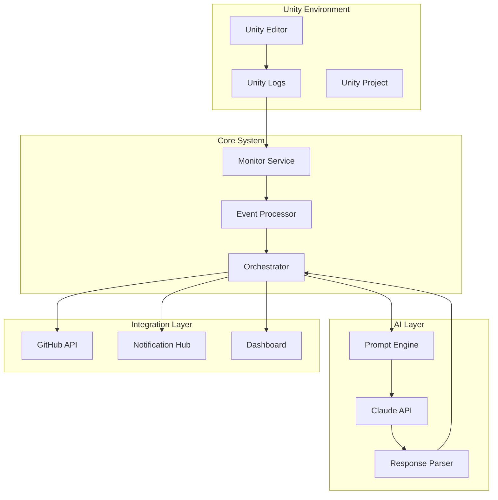

# System Architecture

Unity-Claude-Automation follows a modular, event-driven architecture designed for scalability and maintainability.

## Overview



## Core Components

### 1. Bootstrap Orchestrator

The central coordination system that manages all subsystems:

- **Manifest-based initialization**: Loads modules based on dependency order
- **State management**: Maintains global system state
- **Event routing**: Distributes events to appropriate handlers
- **Lifecycle management**: Handles startup, shutdown, and recovery

### 2. Monitor Service

Watches Unity and system events:

- **FileSystemWatcher**: Monitors Unity Editor logs and project files
- **Log Parser**: Extracts errors, warnings, and compilation status
- **Change Detection**: Identifies code changes and build triggers
- **Performance Metrics**: Tracks build times and error frequencies

### 3. Event Processing Pipeline

Handles all system events asynchronously:

```powershell
Event Flow:
1. Event Detection (FileSystemWatcher)
2. Event Classification (Error/Warning/Info)
3. Event Enrichment (Add context)
4. Event Routing (To appropriate handler)
5. Event Processing (Action execution)
6. Event Logging (Audit trail)
```

### 4. AI Integration Layer

Interfaces with Claude API for intelligent assistance:

- **Prompt Generation**: Creates context-aware prompts
- **Response Processing**: Parses and validates AI responses
- **Code Generation**: Produces fix suggestions
- **Learning System**: Improves based on feedback

## Module System

### Module Structure

Each module follows this structure:

```
Unity-Claude-ModuleName/
├── Unity-Claude-ModuleName.psd1  # Module manifest
├── Unity-Claude-ModuleName.psm1  # Module script
├── Public/                        # Exported functions
├── Private/                       # Internal functions
├── Config/                        # Configuration files
└── Tests/                         # Pester tests
```

### Core Modules

#### Unity-Claude-SystemStatus
- System health monitoring
- Resource usage tracking
- Performance metrics
- Status reporting

#### Unity-Claude-Configuration
- Settings management
- Configuration validation
- Environment setup
- Credential storage

#### Unity-Claude-EventLog
- Event logging
- Audit trails
- Error tracking
- Analytics

#### Unity-Claude-GitHub
- Issue creation
- PR management
- Repository integration
- CODEOWNERS support

#### Unity-Claude-NotificationHub
- Email notifications
- Webhook integration
- Slack/Discord alerts
- Custom notifications

#### Unity-Claude-RepoAnalyst
- Code analysis
- Documentation generation
- Dependency mapping
- Quality metrics

## Communication Patterns

### Event-Driven Architecture

```powershell
# Event emission
New-Event -SourceIdentifier "Unity.Error.Detected" `
          -MessageData @{
              Error = $errorDetails
              File = $filePath
              Line = $lineNumber
          }

# Event handling
Register-EngineEvent -SourceIdentifier "Unity.Error.Detected" `
                    -Action { 
                        Process-UnityError $Event.MessageData 
                    }
```

### Message Queue

Uses PowerShell runspaces for async processing:

```powershell
$RunspacePool = [RunspaceFactory]::CreateRunspacePool(1, 10)
$RunspacePool.Open()

$Jobs = @()
foreach ($task in $tasks) {
    $PowerShell = [PowerShell]::Create()
    $PowerShell.RunspacePool = $RunspacePool
    $PowerShell.AddScript($ScriptBlock).AddArgument($task)
    $Jobs += $PowerShell.BeginInvoke()
}
```

### Inter-Process Communication

For Python integration:

```powershell
# Named pipe for IPC
$PipeName = "Unity-Claude-IPC"
$Pipe = New-Object System.IO.Pipes.NamedPipeServerStream($PipeName)
```

## Data Flow

### Error Detection to Resolution

1. **Detection**: FileSystemWatcher detects change in Editor.log
2. **Parsing**: Extract error details (file, line, message)
3. **Context**: Gather surrounding code and project info
4. **AI Analysis**: Send to Claude for analysis
5. **Solution**: Receive and parse fix suggestions
6. **Action**: Apply fix or create GitHub issue
7. **Verification**: Monitor for resolution

### State Management

```powershell
# Global state stored in synchronized hashtable
$Global:UnityClaudeState = [hashtable]::Synchronized(@{
    Status = "Running"
    Errors = @()
    ActiveBuilds = @()
    Metrics = @{}
})
```

## Security Architecture

### Credential Management

- Windows Credential Manager for API keys
- Encrypted configuration files
- Environment variable fallbacks
- No hardcoded secrets

### Access Control

- PowerShell execution policies
- Module signing
- Restricted runspaces
- Audit logging

## Performance Considerations

### Optimization Strategies

1. **Lazy Loading**: Modules loaded on-demand
2. **Caching**: Results cached with TTL
3. **Throttling**: Rate limiting for API calls
4. **Parallel Processing**: Runspace pools for concurrency
5. **Debouncing**: Prevent duplicate event processing

### Resource Management

```powershell
# Memory management
[System.GC]::Collect()
[System.GC]::WaitForPendingFinalizers()

# Runspace cleanup
$RunspacePool.Close()
$RunspacePool.Dispose()
```

## Deployment Architecture

### Local Deployment

Single machine setup:
- PowerShell modules in PSModulePath
- Configuration in %APPDATA%
- Logs in designated directory

### Distributed Deployment

Multi-machine setup:
- Central configuration server
- Distributed agents
- Shared state via Redis/SQL
- Message queue (RabbitMQ/Azure Service Bus)

## Extensibility

### Plugin System

Create custom modules:

```powershell
# Custom module manifest
@{
    ModuleVersion = '1.0.0'
    RequiredModules = @('Unity-Claude-Core')
    FunctionsToExport = @('Start-CustomProcessor')
    PrivateData = @{
        PSData = @{
            Tags = @('Unity', 'Automation', 'Custom')
        }
    }
}
```

### Hooks and Filters

```powershell
# Register custom hook
Register-UnityClaudeHook -Name "PreProcess" `
                        -Action { 
                            # Custom preprocessing 
                        }

# Add filter
Add-UnityClaudeFilter -Type "Error" `
                     -Pattern "CustomPattern" `
                     -Action { 
                         # Custom handling 
                     }
```

## Monitoring and Observability

### Metrics Collection

- Performance counters
- Custom metrics
- Event statistics
- Resource usage

### Health Checks

```powershell
Test-UnityClaudeHealth -Components @(
    "FileWatcher",
    "EventProcessor", 
    "AIConnection",
    "GitHubIntegration"
)
```

### Logging Strategy

- Structured logging (JSON)
- Log aggregation
- Centralized logging
- Log rotation

## Disaster Recovery

### Backup Strategy

- Configuration backups
- State snapshots
- Log archives
- Recovery points

### Failover Mechanisms

- Automatic restart
- State recovery
- Queue persistence
- Transaction logs

## Next Steps

- Explore [Modules Overview](../modules/overview.md) for detailed module documentation
- Read [Advanced Topics](../advanced/multi-agent.md) for complex scenarios
- Check [Development Guide](../development/contributing.md) to extend the system