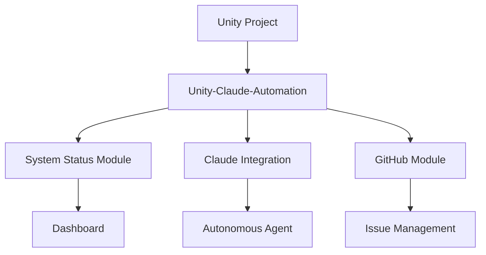

# Unity-Claude-Automation

## Welcome to Unity-Claude-Automation Documentation

Unity-Claude-Automation is a comprehensive automation framework that bridges Unity development with Claude AI capabilities, providing intelligent automation, monitoring, and integration features for Unity projects.

## Key Features

- **Unity Automation**: Automated compilation, error detection, and project management
- **Claude AI Integration**: Intelligent response generation and autonomous monitoring
- **System Status Monitoring**: Real-time tracking of subsystems and processes
- **Multi-Agent Architecture**: Distributed processing with specialized agents
- **GitHub Integration**: Automated issue management and PR workflows
- **Event-Driven Notifications**: Email and webhook notifications for critical events

## Quick Start

Get started with Unity-Claude-Automation in just a few steps:

1. **[Installation Guide](getting-started/installation.md)** - Set up the framework
2. **[Quick Start Tutorial](getting-started/quick-start.md)** - Run your first automation
3. **[Configuration](getting-started/configuration.md)** - Customize for your project

## Architecture Overview



## Documentation Structure

### For Users

- **[User Guide](user-guide/overview.md)** - Complete guide for using the framework
- **[Modules](modules/overview.md)** - Detailed documentation for each module
- **[Resources](resources/troubleshooting.md)** - Troubleshooting and FAQ

### For Developers

- **[API Reference](api/powershell/core.md)** - Complete API documentation
- **[Development Guide](development/contributing.md)** - Contributing guidelines
- **[Advanced Topics](advanced/multi-agent.md)** - Advanced architecture patterns

## Implementation Status

### Phase 1 Complete: Repository Structure & Module Architecture
- **Directory Structure**: Complete multi-agent architecture foundation
- **PowerShell Module**: 25+ functions with 100% test success rate
- **Code Analysis Pipeline**: Ripgrep, ctags, AST parsing, code graphs
- **PowerShell 5.1 Compatibility**: Full compatibility confirmed

### Phase 2 Complete: Static Analysis Integration
- **Advanced Pattern Recognition**: Enhanced regex and semantic analysis
- **Security Scanning**: Integration with static analysis tools
- **Code Quality Metrics**: Comprehensive quality assessment

### Phase 3 In Progress: Documentation Generation Pipeline
- **Day 1-2**: Documentation parsers - COMPLETED
- **Day 3-4**: Quality tools (Vale, markdownlint) - COMPLETED
- **Day 5**: MkDocs Material Setup - IN PROGRESS

## Prerequisites

- PowerShell 5.1 or later (PowerShell 7.5+ recommended)
- Python 3.10+ (for documentation generation)
- ripgrep (rg) installed and in PATH
- universal-ctags installed (optional)
- Git repository access

## Basic Usage

```powershell
# Import the repo analyst module
Import-Module .\Modules\Unity-Claude-RepoAnalyst\Unity-Claude-RepoAnalyst.psd1

# Start autonomous monitoring
.\Start-UnityClaudeAutomation.ps1

# Generate code graph
$graph = New-CodeGraph -ProjectPath $pwd

# Search for patterns
$results = Invoke-RipgrepSearch -Pattern "function.*\{" -FileType powershell
```

## Latest Updates

!!! tip "Version 2.0.0 Released"
    Major update with enhanced GitHub integration, event logging, and performance improvements.
    [View Changelog](about/changelog.md)

## Getting Help

- **[FAQ](resources/faq.md)** - Frequently asked questions
- **[Troubleshooting](resources/troubleshooting.md)** - Common issues and solutions
- **[GitHub Issues](https://github.com/Unity-Claude-Automation/issues)** - Report bugs or request features

## Contributing

We welcome contributions! Please see our [Contributing Guide](development/contributing.md) for details on how to get started.

## License

Unity-Claude-Automation is licensed under the MIT License. See [License](about/license.md) for details.

---

**Last Updated**: 2025-08-23  
**Version**: 2.0.0  
**Module Status**: Production Ready